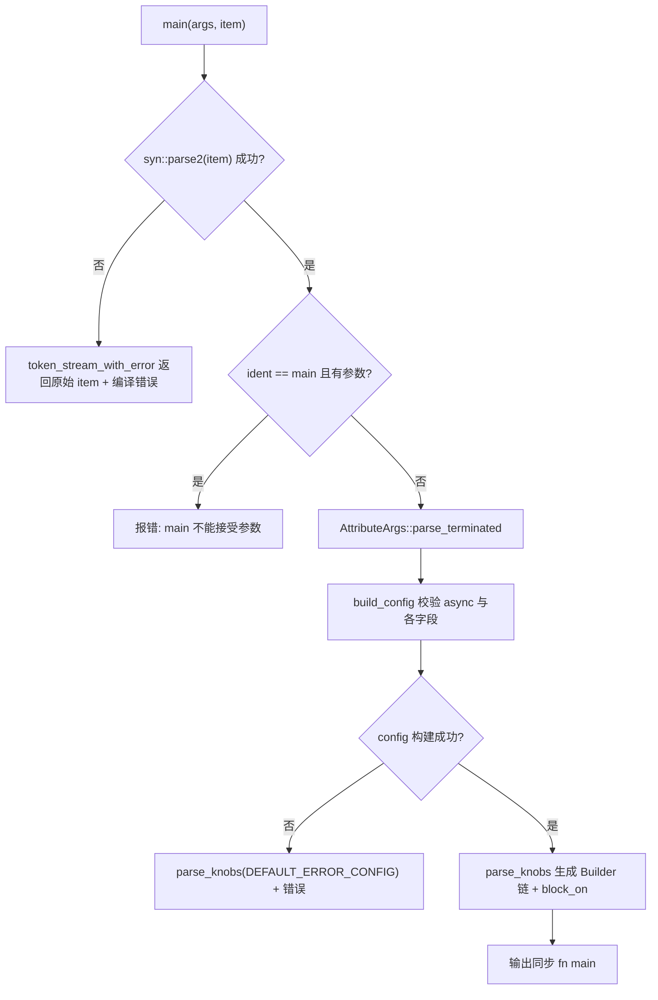
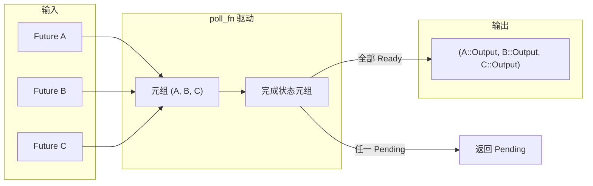

# Capítulo 9: La magia de las macros: generación de código detrás de #[tokio::main], select! y join!

En el capítulo anterior vimos`block_on`y cómo el pool de hilos bloqueantes delimita las fronteras de capacidad del runtime asíncrono, mientras que los usuarios casi nunca escriben a mano estas fronteras: escriben`#[tokio::main]`、`select!`、`join!`, dejando que la macro despliegue este código repetitivo en tiempo de compilación. Las macros son la primera capa de azúcar que Tokio ofrece al usuario y también el lugar donde realmente se genera el código de runtime en tiempo de compilación. Este capítulo se centra en`tokio-macros`crate y`tokio/src/macros/select.rs`, desglosando las tres rutas de expansión de macros más utilizadas, y responde con especial atención a una pregunta: tras la expansión de la macro, ¿cómo es realmente la cadena de llamadas, y por qué la semántica de cancelación segura de`select!`debe vigilarse por separado?

# 9.1 #[tokio::main]: reescribir async fn como Runtime::block_on

**Modelo intuitivo**：`#[tokio::main]`es como una «carta de encargo de reformas». Entregas una habitación en bruto (`async fn main`), y ella te instala la fontanería y la electricidad (construye el Runtime), coloca puertas y ventanas (`enable_all`), y finalmente mete dentro tus muebles originales (el cuerpo de la función). Sin ella, cada`main`tendría que escribir a mano`Builder::new_multi_thread().enable_all().build().unwrap().block_on(...)`, y el código repetitivo ahogaría la lógica de negocio.

## Estructuras de datos y diseño de memoria

La macro en sí no produce estructuras de datos en tiempo de ejecución, pero la configuración que analiza se coloca en dos structs.`Configuration`es un «acumulador mutable en fase de análisis», todos sus campos son`Option`, porque los parámetros del atributo pueden faltar, repetirse o ser ilegales[FACT:tokio-macros/src/entry.rs:74-84]. Nótese que`worker_threads`、`start_paused`、`unhandled_panic`llevan`Span`—esto es para localizar el error en la línea que escribió el usuario al reportar un error, y no dentro de la macro[FACT:tokio-macros/src/entry.rs:74-84]。`FinalConfig`en cambio es el «resultado inmutable tras la validación»,`flavor`ya no es`Option`, porque`build()`ya ha usado`default_flavor`como respaldo[FACT:tokio-macros/src/entry.rs:55-62]。

`RuntimeFlavor`solo tiene tres variantes:`CurrentThread`、`Threaded`、`Local` [FACT:tokio-macros/src/entry.rs:10-14]。`from_str`incluye deliberadamente mensajes amigables para nombres heredados:`single_thread`indica que debería llamarse`current_thread`，`basic_scheduler`indica que ha cambiado de nombre,`threaded_scheduler`indica que ha cambiado de nombre[FACT:tokio-macros/src/entry.rs:17-27]. Este es un diseño típico de la macro como «primer punto de contacto del usuario»: el mensaje de error es documentación.

## Proceso de expansión paso a paso

Escenario: el usuario escribe`#[tokio::main(flavor = "multi_thread", worker_threads = 4)] async fn main() { ... }`。

Primer paso,`main`la entrada primero analiza el item como un`ItemFn` [FACT:tokio-macros/src/entry.rs:577-580]personalizado. Este`ItemFn`no es`syn::ItemFn`, sino un analizador implementado por el propio Tokio, cuya razón está escrita en los comentarios: no quiere analizar recursivamente toda la sentencia, solo hace un análisis ligero de «almacenar en búfer por token tree y dividir al encontrar punto y coma»[FACT:tokio-macros/src/entry.rs:720-764]. Esto evita la sobrecarga de construir un AST completo del cuerpo de la función dentro de la macro.

Segundo paso,`build_config`valida`async`si la palabra clave existe; si falta, reporta "the`async` keyword is missing" [FACT:tokio-macros/src/entry.rs:346-349]. Luego recorre los parámetros del atributo, enviando`worker_threads`、`flavor`、`start_paused`、`crate`、`unhandled_panic`、`name`al setter correspondiente[FACT:tokio-macros/src/entry.rs:369-399]. Nótese que`core_threads`se rechaza explícitamente y se indica que ha cambiado de nombre[FACT:tokio-macros/src/entry.rs:379-382]。

Tercer paso,`Configuration::build`realiza la validación de consistencia entre campos. Aquí hay tres restricciones clave:`worker_threads`solo permite`multi_thread` [FACT:tokio-macros/src/entry.rs:197-217]；`start_paused`solo permite`current_thread`/`local` [FACT:tokio-macros/src/entry.rs:219-229]；`unhandled_panic`igualmente solo permite`current_thread`/`local` [FACT:tokio-macros/src/entry.rs:231-241]. Si el usuario eligió`multi_thread`pero`rt-multi-thread`la feature no está activada, el mensaje de error será diferente según si se especificó explícitamente el flavor[FACT:tokio-macros/src/entry.rs:209-216]。

Cuarto paso,`parse_knobs`genera el código. Primero elimina`asyncness` [FACT:tokio-macros/src/entry.rs:441], y luego elige el punto de partida del builder según el flavor:`CurrentThread`/`Local`usa`Builder::new_current_thread()`，`Threaded`usa`Builder::new_multi_thread()` [FACT:tokio-macros/src/entry.rs:468-477]。`Local`lo especial es que la llamada a build es`build_local(Default::default())`en lugar de`build()` [FACT:tokio-macros/src/entry.rs:479-483]. Después añade encadenadamente según sea necesario`.worker_threads(#v)`、`.start_paused(#v)`、`.unhandled_panic(...)`、`.name(#v)` [FACT:tokio-macros/src/entry.rs:485-497]。

Quinto paso, genera el cuerpo final de la función. El núcleo es`last_block`：`return #rt.enable_all().#build.expect("Failed building the Runtime").block_on(body)` [FACT:tokio-macros/src/entry.rs:509-522]. Nótese ese`return`explícito, cuyo comentario apunta a tokio-rs/tokio#4636, para corregir un problema de inferencia de tipos[FACT:tokio-macros/src/entry.rs:508]。

Sexto paso, el cuerpo de la función se envuelve en`async #body`y se somete a comprobación de tipos. En la ruta que no es test, si el tipo de retorno no es`!`y no contiene`impl Trait`, se inserta`if false { let _: &dyn Future<Output = #output_type> = &body; }`para hacer una aserción en tiempo de compilación[FACT:tokio-macros/src/entry.rs:551-571]. La ruta test en cambio usa`pin!`fijar body en la pila y convertirlo a`Pin<&mut dyn Future>`, el comentario explica que esto es para reducir`block_on`la sobrecarga de compilación de la instanciación genérica[FACT:tokio-macros/src/entry.rs:526-548]。



## Reflexiones de diseño y trampas en producción

`main`y`test`comparten`parse_knobs`, pero el flavor predeterminado es diferente:`test`por defecto`CurrentThread`，`main`por defecto`Threaded` [FACT:tokio-macros/src/entry.rs:91-94]. Esto explica por qué`#[tokio::test]`es de un solo hilo por defecto — las pruebas normalmente no necesitan múltiples núcleos, y el modo de un solo hilo es más fácil de reproducir.

Una trampa fácil de pasar por alto: después de la expansión del macro, cada llamada a la función crea un nuevo Runtime. La documentación advierte explícitamente que si la función se llama con frecuencia, se debería usar Builder para reutilizar el Runtime[FACT:tokio-macros/src/lib.rs:31-35]. Usar`#[tokio::main]`en una función normal es legal, pero cada llamada paga el costo de construir un Runtime.

Otra trampa es`crate`el renombrado. Cuando el usuario`use tokio as tokio1`, el`tokio::runtime::Builder`generado por defecto dentro del macro no encontrará la ruta, y se debe especificar explícitamente`crate = "tokio1"` [FACT:tokio-macros/src/lib.rs:239-264]。`parse_knobs`en`crate_path`el valor predeterminado de`Ident::new("tokio", ...)` [FACT:tokio-macros/src/entry.rs:456-462]es

# , que es precisamente la raíz del error en escenarios de renombrado.

**9.2 select!: sondeo multi-rama, máscara de bits y equidad aleatoria**：`select!`Modelo intuitivo`poll_fn`es como «un mesero que vigila múltiples ventanillas de recogida al mismo tiempo». La ventanilla que sirva primero, de esa se lleva la comida, y la cola de las demás ventanillas se descarta. Sin él, el usuario tendría que escribir manualmente

## para meter múltiples Future en una tupla y hacer poll uno por uno, además de manejar por su cuenta la lógica de «una vez que una rama está lista, las demás ramas deben descartarse».

`select!`Estructura de datos y diseño de memoria`__tokio_select_util`tras expandirse genera un módulo local`Out`, dentro del cual hay un enum`Mask` [FACT:tokio/src/macros/select.rs:615-619]。`Out`y un alias de tipo`_0`、`_1`el nombre de la variante es`Disabled`…… una por cada rama, más un[FACT:tokio-macros/src/select.rs:33-39]。`Mask`que representa que todas las ramas han fallado`u8`el tipo subyacente se elige dinámicamente según el número de ramas: ≤8 usa`u16`, ≤16 usa`u32`, ≤32 usa`u64`, ≤64 usa[FACT:tokio-macros/src/select.rs:17-31], y si supera 64 hace panic directamente`select!`. Esta máscara de bits es

el estado central: el bit i en 1 indica que la i-ésima rama ha sido deshabilitada.`futures`Todos los Future se almacenan en una tupla`IntoFuture::into_future`, cada elemento primero pasa por[FACT:tokio/src/macros/select.rs:654-656]la conversión`futures_init`. Nótese que aquí primero se construye`into_future`y luego se aplica uno por uno[FACT:tokio/src/macros/select.rs:641-646], el comentario explica que esto es para aprovechar la extensión del tiempo de vida temporal`let mut futures = &mut futures;`. Posteriormente`poll_fn`degrada la tupla a una referencia mutable, evitando que[FACT:tokio/src/macros/select.rs:658-662]。

## el closure se apropie de la propiedad

Flujo de sondeo paso a paso`select! { v = stream1.next() => ..., v = stream2.next() => ..., else => break }`。

Contextualizando el escenario:`biased;`Primer paso, coincidencia de reglas de entrada del macro. Si hay`start=0` [FACT:tokio/src/macros/select.rs:801-803]prefijo,`start`; de lo contrario`thread_rng_n(BRANCHES)` [FACT:tokio/src/macros/select.rs:805-809]es una expresión aleatoria[FACT:tokio/src/macros/select.rs:61-65]。

. Esta es la fuente de equidad que la documentación describe como «seleccionar aleatoriamente una rama para verificar primero»`(skip) pat = fut, if cond => handler,`Segundo paso, normalización. tt-muncher normaliza cada rama a la forma`skip`,`_`es una secuencia de[FACT:tokio/src/macros/select.rs:770-793]。`skip`, cuya longitud es igual al número de branches anteriores a esa rama`futures_init.$($skip)*`se usa tanto para generar el acceso a los campos de la tupla`count!`, como para

calcular el índice de la rama.`if $c`Tercer paso, evaluación de precondiciones. Para cada rama`disabled |= 1 << index` [FACT:tokio/src/macros/select.rs:631-636], si es false, entonces`$fut`. Nota: incluso si la rama está deshabilitada, su[FACT:tokio/src/macros/select.rs:39-41]。

expresión aún se evalúa, solo que no se hace poll`poll_fn`Cuarto paso, entrar en`ready!(poll_budget_available(cx))`el closure. Primero se verifica el presupuesto de cooperación:`Pending` [FACT:tokio/src/macros/select.rs:664-667], si el presupuesto se agota, se retorna directamente`select!`. Esto garantiza que

no acapare el worker.`for i in 0..BRANCHES`，`branch = (start + i) % BRANCHES` [FACT:tokio/src/macros/select.rs:680-685]Quinto paso, bucle`disabled & mask == mask`. Para cada branch: primero se consulta`continue` [FACT:tokio/src/macros/select.rs:694-699], si ya está deshabilitada entonces`Pin::new_unchecked`; de lo contrario se extrae ese Future de la tupla, se envuelve con[FACT:tokio/src/macros/select.rs:701-707](la seguridad depende de que el Future esté en la pila y no se mueva)`Ready(out)`; se hace poll,`disabled |= mask`entonces primero[FACT:tokio/src/macros/select.rs:710-730]。

y luego se hace coincidir el patrón`out`Sexto paso, coincidencia de patrones. Si`$bind`coincide con`Poll::Ready(Out::_i(out))` [FACT:tokio/src/macros/select.rs:727-733], retorna`continue`; si no coincide,[FACT:tokio/src/macros/select.rs:44-47]。

continúa sondeando otras ramas — esto es precisamente lo que el paso 5 de la documentación describe como «si el patrón no coincide, deshabilitar la rama actual»`is_pending`Séptimo paso, fin del bucle. Si`Pending`es true, retorna`Out::Disabled` [FACT:tokio/src/macros/select.rs:740-745], de lo contrario todas las ramas han fallado, retorna`match output`. El`Out::_i`externo mapea`Disabled`al handler correspondiente,`else`se mapea a[FACT:tokio/src/macros/select.rs:749-755]。

```mermaid
flowchart TD
    start["poll_fn 闭包被调用"] --> budget{"poll_budget_available(cx)?"}
    budget -->|否| pending_budget["返回 Pending"]
    budget -->|是| init["is_pending = false; start = $start"]
    init --> loop{"i |否| check_pending{"is_pending?"}
    check_pending -->|是| pending["返回 Pending"]
    check_pending -->|否| disabled_out["返回 Out::Disabled"]
    loop -->|是| branch["branch = (start+i) % BRANCHES"]
    branch --> is_disabled{"disabled & mask == mask?"}
    is_disabled -->|是| next_i["i += 1"]
    is_disabled -->|否| poll_fut["Pin::new_unchecked(fut).poll(cx)"]
    poll_fut --> poll_res{"Poll 结果?"}
    poll_res -->|Pending| set_pending["is_pending = true; i += 1"]
    poll_res -->|Ready| disable["disabled |= mask"]
    disable --> pat_match{"out 匹配 $bind?"}
    pat_match -->|否| next_i
    pat_match -->|是| ready_out["返回 Out::_i(out)"]
    next_i --> loop
    set_pending --> loop
```

## Copiar

**Reflexiones de diseño y trampas en producción`Vec<bool>`？**¿Por qué usar una máscara de bits en lugar de`disabled |= mask`? La máscara de bits es un único entero en la pila, sin asignación en el heap, y`select!`es una sola instrucción. Para

**en la ruta caliente, esto evita el acceso al heap en cada iteración.**¿Por qué deshabilitar la rama cuando el patrón no coincide?`select!`Esta es`Some(v) = stream.next() => ...`la diferencia clave con una «race simple». Considérese`stream.next()`, si`None`retorna[FACT:tokio/src/macros/select.rs:198-223]。

**(fin del stream), el patrón no coincide, esa rama se deshabilita permanentemente, evitando sondear infinitamente un stream que ya terminó. El ejemplo de la documentación se basa precisamente en esta semántica para recolectar dos streams hasta que ambos terminen**：`select!`El verdadero significado de cancel safety`read_exact`、`read_to_end`、`write_all`Una vez que una rama está lista, los Future de las demás ramas se dropean. Si el Future dropeado ya consumió datos pero aún no ha retornado, los datos se pierden. La documentación enumera explícitamente[FACT:tokio/src/macros/select.rs:119-124]no es cancel safe`Mutex::lock`、`Semaphore::acquire`, mientras que[FACT:tokio/src/macros/select.rs:126-133]debido a la equidad de la cola, la cancelación perderá la posición en la cola`.await`. Método de determinación: buscar`.await`el punto, si reiniciar la función en[FACT:tokio/src/macros/select.rs:135-139]。

**`if`sigue siendo correcto, entonces es cancel safe**La trampa de carrera en las precondiciones`if !sleep.is_elapsed()`: la documentación da un ejemplo clásico de error — usar`sleep`para proteger`is_elapsed()`la rama, pero`while`puede volverse true entre la verificación de`select!`y[FACT:tokio/src/macros/select.rs:336-376], provocando que el timeout se pierda`if`. La forma correcta es eliminar`sleep`, dejar que`break` [FACT:tokio/src/macros/select.rs:378-405]。

**`biased;`la rama siempre participe en el sondeo, y después del timeout**el costo de[FACT:tokio/src/macros/select.rs:67-74]: el RNG aleatorio tiene costo de CPU, y algunos escenarios requieren un orden de sondeo determinista`biased;`. Pero[FACT:tokio/src/macros/select.rs:75-81]。

# deja la responsabilidad de la equidad al usuario: si una rama siempre está lista, las ramas posteriores se morirán de inanición

**9.3 join! y las restricciones de ingeniería de la expansión de macros**：`join!`Modelo intuitivo`select!`es como «esperar al mismo tiempo a que lleguen todos los paquetes». No como`Ready`donde quien llega primero cancela a los demás, sino que agrega los valores`poll_fn`de todos los Future en una tupla. Sin él, el usuario tendría que escribir manualmente

## para mantener el estado de finalización de cada Future.

`join!`La expansión de también se basa en almacenar Future en tuplas, pero el estado no es una máscara de bits, sino una tupla de «valores completados». Cuando cada Future se completa, su valor se extrae y se almacena en la tupla de resultados, y la ranura correspondiente se marca como completada. A diferencia de`select!`,`join!`no descarta los Future no completados — debe esperar a que todos los Future se completen antes de retornar.

## Flujo paso a paso

`join!`La lógica de sondeo de comparte el esqueleto de «tupla almacena Future +`select!`impulsado» con`poll_fn`, pero con semántica opuesta:`select!`es «retorna cuando cualquiera esté listo»,`join!`es «retorna solo cuando todos estén listos». Cada ronda de poll recorre todos los Future no completados, si cualquiera retorna`Pending`entonces el conjunto`Pending`, si todos`Ready`entonces agrega y retorna.



## Reflexiones de diseño y trampas en producción

`join!`La semántica de seguridad ante cancelación de es diferente de`select!`:`join!`cuando se descarta, todos los Future no completados también se descartan, igualmente puede perderse datos. Pero como`join!`no cancela activamente ninguna rama, no hace como`select!`que «cancela esta rama porque otra rama está lista». El riesgo real está en que`join!`en su conjunto sea cancelado por un`select!`externo o por timeout.

`join!`La diferencia entre y`try_join!`merece atención:`try_join!`retorna inmediatamente cuando cualquier Future retorna`Err`, cancelando los demás Future, por lo que hereda el riesgo de seguridad ante cancelación de`select!`.

# Reflexiones de diseño

**El macro como frontera de un generador de código en tiempo de compilación**。`#[tokio::main]`coloca la validación de configuración en tiempo de compilación, combinaciones ilegales (como`multi_thread` + `start_paused`) fallan directamente en compilación, en lugar de panic en tiempo de ejecución. Esta es la ventaja central del macro frente al Builder: errores anticipados.

**Arquitectura híbrida de macro declarativo + macro procedural**。`select!`El cuerpo principal de es`macro_rules!`, pero dos lógicas clave se delegan a macros procedurales:`select_priv_declare_output_enum`genera el enum`Out`y el tipo`Mask`limpia el[FACT:tokio-macros/src/lib.rs:658-660]，`select_priv_clean_pattern`en el patrón. ¿Por qué? Los comentarios explican: los macros declarativos difícilmente pueden generar código que «seleccione dinámicamente el tipo entero según el número de ramas», ni pueden hacer limpieza a nivel de token en posiciones de patrón`ref`/`mut` [FACT:tokio-macros/src/lib.rs:666-668]La necesidad de[FACT:tokio/src/macros/select.rs:577-579]。

**`clean_pattern`hace coincidir**。`select!`con`out`en forma de`&out`con el patrón[FACT:tokio/src/macros/select.rs:727], si el usuario escribe`ref v`, se convierte en`&ref v`causando error de tipo.`clean_pattern`elimina recursivamente`by_ref`、`mutability`, así como el`Reference`del patrón`mutability` [FACT:tokio-macros/src/select.rs:68-73][FACT:tokio-macros/src/select.rs:100-103]. Este es el compromiso que hace el macro entre la «intuición del usuario» y el «borrow checker».

**La realidad ingenieril del límite de 64 ramas**。`count!`、`count_field!`、`select_variant!`Los tres macros escriben a mano cada uno las reglas de coincidencia de 0 a 64[FACT:tokio/src/macros/select.rs:821-1017][FACT:tokio/src/macros/select.rs:1021-1217][FACT:tokio/src/macros/select.rs:1221-1414]. El comentario dice directamente «I'm not happy about it either»[FACT:tokio/src/macros/select.rs:816-817]. Este es el precio de que los macros declarativos no puedan hacer aritmética: solo se puede mapear a enteros codificando la cantidad de tokens.

# Resumen del capítulo

# Reflexiones y autoevaluación del capítulo

Q1: `select!`El`disabled`de la máscara de bits de se reinicializa a`select!`cada vez que se entra en`Default::default()` [FACT:tokio/src/macros/select.rs:627]. Si se mueve esta línea dentro del closure de`poll_fn`, ¿qué ocurriría en el escenario de «llamar select! en bucle y que el patrón de alguna rama no coincida»?

**Análisis de referencia**：`disabled`Si se inicializa dentro del closure, cada poll lo reiniciaría, provocando que las ramas deshabilitadas en la ronda anterior por no coincidir el patrón vuelvan a participar en el sondeo. Considere`Some(v) = stream.next() => ...`y que`stream`ya terminó (retornó`None`), tras no coincidir el patrón esa rama debería quedar permanentemente deshabilitada. Si`disabled`se reinicia, la siguiente ronda de poll volverá a hacer poll de este stream ya terminado, y si el stream no es fused (es decir, hacer poll de nuevo tras terminar puede causar panic o comportamiento indefinido), habrá problemas. Incluso si el stream es fused, se desperdicia CPU haciendo poll repetidamente de un stream que siempre retorna`None`. La documentación dice explícitamente «Re-entering select! due to a loop clears the disabled state»[FACT:tokio/src/macros/select.rs:37-38], refiriéndose a reentrar en el macro`select!`(nueva ronda de bucle), no a múltiples poll dentro del mismo`select!`.`disabled`debe inicializarse fuera del closure para poder mantener el estado entre múltiples poll de la misma llamada a`select!`.

Q2: `select!`tras hacer poll hasta`Ready(out)`primero ejecuta`disabled |= mask`y luego hace coincidir el patrón[FACT:tokio/src/macros/select.rs:720-730]. Si se elimina`disabled |= mask`, ¿qué ocurriría en el escenario donde el patrón no coincide y ese Future retorna inmediatamente`Ready`en cada poll?

**Análisis de referencia**: tras eliminar`disabled |= mask`, si`out`no coincide con`$bind`, el código va a`continue`y continúa sondeando otras ramas. Pero en la siguiente ronda cuando`poll_fn`sea llamado (por ejemplo, tras retornar`Pending`otra rama y volver a hacer poll), esta rama aún no está deshabilitada y se volverá a sondear. Si ese Future retorna inmediatamente`Ready`en cada poll y el valor no coincide con el patrón, se forma un livelock de «poll -> Ready -> no coincide -> continue -> otras ramas Pending -> retorna Pending -> poll de nuevo -> Ready de nuevo -> ...», con la CPU girando en vacío.`disabled |= mask`se marca inmediatamente tras`Ready`, asegurando que incluso si el patrón no coincide, esa rama no se vuelva a sondear. Note que el marcado ocurre antes de la coincidencia de patrón, por lo que tanto «Ready pero patrón no coincide» como «Ready y patrón coincide» deshabilitan esa rama — lo primero previene el livelock, lo segundo previene el consumo duplicado.

Q3: `parse_knobs`inserta`if false { let _: &dyn Future<Output = #output_type> = &body; }`en la ruta no-test para hacer verificación de tipos[FACT:tokio-macros/src/entry.rs:557-561], pero omite la verificación para tipos que retornan`!`o que contienen`impl Trait`. ¿Por qué[FACT:tokio-macros/src/entry.rs:551-556]necesita omitirse? ¿Qué pasaría si se forzara la verificación?`impl Trait`Análisis de referencia

**En la posición de retorno es un «tipo opaco», el compilador no permite convertirlo forzosamente a**：`impl Trait`, porque`&dyn Future<Output = impl Trait>`requiere un tipo concreto, mientras que`dyn` 要求具体类型，而 `impl Trait`El tipo concreto no es visible fuera de la función. Si se inserta una comprobación forzada, se producirá un error como «the size for values of type`impl Future`cannot be known at compilation time» o «cannot be made into an object». Lo mismo ocurre con el tipo de retorno de`!`:`!`se puede convertir forzosamente a cualquier tipo, pero`&dyn Future<Output = !>`de`Output = !`en sí mismo puede desencadenar problemas de características inestables del never type. El coste de omitir la comprobación es que, si el usuario escribe`async fn main() -> impl Trait`pero el tipo de retorno real no coincide con`impl Trait`, el error solo se revelará en`block_on`, y el mensaje de error puede no ser tan claro como el de una comprobación explícita. Esta es la compensación entre «integridad de la comprobación en tiempo de compilación» y «limitaciones del sistema de tipos».

La macro se encarga del código repetitivo y la validación en tiempo de compilación por parte del usuario, pero lo que genera sigue siendo un Future normal y una llamada a`poll`. En el próximo capítulo abandonaremos el mundo de compilación de las macros para entrar en la capa de abstracción de E/S en tiempo de ejecución, y veremos cómo`AsyncRead`/`AsyncWrite`divide el flujo de bytes en frames, y cómo el marco de códec de`Framed`funciona correctamente bajo las restricciones de cancelación segura de`select!`.

`#[tokio::main]`La esencia de`block_on`es «análisis de configuración + generación de cadena Builder +`select!`envoltura», la validación de configuración se completa en tiempo de compilación, y el flavor determina el punto de inicio del builder y el método build.`.await`El núcleo de`join!`es «almacenar Future en tuplas + registrar deshabilitaciones con máscara de bits + punto de inicio aleatorio para garantizar la equidad», si el patrón no coincide se deshabilita la rama, y la seguridad ante cancelación depende de si el Future descartado puede reiniciarse en`select!`.`AsyncRead`/`AsyncWrite`y`BufReader`/`BufWriter`comparten el esqueleto pero tienen semántica opuesta: el primero espera a que todo se complete, el segundo devuelve en cuanto cualquiera esté listo. Los tres juntos muestran la compensación central del diseño de macros de Tokio: delegar el código repetitivo y la validación en tiempo de compilación a las macros, y dejar la complejidad de la semántica en tiempo de ejecución (especialmente la seguridad ante cancelación) para que el usuario la entienda explícitamente. Después de entender cómo las macros generan código en tiempo de ejecución, la siguiente pregunta natural es: cuando este código realmente empieza a leer y escribir flujos de bytes, ¿qué abstracciones proporciona Tokio? El capítulo 10 analizará`copy_bidirectional`y el marco de códec, para ver cómo`Framed`reduce las llamadas al sistema, cómo
