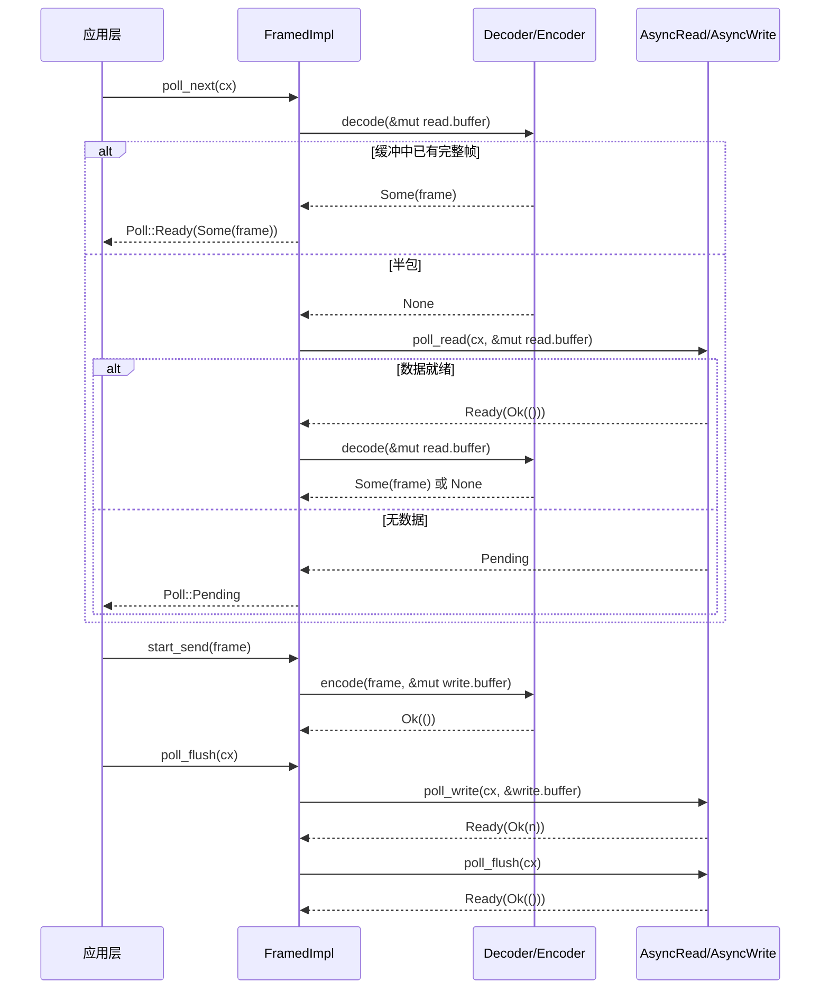

# Volver arriba ↑

Progreso del libro: Capítulo 10 / 14

# Estado de verificación: líneas FACT con anclaje real

## El capítulo anterior desglosó el proceso de expansión de tokio-macros, y vimos cómo #[tokio::main], select! y join! se encargan del código repetitivo y la validación en tiempo de compilación por parte del usuario. Pero lo que generan las macros sigue siendo un Future normal y una llamada a poll: cuando estos Future realmente empiezan a leer y escribir bytes, las únicas abstracciones de bajo nivel que proporciona Tokio son dos traits: AsyncRead y AsyncWrite. Su problema es que son «demasiado de bajo nivel»: un poll_read solo garantiza «se han leído algunos bytes», no garantiza «se ha leído un mensaje completo». Y la gran mayoría de protocolos (HTTP, Redis, gRPC, RPC personalizado) están orientados a «frames» en lugar de a «flujos de bytes». La pregunta central que este capítulo debe responder es: ¿dónde debería trazarse el límite de abstracción de la E/S asíncrona? La respuesta de Tokio tiene dos capas: tokio::io proporciona traits y utilidades a nivel de flujo de bytes (BufReader/BufWriter/copy_bidirectional), y el marco codec de tokio-util proporciona sobre ello adaptadores Stream/Sink a nivel de frame (Framed/LengthDelimitedCodec). Entender la división de trabajo entre estas dos capas es entender «por qué casi todas las implementaciones de protocolos empiezan por Framed».

`std::io::Read::read`1. AsyncRead/AsyncWrite: por qué no se puede reutilizar directamente std::io::Read`AsyncRead::poll_read`Modelo intuitivo`Poll::Pending`es «recogida bloqueante»: te quedas frente a la ventana y, si la mercancía no llega, esperas indefinidamente, y el hilo queda suspendido.`epoll`es «recogida con comprobante de comida»: preguntas una vez «¿ya está?», si no está (`AsyncRead`) te vas a hacer otras cosas, y al mismo tiempo dejas un Waker para que el sistema te avise cuando llegue la mercancía. Sin este trait, toda la E/S asíncrona tendría que implementar manualmente el registro de

## y el mapeo de Waker; esto es exactamente lo que hace el Reactor del capítulo 5, y

`AsyncRead`es la fachada unificada que expone hacia las capas superiores.

```rust
pub trait AsyncRead {
    fn poll_read(
        self: Pin,
        cx: &mut Context,
        buf: &mut ReadBuf,
    ) -> Poll>;
}
```

[FACT:tokio/src/io/async_read.rs:44-60]

La definición de`self: Pin<&mut Self>`es extremadamente concisa, con un solo método:`&mut self`Copiar`AsyncRead`Los tres parámetros tienen su razón de ser.`async fn`en lugar de`Pin`: porque`cx: &mut Context<'_>`a menudo es retenido por el Future generado por`buf: &mut ReadBuf<'_>`, y un Future, una vez que es poll, no puede moverse (auto-referencia),`&mut [u8]`es un contrato impuesto por el compilador.`std::io::Read`Esa ambigüedad de «devuelve el número de bytes leídos pero el búfer puede no estar inicializado».

La documentación enumera explícitamente tres semánticas de retorno[FACT:tokio/src/io/async_read.rs:15-32]：`Ready(Ok(()))`indica que los datos se han escrito`buf`, la cantidad leída viene determinada por el incremento de longitud de`ReadBuf::filled`; si el incremento es 0, o bien es EOF, o bien es`buf.remaining() == 0`(búfer de capacidad cero);`Pending`indica que actualmente no es legible pero ya se ha registrado un despertar;`Ready(Err(e))`es un error de E/S subyacente. Aquí hay una trampa fácil de pasar por alto:**«cantidad leída igual a 0» no equivale a EOF**—si el llamador pasa un búfer de capacidad cero,`poll_read`devolverá inmediatamente`Ready(Ok(()))`pero no habrá leído nada. Si la capa superior trata «0 bytes» como EOF, juzgará erróneamente que la conexión se ha cerrado.

## Walkthrough guiado por escenarios: leer un fragmento de bytes desde`&[u8]`Consideremos la implementación más simple: la copia de

hacia`&[u8]`de`AsyncRead`：

```rust
impl AsyncRead for &[u8] {
    fn poll_read(
        mut self: Pin,
        _cx: &mut Context,
        buf: &mut ReadBuf,
    ) -> Poll> {
        let amt = std::cmp::min(self.len(), buf.remaining());
        let (a, b) = self.split_at(amt);
        buf.put_slice(a);
        *self = b;
        Poll::Ready(Ok(()))
    }
}
```

[FACT:tokio/src/io/async_read.rs:98-108]

es la longitud del segmento restante sin leer,`self.len()`es la capacidad restante del búfer destino, se toma el menor de ambos`buf.remaining()`se divide el segmento en «el`amt`。`split_at(amt)`que se copiará esta vez» y «el`a`restante por leer»`b`」。`buf.put_slice(a)`se copia`a`en`ReadBuf`y se avanza su puntero filled.`*self = b`se avanza el propio segmento a la parte restante—esta es la clave de`&[u8]`como «cursor»: tras cada poll,`self`apunta a la parte no leída. Finalmente se devuelve`Ready(Ok(()))`, porque un segmento en memoria siempre está «listo», nunca`Pending`。

Obsérvese que`_cx`se ignora: una fuente de datos en memoria no necesita Waker. Esto contrasta con un socket de red—este último, cuando no hay datos, devuelve`Pending`y registra interés de legibilidad.

`io::Cursor<T>`La implementación de[FACT:tokio/src/io/async_read.rs:113-134]añade una capa de verificación de límites`position()`: primero se toma`pos > slice.len()`, si`Ready(Ok(()))`(posición fuera de límites) se devuelve directamente[FACT:tokio/src/io/async_read.rs:113-134]sin panic`Cursor`. Este es un diseño defensivo:`set_position`la position de

## puede ser establecida a cualquier valor por un

`AsyncRead`externo; cuando está fuera de límites, tratarlo como «ya leído por completo» se ajusta más a la semántica de E/S que un panic.`Box<T>`、`&mut T`、`Pin<P>`Reflexión de diseño: el macro deref y la propagación de Pin`deref_async_read!`proporciona a[FACT:tokio/src/io/async_read.rs:64-70]una implementación de reenvío. Los dos primeros generan`Pin::new(&mut **self).poll_read(cx, buf)`mediante el macro`Pin<&mut Box<T>>`, cuya esencia es`Pin<&mut T>`—desreferenciar`Pin<P>`a[FACT:tokio/src/io/async_read.rs:87-93]y luego reenviar.`crate::util::pin_as_deref_mut(self)`La implementación de`Pin<&mut Pin<P>>`es más sutil`Pin<&mut P::Target>`: llama a`Pin`, proyectando

> **[Design Inference & Architectural Trade-offs]**
> . Esta capa de proyección es necesaria; de lo contrario, un`Box<dyn AsyncRead>`、`&mut T`anidado`poll_read`provocaría un desajuste de tipos.`Pin`〔Inferencia de diseño y compensaciones arquitectónicas〕

---

# La motivación de diseño aquí es la «abstracción de coste cero»: las implementaciones de reenvío permiten que tipos envoltorio como

## no necesiten escribir a mano

`copy_bidirectional`, manteniendo al mismo tiempo la semántica correcta de`copy`. El coste es que cada capa de reenvío introduce una llamada indirecta, que el compilador normalmente puede eliminar mediante inline.`select!`II. copy_bidirectional: la máquina de estados del reenvío bidireccional`select!`Modelo intuitivo`copy_bidirectional`es un «camarero bidireccional»: vigila simultáneamente las dos direcciones A→B y B→A, y cualquier dato leído en un lado se escribe en el opuesto. Sin él, implementar un proxy TCP requeriría escribir a mano dos

## Future y combinarlos con

—y la restricción de seguridad ante cancelación de

```rust
enum TransferState {
    Running(CopyBuffer),
    ShuttingDown(u64),
    Done(u64),
}
```

[FACT:tokio/src/io/util/copy_bidirectional.rs:10-14]

`Running`utiliza una máquina de estados explícita para conservar los estados intermedios de «leer-escribir-cerrar», logrando así seguridad ante cancelación.`CopyBuffer`Estructura de datos y diseño de memoria`ShuttingDown(u64)`El núcleo es una enumeración de tres estados:`Done(u64)`Copiar**posee**。

`CopyBuffer`(que contiene un búfer de 8KB y contadores de lectura/escritura), indicando «se están transfiriendo datos».`copy.rs`lleva el número de bytes ya copiados, indicando «el lado de lectura ha llegado a EOF, se está cerrando el lado de escritura».`DEFAULT_BUF_SIZE`indica «cierre completado, se registra el número final de bytes». Esta enumeración es la clave de la seguridad ante cancelación:[FACT:tokio/src/io/util/copy_bidirectional.rs:76-88]en cualquier momento en que se haga drop, el estado se conserva en la enumeración, y el siguiente poll puede continuar desde el punto de interrupción`CopyBuffer`proviene de

## , el tamaño predeterminado lo determina

`copy_bidirectional_impl`(8KB)`poll_fn`. Cada dirección posee un

```rust
let mut a_to_b = TransferState::Running(a_to_b_buffer);
let mut b_to_a = TransferState::Running(b_to_a_buffer);
poll_fn(|cx| {
    let a_to_b = transfer_one_direction(cx, &mut a_to_b, a, b)?;
    let b_to_a = transfer_one_direction(cx, &mut b_to_a, b, a)?;
    let a_to_b = ready!(a_to_b);
    let b_to_a = ready!(b_to_a);
    Poll::Ready(Ok((a_to_b, b_to_a)))
})
.await
```

[FACT:tokio/src/io/util/copy_bidirectional.rs:127-151]

Walkthrough guiado por escenarios: el ciclo de vida completo de un reenvío bidireccional`transfer_one_direction`utiliza`Poll`。`ready!`para combinar las máquinas de estados de ambas direcciones:`Pending`Copiar**Obsérvese el orden de llamada de**: primero se avanza a→b, luego b→a, ambos devuelven[FACT:tokio/src/io/util/copy_bidirectional.rs:143-144]El macro devuelve inmediatamente cuando cualquiera de las direcciones no ha terminado`ready!`—pero`Done(count)`el estado de la otra dirección ya ha sido avanzado

`transfer_one_direction`. Esto es precisamente lo que el comentario enfatiza como`loop`: aunque

```rust
loop {
    match state {
        TransferState::Running(buf) => {
            let count = ready!(buf.poll_copy(cx, r.as_mut(), w.as_mut()))?;
            *state = TransferState::ShuttingDown(count);
        }
        TransferState::ShuttingDown(count) => {
            ready!(w.as_mut().poll_shutdown(cx))?;
            *state = TransferState::Done(*count);
        }
        TransferState::Done(count) => return Poll::Ready(Ok(*count)),
    }
}
```

[FACT:tokio/src/io/util/copy_bidirectional.rs:29-42]

`Running`en el siguiente poll, sin perder progreso.`poll_copy`internamente es un`ShuttingDown`。`ShuttingDown`, que avanza según el estado:`poll_shutdown`Copiar`Done`。`Done`En el estado

se llama a

```mermaid
flowchart TD
    start["transfer_one_direction 进入 loop"] --> match_state{"当前 TransferState?"}
    match_state -->|Running| poll_copy["buf.poll_copy(cx, r, w)"]
    poll_copy --> copy_ready{"poll_copy 结果?"}
    copy_ready -->|Pending| ret_pending["返回 Poll::Pending状态保持 Running"]
    copy_ready -->|Err| ret_err["返回 Poll::Ready(Err)错误向上传播"]
    copy_ready -->|Ok(count)| to_shutdown["state = ShuttingDown(count)"]
    to_shutdown --> match_state
    match_state -->|ShuttingDown| poll_shutdown["w.poll_shutdown(cx)"]
    poll_shutdown --> shutdown_ready{"shutdown 结果?"}
    shutdown_ready -->|Pending| ret_pending2["返回 Poll::Pending状态保持 ShuttingDown"]
    shutdown_ready -->|Err| ret_err
    shutdown_ready -->|Ok| to_done["state = Done(count)"]
    to_done --> match_state
    match_state -->|Done| ret_done["返回 Poll::Ready(Ok(count))"]
```

## se llama a

> **[Design Inference & Architectural Trade-offs]**
> devuelve directamente el contador.`transfer_one_direction`El siguiente diagrama de flujo muestra la lógica de avance de la máquina de estados unidireccional y las ramas de error:`async fn`Copiar`CopyBuffer`Reflexión de diseño: por qué usar una máquina de estados explícita en lugar de async fn`copy_bidirectional`〔Inferencia de diseño y compensaciones arquitectónicas〕**Si**se escribiera como`async fn`, el compilador generaría un Future cuyo estado interno (`select!`, contador de copiados) quedaría oculto en la máquina de estados generada. Esto no supone problema en uso unidireccional, pero`TransferState`necesita`poll_fn`dentro del mismo ciclo de poll

avanzar ambas direcciones simultáneamente—si se usaran dos`poll_copy`más`Err`, al completarse una dirección la otra se haría drop, perdiéndose su búfer interno y su contador, lo que violaría la seguridad ante cancelación. Un`?`explícito[FACT:tokio/src/io/util/copy_bidirectional.rs:32]expone el estado en la pila,[FACT:tokio/src/io/util/copy_bidirectional.rs:67-70]y al reentrar cada vez el estado sigue ahí, garantizando así que «tras ser cancelado se puede reanudar desde el punto de interrupción».**En cuanto al manejo de errores,**el`copy_bidirectional`devuelto por

`copy_bidirectional_with_sizes`se propaga inmediatamente hacia arriba mediante[FACT:tokio/src/io/util/copy_bidirectional.rs:99-125]. La documentación especifica claramente`poll_copy`Siempre devuelve`Ready(Ok(0))`se malinterpreta como EOF, formando un bucle ocupado.

---

# Tres, Framed: dividir el flujo de bytes en frames

## Modelo intuitivo

`Framed`es la «máquina de salchichas»: aguas arriba es un flujo continuo de agua (`AsyncRead`/`AsyncWrite`), aguas abajo son los segmentos de salchicha ya cortados (`Stream<Item = Frame>` / `Sink<Frame>`）。`Decoder`se encarga de «cortar un segmento del flujo de agua»,`Encoder`se encarga de «empaquetar un segmento en un flujo de agua». Sin`Framed`, cada implementación de protocolo tendría que escribir a mano «gestión de búfer + manejo de medio paquete + división de paquetes pegados» — precisamente el trabajo repetitivo que el framework codec busca eliminar.

## Estructura de datos y diseño de memoria

`Framed`en sí mismo es solo un envoltorio delgado:

```rust
pub struct Framed {
    #[pin]
    inner: FramedImpl
}
```

[FACT:tokio-util/src/codec/framed.rs:38-41]

El estado real está en`FramedImpl`de`state: RWFrames`, que contiene`read: ReadFrame`y`write: WriteFrame`dos partes.`ReadFrame`Los campos de`with_capacity`son visibles en[FACT:tokio-util/src/codec/framed.rs:107-126]：`eof: bool`(si el lado de lectura está en EOF),`is_readable: bool`(si ya se registró interés de lectura),`buffer: BytesMut`(búfer de lectura),`has_errored: bool`(si ya ocurrió un error, para prevenir lecturas repetidas).`WriteFrame`Los campos[FACT:tokio-util/src/codec/framed.rs:119-122]：`buffer: BytesMut`(búfer de escritura),`backpressure_boundary: usize`(umbral de contrapresión).

`backpressure_boundary`es la clave del mecanismo de contrapresión: cuando el búfer de escritura supera ese umbral,`poll_ready`devolverá`Pending`hasta que los datos se vacíen, aplicando así contrapresión al`Sink`aguas arriba. Por defecto es igual a`capacity` [FACT:tokio-util/src/codec/framed.rs:121], y se puede ajustar mediante`set_backpressure_boundary`ajustar[FACT:tokio-util/src/codec/framed.rs:271-273]。

## Recorrido guiado por escenarios: leer un frame desde el socket

`Framed`de`Stream`la implementación solo reenvía a`FramedImpl::poll_next` [FACT:tokio-util/src/codec/framed.rs:309-311]. La lógica real está en`FramedImpl`(este capítulo no proporciona ese archivo, pero la cadena de llamadas se puede inferir de la interfaz de`Framed`):

1. `poll_next`primero verifica`read.buffer`si ya hay un frame completo en (llamando a`codec.decode`）；

2. Si`decode`devuelve`Some(frame)`, se produce directamente, sin tocar la E/S subyacente;

3. Si devuelve`None`(medio paquete), verifica`read.eof`: si ya está en EOF y el búfer no está vacío, significa que hay datos residuales que no se pueden decodificar, devuelve error o`None`；

4. De lo contrario, llama al`AsyncRead::poll_read`subyacente para leer más bytes en`read.buffer`；

5. Los bytes leídos intentan de nuevo`decode`, en bucle hasta producir un frame o`Pending`。

Este orden de «primero decode, luego read» es importante: garantiza que**una sola read puede producir múltiples frames**(paquetes pegados), y que**un frame puede abarcar múltiples reads**(medio paquete).`is_readable`El flag  evita registrar repetidamente el interés de lectura — si el poll anterior ya lo registró y no está listo, esta vez devuelve directamente`Pending`sin volver a llamar a la capa subyacente.

`Sink`La cadena de llamadas de la implementación[FACT:tokio-util/src/codec/framed.rs:315-338]：`start_send`llama a`codec.encode(item, &mut write.buffer)`codifica el frame en el búfer de escritura;`poll_flush`vuelca`write.buffer`a la capa subyacente`AsyncWrite`；`poll_ready`verifica`write.buffer.len() >= backpressure_boundary`, si supera el umbral primero hace flush y luego devuelve listo.

El siguiente diagrama de secuencia muestra`Framed`la colaboración entre componentes en un ciclo de ida y vuelta de «leer frame - escribir frame»:



## Seguridad ante cancelación: advertencia de la documentación de Framed

`Framed`La documentación de  enumera específicamente la semántica de seguridad ante cancelación[FACT:tokio-util/src/codec/framed.rs:23-30]：`SinkExt::send`Si en`select!`es completado primero por otra rama,**el mensaje garantiza no haber sido enviado, pero el mensaje en sí se pierde**— porque`send`internamente primero`poll_ready`luego`start_send`, si en la etapa`poll_ready`es drop,`item`ya fue consumido pero no codificado. Mientras que`StreamExt::next`es seguro ante cancelación: solo mantiene una referencia al stream subyacente, el drop no pierde los frames ya decodificados.

> **[Design Inference & Architectural Trade-offs]**
> Esta asimetría proviene de la diferencia entre las rutas de lectura y escritura: el estado de la ruta de lectura (`read.buffer`) se guarda dentro de`Framed`,`next`ser drop solo abandona la acción de «tomar frame», el búfer no se ve afectado; el estado de la ruta de escritura (el`item`pendiente de envío) está en la pila de Futures de`send`, el drop lo pierde. En código de producción, si en`select!`se usa`send`, se debe asegurar que el mensaje pueda reenviarse o aceptar su pérdida.

## Reflexión de diseño:`into_parts`y`map_codec`

`Framed`proporcionan`into_parts`/`from_parts`para «cambiar codec pero conservar el búfer»[FACT:tokio-util/src/codec/framed.rs:290-298] [FACT:tokio-util/src/codec/framed.rs:155-166]。`map_codec`está implementado sobre este par de métodos[FACT:tokio-util/src/codec/framed.rs:221-234]: primero`into_parts`separa`io`/`codec`/`read_buf`/`write_buf`, luego usa la función`map`para convertir el codec, finalmente`from_parts`recompone. Este diseño permite conservar los datos ya almacenados en búfer durante una actualización de protocolo (como cambiar de texto plano a TLS), evitando releer.

`FramedParts`de`_priv: ()`el campo[FACT:tokio-util/src/codec/framed.rs:373-375]es la técnica de «struct no exhaustivo»: los campos privados impiden la construcción directa desde fuera, forzando a pasar por`new`/`from_parts`, permitiendo así añadir campos en el futuro sin romper la compatibilidad.

---

# Cuatro, LengthDelimitedCodec: la máquina de estados de la codificación/decodificación con prefijo de longitud

## Modelo intuitivo

`LengthDelimitedCodec`es la herramienta especializada para «cortar salchichas por longitud»: asume que cada frame tiene delante un campo de longitud de bytes fijos, primero lee la longitud y luego el payload. Sin él, implementar un protocolo con prefijo de longitud requeriría escribir a mano la máquina de estados «leer 4 bytes → parsear longitud → leer N bytes → repetir» — precisamente lo que hace internamente`DecodeState`.

## Estructura de datos y diseño de memoria

```rust
pub struct LengthDelimitedCodec {
    builder: Builder,
    state: DecodeState,
}

enum DecodeState {
    Head,
    Data(usize),
}
```

[FACT:tokio-util/src/codec/length_delimited.rs:451-457]

`DecodeState`es una máquina de estados explícita:`Head`indica «se está leyendo el campo de longitud»,`Data(n)`indica «ya se parseó la longitud n, se está leyendo el payload». Este estado se mantiene a través de las llamadas a`decode`, por lo tanto**en escenarios de medio paquete no se pierde el progreso**。

`Builder`contiene toda la configuración[FACT:tokio-util/src/codec/length_delimited.rs:416-435]：`max_frame_len`(por defecto 8MB),`length_field_len`(por defecto 4 bytes),`length_field_offset`(por defecto 0),`length_adjustment`(por defecto 0),`num_skip`(por defecto`None`, es decir`offset + len`）、`length_field_is_big_endian`(por defecto true).

## Recorrido guiado por escenarios: decodificar un frame con prefijo de longitud

`decode`es la entrada de la máquina de estados:

```rust
fn decode(&mut self, src: &mut BytesMut) -> io::Result> {
    let n = match self.state {
        DecodeState::Head => match self.decode_head(src)? {
            Some(n) => {
                self.state = DecodeState::Data(n);
                n
            }
            None => return Ok(None),
        },
        DecodeState::Data(n) => n,
    };

    match self.decode_data(n, src) {
        Some(data) => {
            self.state = DecodeState::Head;
            src.reserve(self.builder.num_head_bytes().saturating_sub(src.len()));
            Ok(Some(data))
        }
        None => Ok(None),
    }
}
```

[FACT:tokio-util/src/codec/length_delimited.rs:579-603]

`Head`en el estado  se llama a`decode_head`. Si devuelve`None`(datos insuficientes), devuelve directamente`Ok(None)`esperando más datos; si devuelve`Some(n)`, el estado cambia a`Data(n)`。`Data`en el estado  se toma directamente n. Luego se llama a`decode_data(n, src)`: si el búfer ya tiene n bytes,`split_to(n)`corta el frame, el estado vuelve a`Head`, y reserva espacio para la cabecera del siguiente frame; de lo contrario devuelve`None`esperando.

`decode_head`es la lógica central de parseo:

```rust
let head_len = self.builder.num_head_bytes();
let field_len = self.builder.length_field_len;

if src.len()  self.builder.max_frame_len as u64 {
        return Err(io::Error::new(
            io::ErrorKind::InvalidData,
            LengthDelimitedCodecError { _priv: () },
        ));
    }

    let n = n as usize;
    let n = if self.builder.length_adjustment  n,
        None => {
            return Err(io::Error::new(
                io::ErrorKind::InvalidInput,
                "provided length would overflow after adjustment",
            ));
        }
    }
};

src.advance(self.builder.get_num_skip());
src.reserve(n.saturating_sub(src.len()));
Ok(Some(n))
```

[FACT:tokio-util/src/codec/length_delimited.rs:504-562]

Parseo paso a paso: primero verifica`src.len() >= head_len`, si es insuficiente devuelve`None` [FACT:tokio-util/src/codec/length_delimited.rs:499-502]. Usa`Cursor`para envolver`src`a fin de`advance`/`get_uint`operar sin consumir el búfer original.`advance(length_field_offset)`salta el prefijo de cabecera[FACT:tokio-util/src/codec/length_delimited.rs:517]. Lee según el endianness`field_len`el valor de longitud de  bytes[FACT:tokio-util/src/codec/length_delimited.rs:520-524]。

**Defensa clave**: si`n > max_frame_len`, devuelve inmediatamente`InvalidData`el error[FACT:tokio-util/src/codec/length_delimited.rs:526-531]. Esto evita que un par malicioso envíe un frame con «campo de longitud de 4GB» causando agotamiento de memoria — esta es la superficie de ataque DoS más clásica de los protocolos con prefijo de longitud.

El ajuste de longitud usa`checked_sub`/`checked_add`en lugar de una operación cruda[FACT:tokio-util/src/codec/length_delimited.rs:537-541], en caso de desbordamiento devuelve`InvalidInput`error en lugar de panic.`get_num_skip()`devuelve`num_skip`o el valor predeterminado`offset + len` [FACT:tokio-util/src/codec/length_delimited.rs:1070-1073], omitiendo el resto de la cabecera. Finalmente`reserve(n.saturating_sub(src.len()))`reserva espacio para el payload[FACT:tokio-util/src/codec/length_delimited.rs:559]——se usa`saturating_sub`porque`src`puede que ya contenga parte del payload.

El siguiente diagrama de flujo muestra`decode`la ruta de decisión completa de :

```mermaid
flowchart TD
    entry["decode(src)"] --> check_state{"self.state?"}
    check_state -->|Head| head["decode_head(src)"]
    head --> head_result{"结果?"}
    head_result -->|Ok(None)| ret_none1["返回 Ok(None)等待更多数据"]
    head_result -->|Err| ret_err1["返回 Err长度超限或溢出"]
    head_result -->|Ok(Some(n))| set_data["state = Data(n)"]
    set_data --> decode_data
    check_state -->|Data(n)| decode_data["decode_data(n, src)"]
    decode_data --> data_result{"src.len() >= n?"}
    data_result -->|否| ret_none2["返回 Ok(None)等待更多数据"]
    data_result -->|是| split["src.split_to(n)state = Headreserve 下一帧头部"]
    split --> ret_frame["返回 Ok(Some(frame))"]
```

## Reflexión de diseño: recorte de max_frame_len y protección contra desbordamiento

`Builder::adjust_max_frame_len`al construir el codec se recorta`max_frame_len`al valor máximo que puede representar el campo de longitud[FACT:tokio-util/src/codec/length_delimited.rs:1075-1081]。`max_allowed_frame_len`se calcula`max_length_field_value + length_adjustment` [FACT:tokio-util/src/codec/length_delimited.rs:1083-1089], donde`max_length_field_value`se usa`checked_shl`para manejar`length_field_len == 8`el desbordamiento de desplazamiento en . Este recorte evita que el usuario configure una combinación contradictoria como «campo de longitud de 2 bytes pero max_frame_len establecido en 1MB»——2 bytes como máximo representan 65535, y tras el recorte max_frame_len pasa a ser 65535.[FACT:tokio-util/src/codec/length_delimited.rs:1091-1096]Protección simétrica en la ruta de codificación:

se comprueba`encode`devuelve`n > max_frame_len`, el ajuste de longitud también usa`InvalidInput` [FACT:tokio-util/src/codec/length_delimited.rs:607-607]. Nótese que la dirección del ajuste al codificar es opuesta a la de decodificar: al decodificar es «longitud leída ± adjustment = longitud del payload», al codificar es «longitud del payload ∓ adjustment = campo de longitud escrito»`checked_add`/`checked_sub` [FACT:tokio-util/src/codec/length_delimited.rs:620-631]〔Inferencia de diseño y compensaciones arquitectónicas〕[FACT:tokio-util/src/codec/length_delimited.rs:620-624]。

> **[Design Inference & Architectural Trade-offs]**
> : representa «la diferencia entre el valor del campo de longitud y la longitud del payload». Cuando el campo de longitud del protocolo incluye la cabecera (como en el Example 3),`length_adjustment`, al decodificar`adjustment = -2`se obtiene la longitud del payload, y al codificar`n - (-2) = n + 2`se escribe de vuelta en el campo de longitud.`payload - (-2) = payload + 2`Reflexión de diseño: los tres niveles de la frontera de abstracción

---

# Repasando este capítulo, la abstracción de E/S de Tokio presenta una estructura clara de tres capas:

Primera capa: traits de flujo de bytes (

**. Solo promete «leer/escribir algunos bytes», no promete fronteras de trama. Esta es la interfaz mínima, cualquier fuente de E/S (socket, archivo, slice en memoria) puede implementarla. El coste es que la capa superior debe gestionar por sí misma los paquetes parciales/pegados.`AsyncRead`/`AsyncWrite`）**Segunda capa: utilidades de flujo de bytes (

**. Sobre el trait proporcionan capacidades genéricas como «reducir llamadas al sistema» y «reenvío bidireccional».`BufReader`/`BufWriter`/`copy_bidirectional`）**La máquina de estados explícita de muestra cómo se implementa la «seguridad ante cancelación» en la capa de utilidades——el estado se guarda en la pila y no dentro del Future.`copy_bidirectional`Tercera capa: adaptación de tramas (

**. Eleva el flujo de bytes a`Framed`/`Decoder`/`Encoder`）**, de modo que la implementación del protocolo solo necesita preocuparse por «la codificación/decodificación de la trama» y no por «la gestión de búferes».`Stream<Frame>`/`Sink<Frame>`es el ejemplo estándar de esta capa, su`LengthDelimitedCodec`máquina de estados y`DecodeState`la protección son patrones que todo protocolo con prefijo de longitud debería reutilizar.`max_frame_len`〔Inferencia de diseño y compensaciones arquitectónicas〕

> **[Design Inference & Architectural Trade-offs]**
> y no en`tokio-util`el núcleo, porque la definición de trama varía según el protocolo——`tokio`solo proporciona flujo de bytes,`tokio`proporciona el marco de tramas, y los protocolos concretos (HTTP/Redis/gRPC) implementan`tokio-util`en sus respectivos crates`Decoder`/`Encoder`。

---

# Resumen del capítulo

- `AsyncRead::poll_read`usa`Pin<&mut Self>` + `Context` + `ReadBuf`tres parámetros en lugar de`std::io::Read::read`, convirtiendo «espera bloqueante» en «registrar Waker + devolver Pending».`Ready(Ok(()))`y cuando la cantidad leída es 0 hay que distinguir entre EOF y búfer de capacidad cero.
- `copy_bidirectional`usa`TransferState`el enum de tres estados (`Running`/`ShuttingDown`/`Done`) para guardar el estado intermedio, de modo que el reenvío bidireccional pueda recuperarse incluso bajo`select!`cancelación. Cuando ocurre un error, parte de los datos puede perderse.
- `Framed`adapta`AsyncRead`/`AsyncWrite`a`Stream`/`Sink`，`ReadFrame`/`WriteFrame`gestionando por separado los búferes de lectura/escritura y la contrapresión.`SinkExt::send`no es seguro ante cancelación (pérdida de mensajes),`StreamExt::next`es seguro ante cancelación.
- `LengthDelimitedCodec`usa`DecodeState`（`Head`/`Data(n)`) la máquina de estados para manejar paquetes parciales,`max_frame_len`protege el campo de longitud contra DoS,`checked_add`/`checked_sub`protege contra desbordamiento en los ajustes.

# Reflexiones y autoevaluación del capítulo

Q1: `copy_bidirectional`en el`transfer_one_direction`de , si se cambia`TransferState::ShuttingDown`la rama`ready!(w.as_mut().poll_shutdown(cx))?`por directamente`*state = TransferState::Done(*count)`(omitiendo shutdown), ¿en qué escenarios provocaría que la conexión del par no pueda cerrarse correctamente?

**Análisis de referencia**：`poll_shutdown`La función de es enviar un paquete FIN al par, notificando «por mi parte no hay más datos». Si se omite y se pasa directamente a`Done`, el lado de escritura no se cerrará, el par seguirá esperando datos, formándose una «conexión medio abierta»——el par podría bloquearse indefinidamente en`read`hasta el timeout. En escenarios de proxy TCP, esto provoca fugas de conexión: el cliente ya se desconectó, pero la conexión del proxy al backend sigue manteniéndose. En el código fuente, la existencia del estado`ShuttingDown`tiene[FACT:tokio/src/io/util/copy_bidirectional.rs:35-39]precisamente el fin de asegurar que tras el EOF se cierre explícitamente el lado de escritura. Nótese que`poll_shutdown`en sí mismo puede devolver`Pending`(por ejemplo, si el búfer de envío está lleno), por lo que hay que usar`ready!`para esperar en lugar de ignorarlo.

Q2: `LengthDelimitedCodec::decode_head`en , si se elimina`if n > self.builder.max_frame_len as u64`la comprobación[FACT:tokio-util/src/codec/length_delimited.rs:526-531], ¿qué consecuencias provocaría que un cliente malicioso envíe una cabecera de trama con campo de longitud`0xFFFFFFFF`(4GB)? ¿Por qué esta comprobación debe hacerse antes de`length_adjustment`?

**Análisis de referencia**: tras eliminar la comprobación,`n`se convertiría en`usize`y se pasaría a`decode_data`。`decode_data`al comprobar`src.len() < n`devuelve`None`, pero`decode_head`el`src.reserve(n.saturating_sub(src.len()))` [FACT:tokio-util/src/codec/length_delimited.rs:559]al final de intentaría reservar 4GB de memoria, provocando OOM o un panic por fallo de asignación. La comprobación debe hacerse antes de`length_adjustment`, porque`length_adjustment`puede ser negativo (como`-2`), si se ajusta primero y se comprueba después,`0xFFFFFFFF - 2`seguiría cerca de 4GB y la comprobación sería inútil; además, un ajuste negativo podría hacer que`checked_sub`falle primero, y el mensaje de error induciría a error interpretándose como «desbordamiento» en lugar de «trama demasiado grande». El orden en el código fuente [FACT:tokio-util/src/codec/length_delimited.rs:526-

Hasta aquí, hemos aclarado las dos capas de abstracción de Tokio entre flujos de bytes y tramas de mensajes: tokio::io se encarga del transporte de bytes, y el framework codec de tokio-util se encarga de la segmentación de tramas y la codificación/decodificación. La razón por la que Framed se convierte en el punto de partida para implementar protocolos es precisamente porque encapsula la necesidad de alta frecuencia de «leer un mensaje completo» en una adaptación reutilizable de Stream/Sink. Pero una trama es solo un contenedor de datos; cuando un protocolo necesita manejar conjuntos dinámicos de tareas, cancelación estructurada o composiciones de flujo más complejas, Framed por sí solo no es suficiente. El siguiente capítulo entrará en los mecanismos de extensión de tokio-stream y tokio-util, para ver cómo los combinadores de StreamExt, StreamMap/JoinSet/TaskTracker y CancellationToken reutilizan el Waker subyacente y el mecanismo de scheduling, proporcionando herramientas de más alto nivel para la iteración asíncrona y la gestión de tareas.
