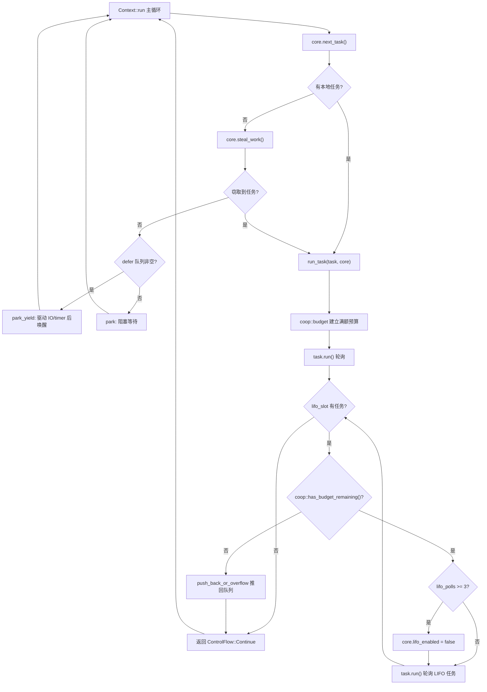

# Capítulo 12: Programación cooperativa y presupuesto: cómo el mecanismo coop evita que las tareas mueran de inanición al planificador

En el capítulo anterior vimos cómo tokio-stream y tokio-util reutilizan el Waker y el mecanismo de planificación subyacentes para extender las capacidades del núcleo. Pero sin importar cuántos combinadores se extiendan, la contradicción central del runtime asíncrono siempre existe: el planificador debe distribuir el tiempo de CPU de forma justa entre múltiples tareas, y las tareas en sí no son apropiativas — una vez que el poll de un Future comienza a ejecutarse, el planificador no puede interrumpirlo desde fuera. Si una tarea procesa cien mil mensajes en bucle dentro de un solo poll, o hace await repetidamente sobre un Future siempre listo dentro de un loop, acaparará el hilo worker y hará que las demás tareas del mismo hilo nunca obtengan oportunidad de ser sondeadas. Este es el clásico problema de «la tarea mata de inanición al planificador». La solución de Tokio no es la apropiatividad, sino la cooperación: asignar a cada tarea un presupuesto limitado dentro de un ciclo de planificación; las operaciones de recursos consumen presupuesto, y cuando este se agota, la tarea debe ceder voluntariamente. Este capítulo profundiza en la implementación de este mecanismo coop.

# 12.1 El portador del presupuesto: almacenamiento local de hilo y la estructura Budget

> **[Design Inference & Architectural Trade-offs]**
> Si comparamos el planificador con el único camarero de un restaurante, y las tareas con clientes que no dejan de pedir platos, entonces el presupuesto coop es la regla de «cada cliente puede pedir como máximo N platos» — el camarero no necesita interrumpir al cliente por la fuerza, solo debe decirle tras pedir N platos: «descanse un momento, voy a atender al siguiente». Sin esta regla, un cliente charlatán podría paralizar todo el restaurante.

El presupuesto debe cumplir dos restricciones: primera, debe poder ser accedido desde una pila de llamadas de cualquier profundidad, sin necesidad de pasar parámetros capa por capa; segunda, debe poder distinguir «si actualmente se está dentro del runtime de Tokio» — fuera del runtime, al llamar a`poll`no debería estar sujeto a restricciones de presupuesto. Tokio elige usar`block_on`almacenamiento local de hilo (TLS)**para portar el presupuesto, y lo gestiona de forma unificada a través del módulo**.`context`El tipo central del presupuesto es

. Aunque el fragmento de código fuente de este capítulo no proporciona directamente la definición completa de`coop::Budget`, a partir de los puntos de uso de`coop.rs`se puede inferir su contrato de interfaz:`worker.rs`Copiar

[FACT:tokio/src/runtime/scheduler/multi_thread/worker.rs:695-795]

```rust
coop::budget(|| {
    // ... 轮询任务 ...
    task.run();
    // ...
    loop {
        // ...
        if !coop::has_budget_remaining() {
            // 预算耗尽，把 LIFO 任务推回队列
            core.run_queue.push_back_or_overflow(task, ...);
            return ControlFlow::Continue(core);
        }
        // ...
    }
})
```

establece un ámbito de presupuesto,`coop::budget(closure)`consulta el presupuesto restante, y más adelante se verán`coop::has_budget_remaining()`y`coop::stop()`La semántica es: al entrar en el closure, se restablece el presupuesto del hilo actual a un valor completo (por defecto 128); durante la ejecución del closure, todas las operaciones de recursos comparten esta cuota; al salir del closure, se restaura el presupuesto exterior.`coop::set()`。`budget`〔Inferencia de diseño y compensaciones arquitectónicas〕

> **[Design Inference & Architectural Trade-offs]**
> En TLS normalmente existe en forma de

`Budget`.`Cell<Option<Budget>>`La semántica externa de`Option`es «si el hilo actual está en el contexto del runtime de Tokio»:`None`indica que no está dentro del runtime (por ejemplo,`block_on`fuera del runtime), en cuyo caso todas las comprobaciones de presupuesto se dejan pasar directamente.

# 12.2 Los puntos de consumo del presupuesto: cómo las operaciones de recursos lo descuentan

El presupuesto no se consume de la nada; solo las**operaciones de recursos**lo descuentan. Las llamadas operaciones de recursos son aquellas API que interactúan con el mundo exterior y que pueden ser invocadas en bucles infinitos — el`send`/`recv`de channel, la lectura/escritura de I/O,`yield_now`, etc. Tomemos como ejemplo`mpsc::Sender::reserve`, que es el punto de entrada común de todas las rutas de envío:

[FACT:tokio/src/sync/mpsc/bounded.rs:1272-1311]

```rust
async fn reserve_inner(&self, n: usize) -> Result> {
    crate::trace::async_trace_leaf().await;

    if n > self.max_capacity() {
        return Err(SendError(()));
    }
    // ... WakeReceiverOnDrop guard ...
    let guard = WakeReceiverOnDrop { chan: &self.chan };
    let result = self.chan.semaphore().semaphore.acquire(n).await;
    // ...
}
```

`reserve_inner`Antes de obtener realmente el permiso del semáforo, pasa por`crate::trace::async_trace_leaf()`. Esta llamada, que aparentemente solo sirve para tracing, es en realidad uno de los puntos de enganche para el descuento de presupuesto.`async_trace_leaf`Internamente llama a una función del tipo`coop::poll_proceed`: si el presupuesto es suficiente, descuenta 1 y devuelve`Proceed`; si el presupuesto se agota, registra una acción de «cesión» — entrega el Waker de la tarea actual al planificador, devuelve`Pending`, y hace que la tarea termine anticipadamente en este poll.

Aquí está la sutileza de coop:**que el presupuesto se agote no lanza un error, sino que disfraza la «cesión» como un`Pending`**ordinario. El Future superior, al ver`Pending`, retornará naturalmente; el planificador reencola la tarea, y cuando sea planificada de nuevo el presupuesto ya se habrá restablecido, y la tarea continuará desde donde se interrumpió. Todo el proceso es completamente transparente para el código de negocio.

`yield_now`es la manifestación más directa del mecanismo de presupuesto; no consume presupuesto, sino que**activa proactivamente la cesión**：

[FACT:tokio/src/task/yield_now.rs:38-60]

```rust
pub async fn yield_now() {
    let mut yielded = false;
    poll_fn(|cx| {
        ready!(crate::trace::trace_leaf());

        if yielded {
            return Poll::Ready(());
        }

        yielded = true;

        // Don't wake the task immediately, as that would push it right back
        // onto the run queue and it could be polled again before other tasks
        // or the IO/timer driver get a chance to run. Instead, hand the waker
        // to the scheduler, which wakes deferred tasks only after it has run
        // out of ready tasks and polled the driver. When polled from outside
        // a Tokio runtime, the waker is woken immediately.
        context::defer(cx.waker());

        Poll::Pending
    })
    .await
}
```

Nótese la línea`context::defer(cx.waker())`. No hace`wake`directamente, sino que entrega el Waker a la**cola defer**del planificador. ¿Por qué? Los comentarios del código fuente lo dicen claramente: si se despertara inmediatamente, la tarea sería empujada de vuelta a la cola de ejecución de inmediato, y podría ser sondeada otra vez antes de que el driver de I/O/timer se ejecute, haciendo que la cesión pierda sentido. La semántica de la cola defer es «despertar estas tareas después de que el worker actual termine de ejecutar las tareas listas y haya sondeado los drivers».

La cola defer está definida en el`Context`del worker:

[FACT:tokio/src/runtime/scheduler/multi_thread/worker.rs:247-257]

```rust
pub(crate) struct Context {
    worker: Arc,
    core: RefCell>>,
    /// Tasks to wake after resource drivers are polled. This is mostly to
    /// handle yielded tasks.
    pub(crate) defer: Defer,
}
```

`defer`El comentario del campo señala directamente su propósito: «mostly to handle yielded tasks». En el bucle principal del worker, cuando ni la cola local ni el robo tienen trabajo que hacer, se comprueba la cola defer:

[FACT:tokio/src/runtime/scheduler/multi_thread/worker.rs:613-621]

```rust
} else {
    // Wait for work
    core = if !self.defer.is_empty() {
        self.park_yield(core)
    } else {
        self.park(core)
    };
    core.stats.start_processing_scheduled_tasks();
}
```

Si la cola de defer no está vacía, el worker llama a`park_yield`——con un timeout de 0, lo que impulsa la E/S y el timer, y luego despierta las tareas en defer. Esto garantiza que la tarea que "cede" sea reprogramada solo después de que el driver haya corrido.

# 12.3 Establecimiento y restauración del ámbito de presupuesto: run_task y block_in_place

El ámbito de presupuesto se establece en`run_task`. Cuando cada tarea es sondeada,`coop::budget`envuelve todo el proceso de sondeo:

[FACT:tokio/src/runtime/scheduler/multi_thread/worker.rs:691-704]

```rust
// Make the core available to the runtime context
*self.core.borrow_mut() = Some(core);

// Run the task
coop::budget(|| {
    // ...
    task.run();
    // ...
})
```

`coop::budget`Al entrar, establece el presupuesto en TLS al máximo, y al salir lo restaura. Esto significa que**cada tarea obtiene un presupuesto completamente nuevo cada vez que es sondeada**. Dentro de la tarea, sin importar`await`cuántas operaciones de recursos se hayan realizado, siempre que dentro de un solo`poll`el consumo supere 128, se verá forzada a ceder.

Pero aquí hay un problema sutil: las tareas en el LIFO slot son sondeadas dentro de**el mismo`budget`cierre**. Observa`run_task`el bucle de:

[FACT:tokio/src/runtime/scheduler/multi_thread/worker.rs:709-750]

```rust
let mut lifo_polls = 0;

// As long as there is budget remaining and a task exists in the
// `lifo_slot`, then keep running.
loop {
    let mut core = match self.core.borrow_mut().take() {
        Some(core) => core,
        None => {
            return ControlFlow::Break(());
        }
    };

    let task = match core.lifo_slot.take() {
        Some(task) => task,
        None => {
            self.reset_lifo_enabled(&mut core);
            core.stats.end_poll();
            return ControlFlow::Continue(core);
        }
    };

    if !coop::has_budget_remaining() {
        core.stats.end_poll();
        // Not enough budget left to run the LIFO task, push it to
        // the back of the queue and return.
        core.run_queue.push_back_or_overflow(task, ...);
        debug_assert!(core.lifo_enabled);
        return ControlFlow::Continue(core);
    }
    // ...
}
```

Punto clave: las tareas en el LIFO slot**comparten el presupuesto de la tarea externa**. El comentario al inicio de`run_task`dice: "Tasks from the LIFO slot inherit the 'parent''s limits". Este es un diseño intencional——si cada tarea LIFO reiniciara el presupuesto, entonces en escenarios ping-pong (la tarea A despierta a B, B despierta a A), ambas tareas se programarían mutuamente de forma infinita, el presupuesto nunca se reiniciaría y el problema de inanición persistiría. Compartir el presupuesto significa que A y B juntas consumen como máximo 128 operaciones de recursos, tras lo cual deben ceder.

El LIFO slot en sí también tiene un limitador de tasa independiente`MAX_LIFO_POLLS_PER_TICK`：

[FACT:tokio/src/runtime/scheduler/multi_thread/worker.rs:756-766]

```rust
// Disable the LIFO slot if we reach our limit
//
// In ping-ping style workloads where task A notifies task B,
// which notifies task A again, continuously prioritizing the
// LIFO slot can cause starvation as these two tasks will
// repeatedly schedule the other. To mitigate this, we limit the
// number of times the LIFO slot is prioritized.
if lifo_polls >= MAX_LIFO_POLLS_PER_TICK {
    core.lifo_enabled = false;
    super::counters::inc_lifo_capped();
}
```

`MAX_LIFO_POLLS_PER_TICK`El valor de es 3:

[FACT:tokio/src/runtime/scheduler/multi_thread/worker.rs:263-263]

```rust
/// Value picked out of thin-air. Running the LIFO slot a handful of times
/// seems sufficient to benefit from locality. More than 3 times probably is
/// over-weighting. The value can be tuned in the future with data that shows
/// improvements.
const MAX_LIFO_POLLS_PER_TICK: usize = 3;
```

Esta es**la segunda línea de defensa**: incluso si el presupuesto no se ha agotado, el LIFO slot se deshabilita tras ser priorizado 3 veces consecutivas, y las tareas posteriores van a la cola normal. El presupuesto gestiona el "total de operaciones de recursos", el limitador LIFO gestiona el "número de veces que el mismo par de tareas se despierta mutuamente", ambos son complementarios.

El ámbito de presupuesto tiene una excepción importante en`block_in_place`.`block_in_place`transfiere el worker core a otro hilo, y el hilo actual entra en estado de bloqueo. El código bloqueante no está sujeto al presupuesto, por lo que debe**pausar**el presupuesto:

[FACT:tokio/src/runtime/scheduler/multi_thread/worker.rs:406-417]

```rust
if had_entered {
    // Unset the current task's budget. Blocking sections are not
    // constrained by task budgets.
    let _reset = Reset {
        take_core,
        budget: coop::stop(),
    };

    crate::runtime::context::exit_runtime(f)
} else {
    f()
}
```

`coop::stop()`devuelve el presupuesto actual y lo establece en`None`(es decir, "fuera del runtime"),`Reset`el`Drop`de se restaura después de que termina el bloqueo:

[FACT:tokio/src/runtime/scheduler/multi_thread/worker.rs:374-397]

```rust
impl Drop for Reset {
    fn drop(&mut self) {
        with_current(|maybe_cx| {
            if let Some(cx) = maybe_cx {
                if self.take_core {
                    let core = cx.worker.core.take();
                    // ...
                    *cx_core = core;
                }

                // Reset the task budget as we are re-entering the
                // runtime.
                coop::set(self.budget);
            }
        });
    }
}
```

`coop::set(self.budget)`restaura el presupuesto previamente`stop()`guardado. De esta forma,`block_in_place`el código de bloqueo síncrono dentro de no consume presupuesto, ni dispara falsamente una cesión por agotamiento del presupuesto; después de que termina el bloqueo, la tarea continúa ejecutándose con su presupuesto restante original.

La siguiente figura muestra el flujo de control completo desde que una tarea es programada hasta que cede por agotamiento del presupuesto:



En la figura se pueden ver dos rutas de cesión: cuando el presupuesto se agota, se empuja la tarea LIFO de vuelta a la cola (`push_back_or_overflow`), y cuando se excede el límite de priorización consecutiva del LIFO, se deshabilita el LIFO slot. Ambas vuelven al bucle principal, dando al worker la oportunidad de procesar otras tareas o el driver.

# 12.4 Reflexiones de diseño, recuperación de errores y trampas en producción

**¿Por qué usar TLS en lugar de paso explícito de parámetros?**Los puntos de verificación de presupuesto están dispersos en lo profundo de módulos como channel, I/O, time, etc. Si se pasaran explícitamente como parámetros, cada API necesitaría un`Budget`parámetro adicional, contaminando toda la interfaz pública. TLS hace que el presupuesto sea completamente transparente para el código de negocio, a costa de un acceso TLS por cada verificación. Tokio usa`#[thread_local]`o TLS rápido específico de plataforma para reducir esta sobrecarga.

**Interacción entre agotamiento de presupuesto y seguridad ante cancelación.**Cuando el agotamiento del presupuesto hace que`reserve_inner`devuelva`Pending`, la tarea puede estar en alguna rama de`select!`. Si en ese momento otra rama está lista,`select!`cancela la rama actual——`reserve_inner`el`WakeReceiverOnDrop`guard de verifica en el drop si "el semáforo está cerrado y ocioso" y despierta al receptor:

[FACT:tokio/src/sync/mpsc/bounded.rs:1286-1299]

```rust
struct WakeReceiverOnDrop {
    chan: &'a chan::Tx,
}

impl Drop for WakeReceiverOnDrop {
    fn drop(&mut self) {
        use chan::Semaphore;

        let semaphore = self.chan.semaphore();
        if semaphore.is_closed() && semaphore.is_idle() {
            self.chan.wake_rx();
        }
    }
}
```

La existencia de este guard indica que: el`Pending`disparado por el presupuesto y el`Pending`real de "sin permiso"

**deben comportarse de manera consistente en la ruta de cancelación, de lo contrario el receptor podría nunca recibir la notificación de "channel cerrado".**Trampa en producción: latencia oculta causada por agotamiento del presupuesto.`spawn`Un fenómeno común es: cierta tarea de repente se vuelve más lenta procesando mensajes, pero el uso de CPU no es alto. Al investigar, es fácil sospechar de contención de locks o I/O, pero en realidad puede ser que la tarea procesó más de 128 mensajes en un solo poll, disparando la cesión por presupuesto, y cada cesión requiere un ciclo completo de "empujar de vuelta a la cola → reprogramar → sondeo del driver". Si el procesamiento de mensajes en sí es rápido, esta sobrecarga de programación puede representar una proporción alta. La solución es dividir el procesamiento por lotes grandes en múltiples`yield_now`。

**tareas, o insertar explícitamente`block_in_place`en el bucle. Frontera entre presupuesto y**. Anteriormente vimos que`block_in_place`hace`coop::stop()`pausar el presupuesto. Pero hay que tener en cuenta:`coop::stop()`solo se llama cuando`had_entered`es verdadero, es decir, solo pausa cuando realmente está en un hilo worker del runtime. Si`block_in_place`se llama fuera del runtime,`f()`se ejecuta directamente y el estado del presupuesto no cambia. Esta decisión de rama se realiza en`maybe_move_runtime`:

[FACT:tokio/src/runtime/scheduler/multi_thread/worker.rs:424-464]

```rust
with_current(|maybe_cx| {
    match (
        crate::runtime::context::current_enter_context(),
        maybe_cx.is_some(),
    ) {
        (context::EnterRuntime::Entered { .. }, true) => {
            had_entered = true;
        }
        (
            context::EnterRuntime::Entered {
                allow_block_in_place,
            },
            false,
        ) => {
            if allow_block_in_place {
                had_entered = true;
                return Ok(());
            } else {
                return Err(
                    "can call blocking only when running on the multi-threaded runtime",
                );
            }
        }
        (context::EnterRuntime::NotEntered, true) => {
            return Ok(());
        }
        (context::EnterRuntime::NotEntered, false) => {
            return Ok(());
        }
    }
    // ...
})
```

Las cuatro combinaciones corresponden a: dentro del hilo worker,`block_on`entrada del thread pool de`block_in_place`, anidado

> **[Design Inference & Architectural Trade-offs]**
> **〔Inferencia de diseño y compensaciones arquitectónicas〕**El valor del presupuesto no es configurable.`Builder`opción. Esto es intencional: el valor del presupuesto afecta el equilibrio entre equidad de programación y rendimiento; si se permitiera a los usuarios ajustarlo libremente, sería fácil configurar un ajuste donde «un presupuesto demasiado grande cause inanición» o «un presupuesto demasiado pequeño cause una explosión en la sobrecarga de programación». Tokio elige tratarlo como una invariante interna.

# Resumen del capítulo

El mecanismo coop resuelve el problema de equidad del planificador no apropiativo con un diseño de tres capas:

1. **Portador del presupuesto**：`coop::Budget`existe en el TLS,`Option`la capa externa distingue dentro y fuera del runtime,`coop::budget`establece un ámbito de presupuesto completo,`coop::stop`/`coop::set`soporta pausa y reanudación (`block_in_place`escenario).

2. **Puntos de consumo**: operaciones de recursos (envío/recepción por channel, I/O,`yield_now`) mediante`coop::poll_proceed`decrementan el presupuesto; al agotarse, disfrazan el «ceder el turno» como`Pending`, de forma transparente para el negocio.

3. **Ruta de cesión**：`yield_now`mediante`context::defer`entrega el Waker a la cola defer, asegurando que la reprogramación ocurra solo después de que el driver haya hecho polling; las tareas del LIFO slot comparten el presupuesto de la tarea padre y tienen`MAX_LIFO_POLLS_PER_TICK = 3`de limitación independiente.

La idea clave de este mecanismo es:**la equidad no requiere apropiación; solo necesita que el «bucle infinito» se interrumpa naturalmente tras un número finito de pasos**. El presupuesto es la medida de ese «número finito de pasos».

# Reflexiones y autoevaluación de este capítulo

Q1: Si en`run_task`se cambiara el bucle LIFO dentro del closure`coop::budget`para que, antes de cada polling de una tarea LIFO, se llame a`coop::budget`para restablecer el presupuesto, ¿qué ocurriría en el escenario ping-pong (la tarea A despierta a B, B despierta a A)? ¿Por qué el código fuente elige que las tareas LIFO compartan el presupuesto de la tarea padre?

**Análisis de referencia**: el código fuente, en los comentarios de`run_task`, indica explícitamente «Tasks from the LIFO slot inherit the "parent"'s limits»[FACT:tokio/src/runtime/scheduler/multi_thread/worker.rs:679-682]. Si cada tarea LIFO restableciera el presupuesto, entonces en el escenario ping-pong A→B→A→B, cada polling obtendría el presupuesto completo, y ambas tareas podrían reprogramarse mutuamente sin fin, sin ceder nunca por agotamiento del presupuesto. Aunque`MAX_LIFO_POLLS_PER_TICK = 3`de limitación deshabilitaría el LIFO slot tras 3 veces[FACT:tokio/src/runtime/scheduler/multi_thread/worker.rs:756-766], al deshabilitar LIFO las tareas pasan a la cola normal; si en la cola solo están A y B, seguirán siendo programadas alternativamente, solo que ya no disfrutarán de la prioridad LIFO. Compartir el presupuesto, en cambio, pone un límite desde el total de operaciones de recursos: entre A y B, como máximo pueden consumir 128 operaciones de recursos antes de ceder obligatoriamente, dando oportunidad a otras tareas y al driver. Ambas defensas son complementarias y ninguna puede faltar.

Q2: `yield_now`usa`context::defer(cx.waker())`en lugar de`cx.waker().wake_by_ref()`. Supongamos que se cambia`defer`para que haga directamente`wake`; en un escenario de un solo worker con múltiples tareas, ¿qué consecuencias tendría que una tarea llame repetidamente a`yield_now`dentro de un bucle? Analízalo junto con la rama`park_yield`del bucle principal del worker.

**Análisis de referencia**：`yield_now`: los comentarios de[FACT:tokio/src/task/yield_now.rs:49-54]explican la razón: un wake directo devolvería la tarea inmediatamente a la cola de ejecución, y podría volver a hacerse polling antes de que se ejecuten los drivers de I/O/timer`yield_now`. En el escenario de un solo worker, si una tarea llama repetidamente a`next_task`y cada vez hace wake directo, el`park_yield`del bucle principal del worker tomaría inmediatamente esta tarea y volvería a hacer polling,[FACT:tokio/src/runtime/scheduler/multi_thread/worker.rs:613-621]la rama (encargada de impulsar I/O y timer)`defer`nunca se ejecutaría, porque la cola defer está vacía y la cola local siempre tiene tareas. El resultado es que los eventos de I/O y los timers nunca se procesarían, y todo el runtime estaría «falsamente vivo»: las tareas corren, pero los eventos del mundo exterior no pueden avanzar.

Q3: `block_in_place`La cola garantiza que una tarea que cedió el turno deba esperar hasta después del polling del driver para ser despertada, dejando así una ventana de ejecución para el driver.`coop::stop()`En`None`，`Reset::drop`se establece el presupuesto en`coop::set(self.budget)`y en`block_in_place`se restaura. Si dentro del closure`f`de`block_in_place`se llama de nuevo a`maybe_move_runtime`(anidado), ¿qué ocurre con el estado del presupuesto?

**¿Qué rama de**maneja este caso?`block_in_place`Análisis de referencia`maybe_move_runtime`: el`(context::EnterRuntime::NotEntered, true)`anidado es manejado por la rama[FACT:tokio/src/runtime/scheduler/multi_thread/worker.rs:454-458]en`return Ok(())`. Esa rama hace directamente`had_entered`, sin establecer`block_in_place`, por lo que la comprobación`if had_entered`del`coop::stop()`externo resulta falsa y no se vuelve a llamar a`Reset`ni se crea un nuevo`f()`. El comentario explica «This is a nested call to block_in_place (we already exited). All the necessary setup has already been done.» — la capa externa ya ha pausado el presupuesto y transferido el core; la capa interna solo necesita ejecutar directamente`coop::stop()`. Si la capa interna volviera a`None`, guardaría de nuevo un presupuesto que ya es`Reset::drop`, y al restaurar`None`podría restaurarse un valor incorrecto (

en lugar del presupuesto original de la capa externa), provocando que el presupuesto se pierda permanentemente y que todas las operaciones de recursos posteriores de la tarea queden sin restricción.
