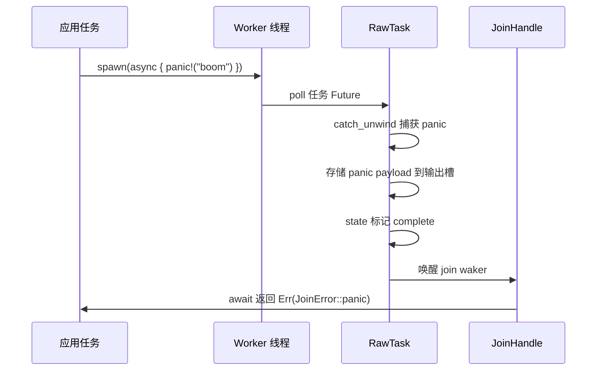
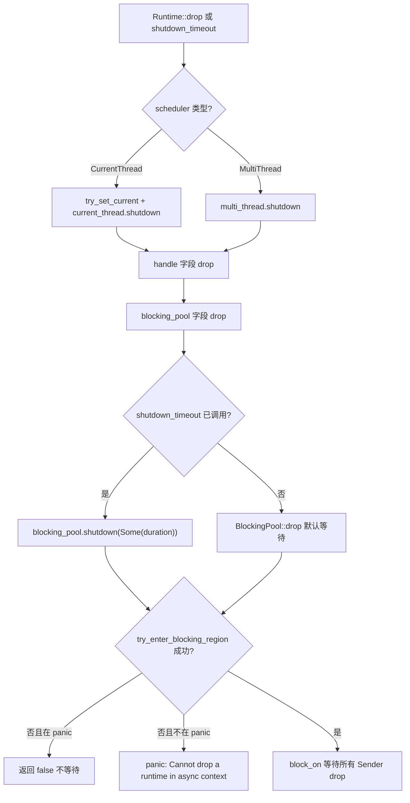
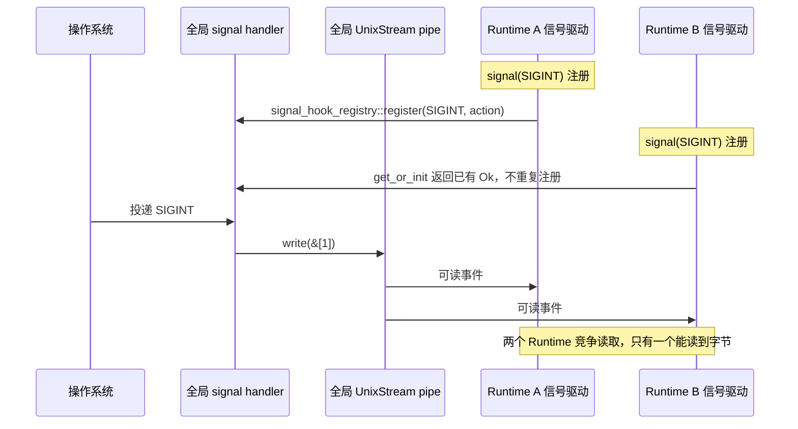

# Capítulo siguiente: Capítulo 13 →

En el capítulo anterior desglosamos el presupuesto de cooperación coop: cada tarea solo tiene un presupuesto limitado dentro de un ciclo de planificación y, una vez agotado, debe ceder, evitando así que una sola tarea mate de hambre a las demás. Pero el mecanismo de presupuesto solo resuelve el problema de la "planificación justa"; en entornos de producción reales hay otra clase de trampas más sutiles: seguridad ante cancelación, propagación de panic y orden de cierre. Cuando select! cancela un Future, cuando un panic de una tarea es capturado, cuando el Runtime comienza a cerrarse, el comportamiento límite del código suele ser contrario a la intuición. Este capítulo comienza con la seguridad ante cancelación y primero examina qué se pierde realmente cuando un Future es drop.

# 13.2 Propagación de panic: cómo JoinError captura un colapso

## Modelo intuitivo

El panic de una tarea de Tokio no hace que todo el proceso colapse (salvo con panic=abort), sino que es capturado, empaquetado como`JoinError`, y devuelto mediante`JoinHandle::await`. Es como cuando ocurre un accidente en una estación de una línea de montaje de una fábrica: la red de seguridad atrapa al trabajador, pero el producto se descarta; lo que obtienes es un "informe de accidente" en lugar del producto.

## Estructura de datos y estados

`JoinHandle<T>`El`Future::Output`de`super::Result<T>`es`Result<T, JoinError>` [FACT:tokio/src/runtime/task/join.rs:325]。`JoinError`, es decir,

```rust
let join_handle = tokio::spawn(async { panic!("boom"); });
let err = join_handle.await.unwrap_err();
assert!(err.is_panic());
```

[FACT:tokio/src/runtime/task/join.rs:121-127]

Copiar`RawTask`El mecanismo por el cual se captura el panic está en la ruta de poll de`catch_unwind`: al hacer poll de la tarea se envuelve con`JoinHandle::poll`, y tras ocurrir el panic se guarda el payload en la ranura de salida de la tarea, se marca el estado como complete y luego se despierta al join waker.`try_read_output`Lo que se lee mediante`Err(JoinError::panic(payload))`。

## es



Copiar`JoinError`Punto clave: el payload del panic se conserva por completo,`std::error::Error`implementa`into_panic()`, se puede recuperar`Box<dyn Any + Send>`mediante`downcast_ref::<&str>()`, y luego extraer el mensaje del panic con

## Reflexiones de diseño y trampas

**Trampa 1:`JoinHandle`El`UnwindSafe`de**

```rust
impl UnwindSafe for JoinHandle {}
impl RefUnwindSafe for JoinHandle {}
```

[FACT:tokio/src/runtime/task/join.rs:176-181]

Copiar`T: UnwindSafe`Esta es una implementación incondicional, no requiere`JoinHandle`. Razón:`T`，`T`en sí no contiene`catch_unwind`En la asignación de tareas en el heap, durante el panic ya ha sido aislado por`T`. Por lo tanto, incluso si`UnwindSafe`，`JoinHandle`no es

**también es seguro.**Trampa 2: el panic no se propaga automáticamente a la tarea padre.`JoinHandle`Si la tarea A hace spawn de la tarea B y B entra en panic, A no recibe notificación automáticamente, a menos que A haya hecho await del

**de B. Si A no hizo await, el panic de B se traga silenciosamente. Esta es una de las fuentes de bugs más sutiles en entornos de producción.`spawn_blocking`Trampa 3:**El panic de`catch_unwind`también se captura.`Mutex`Los workers del pool de hilos bloqueantes también envuelven las tareas con`std::sync::Mutex`, y tras el panic el hilo no muere, sino que vuelve al pool para seguir aceptando trabajo. Pero si dentro de una tarea bloqueante mantienes

**y no lo liberas durante el panic, se produce envenenamiento de lock; este es el comportamiento inherente de**, Tokio no interviene.`catch_unwind`Trampa 4: panic durante el drop del Runtime.

# Si una tarea entra en panic durante el proceso de drop del Runtime,

## sigue teniendo efecto, pero en ese momento el join waker puede haber dejado de ser válido y el payload del panic se descarta. Este es un subconjunto del problema del orden de cierre, que se desarrolla en la siguiente sección.

13.3 Orden de cierre: limpieza de hilos bloqueantes y recursos de I/O

## Modelo intuitivo

`Runtime`El cierre del Runtime es como el cierre de un restaurante: primero se hace que la recepción deje de aceptar clientes (dejar de aceptar nuevas tareas), luego se espera a que la cocina termine los platos en curso (las tareas asíncronas llegan al siguiente punto de yield), y finalmente se espera a que los ayudantes subcontratados terminen su turno (los hilos bloqueantes retornan). Si el orden es incorrecto surgen problemas; por ejemplo, si primero se despide a los ayudantes, los platos de la cocina nunca terminarán de prepararse.

```rust
pub struct Runtime {
    scheduler: Scheduler,
    handle: Handle,
    blocking_pool: BlockingPool,
}
```

[FACT:tokio/src/runtime/runtime.rs:97-106]

`Drop`Los tres campos de

```rust
impl Drop for Runtime {
    fn drop(&mut self) {
        match &mut self.scheduler {
            Scheduler::CurrentThread(current_thread) => {
                let _guard = context::try_set_current(&self.handle.inner);
                current_thread.shutdown(&self.handle.inner);
            }
            Scheduler::MultiThread(multi_thread) => {
                multi_thread.shutdown(&self.handle.inner);
            }
        }
    }
}
```

[FACT:tokio/src/runtime/runtime.rs:506-521]

Copiar`Drop`Implementación de`scheduler`，**:`blocking_pool`**。`blocking_pool`Copiar`Drop`Nota:`Runtime::drop`solo maneja`scheduler` → `handle` → `blocking_pool`no maneja explícitamente

El cierre de`shutdown_timeout`ocurre en su propio

```rust
pub fn shutdown_timeout(mut self, duration: Duration) {
    self.handle.inner.shutdown();
    self.blocking_pool.shutdown(Some(duration));
}
```

[FACT:tokio/src/runtime/runtime.rs:457-461]

se dispara por el orden de drop de los campos. El orden de drop de los campos es el orden de declaración:`handle.inner.shutdown()`. Por lo tanto, el pool bloqueante es el último en cerrarse.`blocking_pool.shutdown(Some(duration))`Pero`duration`。

## controla explícitamente el orden:

`blocking/shutdown.rs`Copiar

```rust
pub(super) struct Sender {
    _tx: Arc>,
}

pub(super) struct Receiver {
    rx: oneshot::Receiver,
}
```

[FACT:tokio/src/runtime/blocking/shutdown.rs:13-19]

notifica al planificador y al driver de I/O que se detengan, luego`Sender`espera las tareas bloqueantes, como máximo`Arc<oneshot::Sender>`Mecanismo subyacente del cierre del pool bloqueante`Sender`utiliza un ingenioso oneshot channel:`Receiver`Copiar`wait`Cada worker bloqueante mantiene un clon de

```rust
pub(crate) fn wait(&mut self, timeout: Option) -> bool {
    use crate::runtime::context::try_enter_blocking_region;

    if timeout == Some(Duration::from_nanos(0)) {
        return false;
    }

    let mut e = match try_enter_blocking_region() {
        Some(enter) => enter,
        _ => {
            if std::thread::panicking() {
                return false;
            } else {
                panic!(
                    "Cannot drop a runtime in a context where blocking is not allowed. \
                    This happens when a runtime is dropped from within an asynchronous context."
                );
            }
        }
    };

    if let Some(timeout) = timeout {
        e.block_on_timeout(&mut self.rx, timeout).is_ok()
    } else {
        let _ = e.block_on(&mut self.rx);
        true
    }
}
```

[FACT:tokio/src/runtime/blocking/shutdown.rs:37-70]

). Cuando todos los workers salen y todos los

1. `timeout == Some(0)`son drop,`shutdown_background`recibe la notificación.

2. `try_enter_blocking_region()`Método`None`。

:

Copiar`block_on_timeout`Análisis paso a paso:

## devuelve directamente false; esta es la ruta de



## intenta entrar en la región bloqueante. Si actualmente está en un contexto asíncrono (por ejemplo, hacer drop del Runtime dentro de una tarea async), devuelve

**3. Cuando falla la entrada, si se está en panic, devuelve false (no entrar en panic de nuevo durante un panic); de lo contrario, entra en panic y da un mensaje de error claro.**El mensaje de error es muy claro: «Cannot drop a runtime in a context where blocking is not allowed»[FACT:tokio/src/runtime/blocking/shutdown.rs:51-54]. La solución es usar`shutdown_background()`, que es equivalente a`shutdown_timeout(Duration::from_nanos(0))` [FACT:tokio/src/runtime/runtime.rs:494-496], sin esperar a las tareas bloqueantes.

**Trampa 2:`shutdown_background`filtrará tareas bloqueantes.**La documentación advierte explícitamente «this may result in a resource leak (in that any blocking tasks are still running until they return)»[FACT:tokio/src/runtime/runtime.rs:470-472]. Las tareas bloqueantes seguirán ejecutándose hasta que retornen de forma natural, pero el Runtime ya se ha destruido, y los recursos que poseen pueden haber quedado invalidados.

**Trampa 3: Los recursos de E/S quedan invalidados tras destruir el Runtime.**La documentación indica «Once the runtime has been dropped, any outstanding I/O resources bound to it will no longer function»[FACT:tokio/src/runtime/runtime.rs:52-54]。`is_rt_shutdown_err`La función sirve para detectar este tipo de errores[FACT:tokio/src/runtime/runtime.rs:585-593]。

**Trampa 4:`Drop`espera indefinidamente por defecto.**La documentación señala «The`Drop` implementation waits forever for this」[FACT:tokio/src/runtime/runtime.rs:43-44]. Si una tarea bloqueante se queda atascada (por ejemplo, en un bucle infinito), destruir el Runtime se colgará permanentemente. En producción se debería usar`shutdown_timeout`para establecer un límite.

# 13.4 Manejo de señales y conflictos entre múltiples Runtimes

## Modelo intuitivo

Las señales Unix son a nivel de proceso, pero el`Signal`de Tokio está vinculado al Runtime. Es como si todo el edificio compartiera una alarma de incendios, pero cada habitación tuviera su propio receptor: la primera persona que instala un receptor cambia el cableado de la alarma, y los demás solo pueden compartir ese cambio.

## Estructuras de datos y estado global

`signal_enable`es el punto de entrada para registrar manejadores de señales:

```rust
fn signal_enable(signal: SignalKind, handle: &Handle) -> io::Result {
    let signal = signal.0;
    if signal  slot,
        None => return Err(io::Error::other("signal too large")),
    };

    siginfo
        .init
        .get_or_init(|| {
            unsafe { signal_hook_registry::register(signal, move || action(globals, signal)) }
                .map(|_| ())
                .map_err(|e| e.raw_os_error())
        })
        .map_err(|e| {
            e.map_or_else(
                || Error::other("registering signal handler failed"),
                || Error::from_raw_os_error,
            )
        })
}
```

[FACT:tokio/src/signal/unix.rs:266-296]

Puntos clave:

1. `signal <= 0 || FORBIDDEN.contains(&signal)`rechaza señales inválidas.

2. `handle.check_inner()`verifica si el controlador de señales está en ejecución; si el Runtime ya se ha cerrado, aquí fallará.

3. `siginfo.init.get_or_init(...)`usa`OnceLock`para garantizar que cada señal registre un único manejador del SO.`get_or_init`El cierre de`signal_hook_registry::register`invoca

, que es un registro global a nivel de proceso.`action(globals, signal)`4. El manejador registrado es`globals.record_event(signal)`, que hace dos cosas:[FACT:tokio/src/signal/unix.rs:252-259]。

## registra el evento y luego escribe un byte en el pipe para despertar al controlador

`globals()`La raíz del conflicto entre múltiples Runtimes`Globals`，`OsExtraData`lo que devuelve es un`UnixStream`global a nivel de proceso

```rust
pub(crate) struct OsExtraData {
    sender: UnixStream,
    pub(crate) receiver: UnixStream,
}
```

[FACT:tokio/src/signal/unix.rs:61-64]

`Default`El par también es global:`UnixStream` [FACT:tokio/src/signal/unix.rs:61-64]Copiar

La implementación crea un par de`signal_enable`. Este pipe es único a nivel global, y todos los controladores de señales de los Runtimes lo comparten.`handle.check_inner()`El problema surge:**dentro de**lo que verifica es el`signal_hook_registry::register`controlador de señales del**Runtime actual**. Pero el manejador que registra**es**a nivel de proceso`get_or_init`, y escribe en el`Ok(())`pipe

## global. Si el Runtime A registra primero SIGINT, y luego el Runtime B también registra SIGINT,



## existente, sin volver a registrarlo. Pero el controlador de señales del Runtime B leerá datos del pipe global: ambos Runtimes competirán por los bytes del mismo pipe.

**Walkthrough guiado por escenarios: competencia de señales entre múltiples Runtimes**Copiar[FACT:tokio/src/signal/unix.rs:379-380]Reflexiones de diseño y trampas`Signal`Trampa 1: El manejador de señales nunca se desinstala.[FACT:tokio/src/signal/unix.rs:338-340]。

**La documentación advierte explícitamente «Once a signal handler is registered with the process the underlying libc signal handler is never unregistered»**. Incluso si la instancia de`poll` is called, all signal notifications are coalesced into one item returned from `poll`」[FACT:tokio/src/signal/unix.rs:312-315]se destruye, las señales posteriores seguirán siendo capturadas por Tokio, y el comportamiento por defecto no se restaurará

**Trampa 2: Las señales se fusionan.**La documentación indica «before`signal_hook`. Si recibes 10 SIGINT pero solo haces poll una vez, solo verás un evento. Esta es una característica de las propias señales Unix (las señales estándar no se encolan), Tokio no fusiona adicionalmente.

**Trampa 3: Las señales pueden perderse con múltiples Runtimes.`signal`Dado que el pipe global es leído de forma competitiva por múltiples Runtimes, un Runtime puede consumir el byte mientras otro nunca lo recibe. En producción se debería manejar las señales en un solo Runtime, o usar**para gestionarlas por cuenta propia.`rt` feature flag is not enabled」[FACT:tokio/src/signal/unix.rs:398-405]Trampa 4:`signal()`Condiciones de panic de la función.

**La documentación indica «This function panics if there is no current reactor set, or if the`recv()`. Llamar a**fuera del Runtime provocará un panic.`tokio::select!` and another branch completes first, then it is guaranteed that no signal is lost」[FACT:tokio/src/signal/unix.rs:423-427]Trampa 5:`EventInfo`La seguridad de cancelación de`recv()`La documentación garantiza «This method is cancel safe. If you use it as a branch in

# . Esto se debe a que los eventos de señal se almacenan en el

global,**solo lee, no consume el estado subyacente.**。

- `JoinHandle`Reflexiones de diseño
- Los tres temas de este capítulo comparten un patrón subyacente:`Handle`, el orden incorrecto provocará interbloqueo o panic.
- Señales con múltiples Runtime en conflicto, porque el handler y el pipe son estado global a nivel de proceso, mientras que`Signal`es una vista a nivel de Runtime.

Después de entender este patrón, la lista de trampas a evitar se puede resumir en tres principios:

1. **Cancelación segura = el estado está fuera del Future.**Si el Future tiene un búfer interno, el drop perderá datos.`JoinHandle`、`Signal::recv`、`tokio::sync::mpsc::Receiver::recv`Todos cumplen esta condición.

2. **Orden de cierre = orden inverso a la dirección de dependencia.**Quien depende de quién, primero se cierra el dependido. El planificador depende del driver de I/O, así que primero se cierra el planificador; el pool de bloqueo es independiente, se cierra al final.

3. **Estado global = conflicto entre múltiples instancias.**Cualquier recurso a nivel de proceso (signal handler, pipe, tabla de descriptores de archivo) entrará en conflicto con múltiples Runtime; o se limita a un solo Runtime, o se usa sincronización externa.

# Resumen del capítulo

# Reflexión y autoevaluación del capítulo

Q1: Si en`JoinHandle::poll`se elimina`coop::poll_proceed(cx)`, ¿en qué escenario provocaría que otras tareas mueran de inanición? ¿Por qué`try_read_output`por sí mismo no consume presupuesto?

**Análisis de referencia**：`coop::poll_proceed(cx)`consume el presupuesto de cooperación en[FACT:tokio/src/runtime/task/join.rs:325-325]. Si se elimina, una tarea que en un bucle repite`select!`múltiples`JoinHandle`puede hacer polling infinito de todos los handle dentro de un solo ciclo de planificación, sin retornar nunca`Pending`, provocando así inanición de otras tareas en el mismo worker.`try_read_output`por sí mismo no consume presupuesto, porque solo es una lectura de memoria + posible almacenamiento del waker, no implica I/O ni contención de locks, y su sobrecarga es mínima. La intención de diseño del mecanismo de presupuesto es restringir «operaciones que pueden ejecutarse durante mucho tiempo», no cobrar en cada poll. Nótese que`coop.made_progress()`solo llama a`ret.is_ready()`cuando[FACT:tokio/src/runtime/task/join.rs:349-351], es decir, solo devuelve presupuesto cuando realmente obtiene salida; esto es para evitar que las operaciones que «hicieron polling pero no obtuvieron resultado» acumulen consumo de presupuesto.

Q2：`blocking/shutdown.rs`En el método`wait`de`try_enter_blocking_region()`, si`None`devuelve`false`y actualmente se está en panic, ¿por qué se elige devolver

**en lugar de seguir esperando? ¿Qué pasaría si se cambiara a seguir esperando?**：`try_enter_blocking_region()`Análisis de referencia`None`devuelve[FACT:tokio/src/runtime/blocking/shutdown.rs:44-57]indica que actualmente se está en un contexto asíncrono y no se permite bloquear`false`. Si en ese momento se está en panic, el código elige devolver[FACT:tokio/src/runtime/blocking/shutdown.rs:47-49]sin esperar a`block_on`. La razón es: volver a entrar en panic durante el unwinding de un panic provoca abort del proceso (double panic). Si se cambiara a seguir esperando, habría que llamar a`block_on`, y en un contexto asíncrono`false`provocará panic; entrar en panic durante el unwinding de un panic aborta directamente el proceso, perdiendo toda la información de diagnóstico. Devolver

permite que el drop continúe completándose y que la información del panic se conserve. Este es un diseño de «degradación elegante»: un cierre incompleto siempre es mejor que un proceso colapsado.`Signal`Q3: Supón que en Runtime A creaste`Signal`para escuchar SIGTERM, y luego mueves`signal_enable`a Runtime B para hacer poll.`handle.check_inner()`En`Signal`, ¿qué Runtime verifica

**? Si Runtime A se destruye primero, ¿**：`signal_enable`en Runtime B todavía puede recibir la señal?`signal()`Análisis de referencia`handle`se ejecuta en la llamada a[FACT:tokio/src/signal/unix.rs:398-405]。`check_inner()`, en ese momento[FACT:tokio/src/signal/unix.rs:275]。`Signal`es de Runtime A;`RxFuture`verifica el driver de señales de Runtime A;`watch::Receiver<()>` [FACT:tokio/src/signal/unix.rs:366-368]internamente es`Globals`, que envuelve`EventInfo`, y este receiver está registrado en el`record_event`global de`EventInfo`. Si Runtime A se destruye, su driver de señales deja de leer datos del pipe global, pero el handler global seguirá`Signal`y escribirá en el pipe. Si el driver de señales de Runtime B también está en ejecución, leerá los datos del pipe y disparará`Signal` **, despertando así el waker de**. Por lo tanto,`Signal`en Runtime B posiblemente

# todavía pueda recibir la señal, pero depende de si Runtime B tiene un driver de señales en ejecución. Si Runtime B no tiene driver de señales (por ejemplo, no habilitó la feature signal o el driver ya está cerrado), nadie leerá los datos del pipe,

y nunca llegará el despertar. Esta es la fragilidad del manejo de señales con múltiples Runtime.`catch_unwind`Transición al final del capítulo`Globals`Cancelación segura, propagación de panic, orden de cierre, conflicto de señales: la raíz común de estos cuatro problemas es la ambigüedad de la «propiedad del estado» en los límites asíncronos. Tokio, al poner el estado en el heap, gestionar el ciclo de vida con conteo de referencias, aislar el panic con

, y compartir el estado de señales con

Con esto, hemos recorrido los terrenos limítrofes más propensos a errores en entornos de producción de Tokio: la atomicidad de try_read_output y el almacenamiento en el heap de las salidas de dependencias seguras ante cancelación; JoinHandle::drop no cancela la tarea, solo abort la cancela realmente, pero no tiene efecto sobre spawn_blocking; un panic capturado por catch_unwind se empaqueta como JoinError y se pierde silenciosamente si no se hace await; el cierre del Runtime tiene un orden estricto, y hacer drop en un contexto async provoca panic; los manejadores de señales son estado global a nivel de proceso y nunca se desregistran una vez registrados. Detrás de estas reglas está la reiterada ponderación de Tokio entre corrección y rendimiento. En el próximo capítulo dejaremos atrás los mecanismos concretos para revisar, desde una perspectiva arquitectónica, el origen de estas ponderaciones y vislumbrar hacia dónde llevarán a Tokio io_uring, la refactorización de drivers y la interfaz de ejecutores personalizados.
