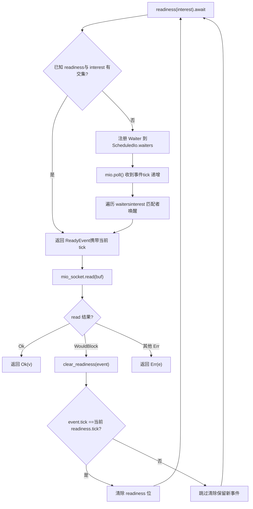
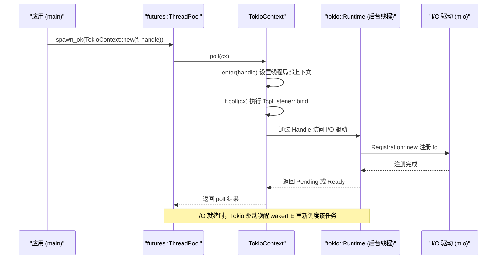

# Capítulo 14: Ponderaciones arquitectónicas y evolución futura: de io_uring a drivers conectables

En el capítulo anterior revisamos cuatro tipos de trampas de producción: seguridad ante cancelación, propagación de panic, orden de cierre y conflictos de señales. Aunque parecen dispersas, todas apuntan al mismo problema arquitectónico: cómo se divide claramente la propiedad del estado en los límites asíncronos. Y la forma de dividir la propiedad está determinada precisamente por las tres decisiones arquitectónicas más fundamentales del runtime: cómo se planifican las tareas, cómo se distribuyen los eventos de E/S y cómo se verifica la corrección de la concurrencia. Este capítulo ya no se sumerge en los detalles de implementación de una función concreta, sino que se sitúa en una perspectiva arquitectónica para revisar las concesiones que Tokio hizo en estas decisiones y, siguiendo las pistas de evolución ya sembradas en la documentación oficial y el código fuente, ver hacia dónde llevarán a Tokio io_uring, la refactorización de drivers y la interfaz de ejecutores personalizados. Al terminar este capítulo, deberías poder responder una pregunta práctica: cuándo conviene extender Tokio y cuándo conviene evitarlo.

# I. Tres ponderaciones históricas: por qué es como es ahora

## Modelo intuitivo

Imagina Tokio como un restaurante que lleva diez años abierto. La forma de organizar los turnos en la cocina (work-stealing), la plantilla independiente de los camareros (separación entre el driver de E/S y el planificador) y el sistema de inspección higiénica de la cocina (verificación de concurrencia con loom) no se diseñaron el primer día, sino que evolucionaron gradualmente a medida que «llegaban más clientes y los platos se volvían más complejos». Entender estas evoluciones permite juzgar qué diseños son apuestas visionarias y qué diseños son lastre histórico.

## Ponderación uno: work-stealing en lugar de cola global

> **[Design Inference & Architectural Trade-offs]**
> La implementación de una cola global es la más simple: todas las tareas entran en una`Mutex<VecDeque>`y los hilos worker compiten por el lock para tomar tareas. Pero la contención del lock empeora a medida que aumentan los núcleos, y la localidad de caché es pobre: en qué núcleo se crea una tarea y en qué núcleo se ejecuta es completamente aleatorio.

La concesión de work-stealing es: cada worker mantiene una cola local,`spawn`al hacer push prioriza la cola local (sin locks, amigable con la caché), y solo cuando la local está vacía roba desde la cola de otro worker. El costo es que el balanceo de carga tiene latencia y que el robo en sí requiere operaciones atómicas y barreras de memoria. Tokio eligió lo segundo porque los servidores modernos tienen decenas de núcleos y el costo de la contención de locks es mucho mayor que el gasto ocasional de robo.

> **[Design Inference & Architectural Trade-offs]**
> La condición límite de esta decisión es:**la granularidad de las tareas no puede ser demasiado fina**. Si cada tarea solo hace unos pocos microsegundos de trabajo, la proporción del costo de robo y planificación se descontrola. Por eso Tokio, además de`spawn_blocking`, también exige que las tareas largas hagan`yield_now()`activamente: la planificación cooperativa es, en esencia, una red de seguridad para work-stealing.

## Ponderación dos: el driver de E/S es independiente del planificador

Este es el punto más interesante del material fuente de este capítulo. Observa la estructura de módulos de`tokio/src/runtime/io/mod.rs`:

[FACT:tokio/src/runtime/io/mod.rs:5-22]

```rust
mod driver;
use driver::{Direction, Tick};
pub(crate) use driver::{Driver, Handle, ReadyEvent};

mod registration;
pub(crate) use registration::Registration;

mod registration_set;
use registration_set::RegistrationSet;

mod scheduled_io;
use scheduled_io::ScheduledIo;

mod metrics;
use metrics::IoDriverMetrics;

use crate::util::ptr_expose::PtrExposeDomain;
static EXPOSE_IO: PtrExposeDomain = PtrExposeDomain::new();
```

Fíjate en que`driver`、`registration`、`scheduled_io`son tres módulos independientes y que hacia fuera solo exponen los tipos`Driver`、`Handle`、`ReadyEvent`、`Registration`.`ScheduledIo`es`pub(crate)`de`PtrExposeDomain`: está envuelto por

> **[Design Inference & Architectural Trade-offs]**
> 〔Inferencia de diseño y ponderación arquitectónica〕`block_on`¿Por qué el driver de E/S no se integra directamente en el planificador? Porque sus ciclos de vida y modelos de concurrencia son distintos. Al planificador le importa «qué tarea debe ejecutarse»; al driver de E/S le importa «qué fd está listo». Si estuvieran acoplados, cada ajuste de la estrategia de planificación obligaría a tocar la ruta de E/S, y viceversa. Más importante aún,

## el runtime de un solo hilo también necesita un driver de E/S, pero no necesita un planificador work-stealing: la separación permite que ambos runtimes reutilicen la misma implementación de E/S.

`tokio/src/loom/mod.rs`Ponderación tres: loom para verificar el modelo de concurrencia

[FACT:tokio/src/loom/mod.rs:1-14]

```rust
//! This module abstracts over `loom` and `std::sync` depending on whether we
//! are running tests or not.

#![allow(unused)]

#[cfg(not(all(test, loom)))]
mod std;
#[cfg(not(all(test, loom)))]
pub(crate) use self::std::*;

#[cfg(all(test, loom))]
mod mocked;
#[cfg(all(test, loom))]
pub(crate) use self::mocked::*;
```

Copiar`#[cfg(all(test, loom))]`La clave está en la condición`test`: solo cuando se activan simultáneamente los dos cfg`loom`y`mocked`se reemplaza el módulo`std`por

> **[Design Inference & Architectural Trade-offs]**
> 〔Inferencia de diseño y ponderación arquitectónica〕`ScheduledIo`El valor de loom radica en que puede enumerar exhaustivamente «todas las posibles secuencias de intercalado de hilos». Como`AtomicUsize`en`Waiters`La inserción y eliminación en listas enlazadas puede ejecutarse un millón de veces en hardware real sin errores, pero loom puede construir en segundos una intercalación que desencadena una condición de carrera. El costo es que las pruebas se ejecutan lentamente y consumen mucha memoria, por lo que solo puede usarse en pruebas unitarias, no en producción.

## Reflexiones de diseño

Estos tres trade-offs comparten una característica común:**Todos eligieron la solución «más compleja pero más escalable», y limitaron la complejidad al interior**. La complejidad de work-stealing está oculta en el planificador, la complejidad del I/O dirigido por eventos está oculta en`ScheduledIo`, y la complejidad de loom está oculta en las condiciones cfg. La API expuesta al exterior siempre es`spawn`、`TcpStream::read`estas interfaces simples.

> **[Design Inference & Architectural Trade-offs]**
> Este es también el primer criterio para determinar «cuándo se debe extender Tokio»:**Si tu necesidad puede expresarse con la API existente, no toques las estructuras internas**. Una vez que empiezas a depender de`pub(crate)`los tipos de`tokio_unstable`o los cfg de

---

# , significa que te has atado a la implementación interna de Tokio, y pagarás un precio al actualizar.

## II. Refactorización del driver: de «un waker, una dirección» a «conjunto de intereses arbitrario»

Modelo intuitivo`async fn read(&mut self)`Los primeros tipos de I/O de Tokio tenían una restricción rígida:`&mut self`requería`tokio/docs/reactor-refactor.md`. Esto es como un restaurante con una sola ventanilla de recogida, donde solo una persona puede hacer fila a la vez — porque el waker se almacenaba dentro del recurso de I/O, no en el Future correspondiente a la operación.

## documenta completamente la causa de esta restricción y el plan de refactorización.

Los puntos débiles de la arquitectura antigua

[FACT:tokio/docs/reactor-refactor.md:16-20]

```rust
Currently, I/O types require `&mut self` for `async` functions. The reason for
this is the task's waker is stored in the I/O resource's internal state
(`ScheduledIo`) instead of in the future returned by the `async` function.
Because of this limitation, I/O types limit the number of wakers to one per
direction (a direction is either read-related events or write-related events).
```

> **[Design Inference & Architectural Trade-offs]**
> 〔Inferencias de diseño y trade-offs arquitectónicos〕`TcpStream`Almacenar el waker dentro del recurso significa que «una dirección solo puede tener un esperador». Si quieres leer y escribir el mismo`split()`al mismo tiempo, debes`TcpStream::split()`dividirlo en dos mitades, cada una con su propia ranura de waker independiente. Esta es la razón por la que existe

## — no es una preferencia de diseño de API, sino una restricción directa de la estructura de datos interna.

Nueva arquitectura: mover el waker al Future

[FACT:tokio/docs/reactor-refactor.md:22-25]

```rust
Moving the waker from the internal I/O resource's state to the operation's
future enables multiple wakers to be registered per operation. The "intrusive
wake list" strategy used by `Notify` applies to this case, though there are some
concerns unique to the I/O driver.
```

Copiar`ScheduledIo`La nueva estructura

[FACT:tokio/docs/reactor-refactor.md:97-134]

```rust
#[derive(Debug)]
pub(crate) struct ScheduledIo {
    /// Resource's known state packed with other state that must be
    /// atomically updated.
    readiness: AtomicUsize,

    /// Tracks tasks waiting on the resource
    waiters: Mutex,
}

#[derive(Debug)]
struct Waiters {
    // List of intrusive waiters.
    list: LinkedList,

    /// Waiter used by `AsyncRead` implementations.
    reader: Option,

    /// Waiter used by `AsyncWrite` implementations.
    writer: Option,
}

// This struct is contained by the **future** returned by `readiness()`.
#[derive(Debug)]
struct Waiter {
    /// Intrusive linked-list pointers
    pointers: linked_list::Pointers,

    /// Waker for task waiting on I/O resource
    waiter: Option,

    /// Readiness events being waited on. This is
    /// the value passed to `readiness()`
    interest: mio::Ready,

    /// Should not be `Unpin`.
    _p: PhantomPinned,
}
```

Copiar

**Aquí hay varios puntos de diseño ingeniosos que vale la pena desarrollar:`readiness`Primero,`AtomicUsize`，`waiters`es`Mutex<Waiters>`。**es`readiness`¿Por qué no usar un solo lock para proteger ambos? Porque las operaciones de lectura de`readiness()`son extremadamente frecuentes (cada llamada a

**debe verificarlo), mientras que las operaciones de escritura solo ocurren al recibir eventos de mio. Usar variables atómicas para hacer que la ruta de lectura sea lock-free es una optimización típica de separación lectura/escritura.`Waiter`Segundo,** `pointers: linked_list::Pointers<Waiter>`es un nodo de lista enlazada intrusiva.`Waiter`hace que`_p: PhantomPinned`sea parte de la lista enlazada, sin necesidad de asignar nodos adicionales.`Unpin`lo marca explícitamente como no

**— porque una vez que la dirección de un nodo de una lista enlazada intrusiva se mueve, la lista se rompe.`reader`Tercero,`writer`y`Option<Waker>`dos`AsyncRead`/`AsyncWrite`son para**. El documento explica la razón:

[FACT:tokio/docs/reactor-refactor.md:210-213]

```rust
The `AsyncRead` and `AsyncWrite` traits use a "poll" based API. This means that
it is not possible to use an intrusive linked list to track the waker.
Additionally, there is no future associated with the operation which means it is
not possible to cancel interest in the readiness events.
```

> **[Design Inference & Architectural Trade-offs]**
> Esta es la coexistencia comprometida de los dos mecanismos, antiguo y nuevo:`async fn`la ruta`poll`usa lista enlazada intrusiva (soporta múltiples esperadores, cancelable),

## la ruta

usa ranuras fijas (no soporta cancelación, pero es compatible con el trait). Esta «coexistencia de dos mecanismos» es el costo típico de una refactorización incremental.

[FACT:tokio/docs/reactor-refactor.md:175-175]

```rust
If care is not taken, if between `mio_socket.read(buf)` returning and
`clear_readiness(event)` is called, a readiness event arrives, the `read()`
function could deadlock. This happens because the readiness event is received,
`clear_readiness()` unsets the readiness event, and on the next iteration,
`readiness().await` will block forever as a new readiness event is not received.
```

El problema más espinoso de la refactorización son las condiciones de carrera. El documento da un escenario concreto de deadlock:`readiness`Copiar`AtomicUsize`La solución es introducir el mecanismo de tick, dividiendo

[FACT:tokio/docs/reactor-refactor.md:199-199]

```
| shutdown | generation |  driver tick | readiness |
|----------+------------+--------------+-----------|
|   1 bit  |   7 bits   +    8 bits    +  16 bits  |
```

> **[Design Inference & Architectural Trade-offs]**
> Copiar`tick`〔Inferencias de diseño y trade-offs arquitectónicos〕`mio::poll()`Este diseño de segmentos de bits es un caso clásico de «intercambiar espacio por corrección».`ReadyEvent`se incrementa en cada`clear_readiness()`,

lleva el tick del momento de la lectura.`readiness()`solo limpia el estado de readiness cuando el tick coincide — si el tick no coincide, significa que llegaron nuevos eventos durante ese tiempo y no se puede limpiar. Así, la condición de carrera entre «limpiar» y «llegada de nuevos eventos» se resuelve dentro de una única lectura-modificación-escritura atómica.`clear_readiness()`El siguiente diagrama de flujo describe la ruta de decisión entre



:`tick_match`Copiar`clear_readiness`La rama clave de este diagrama está en`readiness()`: si el tick no coincide,

## debe abandonar la limpieza, de lo contrario perdería el evento recién llegado, provocando que la siguiente ronda de

se bloquee permanentemente.`readiness()`Cancelación de interés y fuga de memoria

[FACT:tokio/docs/reactor-refactor.md:144-148]

```rust
The future returned by `readiness()` uses an intrusive linked list to store the
waker with `ScheduledIo`. Because `readiness()` can be called concurrently, many
wakers may be stored simultaneously in the list. If the `readiness()` future is
dropped early, it is essential that the waker is removed from the list. This
prevents leaking memory.
```

> **[Design Inference & Architectural Trade-offs]**
> Copiar`readiness()`〔Inferencias de diseño y trade-offs arquitectónicos〕`Drop`Esto es precisamente el reflejo en la capa de I/O de la «seguridad ante cancelación» del capítulo anterior.`ScheduledIo`El Future de

## debe removerse a sí mismo de la lista en la implementación de

**, de lo contrario el nodo permanecerá para siempre en`Vec<Waker>`, fugando memoria y además siendo despertado erróneamente la próxima vez que llegue un evento.**Reflexiones de diseño y trampas en producción`&Resource`¿Por qué no usar

[FACT:tokio/docs/reactor-refactor.md:228-233]

```rust
It is only possible to implement `AsyncRead` and `AsyncWrite` for resource types
themselves and not for `&Resource`. Implementing the traits for `&Resource`
would permit concurrent operations to the resource. Because only a single waker
is stored per direction, any concurrent usage would result in deadlocks. An
alternate implementation would call for a `Vec` but this would result in
memory leaks.
```

> **[Design Inference & Architectural Trade-offs]**
> `Vec<Waker>`:

**Copiar**：`TcpStream::by_ref()`〔Inferencias de diseño y trade-offs arquitectónicos〕`TcpStreamRef`El problema de`read_waiter`es que, tras descartar el Future, el waker correspondiente queda en el Vec sin poder localizarse para eliminarlo, y solo se descubre «este waker ya no es válido» cuando llega el siguiente evento. La lista enlazada intrusiva hace que la dirección del nodo sea la dirección del campo interno del Future, permitiendo una remoción precisa al hacer drop.`write_waiter`Puntos problemáticos en producción

[FACT:tokio/docs/reactor-refactor.md:238-244]

```rust
struct TcpStreamRef {
    stream: &'a TcpStream,

    // `Waiter` is the node in the intrusive waiter linked-list
    read_waiter: Waiter,
    write_waiter: Waiter,
}
```

> **[Design Inference & Architectural Trade-offs]**
> contiene`TcpStreamRef`y`select!`dos nodos:`by_ref()`Copiar`TcpStreamRef`〔Inferencias de diseño y trade-offs arquitectónicos〕`TcpStream`Esto significa que una vez que`select!`se descarta, ambos nodos waiter dejan de ser válidos simultáneamente. Si en

---

# usas una referencia a

## Modelo intuitivo

A veces no quieres usar el planificador de Tokio, solo quieres aprovechar su I/O y sus temporizadores. Es como cuando no quieres comer en el restaurante, solo quieres usar su ventanilla de comida para llevar.`examples/custom-executor.rs`Muestra este «modo híbrido»: usar`futures::executor::ThreadPool`para la planificación y Tokio para la I/O.

## Mecanismo central: TokioContext

La clave de todo el ejemplo está en`TokioContext`este tipo envoltorio:

[FACT:examples/custom-executor.rs:51-54]

```rust
impl ThreadPool {
    fn spawn(&self, f: impl Future + Send + 'static) {
        let handle = self.rt.handle().clone();
        self.inner.spawn_ok(TokioContext::new(f, handle));
    }
}
```

> **[Design Inference & Architectural Trade-offs]**
> `TokioContext::new(f, handle)`Vincula el Future con el`Handle`de Tokio. Cuando el ejecutor externo hace poll sobre este Future envuelto,`TokioContext`primero entra en el contexto del runtime de Tokio (estableciendo el`Handle`local del hilo), y luego hace poll sobre el`f`interno. Así, cuando`f`llama a`TcpListener::bind`dentro de

, puede encontrar el driver de I/O de Tokio.

[FACT:examples/custom-executor.rs:38-48]

```rust
static EXECUTOR: Lazy = Lazy::new(|| {
    // Spawn tokio runtime on a single background thread
    // enabling IO and timers.
    let rt = tokio::runtime::Builder::new_multi_thread()
        .enable_all()
        .build()
        .unwrap();
    let inner = futures::executor::ThreadPool::builder().create().unwrap();

    ThreadPool { inner, rt }
});
```

> **[Design Inference & Architectural Trade-offs]**
> 〔Inferencias de diseño y compensaciones arquitectónicas〕**Aquí el runtime de Tokio se crea pero`block_on`no es impulsado por**—solo «existe», proporcionando el driver de I/O y los temporizadores. La verdadera planificación de tareas la realiza`futures::executor::ThreadPool`. En este modo, los hilos worker de Tokio en realidad están girando en vacío (esperando eventos de I/O), y la ejecución de tareas ocurre en el pool de hilos de futures.

## Flujo de datos: el viaje de un TcpListener::bind a través de ejecutores



La clave de este diagrama de secuencia es:**el poll de la tarea ocurre en el pool de hilos de futures, pero la espera de eventos de I/O ocurre en el hilo de fondo de Tokio**. Ambos se conectan mediante`Handle`y el waker.

## Reflexión de diseño: cuándo evitar Tokio

> **[Design Inference & Architectural Trade-offs]**
> La existencia misma de este ejemplo es una señal: la arquitectura de Tokio permite «usar solo el driver de I/O, sin el planificador». Los criterios de decisión se pueden resumir en tres:

1. **Si necesitas integrarte con un ecosistema de ejecutores existente**(por ejemplo, algunos frameworks exigen`futures::executor`), usar`TokioContext`es la solución de mínima intrusión.

2. **Si necesitas control total sobre la estrategia de planificación**(por ejemplo, sistemas en tiempo real que requieren planificación determinista), el work-stealing de Tokio no satisface la necesidad, pero su driver de I/O sigue siendo utilizable.

3. **Si solo te parece que la API de Tokio es complicada**, entonces no deberías evitarlo—`TokioContext`la frontera entre ejecutores que introduce

**Puntos problemáticos en producción**：`TokioContext`En el modo`block_on`, el`Runtime::shutdown`del runtime de Tokio nunca se llama, lo que significa que la lógica de limpieza de`Runtime`no se activará automáticamente. Debes hacer drop explícito de

## antes de que el programa termine, de lo contrario los hilos de fondo del driver de I/O podrían no cerrarse de forma ordenada.

> **[Design Inference & Architectural Trade-offs]**
> `tokio/src/runtime/io/mod.rs`〔Inferencias de diseño y compensaciones arquitectónicas〕

[FACT:tokio/src/runtime/io/mod.rs:1-4]

```rust
#![cfg_attr(
    not(all(feature = "rt", feature = "net", feature = "io-uring", tokio_unstable)),
    allow(dead_code)
)]
```

Copiar`feature = "io-uring"`Observa que`tokio_unstable`y**aparecen simultáneamente. Esto significa que el soporte de io_uring actualmente es**experimental`allow(dead_code)`, y se debe habilitar también la característica unstable para compilar.`allow`Por otro lado,

> **[Design Inference & Architectural Trade-offs]**
> 〔Inferencias de diseño y compensaciones arquitectónicas〕`read`/`write`La diferencia fundamental entre io_uring y epoll es: epoll es «notificación de disponibilidad», io_uring es «notificación de finalización». El primero requiere que la aplicación inicie la llamada al sistema`ScheduledIo`por sí misma, mientras que el segundo completa la I/O directamente en el kernel y devuelve el resultado. Esto supone un enorme impacto para el modelo`readiness()`de Tokio—

---

# la semántica de

ya no aplica bajo io_uring, y se necesita un conjunto completamente nuevo de abstracción «submit-complete». Esta es también la razón por la que el soporte de io_uring permanece en unstable: no se trata simplemente de añadir un backend, sino de reestructurar toda la capa de abstracción del driver de I/O.

**Resumen del capítulo**：

- Este capítulo revisa desde una perspectiva arquitectónica las tres compensaciones centrales de Tokio, y vislumbra tres rutas de evolución:
- Compensaciones históricas`block_on`work-stealing intercambia complejidad de planificación por escalabilidad multi-núcleo, con el límite de que la granularidad de las tareas no puede ser demasiado fina;
- el driver de I/O es independiente del planificador, permitiendo que

**y el runtime multi-hilo reutilicen la misma implementación de I/O;**（`reactor-refactor.md`）：

- loom desaparece por completo en las compilaciones de producción mediante condiciones cfg, y solo enumera exhaustivamente los entrelazados de hilos durante las pruebas.`ScheduledIo`Reestructuración del driver
- Mover el waker desde el interior de`AtomicUsize`hacia el Future de operación, usando listas enlazadas intrusivas para soportar múltiples esperadores;`clear_readiness`usar el diseño de campos de bits de
- `AsyncRead`/`AsyncWrite`(shutdown/generation/tick/readiness) para resolver la condición de carrera de`reader`/`writer`;

**como la semántica de poll no permite usar listas enlazadas intrusivas, se conserva**：

- con ranuras fijas como compromiso.`tokio_unstable`Evolución futura
- `TokioContext`io_uring necesita una nueva abstracción de «submit-complete», actualmente protegida por
- ;

# permite usar solo el driver de I/O sin el planificador, pero requiere gestionar manualmente el ciclo de vida del Runtime;

el criterio para decidir «extender o evitar»: si se puede expresar con la API existente, no toques las estructuras internas.`ScheduledIo`Reflexión y autoevaluación del capítulo`readiness`Q1: En el diseño de campos de bits de`tick`de`clear_readiness`, si se reduce el campo

**de 8 bits a 4 bits, ¿en qué escenarios se desencadenaría un error? Analiza en combinación con la lógica de coincidencia de tick de**：`tick`Análisis de referencia`mio::poll()`incrementa[FACT:tokio/docs/reactor-refactor.md:185-185]。`clear_readiness`en cada`event.tick == 当前 readiness.tick`, y solo limpia los bits de disponibilidad[FACT:tokio/docs/reactor-refactor.md:199-199]cuando`ReadyEvent`. Si el tick solo tiene 4 bits, entonces se desbordará cada 16 polls. Supongamos que un`clear_readiness`Antes, mio volvió a hacer poll 1 vez, y el tick se desbordó de nuevo a 0. En ese momento`clear_readiness`descubre que el tick no coincide (15 != 0) y omitirá erróneamente la limpieza, aunque en realidad puede que no haya llegado ningún evento nuevo durante ese periodo, solo que el tick se desbordó. Esto provoca que el bit de readiness se conserve permanentemente, y posteriormente`readiness()`retorne inmediatamente pero`read`siga`WouldBlock`, cayendo en un bucle ocupado. El tick de 8 bits es suficiente bajo carga normal (completa un ciclo de read-clear dentro de 256 polls), pero bajo concurrencia extremadamente alta todavía existe riesgo de desbordamiento; esta es una limitación inherente del diseño del campo de bits.

Q2: `examples/custom-executor.rs`, el runtime de Tokio se crea pero nunca`block_on`. Si en ese momento se llama a`rt.shutdown_timeout()`, ¿qué ocurriría? ¿Por qué este ejemplo elige no llamarlo?

**Análisis de referencia**：`rt.shutdown_timeout()`esperará a que todas las tareas terminen y cerrará el driver de I/O. Pero en este ejemplo, las tareas en realidad se ejecutan sobre`futures::executor::ThreadPool`en[FACT:examples/custom-executor.rs:51-54], y no hay tareas dentro del runtime de Tokio; este solo proporciona el driver de I/O. Si se llama a`shutdown_timeout`, retornará inmediatamente (porque no hay tareas), pero el hilo en segundo plano del driver de I/O puede seguir ejecutándose. El ejemplo elige no llamarlo porque`EXECUTOR`es una variable estática`Lazy`, y al salir el programa se gestiona mediante el mecanismo de destrucción de estáticos de Rust. El verdadero problema es: si el Future envuelto por`TokioContext`todavía se está ejecutando y`Runtime`se destruye, entonces las operaciones de I/O dentro del Future entrarán en pánico (no se encontrará el contexto del runtime). En producción es obligatorio asegurarse de que todos los`TokioContext`Future hayan terminado antes de destruir el Runtime.

Q3: Supón que quieres añadir a Tokio un backend de I/O basado en io_uring. Según la semántica de`reactor-refactor.md`en`readiness()`, ¿qué partes pueden reutilizarse directamente y cuáles deben reescribirse?

**Análisis de referencia**: lo que puede reutilizarse directamente es la interfaz de registro de`Registration`y la estructura de lista enlazada`ScheduledIo`de`waiters`; ambas gestionan "quién está esperando", independientemente de si la capa inferior es epoll o io_uring. Lo que debe reescribirse es la semántica de`readiness()`: bajo epoll devuelve "fd listo"; bajo io_uring no existe el concepto de "listo", solo "el SQE enviado se completó".`clear_readiness`El mecanismo de tick de`readiness()`también necesita rediseñarse: los eventos de finalización de io_uring llevan su propio identificador user_data, por lo que no se necesita un tick para distinguir eventos nuevos de antiguos. El cambio más fundamental es:`Waiter`el Future devuelto por`interest`bajo io_uring debería convertirse en "enviar SQE y esperar CQE", lo que significa que la estructura`tokio_unstable`necesita llevar parámetros SQE, y no solo[FACT:tokio/src/runtime/io/mod.rs:1-4]. Esta es también la razón por la que el soporte de io_uring está protegido por

: no reemplaza el backend, sino que cambia el contrato de abstracción del driver de I/O.
