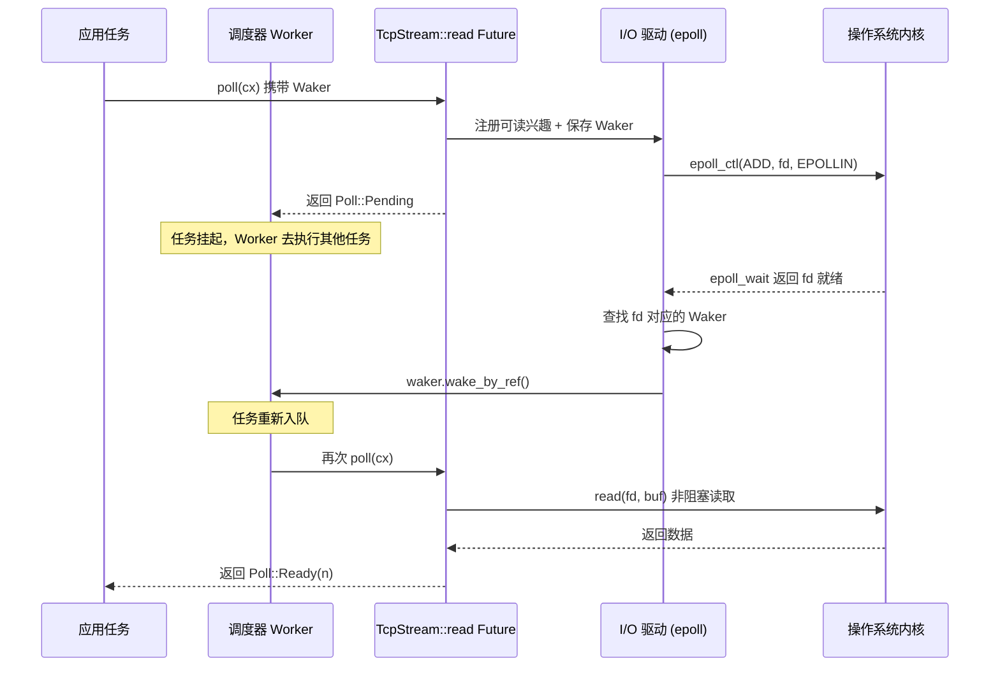

# Chapitre 1 : Le modèle mental de l'asynchrone : le trio Future, Waker et exécuteur

La programmation asynchrone en Rust n'est pas une bibliothèque, mais un protocole au niveau du langage. Si Tokio a pu devenir un runtime de niveau production, ce n'est pas parce qu'il a inventé Future, mais parce qu'il implémente précisément les conditions limites de chaque contrat de ce protocole. Ce chapitre ne se précipite pas dans le code de l'ordonnanceur de Tokio, mais commence par expliquer en profondeur les frontières de responsabilité et le flux de contrôle inversé du « trio » — Future, Waker, Executor. Une fois compris comment ces trois éléments s'engrènent, l'assemblage du Runtime, l'ordonnancement work-stealing et le pilote d'I/O des chapitres suivants trouveront leur point d'ancrage.

# 1.1 Du blocage au tirage : pourquoi Rust choisit poll plutôt que les callbacks

## Modèle intuitif

Imaginez que vous commandez dans un restaurant un plat qui doit être préparé à la minute. L'asynchrone à base de callbacks (comme le style initial de Node.js) équivaut à laisser votre numéro de téléphone : une fois le plat prêt, le chef**vous appelle activement**— le contrôle est entre les mains du chef, votre code ne fait que répondre passivement. L'asynchrone à base de tirage (le choix de Rust) équivaut à recevoir un ticket de retrait : vous**décidez vous-même**quand aller demander au guichet « est-ce prêt ? » : si ce n'est pas prêt, vous faites autre chose ; si c'est prêt, vous récupérez.

Cette différence semble minime, mais elle détermine la forme de tout le système. Dans le modèle à callbacks, chaque opération asynchrone doit porter une closure « que faire une fois terminé », les closures s'imbriquent couche par couche pour former l'enfer des callbacks, et l'annulation est extrêmement difficile — vous ne pouvez pas « retirer » un callback déjà enregistré. Dans le modèle à tirage, un Future n'est qu'une machine à états,`poll`est une pure action d'interrogation : sans progression, aucune ressource n'est consommée ; annuler revient à drop, proprement et sans détour.

## Le contrat central du modèle à tirage

La bibliothèque standard Rust définit le trait`Future`avec seulement deux éléments : une méthode`poll`et un type associé`Output`. Tokio ne redéfinit pas ce trait, mais réutilise directement l'implémentation de la bibliothèque standard. Ce point est clairement visible dans le code source :

```rust
// tokio/src/future/mod.rs
cfg_not_trace! {
    cfg_rt! {
        pub(crate) use std::future::Future;
    }
}
```

[FACT:tokio/src/future/mod.rs:24-28]

Ce code révèle un fait important : lorsque la fonctionnalité`tracing`n'est pas activée, le`Future`interne de Tokio est un alias de`std::future::Future`, sans aucun emballage. Ce n'est que lorsque`tracing`est activé que`InstrumentedFuture`le remplace :

```rust
cfg_trace! {
    mod trace;
    #[allow(unused_imports)]
    pub(crate) use trace::InstrumentedFuture as Future;
}
```

[FACT:tokio/src/future/mod.rs:18-22]

> **[Design Inference & Architectural Trade-offs]**
> Cette conception « zéro coût par défaut, instrumentation à la demande » est la philosophie constante de Tokio : le chemin critique n'introduit aucune couche d'abstraction supplémentaire, l'observabilité s'ajoute comme fonctionnalité optionnelle.`InstrumentedFuture`L'existence de

## montre que l'équipe Tokio estime que le coût d'instrumentation de tracing ne doit pas être supporté par tous les utilisateurs.

`poll`Les trois contraintes implicites du contrat poll`fn poll(self: Pin<&mut Self>, cx: &mut Context<'_>) -> Poll<Self::Output>`La signature de la méthode

**est** `Pin<&mut Self>`. Cette signature cache trois contrats ; violer l'un d'eux entraîne un comportement indéfini ou une erreur logique :

**Contrat un : Pin garantit la sûreté des auto-références.**signifie qu'une fois qu'un Future est poll, son adresse mémoire ne peut plus être déplacée. Cela vient du fait qu'un bloc async, une fois compilé, génère une machine à états contenant des auto-références — les variables locales peuvent détenir des références vers d'autres champs de la même machine à états. Si le déplacement était autorisé, ces références deviendraient pendantes.`poll`Contrat deux : Pending doit avoir enregistré un réveil.`Poll::Pending`Lorsque`cx.waker()`Obtention et sauvegarde du Waker, ou enregistrement du Waker auprès d'une source d'événements. Sinon, l'exécuteur ne saura jamais quand ce Future peut être à nouveau poll, ce qui entraînerait une suspension permanente de la tâche.

**Contrat trois : après Ready, il ne faut plus poll.**Une fois que`poll`retourne`Poll::Ready`, poll à nouveau le même Future est une erreur logique (bien que cela ne provoque pas d'UB, le comportement est indéfini). L'exécuteur a la responsabilité de ne plus planifier cette tâche après avoir reçu Ready.

Parmi ces trois contrats, le contrat deux est l'endroit le plus susceptible de provoquer des erreurs, et c'est aussi la raison fondamentale de l'existence du Waker.

# 1.2 Waker : le vecteur du flux de contrôle inverse

## Modèle intuitif

Le Waker est le « bipeur de retrait » que le restaurant vous donne. Vous n'avez pas besoin de rester devant le comptoir à demander sans cesse « c'est prêt ? » — cela vous ferait perdre votre temps. Vous devez simplement, lors de votre première visite au comptoir, remettre le bipeur au chef (enregistrer le Waker), puis vaquer tranquillement à d'autres occupations. Quand le plat est prêt, le chef appuie sur le bouton, le bipeur vibre (appel de`wake`), vous recevez le signal puis retournez au comptoir retirer le plat (poll à nouveau).

Sans le Waker, l'exécuteur n'aurait que deux choix : soit interroger en boucle toutes les tâches (gaspillage de CPU), soit ne jamais poll les tâches ayant retourné Pending (famine des tâches). Le Waker est l'unique mécanisme permettant de briser ce blocage.

## Disposition mémoire et conception de la table virtuelle du Waker

Le Waker est un type de la bibliothèque standard, mais sa conception influence directement la structure des tâches de Tokio.`Waker`Il s'agit essentiellement d'un pointeur épais : une`RawWaker`structure, contenant un pointeur de données et un pointeur de table virtuelle.

```rust
// 标准库中的定义（非 Tokio 源码，此处为背景说明）
pub struct RawWaker {
    data: *const (),
    vtable: &'static RawWakerVTable,
}

pub struct RawWakerVTable {
    clone: unsafe fn(*const ()) -> RawWaker,
    wake: unsafe fn(*const ()),
    wake_by_ref: unsafe fn(*const ()),
    drop: unsafe fn(*const ()),
}
```

> **[Design Inference & Architectural Trade-offs]**
> L'ingéniosité de cette conception réside dans le fait que :`Waker`lui-même ne se soucie pas de ce que signifie concrètement « réveiller ». Il n'est que le support de quatre pointeurs de fonction. Tokio peut fournir un Waker dont la`wake`fonction repousse la tâche dans la file de planification ; tandis qu'un autre runtime (par exemple`futures`le`block_on`de la crate) peut fournir une implémentation de Waker complètement différente. Ce modèle « données + table virtuelle » permet au Waker d'être transmis entre différents runtimes sans perdre sa sémantique.

`wake`La différence entre`wake_by_ref`et`wake`est cruciale :`wake_by_ref`consomme la propriété du Waker (le Waker est drop après l'appel), tandis que`wake_by_ref`ne fait qu'emprunter. L'exécuteur implémente généralement`wake`comme « marquer la tâche comme prête et l'enfiler », tandis que

## gère en plus la décrémentation du compteur de références. Dans la structure de tâche de Tokio, le pointeur de données du Waker pointe vers l'en-tête du compteur de références de la tâche ; chaque clone incrémente le compteur, chaque drop le décrémente, et lorsque le compteur atteint zéro, la mémoire de la tâche est libérée.

Chronologie complète du réveil



Copie**Le point clé de ce diagramme est que :**Le Waker est l'unique canal permettant d'atteindre l'Executor depuis le Reactor en sens inverse

## . Le Reactor ne détient aucune autre information sur la tâche ; il sait seulement « quand ce fd est prêt, appeler ce Waker ». Ce découplage permet au driver d'I/O d'être implémenté indépendamment du planificateur, les deux ne communiquant que via cette interface étroite qu'est le Waker.

Réveil fallacieux : la zone grise du contrat

> Normally, tasks are scheduled only if they have been woken by calling `wake` on their waker. However, this is not guaranteed, and Tokio may schedule tasks that have not been woken under some circumstances.

[FACT:tokio/src/runtime/mod.rs:306-309]

> **[Design Inference & Architectural Trade-offs]**
> 〔Inférence de conception et compromis architecturaux〕`poll`Cela signifie que l'implémentation de

# doit pouvoir tolérer le cas où elle est poll à nouveau « sans avoir été réveillée ». Un Future correct, après avoir retourné Pending, même si aucun événement ne s'est produit, doit retourner Pending et non panic ou produire un résultat erroné lorsqu'il est poll à nouveau. Cette contrainte semble laxiste, mais elle impose en réalité des exigences sur la conception de la machine à états : on ne peut pas supposer qu'« un événement se produit nécessairement entre deux poll ».

## 1.3 Executor : de Future à l'encapsulation en tâche

Modèle intuitif

L'Executor est le dispatcheur du restaurant. Il a une pile de commandes (file de tâches) et décide quelle commande traiter en premier et par qui. Quand le bipeur vibre, il replace la commande correspondante dans la file. Sans dispatcheur, les chefs ne sauraient pas quel plat préparer ni quand changer de travail.**Mais la responsabilité de l'Executor va bien au-delà du simple « poll du Future ». Il doit résoudre trois problèmes fondamentaux :**Gestion du cycle de vie des tâches**(création, planification, achèvement, annulation),**Garantie d'équité**(empêcher qu'une tâche affame les autres),**Intégration des pilotes de ressources

## (comment les événements d'I/O et de minuterie se transforment en réveils).

Disposition mémoire de la tâche : du Future au Task`tokio::spawn`Lors de l'appel de`Task`, le Future passé n'est pas directement placé dans la file. Il est encapsulé dans une

```rust
/// Boundary value to prevent stack overflow caused by a large-sized
/// Future being placed in the stack.
pub(crate) const BOX_FUTURE_THRESHOLD: usize = if cfg!(debug_assertions)  {
    2048
} else {
    16384
};

pub(crate) struct AutoBox(std::marker::PhantomData);

impl AutoBox {
    /// `true` if a value of type `T` is larger than [`BOX_FUTURE_THRESHOLD`].
    pub(crate) const SHOULD_BOX: bool = std::mem::size_of::() > BOX_FUTURE_THRESHOLD;
}
```

[FACT:tokio/src/runtime/mod.rs:649-673]

Copie`AutoBox`Ce code résout un problème très concret : si le Future est trop grand (plus de 16 Ko, 2 Ko en mode debug), l'incorporer directement dans la structure Task provoquerait un débordement de pile ou un gaspillage de mémoire.`SHOULD_BOX`Décide si le Future doit être boxé via la constante de compilation

> **[Design Inference & Architectural Trade-offs]**
> Le commentaire souligne particulièrement « utiliser une constante associée plutôt qu'un`if`» : si l'on utilise une évaluation à l'exécution, le compilateur instancie pour chaque`T`simultanément le code des deux branches (une qui traite`T`, une qui traite`Pin<Box<T>>`), ce qui entraîne un gonflement du code. Avec une branche constante, le collecteur de monomorphisation élimine les branches inaccessibles et ne génère du code que pour les types réellement utilisés. C'est une optimisation typique consistant à « remplacer l'évaluation à l'exécution par le système de types ».

## Équité d'ordonnancement : les nombres magiques 31 et 61

La documentation du planificateur de Tokio définit une garantie d'équité formelle :

> If the total number of tasks does not grow without bound, and no task is blocking the thread, then it is guaranteed that tasks are scheduled fairly.

[FACT:tokio/src/runtime/mod.rs:279-281]

La mise en œuvre de cette garantie repose sur deux paramètres clés. Pour le runtime current-thread :

> The runtime will prefer to choose the next task to schedule from the local queue, and will only pick a task from the global queue if the local queue is empty, or if it has picked a task from the local queue 31 times in a row.

[FACT:tokio/src/runtime/mod.rs:328-333]

> The runtime will check for new IO or timer events whenever there are no tasks ready to be scheduled, or when it has scheduled 61 tasks in a row.

[FACT:tokio/src/runtime/mod.rs:335-337]

Ces deux nombres (31 et 61) ne sont pas choisis au hasard. 31 est 2 puissance 5 moins 1, ce qui permet un test rapide par opération bit à bit ; 61 sert à garantir que les événements d'E/S ne seront pas différés indéfiniment — même si la file de tâches n'est jamais vide, une vérification des E/S doit avoir lieu toutes les 61 planifications.

> **[Design Inference & Architectural Trade-offs]**
> Pourquoi 31 et non 32 ? Parce que le compteur part de 0, s'incrémente de 1 à chaque planification, et déclenche la vérification de la file globale lorsqu'il atteint 31. Utiliser`counter & 31 == 31`pour tester est plus efficace que`counter % 32 == 0`(bien que les compilateurs modernes l'optimisent automatiquement). Le choix de 61 est plus subtil : il doit être suffisamment grand pour éviter le coût fréquent des appels système epoll_wait, et suffisamment petit pour garantir une latence d'E/S acceptable.

## Optimisation du slot LIFO dans le runtime multithread

Le runtime multithread ajoute, en plus de l'équité, une optimisation de performance — le slot LIFO :

> The multi thread runtime uses the lifo slot optimization: Whenever a task wakes up another task, the other task is added to the worker thread's lifo slot instead of being added to a queue.

[FACT:tokio/src/runtime/mod.rs:373-377]

L'intuition derrière cette optimisation est la suivante : lorsqu'une tâche réveille une autre tâche, la tâche réveillée a probablement une dépendance de données avec la tâche courante (par exemple dans un modèle producteur-consommateur). En la plaçant dans le slot LIFO, elle s'exécute immédiatement après la fin de la tâche courante, ce qui permet d'exploiter les données chaudes du cache CPU.

Mais le slot LIFO dispose d'un mécanisme anti-abus :

> if a worker thread uses the lifo slot three times in a row, it is temporarily disabled until the worker thread has scheduled a task that didn't come from the lifo slot.

[FACT:tokio/src/runtime/mod.rs:380-382]

> **[Design Inference & Architectural Trade-offs]**
> Cette règle de « désactivation après trois utilisations consécutives » vise à empêcher deux tâches de se réveiller mutuellement et de former un livelock. Si la tâche A réveille la tâche B, et que B réveille A, sans cette limite, le slot LIFO serait occupé en permanence par ces deux tâches, et les autres tâches ne seraient jamais planifiées. La limite de trois donne aux autres tâches une chance de s'insérer.

## Annulation de tâche : la sémantique réelle d'abort

`JoinHandle::abort`Le comportement de

> Be aware that calls to `JoinHandle::abort` just schedule the task for cancellation, and will return before the cancellation has completed.

[FACT:tokio/src/task/mod.rs:146-148]

est souvent mal compris. La documentation précise clairement :`abort`n'est pas synchrone. Il ne fait que positionner un indicateur, et la tâche vérifiera cet indicateur au prochain point`.await`et se terminera d'elle-même. Si la tâche exécute du code intensif en CPU sans point`.await`,`abort`ne prendra pas effet immédiatement.

Plus subtil encore :

> Note that aborting a task does not guarantee that it fails with a cancelled error, since it may complete normally first.

[FACT:tokio/src/task/mod.rs:134-138]

> **[Design Inference & Architectural Trade-offs]**
> La motivation de conception de cette sémantique est que l'annulation est une opération « au mieux ». Tokio ne tue pas les tâches de force (Rust n'offre pas de mécanisme sûr de terminaison forcée), mais demande coopérativement aux tâches de se terminer d'elles-mêmes. Cela est cohérent avec la conception des tâches`spawn_blocking`non annulables — les tâches bloquantes n'ont pas de point`.await`et ne peuvent pas vérifier l'indicateur d'annulation.

# 1.4 Réflexions de conception : les frontières et le coût du trio

## Pourquoi Future n'inclut pas Executor

Le trait`Future`de Rust n'inclut délibérément pas d'information sur « comment se planifier ». C'est une décision de découplage mûrement réfléchie. Si un Future connaissait son Executor, alors :

1. Le même Future ne pourrait pas s'exécuter sur différents runtimes (par exemple migrer de Tokio vers async-std)

2. Lors des tests, il serait impossible d'utiliser un simple`block_on`pour le piloter

3. Les combinateurs (comme`select!`、`join!`) ne pourraient pas fonctionner à travers les runtimes

L'existence de Waker vise précisément à préserver ce découplage tout en permettant au Future de notifier l'Executor. Waker est un « jeton de capacité » — le Future sait seulement « je peux appeler ceci pour demander une replanification », mais ignore comment la planification se produit concrètement.

## Le coût de l'ordonnancement coopératif

Les tâches de Tokio sont coopératives : une tâche ne cède le contrôle qu'aux points`.await`. Cela signifie :

> code that spends a long time without reaching an `.await` will prevent other tasks from running.

[FACT:tokio/src/lib.rs:178-179]

> **[Design Inference & Architectural Trade-offs]**
> C'est le coût fondamental de l'ordonnancement coopératif. Le système d'exploitation peut préempter un thread à n'importe quelle frontière d'instruction, mais Tokio ne peut changer de tâche qu'aux points`.await`. Si une tâche exécute une boucle intensive en CPU de 10 secondes sans point`.await`intermédiaire, alors toutes les autres tâches du même thread worker seront bloquées pendant 10 secondes. La stratégie de Tokio consiste à fournir`spawn_blocking`et`block_in_place`, pour transférer ce type de travail vers un pool de threads dédié. Mais c'est la responsabilité de l'utilisateur, le runtime ne peut pas le détecter automatiquement.

## Conditions aux limites de la garantie d'équité

La garantie d'équité de Tokio a deux prérequis : le nombre total de tâches est borné, et aucune tâche ne bloque le thread. Ces deux conditions sont souvent violées en environnement de production réel :

- Si des tâches ne cessent de spawn de nouvelles tâches sans les recycler, le nombre total de tâches n'est pas borné et la garantie d'équité devient caduque
- Si une tâche exécute un appel système bloquant (par exemple des E/S fichier synchrones), elle bloque tout le thread worker

> **[Design Inference & Architectural Trade-offs]**
> C'est pourquoi la documentation de Tokio insiste à plusieurs reprises : « n'exécutez pas d'opérations bloquantes dans des tâches asynchrones ». La garantie d'équité n'est pas une garantie stricte du runtime, mais une garantie « sous réserve d'une utilisation correcte ». Le runtime ne détecte pas les violations, car la détection elle-même a un coût.

# 1.5 Résumé de ce chapitre

Ce chapitre établit les trois pierres angulaires pour comprendre Tokio :

**Future est une machine à états de type pull.** `poll`est une pure action de requête, retourne`Pending`doit avoir enregistré un waker au moment du retour,`Ready`ne doit plus être poll après le retour. Tokio réutilise directement`std::future::Future`, sans encapsulation supplémentaire (sauf si tracing est activé).

**Waker est le seul canal de contrôle inverse du flux.**Il réalise l'indépendance vis-à-vis du runtime grâce à une conception « pointeur de données + table virtuelle ».`wake`consomme la propriété,`wake_by_ref`emprunte seulement. Les réveils spurieux sont autorisés, Future doit les tolérer.

**Executor est responsable du cycle de vie, de l'équité et de l'intégration des ressources.**Il encapsule Future en Task, via`AutoBox`décide à la compilation s'il faut boxer, équilibre l'ordonnancement entre la file locale et la file globale via les deux nombres magiques 31/61, et optimise les performances des scénarios de dépendance de données via le slot LIFO.

Ces trois composants sont découplés par des interfaces étroites : Future ne connaît que`poll`, Waker ne connaît que`wake`, Executor ne connaît que « poll jusqu'à Pending ou Ready ». C'est précisément ce découplage qui permet à Tokio d'implémenter l'ordonnancement work-stealing, l'intégration du driver I/O, le budget coopératif et d'autres fonctionnalités avancées sans modifier la définition de Future.

# Réflexions et auto-évaluation de ce chapitre

Q1 : Si l'on change`AutoBox::SHOULD_BOX`d'une constante de compilation en un`if size_of::<T>() > THRESHOLD`à l'exécution, quel impact cela aurait-il sur le binaire compilé ? Pourquoi les commentaires de Tokio insistent-ils particulièrement sur ce point ?

**Analyse de référence**: Selon les commentaires de[FACT:tokio/src/runtime/mod.rs:657-667], si l'on utilise un`if`à l'exécution, le compilateur instanciera simultanément le code des deux branches pour chaque`T`— une branche gérant le cas où`T`est directement inliné, une autre gérant le cas`Pin<Box<T>>`. Cela signifie que chaque type de Future spawné générera deux copies du code de pilotage de tâche (task harness), doublant la taille du binaire. En utilisant la constante associée`SHOULD_BOX`, comme elle est une constante de compilation une fois`T`déterminé, le collecteur de monomorphisation éliminera les branches inaccessibles et ne générera du code que pour le chemin réellement utilisé. C'est une optimisation typique « remplacer le jugement à l'exécution par le système de types », au prix que`AutoBox`doit être une structure générique et non une fonction ordinaire.

Q2 : Supposons qu'une tâche retourne`poll`dans`Pending`, mais oublie d'enregistrer un Waker. Que se passe-t-il pour cette tâche dans un runtime current-thread et dans un runtime multi-thread ? Tokio dispose-t-il d'un mécanisme pour détecter cette situation ?

**Analyse de référence**: Selon[FACT:tokio/src/runtime/mod.rs:306-309], Tokio autorise les réveils spurieux, ce qui signifie qu'une tâche peut être réordonnancée sans avoir été réveillée. Mais cela ne signifie pas qu'oublier d'enregistrer un Waker est sûr. Dans un runtime current-thread, si la file locale et la file globale sont toutes deux vides, le runtime entre dans un état`park`en attente d'événements I/O ou de timers. Une tâche qui a oublié d'enregistrer un Waker ne sera jamais remise en file, provoquant une suspension permanente. Dans un runtime multi-thread, la situation est similaire, mais si d'autres tâches réveillent continuellement, cette tâche pourrait être réordonnancée accidentellement en raison de réveils spurieux — mais cela n'est pas fiable. Tokio n'a pas de mécanisme de détection à l'exécution pour découvrir le cas « retourne Pending mais n'a pas enregistré de Waker », car cela nécessiterait de vérifier après chaque poll si le Waker a été utilisé, ce qui coûterait trop cher. C'est la responsabilité de l'implémenteur de Future.

Q3 : La règle « désactivation après trois utilisations consécutives » du slot LIFO vise à prévenir quel scénario concret ? Si l'on supprimait cette limitation, dans quel mode de dépendance entre tâches d'autres tâches seraient-elles affamées ?

**Analyse de référence**: Selon[FACT:tokio/src/runtime/mod.rs:380-382], le slot LIFO est temporairement désactivé après trois utilisations consécutives, jusqu'à ce qu'une tâche provenant d'une source non-LIFO soit ordonnancée. Le scénario que cette règle prévient est : deux tâches qui se réveillent mutuellement formant une boucle serrée. Par exemple, la tâche A réveille la tâche B après avoir traité un lot de données, et la tâche B réveille immédiatement la tâche A après avoir terminé. Sans la limite de trois, A et B occuperaient éternellement le slot LIFO, le thread worker basculerait infiniment entre ces deux tâches, et les autres tâches de la file locale et de la file globale n'obtiendraient jamais de chance d'exécution. La limite de trois garantit qu'après chaque cycle de trois tours de « réveil mutuel », au moins une autre tâche est ordonnancée, brisant le livelock. Le choix de ce nombre est empirique : trop petit réduit le gain de l'optimisation LIFO, trop grand augmente la latence des autres tâches.

À ce stade, les frontières de responsabilité et les mécanismes de collaboration entre Future, Waker et Executor sont clairs : Future définit le calcul, Waker est responsable du réveil, Executor pilote l'exécution. Mais un composant isolé ne peut pas fonctionner indépendamment ; ils doivent être assemblés dans un environnement d'exécution unifié. Dans le prochain chapitre, nous suivrons la chaîne d'assemblage complète de Runtime::new et Builder::build, pour voir comment le scheduler, le driver I/O, le driver temporel et le pool de threads bloquants sont injectés dans la même instance Runtime, et révéler les différences fondamentales entre les formes current_thread et multi_thread au stade de l'assemblage.
