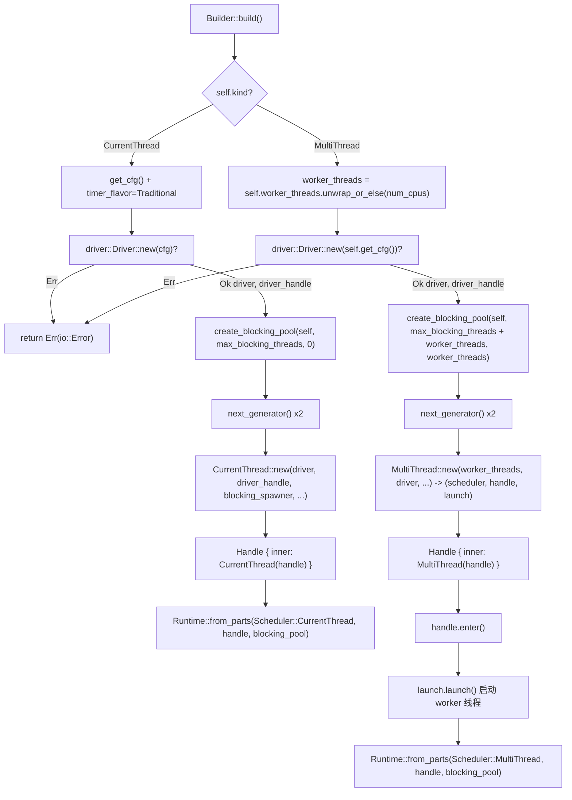

# Chapitre 2 : L'assemblage du Runtime : comment Builder assemble les drivers, le scheduler et le pool de threads

# De`Builder`à`Runtime`: le parcours complet d'un assemblage

Dans le chapitre précédent, nous avons clarifié les frontières de responsabilité entre Future, Waker et Executor. Mais un runtime réellement utilisable va bien au-delà d'« un Executor » — il nécessite également une boucle d'événements I/O, un timer, un pool de threads bloquants, et ces composants doivent partager le même ensemble de handles et le même cycle de vie. Ce chapitre retrace la chaîne d'assemblage complète de`Builder::build`et répond à une question centrale :**Quels composants existe-t-il à l'intérieur d'un`Runtime`, comment sont-ils assemblés et comment partagent-ils les handles**。

Le point d'entrée de l'assemblage de Tokio est`Builder`. Il s'agit en soi d'un pur conteneur de configuration, tous ses champs sont des « déclarations d'intention » et ne détiennent aucune ressource d'exécution. La véritable création de ressources se produit lors de l'appel à`build()`.

## Modèle intuitif : le Builder est le « plan de décoration », le Runtime est la « maison livrée »

`Builder`ressemble à un plan de décoration : vous y annotez « combien de pièces (worker_threads) », « faut-il l'eau courante (enable_io) », « faut-il l'électricité (enable_time) », « la limite de sous-traitants (max_blocking_threads) ». Le plan lui-même ne produit aucune entité. Ce n'est qu'au moment de l'appel à`build()`que l'équipe de construction se met au travail selon le plan, érige réellement les « pièces » que sont le scheduler, les drivers et le pool de threads, et livre une instance de`Runtime`.

Sans la couche`Builder`, l'utilisateur devrait manuellement instancier chaque composant, câbler manuellement, et gérer manuellement le rollback en cas d'échec — toute erreur d'ordre entraînerait des handles suspendus ou des fuites de ressources.`Builder`La valeur de**réside dans : la séparation complète entre « configuration » et « construction », permettant au processus de construction de centraliser la validation, le nettoyage en cas d'échec et le partage des handles**。

## Disposition mémoire :`Builder`partitionnement des champs de

`Builder`Les champs de**peuvent être divisés en quatre groupes selon leur responsabilité. Le premier groupe est**：`kind`Forme et commutateurs`enable_io` / `enable_time`détermine la forme du scheduler,

[FACT:tokio/src/runtime/builder.rs:55-68]

```rust
pub struct Builder {
    kind: Kind,
    name: Option,
    enable_io: bool,
    nevents: usize,
    nevents_busy: Option,
    enable_time: bool,
    start_paused: bool,
    // ...
}
```

Copie**Le deuxième groupe est**：`worker_threads`Paramètres du pool de threads`Option<usize>`，`None`est`max_blocking_threads`signifie « différer jusqu'au build pour détecter automatiquement selon le nombre de cœurs CPU » ;

[FACT:tokio/src/runtime/builder.rs:73-79]

```rust
worker_threads: Option,
max_blocking_threads: usize,
```

Copie**Le troisième groupe est**Hooks de rappel`Option<Arc<dyn Fn ...>>`, tous sont`Arc`. Notez qu'ils utilisent`Box`plutôt que`Config`。

[FACT:tokio/src/runtime/builder.rs:87-97]

```rust
pub(super) after_start: Option,
pub(super) before_stop: Option,
pub(super) before_park: Option,
pub(super) after_unpark: Option,
```

de chaque thread worker**Copie**：`global_queue_interval`、`event_interval`、`disable_lifo_slot`、`seed_generator`。

[FACT:tokio/src/runtime/builder.rs:116-134]

```rust
pub(super) global_queue_interval: Option,
pub(super) event_interval: u32,
pub(super) disable_lifo_slot: bool,
pub(super) seed_generator: RngSeedGenerator,
```

Heuristiques de scheduling et graine aléatoire`Kind`Copie`Copy`Il y a ici un design digne d'attention :

[FACT:tokio/src/runtime/builder.rs:261-265]

```rust
#[derive(Clone, Copy)]
pub(crate) enum Kind {
    CurrentThread,
    #[cfg(feature = "rt-multi-thread")]
    MultiThread,
}
```

`MultiThread`petit enum, avec seulement deux variantes.`rt-multi-thread`Copie`rt`La variante`Kind`est conditionnée par la feature`build()`. Cela signifie que dans une compilation où seule la feature`match`est activée,**n'a qu'une seule variante,**。

## et le

`Builder::new`de`enable_io`sera optimisé par le compilateur en une seule branche —`enable_time`Utiliser le système de types plutôt qu'une vérification à l'exécution pour éliminer la taille de code du scheduler multi-thread`false`。

[FACT:tokio/src/runtime/builder.rs:309-318]

```rust
// I/O defaults to "off"
enable_io: false,
nevents: 1024,
nevents_busy: None,

// Time defaults to "off"
enable_time: false,

// The clock starts not-paused
start_paused: false,
```

> **[Design Inference & Architectural Trade-offs]**
> et`#[tokio::main]`tous deux à`enable_all()`。

`enable_all()`Copie

[FACT:tokio/src/runtime/builder.rs:398-419]

```rust
pub fn enable_all(&mut self) -> &mut Self {
    #[cfg(any(
        feature = "net",
        all(unix, feature = "process"),
        all(unix, feature = "signal")
    ))]
    self.enable_io();

    #[cfg(all(
        tokio_unstable,
        feature = "io-uring",
        // ...
    ))]
    self.enable_io_uring();

    #[cfg(feature = "time")]
    self.enable_time();

    self
}
```

Ce choix de valeur par défaut est délibéré : créer un driver I/O nécessite de demander un handle epoll/kqueue au système d'exploitation, créer un driver time nécessite de démarrer l'infrastructure de timer. Si l'utilisateur veut simplement un scheduler de tâches purement calculatoire (par exemple exécuter une logique async intensive en CPU), forcer la création de ces drivers est un pur gaspillage.`enable_io()`La macro`net`、`process`est « prête à l'emploi » parce qu'elle appelle en interne`signal`L'implémentation de`time` feature，`enable_all()`révèle comment le feature gating influence la sémantique du « tout activé ».

## Copie`build()`Notez que

`build()`n'est appelé que lorsque la feature`kind`ou

[FACT:tokio/src/runtime/builder.rs:1146-1152]

```rust
pub fn build(&mut self) -> io::Result {
    match &self.kind {
        Kind::CurrentThread => self.build_current_thread_runtime(),
        #[cfg(feature = "rt-multi-thread")]
        Kind::MultiThread => self.build_threaded_runtime(),
    }
}
```

n'ouvrira pas le driver I/O — car le code du driver I/O n'existe tout simplement pas dans le binaire compilé.

### Chemin principal d'assemblage :

`build_current_thread_runtime`la bifurcation de`build_current_thread_runtime_components`est le point de départ de l'assemblage, il se bifurque selon`Runtime`。

[FACT:tokio/src/runtime/builder.rs:1725-1736]

```rust
fn build_current_thread_runtime(&mut self) -> io::Result {
    use crate::runtime::runtime::Scheduler;

    let (scheduler, handle, blocking_pool) =
        self.build_current_thread_runtime_components(None)?;

    Ok(Runtime::from_parts(
        Scheduler::CurrentThread(scheduler),
        handle,
        blocking_pool,
    ))
}
```

Copie`build_current_thread_runtime_components`La différence entre ces deux chemins va bien au-delà de « un thread vs plusieurs threads ». Développons-les séparément ci-dessous.

[FACT:tokio/src/runtime/builder.rs:1760-1766]

```rust
let mut cfg = self.get_cfg();
cfg.timer_flavor = TimerFlavor::Traditional;
let (driver, driver_handle) = driver::Driver::new(cfg)?;

// Blocking pool
let blocking_pool = blocking::create_blocking_pool(self, self.max_blocking_threads, 0);
let blocking_spawner = blocking_pool.spawner().clone();
```

est lui-même très mince, il délègue à`driver`, puis encapsule le triplet retourné dans`(driver, driver_handle)`Copie`?`La véritable logique d'assemblage se trouve dans`build`. Son ordre d'exécution est crucial :`Err`Copie

La première étape crée`spawner`, retourne une paire de`spawner`. Notez qu'ici

propage directement l'erreur vers le haut — si l'initialisation du driver I/O échoue (par exemple échec de création d'epoll), tout

[FACT:tokio/src/runtime/builder.rs:1768-1770]

```rust
let seed_generator_1 = self.seed_generator.next_generator();
let seed_generator_2 = self.seed_generator.next_generator();
```

> **[Design Inference & Architectural Trade-offs]**
> La deuxième étape crée le blocking pool, et en extrait immédiatement le clone de son`seed_generator_1`. Ce`Config`sera injecté dans le scheduler, donnant au scheduler la capacité de soumettre des tâches bloquantes au pool de threads.`select!`La troisième étape génère deux générateurs de graines RNG indépendants.`seed_generator_2`Copie`CurrentThread::new`〔Inférence de conception et compromis architecturaux〕`rng_seed`Pourquoi en faut-il deux ?

est placé dans`Config`, pour un usage interne au scheduler (par exemple l'ordre de branchement aléatoire de`CurrentThread::new`。

[FACT:tokio/src/runtime/builder.rs:1776-1807]

```rust
let (scheduler, handle) = CurrentThread::new(
    driver,
    driver_handle,
    blocking_spawner,
    seed_generator_2,
    Config {
        before_park: self.before_park.clone(),
        after_unpark: self.after_unpark.clone(),
        // ...
        global_queue_interval: self.global_queue_interval,
        event_interval: self.event_interval,
        // ...
        enable_eager_driver_handoff: false,
        seed_generator: seed_generator_1,
        // ...
    },
    local_tid,
    self.name.clone(),
);
```

est transmis à`enable_eager_driver_handoff`, pour un usage côté tâche. Séparer les deux générateurs permet d'éviter que la consommation de nombres aléatoires en interne par le scheduler n'affecte la séquence aléatoire visible par l'utilisateur, garantissant ainsi la reproductibilité de`false`。

[FACT:tokio/src/runtime/builder.rs:1795-1798]

```rust
// This setting never makes sense for a current thread runtime,
// as it only configures how the I/O driver is stolen across
// workers.
enable_eager_driver_handoff: false,
```

> **[Design Inference & Architectural Trade-offs]**
> Ce commentaire souligne l'essence de cette option : elle décrit « comment plusieurs workers se disputent le driver I/O », or current_thread n'a qu'un seul thread, il n'y a donc pas de préemption, d'où la désactivation forcée. C'est un exemple typique de « sémantique d'une option de configuration fortement corrélée à sa forme » — le même`Builder`champ a une signification différente selon la forme.

Enfin,`CurrentThread::new`le`handle`retourné est encapsulé dans`scheduler::Handle::CurrentThread`, puis dans le`Handle`。

[FACT:tokio/src/runtime/builder.rs:1816-1822]

```rust
let handle = Handle {
    inner: scheduler::Handle::CurrentThread(handle),
};

Ok((scheduler, handle, blocking_pool))
```

### Chemin deux : l'assemblage de multi_thread

`build_threaded_runtime`Le squelette de  est similaire à celui de current_thread, mais présente trois différences essentielles. La première concerne la détermination du nombre de threads worker :

[FACT:tokio/src/runtime/builder.rs:2185]

```rust
let worker_threads = self.worker_threads.unwrap_or_else(num_cpus);
```

`None`est ici résolu en`num_cpus()`. C'est le point d'application de la « détection automatique différée » — la détection a lieu au moment du build et non au moment de`Builder::new`, car l'affinité CPU peut changer entre les deux.

La deuxième différence réside dans le calcul de la capacité du blocking pool :

[FACT:tokio/src/runtime/builder.rs:2189-2192]

```rust
let blocking_pool =
    blocking::create_blocking_pool(self, self.max_blocking_threads + worker_threads, worker_threads);
let blocking_spawner = blocking_pool.spawner().clone();
```

Noter que`max_blocking_threads + worker_threads`. En comparaison, le chemin current_thread passe`self.max_blocking_threads`et`0`。

[FACT:tokio/src/runtime/builder.rs:1765]

```rust
let blocking_pool = blocking::create_blocking_pool(self, self.max_blocking_threads, 0);
```

> **[Design Inference & Architectural Trade-offs]**
> Cette différence révèle la sémantique de la capacité du blocking pool : sous multi_thread,`max_blocking_threads`représente la limite « supplémentaire » de threads bloquants ; la limite totale réelle doit ajouter le nombre de threads worker. Le troisième paramètre (0 pour current_thread,`worker_threads`pour multi_thread) est très probablement une indication du « nombre de threads réservés » ou du « nombre de threads initiaux ». Cette conception maintient la cohérence sémantique de`max_blocking_threads`entre les deux formes : il décrit « combien de threads bloquants supplémentaires peuvent être ouverts au-delà des workers principaux ».

La troisième différence est que`MultiThread::new`retourne un triplet plutôt qu'un couple :

[FACT:tokio/src/runtime/builder.rs:2198-2226]

```rust
let (scheduler, handle, launch) = MultiThread::new(
    worker_threads,
    driver,
    driver_handle,
    blocking_spawner,
    seed_generator_2,
    Config {
        // ...
        enable_eager_driver_handoff: self.enable_eager_driver_handoff,
        // ...
    },
    self.timer_flavor,
    self.name.clone(),
);
```

Le`launch`supplémentaire est un « handle de démarrage ».`MultiThread::new`se charge uniquement de construire la structure du scheduler,**sans démarrer immédiatement les threads worker**. Le démarrage effectif a lieu plus tard :

[FACT:tokio/src/runtime/builder.rs:2228-2234]

```rust
let handle = Handle { inner: scheduler::Handle::MultiThread(handle) };

// Spawn the thread pool workers
let _enter = handle.enter();
launch.launch();

Ok(Runtime::from_parts(Scheduler::MultiThread(scheduler), handle, blocking_pool))
```

`handle.enter()`entre dans le contexte runtime, puis`launch.launch()`spawn réellement tous les threads worker. Cette conception en deux phases « construire d'abord, démarrer ensuite » est cruciale.

> **[Design Inference & Architectural Trade-offs]**
> Pourquoi ne pas démarrer en même temps que l'on construit ? Parce qu'une fois lancés, les threads worker commencent immédiatement à poller des tâches, et ces tâches peuvent référencer`handle`. Si`handle`n'est pas encore entièrement construit, on obtient une course où « le worker détient un handle à moitié fini ». La conception en deux phases garantit que :**au démarrage de tous les threads worker, le`Handle`complet est déjà prêt**。`_enter`Le guard garantit que les threads worker sont, dès l'instant de leur démarrage, dans le bon contexte runtime.

## Diagramme de flux d'assemblage

Le schéma ci-dessous réunit l'ordre d'assemblage, les branches clés et les chemins d'erreur des deux chemins. Noter que lorsque`driver::Driver::new`échoue, on retourne directement`Err`, le blocking pool n'étant pas encore créé à ce stade.



## Partage de handle :`Handle`comment  devient un « laissez-passer » inter-composants

Une fois l'assemblage terminé,`Runtime`détient le trio`scheduler`、`handle`、`blocking_pool`. Parmi eux,`handle`est le cœur partagé. En interne, c'est une énumération :

[FACT:tokio/src/runtime/scheduler/mod.rs:29-41]

```rust
#[derive(Debug, Clone)]
pub(crate) enum Handle {
    #[cfg(feature = "rt")]
    CurrentThread(Arc),

    #[cfg(feature = "rt-multi-thread")]
    MultiThread(Arc),

    #[cfg(not(feature = "rt"))]
    #[allow(dead_code)]
    Disabled,
}
```

Noter que les deux variantes encapsulent`Arc`. Cela signifie que le clone de`Handle`est un incrément de compteur de références peu coûteux, pouvant être distribué librement à n'importe quel thread.`Handle`fournit une interface d'accès unifiée, encapsulant les différences de forme à l'intérieur de`match`. Par exemple`driver()`：

[FACT:tokio/src/runtime/scheduler/mod.rs:53-64]

```rust
pub(crate) fn driver(&self) -> &driver::Handle {
    match *self {
        #[cfg(feature = "rt")]
        Handle::CurrentThread(ref h) => &h.driver,

        #[cfg(feature = "rt-multi-thread")]
        Handle::MultiThread(ref h) => &h.driver,

        #[cfg(not(feature = "rt"))]
        Handle::Disabled => unreachable!(),
    }
}
```

`blocking_spawner()`utilise la macro`match_flavor!`pour éliminer la répétition :

[FACT:tokio/src/runtime/scheduler/mod.rs:96-98]

```rust
pub(crate) fn blocking_spawner(&self) -> &blocking::Spawner {
    match_flavor!(self, Handle(h) => &h.blocking_spawner)
}
```

Cette macro se développe exactement en`driver()`comme ci-dessus`match`. Son intérêt : lorsqu'on ajoute un accesseur nécessitant une distribution selon la forme, une seule ligne de`match_flavor!`suffit, sans avoir à écrire deux fois les branches`match`.

Le`Handle`public est une fine enveloppe autour du`scheduler::Handle`interne :

[FACT:tokio/src/runtime/handle.rs:13-15]

```rust
pub struct Handle {
    pub(crate) inner: scheduler::Handle,
}
```

Le`Handle`obtenu par l'utilisateur peut être cloné entre threads, peut`spawn`, peut`block_on`。`spawn`L'implémentation de  illustre la branche à la compilation de`AutoBox`:

[FACT:tokio/src/runtime/handle.rs:197-208]

```rust
pub fn spawn(&self, future: F) -> JoinHandle
where
    F: Future + Send + 'static,
    F::Output: Send + 'static,
{
    let fut_size = mem::size_of::();
    if AutoBox::::SHOULD_BOX {
        self.spawn_named(Box::pin(future), SpawnMeta::new_unnamed(fut_size))
    } else {
        self.spawn_named(future, SpawnMeta::new_unnamed(fut_size))
    }
}
```

`AutoBox::<F>::SHOULD_BOX`est une constante associée, dérivée de la comparaison entre`size_of::<F>()`et un seuil.

[FACT:tokio/src/runtime/mod.rs:668-673]

```rust
pub(crate) struct AutoBox(std::marker::PhantomData);

impl AutoBox {
    pub(crate) const SHOULD_BOX: bool = std::mem::size_of::() > BOX_FUTURE_THRESHOLD;
}
```

> **[Design Inference & Architectural Trade-offs]**
> Le commentaire explique pourquoi utiliser une constante associée plutôt qu'un`if`à l'exécution : avec un test à l'exécution,`spawn_named`serait monomorphisé deux fois (une fois pour`F`, une fois pour`Pin<Box<F>>`), ce qui générerait deux copies du harness de tâche pour chaque future spawné, doublant la taille du code. Avec une branche constante, le collecteur de monomorphisation ne conserve que la branche réellement empruntée.

## Réflexions de conception : ordre d'assemblage, récupération d'erreur et pièges en production

**L'ordre est un contrat**. L'ordre d'assemblage`driver -> blocking_pool -> scheduler`n'est pas arbitraire. Le driver est créé en premier, car c'est la seule étape susceptible d'échouer par manque de ressources OS et qui, en cas d'échec, ne nécessite le nettoyage d'aucun autre composant. Le blocking_pool vient après le driver et avant le scheduler, car le scheduler a besoin du blocking_spawner. Si la création du blocking_pool échoue (en pratique, elle échoue rarement), le driver est nettoyé automatiquement par drop.

**La branche`local_tid`de current_thread**。`build_local`emprunte`build_current_thread_local_runtime`, en y passant l'ID du thread courant :

[FACT:tokio/src/runtime/builder.rs:1738-1751]

```rust
fn build_current_thread_local_runtime(&mut self) -> io::Result {
    use crate::runtime::local_runtime::LocalRuntimeScheduler;

    let tid = std::thread::current().id();

    let (scheduler, handle, blocking_pool) =
        self.build_current_thread_runtime_components(Some(tid))?;

    Ok(LocalRuntime::from_parts(
        LocalRuntimeScheduler::CurrentThread(scheduler),
        handle,
        blocking_pool,
    ))
}
```

Ce`tid`est stocké dans`Handle`, et par la suite`can_spawn_local_on_local_runtime`l'utilise pour vérifier « si spawn_local est appelé sur le thread owner » :

[FACT:tokio/src/runtime/scheduler/mod.rs:140-147]

```rust
pub(crate) fn can_spawn_local_on_local_runtime(&self) -> bool {
    match self {
        Handle::CurrentThread(h) => h.local_tid.is_some_and(|x| std::thread::current().id() == x),

        #[cfg(feature = "rt-multi-thread")]
        Handle::MultiThread(_) => false,
    }
}
```

> **[Design Inference & Architectural Trade-offs]**
> C'est la pierre angulaire de la sûreté de`LocalRuntime`:`!Send`le future de  ne peut être pollé que sur son thread owner, et`local_tid`est précisément le point de contrôle à l'exécution de cette contrainte. Sans cette vérification, un spawn_local inter-threads entraînerait un accès concurrent aux données de`!Send`, provoquant un UB.

**Piège en production un :`worker_threads(0)`provoque un panic**。`worker_threads`La méthode  comporte une assertion :

[FACT:tokio/src/runtime/builder.rs:582-586]

```rust
pub fn worker_threads(&mut self, val: usize) -> &mut Self {
    assert!(val > 0, "Worker threads cannot be set to 0");
    self.worker_threads = Some(val);
    self
}
```

Cette assertion échoue dès la phase de configuration, plutôt que d'attendre le build. L'avantage est que l'erreur est localisée plus tôt, l'inconvénient est que si le nombre de threads provient d'une valeur dynamique du fichier de configuration, l'utilisateur doit la valider lui-même avant l'appel.

**Piège de production n°2 :`max_blocking_threads`Une valeur trop petite provoque un blocage**. La documentation avertit explicitement :

[FACT:tokio/src/runtime/builder.rs:600-601]

```rust
/// It's recommended to not set this limit too low in order to avoid hanging on operations
/// requiring [`spawn_blocking`].
```

> **[Design Inference & Architectural Trade-offs]**
> Parce que la file d'attente du blocking pool n'a pas de contre-pression — les tâches s'accumulent jusqu'à ce qu'un thread soit disponible. Si tous les threads bloquants attendent une opération qui « nécessite un nouveau thread bloquant pour se terminer », il y a interblocage. La phrase de la documentation « the queue does not apply any backpressure, it could potentially grow unbounded » est précisément la note de bas de page de ce risque.

**Piège de production n°3 :`UnhandledPanic::ShutdownRuntime`Seul current_thread est pris en charge**。

[FACT:tokio/src/runtime/builder.rs:1374-1381]

```rust
pub fn unhandled_panic(&mut self, behavior: UnhandledPanic) -> &mut Self {
    if !matches!(self.kind, Kind::CurrentThread) && matches!(behavior, UnhandledPanic::ShutdownRuntime) {
        panic!("UnhandledPanic::ShutdownRuntime is only supported in current thread runtime");
    }

    self.unhandled_panic = behavior;
    self
}
```

> **[Design Inference & Architectural Trade-offs]**
> La raison de cette limitation est que : en multi_thread, « arrêter immédiatement le runtime » nécessite de coordonner l'arrêt de tous les worker threads, ce qui est complexe à implémenter et sémantiquement ambigu (que faire des autres tâches en cours de poll ?). current_thread n'a qu'un seul thread, la sémantique d'arrêt est claire.

## Résumé de ce chapitre

Ce chapitre a retracé la`Builder::build`chaîne d'assemblage complète de . Conclusion principale :

1. `Builder`est un pur conteneur de configuration,`build()`est ce qui crée les ressources. L'ordre d'assemblage`driver -> blocking_pool -> scheduler`est déterminé par les besoins de récupération d'erreur.

2. La différence entre current_thread et multi_thread ne se limite pas au nombre de threads : le calcul de la capacité du blocking pool diffère (`max_blocking_threads` vs `max_blocking_threads + worker_threads`), multi_thread possède un`launch`démarrage en deux phases supplémentaire,`enable_eager_driver_handoff`est forcé à la fermeture sous current_thread.

3. `Handle`est le cœur partagé entre les composants, utilisant en interne`Arc`pour envelopper les handles spécifiques à chaque forme, accessible uniformément via`match`ou la`match_flavor!`macro .

4. `AutoBox`utilise des constantes associées pour décider à la compilation s'il faut boxer le future, évitant le doublement de la taille du code.

5. `local_tid`est le`LocalRuntime`point de contrôle à l'exécution de la sécurité de .

Dans le prochain chapitre, nous entrerons dans le cycle de vie des tâches :`spawn`comment transformer un Future en entité planifiable,`JoinHandle`comment interagir avec la machine à états des tâches, et les transitions d'état des tâches entre`PENDING` / `RUNNING` / `COMPLETE`.

# Réflexions et auto-évaluation de ce chapitre

Q1 : Si l'on change dans`build_threaded_runtime`le paramètre de capacité de`create_blocking_pool`de`self.max_blocking_threads + worker_threads`en`self.max_blocking_threads`, dans quel scénario cela provoquerait-il la famine des tâches bloquantes ? Pourquoi le chemin current_thread peut-il passer`self.max_blocking_threads`？

**Analyse de référence**: Selon[FACT:tokio/src/runtime/builder.rs:2189-2192], le chemin multi_thread passe`self.max_blocking_threads + worker_threads`, tandis que le chemin current_thread[FACT:tokio/src/runtime/builder.rs:1765]passe`self.max_blocking_threads`. La racine de la différence réside dans le fait que : en multi_thread, les worker threads eux-mêmes exécutent aussi des tâches bloquantes (par exemple`block_in_place`convertit temporairement un worker thread en thread bloquant), donc le budget total de threads bloquants doit inclure le nombre de worker threads. Si l'on change pour ne passer que`self.max_blocking_threads`, lorsque`max_blocking_threads`est défini à une valeur faible (par exemple 1) et qu'un worker thread occupe déjà le budget dans`block_in_place`, les nouvelles tâches`spawn_blocking`n'auront plus de thread disponible et s'accumuleront dans la file sans contre-pression, provoquant la suspension permanente des tâches async dépendant de ces tâches bloquantes. current_thread n'a qu'un seul thread et ne prend pas en charge la sémantique de conversion de worker de`block_in_place`, donc il n'est pas nécessaire d'ajouter le nombre de workers.

Q2: `MultiThread::new`retourne le`launch`handle , c'est`launch.launch()`qui démarre réellement les worker threads. Si l'on supprime`handle.enter()`cette ligne et appelle directement`launch.launch()`, que se passerait-il ?

**Analyse de référence**: Selon[FACT:tokio/src/runtime/builder.rs:2230-2232], avant le démarrage il y a`let _enter = handle.enter();`puis seulement`launch.launch()`。`handle.enter()`. Le rôle de est de définir le contexte thread-local, faisant « paraître » le thread courant à l'intérieur du runtime. Les worker threads commencent immédiatement à poller des tâches après leur démarrage, et le code des tâches peut appeler`Handle::current()`、`tokio::spawn`et d'autres API dépendant du contexte. Si l'on supprime`_enter`, la configuration du contexte au moment du démarrage du worker thread pourrait être incomplète (selon que`launch`définit lui-même le contexte en interne), et dans le pire des cas, le code d'initialisation exécuté sur le worker thread appelant`Handle::current()`provoquerait un panic (`CONTEXT_MISSING_ERROR`). Même si`launch`définit le contexte pour chaque worker en interne,`_enter`garantit que « l'action de démarrage elle-même » se produit dans le bon contexte, évitant les conditions de course lors du démarrage.

Q3: `AutoBox::<F>::SHOULD_BOX`utilise des constantes associées plutôt qu'un`if size_of::<F>() > THRESHOLD`à l'exécution . Supposons que l'on passe à une vérification à l'exécution, outre le doublement de la taille du code, dans quels cas cela provoquerait-il une dégradation des performances ?

**Analyse de référence**: Selon[FACT:tokio/src/runtime/mod.rs:657-673]les commentaires de , un`if`à l'exécution ferait que`spawn_named`monomorphise deux fois chaque`T`(`T`et`Pin<Box<T>>`une fois chacun). Outre le doublement de la taille du code, la dégradation des performances se manifeste par : 1) une pression accrue sur le cache d'instructions (i-cache), car les deux ensembles de code harness doivent résider ; 2) le compilateur ne peut pas optimiser le fait que « seul une branche est réellement empruntée », la prédiction de branche à l'exécution est généralement précise, mais la branche elle-même et les différences d'allocation de registres entre les deux ensembles de code s'accumulent ; 3) plus insidieux encore,`Pin<Box<T>>`le chemin force une allocation sur le tas, si le jugement à l'exécution, pour une raison quelconque (par exemple`size_of`non complètement replié en constante dans un contexte générique), se trompe, les petits futures seraient aussi boxés, ajoutant une allocation sur le tas à chaque spawn. Les constantes associées permettent au collecteur de monomorphisation d'élaguer dès la compilation les branches non empruntées, pour un coût nul à l'exécution.
