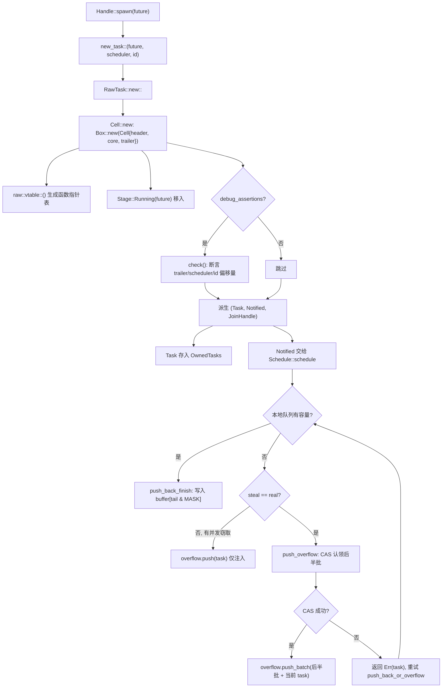
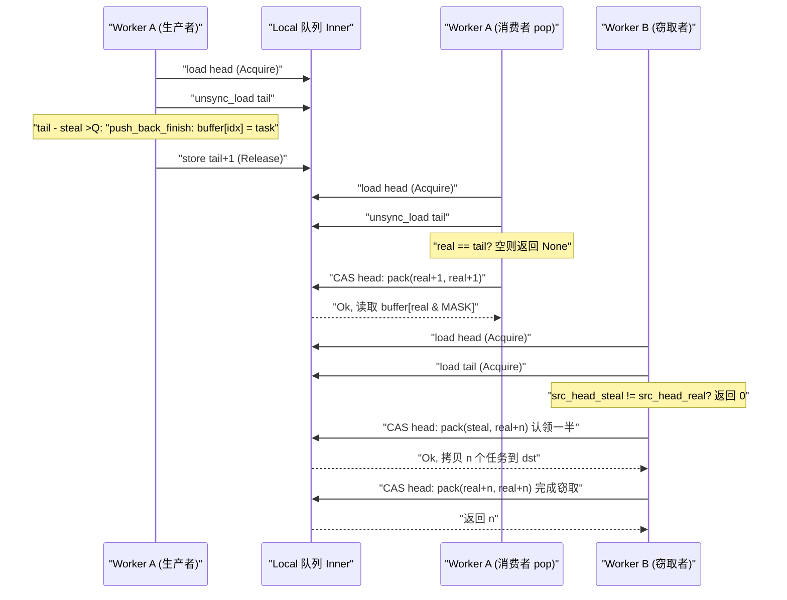

# Chapitre 3 : La vie d'une tâche (partie 1) : comment spawn transforme un Future en entité planifiable

Dans le chapitre précédent, nous avons terminé l'assemblage du Runtime : le driver I/O, le driver time, le blocking pool et le scheduler sont injectés dans une même instance`Runtime`,`Handle`devenant un handle partagé permettant d'accéder à ces composants depuis plusieurs threads. Mais le runtime ainsi assemblé n'est encore qu'une coquille vide — il possède le moteur pour piloter les tâches, mais aucune tâche à piloter. La question à laquelle ce chapitre répond est précisément : lorsque vous tapez`tokio::spawn(async { ... })`, ce que ce bloc`async`a réellement traversé pour passer d'un simple code Rust à une entité « pouvant être prise en charge par le scheduler, réveillée et jointe ». C'est la première mi-temps de « la vie d'une tâche », centrée sur la naissance : depuis`Handle::spawn`, en passant par l'allocation par comptage de références de`new_task`, jusqu'à la disposition mémoire de`Cell<T, S>`, pour finalement voir comment la tâche est déposée dans la file locale d'un worker ou dans la file d'injection globale. La seconde mi-temps (chapitre 4) abordera la boucle de scheduling et la boucle fermée poll/wake.

# 3.1 Un Future n'est pas une tâche : ce qu'un spawn crée réellement

## Modèle intuitif

Imaginez`Future`comme une « recette de cuisine », et la tâche comme « un plat en cours de cuisson dans la cuisine ». La recette elle-même est statique, copiable, sans aucun état d'exécution ; ce n'est que lorsque la cuisine (le scheduler) décide « de faire ce plat maintenant », lui attribue une plaque (worker), un numéro de commande (TaskId) et un passe de sortie (JoinHandle), qu'il devient un « plat en préparation ». Sans cet emballage, le scheduler ne saurait pas « où en est ce plat », « qui l'attend », « qui notifier une fois prêt » — il ne verrait qu'une recette, ingérable.

## Structures de données et disposition mémoire

Tokio utilise`Task<S>`pour représenter « une référence de tâche possédée par le runtime », un wrapper transparent autour de`RawTask`:

```rust
#[repr(transparent)]
pub(crate) struct Task {
    raw: RawTask,
    _p: PhantomData,
}
```

[FACT:tokio/src/runtime/task/mod.rs:233-238]

`#[repr(transparent)]`signifie que`Task<S>`et`RawTask`sont parfaitement identiques en mémoire, sans surcoût.`PhantomData<S>`n'est qu'un marqueur de type à la compilation, indiquant à quel type de scheduler appartient cette tâche`S`。

Ce qui porte réellement tout l'état de la tâche, c'est`Cell<T, S>`, dont la disposition est la pierre angulaire de tout le module de tâches :

```rust
#[repr(C)]
pub(super) struct Cell {
    pub(super) header: Header,
    pub(super) core: Core,
    pub(super) trailer: Trailer,
}
```

[FACT:tokio/src/runtime/task/core.rs:126-136]

Les trois champs sont ordonnés selon « chaud-tiède-froid ».`Header`est une donnée chaude (accédée à chaque scheduling, à chaque transition d'état),`Core`est une donnée tiède (accédée lors du poll),`Trailer`est une donnée froide (accédée uniquement à la création et à la destruction). Le commentaire indique explicitement :`Header`doit être le premier champ, car la structure de tâche sera référencée simultanément par`*mut Cell`et`*mut Header`[FACT:tokio/src/runtime/task/core.rs:37-43]。

Plus crucial encore est l'alignement sur les lignes de cache.`Cell`porte une longue série de`#[cfg_attr(..., repr(align(...)))]`, choisissant le nombre d'octets d'alignement selon l'architecture cible : x86_64/aarch64/powerpc64 utilisent 128 octets, arm/mips/sparc/hexagon 32 octets, m68k 16 octets, s390x 256 octets, et 64 octets par défaut pour le reste[FACT:tokio/src/runtime/task/core.rs:64-125]. Le commentaire explique pourquoi x86_64 utilise 128 plutôt que 64 : depuis Intel Sandy Bridge, le prefetcher spatial récupère en une fois**par paires**les lignes de cache de 64 octets, il faut donc s'aligner sur 128 octets pour éviter le faux partage[FACT:tokio/src/runtime/task/core.rs:45-53]。

> **[Design Inference & Architectural Trade-offs]**
> Le coût de cette stratégie d'alignement est qu'au moins une ligne de cache est gaspillée par tâche. Mais les bits d'état de la tâche (`state`) sont lus et écrits à haute fréquence par plusieurs threads worker — un thread définit le bit RUNNING lors du poll, un autre lit le bit NOTIFIED lors du réveil — si les bits d'état de deux tâches tombent sur la même ligne de cache, chaque transition d'état déclenche un va-et-vient de la ligne de cache entre les cœurs (cache line ping-pong), dont la perte de performance dépasse largement le gaspillage mémoire. Tokio choisit d'échanger de l'espace contre du temps.

`Header`est lui-même contraint à moins de 8 tailles de pointeur :

```rust
#[test]
#[cfg(not(loom))]
fn header_lte_cache_line() {
    assert!(std::mem::size_of::() ());
}
```

[FACT:tokio/src/runtime/task/core.rs:591-593]

Ce test garantit que`Header`ne dépasse pas 64 octets (8 × 8), et tient donc entièrement dans une ligne sur les architectures à ligne de cache de 64 octets.`Header`Les champs de`state: State`comprennent :`queue_next: UnsafeCell<Option<NonNull<Header>>>`(bits d'état atomiques),`vtable: &'static Vtable`(pointeur de liste chaînée de la file d'injection),`owner_id: UnsafeCell<Option<NonZeroU64>>`(table de pointeurs de fonctions),`OwnedTasks`(ID de la liste de`scheduled_at: UnsafeCell<ScheduleLatencyInstant>`d'appartenance),[FACT:tokio/src/runtime/task/core.rs:169-198]。

`Core<T, S>`(mesure de latence de scheduling)`scheduler: S`détient le handle du scheduler`task_id: Id`, l'ID de tâche`stage: CoreStage<T>` [FACT:tokio/src/runtime/task/core.rs:148-165]。`Stage`, et le cœur

```rust
#[repr(C)]
pub(super) enum Stage {
    Running(T),
    Finished(super::Result),
    Consumed,
}
```

[FACT:tokio/src/runtime/task/core.rs:225-229]

Copie`Stage::Running`C'est précisément la clé du « Future et Output partagent le même bloc mémoire » : pendant l'exécution de la tâche,`Stage::Finished(output)`détient le future, une fois terminé il est remplacé sur place par`JoinHandle`, et après avoir été retiré par`Stage::Consumed`。`#[repr(C)]`il devient[FACT:tokio/src/runtime/task/core.rs:225-229]。

`Trailer`Le commentaire pointe vers un issue Miri, indiquant que cette disposition impose des exigences strictes de correction au code unsafe`owned: linked_list::Pointers<Header>`（`OwnedTasks`stocke les données froides :`waker: UnsafeCell<Option<Waker>>`(pointeur de liste chaînée),`hooks: TaskHarnessScheduleHooks` [FACT:tokio/src/runtime/task/core.rs:205-213]。

## (waker du consommateur attendant la fin de la tâche),

Étape par étape : du spawn à la mise en file`tokio::spawn(async { 42 })`。

**Prenons un scénario concret : dans un runtime multi_thread, le thread worker A exécute** `new_task`Première étape : construire le trio de la tâche.

```rust
fn new_task(
    task: T,
    scheduler: S,
    id: Id,
    spawned_at: SpawnLocation,
) -> (Task, Notified, JoinHandle)
```

[FACT:tokio/src/runtime/task/mod.rs:336-346]

Copie`RawTask::new::<T, S>`Il appelle`Cell`pour allouer`raw`, puis dérive trois références à partir du même pointeur`Task`(référence owned, généralement placée immédiatement dans`OwnedTasks`）、`Notified`(référence de notification, remise au scheduler),`JoinHandle`(handle de lecture du résultat)[FACT:tokio/src/runtime/task/mod.rs:347-363]. Notez que les trois partagent le même`raw`, chacun détenant un compteur de références.

**Deuxième étape : allouer`Cell`et écrire l'état initial.** `Cell::new`Allouer la structure entière sur le tas :

```rust
let result = Box::new(Cell {
    trailer: Trailer::new(scheduler.hooks()),
    header: new_header(state, vtable, ...),
    core: Core {
        scheduler,
        stage: CoreStage {
            stage: UnsafeCell::new(Stage::Running(future)),
        },
        task_id,
        ...
    },
});
```

[FACT:tokio/src/runtime/task/core.rs:261-278]

`vtable`généré par`raw::vtable::<T, S>()`, c'est une table de pointeurs de fonctions monomorphisée pour un`T`et un`S`spécifiques[FACT:tokio/src/runtime/task/core.rs:260]. Le future est déplacé directement dans`Stage::Running`, sans boxing supplémentaire.

**Troisième étape : l'assertion de debug vérifie la disposition.**Sous`debug_assertions`,`Cell::new`appelle la fonction`check`, en utilisant`Header::get_trailer`、`Header::get_scheduler`、`Header::get_id_ptr`et d'autres opérations de pointeurs basées sur les offsets de la vtable, pour vérifier un par un que « l'adresse du champ retrouvée via le header » correspond à « l'adresse réelle du champ »[FACT:tokio/src/runtime/task/core.rs:280-321]. C'est une auto-vérification à l'exécution de la validité des offsets de la vtable.

**Quatrième étape : soumettre au planificateur.**Le planificateur, après avoir reçu`Notified<S>`, appelle`Schedule::schedule` [FACT:tokio/src/runtime/task/mod.rs:315]. En multi_thread, cela passe par`push_back_or_overflow`, poussant la tâche dans la file locale du worker courant, débordant vers la file d'injection lorsque la file est pleine.

La figure ci-dessous décrit le flux de contrôle et les branchements depuis`new_task`jusqu'à la mise en file :



Cette figure révèle plusieurs branchements clés : l'assertion de debug n'est active qu'en build de débogage ; lorsque la file locale est pleine, on ne déborde pas directement, mais on vérifie d'abord s'il existe un voleur concurrent (`steal != real`), et si oui, on ne pousse que la tâche courante dans la file d'injection, car l'espace libéré par le voleur sera bientôt disponible.

## Réflexion de conception : pourquoi trois références plutôt qu'une

`new_task`renvoie trois références, et non une seule. C'est le cœur de la conception du comptage de références :`Task`représente « le runtime possède cette tâche »,`Notified`représente « cette tâche a été notifiée, en attente de planification »,`JoinHandle`représente « quelqu'un s'intéresse à son résultat ». Les trois ont des durées de vie indépendantes —`JoinHandle`peut être drop (la tâche continue de s'exécuter, le résultat est abandonné),`Notified`disparaît après le poll,`Task`est libéré une fois la tâche terminée et retirée de`OwnedTasks`. S'il n'y avait qu'une seule référence, il serait impossible d'exprimer l'état « la tâche tourne encore mais personne ne la join ».

`UnownedTask`est un autre branchement important : il détient**deux**compteurs de références, utilisés pour les tâches blocking (non stockées dans`OwnedTasks`）[FACT:tokio/src/runtime/task/mod.rs:286-295]。`unowned`la fonction`mem::forget(task)`fusionne les deux références dans`mem::forget(notified)`via`UnownedTask` [FACT:tokio/src/runtime/task/mod.rs:388-397]et`OwnedTasks`. La motivation de cette conception à « deux références » est : les tâches blocking n'ont pas de

# liste pour détenir une référence owned, il faut donc un compteur de références supplémentaire pour garantir que la tâche ne soit pas libérée pendant son exécution.

## 3.2 Bits d'état : comment un usize encode tout le cycle de vie d'une tâche

Modèle intuitif**Imaginez l'état d'une tâche comme un « bulletin d'examen médical » comportant plusieurs cases à cocher indépendantes : est-elle en cours de poll, est-elle terminée, a-t-elle été notifiée, a-t-elle été annulée, quelqu'un la join-il. Tokio n'utilise pas plusieurs champs booléens, mais compresse ces bits dans`AtomicUsize`**un

## . Ainsi, chaque transition d'état ne nécessite qu'un seul CAS, au lieu de plusieurs verrous. Sans cette conception, les transitions d'état des tâches deviendraient un emboîtement de multiples verrous, faisant grimper en flèche le risque de deadlock et les coûts.

`State`Disposition des champs de bits[FACT:tokio/src/runtime/task/mod.rs:32-53]：

- `RUNNING`Les champs de bits de**sont entièrement définis dans la documentation du module** [FACT:tokio/src/runtime/task/mod.rs:37-38]。
- `COMPLETE`: la tâche est-elle en cours de poll ou annulée.`RUNNING`Ce bit sert également de verrou à la tâche[FACT:tokio/src/runtime/task/mod.rs:40-41]。
- `NOTIFIED`: le future est entièrement terminé et drop. Une fois positionné, il n'est jamais effacé, et jamais positionné en même temps que`Notified`:[FACT:tokio/src/runtime/task/mod.rs:43]。
- `CANCELLED`: existe-t-il actuellement un objet[FACT:tokio/src/runtime/task/mod.rs:45-46]。
- `JOIN_INTEREST`:`JoinHandle` [FACT:tokio/src/runtime/task/mod.rs:48]。
- `JOIN_WAKER`: la tâche doit être annulée dès que possible[FACT:tokio/src/runtime/task/mod.rs:50-51]。

: il existe[FACT:tokio/src/runtime/task/mod.rs:53]。

`RUNNING`: bit de contrôle d'accès servant de join handle waker`RUNNING`Les bits restants servent au comptage de références[FACT:tokio/src/runtime/task/mod.rs:130-133]Le fait que le bit`RUNNING`serve de verrou mérite d'être développé. La section Safety de la documentation du module indique : tout accès mutable au future doit se faire après avoir acquis le verrou en modifiant le bit

## , garantissant ainsi un accès exclusif

`JOIN_WAKER`. Cela signifie que lors du poll d'une tâche, le thread effectue d'abord un CAS pour positionner`waker`, et en cas de succès obtient l'exclusivité sur le future ; en cas d'échec, cela signifie qu'un autre thread est en train de poll, et ce poll retourne directement. Cela fusionne « l'exclusion mutuelle du poll » et « la transition d'état » en une seule opération atomique, évitant un mutex séparé.`Trailer`Protocole de contrôle d'accès de JOIN_WAKER**Le bit**est la partie la plus ingénieuse de toute la machine à états. Il résout le problème suivant :`JoinHandle`le champ**(dans**) est accédé concurremment par deux threads — le runtime, à la fin de la tâche,[FACT:tokio/src/runtime/task/mod.rs:75-120]：

1. `JOIN_WAKER`le

lit pour réveiller le joiner,`JoinHandle`lors du poll

l'écrit`JoinHandle`pour enregistrer le waker. La documentation du module donne 7 règles

est initialement à 0.`COMPLETE`2. Lorsqu'il est à 0,

5. `JoinHandle`a un accès exclusif (mutable) au champ waker.`JOIN_WAKER`3. Lorsqu'il est à 1,`JOIN_WAKER`n'a qu'un accès partagé (lecture seule).

6. `JoinHandle`4. Lorsqu'il est à 1 et que`COMPLETE`est à 1, le runtime a un accès partagé (lecture seule) au champ waker.`JOIN_WAKER`Pour écrire le waker, il faut : (i) réussir à mettre`COMPLETE`à 0 pour obtenir l'exclusivité, (ii) écrire le waker, (iii) réussir à mettre

à 1.`JOIN_INTEREST`ne peut modifier`COMPLETE`que lorsque

est à 0 ; le runtime ne peut le modifier que lorsque`COMPLETE`est à 1.[FACT:tokio/src/runtime/task/mod.rs:110-120]7. Si

## est à 0 et

`Task`est à 1, le runtime a un accès exclusif au champ waker (pour drop le waker).`UnownedTask`le drop décrémente deux fois :

```rust
impl Drop for Task {
    fn drop(&mut self) {
        if self.header().state.ref_dec() {
            self.raw.dealloc();
        }
    }
}
```

[FACT:tokio/src/runtime/task/mod.rs:580-586]

```rust
impl Drop for UnownedTask {
    fn drop(&mut self) {
        if self.raw.header().state.ref_dec_twice() {
            self.raw.dealloc();
        }
    }
}
```

[FACT:tokio/src/runtime/task/mod.rs:590-596]

`ref_dec`retourne`true`indique qu'il s'agit de la dernière référence, et c'est seulement à ce moment que la libération a réellement lieu`Cell`mémoire.`ref_dec_twice`est`UnownedTask`est la manifestation directe de la détention de deux compteurs.

## Réflexion de conception : pourquoi les bits d'état et le compteur de références partagent-ils un même atomique

> **[Design Inference & Architectural Trade-offs]**
> Placer les bits d'état et le compteur de références dans le même`AtomicUsize`vise à permettre aux deux actions « décrémenter le compteur de références » et « définir les bits d'état » d'être accomplies en**un seul CAS**. La documentation du module mentionne explicitement dans le commentaire de`Schedule::release`: « le module de tâches traite par lots le ref-dec et la définition d'autres options »[FACT:tokio/src/runtime/task/mod.rs:302-304]. Si les bits d'état et le compteur de références appartenaient à deux variables atomiques distinctes, alors il existerait une fenêtre entre « libérer la dernière référence » et « marquer comme terminé », nécessitant une synchronisation supplémentaire. Après fusion,`ref_dec`peut accomplir atomiquement « décrémenter le compteur + vérifier s'il atteint zéro », évitant les problèmes de type ABA.

# 3.3 JoinHandle : comment le résultat traverse les frontières de tâche pour être renvoyé

## Modèle intuitif

`JoinHandle`est comme le « ticket de retrait » que vous donne un restaurant. Lorsque la tâche (la cuisine) se termine, elle place le plat (output) au passe (`Stage::Finished`), puis fait sonner votre bip de retrait (waker). Vous venez le récupérer avec le ticket ; le ticket lui-même ne contient pas le plat, c'est juste un pointeur vers le passe. Si vous perdez le ticket (drop`JoinHandle`), le plat sera directement jeté (output est drop), mais la cuisine ne s'arrêtera pas pour autant.

## Structure de données

`JoinHandle<T>`est également un emballage transparent autour de`RawTask`:

```rust
pub struct JoinHandle {
    raw: RawTask,
    _p: PhantomData,
}
```

[FACT:tokio/src/runtime/task/join.rs:163-166]

`PhantomData<T>`marque le type de sortie.`JoinHandle<T>`n'est`T: Send`que lors de`Send`/`Sync` [FACT:tokio/src/runtime/task/join.rs:169-170], ce qui garantit qu'une sortie non-Send ne sera pas déplacée entre threads.

## Étape par étape : await un JoinHandle

`JoinHandle`implémente`Future`, dont`poll`est le cœur du renvoi du résultat :

```rust
fn poll(self: Pin, cx: &mut Context) -> Poll {
    ready!(crate::trace::trace_leaf());
    let mut ret = Poll::Pending;
    let coop = ready!(crate::task::coop::poll_proceed(cx));
    unsafe {
        self.raw.try_read_output(&mut ret, cx.waker());
    }
    if ret.is_ready() {
        coop.made_progress();
    }
    ret
}
```

[FACT:tokio/src/runtime/task/join.rs:327-354]

Noter quelques détails :`trace_leaf`est utilisé pour l'instrumentation tracing ;`coop::poll_proceed`consomme le budget de coopération (détaillé au chapitre 12) ;`try_read_output`efface les génériques via la vtable, place la valeur de retour sur la pile et la transmet à`*mut ()`via[FACT:tokio/src/runtime/task/join.rs:327-354]. Cette technique de « valeur de retour sur la pile » existe parce que les fonctions de vtable ne peuvent pas génériciser le type de retour`T`, et ne peuvent réécrire que via un pointeur brut.

> **[Design Inference & Architectural Trade-offs]**
> `try_read_output`logique interne (dans raw.rs, dont le code source n'est pas fourni dans ce chapitre) : vérifie d'abord le bit`COMPLETE`, s'il est déjà positionné, appelle`take_output`pour retirer le résultat de`Stage::Finished`; sinon enregistre`cx.waker()`dans le champ`Trailer::waker`, retourne`Pending`. Le processus d'enregistrement suit précisément le protocole`JOIN_WAKER`de la section 3.2.

## Transfert de propriété du résultat

La section « Non-Send output » de la documentation du module décrit précisément les règles de propriété du résultat[FACT:tokio/src/runtime/task/mod.rs:151-170]：

- Lorsque la tâche se termine, output est placé dans`Stage`, puis la transition « définir COMPLETE » est exécutée, et la valeur`JOIN_INTEREST`est lue à cet instant.
- Si`JOIN_INTEREST`vaut 0 (aucun`JoinHandle`), output est immédiatement drop[FACT:tokio/src/runtime/task/mod.rs:157-158]。
- Si`JOIN_INTEREST`vaut 1,`JoinHandle`est responsable du nettoyage de output[FACT:tokio/src/runtime/task/mod.rs:160-161]。

Pour une sortie non-Send, la documentation donne un argument en trois étapes : output est créé sur le thread qui poll le future ;`JoinHandle<Output>`n'est pas non plus Send lorsque Output n'est pas Send, donc il est aussi sur le thread de spawn ; par conséquent`JoinHandle`ne déplace pas output entre threads lors du retrait ou du drop[FACT:tokio/src/runtime/task/mod.rs:164-170]。

## Le drop de JoinHandle : deux chemins, rapide et lent

```rust
impl Drop for JoinHandle {
    fn drop(&mut self) {
        if self.raw.state().drop_join_handle_fast().is_ok() {
            return;
        }
        self.raw.drop_join_handle_slow();
    }
}
```

[FACT:tokio/src/runtime/task/join.rs:358-364]

`drop_join_handle_fast`tente d'accomplir en un seul CAS « effacer le bit`JOIN_INTEREST`+ décrémenter le compteur de références ». En cas d'échec (par exemple la tâche est en cours de finalisation, le bit d'état étant occupé), on emprunte le chemin lent de`drop_join_handle_slow`. C'est le schéma typique « chemin rapide optimiste + chemin lent pessimiste ».

## Réflexion de conception : pourquoi JoinHandle ne détient-il pas directement output

> **[Design Inference & Architectural Trade-offs]**
> Si`JoinHandle`détenait directement output, alors output devrait être déplacé vers le thread où se trouve`JoinHandle`à la fin de la tâche. Mais`JoinHandle`peut être déplacé vers n'importe quel thread (tant que`T: Send`), tandis que le thread de production de output est le thread de poll. Une détention directe entraînerait un déplacement inter-threads où « output est produit sur le thread de poll, mais doit être drop sur le thread de join », ce qui violerait directement le système de types pour une sortie non-Send. Tokio choisit de laisser output dans`Cell`(`Stage::Finished`），`JoinHandle`ne détient qu'un`Cell`pointant vers`RawTask`, et retire le résultat sur place via`take_output`. Ainsi le drop de output se produit sur le thread où se trouve`JoinHandle`, à condition que ce thread soit le même que le thread de poll (ce qui est vrai dans le scénario non-Send).

# 3.4 File locale : structure producteur-consommateur du work-stealing

## Modèle intuitif

Chaque worker dispose d'une « liste de tâches privée » (file locale), de capacité 256. Le worker lui-même retire les tâches depuis**la tête**(LIFO, exploitant la localité de cache), les autres workers volent les tâches depuis**la queue**(FIFO, retirant les plus anciennes, les plus susceptibles d'être déjà terminées). Sans file locale, toutes les tâches s'entasseraient dans la file globale, et chaque retrait de tâche nécessiterait de se disputer le verrou global, ce qui ferait s'effondrer la scalabilité multicœur.

## Disposition mémoire : séparation de head et tail

```rust
pub(crate) struct Inner {
    head: AtomicUnsignedLong,
    tail: AtomicUnsignedShort,
    buffer: Box>>; LOCAL_QUEUE_CAPACITY]>,
}
```

[FACT:tokio/src/runtime/scheduler/multi_thread/queue.rs:36-57]

`head`est`AtomicUnsignedLong`(64 bits, si la plateforme supporte u64),`tail`est`AtomicUnsignedShort`(32 bits). Le commentaire explique pourquoi les indices sont plus larges que nécessaire : pour atténuer l'ABA, et pour distinguer un tampon « plein » d'un tampon « vide »[FACT:tokio/src/runtime/scheduler/multi_thread/queue.rs:37-49]。

`head`emballe en interne**deux** `UnsignedShort`: le bit bas est la « real head » (tête réelle), le bit haut est la « steal head » (première position traitée par le voleur). Lorsqu'ils sont égaux, il n'y a pas de voleur actif[FACT:tokio/src/runtime/scheduler/multi_thread/queue.rs:39-49]. Cet empaquetage à deux valeurs est l'astuce centrale de la file work-stealing : le voleur effectue d'abord un CAS pour mettre à jour la valeur steal afin de « revendiquer » un lot de tâches, puis une fois terminé, rattrape la valeur real avec la valeur steal, indiquant la fin du vol.

`LOCAL_QUEUE_CAPACITY`vaut 256 hors loom, et est réduit à 4 sous loom pour tester davantage de cas limites[FACT:tokio/src/runtime/scheduler/multi_thread/queue.rs:62-69]。`MASK = LOCAL_QUEUE_CAPACITY - 1`, utilisé pour l'index du buffer circulaire[FACT:tokio/src/runtime/scheduler/multi_thread/queue.rs:71]。

## Step-by-Step : les branches complètes de push_back_or_overflow

C'est la fonction la plus complexe de la file locale, nous allons l'analyser branche par branche :

```rust
pub(crate) fn push_back_or_overflow>(
    &mut self,
    mut task: task::Notified,
    overflow: &O,
    stats: &mut Stats,
) {
    let tail = loop {
        let head = self.inner.head.load(Acquire);
        let (steal, real) = unpack(head);
        let tail = unsafe { self.inner.tail.unsync_load() };

        if tail.wrapping_sub(steal)  return,
                Err(v) => { task = v; }
            }
        }
    };
    self.push_back_finish(task, tail);
}
```

[FACT:tokio/src/runtime/scheduler/multi_thread/queue.rs:188-223]

Trois branches :

1. **Capacité disponible**（`tail - steal < CAPACITY`）：`break tail`, après avoir quitté la boucle, appelle`push_back_finish`pour écrire dans le buffer.

2. **Pas de capacité mais des voleurs concurrents**（`steal != real`) : les voleurs libéreront de l'espace, donc on pousse seulement la tâche courante dans la file d'injection et on retourne immédiatement[FACT:tokio/src/runtime/scheduler/multi_thread/queue.rs:204-208]。

3. **Pas de capacité et pas de voleur**: appelle`push_overflow`pour déverser la seconde moitié des tâches dans la file d'injection[FACT:tokio/src/runtime/scheduler/multi_thread/queue.rs:209-219]. Si le CAS échoue (perdu face à un voleur concurrent),`push_overflow`retourne`Err(task)`, et la boucle réessaie.

`push_back_finish`écrit la tâche et met à jour tail :

```rust
fn push_back_finish(&self, task: task::Notified, tail: UnsignedShort) {
    let idx = tail as usize & MASK;
    self.inner.buffer[idx].with_mut(|ptr| {
        unsafe { ptr::write((*ptr).as_mut_ptr(), task); }
    });
    self.inner.tail.store(tail.wrapping_add(1), Release);
}
```

[FACT:tokio/src/runtime/scheduler/multi_thread/queue.rs:226-244]

`Release`L'ordre garantit que la tâche écrite est visible pour les voleurs.

## push_overflow : pourquoi déverser la seconde moitié

```rust
const NUM_TASKS_TAKEN: UnsignedShort = (LOCAL_QUEUE_CAPACITY / 2) as UnsignedShort;
```

[FACT:tokio/src/runtime/scheduler/multi_thread/queue.rs:265]

Lors du déversement, on retire 128 tâches. Le commentaire explique en détail pourquoi on prend**la seconde moitié**plutôt que la première moitié[FACT:tokio/src/runtime/scheduler/multi_thread/queue.rs:295-306]: lors du retrait de tâches depuis la file d'injection, elles sont toujours placées dans la première moitié. Donc si une tâche se trouve dans la seconde moitié, on peut être certain qu'elle ne vient pas d'être retirée de la file d'injection. Cela garantit qu'« une tâche retirée de la file d'injection ne sera pas immédiatement remise dans la file d'injection » (du moins avant d'avoir été poll au moins une fois).

CAS pour revendiquer la seconde moitié :

```rust
if self.inner.head.compare_exchange_weak(
    pack(head, head), pack(tail, tail), Release, Relaxed
).is_err() {
    return Err(task);
}
```

[FACT:tokio/src/runtime/scheduler/multi_thread/queue.rs:283-293]

Met`head`de`(head, head)`à`(tail, tail)`, c'est-à-dire avance simultanément steal et real jusqu'à tail, revendiquant toutes les tâches. En cas de succès, recule tail à`tail + NUM_TASKS_TAKEN`, indiquant que la première moitié reste dans la file locale[FACT:tokio/src/runtime/scheduler/multi_thread/queue.rs:314-316]。

## pop et steal_into : les deux chemins de retrait de tâches

`pop`est le retrait de tâche par le worker lui-même (depuis la tête, LIFO) :

```rust
pub(crate) fn pop(&mut self) -> Option> {
    let mut head = self.inner.head.load(Acquire);
    let idx = loop {
        let (steal, real) = unpack(head);
        let tail = unsafe { self.inner.tail.unsync_load() };
        if real == tail { return None; }
        let next_real = real.wrapping_add(1);
        let next = if steal == real {
            pack(next_real, next_real)
        } else {
            assert_ne!(steal, next_real);
            pack(steal, next_real)
        };
        let res = self.inner.head.compare_exchange_weak(head, next, AcqRel, Acquire);
        match res {
            Ok(_) => break real as usize & MASK,
            Err(actual) => head = actual,
        }
    };
    Some(self.inner.buffer[idx].with(|ptr| unsafe { ptr::read(ptr).assume_init() }))
}
```

[FACT:tokio/src/runtime/scheduler/multi_thread/queue.rs:361-399]

Branche clé : si`steal == real`(aucun voleur), avance les deux simultanément ; sinon n'avance que real, en laissant steal inchangé[FACT:tokio/src/runtime/scheduler/multi_thread/queue.rs:377-384]。`assert_ne!(steal, next_real)`garantit de ne pas avancer real jusqu'à la position de steal, sinon l'état de revendication du voleur serait corrompu.

`steal_into`est le chemin de vol, on vérifie d'abord si la file cible a suffisamment d'espace :

```rust
if dst_tail.wrapping_sub(steal) > LOCAL_QUEUE_CAPACITY as UnsignedShort / 2 {
    return None;
}
```

[FACT:tokio/src/runtime/scheduler/multi_thread/queue.rs:431-435]

Si la file cible est plus qu'à moitié pleine, on ne vole pas, pour éviter qu'un vol soit immédiatement suivi d'un déversement.

`steal_into2`est le cœur du vol, calcule la quantité à voler :

```rust
let n = src_tail.wrapping_sub(src_head_real);
let n = n - n / 2;
```

[FACT:tokio/src/runtime/scheduler/multi_thread/queue.rs:487-488]

Vole la moitié (arrondie au supérieur). Puis CAS pour mettre à jour la valeur steal de head afin de revendiquer :

```rust
let steal_to = src_head_real.wrapping_add(n);
next_packed = pack(src_head_steal, steal_to);
let res = self.0.head.compare_exchange_weak(prev_packed, next_packed, AcqRel, Acquire);
```

[FACT:tokio/src/runtime/scheduler/multi_thread/queue.rs:496-506]

Notez qu'ici seule la valeur real est mise à jour (`pack(src_head_steal, steal_to)`dans steal reste inchangé), en avançant real jusqu'à`steal_to`. Cela signifie « ces tâches ont été revendiquées, les autres voleurs ne peuvent plus y toucher ». Une fois le vol terminé, on rattrape steal avec real :

```rust
loop {
    let head = unpack(prev_packed).1;
    next_packed = pack(head, head);
    let res = self.0.head.compare_exchange_weak(prev_packed, next_packed, AcqRel, Acquire);
    match res {
        Ok(_) => return n,
        Err(actual) => prev_packed = actual,
    }
}
```

[FACT:tokio/src/runtime/scheduler/multi_thread/queue.rs:548-561]

Le diagramme temporel ci-dessous décrit l'interaction concurrente à trois entre « producteur push, consommateur pop, voleur steal » :



## Réflexion de conception : pourquoi la file locale est LIFO et le vol est FIFO

> **[Design Inference & Architectural Trade-offs]**
> Le worker retire lui-même depuis la tête (LIFO), car la tâche la plus récemment poussée est la plus susceptible d'être encore dans le cache CPU, et la plus susceptible d'être « fraîchement réveillée, avec des données encore chaudes ». Le voleur retire depuis la queue (FIFO), car la tâche la plus ancienne a probablement déjà accompli la majeure partie de son travail, et la voler permet de réduire le plus rapidement la charge de la victime. Cette combinaison « LIFO local + FIFO vol » est la conception classique de l'ordonnancement work-stealing, conciliant localité de cache et équilibrage de charge.

À ce stade, la tâche a achevé sa métamorphose de Future en entité ordonnançable : elle s'est vu attribuer un comptage de références, a été placée dans`Cell`la disposition mémoire, et a été transmise avec succès à la file locale du worker ou à la file d'injection globale. Mais placer une tâche dans une file n'est que le début ; ce qui la fait réellement tourner, c'est la boucle d'ordonnancement du thread worker. Dans le prochain chapitre, nous entrerons dans la seconde moitié de « la vie d'une tâche », en traçant comment le worker retire une tâche de la file, appelle`Future::poll`, et lors du retour de`Pending`enregistre un réveil via`Waker`, déclenchant finalement la remise en file par`schedule`— le chemin d'appel complet de la boucle fermée « réveil → mise en file → re-poll », ainsi que la stratégie work-stealing et l'optimisation des slots LIFO, seront révélés là-bas.
