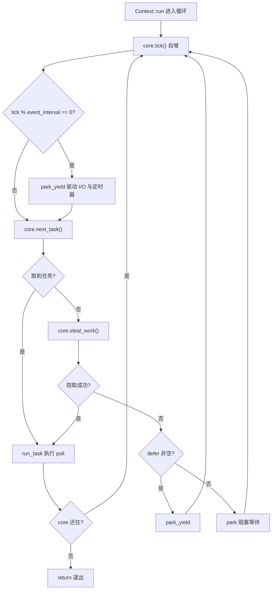
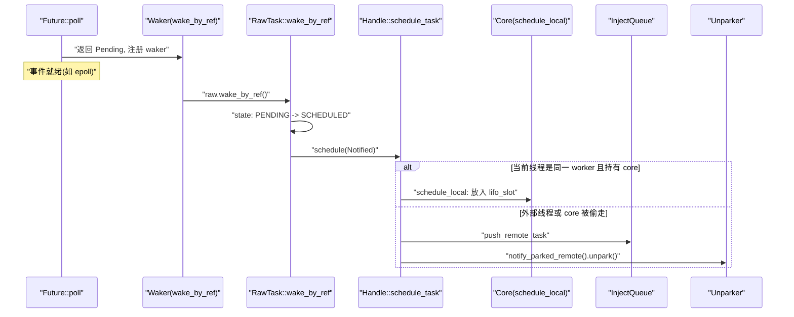
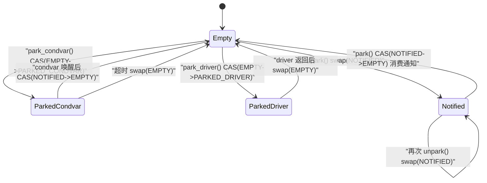

# Chapitre 4 : La vie d'une tâche (suite) : boucle d'ordonnancement, poll et boucle fermée de réveil

# De la file à l'exécution : le squelette de la boucle principale du worker

Dans le chapitre précédent, nous avons envoyé la tâche dans la`Local`file ou la file d'injection globale. Mais la file n'est qu'une « liste de choses à faire » ; ce qui fait réellement tourner la tâche, c'est cette boucle sans fin dans le thread worker. Dans ce chapitre, nous traçons`Context::run`— c'est le cœur de tout l'ordonnanceur multithread.

Établissons d'abord l'intuition : le thread worker est comme un cuisinier, devant lui une pile de ses propres commandes (`run_queue`), et à côté un présentoir de commandes public (`inject`). Le cuisinier regarde d'abord la commande la plus proche à portée de main (`lifo_slot`), s'il n'y en a pas, il en prend dans sa propre pile, s'il n'y en a toujours pas, il en attrape une poignée sur l'étagère commune, et si ça ne suffit toujours pas, il en vole quelques-unes dans la pile d'un autre cuisinier. Ce n'est que lorsque tout est vide qu'il va se reposer, mais pendant le repos ses oreilles restent dressées — dès qu'une commande arrive, il se réveille immédiatement.

Sans cette boucle, une tâche une fois mise en file d'attente resterait éternellement dans la file,`Future::poll`ne serait jamais appelée, et tout le runtime ne serait qu'un tas de données mortes.

## Disposition mémoire et champs d'état de Core

Tout l'état mutable du worker est contenu dans`Core`, il est`Box`alloué sur le tas, et transmis via`AtomicCell<Core>`entre`Worker`et le`Context`local au thread.

`Core`Les champs clés de[FACT:tokio/src/runtime/scheduler/multi_thread/worker.rs:113-167]：

- `tick: u32`sont les suivants : incrémenté à chaque tour de boucle, utilisé pour déclencher périodiquement la maintenance (`maintenance`) et la vérification de la file globale.
- `lifo_slot: Option<Notified>`：**Emplacement LIFO**, c'est la conception la plus ingénieuse de ce chapitre. Lorsqu'un worker planifie lui-même une tâche, il ne l'insère pas dans`run_queue`, mais la place dans cet emplacement, et lors de la prochaine récupération de tâche il**prioritairement**la prend ici.
- `lifo_enabled: bool`: interrupteur de l'emplacement LIFO, utilisé pour éviter la famine dans les scénarios de ping-pong.
- `run_queue: queue::Local<Arc<Handle>>`: file locale, la structure`Local`analysée dans le chapitre précédent.
- `is_searching: bool`: indique si le worker est en train de chercher des tâches à voler.
- `is_shutdown: bool` / `is_traced: bool`: indicateurs d'arrêt et de traçage.
- `park: Option<Parker>`: parker, enveloppé avec`Option`pour faciliter l'extraction/remise en place sous le borrow checker.
- `global_queue_interval: u32`: fréquence de vérification de la file globale.
- `rand: FastRand`: générateur de nombres aléatoires rapide, utilisé pour choisir aléatoirement le point de départ du vol.

> **[Design Inference & Architectural Trade-offs]**
> Notez que`lifo_slot`est`Option<Notified>`et non une file — il ne stocke**qu'une seule**tâche. La motivation de cette conception est clairement expliquée dans les commentaires du code source[FACT:tokio/src/runtime/scheduler/multi_thread/worker.rs:117-121]: les tâches planifiées par le worker lui-même sont stockées dans cet emplacement, le worker le vérifie`run_queue` **avant**de vérifier , avec pour effet « la dernière tâche planifiée s'exécute en premier » (LIFO). C'est pour améliorer la localité, particulièrement efficace pour les modèles de passage de messages, et permet de réduire la latence.

Pourquoi le LIFO réduit-il la latence ? Considérons un scénario typique de passage de messages : la tâche A, après avoir traité un message, réveille la tâche B, et B après traitement réveille A. Si B s'exécute immédiatement après que A l'a réveillée, les données dont B a besoin sont probablement encore dans le cache CPU (car A vient d'y accéder). Si B est placée en queue de file, le temps que des dizaines de tâches devant elle s'exécutent, le cache aura depuis longtemps été écrasé.

Mais le LIFO présente un risque de famine. Le code source utilise`MAX_LIFO_POLLS_PER_TICK = 3`pour limiter[FACT:tokio/src/runtime/scheduler/multi_thread/worker.rs:263-263]: à chaque tick, l'emplacement LIFO est priorisé au maximum 3 fois, au-delà il est désactivé, donnant aux autres tâches une chance de s'exécuter.

## Parcours de la boucle principale : un cycle de planification complet

Plaçons-nous dans un scénario concret : le worker 0 vient de se réveiller depuis`park`,`run_queue`contient 5 tâches,`lifo_slot`contient 1 tâche, la file globale contient 3 tâches.

Le point d'entrée de la boucle principale est`Context::run` [FACT:tokio/src/runtime/scheduler/multi_thread/worker.rs:570-642]. Il réinitialise d'abord`lifo_enabled`(car le core a pu être`block_in_place`volé, l'état doit être remis en place)[FACT:tokio/src/runtime/scheduler/multi_thread/worker.rs:571-573], puis entre dans la boucle`while !core.is_shutdown`.

Chaque tour de boucle fait quatre choses :

**Première étape : tick et maintenance.** `core.tick()`incrémente le compteur[FACT:tokio/src/runtime/scheduler/multi_thread/worker.rs:587]. Ensuite`self.maintenance(core)`vérifie`tick % event_interval == 0`, et si c'est le cas appelle`park_yield`pour piloter les E/S et les timers avec un timeout de 0[FACT:tokio/src/runtime/scheduler/multi_thread/worker.rs:809-826]。

**Deuxième étape : récupération de tâche.** `core.next_task(&self.worker)`est la logique centrale de récupération de tâche[FACT:tokio/src/runtime/scheduler/multi_thread/worker.rs:1090-1156]. Elle se divise en deux chemins :

- Lorsque`tick % global_queue_interval == 0`,**prioritairement**on prend depuis la file globale, et si on n'en trouve pas on prend depuis la file locale[FACT:tokio/src/runtime/scheduler/multi_thread/worker.rs:1091-1098]. C'est pour éviter que les tâches de la file globale ne meurent de faim.
- Sinon**prioritairement**on prend la tâche locale[FACT:tokio/src/runtime/scheduler/multi_thread/worker.rs:1090-1156]。

La récupération locale de tâche est effectuée par`next_local_task`[FACT:tokio/src/runtime/scheduler/multi_thread/worker.rs:1158-1160]：

```rust
fn next_local_task(&mut self) -> Option {
    self.lifo_slot.take().or_else(|| self.run_queue.pop())
}
```

on prend d'abord l'emplacement LIFO, puis la tête de file (pop LIFO). C'est ce que le chapitre précédent appelait « LIFO local ».

Si le local est vide mais la file globale non vide, le worker**par lots**retire des tâches de la file globale[FACT:tokio/src/runtime/scheduler/multi_thread/worker.rs:1110-1154]. La taille du lot`n`est calculée avec soin :`min(inject.len() / remotes.len() + 1, cap)`, où`cap`prend à son tour`min(remaining_slots, max_capacity / 2)`. Les commentaires du code source expliquent pourquoi on limite à la moitié de la capacité de la file[FACT:tokio/src/runtime/scheduler/multi_thread/worker.rs:1120-1131]: garantir que les tâches retirées tombent dans la**première moitié**de la file locale, de sorte que même en cas de débordement ultérieur, ces tâches ne soient pas repoussées vers la file globale (le débordement n'affecte que la seconde moitié).

**Troisième étape : exécution de la tâche.**une fois la tâche obtenue, appelle`run_task` [FACT:tokio/src/runtime/scheduler/multi_thread/worker.rs:647-796]. C'est la fonction la plus complexe de ce chapitre, que nous détaillerons dans la section suivante.

**Quatrième étape : vol ou park.**Si`next_task`retourne`None`, cela signifie qu'il n'y a plus rien à faire ni en local ni en global, on appelle`steal_work` [FACT:tokio/src/runtime/scheduler/multi_thread/worker.rs:1167-1195]. Si le vol échoue, on entre dans`park`ou`park_yield` [FACT:tokio/src/runtime/scheduler/multi_thread/worker.rs:613-621]。

Le flux de contrôle complet est le suivant :



## run_task : boucle fermée entre poll et emplacement LIFO

`run_task`est l'endroit où la tâche est réellement`poll`, et aussi le point de convergence de la boucle fermée « réveil → mise en file → re-poll ».

La première chose faite en entrant dans la fonction est`assert_owner` [FACT:tokio/src/runtime/scheduler/multi_thread/worker.rs:648], convertir`Notified`en`Task`, tout en affirmant que le thread courant est bien le owner de cette tâche (assertion debug).

Ensuite`transition_from_searching` [FACT:tokio/src/runtime/scheduler/multi_thread/worker.rs:652]— si le worker était précédemment en état de recherche, maintenant qu'il a trouvé une tâche, il doit sortir de l'état de recherche, et peut éventuellement réveiller d'autres workers parked.

Puis l'enveloppement clé du budget[FACT:tokio/src/runtime/scheduler/multi_thread/worker.rs:695-795]：

```rust
coop::budget(|| {
    task.run();
    let mut lifo_polls = 0;
    loop {
        let mut core = match self.core.borrow_mut().take() {
            Some(core) => core,
            None => return ControlFlow::Break(()),
        };
        let task = match core.lifo_slot.take() {
            Some(task) => task,
            None => {
                self.reset_lifo_enabled(&mut core);
                core.stats.end_poll();
                return ControlFlow::Continue(core);
            }
        };
        if !coop::has_budget_remaining() {
            core.run_queue.push_back_or_overflow(task, ...);
            return ControlFlow::Continue(core);
        }
        lifo_polls += 1;
        if lifo_polls >= MAX_LIFO_POLLS_PER_TICK {
            core.lifo_enabled = false;
        }
        let task = self.worker.handle.shared.owned.assert_owner(task);
        *self.core.borrow_mut() = Some(core);
        task.run();
    }
})
```

Ce code révèle la boucle fermée complète de l'emplacement LIFO :`task.run()`exécute`Future::poll`, si pendant le poll la tâche se réveille elle-même ou réveille une autre tâche,`schedule_local`placera la nouvelle tâche dans`lifo_slot` [FACT:tokio/src/runtime/scheduler/multi_thread/worker.rs:1396-1408]. Après le retour du poll, la boucle vérifie immédiatement`lifo_slot`, et s'il y a une tâche elle continue de s'exécuter —**sans revenir à la boucle principale**, en enchaînant directement les poll dans le même budget.

C'est la manifestation du « réveil → mise en file → re-poll » sur le chemin LIFO : au réveil la tâche est placée dans`lifo_slot`, et après le retour du poll elle est immédiatement retirée et re-poll, formant une boucle fermée étroite.

Notez la branche`self.core.borrow_mut().take()`de`None`[FACT:tokio/src/runtime/scheduler/multi_thread/worker.rs:716-724]: si le core a été volé (par exemple si la tâche a appelé`block_in_place`), le worker doit retourner`ControlFlow::Break(())`, laissant`Context::run`sortir. C'est`block_in_place`Points d'interaction avec la boucle d'ordonnancement.

## Chemin de réveil : comment le Waker déclenche la remise en file

Lorsque`Future::poll`retourne`Pending`, la tâche doit enregistrer un`Waker`, et être réveillée lorsque l'événement est prêt. L'implémentation`Waker`de Tokio est extrêmement concise — c'est simplement un pointeur brut vers la`Header`de la tâche plus une vtable.

`waker_ref`Construire`WakerRef` [FACT:tokio/src/runtime/task/waker.rs:11-34], envelopper avec`ManuallyDrop`pour`Waker`éviter de décrémenter le compteur de références lors du drop. La vtable est un[FACT:tokio/src/runtime/task/waker.rs:119-119]：

```rust
static WAKER_VTABLE: RawWakerVTable =
    RawWakerVTable::new(clone_waker, wake_by_val, wake_by_ref, drop_waker);
```

Les quatre fonctions se contentent de restaurer le pointeur brut en`Header`, puis d'appeler la méthode correspondante de`RawTask`[FACT:tokio/src/runtime/task/waker.rs:70-116]. Par exemple`wake_by_ref`appelle finalement`raw.wake_by_ref()` [FACT:tokio/src/runtime/task/waker.rs:106-116]。

`wake_by_ref`La sémantique est : faire passer l'état de la tâche de`PENDING`à`SCHEDULED`, et si la transition réussit (c'est-à-dire qu'elle était bien PENDING auparavant), appeler`Schedule::schedule`pour remettre la tâche en file.

Pour l'ordonnanceur multi-thread,`schedule`l'implémentation de`Handle::schedule_task` [FACT:tokio/src/runtime/scheduler/multi_thread/worker.rs:1353-1376]：

```rust
pub(super) fn schedule_task(&self, task: Notified, is_yield: bool) {
    with_current(|maybe_cx| {
        if let Some(cx) = maybe_cx {
            if self.ptr_eq(&cx.worker.handle) {
                if let Some(core) = cx.core.borrow_mut().as_mut() {
                    self.schedule_local(core, task, is_yield);
                    return;
                }
            }
        }
        self.push_remote_task(task);
        self.notify_parked_remote();
    });
}
```

La logique se divise en deux branches :

- Si le thread courant est un worker de cet ordonnanceur et détient le core, on passe par`schedule_local` [FACT:tokio/src/runtime/scheduler/multi_thread/worker.rs:1385-1417]— placement dans le slot LIFO ou la file locale.
- Sinon (réveil depuis un thread externe, ou core volé), on passe par`push_remote_task`pousser dans la file d'injection globale, et`notify_parked_remote`réveiller un worker parked[FACT:tokio/src/runtime/scheduler/multi_thread/worker.rs:1379-1383]。

`schedule_local`En interne, cela se divise à nouveau en deux branches[FACT:tokio/src/runtime/scheduler/multi_thread/worker.rs:1385-1417]: si c'est`yield`ou que le LIFO est désactivé, pousser en`run_queue`queue ; sinon placer dans`lifo_slot`, et pousser la tâche précédemment dans le slot vers la queue de la file.



## park et unpark : atomicité de la machine d'état et du réveil

Le worker doit park lorsqu'il n'a rien à faire, mais park/unpark est l'endroit le plus propice aux races. Tokio utilise une machine d'état`AtomicUsize`plus`Condvar`comme filet de sécurité pour résoudre cela.

`Inner`Les champs[FACT:tokio/src/runtime/scheduler/multi_thread/park.rs:31-43]：`state: AtomicUsize`、`mutex: Mutex<()>`、`condvar: Condvar`、`shared: Arc<Shared>`de[FACT:tokio/src/runtime/scheduler/multi_thread/park.rs:36-45]：

- `EMPTY = 0`. Il y a quatre constantes d'état
- `PARKED_CONDVAR = 1`: non parké.
- `PARKED_DRIVER = 2`: parké sur le condvar.
- `NOTIFIED = 3`: parké sur le driver I/O.

: déjà réveillé.`stateDiagram-v2`C'est une machine d'état explicite, que nous utilisons pour dessiner le diagramme d'état (c'est le seul endroit de ce chapitre qui satisfait aux critères d'admission de



`unpark`Copie[FACT:tokio/src/runtime/scheduler/multi_thread/park.rs:277-290]L'implémentation de`swap`utilise[FACT:tokio/src/runtime/scheduler/multi_thread/park.rs:277-290]plutôt que CAS, le commentaire du code source explique pourquoi`NOTIFIED`: il faut effectuer une opération release pour que le thread park observe les écritures précédant unpark, donc même si state est déjà

`park`il faut écrire une fois.[FACT:tokio/src/runtime/scheduler/multi_thread/park.rs:132-149]On tente d'abord de consommer une notification existante`NOTIFIED -> EMPTY`: si le CAS[FACT:tokio/src/runtime/scheduler/multi_thread/park.rs:143-148]。

`park_condvar`réussit, cela signifie qu'on a déjà été réveillé, on retourne directement sans bloquer. Sinon on tente de prendre le verrou du driver, si on l'obtient on park sur le driver, sinon on utilise le condvar comme filet de sécurité[FACT:tokio/src/runtime/scheduler/multi_thread/park.rs:162-180]Il y a un double contrôle classique dans`EMPTY -> PARKED_CONDVAR`: d'abord CAS`NOTIFIED`, si cela échoue et que c'est`swap(EMPTY)`, cela signifie qu'on a été réveillé avant de définir l'état, il faut alors[FACT:tokio/src/runtime/scheduler/multi_thread/park.rs:167-177]pour synchroniser l'écriture de unpark`NOTIFIED`. Le commentaire souligne particulièrement : même si l'on sait que c'est`NOTIFIED`il faut quand même lire une fois, car unpark peut avoir été appelé une fois de plus après notre lecture de

`unpark_condvar`.[FACT:tokio/src/runtime/scheduler/multi_thread/park.rs:292-307]Le commentaire`PARKED`de`wait`met en évidence le piège classique du condvar : il y a une fenêtre entre le moment où le thread parked définit l'état`mutex`et le moment où il`drop(self.mutex.lock())`réellement, et si un notify survient pendant cette période il sera ignoré. La solution est que le thread park détient alors`notify_one`。

# , et le thread unpark doit d'abord

> **[Design Inference & Architectural Trade-offs]**
> Réflexion de conception : pourquoi le slot LIFO est un slot unique plutôt qu'une file

`MAX_LIFO_POLLS_PER_TICK = 3`〔Inférence de conception et compromis architecturaux〕[FACT:tokio/src/runtime/scheduler/multi_thread/worker.rs:263-263]La conception à slot unique est un compromis délibéré. Si l'on utilisait une file, chaque réveil nécessiterait une mise en file et chaque prise de tâche une sortie de file, ce qui coûterait plus cher ; de plus la file accumulerait plusieurs tâches, brisant l'hypothèse de localité « le plus récemment réveillé s'exécute en premier ». La sémantique du slot unique est « ne se souvenir que du plus récent », les tâches évincées allant dans la file normale — ce qui correspond exactement à la loi des rendements décroissants de la localité : la tâche la plus récente est la plus chaude, la deuxième moins, et au-delà de la troisième le gain devient très faible.

Ce nombre magique`steal_work`est aussi une valeur empirique. Le commentaire du code source dit que « quelques passages dans le slot LIFO semblent suffire à bénéficier de la localité, au-delà de 3 cela pourrait surpondérer ». Cela empêche le scénario ping-pong où A réveille B et B réveille A d'affamer les autres tâches.[FACT:tokio/src/runtime/scheduler/multi_thread/worker.rs:1158-1160]Une autre conception notable est la stratégie de « recherche par moitié » de`transition_to_searching`: ce n'est que lorsque moins de la moitié des workers sont en recherche qu'un nouveau worker tente réellement de voler. Cela évite la contention CAS causée par tous les workers volant frénétiquement en même temps.`idle.transition_worker_to_searching()`On coordonne via[FACT:tokio/src/runtime/scheduler/multi_thread/worker.rs:1197-1203]。

Le vol commence à partir d'un point de départ aléatoire[FACT:tokio/src/runtime/scheduler/multi_thread/worker.rs:1172-1174], parcourt tous les remote, saute soi-même[FACT:tokio/src/runtime/scheduler/multi_thread/worker.rs:1179-1182], appelle`steal_into`pour tenter de voler. Après échec de tout, on retombe sur la file globale[FACT:tokio/src/runtime/scheduler/multi_thread/worker.rs:1197-1203]。

# Résumé de ce chapitre

La boucle principale du worker`Context::run`est le cœur de l'ordonnanceur : après chaque tick on prend d'abord une tâche (slot LIFO → file locale → file globale), si on en prend une on`run_task`exécute le poll, sinon on vole, et si le vol échoue on park.`run_task`La boucle LIFO interne à`Waker`compresse « réveil → mise en file → re-poll » dans le même budget, formant une boucle fermée à faible latence.`wake_by_ref`est un pointeur brut plus une vtable statique,`schedule`déclenche`park`/`unpark`via une transition d'état, et selon que le thread courant est le même worker ou non, décide d'aller vers la file locale ou la file globale.

utilise une machine atomique à quatre états plus un condvar comme filet de sécurité, résolvant la race classique de perte de réveil.`Waker`Dans le prochain chapitre nous quitterons l'ordonnanceur pour entrer dans le monde de l'I/O : comment le Reactor traduit les événements epoll en`AsyncFd`réveils, faisant de`Pending`le`Ready`。

# de

Réflexions et auto-évaluation de ce chapitre`next_local_task`Q1 : Si l'on modifiait`run_queue`Ensuite, prendre`lifo_slot`, quelles seraient les conséquences dans un scénario à forte intensité de passage de messages ?

**Analyse de référence**：`next_local_task`L'implémentation actuelle est`self.lifo_slot.take().or_else(|| self.run_queue.pop())` [FACT:tokio/src/runtime/scheduler/multi_thread/worker.rs:1158-1160], on prend d'abord l'emplacement LIFO. Si à l'inverse on prenait d'abord`run_queue`, alors les tâches qui viennent d'être réveillées, dont les données sont encore chaudes, seraient exécutées après les autres tâches de la file. Dans un modèle de passage de messages A→B→A, B ne s'exécute pas immédiatement après son réveil, mais attend que les autres tâches de la file terminent ; à ce moment, les données écrites par A peuvent avoir été évincées du cache CPU, et le bénéfice de localité est perdu. Plus grave encore,`lifo_slot`les tâches dans`run_queue`attendront que[FACT:tokio/src/runtime/scheduler/multi_thread/worker.rs:117-121]soit vidé pour être exécutées, ce qui augmente significativement la latence. Le commentaire du code source

Q2: `park_condvar`indique explicitement que cet ordre vise à « améliorer la localité, bénéficier du modèle de passage de messages et réduire la latence ».`Err(NOTIFIED)`Dans`self.state.swap(EMPTY, SeqCst)`, si on supprime`return`dans la branche

**, en ne gardant que**, quel serait le problème ?`Err(NOTIFIED)`Analyse de référence`let old = self.state.swap(EMPTY, SeqCst)` [FACT:tokio/src/runtime/scheduler/multi_thread/park.rs:167-177]: le code source exécute[FACT:tokio/src/runtime/scheduler/multi_thread/park.rs:168-173]dans la branche`NOTIFIED`. Le commentaire explique`return`: unpark peut avoir été appelé une nouvelle fois après que nous ayons lu`NOTIFIED`, il faut exécuter une opération acquire pour se synchroniser avec cet unpark, afin d'observer toutes les écritures qui l'ont précédé. Si on ne fait que`NOTIFIED -> EMPTY`sans swap, state resterait à

Q3: `run_task`, et au prochain park, le CAS`self.core.borrow_mut().take()`réussirait et retournerait immédiatement (consommant une notification déjà expirée), mais plus grave, l'écriture release de unpark ne serait pas synchronisée, et le thread park pourrait ne pas voir les données écrites avant unpark, entraînant un problème de visibilité mémoire. C'est un double bug typique de « réveil perdu + ordre mémoire ».`None`Dans`ControlFlow::Break(())`, quand`Continue`？

**retourne**：`self.core.borrow_mut().take()`, pourquoi retourner`None`au lieu de[FACT:tokio/src/runtime/scheduler/multi_thread/worker.rs:716-724]Analyse de référence`block_in_place`retourner`maybe_move_runtime`signifie que le core a déjà été volé`cx.core`. La seule façon pour le core d'être volé est qu'une tâche ait appelé en interne[FACT:tokio/src/runtime/scheduler/multi_thread/worker.rs:473-497], qui via`Continue`，`Context::run`retire le core de`core.next_task()`et le confie à un nouveau thread`self.core`. À ce moment, le thread courant ne détient plus la capacité de planification ; s'il retournait`Break`, il continuerait la boucle et appellerait`Context::run`et d'autres méthodes nécessitant le core, mais le core n'est plus dans`return` [FACT:tokio/src/runtime/scheduler/multi_thread/worker.rs:594-597], ce qui provoquerait un panic ou une incohérence d'état. Retourner`run`permet à`cx.defer.wake()` [FACT:tokio/src/runtime/scheduler/multi_thread/worker.rs:564]de directement[FACT:tokio/src/runtime/scheduler/multi_thread/worker.rs:719-721], rendant le contrôle à la fonction`reset_lifo_enabled`, qui gère la suite (par exemple`Context::run`). Le commentaire précise aussi
