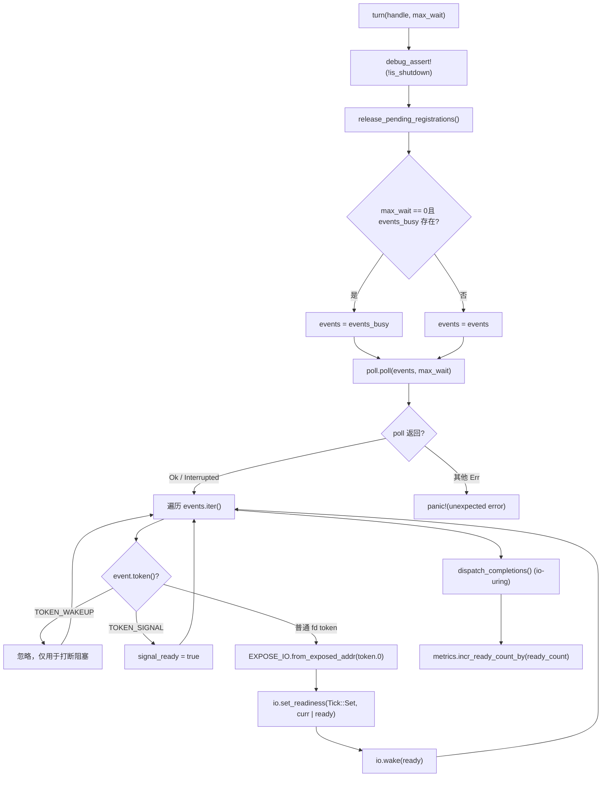
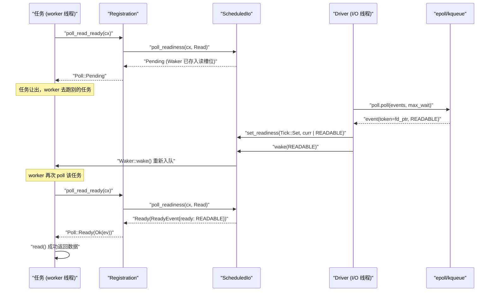

# Retour en haut ↑

Progression du livre : Chapitre 5 / 14

# Statut de vérification : lignes FACT réellement ancrées`Driver`Dans le chapitre précédent, nous avons suivi la boucle principale du thread worker : la tâche est poll, et lorsqu'elle retourne Pending, le Waker est stocké quelque part ; une fois l'événement prêt, le Waker est déclenché et la tâche est remise en file. Mais où est ce « quelque part » ? Comment le Waker est-il retrouvé lorsque l'événement epoll arrive ? C'est précisément la question à laquelle le Reactor répond. Établissons d'abord un modèle intuitif : imaginons tout le mécanisme de notification de disponibilité I/O comme le système d'appel des commandes dans un restaurant — le client (la tâche) ne reste pas debout à attendre devant le comptoir après avoir commandé, mais prend un buzzer (Waker) et retourne à sa place ; une fois le plat prêt en cuisine (epoll du noyau), l'accueil (le Reactor) retrouve le buzzer correspondant grâce au numéro de commande (Token) et appuie sur le bouton. Sans ce système, chaque tâche ne pourrait que poller le socket, brûlant le CPU ; ou bien utiliser un thread bloquant en attente, un thread par connexion, ce qui ne passe pas à l'échelle. Le Reactor de Tokio est constitué de trois fichiers formant une structure à trois couches, avec une séparation stricte des responsabilités : driver.rs est le corps de la boucle d'événements, détient mio::Poll, est responsable d'appeler poll() en attente bloquante des événements du noyau, et traduit les événements en lectures/écritures sur ScheduledIo ; registration.rs est le handle d'enregistrement orienté utilisateur, celui que TcpStream détient en interne, offrant des API comme poll_read_ready / poll_write_ready ; scheduled_io.rs est l'emplacement d'état de chaque fd, stockant les bits de disponibilité en lecture/écriture et la liste des Wakers, c'est le pont entre les événements et les tâches. La relation d'assemblage des modules est visible dans tokio/src/runtime/io/mod.rs:5-16 : driver exporte Driver, Handle, ReadyEvent, registration exporte Registration, scheduled_io exporte ScheduledIo. Le schéma ci-dessous ancre le flux de données complet à suivre dans ce chapitre : TcpStream → Registration → ScheduledIo → Handle/Driver → noyau → retour à ScheduledIo → Waker. Décomposons maintenant couche par couche.`Handle`Couche driver :

## et

`Driver`répartition des responsabilités**Modèle intuitif`mio::Poll`est**la seule entité possédant`&mut`, elle ne peut être accédée que dans un seul thread`Handle`— c'est l'exigence d'exclusivité de la boucle d'événements. Tandis que**est**, tout thread souhaitant enregistrer un nouveau fd passe par lui. Sans cette séparation, il faudrait soit ajouter un verrou à`mio::Poll`(chaque enregistrement entre en compétition), soit faire revenir tous les enregistrements vers le thread driver (ce qui introduirait une file de messages inter-threads). Tokio choisit de laisser`Handle`détenir directement le clone de`mio::Registry`, les opérations d'enregistrement peuvent se faire en concurrence, et seule l'attente réelle d'événements nécessite l'exclusivité.

## Disposition mémoire et champs

Regardons d'abord`Driver`les champs de[FACT:tokio/src/runtime/io/driver.rs:25-38]：

- `signal_ready: bool`: si un événement de signal Unix est arrivé, utilisé pour le pilotage par signal.
- `events: mio::Events`: tampon d'événements principal, réutilisé à travers les appels`turn`, pour éviter une allocation à chaque fois.
- `events_busy: Option<mio::Events>`：**Tampon dédié au poll non bloquant**, présent uniquement lorsque`max_io_events_per_busy_tick`est défini.
- `poll: mio::Poll`: encapsulation de la file d'événements du noyau.

Regardons ensuite`Handle` [FACT:tokio/src/runtime/io/driver.rs:41-75]：

- `registry: mio::Registry`：`mio::Poll::registry()`le clone de`register`/`deregister`。
- `registrations: RegistrationSet`, utilisé pour`Token`: l'ensemble de tous les enregistrements actifs, responsable de l'allocation de`ScheduledIo`。
- `synced: Mutex<registration_set::Synced>`et`RegistrationSet`: protège l'état de synchronisation de
- `waker: mio::Waker`: utilisé pour réveiller depuis n'importe quel thread le driver bloqué dans`turn`.
- `metrics: IoDriverMetrics`: compte le nombre de fd, le nombre d'événements prêts.

Il y a ici une conception clé :`events_busy`l'existence de[FACT:tokio/src/runtime/io/driver.rs:25-38]vise à résoudre**le problème où le poll non bloquant avale les événements**. Le commentaire[FACT:tokio/src/runtime/io/driver.rs:189-190]le dit clairement : si les événements retirés par le poll non bloquant restent dans le tampon principal, le prochain poll ne les verra plus ; avec un tampon séparé, les événements non traités restent dans la file du noyau et seront renvoyés au prochain poll.

## Étape par étape : une exécution de`turn`

`turn`est la fonction centrale du driver[FACT:tokio/src/runtime/io/driver.rs:184-261]. Supposons qu'un thread worker constate qu'il n'y a aucune tâche à exécuter et appelle`park` → `turn(handle, None)`pour attendre en bloquant :

**Première étape**: affirmer que shutdown n'est pas[FACT:tokio/src/runtime/io/driver.rs:185], et libérer les enregistrements en attente de nettoyage[FACT:tokio/src/runtime/io/driver.rs:187]。`release_pending_registrations`vérifier`needs_release()`, et si présent appeler`registrations.release()` [FACT:tokio/src/runtime/io/driver.rs:336-340]。

**Deuxième étape**: choisir le tampon d'événements[FACT:tokio/src/runtime/io/driver.rs:191-194]. Si`max_wait`est zéro et que`events_busy`existe, utiliser le tampon busy ; sinon utiliser le tampon principal.

**Troisième étape**: appeler`self.poll.poll(events, max_wait)` [FACT:tokio/src/runtime/io/driver.rs:198]. C'est ici que l'on bloque réellement dans epoll_wait. La gestion des erreurs est très mesurée :`Interrupted`est directement ignoré (une interruption par signal est normale)[FACT:tokio/src/runtime/io/driver.rs:200], sous WASI`InvalidInput`est également ignoré[FACT:tokio/src/runtime/io/driver.rs:201-205], les autres erreurs provoquent directement un panic[FACT:tokio/src/runtime/io/driver.rs:206]。

**Quatrième étape**: parcourir les événements[FACT:tokio/src/runtime/io/driver.rs:211-233]. Pour chaque`event`：

- si`token == TOKEN_WAKEUP`(valeur 0)[FACT:tokio/src/runtime/io/driver.rs:214], ne rien faire — c'est`unpark`qui est utilisé pour interrompre le blocage.
- Si`token == TOKEN_SIGNAL`(valeur 1)[FACT:tokio/src/runtime/io/driver.rs:216], définir`signal_ready = true`。
- sinon c'est un événement d'E/S ordinaire[FACT:tokio/src/runtime/io/driver.rs:218-231]: convertir`mio::Ready`en`Ready`de Tokio, utiliser`EXPOSE_IO.from_exposed_addr(token.0)`pour restaurer le token en pointeur`*const ScheduledIo`, puis`set_readiness(Tick::Set, |curr| curr | ready)`accumuler les bits de disponibilité, puis`io.wake(ready)`déclencher la`Waker`。

dans la direction correspondante`EXPOSE_IO`Ici`PtrExposeDomain<ScheduledIo>` [FACT:tokio/src/runtime/io/mod.rs:21-22]est un`usize`, il « expose » le pointeur comme un`mio::Token`en tant que[FACT:tokio/src/runtime/io/driver.rs:222-225]. Le commentaire de sûreté**explique pourquoi cette conversion unsafe est sûre : le pointeur ne sera pas libéré avant d'être désenregistré de mio**et`Arc<ScheduledIo>`que le driver ne fasse plus de poll concurrent, et le driver détient la propriété de

**.**Cinquième étape[FACT:tokio/src/runtime/io/driver.rs:235-258]: traiter la file de complétion io_uring (Linux + tokio_unstable uniquement)

**, y compris la boucle de flush en cas de débordement de la CQ.**Sixième étape[FACT:tokio/src/runtime/io/driver.rs:265-267]。



## copier`Handle`Réflexion de conception : pourquoi`mio::Waker`

`unpark` [FACT:tokio/src/runtime/io/driver.rs:280-283]doit-il détenir`self.waker.wake()`appeler`mio::Waker`. Ce`Driver::new`lors de`TOKEN_WAKEUP`utilise[FACT:tokio/src/runtime/io/driver.rs:124]pour enregistrer`poll.poll()`. Lorsque le driver est bloqué dans`unpark`, un autre thread appelant`TOKEN_WAKEUP`insérera un événement`poll`dans epoll,[FACT:tokio/src/runtime/io/driver.rs:214-215]。

> **[Design Inference & Architectural Trade-offs]**
> 〔Inférence de conception et compromis architecturaux〕`deregister_source`Ce mécanisme est utilisé dans[FACT:tokio/src/runtime/io/driver.rs:315-334]: après avoir désenregistré une source, si`registrations.deregister`retourne true (indiquant qu'il s'agit de la dernière référence), alors`unpark()`. Pourquoi ? Parce que le driver peut être bloqué dans`poll`en attente d'un événement pour ce fd, alors que le fd a déjà été désenregistré et que le noyau ne produira plus d'événement ; il faut réveiller activement le driver pour qu'il réexamine l'ensemble des enregistrements et puisse sortir du blocage. Sinon, le driver dormirait jusqu'au timeout de`max_wait`, retardant le shutdown.

Autre détail :`deregister_source`appelle d'abord`self.registry.deregister(source)` [FACT:tokio/src/runtime/io/driver.rs:322], puis nettoie`registrations` [FACT:tokio/src/runtime/io/driver.rs:315-334]. Le commentaire[FACT:tokio/src/runtime/io/driver.rs:320-321]dit « Cleanup ALWAYS happens » — même si le deregister au niveau de l'OS échoue, il faut nettoyer l'état interne, et seulement ensuite retourner l'erreur de l'OS[FACT:tokio/src/runtime/io/driver.rs:336-340]. C'est un modèle typique où**le nettoyage des ressources prime sur la propagation des erreurs**.

# Couche d'enregistrement :`Registration`comment stocker`Waker`dans`ScheduledIo`

## Modèle intuitif

`Registration`est**un contrat entre la tâche et le fd**. Il détient deux choses : un`scheduler::Handle`(utilisé pour accéder au runtime si nécessaire), un`Arc<ScheduledIo>`(le slot d'état du fd). Lorsqu'une tâche appelle`poll_read_ready`,`Registration`confie`Waker`à`ScheduledIo`pour qu'il le garde ; lorsque le driver reçoit un événement, il extrait`ScheduledIo`de`Waker`pour le réveiller.

## Disposition mémoire et champs

`Registration`n'a que deux champs[FACT:tokio/src/runtime/io/registration.rs:46-54]：

- `handle: scheduler::Handle`: le handle runtime, le commentaire[FACT:tokio/src/runtime/io/registration.rs:46-54]dit « TODO: this can probably be moved into ScheduledIo », indiquant que l'auteur pense que la position de ce champ peut être optimisée.
- `shared: Arc<ScheduledIo>`: état partagé,`Arc`garantit que le driver et la tâche peuvent tous deux y accéder.

> **[Design Inference & Architectural Trade-offs]**
> Notons que`Registration`implémente manuellement`Send`et`Sync` [FACT:tokio/src/runtime/io/registration.rs:57-58]. Pourquoi unsafe impl est-il nécessaire ? Parce que`scheduler::Handle`peut contenir en interne des champs non`Send`/`Sync`(comme`Rc`), mais le scénario d'utilisation de`Registration`exige qu'il puisse traverser les threads. Le commentaire de documentation[FACT:tokio/src/runtime/io/registration.rs:28-33]donne la contrainte clé :**L'appelant doit garantir qu'au plus deux tâches utilisent concurremment le même`Registration`**, une en lecture, une en écriture. Violer cette contrainte reste sûr pour la mémoire, mais entraîne une perte de notifications et la suspension des tâches.

## Step-by-Step：`poll_read_ready`la chaîne d'appels de

Supposons que la tâche, dans`TcpStream::poll_read`découvre que le socket n'a pas de données, il faut enregistrer un intérêt de lecture. La chaîne d'appels est`TcpStream::poll_read_priv` → `PollEvented::poll_read` → `Registration::poll_read_io` → `poll_io` → `poll_ready`。

`poll_ready`est le cœur[FACT:tokio/src/runtime/io/registration.rs:155-171]：

**Première étape**：`trace_leaf()` [FACT:tokio/src/runtime/io/registration.rs:160], utilisé pour l'instrumentation tracing.

**Deuxième étape**：`coop::poll_proceed(cx)` [FACT:tokio/src/runtime/io/registration.rs:155-171]. C'est le mécanisme de budget coopératif qui sera abordé au chapitre 12. Si le budget est épuisé, retourne`Pending`et enregistre un`Waker`spécial, pour que la tâche soit replanifiée au tour suivant.

**Troisième étape**：`self.shared.poll_readiness(cx, direction)` [FACT:tokio/src/runtime/io/registration.rs:155-171]. C'est ici que se fait la véritable interaction avec`ScheduledIo`: vérifie le bit de disponibilité actuel, s'il est déjà prêt retourne immédiatement`Ready`; sinon stocke`cx.waker()`dans`ScheduledIo`le slot directionnel correspondant de`Pending`。

**, retourne**Quatrième étape`ev.is_shutdown` [FACT:tokio/src/runtime/io/registration.rs:155-171]: vérifie`RUNTIME_SHUTTING_DOWN_ERROR`。

**. Si le runtime est en cours d'arrêt, retourne**：`coop.made_progress()` [FACT:tokio/src/runtime/io/registration.rs:169]Cinquième étape

`poll_io`, marque la consommation du budget, retourne l'événement de disponibilité.`poll_ready`ajoute une boucle de retry au-dessus de[FACT:tokio/src/runtime/io/registration.rs:173-192]：

```rust
loop {
    let ev = ready!(self.poll_ready(cx, direction))?;
    match f() {
        Ok(ret) => return Poll::Ready(Ok(ret)),
        Err(ref e) if e.kind() == io::ErrorKind::WouldBlock => {
            self.clear_readiness(ev);
        }
        Err(e) => return Poll::Ready(Err(e)),
    }
}
```

Ceci illustre**readiness est un indice, pas une garantie**l'idée centrale de`poll_ready`dit lisible, mais lors du véritable`read()`il peut retourner`WouldBlock`(par exemple un autre thread a lu les données en premier). Il faut alors`clear_readiness(ev)` [FACT:tokio/src/runtime/io/registration.rs:187]effacer le bit de disponibilité, puis boucler pour attendre à nouveau. Si on ne l'efface pas, la tâche tombera dans une boucle active « je crois pouvoir lire → read échoue → je crois encore pouvoir lire ».

## Réflexion de conception :`try_io`et`async_io`la répartition des rôles

`try_io` [FACT:tokio/src/runtime/io/registration.rs:194-213]est la version synchrone : d'abord`ready_event(interest)`vérifie le bit de disponibilité, s'il est vide retourne directement`WouldBlock` [FACT:tokio/src/runtime/io/registration.rs:194-213]; sinon exécute`f()`, si`f()`retourne`WouldBlock`alors efface le bit de disponibilité[FACT:tokio/src/runtime/io/registration.rs:207-210]. Il**n'enregistre pas de Waker**, adapté aux scénarios de type`try_read`« essayer une fois et partir ».

`async_io` [FACT:tokio/src/runtime/io/registration.rs:225-245]est la version asynchrone :`readiness(interest).await`enregistre un Waker et attend, puis exécute`f()`，`WouldBlock`en effaçant le bit de disponibilité et en bouclant. Notez qu'il appelle aussi`coop::poll_proceed` [FACT:tokio/src/runtime/io/registration.rs:233]dans la boucle, pour éviter d'épuiser le budget lors de nombreux`WouldBlock`retries.

## Pièges en production :`Drop`le nettoyage du Waker dans

`Registration::drop` [FACT:tokio/src/runtime/io/registration.rs:253-262]appelle`self.shared.clear_wakers()`. Le commentaire[FACT:tokio/src/runtime/io/registration.rs:253-262]explique la raison :`ScheduledIo`le`Waker`stocké dans`Arc<driver::Inner>`peut détenir`driver::Inner`, et`ScheduledIo`détient à son tour`Registration`, formant une référence circulaire. Nettoyer le Waker est un moyen de briser le cycle. Mais le commentaire admet aussi que c'est une « imperfect solution » — si`Waker`lui-même est stocké dans

> **[Design Inference & Architectural Trade-offs]**
> 〔Inférence de conception et compromis architecturaux〕`clear_wakers`Le comportement en production est le suivant : si un grand nombre de connexions sont drop mais que le runtime ne s'arrête pas, la mémoire n'est pas immédiatement récupérée, jusqu'au prochain`ScheduledIo`ou au shutdown du runtime. Pour les services à connexions longues, ce n'est généralement pas un problème ; mais pour les scénarios à connexions courtes créées/détruites à haute fréquence, il faut surveiller le moment de récupération de

# De`TcpStream::read`à`Waker`la chaîne complète de réveil

## Modèle intuitif

Maintenant relions les trois couches. L'utilisateur appelle`TcpStream`sur`.read().await`, ce qui exécute en réalité`AsyncRead::poll_read` → `PollEvented::poll_read` → `Registration::poll_read_io`. Quand les données ne sont pas arrivées,`Waker`est stocké dans`ScheduledIo`; quand epoll signale la lisibilité, le driver retire`ScheduledIo`de`Waker`et réveille, la tâche est replanifiée, et lors du prochain poll`poll_readiness`découvre que le bit de disponibilité est positionné, retourne directement`Ready`，`read()`avec succès.

## Step-by-Step : une attente de lecture complète

**Phase un : enregistrement de l'intérêt**。`TcpStream::new` [FACT:tokio/src/net/tcp/stream.rs:166-169]appelle`PollEvented::new(connected)`, qui appelle en interne`Registration::new_with_interest_and_handle` [FACT:tokio/src/runtime/io/registration.rs:73-81], puis`handle.driver().io().add_source(io, interest)` [FACT:tokio/src/runtime/io/registration.rs:73-81]。

`add_source` [FACT:tokio/src/runtime/io/driver.rs:288-312]fait trois choses :

1. `registrations.allocate(&mut synced.lock())`alloue un`ScheduledIo`, obtient`token` [FACT:tokio/src/runtime/io/driver.rs:293-294]。

2. `self.registry.register(source, token, interest.to_mio())`enregistre[FACT:tokio/src/runtime/io/driver.rs:298]auprès du noyau. En cas d'échec,**il faut**retirer le`ScheduledIo`qui vient d'être alloué de l'ensemble[FACT:tokio/src/runtime/io/driver.rs:300-303], sinon fuite.

3. `metrics.incr_fd_count()`compte[FACT:tokio/src/runtime/io/driver.rs:309]。

**Phase deux : attente de disponibilité**. La tâche poll`TcpStream::poll_read` [FACT:tokio/src/net/tcp/stream.rs:1492-1498] → `poll_read_priv` [FACT:tokio/src/net/tcp/stream.rs:1451-1458] → `PollEvented::poll_read` → `Registration::poll_read_io` [FACT:tokio/src/runtime/io/registration.rs:133-139] → `poll_io` → `poll_ready` → `ScheduledIo::poll_readiness`. Si à ce moment ce n'est pas prêt,`Waker`est stocké dans`ScheduledIo`le slot de lecture de`Pending`。

**, retourne**Phase trois : arrivée de l'événement`turn`. Le`poll.poll()`du driver retire l'événement[FACT:tokio/src/runtime/io/driver.rs:198]de`io.set_readiness(Tick::Set, |curr| curr | ready)`, et lors du parcours exécute pour chaque événement fd`io.wake(ready)` [FACT:tokio/src/runtime/io/driver.rs:228-229]。`wake`et`Waker`retire en interne le`wake()`。

**de la direction correspondante et appelle**。`Waker::wake()`Phase quatre : replanification de la tâche`poll_readiness`remet la tâche en file dans la file locale du worker (vu au chapitre précédent). Le worker poll à nouveau cette tâche,`Ready`，`read()`découvre que le bit de disponibilité est positionné, retourne



## copie`assume_ready`Branche importante :

`TcpStream::new_accepted` [FACT:tokio/src/net/tcp/stream.rs:174-181]optimisation`accept`est une optimisation notable.`new_accepted`Le socket retourné par`assume_ready(Ready::READABLE | Ready::WRITABLE)` [FACT:tokio/src/net/tcp/stream.rs:174-181]。

`assume_ready`est naturellement inscriptible, et détient généralement déjà le premier lot d'octets du pair. Si on attend le premier événement du driver, sous forte charge cet événement peut être placé après tous les événements des connexions déjà établies, causant de la latence. Donc[FACT:tokio/src/runtime/io/registration.rs:103-105]appelle directement`WouldBlock`le commentaire de`WouldBlock`，`poll_io`dit : « A wrong guess costs one**, which clears the readiness again. » — le coût d'une mauvaise supposition n'est qu'une**la boucle de

## effacera le bit de disponibilité et attendra à nouveau. C'est une conception

> **[Design Inference & Architectural Trade-offs]**
> .`Driver`Réflexion de conception : pourquoi le driver I/O est découplé du scheduler`Driver`〔Inférence de conception et compromis architecturaux〕`block_on`D'après la structure du code source,`Handle`et les threads worker sont séparés :

1. **est placé à un emplacement dédié du runtime (généralement le thread**：`Handle`ou un thread I/O dédié), tandis que les threads worker ne détiennent que`mio::Registry`. Ce découplage apporte plusieurs avantages :

2. **Enregistrement sans verrou**détient un clone de`epoll_wait`, n'importe quel worker peut enregistrer concurremment de nouveaux fd, sans revenir au thread driver.

3. **Centralisation de l'attente d'événements**: un seul thread bloque sur`ScheduledIo`, évitant le problème de thundering herd où plusieurs threads pollent simultanément le même fd epoll.`Waker::wake()`，`wake()`Chemin de réveil court

: après réception d'un événement, le driver manipule directement`ScheduledIo`et appelle`set_readiness`pousse en interne la tâche dans la file du worker, sans passage de messages inter-threads.`poll_readiness`Le coût est que

## doit gérer les accès concurrents (`is_shutdown`et`RUNTIME_SHUTTING_DOWN_ERROR`

`poll_ready`peuvent se produire simultanément), ce qui est résolu par des opérations atomiques et des verrous internes.`ev.is_shutdown` [FACT:tokio/src/runtime/io/registration.rs:155-171]Pièges en production :`gone()` [FACT:tokio/src/runtime/io/registration.rs:265-267]et`RUNTIME_SHUTTING_DOWN_ERROR`。

> **[Design Inference & Architectural Trade-offs]**
> , si vrai retourne`shutdown` [FACT:tokio/src/runtime/io/driver.rs:174-182]parcourt tous les enregistrements et appelle`io.shutdown()`, met`is_shutdown`à 1 et réveille tous les waiters. Si cet indicateur n'est pas vérifié, une tâche peut encore tenter de lire le socket après que le runtime a cessé d'ordonnancer, provoquant un comportement indéfini ou un blocage. En production, si vous voyez`RUNTIME_SHUTTING_DOWN_ERROR`, cela signifie généralement qu'une tâche s'exécute encore après le drop du runtime — vérifiez si des tâches`spawn`n'ont pas été correctement join.

Un autre piège est`deregister_source`de`unpark` [FACT:tokio/src/runtime/io/driver.rs:328]. Si le driver est bloqué dans`poll`, et que le dernier`Registration`est drop à ce moment,`unpark`réveillera le driver. Mais si le driver n'est pas en état de blocage (par exemple, il traite d'autres événements),`unpark`fait simplement que le prochain`turn`retourne immédiatement[FACT:tokio/src/runtime/io/driver.rs:280-283]. Cette sémantique est documentée dans les commentaires de`Handle::unpark`.

# Réflexion de conception : les trois compromis clés du Reactor

**Compromis un :`Token`utilise des pointeurs plutôt que des indices**。`EXPOSE_IO.from_exposed_addr(token.0)` [FACT:tokio/src/runtime/io/driver.rs:220]traite`mio::Token`directement comme`*const ScheduledIo`l'adresse de`Token → ScheduledIo`. Cela évite de maintenir une table de correspondance[FACT:tokio/src/runtime/io/driver.rs:222-225]。

**, la recherche est O(1) et sans verrou. Le coût est que la sécurité dépend d'une gestion stricte des durées de vie : le pointeur ne doit être libéré qu'après désenregistrement et après que le driver ne poll plus**。`Registration`Compromis deux : deux slots Waker en lecture/écriture[FACT:tokio/src/runtime/io/registration.rs:24-26]La documentation`Waker`dit « A registration instance represents two separate readiness streams » — lecture et écriture ont chacune un`poll_read_ready`slot indépendant. Cela permet aux tâches de lecture et d'écriture du même socket de s'enregistrer séparément, sans interférence. Mais le commentaire[FACT:tokio/src/net/tcp/stream.rs:549-552]de`poll_read_ready`/`poll_read`/`poll_peek`rappelle : des appels multiples à`Waker`ne conservent que le dernier

**— la direction de lecture n'a qu'un seul slot.`events_busy`Compromis trois :**le tampon indépendant de[FACT:tokio/src/runtime/io/driver.rs:364-386]. Le test`Driver::new(16, Some(2))`vérifie ce comportement :`turn`crée un driver avec une capacité busy de 2, enregistre 5 sources lisibles, puis le[FACT:tokio/src/runtime/io/driver.rs:375-376]non bloquant ne prend que 2 événements`turn`, les 3 restants demeurent dans la file du noyau, et le prochain[FACT:tokio/src/runtime/io/driver.rs:379-380]bloquant récupère

# . Cela empêche un poll non bloquant d'engloutir tous les événements d'un coup, ce qui affamerait les polls suivants.

Résumé de ce chapitre`TcpStream::read`Ce chapitre a retracé la chaîne Reactor complète derrière

- **:**：`Driver`Couche driver`mio::Poll`，`turn`monopolise`EXPOSE_IO`en attente bloquante d'événements, utilise`Token`pour restaurer`ScheduledIo`en`set_readiness` + `wake`pointeur, appelle`Waker`。`Handle`pour déclencher`unpark`fournit un point d'entrée d'enregistrement inter-threads,
- **sert à interrompre le blocage.**：`Registration`Couche enregistrement`Arc<ScheduledIo>`，`poll_ready`détient`Waker`，`poll_io`vérifie les bits de disponibilité ou stocke dans`WouldBlock`utilise`try_io`/`async_io`une boucle de réessai pour gérer les faux positifs,
- **sert respectivement les scénarios synchrones et asynchrones.**：`ScheduledIo`Couche état`Waker`est le slot d'état du fd, stockant les bits de disponibilité lecture/écriture et les deux

# slots, c'est le seul pont entre les événements et les tâches.

Réflexions et auto-évaluation de ce chapitre`poll_io`Q1 : Si l'on supprime`WouldBlock`dans la branche`self.clear_readiness(ev)`de

**, dans quel scénario cela provoquerait-il une boucle active (busy-loop) de la tâche ? Pourquoi ?**：`poll_io`Analyse de référence[FACT:tokio/src/runtime/io/registration.rs:173-192]La boucle`f()`de`WouldBlock`appelle`clear_readiness(ev)` [FACT:tokio/src/runtime/io/registration.rs:187]。`ev`lorsque`poll_ready`retourne`ReadyEvent`est le`clear_readiness`retourné par`ScheduledIo`, contenant les bits de disponibilité actuels.

efface ces bits de`poll_ready` → `poll_readiness`.`ScheduledIo`Si l'on ne nettoie pas, au prochain appel de la boucle à`poll_readiness`,`Ready`conserve encore l'ancien bit « lisible »,`f()`retourne immédiatement`read()`(car les bits de disponibilité ne sont pas vides), puis`WouldBlock`exécute à nouveau`Pending`, et si le socket n'a effectivement pas de données, retourne encore

, la boucle continue. Comme les bits de disponibilité ne sont jamais effacés, cette boucle n'entrera jamais dans`Registration`, la tâche occupera le CPU en polling permanent.[FACT:tokio/src/runtime/io/registration.rs:28-33]Scénario déclencheur : plusieurs tâches partagent la direction de lecture du même socket (bien que la documentation`try_read`de`poll_read`dise au maximum deux tâches, la direction de lecture n'a qu'un seul slot), ou`read()`et`WouldBlock`sont mélangés. Plus courant encore : après qu'epoll signale la lisibilité, un autre thread lit les données en premier, le

Q2: `add_source`de la tâche courante retourne`registry.register`, il faut alors effacer le bit de disponibilité, sinon il réessaiera indéfiniment.`registrations.remove`Pourquoi appeler

**lorsque**：`add_source` [FACT:tokio/src/runtime/io/driver.rs:288-312]échoue dans`registrations.allocate`? Que se passe-t-il si on ne l'appelle pas ?`ScheduledIo` [FACT:tokio/src/runtime/io/driver.rs:293]Analyse de référence`registry.register`alloue d'abord[FACT:tokio/src/runtime/io/driver.rs:298], puis`ScheduledIo`enregistre`RegistrationSet`auprès du noyau. Si l'enregistrement échoue,

a déjà été alloué mais aucun fd n'y est associé ; si on ne le retire pas, il restera éternellement dans[FACT:tokio/src/runtime/io/driver.rs:296-297].`scheduled_io` from the `registrations` set if registering the `source` with the OS fails. Otherwise it will leak the `scheduled_io`Le commentaire

`remove`dit explicitement : « we should remove the[FACT:tokio/src/runtime/io/driver.rs:300-303]. » — c'est une fuite de mémoire.`ScheduledIo`L'appel à`RegistrationSet`est enveloppé dans un bloc unsafe, car`RegistrationSet`fait partie de`Token`, et l'opération de retrait doit garantir qu'il n'y a pas d'autres références. Conséquences de la fuite :`allocate`croît continuellement,

Q3: `deregister_source`l'espace est gaspillé, ce qui peut finalement provoquer l'échec de`unpark()`ou l'épuisement de la mémoire. Dans les scénarios de création/destruction fréquente de connexions (comme un serveur à connexions courtes), si le taux d'échec d'enregistrement est élevé (par exemple, épuisement des fd), la fuite accélère l'épuisement des ressources.`registrations.deregister`Dans

**, pourquoi**：`deregister_source` [FACT:tokio/src/runtime/io/driver.rs:315-334]n'est-il appelé que lorsque`registry.deregister(source)`retourne true ? Quel problème y aurait-il à l'appeler inconditionnellement ?[FACT:tokio/src/runtime/io/driver.rs:322]Analyse de référence`registrations.deregister`La logique de[FACT:tokio/src/runtime/io/driver.rs:315-334]est : d'abord`unpark()` [FACT:tokio/src/runtime/io/driver.rs:328]。

`registrations.deregister`désenregistre`ScheduledIo`auprès du noyau, puis`poll`nettoie l'état interne`unpark`, et si cela retourne true, alors`mio::Waker`retourner true signifie que c'est la dernière référence,`TOKEN_WAKEUP`est réellement retiré. À ce moment, le driver peut être bloqué dans[FACT:tokio/src/runtime/io/driver.rs:280-283]en attente d'un événement pour ce fd, mais le fd est déjà désenregistré, le noyau ne produira plus d'événements.`poll`via

injecte un`unpark`événement`ScheduledIo`dans epoll, faisant que`TcpStream`retourne immédiatement, le driver revérifie l'ensemble des enregistrements et peut sortir du blocage.`split`puis lecture-écriture en deux moitiés), chaque drop d'une moitié réveille le driver, augmentant la charge CPU. Plus grave encore

Dans ce chapitre, nous avons décomposé comment Reactor traduit les événements epoll en réveils Waker : en partant de poll_read_ready de TcpStream, en passant par l'enregistrement et l'interrogation de Registration, jusqu'aux bits de disponibilité et aux emplacements Waker de ScheduledIo, puis le Driver localise et déclenche le réveil dans la boucle d'événements en fonction du Token. Les conceptions clés incluent : le Token comme pointeur pour une recherche O(1), les deux emplacements Waker lecture-écriture pour supporter la séparation lecture-écriture concurrente, le tampon indépendant events_busy pour éviter la famine d'événements, et assume_ready pour optimiser le scénario accept par estimation optimiste. À ce stade, la boucle fermée de notification de disponibilité I/O est complète. Mais le runtime asynchrone doit encore gérer un autre type de « disponibilité » — le temps. Dans le prochain chapitre, nous analyserons l'implémentation de tokio::time::sleep et timeout : comment les temporisateurs sont insérés dans la roue temporelle, comment la roue temporelle est hiérarchisée par temps d'expiration, et comment le driver calcule le timeout du prochain park et déclenche les tâches expirées. Vous verrez l'abstraction unifiée « le temps est aussi un événement I/O », ainsi que comment start_paused et l'horloge de test rendent le temps contrôlable dans les tests.
