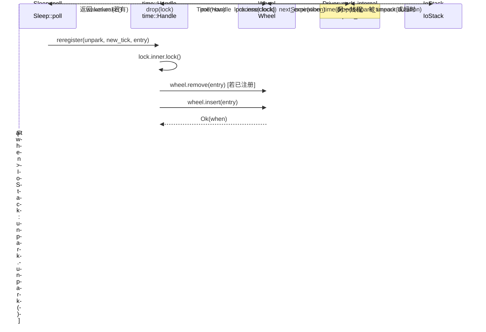

# Chapitre 6 : Pilotage temporel : comment la roue temporelle, Sleep et les timeouts sont réveillés

Dans le chapitre précédent, nous avons suivi la chaîne complète de TcpStream::read, en voyant comment ScheduledIo traduit les événements de disponibilité fd d'epoll en réveils Waker. Mais le runtime asynchrone doit encore gérer un autre type de « disponibilité » : un Future sleep(100ms) doit être réveillé après 100ms. Ce type d'événement ne provient pas d'un fd du noyau, mais du « temps lui-même ». Le choix de conception de Tokio est de traiter le temps comme un événement I/O : la structure Driver n'a qu'un seul champ park: IoStack, qui réutilise le mécanisme park/unpark du driver I/O. Lorsque la roue temporelle calcule le « prochain instant d'expiration », le driver appelle park_timeout pour faire dormir le thread jusqu'à cet instant ; après le réveil, il extrait les entrées expirées de la roue temporelle et déclenche leurs Waker. Ainsi, le planificateur n'a besoin que d'une entrée park unifiée pour attendre simultanément les deux types d'événements : « fd prêt » et « temporisateur expiré ». Ce chapitre répond à trois questions : comment les temporisateurs sont insérés dans la roue temporelle ? Comment la roue temporelle est hiérarchisée par temps d'expiration ? Comment le driver calcule le timeout du prochain park et déclenche les tâches expirées ?

# I. Roue temporelle : structure de hachage hiérarchique à six niveaux de 64 emplacements

## Modèle intuitif

Imaginez une horloge mécanique : l'aiguille des secondes fait un tour et entraîne l'aiguille des minutes, qui fait un tour et entraîne l'aiguille des heures. S'il n'y avait qu'une aiguille des secondes, pour représenter « dans 12 jours », il faudrait compter 1 million de cases ; après hiérarchisation, l'aiguille des secondes ne gère que la précision dans les 64 secondes, l'aiguille des minutes gère 64 minutes, l'aiguille des heures gère 64 heures — chaque niveau n'a besoin que de 64 emplacements pour couvrir jusqu'à 2 ans.

Sans hiérarchisation, insérer un temporisateur lointain nécessiterait soit un parcours O(N), soit un tableau gigantesque. La roue temporelle utilise la « hiérarchisation par temps d'expiration » pour réduire l'insertion et le déclenchement à un coût approximativement O(1).

## Disposition mémoire et champs

`Wheel`ne possède que trois champs principaux[FACT:tokio/src/runtime/time/wheel/mod.rs:22-40]：

```rust
pub(crate) struct Wheel {
    elapsed: u64,                          // 自 wheel 创建以来经过的毫秒数
    levels: Box,      // 6 层，每层 64 槽
    pending: LinkedList,      // 已到期、待触发的条目
}
```

`NUM_LEVELS = 6`，`BITS_PER_LEVEL = 6`(soit 64 emplacements par niveau)[FACT:tokio/src/runtime/time/wheel/mod.rs:45-47]。`MAX_DURATION = 1 << (6 * 6) = 1 << 36`millisecondes, environ 2 ans[FACT:tokio/src/runtime/time/wheel/mod.rs:50]。

La granularité des six niveaux selon les commentaires de documentation est[FACT:tokio/src/runtime/time/wheel/mod.rs:22-40]：

| Niveau | Granularité de l'emplacement | Plage couverte |
| --- | --- | --- |
| 0 | 1 ms | 64 ms |
| 1 | 64 ms | ~4 s |
| 2 | ~4 s | ~4 min |
| 3 | ~4 min | ~4 hr |
| 4 | ~4 hr | ~12 day |
| 5 | ~12 day | ~2 yr |

`pending`est une liste chaînée intrusive (`LinkedList<TimerShared>`), contenant les entrées déjà retirées de la roue et en attente de déclenchement du Waker. Notez qu'il s'agit de`LinkedList`et non de`Vec`: l'entrée elle-même est intégrée dans`TimerShared`, l'insertion/suppression ne nécessite aucune allocation.

## Scénario guidé : insertion d'un sleep de 100ms

Lorsque`sleep(100ms)`est poll pour la première fois,`Sleep::poll_elapsed`construit`Timer::new`et appelle`init` [FACT:tokio/src/time/sleep.rs:436-440]。`init`appelle finalement`Handle::reregister`, puis appelle`Wheel::insert`。

`insert`La première étape consiste à vérifier si déjà expiré[FACT:tokio/src/runtime/time/wheel/mod.rs:90-98]：

```rust
let when = unsafe { item.sync_when() };
if when  usize {
    const SLOT_MASK: u64 = (1 = MAX_DURATION {
        return NUM_LEVELS - 1;
    }
    masked.ilog2() as usize / BITS_PER_LEVEL
}
```

Ici, on utilise`elapsed ^ when`plutôt que`when - elapsed`, ce qui est une technique ingénieuse : le bit de poids fort du XOR reflète « à partir de quel bit les deux horodatages commencent à différer », c'est-à-dire « quelle granularité est nécessaire pour les distinguer ».`| SLOT_MASK`force les 6 bits de poids faible à 1, évitant que`ilog2`ne calcule un niveau trop petit lorsqu'ils tombent dans le même emplacement.`ilog2() / 6`mappe la largeur de bits au numéro de niveau. Si le résultat XOR dépasse`MAX_DURATION`(soit plus de 2 ans), il est forcé dans le niveau le plus élevé — c'est le « fudge the timer into the top level ».

Pour un sleep de 100ms, en supposant que`elapsed`est proche de 0,`when ≈ 100`，`elapsed ^ when ≈ 100`，`ilog2(100) = 6`，`6 / 6 = 1`, donc il tombe dans la couche 1 (granularité de 64 ms). Cela signifie qu'il attendra dans un slot de la couche 1 jusqu'à ce que le temps avance jusqu'à la limite de ce slot pour être descendu dans la couche 0.

## Descente par niveaux : process_expiration

Lorsque`poll(now)`avance le temps,`Wheel::poll`appelle en boucle`next_expiration`et`process_expiration` [FACT:tokio/src/runtime/time/wheel/mod.rs:142-166]：

```rust
pub(crate) fn poll(&mut self, now: u64) -> Option {
    loop {
        if let Some(handle) = self.pending.pop_back() {
            return Some(handle);
        }
        match self.next_expiration() {
            Some(ref expiration) if expiration.deadline  {
                self.process_expiration(expiration);
                self.set_elapsed(expiration.deadline);
            }
            _ => {
                self.set_elapsed(now);
                break;
            }
        }
    }
    self.pending.pop_back()
}
```

`process_expiration`est responsable de « faire descendre » les entrées expirées d'une couche vers la couche suivante, ou (dans la couche 0) de les marquer comme pending[FACT:tokio/src/runtime/time/wheel/mod.rs:218-251]：

```rust
let mut entries = self.take_entries(expiration);
while let Some(item) = entries.pop_back() {
    match unsafe { item.mark_pending(expiration.deadline) } {
        Ok(()) => {
            self.pending.push_front(item);   // 真正到期
        }
        Err(expiration_tick) => {
            let level = level_for(expiration.deadline, expiration_tick);
            unsafe { self.levels[level].add_entry(item); }  // 下沉到更低层
        }
    }
}
```

`mark_pending`est essentiel : il vérifie si le deadline réel de l'entrée est déjà atteint. Si c'est le cas, il retourne`Ok(())`, l'entrée entre dans la`pending`liste chaînée ; si ce n'est pas encore le cas (seule la limite du slot est atteinte), il retourne`Err(expiration_tick)`, et l'entrée est réinsérée dans une couche plus fine.

Notez le point souligné dans les commentaires[FACT:tokio/src/runtime/time/wheel/mod.rs:219-228]: il faut d'abord retirer toutes les entrées du slot entier avant de les traiter, car certaines entrées peuvent être réinsérées dans le même slot (cela se produit lorsque le temps d'insertion dépasse`MAX_DURATION`, provoquant un wraparound). Si l'on retire et insère en même temps, on peut tomber dans une boucle infinie.

## Calcul du prochain instant d'expiration

`next_expiration`parcourt des couches basses vers les couches hautes et retourne le premier point d'expiration non vide[FACT:tokio/src/runtime/time/wheel/mod.rs:169-191]：

```rust
fn next_expiration(&self) -> Option {
    if !self.pending.is_empty() {
        return Some(Expiration { level: 0, slot: 0, deadline: self.elapsed });
    }
    for (level_num, level) in self.levels.iter().enumerate() {
        if let Some(expiration) = level.next_expiration(self.elapsed) {
            debug_assert!(self.no_expirations_before(level_num + 1, expiration.deadline));
            return Some(expiration);
        }
    }
    None
}
```

Si`pending`n'est pas vide, cela signifie qu'il y a des entrées expirées à déclencher, et il retourne immédiatement le`elapsed`actuel comme deadline (ainsi le driver se parkera avec un timeout de 0 et reviendra immédiatement les traiter). Sinon, il parcourt les couches et retourne le deadline du premier slot non vide.`debug_assert`valide un invariant : une couche supérieure ne peut pas avoir un point d'expiration plus précoce que la couche actuelle.

```mermaid
flowchart TD
    start["Wheel::poll(now)"] --> check_pending{"pending 非空?"}
    check_pending -->|是| pop["pop_back 返回 TimerHandle"]
    check_pending -->|否| next_exp{"next_expiration() 有到期点?"}
    next_exp -->|无| set_elapsed["set_elapsed(now) 后 break"]
    next_exp -->|有| cmp{"expiration.deadline |否| set_elapsed
    cmp -->|是| proc["process_expiration(expiration)"]
    proc --> take["take_entries 取出整槽"]
    take --> mark{"item.mark_pending()"}
    mark -->|Ok 已到期| push_pending["pending.push_front(item)"]
    mark -->|Err 未到期| reinsert["level_for 后 add_entry 下沉"]
    push_pending --> set_elapsed2["set_elapsed(expiration.deadline)"]
    reinsert --> set_elapsed2
    set_elapsed2 --> check_pending
    set_elapsed --> pop2["pending.pop_back() 返回"]
```

---

# II. La boucle park du Driver : connecter la roue temporelle à la pile I/O

## Modèle intuitif

La roue temporelle elle-même ne « tourne » pas toute seule. Elle a besoin d'une boucle externe qui lui demande sans cesse : « Quand est la prochaine expiration ? » puis dort jusqu'à cet instant, et à son réveil avance le temps. Cette boucle est`Driver::park_internal`. Elle traduit « la prochaine expiration de la roue temporelle » en une durée pour`park_timeout`, confiée à la pile I/O sous-jacente pour dormir.

Sans cette boucle, les timers ne se déclencheraient jamais — la roue temporelle n'est qu'une structure de données statique, il faut quelqu'un pour la « faire tourner ».

## Structures de données : Driver et InnerState

`Driver`n'a qu'un seul champ`park: IoStack` [FACT:tokio/src/runtime/time/mod.rs:90-93]. Le véritable état est dans`Handle`, distingué via l'énumération`Inner`entre l'implémentation traditionnelle et l'implémentation expérimentale[FACT:tokio/src/runtime/time/mod.rs:95-127]. L'implémentation traditionnelle de`InnerState`contient deux champs[FACT:tokio/src/runtime/time/mod.rs:130-136]：

```rust
struct InnerState {
    next_wake: Option,   // 承诺的最早唤醒时刻
    wheel: wheel::Wheel,
}
```

`next_wake`utilise`NonZeroU64`plutôt que`Option<u64>`pour l'imbrication, afin de tirer parti de l'optimisation niche —`Option<NonZeroU64>`et`u64`ont la même taille. Il enregistre « avant quel tick le driver s'engage à se réveiller », utilisé lors de`reregister`pour déterminer s'il faut`unpark`。

`is_shutdown`est un`AtomicBool`indépendant, et les commentaires expliquent pourquoi il a été séparé du Mutex[FACT:tokio/src/runtime/time/mod.rs:90-93]：`Handle`il faut pouvoir vérifier`is_shutdown`sans verrouiller le mutex. C'est une optimisation typique de type « beaucoup de lectures, peu d'écritures » — le shutdown n'arrive qu'une fois, mais la vérification peut être fréquente.

## Piloté par scénario : le flux complet d'un park

`park_internal`est le cœur[FACT:tokio/src/runtime/time/mod.rs:213-256]：

```rust
fn park_internal(&mut self, rt_handle: &driver::Handle, limit: Option) {
    let handle = rt_handle.time();
    let mut lock = handle.inner.lock();
    assert!(!handle.is_shutdown());

    let next_wake = lock.wheel.next_expiration_time();
    lock.next_wake = next_wake.map(|t| NonZeroU64::new(t).unwrap_or_else(|| NonZeroU64::new(1).unwrap()));
    drop(lock);

    match next_wake {
        Some(when) => {
            let now = handle.time_source.now(rt_handle.clock());
            let mut duration = handle.time_source.tick_to_duration(when.saturating_sub(now));
            if duration > Duration::from_millis(0) {
                if let Some(limit) = limit {
                    duration = std::cmp::min(limit, duration);
                }
                self.park_thread_timeout(rt_handle, duration);
            } else {
                self.park.park_timeout(rt_handle, Duration::from_secs(0));
            }
        }
        None => {
            if let Some(duration) = limit {
                self.park_thread_timeout(rt_handle, duration);
            } else {
                self.park.park(rt_handle);
            }
        }
    }

    handle.process(rt_handle.clock());
}
```

Analyse étape par étape :

1. **Prendre le verrou, lire la prochaine expiration**：`lock.wheel.next_expiration_time()`retourne`Option<u64>`, c'est-à-dire le prochain tick d'expiration. En même temps, il l'écrit dans`lock.next_wake`, pour que`reregister`puisse déterminer s'il faut unpark.

2. **Libérer le verrou**：`drop(lock)`doit être fait avant le park, sinon d'autres threads ne peuvent pas insérer de timers pendant le park.

3. **Calculer la durée du park**：`when.saturating_sub(now)`obtient le nombre de ticks restants,`tick_to_duration`convertit en`Duration`. Les commentaires indiquent qu'en pratique on arrondit au supérieur à 1 ms[FACT:tokio/src/runtime/time/mod.rs:228-230], pour éviter qu'un sleep de l'ordre de la microseconde soit traité comme de longueur nulle par l'OS.

4. **Traiter la limite**: si l'appelant a passé`limit`(par exemple`park_timeout`un timeout explicite), prendre`min(limit, duration)`, pour garantir de ne pas dormir trop longtemps.

5. **Cas particulier**: si`duration == 0`(déjà expiré), utiliser`park_timeout(0)`pour retourner immédiatement, sans vraiment dormir.

6. **Sans timer**: si`next_wake`est`None`, avec`limit`alors`park_thread_timeout(limit)`, sinon`park`。

7. **infini Traitement après réveil**：`handle.process(clock)`avance la roue temporelle et déclenche les entrées expirées.

## process_at_time : déclencher les entrées expirées

`process`appelle`process_at_time` [FACT:tokio/src/runtime/time/mod.rs:296-337]：

```rust
pub(self) fn process_at_time(&self, mut now: u64) {
    let mut waker_list = WakeList::new();
    let mut lock = self.inner.lock();

    if now ) {
    let waker = unsafe {
        let mut lock = self.inner.lock();
        if unsafe { entry.as_ref().might_be_registered() } {
            lock.wheel.remove(entry);
        }
        let entry = entry.as_ref().handle();
        if self.is_shutdown() {
            unsafe { entry.fire(Err(crate::time::error::Error::shutdown())) }
        } else {
            entry.set_expiration(new_tick);
            match unsafe { lock.wheel.insert(entry) } {
                Ok(when) => {
                    if lock.next_wake.is_none_or(|next_wake| when  unsafe {
                    entry.fire(Ok(()))
                },
            }
        }
    };
    if let Some(waker) = waker {
        waker.wake();
    }
}
```

Logique clé : après une insertion réussie, si le nouvel instant d'expiration est plus précoce que`next_wake`, appeler`unpark.unpark()`pour réveiller le driver. En effet, le driver peut être en train de dormir jusqu'à un instant plus tardif, et doit être réveillé plus tôt pour recalculer la durée du park.

Notez que`unpark`est appelé**en tenant le verrou**, tandis que`waker.wake()`est appelé**après avoir libéré le verrou**. Les commentaires expliquent[FACT:tokio/src/runtime/time/mod.rs:441]: il faut libérer le verrou avant d'appeler le Waker pour éviter un deadlock. Mais`unpark`est différent — il ne fait qu'injecter un événement dans epoll, sans rappeler de code utilisateur, donc l'appeler en tenant le verrou est sûr.



---

# III. Sleep et Timeout : la couche API visible par l'utilisateur

## Modèle intuitif

`Sleep`est le Future que l'utilisateur`.await`directement,`Timeout`est un adaptateur qui enveloppe un autre Future. Ils ne gèrent pas eux-mêmes la roue temporelle, ils traduisent simplement le « deadline » en tick, et délèguent à`Timer`et`Handle`。

## Disposition mémoire de Sleep

`Sleep`utilise`pin_project!`la macro pour définir[FACT:tokio/src/time/sleep.rs:221-227]：

```rust
pub struct Sleep {
    deadline: Instant,
    driver: scheduler::Handle,
    inner: Inner,
    #[pin]
    timer: Option,
}
```

`timer`est`Option<Timer>`et avec`#[pin]`: avant le premier poll c'est`None`, c'est seulement lors du premier poll que`Timer`est créé et enregistré. Cette « initialisation paresseuse » évite d'accéder au runtime lors de l'appel à`sleep()`—`sleep()`peut être appelé en dehors du runtime, tant que l'enregistrement réel n'a lieu qu'au moment de`.await`.

`PinnedDrop`L'implémentation garantit l'annulation du timer lors du drop[FACT:tokio/src/time/sleep.rs:230-235]：

```rust
impl PinnedDrop for Sleep {
    fn drop(this: Pin) {
        let this = this.project();
        if let Some(timer) = this.timer.as_pin_mut() {
            timer.cancel(this.driver);
        }
    }
}
```

## Flux complet de poll_elapsed

`poll_elapsed`est le cœur de`Sleep`[FACT:tokio/src/time/sleep.rs:396-454]：

```rust
fn poll_elapsed(self: Pin, cx: &mut task::Context) -> Poll> {
    ready!(crate::trace::trace_leaf());
    let mut this = self.project();

    // coop 预算
    let coop = ready!(crate::task::coop::poll_proceed(cx));

    let handle = this.driver;
    let timer = match this.timer.as_mut().as_pin_mut() {
        Some(timer) => timer,
        None => {
            let time_source = handle.driver().time().time_source();
            let deadline = time_source.deadline_to_tick(*this.deadline);
            let timer = Timer::new(handle, deadline);
            this.timer.set(Some(timer));
            let mut timer = this.timer.as_pin_mut().unwrap();
            timer.as_mut().init(handle, deadline);
            timer
        }
    };

    let result = timer.poll_elapsed(cx, handle).map(move |r| {
        coop.made_progress();
        r
    });
    result
}
```

Étapes :

1. **Vérification du budget coop**：`poll_proceed(cx)`consomme un budget coopératif. Si le budget est épuisé, retourne`Pending`et cède l'exécution. C'est le mécanisme de Tokio pour empêcher qu'une seule tâche affame les autres.

2. **Création paresseuse du Timer**: si`timer`est`None`, convertit`deadline`en tick, crée`Timer`et appelle`init`pour l'enregistrer dans la roue temporelle.

3. **Délégation à Timer::poll_elapsed**: la vérification réelle de l'expiration est effectuée par`Timer`.

4. **Marquage de la progression en cas de succès**：`coop.made_progress()`indique que ce poll a réellement progressé.

## Poll de Timeout : d'abord poll la valeur, puis poll le délai

`Timeout`L'ordre de poll de[FACT:tokio/src/time/timeout.rs:210-224]：

```rust
fn poll(self: Pin, cx: &mut task::Context) -> Poll {
    let me = self.project();
    let had_budget_before = coop::has_budget_remaining();

    // 先 poll 被包裹的 future
    if let Poll::Ready(v) = me.value.poll(cx) {
        return Poll::Ready(Ok(v));
    }

    match me.delay.as_pin_mut() {
        Some(delay) => poll_delay(had_budget_before, delay, cx).map(Err),
        None => Poll::Pending,
    }
}
```

Le commentaire indique explicitement[FACT:tokio/src/time/timeout.rs:24-26]: le future est d'abord poll, puis le timeout est vérifié. Donc si le future se termine sans yield, il peut retourner`Ok`même après avoir dépassé le timeout. C'est un choix de conception, pas un bug.

`poll_delay`Gère un scénario subtil[FACT:tokio/src/time/timeout.rs:229-251]：

```rust
fn poll_delay(had_budget_before: bool, delay: Pin, cx: &mut task::Context) -> Poll {
    let delay_poll = || match delay.poll(cx) {
        Poll::Ready(()) => Poll::Ready(Elapsed::new()),
        Poll::Pending => Poll::Pending,
    };

    let has_budget_now = coop::has_budget_remaining();

    if let (true, false) = (had_budget_before, has_budget_now) {
        // 如果预算是被底层 future 耗尽的，用无约束预算 poll delay
        coop::with_unconstrained(delay_poll)
    } else {
        delay_poll()
    }
}
```

Logique : si en entrant dans`poll`il reste du budget, mais qu'après avoir poll la value le budget est épuisé, cela signifie que c'est la value qui a consommé le budget. À ce moment, si on poll le delay avec un budget restreint, le delay pourrait retourner`Pending`immédiatement, rendant impossible de déterminer si le timeout est atteint. Donc on utilise`with_unconstrained`pour lever temporairement la restriction de budget. Le commentaire appelle cela les « pathological cases »[FACT:tokio/src/time/timeout.rs:243-246]。

## Gestion du débordement du deadline de timeout

`timeout`La fonction utilise`checked_add`pour gérer le débordement[FACT:tokio/src/time/timeout.rs:86-99]：

```rust
Timeout {
    value: future.into_future(),
    delay: match Instant::now().checked_add(duration) {
        Some(deadline) => Some(Sleep::new_timeout(deadline, trace::caller_location())),
        None => None,
    },
}
```

Si`Instant::now() + duration`déborde (duration extrêmement grande),`delay`devient`None`, et le poll retourne directement`Poll::Pending` [FACT:tokio/src/time/timeout.rs:222]. Cela équivaut à « ne jamais expirer », un comportement de dégradation raisonnable.

---

# Réflexions de conception et pièges en production

**Pourquoi utiliser XOR plutôt que la soustraction pour calculer le niveau ?** `elapsed ^ when`Le bit de poids fort reflète directement « à partir de quel bit deux horodatages diffèrent », ce qui est précisément la mesure de « quelle granularité est nécessaire ». La soustraction`when - elapsed`lorsque`elapsed`est proche de`when`donne des bits de poids fort tous à 0,`ilog2`calculerait un niveau trop petit. XOR gère naturellement les scénarios de wraparound.

**Nécessité de la protection contre le retour en arrière du temps** [FACT:tokio/src/runtime/time/mod.rs:301-309]: Rust garantit que`Instant`est monotone, mais l'OS sous-jacent peut ne pas le garantir. Dans une VM Linux sur un hôte Windows, std fait confiance à l'horloge matérielle, ce qui provoque un recul de`Instant`. Tokio utilise`now = lock.wheel.elapsed()`pour clamper, évitant l'échec de l'assert de`set_elapsed`.

**Réveil par lots et deadlock** [FACT:tokio/src/runtime/time/mod.rs:319]: appeler un Waker en tenant le verrou de la roue temporelle est dangereux — le Waker peut déclencher un re-poll de la tâche, qui appelle à son tour`Sleep::reset`, tentant de réacquérir le verrou de la roue temporelle, causant un deadlock.`WakeList`Le mécanisme par lots de

**`next_wake`libère temporairement le verrou quand il est plein, c'est le modèle standard de « callback hors verrou ».** [FACT:tokio/src/runtime/time/mod.rs:130-136]：`Option<NonZeroU64>`Optimisation niche de`u64`est de même taille que`None`, car 0 est utilisé comme niche de`NonZeroU64::new(t).unwrap_or_else(|| NonZeroU64::new(1).unwrap())`. Mais tick 0 est une valeur légale, donc le code utilise[FACT:tokio/src/runtime/time/mod.rs:221]pour mapper 0 vers 1

**`process_expiration`. C'est une gestion de bordure subtile : tick 0 est traité comme tick 1, causant au plus un réveil supplémentaire de 1ms.** [FACT:tokio/src/runtime/time/wheel/mod.rs:219-228]Le « prendre d'abord, traiter ensuite » de`MAX_DURATION`: il faut d'abord extraire toutes les entrées du slot avant de les traiter, car les entrées dépassant

**`Timeout`vont faire un wraparound et se réinsérer dans le même slot. Si on insère en même temps qu'on extrait, on boucle à l'infini.** [FACT:tokio/src/time/timeout.rs:24-26]Le piège de l'ordre de poll de`Ok`: le future est poll d'abord, le timeout est vérifié ensuite. Si le future est intensif en CPU et ne yield pas, il peut retourner`timeout`même après avoir dépassé le timeout. En production, ne comptez pas sur

---

# pour forcer l'interruption d'un future non coopératif.

Résumé de ce chapitre

1. **Ce chapitre a décomposé la structure à trois couches du driver temporel de Tokio :**（`Wheel`Roue temporelle`elapsed ^ when`) : structure hiérarchique de hachage à six niveaux de 64 slots, utilisant la largeur de bits de`pending`pour déterminer le niveau des entrées, insertion et déclenchement en approximativement O(1).`process_expiration`La liste chaînée stocke les entrées expirées,

2. **Driver**（`Driver::park_internal`est responsable de la descente niveau par niveau.`next_expiration_time`) : traduit le`park_timeout`de la roue temporelle en durée`process_at_time`, réutilise le park/unpark de la pile I/O.

3. **Après le réveil, fait avancer la roue temporelle, déclenche les Waker par lots, et gère la protection contre le retour en arrière du temps et le deadlock.**（`Sleep` / `Timeout`）：`Sleep`API utilisateur`Timer`Création paresseuse de`Timeout`et enregistrement,`with_unconstrained`poll d'abord la value puis le delay, utilise

pour gérer le scénario d'épuisement du budget.`next_wake`La conception centrale est que « le temps est aussi un événement I/O » : le driver n'a qu'une seule entrée park, attendant simultanément la disponibilité des fd et l'expiration des timers.`reregister`enregistre l'instant de réveil promis,`unpark`lors de l'insertion d'un timer plus précoce,

réveille le driver pour recalculer.`Mutex`、`Semaphore`Dans le prochain chapitre, nous aborderons les primitives de synchronisation :

# comment

et les canaux implémentent l'attente asynchrone. Vous verrez comment ils réutilisent le mécanisme Waker de ce chapitre, et comment le « comptage de permissions » et la « file d'attente » coopèrent.`Wheel::insert`Réflexions et auto-évaluation de ce chapitre`if when <= self.elapsed`Q1 : Si dans`if when < self.elapsed`(supprimer le signe égal), dans quels scénarios cela entraînerait-il que le timer ne soit jamais déclenché ?

**Analyse de référence**：`when == self.elapsed`indique que l'instant d'expiration du timer est exactement égal au temps actuellement avancé. Le code original utilise`<=`pour le considérer comme`Elapsed`, l'appelant déclenche immédiatement[FACT:tokio/src/runtime/time/wheel/mod.rs:96-98]. Si on le change en`<`, cette entrée sera insérée dans la couche calculée par`level_for(elapsed, when)`. Comme`elapsed ^ when == 0`，`masked = 0 | SLOT_MASK = 63`，`ilog2(63) = 5`，`5 / 6 = 0`, elle tombe dans la couche 0. Mais le`next_expiration`de la couche 0 retournera un slot de`deadline >= elapsed`, et la condition de`Wheel::poll`est`expiration.deadline <= now`. Si`now == elapsed`, la condition est remplie,`process_expiration`retirera cette entrée,`mark_pending(elapsed)`vérifie si le deadline réel est atteint — à ce moment`when == elapsed`，`mark_pending`retourne`Ok`, l'entrée passe en pending. Donc en réalité elle sera quand même déclenchée, mais avec un détour supplémentaire. Le vrai risque est : si`elapsed`a déjà avancé au-delà de`when`(`when < elapsed`), le code original retourne`Elapsed`et déclenche immédiatement, après modification on insère dans un slot déjà passé,`next_expiration`peut retourner`deadline < elapsed`，`set_elapsed`, l'assert`elapsed <= when`échouera avec un panic[FACT:tokio/src/runtime/time/wheel/mod.rs:253-264]. Donc ce signe égal est la frontière clé pour éviter l'échec de l'assert.

Q2: `process_at_time`Dans`WakeList`, une fois que`drop(lock)`est plein, pourquoi faut-il`wake_all()`puis`lock`puis re-

**? Si on supprime ce drop, dans quels scénarios de concurrence y aurait-il un deadlock ?**：`WakeList`Analyse de référence[FACT:tokio/src/runtime/time/mod.rs:318-325]collecte les Waker, une fois plein il faut en réveiller un lot pour libérer de la place`self.inner.lock()`. Si on appelle`waker.wake()`en tenant`Sleep::reset`, la tâche réveillée peut s'exécuter immédiatement sur un autre thread (ou le scheduler du même thread), appelant`Sleep::poll_elapsed`ou`Handle::reregister`, puis appelant`reregister`, et la première chose que fait`self.inner.lock()` [FACT:tokio/src/runtime/time/mod.rs:405]est`std::sync::Mutex`. Comme`process_at_time`n'est pas réentrant, le même thread se deadlockera ; même sur un thread différent, il bloquera jusqu'à ce que`process_at_time`libère le verrou, alors que`wake_all`attend que[FACT:tokio/src/runtime/time/mod.rs:319]retourne, formant une attente circulaire. Le commentaire dit explicitement « To avoid deadlock, we must do this with the lock temporarily dropped »`while let Some(entry) = lock.wheel.poll(now)`. Après le drop, lors du re-lock, l'état de la roue temporelle peut avoir été modifié par d'autres threads (par exemple un nouveau timer inséré), donc

Q3: `Timeout::poll`continuera à prendre des entrées depuis le nouvel état, ce qui est sûr.`had_budget_before`Dans`has_budget_now`, la combinaison de`(true, false)`et`with_unconstrained`avec la condition`(false, true)`pourquoi n'est-elle utilisée que lorsque « il y a un budget à l'entrée, mais plus de budget après le poll de value »

**? Si c'était l'inverse**：`had_budget_before`que se passerait-il ?[FACT:tokio/src/time/timeout.rs:208-208]，`has_budget_now`Analyse de référence[FACT:tokio/src/time/timeout.rs:239]。`(true, false)`enregistre`poll_proceed`avant le poll de value,`Pending`enregistre`with_unconstrained`après le poll de value.[FACT:tokio/src/time/timeout.rs:247]。`(false, true)`signifie que le budget a été épuisé pendant le poll de value, indiquant que value est un « consommateur de budget ». À ce moment si on poll delay avec un budget limité,`with_unconstrained`retournerait immédiatement`(false, false)`, delay ne serait jamais réellement vérifié, le jugement de timeout serait invalide. Donc on utilise`Pending`pour lever temporairement la restriction.`poll_proceed`est impossible — le budget ne peut qu'être consommé, pas restauré (sauf`(true, true)`explicite, mais il n'y en a pas ici).

signifie qu'il n'y avait déjà plus de budget à l'entrée, à ce moment le poll de value peut déjà avoir retourné
