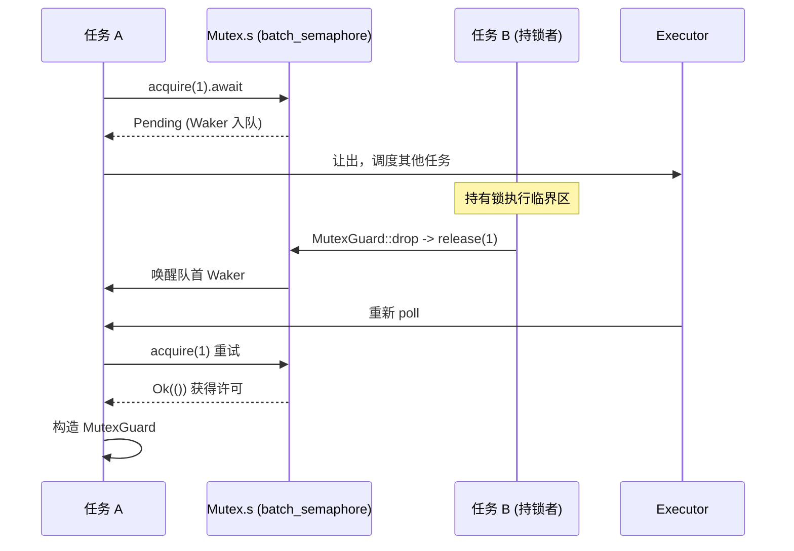

# Jusqu'ici, nous avons vu clairement comment le temps est abstrait comme un événement I/O, permettant aux timers et à la disponibilité des fd de partager la même entrée d'attente park/unpark. Cependant, lorsque plusieurs tâches se disputent le même verrou ou transmettent des messages via des canaux, l'objet d'attente n'est plus un fd ou une horloge, mais le changement d'état d'une autre tâche. Ce chapitre entre dans la famille tokio::sync, pour découvrir où un lock().await ou recv().await stocke réellement le Waker lors du blocage, et comment il est re-schedulé lors du réveil.

de

# lorsque le verrou est occupé

## bloque le thread courant

`std::sync::Mutex`— le thread est suspendu par le système d'exploitation jusqu'à la libération du verrou. C'est catastrophique dans un runtime asynchrone : un thread worker peut conduire simultanément des centaines voire des milliers de tâches, s'il bloque en attendant un verrou, toutes les autres tâches qu'il porte s'arrêtent. L'exigence fondamentale du Mutex asynchrone est : lors de l'attente du verrou,`lock()`céder le thread**, enregistrer le fait « j'attends ce verrou » dans une file, puis retourner**, laissant l'exécuteur aller exécuter d'autres tâches.**Le**de Tokio n'implémente pas sa propre file d'attente, mais`Pending`，让执行器去跑别的任务。

Tokio 的 `Mutex` 没有自己实现等待队列，而是**Entièrement construit sur des sémaphores**。

## Structures de données et disposition mémoire

`Mutex<T>`Les champs de sont minimalistes :

[FACT:tokio/src/sync/mutex.rs:133-138]

```rust
pub struct Mutex {
    #[cfg(all(tokio_unstable, feature = "tracing"))]
    resource_span: tracing::Span,
    s: semaphore::Semaphore,
    c: UnsafeCell,
}
```

Les trois champs ont chacun leur rôle :`s`est un**sémaphore avec un nombre de permis de 1**，`c`est`UnsafeCell<T>`les données protégées enveloppées par . Notez ici que`semaphore`est`batch_semaphore`un alias de[FACT:tokio/src/sync/mutex.rs:3-3], c'est-à-dire l'implémentation sous-jacente, et non`sync::Semaphore`la couche d'encapsulation publique.

`MutexGuard<'a, T>`ne détient qu'une référence vers`Mutex`:

[FACT:tokio/src/sync/mutex.rs:151-157]

```rust
pub struct MutexGuard {
    #[cfg(all(tokio_unstable, feature = "tracing"))]
    resource_span: tracing::Span,
    lock: &'a Mutex,
}
```

Il y a ici une conception clé :`MutexGuard` **ne détient pas l'objet permis du sémaphore**, mais seulement`&Mutex`. L'action de libérer le verrou se produit dans`Drop`, en appelant directement`self.lock.s.release(1)` [FACT:tokio/src/sync/mutex.rs:959-961]. Cela diffère de`SemaphorePermit`qui détient`permits: usize`un compteur et le restitue lors du Drop — le nombre de permis du Mutex est constamment 1, aucun comptage n'est nécessaire.

`Send`/`Sync`Les limites de méritent un examen séparé :

[FACT:tokio/src/sync/mutex.rs:258-259]

```rust
unsafe impl Send for Mutex where T: ?Sized + Send {}
unsafe impl Sync for Mutex where T: ?Sized + Send {}
```

`Sync`n'exige que`T: Send`et non`T: Sync`— c'est raisonnable, car l'accès mutuellement exclusif garantit qu'un seul thread à la fois peut toucher`T`, transférer la propriété de`T`entre threads (`Send`) suffit, il n'est pas nécessaire que`T`lui-même soit partageable (`Sync`). C'est précisément ce qui permet à`Mutex<T>`de transformer un`Sync`non`T`en`Sync`.

## Step-by-Step : le parcours complet d'un`lock().await`Mise en situation : la tâche A appelle

, le verrou est alors libre.`mutex.lock().await`Première étape,

construit un bloc async, à l'intérieur d'abord`lock()`, puis en cas de succès construit`self.acquire().await`Deuxième étape,`MutexGuard` [FACT:tokio/src/sync/mutex.rs:434-443]。

délègue directement au sémaphore :`acquire()`Copie

[FACT:tokio/src/sync/mutex.rs:655-663]

```rust
async fn acquire(&self) {
    crate::trace::async_trace_leaf().await;
    self.s.acquire(1).await.unwrap_or_else(|_| {
        unreachable!()
    });
}
```

`unwrap_or_else(|_| unreachable!())`ne retournera jamais`acquire`. Cela élimine au niveau du type le chemin d'erreur « fermeture du sémaphore ».`Err`Troisième étape, si le verrou est occupé,

retourne`s.acquire(1)`, le Waker de la tâche courante est enregistré dans la file d'attente du sémaphore.`Pending`Où est stocké le Waker ?**La réponse se trouve dans**la file d'attente de (le fichier source n'est pas développé dans le matériel de ce chapitre, mais son rôle est : chaque attendeur détient un Waker, en file FIFO).`batch_semaphore`Quatrième étape, lorsque la tâche B qui détient le verrou le libère,

appelle`MutexGuard::drop`, le sémaphore remet le permis au premier de la file et réveille son Waker, la tâche A est replanifiée,`s.release(1)` [FACT:tokio/src/sync/mutex.rs:965-975]retourne`acquire`, construisant`Ok`L'ensemble du processus peut être décrit par le diagramme de séquence suivant :`MutexGuard`。

Copie



## La documentation déclare explicitement que le Mutex de Tokio garantit FIFO

. Cette équité provient de la sémantique de file d'attente du sémaphore sous-jacent. Le coût de l'équité est : une[FACT:tokio/src/sync/mutex.rs:20-22]annulée (par exemple en perdant dans`lock`) vous fera`select!`perdre votre position dans la file**. Ce n'est pas un bug, mais une conséquence inévitable de la file FIFO — l'annulation signifie un retrait de la file, et un nouveau** [FACT:tokio/src/sync/mutex.rs:415-419]nécessite de refaire la queue.`lock`Une autre conception contre-intuitive est que

n'empoisonne pas**est marqué comme poisoned lorsqu'un thread détenant le verrou panique, les**（no poisoning）。`std::sync::Mutex`suivants retournent`lock`. Le Mutex de Tokio ne fait pas cela : lorsque le détenteur panique, le verrou est libéré normalement`Err`. La documentation avertit que si le panic est capturé, les données protégées peuvent se trouver dans un état incohérent. C'est un compromis pragmatique dans un contexte asynchrone — un panic dans une tâche asynchrone signifie généralement la terminaison de la tâche, et le mécanisme d'empoisonnement ne ferait qu'ajouter de la complexité.[FACT:tokio/src/sync/mutex.rs:122-125]La série de méthodes mérite une mention. Elle permet de dégrader l'ensemble

`MutexGuard::map`en un`MutexGuard<T>`ne protégeant qu'un sous-champ. En implémentation, elle calcule d'abord le pointeur du sous-champ via une closure`MappedMutexGuard<U>`, puis décompose le guard original en un`data`qui ne déclenche pas Drop via`skip_drop`, et enfin construit un nouveau guard`MutexGuardInner`utilise[FACT:tokio/src/sync/mutex.rs:869-883]。`skip_drop`pour transférer la propriété du champ, évitant que`ManuallyDrop` + `ptr::read`soit appelé deux fois`Drop`. C'est une technique classique en Rust pour « transférer la propriété sans déclencher le destructeur ».[FACT:tokio/src/sync/mutex.rs:827-836]Semaphore : comment le comptage de permis et la file d'attente implémentent la contre-pression

# Modèle intuitif : les places de parking

## Le sémaphore est comme un parking :

c'est entrer en voiture, s'il y a une place on entre, sinon on fait la queue à l'entrée ;`acquire`c'est sortir en voiture, libérer une place notifie la première voiture de la file d'entrer. Le nombre de permis est le nombre total de places,`release`c'est un grand véhicule occupant n places.`acquire_many(n)`Structures de données et disposition mémoire

## Le public

n'est qu'une fine encapsulation du`Semaphore`sous-jacent :`batch_semaphore::Semaphore`Copie

[FACT:tokio/src/sync/semaphore.rs:427-432]

```rust
pub struct Semaphore {
    ll_sem: ll::Semaphore,
    #[cfg(all(tokio_unstable, feature = "tracing"))]
    resource_span: tracing::Span,
}
```

`SemaphorePermit<'a>`Copie

[FACT:tokio/src/sync/semaphore.rs:442-445]

```rust
pub struct SemaphorePermit {
    sem: &'a Semaphore,
    permits: usize,
}
```

`permits`.`forget`/`merge`/`split`met`forget`à zéro`permits`, ainsi lors du Drop 0 permis est restitué — équivalent à « consommer définitivement » ces permis.[FACT:tokio/src/sync/semaphore.rs:1193-1195]découpe n permis du compteur actuel pour le nouveau permit`split`fusionne le compteur d'un autre permit, et affirme que les deux proviennent du même sémaphore[FACT:tokio/src/sync/semaphore.rs:1260-1271]。`merge`〔Inférence de conception et compromis architecturaux〕[FACT:tokio/src/sync/semaphore.rs:1230-1240]。

> **[Design Inference & Architectural Trade-offs]**
> `MAX_PERMITS`. Pourquoi un décalage à droite de 3 bits ? Le`usize::MAX >> 3` [FACT:tokio/src/sync/semaphore.rs:476-479]sous-jacent doit encoder des drapeaux d'état (comme le drapeau de fermeture) dans les bits de poids fort, donc le nombre de permis disponibles est limité aux bits de poids faible, laissant les bits de poids fort pour les drapeaux. C'est une technique courante pour compresser « compteur + état » dans un seul`batch_semaphore`.`usize`Step-by-Step : le flux de permis entre acquire et release

## Scénario : le sémaphore a initialement 2 permis, la tâche A

, la tâche B`acquire()`délègue à`acquire_many(2)`。

`acquire()`, puis en cas de succès construit`ll_sem.acquire(1)`similaire, mais passe 2`SemaphorePermit { permits: 1 }` [FACT:tokio/src/sync/semaphore.rs:614-631]。`acquire_many(2)`Si les permis sont insuffisants,[FACT:tokio/src/sync/semaphore.rs:661-679]。

retourne`ll_sem.acquire(n)`, le Waker est mis en file. Il y a ici un détail d'équité : la documentation indique que si la tête de file est un`Pending`et qu'il ne reste que 3 permis, même si un`acquire_many(5)`suivant pourrait être immédiatement satisfait, il doit attendre — car le grand véhicule en tête occupe la file`acquire(1)`. C'est le coût du FIFO strict, qui évite la famine.[FACT:tokio/src/sync/semaphore.rs:19-24]Le chemin de libération est dans le Drop :

Copie

[FACT:tokio/src/sync/semaphore.rs:1402-1404]

```rust
impl Drop for SemaphorePermit {
    fn drop(&mut self) {
        self.sem.add_permits(self.permits);
    }
}
```

`add_permits`, la couche sous-jacente restitue le permis à la file d'attente et réveille les attendeurs pouvant réunir suffisamment de permis.`ll_sem.release(n)` [FACT:tokio/src/sync/semaphore.rs:568-570]Concernant l'ordre mémoire, la documentation donne une garantie forte : acquire, release, close sont tous des

opérations, totalement ordonnées entre elles, équivalentes à celles sur une seule variable atomique`AcqRel` 操作，彼此全序，等价于单个原子变量上的 `AcqRel` [FACT:tokio/src/sync/semaphore.rs:35-42]Cela signifie que l'écriture « écrire d'abord les données, puis release le permis » est visible pour la tâche qui « acquire le permis ensuite » — le sémaphore peut transmettre des données entre tâches en toute sécurité.

## Réflexion de conception : close et backpressure

`close()`fait en sorte que tous les waiters reçoivent`AcquireError`, et ensuite`try_acquire`retourne`Closed` [FACT:tokio/src/sync/semaphore.rs:1161-1163]. C'est la base d'une fermeture élégante : lorsque le récepteur n'a plus besoin de données, le sémaphore close permet à tous les senders bloqués d'échouer et de retourner immédiatement, au lieu d'attendre indéfiniment.

L'essence du backpressure est la plus claire dans mpsc. La section suivante montrera que le contrôle de capacité de mpsc est implémenté avec un sémaphore dont le nombre de permis est égal à la taille du buffer.

# La famille des canaux : différents compromis entre file de waiters et réveil par Waker

## Modèle intuitif : quatre types de canaux, quatre stratégies d'attente

`oneshot`est une « enveloppe à usage unique » — on ne peut envoyer qu'une seule lettre, le sender n'attend pas (`send`est synchrone), le récepteur`await`attend la lettre.`mpsc`est un « tapis roulant borné » — le sender attend lorsque le tapis est plein, le récepteur attend lorsqu'il est vide, la capacité est contrôlée par un sémaphore.`broadcast`et`watch`sont un « haut-parleur de diffusion » — un sender, plusieurs récepteurs, mais leur traitement du « retard » est radicalement différent.

Le matériel source de cette section se concentre sur`oneshot`et`mpsc::bounded`, que nous allons décomposer un par un.

## oneshot : une poignée de main minimaliste encodée par des bits d'état

`oneshot`La structure`Inner`de est au cœur de la compréhension de sa conception :

[FACT:tokio/src/sync/oneshot.rs:386-409]

```rust
struct Inner {
    state: AtomicUsize,
    value: UnsafeCell>,
    tx_task: Task,
    rx_task: Task,
}
```

`state`est un`AtomicUsize`, qui encode tout l'état du canal avec des bits de drapeau. Les quatre bits de drapeau sont définis à la fin du fichier :

[FACT:tokio/src/sync/oneshot.rs:1488-1505]

```rust
const RX_TASK_SET: usize = 0b00001;
const VALUE_SENT: usize = 0b00010;
const CLOSED: usize = 0b00100;
const TX_TASK_SET: usize = 0b01000;
```

`value`est`UnsafeCell<Option<T>>`，`tx_task`et`rx_task`sont de type`Task`, à l'intérieur se trouve`UnsafeCell<MaybeUninit<Waker>>` [FACT:tokio/src/sync/oneshot.rs:411-411]. Noter`MaybeUninit`— le Waker peut être non initialisé, sa validité est déterminée par le bit`state`dans`RX_TASK_SET`/`TX_TASK_SET`[FACT:tokio/src/sync/oneshot.rs:396-399]。

**L'essence de cette conception**：`VALUE_SENT`Le bit indique non seulement « la valeur a été envoyée », mais détermine aussi à qui appartient l'accès à`UnsafeCell`. Le commentaire est très explicite[FACT:tokio/src/sync/oneshot.rs:1491-1496]: si`VALUE_SENT`est positionné,`UnsafeCell`ne peut être accédé que par le récepteur ; s'il n'est pas positionné, il ne peut être accédé que par le sender. Ainsi, un seul bit atomique permet un transfert de propriété sans verrou, évitant un verrou supplémentaire.

`send`Le flux de :

[FACT:tokio/src/sync/oneshot.rs:622-646]

```rust
pub fn send(mut self, t: T) -> Result {
    let inner = self.inner.take().unwrap();
    inner.value.with_mut(|ptr| unsafe {
        *ptr = Some(t);
    });
    if !inner.complete() {
        unsafe {
            return Err(inner.consume_value().unwrap());
        }
    }
    Ok(())
}
```

écrit d'abord la valeur dans`UnsafeCell`(à ce moment`VALUE_SENT`n'est pas positionné, le récepteur n'y accède pas), puis appelle`complete()`pour tenter de positionner`VALUE_SENT`。`complete()`est une boucle CAS :

[FACT:tokio/src/sync/oneshot.rs:1516-1549]

```rust
fn set_complete(cell: &AtomicUsize) -> State {
    let mut state = cell.load(Ordering::Relaxed);
    loop {
        if State(state).is_closed() {
            break;
        }
        match cell.compare_exchange_weak(
            state, state | VALUE_SENT, Ordering::AcqRel, Ordering::Acquire,
        ) {
            Ok(_) => break,
            Err(actual) => state = actual,
        }
    }
    State(state)
}
```

Pourquoi utiliser CAS plutôt qu'un simple`fetch_or`? Le commentaire l'explique clairement[FACT:tokio/src/sync/oneshot.rs:1517-1529]: si le canal est déjà`CLOSED`, il**ne faut pas**positionner`VALUE_SENT`à nouveau. Car une fois positionné, le récepteur pensera pouvoir accéder à`UnsafeCell`, alors que le sender s'apprête à reprendre la valeur (`consume_value`), et un accès simultané des deux côtés provoquerait une data race. Donc la boucle CAS, en découvrant`CLOSED`, fait un break anticipé sans positionner.

`complete()`Après le retour de , si le positionnement a réussi et que`RX_TASK_SET`est positionné, on réveille le récepteur :

[FACT:tokio/src/sync/oneshot.rs:1300-1315]

```rust
fn complete(&self) -> bool {
    let prev = State::set_complete(&self.state);
    if prev.is_closed() {
        return false;
    }
    if prev.is_rx_task_set() {
        unsafe {
            self.rx_task.with_task(Waker::wake_by_ref);
        }
    }
    true
}
```

Le`poll_recv`du récepteur est le cœur de la machine à états :

[FACT:tokio/src/sync/oneshot.rs:1317-1384]

Il charge d'abord l'état, si`is_complete()`alors directement`consume_value`retourne ; si`is_closed()`retourne`Err`; sinon entre dans la branche « enregistrer le Waker ». Lors de l'enregistrement, on vérifie d'abord`is_rx_task_set()`, si déjà défini et que`will_wake`juge qu'il s'agit du même Waker, on ne le redéfinit pas ; si différent, on unset puis set. Il y a ici une gestion subtile de race : après unset, si l'on découvre que`is_complete()`est devenu vrai, il faut**re-set le bit de drapeau** [FACT:tokio/src/sync/oneshot.rs:1342-1344], sinon le Waker fuira lors du Drop (car le Drop dépend du bit de drapeau pour décider s'il faut drop le Waker).

Ce modèle « unset puis re-set » apparaît aussi dans`poll_closed`[FACT:tokio/src/sync/oneshot.rs:839-848], c'est la technique standard de oneshot pour gérer les réveils concurrents.

## mpsc::bounded : backpressure piloté par sémaphore

Le contrôle de capacité de mpsc est entièrement confié au sémaphore.`channel`La fonction crée un sémaphore dont le nombre de permis est égal à la taille du buffer :

[FACT:tokio/src/sync/mpsc/bounded.rs:159-171]

```rust
pub fn channel(buffer: usize) -> (Sender, Receiver) {
    assert!(buffer > 0, "mpsc bounded channel requires buffer > 0");
    let semaphore = Semaphore {
        semaphore: semaphore::Semaphore::new(buffer),
        bound: buffer,
    };
    let (tx, rx) = chan::channel(semaphore);
    let tx = Sender::new(tx);
    let rx = Receiver::new(rx);
    (tx, rx)
}
```

`Semaphore`est un wrapper interne à mpsc, qui détient à la fois le sémaphore sous-jacent et`bound`(capacité maximale)[FACT:tokio/src/sync/mpsc/bounded.rs:176-179]。`bound`est utilisé pour la requête`max_capacity`, tandis que`available_permits`donne la capacité actuelle[FACT:tokio/src/sync/mpsc/bounded.rs:591-593]。

Le chemin d'envoi`send`fait d'abord`reserve`puis`send`：

[FACT:tokio/src/sync/mpsc/bounded.rs:816-824]

```rust
pub async fn send(&self, value: T) -> Result> {
    match self.reserve().await {
        Ok(permit) => {
            permit.send(value);
            Ok(())
        }
        Err(_) => Err(SendError(value)),
    }
}
```

`reserve`appelle en interne`reserve_inner(1)`, qui vérifie d'abord`n > max_capacity`retourne directement une erreur, puis`acquire(n)` [FACT:tokio/src/sync/mpsc/bounded.rs:1272-1311]. Il y a ici un ingénieux`WakeReceiverOnDrop`guard :

[FACT:tokio/src/sync/mpsc/bounded.rs:1286-1301]

```rust
struct WakeReceiverOnDrop {
    chan: &'a chan::Tx,
}
impl Drop for WakeReceiverOnDrop {
    fn drop(&mut self) {
        use chan::Semaphore;
        let semaphore = self.chan.semaphore();
        if semaphore.is_closed() && semaphore.is_idle() {
            self.chan.wake_rx();
        }
    }
}
```

Le commentaire explique la motivation[FACT:tokio/src/sync/mpsc/bounded.rs:1279-1285]: si`reserve`est annulé après avoir obtenu une partie des permis (par exemple`select!`échoue), le`Acquire`sous-jacent restituera ces permis lors du Drop, mais**ne**notifiera pas le récepteur comme le ferait`Permit`. Si à ce moment le canal est fermé et inactif, le récepteur pourrait ne jamais recevoir la notification « canal fermé ». Ce guard ajoute ce réveil lors du Drop. En cas de succès, on utilise`mem::forget(guard)`pour annuler le guard[FACT:tokio/src/sync/mpsc/bounded.rs:1306-1306], car le chemin de succès voit la responsabilité de notification reprise par`Permit`.

`Permit`Le Drop de fait la même chose :

[FACT:tokio/src/sync/mpsc/bounded.rs:1732-1745]

```rust
impl Drop for Permit {
    fn drop(&mut self) {
        use chan::Semaphore;
        let semaphore = self.chan.semaphore();
        semaphore.add_permit();
        if semaphore.is_closed() && semaphore.is_idle() {
            self.chan.wake_rx();
        }
    }
}
```

`Permit::send`utilise`mem::forget`pour sauter le Drop, évitant de restituer les permis[FACT:tokio/src/sync/mpsc/bounded.rs:1721-1728]。

Le chemin de réception`recv`utilise`poll_fn`pour envelopper`chan.recv(cx)` [FACT:tokio/src/sync/mpsc/bounded.rs:243-246]。`poll_recv`délègue directement à[FACT:tokio/src/sync/mpsc/bounded.rs:650-652]. La vraie logique de file d'attente se trouve dans le module`chan`(non développé dans ce chapitre), mais on peut déduire : le Waker du récepteur est stocké dans`chan::Rx`, et est réveillé lorsque le sender fait`send`.

`try_send`montre le chemin non bloquant :

[FACT:tokio/src/sync/mpsc/bounded.rs:924-934]

```rust
pub fn try_send(&self, message: T) -> Result> {
    match self.chan.semaphore().semaphore.try_acquire(1) {
        Ok(()) => {}
        Err(TryAcquireError::Closed) => return Err(TrySendError::Closed(message)),
        Err(TryAcquireError::NoPermits) => return Err(TrySendError::Full(message)),
    }
    self.chan.send(message);
    Ok(())
}
```

`try_acquire`Les deux types d'erreur de se mappent précisément à`Closed`et`Full`, distinguant les deux échecs « canal fermé » et « buffer plein ».

## Réflexion de conception : cancel safety et perte de messages

La documentation de mpsc insiste à plusieurs reprises sur la cancel safety[FACT:tokio/src/sync/mpsc/bounded.rs:776-784]：`send`en cas d'échec dans`select!`,**le message sera perdu**. Pour éviter la perte, il faut utiliser`reserve`pour obtenir`Permit`puis`send`— car`Permit`a déjà réservé la capacité,`send`est synchrone et ne peut pas être interrompu.

`recv`est en revanche cancel safe[FACT:tokio/src/sync/mpsc/bounded.rs:199-204]: si`recv`échoue dans`select!`, il est garanti qu'aucun message n'a été consommé. C'est parce que le`recv`de`poll_recv`ne retourne`Ready`，`Pending`que lorsqu'un message est réellement obtenu, et ne touche pas à la file dans le cas contraire.

`oneshot`Le`Receiver`de en tant que Future est aussi cancel safe[FACT:tokio/src/sync/oneshot.rs:246-251]. Mais attention :`oneshot`le`send`de est synchrone, donc il n'y a pas de problème de « send annulé » — soit il est envoyé, soit`Err`retourne la valeur d'origine.

# Réflexions de conception et pièges en production

**Piège 1 : utiliser un Mutex asynchrone pour protéger des données pures.**La documentation recommande explicitement[FACT:tokio/src/sync/mutex.rs:26-36]: si ce qui est protégé est constitué de données pures (sans`.await`besoin), utiliser`std::sync::Mutex`ou`parking_lot`est plus rapide. Le coût d'un Mutex asynchrone réside dans les opérations atomiques du sémaphore et l'éventuelle planification de tâches. Ce n'est que lorsqu'il faut maintenir le verrou pendant`.await`(par exemple, maintenir le verrou pour accéder à une connexion de base de données) qu'il faut utiliser un Mutex asynchrone.

**Piège 2 : maintenir le verrou à travers`.await`provoque un interblocage.**C'est le piège le plus dangereux du Mutex asynchrone. Si la tâche A, après avoir pris le verrou,`.await`attend un événement qui nécessite l'achèvement de la tâche B, et que la tâche B attend à son tour ce verrou, il y a interblocage.`std::sync::Mutex`Le guard de`Send`n'est pas`.await`(dans une tâche déplaçable), le compilateur empêche de maintenir le verrou à travers`Send` [FACT:tokio/src/sync/mutex.rs:314-314]; mais le guard d'un Mutex asynchrone est

**, le compilateur ne vous en empêche pas, il faut garantir soi-même l'absence d'attente circulaire.`reserve`Piège 3 :`send`。** `Permit`oublier après[FACT:tokio/src/sync/mpsc/bounded.rs:1732-1745]Le Drop de

**rend le permis`oneshot`, donc il n'y a pas de fuite de capacité. Mais si le canal est déjà fermé et inactif, le Drop réveille le récepteur — ce réveil est nécessaire, sinon le récepteur pourrait ne jamais recevoir la notification de fermeture.`poll`Piège 4 :`Pending`。**Le[FACT:tokio/src/sync/oneshot.rs:236-242]de`poll`peut être faussement`Pending`La documentation précise

**: même si le message a été envoyé,`forget_permits`peut retourner** `forget_permits(n)`. Ce n'est pas un bug, mais un phénomène normal dans une situation de concurrence — l'appelant sera réveillé pour réessayer, le message n'est pas perdu, juste retardé.[FACT:tokio/src/sync/semaphore.rs:576-578]Piège 5 :

# la sémantique de

.`tokio::sync`Tente de réduire n permis, retourne le nombre réellement réduit**. Il ne bloque pas et ne réveille pas les attendeurs — il « avale » simplement les permis. Utilisé pour réduire dynamiquement la capacité du sémaphore.**。

- `Mutex`Résumé de ce chapitre`MutexGuard`Ce chapitre révèle`release(1)`le modèle central de
- `Semaphore`:`SemaphorePermit`Toutes les primitives d'attente asynchrone sont construites sur « file d'attente d'attendeurs + réveil par Waker », et l'implémentation concrète de la file varie selon le scénario`permits`réutilise un sémaphore avec un nombre de permis de 1,`forget`/`merge`/`split`，`MAX_PERMITS`ne détient qu'une référence, au Drop
- `oneshot`, FIFO équitable mais sans empoisonnement.`AtomicUsize`est un compteur de permis + file d'attente d'attente,`VALUE_SENT`utilise`UnsafeCell`un compteur pour prendre en charge`CLOSED`un décalage à droite de 3 bits pour laisser place aux indicateurs d'état.
- `mpsc::bounded`utilise un seul`WakeReceiverOnDrop`indicateur de bits pour encoder l'état,

# les bits déterminent simultanément

l'attribution du droit d'accès, la boucle CAS empêche de positionner après`set_complete`.`fetch_or(VALUE_SENT)`utilise un sémaphore dont le nombre de permis est égal au buffer pour implémenter la contre-pression,

**le garde gère la compensation de réveil lors d'une annulation.**：`set_complete`Réflexions et auto-évaluation de ce chapitre`fetch_or`Q : Si l'on remplace[FACT:tokio/src/sync/oneshot.rs:1517-1529]la boucle CAS de`VALUE_SENT`par un simple`CLOSED`, dans quel scénario de concurrence cela déclencherait-il une course de données ?`fetch_or`Analyse de référence`close()`La raison d'utiliser une boucle CAS plutôt que`CLOSED` [FACT:tokio/src/sync/oneshot.rs:1569-1574]est indiquée dans les commentaires`send`: il faut vérifier`fetch_or(VALUE_SENT)`avant de positionner`VALUE_SENT`. Si l'on remplace par un`CLOSED`inconditionnel, considérons cette séquence : le récepteur appelle d'abord`poll_recv`positionne`is_complete()`, l'émetteur ensuite`consume_value`écrit la valeur et[FACT:tokio/src/sync/oneshot.rs:1325-1330]. À ce moment`complete()`et`prev.is_closed()`sont positionnés simultanément, le`consume_value`du récepteur voit[FACT:tokio/src/sync/oneshot.rs:1300-1315]comme vrai, appelle`UnsafeCell`pour retirer la valeur`CLOSED`; et le`VALUE_SENT`de l'émetteur, après retour, parce que

Q: `reserve_inner`est vrai, appelle`WakeReceiverOnDrop`pour récupérer la valeur`mem::forget`. Les deux côtés accèdent simultanément à`forget`, course de données. La boucle CAS, en découvrant

**, fait un break anticipé, ne positionne pas**, garantissant ainsi l'invariant « après fermeture, l'émetteur a le droit d'accès exclusif ».[FACT:tokio/src/sync/mpsc/bounded.rs:1290-1298]Le`acquire(n)`garde dans`Ok`utilise`Permit`pour sauter sur le chemin de succès ; que se passerait-il si l'on retirait ce`Permit`?`reserve_inner`Analyse de référence`is_idle`: la logique Drop du garde est « si le sémaphore est fermé et inactif, réveiller le récepteur »`Permit`. Sur le chemin de succès,`mem::forget`retourne`forget`, l'appelant obtient le permis et construira`acquire`, c'est`Ok`qui est responsable des notifications ultérieures. Si l'on ne retire pas le garde, le garde au retour de la fonction fait un Drop, vérifie une fois de plus « fermé et inactif » — mais à ce moment le permis est déjà détenu par l'appelant de`Permit`, le sémaphore n'est pas inactif (

est faux), donc en pratique il n'y aura pas de réveil en double. Mais plus important encore est la clarté sémantique : la responsabilité de réveil sur le chemin de succès doit incomber entièrement à`MutexGuard`, le garde ne s'occupe que de la compensation sur le chemin « annulation/échec ».`SemaphorePermit`exprime clairement l'intention « ce chemin n'a pas besoin de garde ». Si l'on retire

**et que le sémaphore se trouve justement dans l'état limite « fermé et inactif » (par exemple**retourne`MutexGuard`mais le permis n'a pas encore été pris en charge par`&Mutex`), cela peut produire un réveil superflu — bien que cela ne cause pas d'erreur, cela gaspille une planification.`self.lock.s.release(1)` [FACT:tokio/src/sync/mutex.rs:959-961]Q : Si l'on changeait`MutexGuard::map`pour détenir un objet permis de sémaphore (comme`MappedMutexGuard`), quels problèmes cela introduirait-il ?[FACT:tokio/src/sync/mutex.rs:869-883]Analyse de référence`MappedMutexGuard`: actuellement`&Semaphore`ne détient que[FACT:tokio/src/sync/mutex.rs:190-199], au Drop appelle`self.s.release(1)` [FACT:tokio/src/sync/mutex.rs:1252-1262]. Si l'on changeait pour détenir un objet permis, cela introduirait plusieurs problèmes. Premièrement,`MappedMutexGuard`la série de méthodes`permits: usize`doit décomposer le guard en`MutexGuard`, ne protégeant que le sous-champ`Send`/`Sync`. Dans la conception actuelle,`unsafe impl`n'a qu'à détenir[FACT:tokio/src/sync/mutex.rs:260-263]et le pointeur de sous-champ`map`。

, au Drop`tokio::sync`. Si le guard détenait un objet permis, le map devrait transférer la propriété de l'objet permis, et`spawn_blocking`la disposition des champs de`block_on`serait plus complexe. Deuxièmement, l'objet permis porte généralement un compteur

L'emplacement de stockage du Waker varie selon la primitive : Mutex/Semaphore le stockent dans la file d'attente du sémaphore sous-jacent, oneshot dans les champs tx_task/rx_task de Inner, mpsc dans les files d'envoi/réception du module chan. Mais le mécanisme de réveil est unifié : lors d'un changement d'état, le Waker est extrait et wake_by_ref est appelé, l'exécuteur replanifie la tâche. À ce stade, l'attente et le réveil au sein des primitives asynchrones sont clairement visibles. Cependant, tout le code ne peut pas être rendu asynchrone — le chapitre suivant examinera comment utiliser spawn_blocking pour pontifier les opérations bloquantes, et comment block_on pilote un Future dans un contexte non asynchrone.
