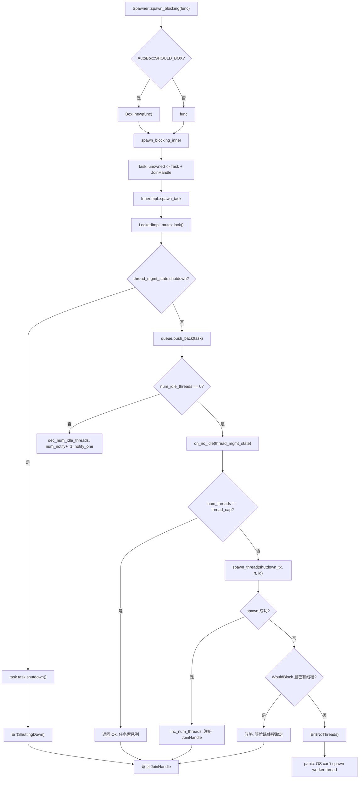
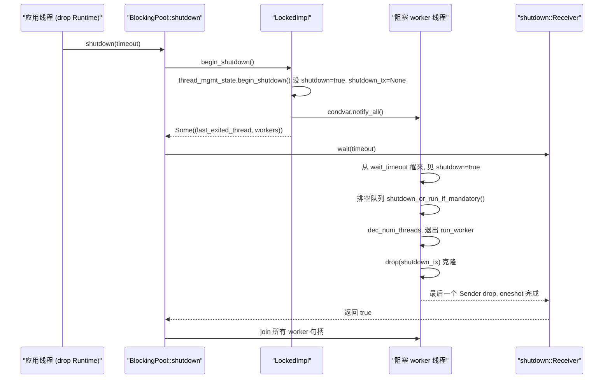

# Chapitre 8 : Blocage et pontification : le pool de threads spawn_blocking et les frontières de block_on

Nous avons vu dans le chapitre précédent que la raison pour laquelle le Mutex asynchrone et les canaux peuvent attendre sans occuper un thread réside dans le stockage du Waker dans la file d'attente, puis la replanification de la tâche par le réveilleur une fois la condition satisfaite. Mais tout cela présuppose que la tâche peut céder activement le thread en état Pending. Dès que le code appelle std::fs::read, libsqlite3 ou une boucle de compression purement CPU, il monopolise le thread worker jusqu'à son retour, affamant toutes les autres tâches sur ce thread. La solution de Tokio consiste à externaliser ce type de travail vers un pool de threads bloquants dédié, et à utiliser block_on pour piloter un Future dans un contexte non asynchrone. Ce chapitre décompose ces deux frontières.

# 8.1 Disposition mémoire du pool de threads bloquants : Inner et la file à double implémentation

**Modèle intuitif**：`spawn_blocking`Le pool de threads ressemble à un « pool d'aides externalisées » d'un restaurant. Les serveurs (threads worker) ne s'occupent que de la prise de commande et du service, et lorsqu'ils rencontrent un plat nécessitant une cuisson lente, ils écrivent un bon de travail et le déposent dans la fenêtre de transfert de la cuisine (file d'attente), les aides (threads bloquants) récupérant les bons depuis cette fenêtre. Sans ce pool, le serveur devrait cuisiner lui-même, et tout le restaurant s'arrêterait.

**Structure centrale**. L'ensemble du pool est détenu par`BlockingPool`qui ne stocke que deux choses : un`Spawner`clonable (point d'entrée de soumission) et un`shutdown_rx`(récepteur du signal de fermeture)[FACT:tokio/src/runtime/blocking/pool.rs:20-23]。`Spawner`contient en interne`Arc<Inner>`, tous les soumetteurs partagent le même état[FACT:tokio/src/runtime/blocking/pool.rs:26-28]。

`Inner`est l'état complet du pool, les champs méritent d'être examinés un par un[FACT:tokio/src/runtime/blocking/pool.rs:77-104]：

- `inner_impl: InnerImpl`: implémentation de file + notification + topologie de verrou, c'est une énumération avec`Locked`et`Sharded`deux variantes[FACT:tokio/src/runtime/blocking/pool.rs:107-110]. C'est l'abstraction la plus cruciale de ce chapitre — elle unifie deux topologies, « file à verrou unique » et « file fragmentée », sous une même interface.
- `thread_cap: usize`: nombre maximal de threads, soit`max_blocking_threads`。
- `scheduler_threads: usize`: nombre de threads worker du planificateur, utilisé pour déduire dans les métriques, afin que`num_blocking_threads`ne compte que les threads bloquants[FACT:tokio/src/runtime/blocking/pool.rs:455-460]。
- `keep_alive: Duration`: durée de survie des threads inactifs, par défaut`KEEP_ALIVE = 10s` [FACT:tokio/src/runtime/blocking/pool.rs:231]。
- `metrics: SpawnerMetrics`: trois compteurs atomiques —`num_threads`、`num_idle_threads`、`queue_depth` [FACT:tokio/src/runtime/blocking/pool.rs:31-35]。

> **[Design Inference & Architectural Trade-offs]**
> **Pourquoi utiliser des compteurs atomiques plutôt que des champs sous verrou ?** `num_idle_threads`est lu sur le chemin critique de`spawn_task`(pour déterminer s'il faut réveiller un thread inactif) ; s'il était caché dans`Mutex`, chaque soumission devrait d'abord acquérir le verrou puis lire. En le rendant`MetricAtomicUsize`, le chemin de soumission peut effectuer un jugement rapide sans détenir le verrou de la file. Le coût est qu'il n'y a aucune garantie d'atomicité entre ces compteurs et l'état de la file, c'est pourquoi le code utilise le compteur`num_notify`pour compenser — voir ci-dessous.

**État de gestion des threads**。`ThreadManagementState`est extrait séparément pour être réutilisé par les deux implémentations de file[FACT:tokio/src/runtime/blocking/pool.rs:135-150]：

- `shutdown: bool`: indicateur de fermeture.
- `shutdown_tx: Option<shutdown::Sender>`: chaque thread worker en détient un clone, une fois tous dropés`shutdown_rx`reçoit la notification.
- `last_exiting_thread: Option<JoinHandle<()>>`: handle du dernier thread ayant expiré par timeout.
- `worker_threads: HashMap<usize, JoinHandle<()>>`: handles de tous les workers vivants.
- `worker_thread_index: usize`: allocateur d'ID de thread à incrémentation monotone.

`last_exiting_thread`La motivation de conception de[FACT:tokio/src/runtime/blocking/pool.rs:135-150]。`worker_timed_out`est clairement écrite dans les commentaires : un thread expiré par timeout joindra le précédent thread expiré par timeout, évitant les faux positifs de Valgrind`last_exiting_thread`est précisément l'implémentation de ce join en chaîne — il retire son propre handle, échange l'ancien[FACT:tokio/src/runtime/blocking/pool.rs:172-178]。

**et le retourne à l'appelant pour le join**Encapsulation de tâche`Task`. La file stocke des`UnownedTask<BlockingSchedule>`, qui encapsule un`Mandatory`et un[FACT:tokio/src/runtime/blocking/pool.rs:187-191]。`Mandatory`indicateur`shutdown_or_run_if_mandatory`détermine si, lors de la fermeture, cette tâche est abandonnée ou exécutée de force :`NonMandatory`appelle`shutdown()`lors de`Mandatory`, et appelle`run()` [FACT:tokio/src/runtime/blocking/pool.rs:223-228]lors de`spawn_blocking`. C'est la différence entre`spawn_mandatory_blocking`(non forcé) et[FACT:tokio/src/runtime/blocking/pool.rs:233-265]。

**(forcé, utilisé par fs)**。`LockedImpl`Disposition mémoire de l'implémentation à verrou unique`Mutex<LockedInner>`est la topologie la plus primitive : un`Condvar` [FACT:tokio/src/runtime/blocking/pool.rs:113-116]。`LockedInner`plus un`VecDeque<Task>`、`num_notify: u32`contient`thread_mgmt_state` [FACT:tokio/src/runtime/blocking/pool.rs:118-124]et`num_notify`. Notez que`thread_mgmt_state`et`num_idle_threads`sont sous le même verrou, tandis que

# est une quantité atomique hors verrou — cette disposition hybride « une partie de l'état sous verrou, une partie hors verrou » est précisément la source de toutes les subtilités de concurrence qui suivent.

**8.2 Chemin de soumission : de spawn_blocking au réveil de thread**Scénario`tokio::task::spawn_blocking(move || heavy_compute(data))`: un appel à

**dans une tâche asynchrone, que se passe-t-il à cet instant ?**。`Spawner::spawn_blocking`Première étape : décision de boxing et construction de la tâche`fn_size`mesure d'abord la taille de la closure`AutoBox::<F>::SHOULD_BOX`, puis selon`Box`décide s'il faut[FACT:tokio/src/runtime/blocking/pool.rs:359-389]la closure

. C'est la stratégie générique de Tokio de « boxing automatique des grands Future » : lorsque la closure est trop grande, on la boxe pour éviter le gonflement de la structure de tâche.`spawn_blocking_inner`En entrant dans`blocking_task`, on alloue d'abord un ID de tâche, puis on utilise`task::unowned`pour encapsuler la closure en un Future, et enfin on utilise`UnownedTask`pour construire`JoinHandle` [FACT:tokio/src/runtime/blocking/pool.rs:440-449]et`(JoinHandle<R>, Result<(), SpawnError>)`. Notez que ce qui est retourné ici est le tuple

**— le handle et le résultat de soumission sont retournés séparément.**Deuxième étape : trois traitements du résultat de soumission`spawn_blocking`. Retour à`spawn_result`, on effectue un match sur[FACT:tokio/src/runtime/blocking/pool.rs:381-388]：

- `Ok(())`: normal, retourne le handle.
- `Err(ShuttingDown)`：**ne pas paniquer**, et retourne quand même le handle. Le commentaire explique qu'il s'agit d'une considération de compatibilité — le handle ne sera jamais résolu, mais l'appelant ne plantera pas parce que le runtime est en cours d'arrêt.
- `Err(NoThreads(e))`: l'OS ne peut pas créer de thread et personne dans le pool ne prend le relais, donc panic direct.

**Troisième étape : mise en file et décision de réveil**。`spawn_task`on passe`on_no_idle`la closure à`InnerImpl::spawn_task`, et c'est l'implémentation concrète qui décide quand l'appeler[FACT:tokio/src/runtime/blocking/pool.rs:462-506]. Regardons`LockedImpl::spawn_task`la section critique de[FACT:tokio/src/runtime/blocking/pool.rs:603-639]：

```rust
let mut locked = self.mutex.lock();

if locked.thread_mgmt_state.shutdown {
    task.task.shutdown();
    return Err(SpawnError::ShuttingDown);
}

locked.queue.push_back(task);
metrics.inc_queue_depth();

if metrics.num_idle_threads() == 0 {
    on_no_idle(&mut locked.thread_mgmt_state)?;
} else {
    metrics.dec_num_idle_threads();
    locked.num_notify += 1;
    self.condvar.notify_one();
}
```

Il y a ici deux points clés. Premièrement, la vérification de fermeture a lieu avant la mise en file, et même si la tâche est`Mandatory`elle est directement`shutdown()`— le commentaire explique : elle n'a été planifiée qu'après le début de la fermeture, donc la rejeter est légitime[FACT:tokio/src/runtime/blocking/pool.rs:614-620]. Deuxièmement, la décision de réveil dépend de`num_idle_threads`hors du verrou : s'il vaut 0, on appelle`on_no_idle`pour tenter de lancer un nouveau thread ; sinon on décrémente le compteur d'inactifs, on incrémente`num_notify`、`notify_one`。

**`num_notify`Pourquoi doit-il exister ?**Parce que`Condvar`peut produire des réveils spurieux (spurious wakeup). Si on utilisait seulement`notify_one`sans compter, un thread réveillé spurieusement croirait à tort qu'il y a une tâche à prendre, découvrirait que la file est vide et se rendormirait, tandis que le thread réellement réveillé pourrait ne jamais recevoir la notification.`num_notify`On transforme le « réveil légitime » en jeton comptable : le côté émetteur`+1`, le côté réveillé ne considère le réveil comme légitime et`num_notify != 0`que lorsque`-1` [FACT:tokio/src/runtime/blocking/pool.rs:674-684]。

**Quatrième étape : lancer un nouveau thread**。`on_no_idle`la closure s'exécute en tenant le verrou de la file[FACT:tokio/src/runtime/blocking/pool.rs:462-506]. Elle vérifie d'abord`num_threads == thread_cap`, et si la limite est atteinte, retourne directement`Ok(())`— la tâche reste dans la file en attendant qu'un thread existant la traite, c'est la contre-pression. Sinon on clone`shutdown_tx`, on appelle`spawn_thread`pour créer le thread, et en cas de succès on incrémente`num_threads`, on incrémente`worker_thread_index`, on insère le handle dans`worker_threads`。

`spawn_thread`on utilise`thread::Builder`pour définir le nom du thread et la taille de pile, puis on spawn une closure : on entre dans le contexte du runtime`rt.enter()`, on appelle`inner.run(id)`, et enfin on drop`shutdown_tx` [FACT:tokio/src/runtime/blocking/pool.rs:508-528]。

**Tolérance aux échecs de création de thread OS**。`spawn_thread`peut échouer. Le code classe les erreurs[FACT:tokio/src/runtime/blocking/pool.rs:488-500]: si c'est`WouldBlock`(une erreur temporaire, déterminée par`is_temporary_os_thread_error`) et qu'il y a déjà un thread bloqué dans le pool, alors[FACT:tokio/src/runtime/blocking/pool.rs:750-752]on ignore silencieusement**— la tâche finira par être prise par un thread actuellement occupé. Sinon on retourne**, ce qui finit par provoquer un panic.`SpawnError::NoThreads`Résumons les branches de décision du chemin de soumission avec un graphe de flux de contrôle :

Copier



# Modèle intuitif

**: chaque thread bloquant est un « aide en attente ». Quand il y a des ordres, il travaille en continu (BUSY), quand il n'y en a pas, il somnole (IDLE), et s'il somnole plus de**il quitte le service (sortie par timeout). Sans récupération par timeout, le pool conserverait indéfiniment tous les threads créés au pic, gaspillant mémoire et coût de调度 noyau.`keep_alive`Structure de la boucle principale

**est une boucle**。`LockedImpl::run_worker`, qui alterne en interne entre les deux phases BUSY et IDLE`'main`. Attention : ici BUSY/IDLE sont des[FACT:tokio/src/runtime/blocking/pool.rs:642-735]phases**dans la boucle, pas des états d'énumération explicites, donc on décrit ci-dessous avec un organigramme plutôt qu'un diagramme d'états.**Phase BUSY

**: la boucle interne**prend continuellement des tâches`while let Some(task) = locked.queue.pop_front()`. Après en avoir pris une, on décrémente[FACT:tokio/src/runtime/blocking/pool.rs:655-661]on drop le verrou`queue_depth`，**, on exécute**, puis on reprend le verrou. L'étape de drop du verrou est cruciale — une tâche bloquante peut durer longtemps, il ne faut jamais l'exécuter en tenant le verrou.`task.run()`Phase IDLE

**: la file est vide, on incrémente**, on définit`num_idle_threads`, puis on entre dans la boucle d'attente`is_counted_idle = true`. Le cœur est[FACT:tokio/src/runtime/blocking/pool.rs:663-696], et après le retour on vérifie trois choses :`condvar.wait_timeout(locked, keep_alive)`: réveil légitime. On décrémente

1. `num_notify != 0`, on définit`num_notify`(car le côté émetteur a déjà décrémenté`is_counted_idle = false`), break vers BUSY`num_idle_threads`2. non fermé et timeout : on appelle[FACT:tokio/src/runtime/blocking/pool.rs:674-684]。

pour récupérer le handle du dernier thread sorti,`worker_timed_out`on sort de la boucle`break 'main`3. sinon c'est un réveil spurieux, on continue d'attendre.[FACT:tokio/src/runtime/blocking/pool.rs:689-693]。

Vidage de la file lors de la fermeture

**. Si**est vrai, on entre dans la logique de vidage`thread_mgmt_state.shutdown`: on dépile les tâches une à une, on drop le verrou, on appelle[FACT:tokio/src/runtime/blocking/pool.rs:698-710]— les tâches non forcées sont rejetées, les tâches forcées s'exécutent normalement. Puis break pour sortir de la boucle principale.`task.shutdown_or_run_if_mandatory()`Nettoyage à la sortie

**. Avant que le thread ne se termine, on décrémente**. Si`num_threads` [FACT:tokio/src/runtime/blocking/pool.rs:714]est vrai, on décrémente aussi`is_counted_idle`, et on utilise`num_idle_threads`pour affirmer qu'il n'y a pas de sous-dépassement`assert_ne!(prev_idle, 0)`. Cette assertion est un garde-fou en phase de débogage : dès que[FACT:tokio/src/runtime/blocking/pool.rs:716-726]la comptabilité est erronée, on panic immédiatement ici plutôt que de laisser l'erreur se propager silencieusement.`num_idle_threads`Enfin, si on est en train de fermer et que

(le dernier thread),`num_threads == 0`on réveille l'initiateur de fermeture qui pourrait être en attente`notify_one`. On retourne[FACT:tokio/src/runtime/blocking/pool.rs:728-730], et`join_on_thread`fait un join avant de se terminer`Inner::run`Poignée de main de fermeture[FACT:tokio/src/runtime/blocking/pool.rs:755-771]。

**on appelle d'abord**。`BlockingPool::shutdown`pour récupérer tous les handles de worker`begin_shutdown`on définit le drapeau de fermeture, on drop[FACT:tokio/src/runtime/blocking/pool.rs:310-312]。`LockedImpl::begin_shutdown`on réveille tous les threads en attente`shutdown_tx`、`notify_all`. Ensuite[FACT:tokio/src/runtime/blocking/pool.rs:740-745]on bloque en attendant`shutdown_rx.wait(timeout)`L'implémentation de[FACT:tokio/src/runtime/blocking/pool.rs:324]。

`shutdown::Receiver::wait`est soignée[FACT:tokio/src/runtime/blocking/shutdown.rs:37-70]: on traite d'abord le chemin rapide de`timeout == 0`qui retourne directement false ; puis on appelle`try_enter_blocking_region()`pour entrer dans la zone bloquante, et en cas d'échec, si on est actuellement en panic on retourne false, sinon on panic avec le message « on ne peut pas drop le runtime dans un contexte asynchrone »[FACT:tokio/src/runtime/blocking/shutdown.rs:44-57]. Enfin, selon le timeout, on appelle`block_on_timeout`ou`block_on`pour piloter ce oneshot.

`shutdown_tx`Le mécanisme de`Arc<oneshot::Sender<()>>`est le suivant : chaque thread worker détient un clone de[FACT:tokio/src/runtime/blocking/shutdown.rs:12-14]. Une fois tous les threads terminés, tous les clones sont drop,`Arc`le compteur revient à zéro,`oneshot::Sender`est drop,`Receiver`reçoit la notification. C'est le schéma classique « le Receiver est réveillé après que tous les Sender sont drop ».



# 8.4 block_on : piloter un Future dans un contexte non asynchrone

**Modèle intuitif**：`block_on`est la « porte principale » du runtime. Elle transforme le thread courant en exécuteur temporaire, et poll le Future passé en boucle jusqu'à completion. Sans elle,`main`la fonction ne pourrait démarrer aucun code asynchrone.

**Entrée et boxing**。`Runtime::block_on`on teste également d'abord la taille, et selon`SHOULD_BOX`on décide si`Box::pin`, puis on entre dans`block_on_inner` [FACT:tokio/src/runtime/runtime.rs:343-350]。`block_on_inner`il y a deux blocs de trace conditionnellement compilés (taskdump et tracing), puis`self.enter()`on entre dans le contexte du runtime, et enfin on dispatche selon le type de scheduler[FACT:tokio/src/runtime/runtime.rs:353-383]：

```rust
let _enter = self.enter();

match &self.scheduler {
    Scheduler::CurrentThread(exec) => exec.block_on(&self.handle.inner, future),
    Scheduler::MultiThread(exec) => exec.block_on(&self.handle.inner, future),
}
```

Les deux types de scheduler`block_on`La sémantique est différente, la documentation le dit clairement[FACT:tokio/src/runtime/runtime.rs:302-320]：

- **Planificateur multi-thread**: Future s'exécute dans le contexte du pilote d'E/S et du minuteur,`block_on`les tâches déjà lancées via spawn continuent de s'exécuter après le retour.
- **Planificateur de thread courant**：`block_on`peut être appelé concurremment par plusieurs threads, le premier appelant acquiert la propriété du pilote d'E/S et du minuteur, les autres threads s'y « raccrochent ». Une fois le premier`block_on`terminé, les autres threads peuvent « voler » le pilote.`block_on`les tâches déjà lancées via spawn sont suspendues après le retour, un nouvel appel à`block_on`les reprendra.

**Contrainte clé : ne peut pas être appelé dans un contexte asynchrone**. La documentation précise explicitement que`block_on`un appel dans un contexte d'exécution asynchrone provoquera un panic[FACT:tokio/src/runtime/runtime.rs:321-324]. La raison est directe :`block_on`bloque le thread courant jusqu'à ce que le Future soit terminé ; si le thread courant est lui-même un thread worker, cela bloquera tout l'exécuteur — c'est précisément`spawn_blocking`le problème que

**cherche à résoudre, donc les deux sont mutuellement exclusifs.**。`Runtime::drop`Chemin de fermeture[FACT:tokio/src/runtime/runtime.rs:506-521]dispatché selon le type de planificateur`try_set_current`: le planificateur de thread courant doit d'abord`shutdown_timeout`entrer dans le contexte puis shutdown (garantissant que les tâches sont drop dans le contexte du runtime) ; le planificateur multi-thread fait shutdown directement (les threads worker sont déjà dans le contexte).[FACT:tokio/src/runtime/runtime.rs:457-461]，`shutdown_background`Fermer d'abord le planificateur puis le pool bloquant`shutdown_timeout(Duration::from_nanos(0))` [FACT:tokio/src/runtime/runtime.rs:494-496]。

# équivaut à

**Réflexions de conception, récupération d'erreurs et pièges en production`spawn_blocking`Pourquoi`ShuttingDown`le** [FACT:tokio/src/runtime/blocking/pool.rs:383-384]de`spawn_blocking`ne panic pas ?`JoinHandle`Le commentaire indique que c'est pour des raisons de compatibilité.`Result`retourne`await`plutôt que`block_on`, car paniquer lors de la fermeture transformerait un état prévisible — « le runtime est en cours de fermeture » — en crash. Retourner un handle qui ne se résout jamais fait que l'appelant

**`max_blocking_threads`restera suspendu indéfiniment — mais à ce moment le runtime est déjà fermé, tout le**se terminera aussi, donc en pratique il n'y aura pas de fuite permanente.`spawn_blocking`Sémantique de backpressure de[FACT:tokio/src/task/blocking.rs:94-100]. La valeur par défaut est très grande (512), car

**`spawn_blocking`est souvent utilisé pour les E/S de fichiers. Mais la documentation avertit : lors de l'exécution de tâches intensives en CPU, il faut utiliser un sémaphore pour limiter la concurrence, sinon un grand nombre de threads sera créé**. Une fois la limite atteinte, les tâches font la queue dans la file, formant une backpressure — mais attention, cette backpressure n'agit que sur le pool bloquant, elle ne remonte pas vers le planificateur asynchrone.`abort`n'est pas annulable[FACT:tokio/src/task/blocking.rs:106-120]. La documentation précise :`shutdown_timeout`est sans effet sur une tâche bloquante déjà démarrée, la tâche continuera jusqu'au bout

**`num_idle_threads`. Seules les tâches pas encore démarrées peuvent être empêchées par abort. Lors de la fermeture, le runtime attendra toutes les tâches bloquantes déjà démarrées,**。`is_counted_idle`après le timeout ces threads seront fuités.`num_idle_threads`Le piège de comptabilité de`num_notify != 0`L'existence du flag`is_counted_idle = false`indique que ce comptage est facile à erroner. Le déposant décrémente[FACT:tokio/src/runtime/blocking/pool.rs:679-682]lors du réveil, le réveillé voit`assert_ne!(prev_idle, 0)`puis met[FACT:tokio/src/runtime/blocking/pool.rs:722-725], évitant une double décrémentation`num_idle_threads`. Si ce chemin a un bug,

> **[Design Inference & Architectural Trade-offs]**
> **`last_exiting_thread`. En production, si vous voyez «**underflowed on thread exit », cela signifie que la logique de comptabilité du pool est corrompue.[FACT:tokio/src/runtime/blocking/pool.rs:172-178]〔Inférences de conception et compromis architecturaux〕

**`InnerImpl`Le coût du join en chaîne**. Un thread qui se termine par timeout joindra le thread précédent terminé par timeout`Locked`. Cela forme une chaîne de join : chaque thread sortant doit attendre que le précédent se termine réellement. Dans les scénarios de création/destruction fréquente de threads bloquants, cette chaîne peut s'allonger, entraînant une accumulation de retard à la sortie des threads. C'est un compromis fait pour éviter les faux positifs de Valgrind ; l'impact en production normale est limité, mais cela mérite attention sous des charges où les threads expirent fréquemment.`Sharded`La signification de l'abstraction par énumération[FACT:tokio/src/runtime/blocking/pool.rs:537-539]。`spawn_task`、`run_worker`、`begin_shutdown`. Le commentaire explique que[FACT:tokio/src/runtime/blocking/pool.rs:548-582]la variante

# a un comportement identique à avant la refactorisation, tandis que

la variante`spawn_blocking`réserve un emplacement symétrique pour une future file concurrente`Inner`les trois méthodes sont dispatchées via l'énumération`LockedImpl`. Cette conception « dispatch par énumération + section critique propre à chaque variante » fait que l'ajout d'une nouvelle topologie de file ne nécessite pas de modifier les appelants.`Condvar`Résumé de ce chapitre`num_notify`Ce chapitre a décomposé les deux frontières par lesquelles Tokio accueille du code synchrone.`max_blocking_threads`dépose les closures dans un pool de threads bloquants séparé :`block_on`détient la file, la limite de threads, la durée de vie et les métriques atomiques ;`shutdown_tx`utilise un verrou unique +`Arc`pour implémenter la file,`oneshot`le compteur compense les réveils spurieux ; le worker boucle entre BUSY/IDLE, et après expiration du timeout d'inactivité sort par join en chaîne ;

# une fois la limite atteinte, les tâches font la queue formant une backpressure.

quant à lui, pilote les Future dans un contexte non asynchrone, la sémantique du planificateur multi-thread et du planificateur de thread courant est différente, et il est strictement interdit de l'appeler dans un contexte asynchrone. Le chemin de fermeture passe par`LockedImpl::spawn_task`le`if metrics.num_idle_threads() == 0`de`on_no_idle`dont le compteur atteint zéro déclenche

**, réalisant la poignée de main « réveiller l'initiateur de la fermeture après la sortie de tous les workers ».**：`on_no_idle`Réflexions et auto-évaluation de ce chapitre`num_threads == thread_cap`Q1 : Si dans[FACT:tokio/src/runtime/blocking/pool.rs:471-487]on changeait le test de`thread_cap`en toujours vrai (c'est-à-dire appeler`notify_one`à chaque fois), que se passerait-il dans un scénario de dépôt à haute concurrence ? Pourquoi ?`on_no_idle`Analyse de référence`else`vérifie`num_notify += 1; notify_one` [FACT:tokio/src/runtime/blocking/pool.rs:627-636], et si la limite n'est pas atteinte crée un nouveau thread

Q2: `LockedImpl::run_worker`. Si le test était toujours vrai, même avec des threads inactifs on tenterait de lancer de nouveaux threads, faisant grimper rapidement le nombre de threads jusqu'à`task.run()`. Plus grave, les threads inactifs ne seraient pas réveillés par`drop(locked)` [FACT:tokio/src/runtime/blocking/pool.rs:657-658](car on passerait par la branche`drop`au lieu de la branche

**du**：`task.run()`), les tâches dans la file pourraient rester sans personne pour les traiter, jusqu'à ce qu'un nouveau thread démarre et découvre que la file n'est pas vide. Cela créerait un état de fausse mort « threads saturés mais tâches toujours en file ». Le sens du test original est précisément : privilégier le réveil des threads inactifs quand il y en a, évitant des créations de threads inutiles.`spawn_blocking`Dans la phase BUSY, avant d'exécuter`LockedImpl::spawn_task`on fait`self.mutex.lock()` [FACT:tokio/src/runtime/blocking/pool.rs:612]. Si on supprimait ce`std::sync::Mutex`Non réentrant, provoque un interblocage direct. De plus, exécuter une tâche longue en tenant le verrou bloque toutes les opérations de récupération de tâches des autres soumetteurs et workers ; même sans interblocage, cela sérialise tout le pool.`drop(locked)`est nécessaire.

Q3: `shutdown::Receiver::wait`Dans`try_enter_blocking_region()`retourne false en cas d'échec et si un panic est en cours, sinon panic[FACT:tokio/src/runtime/blocking/shutdown.rs:44-57]. Pourquoi un traitement spécial en cas de panic ? Si l'on supprime cette branche, dans quels scénarios cela poserait-il problème ?

**Analyse de référence**：`try_enter_blocking_region`L'échec signifie que l'on est actuellement dans un contexte asynchrone, où le blocage n'est pas autorisé. Normalement, il faudrait panic pour indiquer à l'utilisateur « on ne peut pas drop le runtime dans un contexte asynchrone ». Mais si le thread courant est déjà en train de panic (`std::thread::panicking()`est vrai), un nouveau panic provoquerait un double panic, et le comportement par défaut de Rust est d'abort directement le processus. Scénario : l'utilisateur drop un Runtime dans une tâche asynchrone, et cette tâche est elle-même en train de panic pour une autre raison ; le shutdown déclenché par le drop provoque alors un second panic. Retourner false permet au shutdown d'abandonner l'attente, évitant l'abort du processus et laissant à l'utilisateur la possibilité de voir le message de panic original. C'est un traitement typique de « panic safety ».

Le pool de threads bloquants et block_on délimitent les capacités du runtime asynchrone : le premier isole dans des threads dédiés le travail qui ne peut pas céder son thread, le second permet à des points d'entrée non asynchrones de piloter des Futures. Mais ces deux frontières ne sont souvent pas écrites à la main dans le code — dans le chapitre suivant, nous entrerons dans le monde des macros, pour voir comment #[tokio::main], select! et join! génèrent ce code d'exécution à la compilation.
