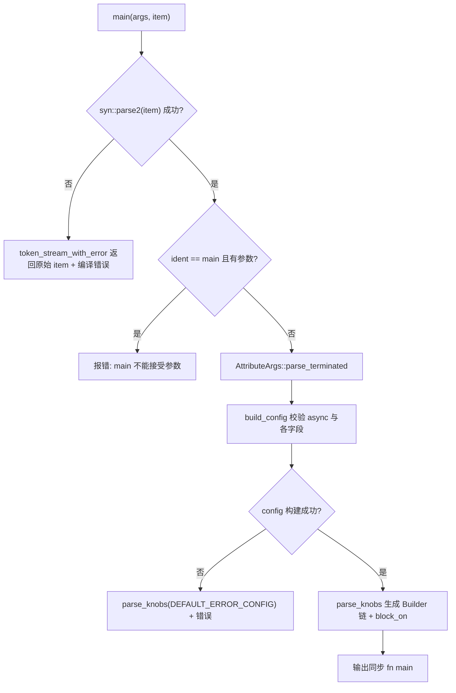
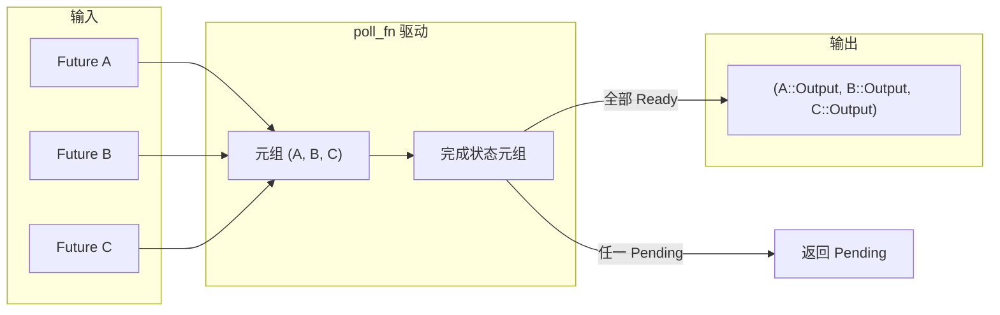

# Chapitre 9 : La magie des macros : la génération de code derrière #[tokio::main], select! et join!

Dans le chapitre précédent, nous avons vu comment`block_on`et le pool de threads bloquants délimitent les capacités du runtime asynchrone, alors que les utilisateurs n'écrivent presque jamais ces frontières à la main — ils écrivent`#[tokio::main]`、`select!`、`join!`, laissant la macro déployer ce code boilerplate à la compilation. Les macros sont la première couche de sucre syntaxique offerte par Tokio aux utilisateurs, et aussi l'endroit où le code d'exécution est réellement généré à la compilation. Ce chapitre se concentre sur la crate`tokio-macros`et`tokio/src/macros/select.rs`, décompose les trois chemins d'expansion de macros les plus utilisés, et répond principalement à une question : après expansion de la macro, à quoi ressemble réellement la chaîne d'appels, et pourquoi la sémantique de cancel safety de`select!`doit être surveillée séparément.

# 9.1 #[tokio::main] : réécrire async fn en Runtime::block_on

**Modèle intuitif**：`#[tokio::main]`C'est comme un « mandat de rénovation ». Vous confiez un logement brut (`async fn main`), il installe la plomberie et l'électricité (construit le Runtime), pose portes et fenêtres (`enable_all`), puis emménage vos meubles d'origine (le corps de la fonction). Sans lui, chaque`main`devrait écrire manuellement`Builder::new_multi_thread().enable_all().build().unwrap().block_on(...)`, et le code boilerplate noierait la logique métier.

## Structures de données et disposition mémoire

La macro elle-même ne produit pas de structures de données à l'exécution, mais la configuration qu'elle analyse est rangée dans deux structures.`Configuration`est un « accumulateur mutable de la phase d'analyse », dont tous les champs sont`Option`, car les paramètres d'attribut peuvent être absents, répétés ou invalides[FACT:tokio-macros/src/entry.rs:74-84]. Notez que`worker_threads`、`start_paused`、`unhandled_panic`portent tous`Span`— c'est pour localiser l'erreur sur la ligne écrite par l'utilisateur lors d'un signalement, et non à l'intérieur de la macro[FACT:tokio-macros/src/entry.rs:74-84]。`FinalConfig`est quant à lui le « résultat immuable après validation »,`flavor`n'est plus`Option`, car`build()`a déjà été couvert par`default_flavor`[FACT:tokio-macros/src/entry.rs:55-62]。

`RuntimeFlavor`n'a que trois variantes :`CurrentThread`、`Threaded`、`Local` [FACT:tokio-macros/src/entry.rs:10-14]。`from_str`fournit exprès des messages d'erreur conviviaux pour les noms hérités :`single_thread`indique qu'il faudrait appeler`current_thread`，`basic_scheduler`indique un renommage,`threaded_scheduler`indique un renommage en[FACT:tokio-macros/src/entry.rs:17-27]. C'est une conception typique de la macro comme « premier point de contact utilisateur » : le message d'erreur fait office de documentation.

## Déroulement de l'expansion pas à pas

Mise en situation : l'utilisateur écrit`#[tokio::main(flavor = "multi_thread", worker_threads = 4)] async fn main() { ... }`。

Première étape,`main`l'entrée analyse d'abord l'item en un`ItemFn` [FACT:tokio-macros/src/entry.rs:577-580]personnalisé. Ce`ItemFn`n'est pas`syn::ItemFn`, mais un analyseur implémenté par Tokio lui-même, dont la raison est écrite dans les commentaires : il ne veut pas analyser récursivement toute la déclaration, mais faire une analyse légère « mise en tampon par arbre de tokens, découpage à chaque point-virgule »[FACT:tokio-macros/src/entry.rs:720-764]. Cela évite le coût de construction d'un AST complet sur le corps de la fonction dans la macro.

Deuxième étape,`build_config`vérifie si le mot-clé`async`est présent, et signale "the`async` keyword is missing" [FACT:tokio-macros/src/entry.rs:346-349]s'il manque. Ensuite, il parcourt les paramètres d'attribut et dispatche`worker_threads`、`flavor`、`start_paused`、`crate`、`unhandled_panic`、`name`vers le setter correspondant[FACT:tokio-macros/src/entry.rs:369-399]. Notez que`core_threads`est explicitement rejeté avec un message indiquant le renommage en[FACT:tokio-macros/src/entry.rs:379-382]。

Troisième étape,`Configuration::build`effectue une validation de cohérence entre champs. Il y a ici trois contraintes clés :`worker_threads`n'autorise que`multi_thread` [FACT:tokio-macros/src/entry.rs:197-217]；`start_paused`n'autorise que`current_thread`/`local` [FACT:tokio-macros/src/entry.rs:219-229]；`unhandled_panic`n'autorise également que`current_thread`/`local` [FACT:tokio-macros/src/entry.rs:231-241]. Si l'utilisateur choisit`multi_thread`mais que la feature`rt-multi-thread`n'est pas activée, le message d'erreur diffère selon que le flavor est explicitement spécifié ou non[FACT:tokio-macros/src/entry.rs:209-216]。

Quatrième étape,`parse_knobs`génère le code. Il efface d'abord`asyncness` [FACT:tokio-macros/src/entry.rs:441], puis choisit le point de départ du builder selon le flavor :`CurrentThread`/`Local`utilise`Builder::new_current_thread()`，`Threaded`utilise`Builder::new_multi_thread()` [FACT:tokio-macros/src/entry.rs:468-477]。`Local`La particularité est que l'appel à build est`build_local(Default::default())`et non`build()` [FACT:tokio-macros/src/entry.rs:479-483]. Ensuite, il ajoute en chaîne selon les besoins`.worker_threads(#v)`、`.start_paused(#v)`、`.unhandled_panic(...)`、`.name(#v)` [FACT:tokio-macros/src/entry.rs:485-497]。

Cinquième étape, génération du corps de fonction final. Le cœur est`last_block`：`return #rt.enable_all().#build.expect("Failed building the Runtime").block_on(body)` [FACT:tokio-macros/src/entry.rs:509-522]. Notez le`return`explicite, dont le commentaire pointe vers tokio-rs/tokio#4636, pour corriger un problème d'inférence de type[FACT:tokio-macros/src/entry.rs:508]。

Sixième étape, le corps de la fonction est enveloppé dans`async #body`et soumis à une vérification de type. Hors chemin test, si le type de retour n'est pas`!`et ne contient pas`impl Trait`, on insère`if false { let _: &dyn Future<Output = #output_type> = &body; }`pour une assertion à la compilation[FACT:tokio-macros/src/entry.rs:551-571]. Le chemin test utilise quant à lui`pin!`Épingler le body sur la pile et le convertir en`Pin<&mut dyn Future>`, le commentaire explique que c'est pour réduire`block_on`la surcharge de compilation des instanciations génériques[FACT:tokio-macros/src/entry.rs:526-548]。



## Réflexions de conception et pièges en production

`main`et`test`partagent`parse_knobs`, mais le flavor par défaut diffère :`test`par défaut`CurrentThread`，`main`par défaut`Threaded` [FACT:tokio-macros/src/entry.rs:91-94]. Cela explique pourquoi`#[tokio::test]`est monothread par défaut — les tests n'ont généralement pas besoin de plusieurs cœurs, et le monothread est plus facile à reproduire.

Un piège facilement négligé : après l'expansion de la macro, chaque appel de la fonction crée un nouveau Runtime. La documentation avertit explicitement que si la fonction est appelée fréquemment, il faut utiliser Builder pour réutiliser le Runtime[FACT:tokio-macros/src/lib.rs:31-35]. Utiliser`#[tokio::main]`sur une fonction ordinaire est légal, mais chaque appel paie le coût de construction d'un Runtime.

Un autre piège est le renommage de`crate`. Lorsque l'utilisateur`use tokio as tokio1`, le`tokio::runtime::Builder`généré par défaut à l'intérieur de la macro ne trouvera pas le chemin, il faut explicitement`crate = "tokio1"` [FACT:tokio-macros/src/lib.rs:239-264]。`parse_knobs`dans`crate_path`la valeur par défaut de`Ident::new("tokio", ...)` [FACT:tokio-macros/src/entry.rs:456-462], c'est précisément la source de l'erreur dans le scénario de renommage.

# 9.2 select! : polling multi-branches, masque de bits et équité aléatoire

**Modèle intuitif**：`select!`ressemble à « un serveur qui surveille simultanément plusieurs comptoirs de retrait ». Le comptoir qui sert en premier, il emporte le plat, et la file d'attente des autres comptoirs est annulée. Sans lui, l'utilisateur devrait écrire manuellement`poll_fn`pour mettre plusieurs Future dans un tuple et les poll un par un, et gérer lui-même la logique « une fois qu'une branche est prête, les autres branches doivent être abandonnées ».

## Structures de données et disposition mémoire

`select!`génère après expansion un module local`__tokio_select_util`, contenant une énumération`Out`et un alias de type`Mask` [FACT:tokio/src/macros/select.rs:615-619]。`Out`les noms de variantes sont`_0`、`_1`…… une par branche, plus un`Disabled`représentant l'invalidation de toutes les branches[FACT:tokio-macros/src/select.rs:33-39]。`Mask`le type sous-jacent est choisi dynamiquement selon le nombre de branches : ≤8 utilise`u8`, ≤16 utilise`u16`, ≤32 utilise`u32`, ≤64 utilise`u64`, au-delà de 64 panic directement[FACT:tokio-macros/src/select.rs:17-31]. Ce masque de bits est`select!`l'état central : le i-ème bit à 1 signifie que la i-ème branche a été désactivée.

Tous les Future sont stockés dans un tuple`futures`, chaque élément passe d'abord par`IntoFuture::into_future`conversion[FACT:tokio/src/macros/select.rs:654-656]. Notez qu'ici on construit d'abord`futures_init`puis un par un`into_future`, le commentaire explique que c'est pour tirer parti de la prolongation de la durée de vie temporaire[FACT:tokio/src/macros/select.rs:641-646]. Ensuite`let mut futures = &mut futures;`rétrograde le tuple en référence mutable, évitant que la closure`poll_fn`ne s'empare de la propriété[FACT:tokio/src/macros/select.rs:658-662]。

## Processus de polling étape par étape

Mise en situation :`select! { v = stream1.next() => ..., v = stream2.next() => ..., else => break }`。

Première étape, correspondance des règles d'entrée de la macro. S'il y a un préfixe`biased;`,`start=0` [FACT:tokio/src/macros/select.rs:801-803]; sinon`start`est une expression aléatoire`thread_rng_n(BRANCHES)` [FACT:tokio/src/macros/select.rs:805-809]. C'est ce que la documentation appelle « sélectionner aléatoirement une branche à vérifier en premier », la source de l'équité[FACT:tokio/src/macros/select.rs:61-65]。

Deuxième étape, normalisation. Le tt-muncher normalise chaque branche en forme`(skip) pat = fut, if cond => handler,`,`skip`est une séquence de`_`, de longueur égale au nombre de branches précédant cette branche[FACT:tokio/src/macros/select.rs:770-793]。`skip`sert à la fois à générer l'accès au champ du tuple`futures_init.$($skip)*`, et à`count!`calculer l'index de la branche.

Troisième étape, évaluation des préconditions. Pour chaque branche`if $c`, si false, alors`disabled |= 1 << index` [FACT:tokio/src/macros/select.rs:631-636]. Attention : même si la branche est désactivée, son expression`$fut`sera quand même évaluée, mais ne sera pas poll[FACT:tokio/src/macros/select.rs:39-41]。

Quatrième étape, entrer dans la closure`poll_fn`. Vérifier d'abord le budget de coopération :`ready!(poll_budget_available(cx))`, budget épuisé retourne directement`Pending` [FACT:tokio/src/macros/select.rs:664-667]. Cela garantit que`select!`n'accapare pas le worker.

Cinquième étape, boucle`for i in 0..BRANCHES`，`branch = (start + i) % BRANCHES` [FACT:tokio/src/macros/select.rs:680-685]. Pour chaque branch : vérifier d'abord`disabled & mask == mask`, si désactivée alors`continue` [FACT:tokio/src/macros/select.rs:694-699]; sinon extraire le Future du tuple, l'envelopper avec`Pin::new_unchecked`(la sécurité dépend du fait que le Future est sur la pile et n'est pas déplacé)[FACT:tokio/src/macros/select.rs:701-707]; le poll,`Ready(out)`alors d'abord`disabled |= mask`puis correspondre au motif[FACT:tokio/src/macros/select.rs:710-730]。

Sixième étape, correspondance de motif. Si`out`correspond à`$bind`, retourner`Poll::Ready(Out::_i(out))` [FACT:tokio/src/macros/select.rs:727-733]; si pas de correspondance,`continue`continuer à poll les autres branches — c'est précisément ce que dit l'étape 5 de la documentation « si le motif ne correspond pas, désactiver la branche courante »[FACT:tokio/src/macros/select.rs:44-47]。

Septième étape, fin de boucle. Si`is_pending`est vrai retourner`Pending`, sinon toutes les branches sont invalidées, retourner`Out::Disabled` [FACT:tokio/src/macros/select.rs:740-745]. La couche externe`match output`mappe`Out::_i`vers le handler correspondant,`Disabled`mappe vers`else`l'expression[FACT:tokio/src/macros/select.rs:749-755]。

```mermaid
flowchart TD
    start["poll_fn 闭包被调用"] --> budget{"poll_budget_available(cx)?"}
    budget -->|否| pending_budget["返回 Pending"]
    budget -->|是| init["is_pending = false; start = $start"]
    init --> loop{"i |否| check_pending{"is_pending?"}
    check_pending -->|是| pending["返回 Pending"]
    check_pending -->|否| disabled_out["返回 Out::Disabled"]
    loop -->|是| branch["branch = (start+i) % BRANCHES"]
    branch --> is_disabled{"disabled & mask == mask?"}
    is_disabled -->|是| next_i["i += 1"]
    is_disabled -->|否| poll_fut["Pin::new_unchecked(fut).poll(cx)"]
    poll_fut --> poll_res{"Poll 结果?"}
    poll_res -->|Pending| set_pending["is_pending = true; i += 1"]
    poll_res -->|Ready| disable["disabled |= mask"]
    disable --> pat_match{"out 匹配 $bind?"}
    pat_match -->|否| next_i
    pat_match -->|是| ready_out["返回 Out::_i(out)"]
    next_i --> loop
    set_pending --> loop
```

## Réflexions de conception et pièges en production

**Pourquoi utiliser un masque de bits plutôt que`Vec<bool>`？**Le masque de bits est un simple entier sur la pile, sans allocation sur le tas, et`disabled |= mask`est une seule instruction. Pour`select!`sur le chemin chaud, cela évite l'accès au tas à chaque itération.

**Pourquoi désactiver la branche en cas de non-correspondance de motif ?**C'est`select!`la différence clé avec une « simple race ». Considérons`Some(v) = stream.next() => ...`, si`stream.next()`retourne`None`(fin de flux), le motif ne correspond pas, la branche est définitivement désactivée, évitant de poll indéfiniment un flux terminé. L'exemple de la documentation s'appuie précisément sur cette sémantique pour collecter deux flux jusqu'à ce que les deux soient terminés[FACT:tokio/src/macros/select.rs:198-223]。

**La véritable signification de la sécurité d'annulation**：`select!`Une fois qu'une branche est prête, les Future des autres branches sont drop. Si un Future droppé a déjà consommé des données mais n'a pas encore retourné, les données sont perdues. La documentation liste explicitement`read_exact`、`read_to_end`、`write_all`non sûr à l'annulation[FACT:tokio/src/macros/select.rs:119-124], tandis que`Mutex::lock`、`Semaphore::acquire`à cause de l'équité de file d'attente, l'annulation perd la position dans la file[FACT:tokio/src/macros/select.rs:126-133]. Méthode de détermination : trouver le point`.await`, si redémarrer la fonction à`.await`reste correct, alors c'est sûr à l'annulation[FACT:tokio/src/macros/select.rs:135-139]。

**`if`Le piège de course des préconditions**: la documentation donne un exemple d'erreur classique — utiliser`if !sleep.is_elapsed()`pour garder la branche`sleep`, mais`is_elapsed()`peut devenir true entre la vérification`while`et`select!`, entraînant un timeout manqué[FACT:tokio/src/macros/select.rs:336-376]. La bonne façon est de retirer`if`, laisser la branche`sleep`toujours participer au polling, après le timeout`break` [FACT:tokio/src/macros/select.rs:378-405]。

**`biased;`le coût de**: le RNG aléatoire a un coût CPU, et certains scénarios nécessitent un ordre de polling déterminé[FACT:tokio/src/macros/select.rs:67-74]. Mais`biased;`confie la responsabilité de l'équité à l'utilisateur : si une branche est toujours prête, les branches suivantes seront affamées[FACT:tokio/src/macros/select.rs:75-81]。

# 9.3 join! et les contraintes d'ingénierie de l'expansion de macro

**Modèle intuitif**：`join!`ressemble à « attendre simultanément que tous les colis arrivent ». Contrairement à`select!`qui annule les autres dès que l'un arrive, il agrège les valeurs`Ready`de tous les Future en un tuple. Sans lui, l'utilisateur devrait écrire manuellement`poll_fn`pour maintenir l'état d'achèvement de chaque Future.

## Structures de données et disposition mémoire

`join!`Le déploiement de  est également basé sur un tuple stockant des Future, mais l'état n'est pas un masque de bits, mais un tuple de « valeurs terminées ». Une fois chaque Future terminé, sa valeur est extraite et stockée dans le tuple de résultats, et l'emplacement correspondant est marqué comme terminé. Contrairement à`select!`,`join!`ne drop pas les Future non terminés — il doit attendre que tous les Future soient terminés avant de retourner.

## Processus étape par étape

`join!`La logique de polling de  partage le squelette « tuple stockant des Future +`select!`pilotage » avec`poll_fn`, mais la sémantique est inverse :`select!`est « retourne dès qu'un est prêt »,`join!`est « retourne seulement quand tous sont prêts ». Chaque tour de poll parcourt tous les Future non terminés, si l'un retourne`Pending`alors l'ensemble`Pending`, si tous`Ready`alors agrège et retourne.



## Réflexions de conception et pièges en production

`join!`La sémantique de sûreté d'annulation de  diffère de`select!`:`join!`Lorsqu'il est drop, tous les Future non terminés sont drop, ce qui peut également entraîner une perte de données. Mais comme`join!`n'annule activement aucune branche, il n'annule pas cette branche « parce qu'une autre branche est prête » comme`select!`. Le vrai risque réside dans le fait que`join!`soit globalement annulé par un`select!`externe ou un timeout.

`join!`La différence entre  et`try_join!`mérite attention :`try_join!`retourne immédiatement lorsqu'un Future retourne`Err`, annulant les autres Future, il hérite donc du risque de sûreté d'annulation de`select!`.

# Réflexions de conception

**Les limites des macros en tant que générateurs de code à la compilation**。`#[tokio::main]`place la validation de configuration à la compilation, les combinaisons illégales (comme`multi_thread` + `start_paused`) échouent directement à la compilation, plutôt qu'un panic à l'exécution. C'est l'avantage principal des macros par rapport au Builder : erreur en avance.

**Architecture hybride macro déclarative + macro procédurale**。`select!`Le corps de  est`macro_rules!`, mais deux logiques clés sont déléguées aux macros procédurales :`select_priv_declare_output_enum`génère l'énumération`Out`et le type`Mask`nettoie[FACT:tokio-macros/src/lib.rs:658-660]，`select_priv_clean_pattern`dans le pattern`ref`/`mut` [FACT:tokio-macros/src/lib.rs:666-668]. Pourquoi ? L'explication en commentaire : les macros déclaratives ont du mal à générer du code qui « sélectionne dynamiquement le type entier selon le nombre de branches », et ont également du mal à effectuer un nettoyage au niveau des tokens dans les positions de pattern[FACT:tokio/src/macros/select.rs:577-579]。

**`clean_pattern`La nécessité de**。`select!`fait correspondre`out`sous forme de`&out`au pattern[FACT:tokio/src/macros/select.rs:727], si l'utilisateur écrit`ref v`, cela devient`&ref v`provoquant une erreur de type.`clean_pattern`Suppression récursive de`by_ref`、`mutability`, ainsi que`Reference`du pattern`mutability` [FACT:tokio-macros/src/select.rs:68-73][FACT:tokio-macros/src/select.rs:100-103]. C'est le compromis que fait la macro entre « l'intuition de l'utilisateur » et « le borrow checker ».

**La réalité d'ingénierie de la limite de 64 branches**。`count!`、`count_field!`、`select_variant!`Les trois macros écrivent chacune manuellement les règles de correspondance de 0 à 64[FACT:tokio/src/macros/select.rs:821-1017][FACT:tokio/src/macros/select.rs:1021-1217][FACT:tokio/src/macros/select.rs:1221-1414]. Le commentaire dit franchement « I'm not happy about it either »[FACT:tokio/src/macros/select.rs:816-817]. C'est le prix à payer pour qu'une macro déclarative ne puisse pas faire d'arithmétique : on ne peut que coder en dur la correspondance entre le nombre de tokens et un entier.

# Résumé de ce chapitre

# Réflexions et auto-évaluation de ce chapitre

Q1: `select!`Le`disabled`masque de bits de  est réinitialisé à`select!`chaque fois qu'on entre dans`Default::default()` [FACT:tokio/src/macros/select.rs:627]. Si l'on déplace cette ligne à l'intérieur de la closure`poll_fn`, que se passe-t-il dans le scénario « appel en boucle de select! et un pattern de branche ne correspond pas » ?

**Analyse de référence**：`disabled`Si initialisé à l'intérieur de la closure, chaque poll le réinitialise, ce qui fait que les branches désactivées au tour précédent à cause d'une non-correspondance de pattern participent à nouveau au polling. Considérons`Some(v) = stream.next() => ...`et`stream`déjà terminé (retourne`None`), après non-correspondance du pattern cette branche devrait être définitivement désactivée. Si`disabled`est réinitialisé, le prochain tour de poll va à nouveau poll ce flux déjà terminé, et si le flux n'est pas fused (c'est-à-dire qu'un poll après terminaison peut panic ou retourner un comportement indéfini), cela posera problème. Même si le flux est fused, cela gaspille du CPU à poll en boucle un flux qui retourne toujours`None`. La documentation dit explicitement « Re-entering select! due to a loop clears the disabled state »[FACT:tokio/src/macros/select.rs:37-38], ce qui signifie ré-entrer dans la macro`select!`(nouveau tour de boucle), et non les multiples poll au sein d'un même`select!`.`disabled`doit être initialisé en dehors de la closure, pour maintenir l'état entre les multiples poll d'un même appel`select!`.

Q2: `select!`Après avoir poll jusqu'à`Ready(out)`, exécute d'abord`disabled |= mask`puis fait correspondre le pattern[FACT:tokio/src/macros/select.rs:720-730]. Si l'on retire`disabled |= mask`, que se passe-t-il dans le scénario où le pattern ne correspond pas et que ce Future retourne immédiatement`Ready`à chaque poll ?

**Analyse de référence**: après avoir retiré`disabled |= mask`, si`out`ne correspond pas à`$bind`, le code passe par`continue`et continue à poller les autres branches. Mais au prochain tour où`poll_fn`est appelé (par exemple après qu'une autre branche retourne`Pending`et qu'on poll à nouveau), cette branche n'est toujours pas désactivée et sera pollée à nouveau. Si ce Future retourne immédiatement`Ready`à chaque poll et que la valeur ne correspond pas au pattern, cela forme un livelock « poll -> Ready -> non-correspondance -> continue -> autre branche Pending -> retourne Pending -> poll à nouveau -> Ready à nouveau -> ... », le CPU tourne à vide.`disabled |= mask`Positionné immédiatement après`Ready`, pour garantir que même si le pattern ne correspond pas, cette branche ne sera pas pollée à nouveau. Notez que le positionnement a lieu avant la correspondance de pattern, donc les deux cas « Ready mais pattern ne correspond pas » et « Ready et pattern correspond » désactivent la branche — le premier pour éviter le livelock, le second pour éviter la consommation répétée.

Q3: `parse_knobs`Insère`if false { let _: &dyn Future<Output = #output_type> = &body; }`dans le chemin non-test pour faire une vérification de type[FACT:tokio-macros/src/entry.rs:557-561], mais saute la vérification pour les types retournant`!`ou contenant`impl Trait`. Pourquoi[FACT:tokio-macros/src/entry.rs:551-556]doit-il être sauté ? Que se passerait-il si l'on forçait la vérification ?`impl Trait`Analyse de référence

**À la position de retour,  est un « type opaque », le compilateur n'autorise pas à le convertir de force en**：`impl Trait`, car`&dyn Future<Output = impl Trait>`exige un type concret, alors que`dyn` 要求具体类型，而 `impl Trait`Le type concret de n'est pas visible en dehors de la fonction. Si l'on insère de force une vérification, on obtient des erreurs du type « the size for values of type`impl Future`cannot be known at compilation time » ou « cannot be made into an object ». Il en va de même pour le type de retour`!`:`!`peut être converti en n'importe quel type, mais`&dyn Future<Output = !>`le`Output = !`lui-même peut déclencher des problèmes liés à l'instabilité de la never type. Le coût de l'omission de la vérification est le suivant : si l'utilisateur écrit`async fn main() -> impl Trait`mais que le type de retour réel ne correspond pas à`impl Trait`, l'erreur ne sera révélée qu'au niveau de`block_on`, et le message d'erreur peut être moins clair qu'avec une vérification explicite. C'est un compromis entre « l'exhaustivité de la vérification à la compilation » et « les limitations du système de types ».

La macro prend en charge le code boilerplate et la validation à la compilation à la place de l'utilisateur, mais ce qu'elle génère reste de simples Future et des appels`poll`. Dans le chapitre suivant, nous quitterons le monde de la compilation des macros pour entrer dans la couche d'abstraction d'I/O à l'exécution, afin de voir comment`AsyncRead`/`AsyncWrite`découpe les flux d'octets en trames, et comment`Framed`le framework de codec fonctionne correctement sous les contraintes de sûreté à l'annulation de`select!`.

`#[tokio::main]`L'essence de est « analyse de configuration + génération de chaîne Builder +`block_on`enveloppement », la validation de configuration s'effectue à la compilation, le flavor détermine le point de départ du builder et la méthode build.`select!`Le cœur de est « stockage des Future dans un tuple + masque de bits pour marquer les désactivations + point de départ aléatoire pour garantir l'équité », une non-concordance de motif désactive la branche, la sûreté à l'annulation dépend de si le Future abandonné peut être redémarré au niveau de`.await`.`join!`et`select!`partagent le même squelette mais ont une sémantique opposée : le premier attend que tout soit terminé, le second retourne dès qu'un seul est prêt. Les trois illustrent ensemble le compromis central de la conception des macros Tokio : confier le code boilerplate et la validation à la compilation aux macros, et laisser à l'utilisateur la compréhension explicite de la complexité sémantique à l'exécution (en particulier la sûreté à l'annulation). Après avoir compris comment les macros génèrent le code à l'exécution, la question naturelle suivante est : lorsque ce code commence réellement à lire et écrire des flux d'octets, quelles abstractions Tokio fournit-il ? Le chapitre 10 analysera`AsyncRead`/`AsyncWrite`et le framework de codec, pour voir comment`BufReader`/`BufWriter`réduit les appels système, comment`copy_bidirectional`pilote le transfert bidirectionnel, comment`Framed`découpe les flux d'octets en trames, répondant ainsi à la question « où se situent les frontières de l'abstraction des I/O asynchrones ».
