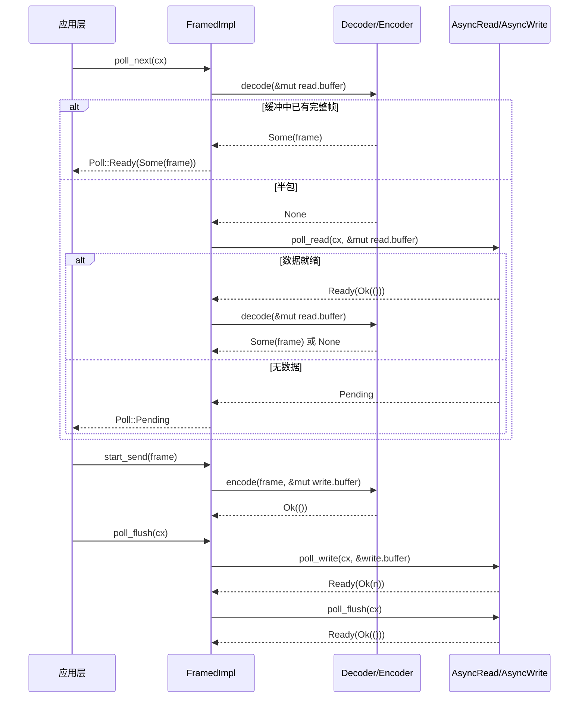

# Chapitre 10 : Abstraction d'I/O en flux : AsyncRead/AsyncWrite et framework de codec

Le chapitre précédent a décomposé le processus d'expansion de tokio-macros ; nous avons vu comment #[tokio::main], select!, join! prennent en charge le code boilerplate et la validation à la compilation à la place de l'utilisateur. Mais ce que les macros génèrent reste de simples Future et appels poll — lorsque ces Future commencent réellement à lire et écrire des octets, les abstractions de bas niveau fournies par Tokio ne sont que deux traits : AsyncRead et AsyncWrite. Leur problème est qu'ils sont « trop bas niveau » : un poll_read ne garantit que « quelques octets ont été lus », pas « un message complet a été lu ». Or la grande majorité des protocoles (HTTP, Redis, gRPC, RPC personnalisés) sont orientés « trames » plutôt que « flux d'octets ». La question centrale à laquelle ce chapitre répond est : où doivent se situer les frontières de l'abstraction des I/O asynchrones ? La réponse de Tokio se divise en deux couches : tokio::io fournit des traits et outils au niveau du flux d'octets (BufReader/BufWriter/copy_bidirectional), et le framework codec de tokio-util fournit par-dessus une adaptation Stream/Sink au niveau des trames (Framed/LengthDelimitedCodec). Comprendre la répartition des rôles entre ces deux couches, c'est comprendre « pourquoi les implémentations de protocoles commencent presque toutes par Framed ».

# I. AsyncRead/AsyncWrite : pourquoi ne pas réutiliser directement std::io::Read

## Modèle intuitif

`std::io::Read::read`est un « retrait bloquant » : vous vous tenez devant le guichet, et tant que la marchandise n'est pas arrivée, vous attendez, le thread est suspendu.`AsyncRead::poll_read`est un « retrait avec ticket de repas » : vous demandez « c'est prêt ? », si ce n'est pas prêt (`Poll::Pending`), vous vaquez à d'autres occupations tout en laissant un Waker pour que le système vous appelle quand la marchandise arrive. Sans ce trait, toute l'I/O asynchrone devrait être écrite manuellement avec l'enregistrement`epoll`et le mapping Waker — c'est exactement ce que fait le Reactor du chapitre 5, et`AsyncRead`est la façade unifiée qu'il expose aux couches supérieures.

## Structures de données et disposition mémoire

`AsyncRead`La définition de est extrêmement concise, avec une seule méthode :

```rust
pub trait AsyncRead {
    fn poll_read(
        self: Pin,
        cx: &mut Context,
        buf: &mut ReadBuf,
    ) -> Poll>;
}
```

[FACT:tokio/src/io/async_read.rs:44-60]

Les trois paramètres ont chacun leur importance.`self: Pin<&mut Self>`plutôt que`&mut self`: parce que`AsyncRead`est souvent détenu par le Future généré par`async fn`, et qu'un Future, une fois poll, ne peut plus être déplacé (auto-référence),`Pin`est un contrat imposé par le compilateur.`cx: &mut Context<'_>`porte le Waker, c'est le canal de transmission du « dispositif de retrait ».`buf: &mut ReadBuf<'_>`est l'encapsulation par Tokio de`&mut [u8]`— il enregistre simultanément la « longueur remplie » et la « capacité non initialisée », évitant ainsi`std::io::Read`Cette ambiguïté du type « renvoie le nombre d'octets lus mais le tampon peut être non initialisé ».

La documentation énumère explicitement trois sémantiques de retour[FACT:tokio/src/io/async_read.rs:15-32]：`Ready(Ok(()))`indique que les données ont été écrites`buf`, la quantité lue étant déterminée par l'incrément de longueur de`ReadBuf::filled`; si l'incrément est 0, il s'agit soit d'EOF, soit de`buf.remaining() == 0`(tampon de capacité nulle) ;`Pending`indique que la lecture est actuellement impossible mais qu'un réveil a été enregistré ;`Ready(Err(e))`est une erreur d'E/S sous-jacente. Voici un piège facile à négliger :**« quantité lue égale à 0 » n'est pas synonyme d'EOF**— si l'appelant passe un tampon de capacité nulle,`poll_read`renvoie immédiatement`Ready(Ok(()))`mais n'a rien lu. Si la couche supérieure traite « 0 octet » comme un EOF, elle diagnostiquera à tort une fermeture de connexion.

## Walkthrough guidé par scénario : lire une séquence d'octets depuis`&[u8]`Considérons l'implémentation la plus simple — la copie de

vers`&[u8]`Analysons étape par étape :`AsyncRead`：

```rust
impl AsyncRead for &[u8] {
    fn poll_read(
        mut self: Pin,
        _cx: &mut Context,
        buf: &mut ReadBuf,
    ) -> Poll> {
        let amt = std::cmp::min(self.len(), buf.remaining());
        let (a, b) = self.split_at(amt);
        buf.put_slice(a);
        *self = b;
        Poll::Ready(Ok(()))
    }
}
```

[FACT:tokio/src/io/async_read.rs:98-108]

est la capacité restante du tampon cible, on prend la plus petite des deux`self.len()`On découpe le segment en « le`buf.remaining()`à copier cette fois » et « le`amt`。`split_at(amt)`restant à lire »`a`On copie`b`」。`buf.put_slice(a)`dans`a`et on avance son pointeur filled.`ReadBuf`On avance le segment lui-même vers la partie restante — c'est là le point clé de`*self = b`en tant que « curseur » : après chaque poll,`&[u8]`pointe vers la partie non lue. Enfin on renvoie`self`, car un segment mémoire est toujours « prêt », il ne fera jamais`Ready(Ok(()))`Notons que`Pending`。

est ignoré : une source de données en mémoire n'a pas besoin de Waker. Cela contraste avec un socket réseau — ce dernier, en l'absence de données, renvoie`_cx`et enregistre un intérêt pour la lisibilité.`Pending`L'implémentation de

`io::Cursor<T>`ajoute une couche de vérification de limites[FACT:tokio/src/io/async_read.rs:113-134]: on prend d'abord`position()`, et si`pos > slice.len()`(position hors limites) on renvoie directement`Ready(Ok(()))`sans panic[FACT:tokio/src/io/async_read.rs:113-134]. C'est une conception défensive :`Cursor`la position de`set_position`peut être définie à une valeur arbitraire par un

## externe ; en cas de dépassement, la traiter comme « déjà lu » est plus conforme à la sémantique d'E/S qu'un panic.

`AsyncRead`Réflexion de conception : la macro deref et la propagation de Pin`Box<T>`、`&mut T`、`Pin<P>`fournit une implémentation de transfert pour`deref_async_read!`. Les deux premiers génèrent[FACT:tokio/src/io/async_read.rs:64-70]via la macro`Pin::new(&mut **self).poll_read(cx, buf)`, l'essentiel étant`Pin<&mut Box<T>>`— déréférencer`Pin<&mut T>`vers`Pin<P>`puis transférer.[FACT:tokio/src/io/async_read.rs:87-93]L'implémentation de`crate::util::pin_as_deref_mut(self)`est plus subtile`Pin<&mut Pin<P>>`: elle appelle`Pin<&mut P::Target>`, projetant`Pin`vers

> **[Design Inference & Architectural Trade-offs]**
> entraînerait une incompatibilité de types.`Box<dyn AsyncRead>`、`&mut T`〔Inférence de conception et compromis architecturaux〕`poll_read`La motivation de conception ici est le « zéro-coût abstrait » : les implémentations de transfert permettent à des types enveloppants comme`Pin`de ne pas avoir à écrire manuellement

---

# , tout en préservant une sémantique correcte de

## . Le coût est qu'à chaque couche de transfert s'introduit un appel indirect, que le compilateur peut généralement éliminer par inlining.

`copy_bidirectional`II. copy_bidirectional : la machine à états du transfert bidirectionnel`copy`Modèle intuitif`select!`est un « serveur de plats bidirectionnel » : il surveille simultanément les deux directions A→B et B→A, et dès qu'un côté lit des données, il les écrit vers l'autre. Sans lui, implémenter un proxy TCP nécessiterait d'écrire manuellement deux`select!`Future et de les combiner avec`copy_bidirectional`— or la contrainte de sûreté à l'annulation de

## (chapitre 9) ferait perdre les données « lues à moitié puis annulées ».

utilise une machine à états explicite pour conserver les états intermédiaires « lecture-écriture-fermeture », assurant ainsi la sûreté à l'annulation.

```rust
enum TransferState {
    Running(CopyBuffer),
    ShuttingDown(u64),
    Done(u64),
}
```

[FACT:tokio/src/io/util/copy_bidirectional.rs:10-14]

`Running`Le cœur est une énumération à trois états :`CopyBuffer`Copie`ShuttingDown(u64)`détient`Done(u64)`(contenant un tampon de 8 Ko et les compteurs de lecture/écriture), représentant « transfert de données en cours ».**porte le nombre d'octets déjà copiés, représentant « le côté lecture est à EOF, fermeture du côté écriture en cours ».**。

`CopyBuffer`représente « fermeture terminée, enregistrement du nombre final d'octets ». Cette énumération est la clé de la sûreté à l'annulation :`copy.rs`à tout moment si elle est drop, l'état est conservé dans l'énumération, et le prochain poll peut reprendre depuis le point d'interruption`DEFAULT_BUF_SIZE`provient de[FACT:tokio/src/io/util/copy_bidirectional.rs:76-88], la taille par défaut étant déterminée par`CopyBuffer`(8 Ko)

## . Chaque direction détient un

`copy_bidirectional_impl`indépendant, donc la consommation mémoire est de 16 Ko.`poll_fn`Walkthrough guidé par scénario : le cycle de vie complet d'un transfert bidirectionnel

```rust
let mut a_to_b = TransferState::Running(a_to_b_buffer);
let mut b_to_a = TransferState::Running(b_to_a_buffer);
poll_fn(|cx| {
    let a_to_b = transfer_one_direction(cx, &mut a_to_b, a, b)?;
    let b_to_a = transfer_one_direction(cx, &mut b_to_a, b, a)?;
    let a_to_b = ready!(a_to_b);
    let b_to_a = ready!(b_to_a);
    Poll::Ready(Ok((a_to_b, b_to_a)))
})
.await
```

[FACT:tokio/src/io/util/copy_bidirectional.rs:127-151]

:`transfer_one_direction`Copie`Poll`。`ready!`Notons l'ordre d'appel de`Pending`: on avance d'abord a→b, puis b→a, les deux renvoyant**La macro renvoie immédiatement**si l'une des directions n'est pas terminée[FACT:tokio/src/io/util/copy_bidirectional.rs:143-144]— mais`ready!`l'état de l'autre direction a déjà été avancé`Done(count)`. C'est précisément ce que le commentaire souligne :

`transfer_one_direction`même si`loop`renvoie prématurément, l'autre direction renverra encore

```rust
loop {
    match state {
        TransferState::Running(buf) => {
            let count = ready!(buf.poll_copy(cx, r.as_mut(), w.as_mut()))?;
            *state = TransferState::ShuttingDown(count);
        }
        TransferState::ShuttingDown(count) => {
            ready!(w.as_mut().poll_shutdown(cx))?;
            *state = TransferState::Done(*count);
        }
        TransferState::Done(count) => return Poll::Ready(Ok(*count)),
    }
}
```

[FACT:tokio/src/io/util/copy_bidirectional.rs:29-42]

`Running`À l'intérieur de`poll_copy`se trouve un`ShuttingDown`。`ShuttingDown`, qui avance selon l'état :`poll_shutdown`Copie`Done`。`Done`Dans l'état

on appelle

```mermaid
flowchart TD
    start["transfer_one_direction 进入 loop"] --> match_state{"当前 TransferState?"}
    match_state -->|Running| poll_copy["buf.poll_copy(cx, r, w)"]
    poll_copy --> copy_ready{"poll_copy 结果?"}
    copy_ready -->|Pending| ret_pending["返回 Poll::Pending状态保持 Running"]
    copy_ready -->|Err| ret_err["返回 Poll::Ready(Err)错误向上传播"]
    copy_ready -->|Ok(count)| to_shutdown["state = ShuttingDown(count)"]
    to_shutdown --> match_state
    match_state -->|ShuttingDown| poll_shutdown["w.poll_shutdown(cx)"]
    poll_shutdown --> shutdown_ready{"shutdown 结果?"}
    shutdown_ready -->|Pending| ret_pending2["返回 Poll::Pending状态保持 ShuttingDown"]
    shutdown_ready -->|Err| ret_err
    shutdown_ready -->|Ok| to_done["state = Done(count)"]
    to_done --> match_state
    match_state -->|Done| ret_done["返回 Poll::Ready(Ok(count))"]
```

## on appelle

> **[Design Inference & Architectural Trade-offs]**
> on renvoie directement le compteur.`transfer_one_direction`Le diagramme de flux ci-dessous illustre la logique d'avancement de la machine à états unidirectionnelle et les branches d'erreur :`async fn`Copie`CopyBuffer`Réflexion de conception : pourquoi une machine à états explicite plutôt qu'une async fn`copy_bidirectional`〔Inférence de conception et compromis architecturaux〕**Si**était écrit comme`async fn`, le compilateur générerait un Future dont l'état interne (`select!`, compteur déjà copié) serait caché dans la machine à états générée. Cela ne pose pas de problème en usage unidirectionnel, mais`TransferState`doit avancer les deux directions`poll_fn`dans le même cycle de poll

simultanément — si l'on utilisait deux`poll_copy`plus`Err`, dès qu'une direction se termine l'autre serait drop, perdant son tampon interne et son compteur, violant la sûreté à l'annulation. Un`?`explicite expose l'état sur la pile,[FACT:tokio/src/io/util/copy_bidirectional.rs:32]et à chaque réentrée l'état est toujours là, garantissant ainsi « la reprise depuis le point d'interruption après annulation ».[FACT:tokio/src/io/util/copy_bidirectional.rs:67-70]En matière de gestion d'erreurs, le**renvoyé par**est immédiatement propagé vers le haut via`copy_bidirectional`. La documentation précise explicitement

`copy_bidirectional_with_sizes`: les lectures/écritures interrompues sont réessayées, les autres erreurs sont renvoyées immédiatement, et[FACT:tokio/src/io/util/copy_bidirectional.rs:99-125]des données partiellement lues peuvent être perdues`poll_copy`retourne toujours`Ready(Ok(0))`est incorrectement interprété comme EOF, formant une boucle d'attente active.

---

# III. Framed : découper un flux d'octets en trames

## Modèle intuitif

`Framed`est une « machine à saucisses » : en amont, un flux continu d'eau (`AsyncRead`/`AsyncWrite`), en aval, des segments de saucisse découpés (`Stream<Item = Frame>` / `Sink<Frame>`）。`Decoder`est chargé de « découper un segment du flux »,`Encoder`est chargé d'« emballer un segment en flux ». Sans`Framed`, chaque implémentation de protocole devrait écrire manuellement « gestion de tampon + traitement des paquets partiels + découpage des paquets collés » — c'est précisément le travail répétitif que le framework codec vise à éliminer.

## Structures de données et disposition mémoire

`Framed`n'est en soi qu'un mince emballage :

```rust
pub struct Framed {
    #[pin]
    inner: FramedImpl
}
```

[FACT:tokio-util/src/codec/framed.rs:38-41]

Le véritable état se trouve dans`FramedImpl`de`state: RWFrames`, contenant`read: ReadFrame`et`write: WriteFrame`deux parties.`ReadFrame`Les champs de`with_capacity`sont visibles dans[FACT:tokio-util/src/codec/framed.rs:107-126]：`eof: bool`(si le côté lecture est EOF),`is_readable: bool`(si l'intérêt en lecture est enregistré),`buffer: BytesMut`(tampon de lecture),`has_errored: bool`(si une erreur s'est produite, pour éviter les lectures répétées).`WriteFrame`Champs[FACT:tokio-util/src/codec/framed.rs:119-122]：`buffer: BytesMut`(tampon d'écriture),`backpressure_boundary: usize`(seuil de contre-pression).

`backpressure_boundary`est la clé du mécanisme de contre-pression : lorsque le tampon d'écriture dépasse ce seuil,`poll_ready`retournera`Pending`jusqu'à ce que les données soient vidées, appliquant ainsi une contre-pression en amont sur`Sink`. Par défaut égal à`capacity` [FACT:tokio-util/src/codec/framed.rs:121], ajustable via`set_backpressure_boundary`pour modifier[FACT:tokio-util/src/codec/framed.rs:271-273]。

## Parcours guidé par scénario : lire une trame depuis un socket

`Framed`de`Stream`l'implémentation se contente de déléguer à`FramedImpl::poll_next` [FACT:tokio-util/src/codec/framed.rs:309-311]. La véritable logique se trouve dans`FramedImpl`(ce fichier n'est pas fourni dans ce chapitre, mais la chaîne d'appels peut être déduite de l'interface de`Framed`) :

1. `poll_next`vérifie d'abord`read.buffer`si une trame complète existe déjà (appel à`codec.decode`）；

2. Si`decode`retourne`Some(frame)`, produire directement, sans toucher aux E/S sous-jacentes ;

3. Si retourne`None`(paquet partiel), vérifier`read.eof`: si EOF et tampon non vide, cela signifie qu'il reste des données non décodables, retourner une erreur ou`None`；

4. Sinon, appeler le`AsyncRead::poll_read`sous-jacent pour lire plus d'octets dans`read.buffer`；

5. Les octets lus tentent à nouveau`decode`, en boucle jusqu'à produire une trame ou`Pending`。

Cet ordre « d'abord decode puis read » est important : il garantit que**un seul read peut produire plusieurs trames**(paquets collés), et que**une trame peut s'étendre sur plusieurs read**(paquets partiels).`is_readable`Le flag`Pending`évite de réenregistrer l'intérêt en lecture — si le poll précédent l'a déjà enregistré et qu'il n'est pas prêt, cette fois on retourne directement

`Sink`sans rappeler la couche sous-jacente.[FACT:tokio-util/src/codec/framed.rs:315-338]：`start_send`Chaîne d'appels de l'implémentation`codec.encode(item, &mut write.buffer)`appelle`poll_flush`pour encoder la trame dans le tampon d'écriture ;`write.buffer`vide`AsyncWrite`；`poll_ready`vers la couche sous-jacente`write.buffer.len() >= backpressure_boundary`vérifie

, si le seuil est dépassé, flush d'abord puis retourne prêt.`Framed`Le diagramme de séquence ci-dessous montre



## Copier

`Framed`Sécurité d'annulation : avertissement de la documentation de Framed[FACT:tokio-util/src/codec/framed.rs:23-30]：`SinkExt::send`La documentation de`select!`liste spécifiquement la sémantique de sécurité d'annulation**Si dans**un autre branche le complète en premier,`send`le message est garanti non envoyé, mais le message lui-même est perdu`poll_ready`— car`start_send`effectue d'abord`poll_ready`puis`item`, si dropé pendant la phase`StreamExt::next`,

> **[Design Inference & Architectural Trade-offs]**
> est sûr à l'annulation : il ne détient qu'une référence au stream sous-jacent, le drop ne perdra pas les trames déjà décodées.`read.buffer`〔Inférences de conception et compromis architecturaux〕`Framed`Cette asymétrie provient de la différence entre les chemins de lecture et d'écriture : l'état du chemin de lecture (`next`) est conservé à l'intérieur de`item`, droper`send`ne fait qu'abandonner l'action « prendre une trame », le tampon n'est pas affecté ; l'état du chemin d'écriture (`select!`en attente d'envoi) se trouve sur la pile Future de`send`, le drop le perd. Dans le code de production, si l'on utilise

## dans`into_parts`, il faut s'assurer que le message peut être renvoyé ou accepter sa perte.`map_codec`

`Framed`Réflexion de conception :`into_parts`/`from_parts`et[FACT:tokio-util/src/codec/framed.rs:290-298] [FACT:tokio-util/src/codec/framed.rs:155-166]。`map_codec`fournissent[FACT:tokio-util/src/codec/framed.rs:221-234]pour « changer de codec tout en conservant le tampon »`into_parts`est implémenté sur cette paire de méthodes`io`/`codec`/`read_buf`/`write_buf`: d'abord`map`extrait`from_parts`, puis utilise la fonction

`FramedParts`pour convertir le codec, enfin`_priv: ()`réassemble. Cette conception permet de conserver les données déjà tamponnées lors d'une mise à niveau de protocole (par exemple, passage du texte en clair à TLS), évitant une relecture.[FACT:tokio-util/src/codec/framed.rs:373-375]Le champ`new`/`from_parts`de

---

# est une technique de « structure non exhaustive » : les champs privés empêchent la construction directe externe, forçant le passage par

## , permettant ainsi d'ajouter des champs à l'avenir sans casser la compatibilité.

`LengthDelimitedCodec`IV. LengthDelimitedCodec : machine à états pour l'encodage/décodage à préfixe de longueur`DecodeState`Modèle intuitif

## est un couteau spécialisé pour « découper les saucisses selon la longueur » : il suppose qu'un champ de longueur à nombre d'octets fixe précède chaque trame, lit d'abord la longueur puis le payload. Sans lui, implémenter un protocole à préfixe de longueur nécessiterait d'écrire manuellement une machine à états « lire 4 octets → parser la longueur → lire N octets → boucler » — c'est précisément ce que fait son

```rust
pub struct LengthDelimitedCodec {
    builder: Builder,
    state: DecodeState,
}

enum DecodeState {
    Head,
    Data(usize),
}
```

[FACT:tokio-util/src/codec/length_delimited.rs:451-457]

`DecodeState`Structures de données et disposition mémoire`Head`Copier`Data(n)`est une machine à états explicite :`decode`signifie « en train de lire le champ de longueur »,**signifie « longueur n parsée, en train de lire le payload ». Cet état persiste à travers les appels**。

`Builder`, donc[FACT:tokio-util/src/codec/length_delimited.rs:416-435]：`max_frame_len`dans les scénarios de paquets partiels, la progression n'est pas perdue`length_field_len`détient toute la configuration`length_field_offset`(par défaut 8MB),`length_adjustment`(par défaut 4 octets),`num_skip`(par défaut 0),`None`(par défaut 0),`offset + len`）、`length_field_is_big_endian`(par défaut

## , c'est-à-dire

`decode`(par défaut true).

```rust
fn decode(&mut self, src: &mut BytesMut) -> io::Result> {
    let n = match self.state {
        DecodeState::Head => match self.decode_head(src)? {
            Some(n) => {
                self.state = DecodeState::Data(n);
                n
            }
            None => return Ok(None),
        },
        DecodeState::Data(n) => n,
    };

    match self.decode_data(n, src) {
        Some(data) => {
            self.state = DecodeState::Head;
            src.reserve(self.builder.num_head_bytes().saturating_sub(src.len()));
            Ok(Some(data))
        }
        None => Ok(None),
    }
}
```

[FACT:tokio-util/src/codec/length_delimited.rs:579-603]

`Head`est le point d'entrée de la machine à états :`decode_head`Copier`None`Dans l'état`Ok(None)`, appel à`Some(n)`. Si retourne`Data(n)`。`Data`(données insuffisantes), retourner directement`decode_data(n, src)`en attendant plus de données ; si retourne`split_to(n)`, l'état passe à`Head`Dans l'état`None`, prendre directement n. Puis appel à

`decode_head`: si le tampon contient déjà n octets,

```rust
let head_len = self.builder.num_head_bytes();
let field_len = self.builder.length_field_len;

if src.len()  self.builder.max_frame_len as u64 {
        return Err(io::Error::new(
            io::ErrorKind::InvalidData,
            LengthDelimitedCodecError { _priv: () },
        ));
    }

    let n = n as usize;
    let n = if self.builder.length_adjustment  n,
        None => {
            return Err(io::Error::new(
                io::ErrorKind::InvalidInput,
                "provided length would overflow after adjustment",
            ));
        }
    }
};

src.advance(self.builder.get_num_skip());
src.reserve(n.saturating_sub(src.len()));
Ok(Some(n))
```

[FACT:tokio-util/src/codec/length_delimited.rs:504-562]

, et réserve l'espace pour l'en-tête de la trame suivante ; sinon retourne`src.len() >= head_len`en attente.`None` [FACT:tokio-util/src/codec/length_delimited.rs:499-502]est la logique de parsing centrale :`Cursor`Copier`src`Parsing progressif : vérifier d'abord`advance`/`get_uint`, si insuffisant retourner`advance(length_field_offset)`. Utiliser[FACT:tokio-util/src/codec/length_delimited.rs:517]pour envelopper`field_len`afin de permettre les opérations[FACT:tokio-util/src/codec/length_delimited.rs:520-524]。

**sans consommer le tampon original.**saute le préfixe d'en-tête`n > max_frame_len`. Lire selon l'endianness`InvalidData`la valeur de longueur sur[FACT:tokio-util/src/codec/length_delimited.rs:526-531]octets

Défense critique`checked_sub`/`checked_add`: si[FACT:tokio-util/src/codec/length_delimited.rs:537-541], retourner immédiatement l'erreur`InvalidInput`erreur plutôt que panic.`get_num_skip()`retourne`num_skip`ou la valeur par défaut`offset + len` [FACT:tokio-util/src/codec/length_delimited.rs:1070-1073], en sautant le reste de l'en-tête. Enfin`reserve(n.saturating_sub(src.len()))`réserve l'espace pour le payload[FACT:tokio-util/src/codec/length_delimited.rs:559]——on utilise`saturating_sub`parce que`src`peut déjà contenir une partie du payload.

Le diagramme ci-dessous illustre`decode`le chemin de décision complet :

```mermaid
flowchart TD
    entry["decode(src)"] --> check_state{"self.state?"}
    check_state -->|Head| head["decode_head(src)"]
    head --> head_result{"结果?"}
    head_result -->|Ok(None)| ret_none1["返回 Ok(None)等待更多数据"]
    head_result -->|Err| ret_err1["返回 Err长度超限或溢出"]
    head_result -->|Ok(Some(n))| set_data["state = Data(n)"]
    set_data --> decode_data
    check_state -->|Data(n)| decode_data["decode_data(n, src)"]
    decode_data --> data_result{"src.len() >= n?"}
    data_result -->|否| ret_none2["返回 Ok(None)等待更多数据"]
    data_result -->|是| split["src.split_to(n)state = Headreserve 下一帧头部"]
    split --> ret_frame["返回 Ok(Some(frame))"]
```

## Réflexion de conception : rognage de max_frame_len et protection contre le débordement

`Builder::adjust_max_frame_len`lors de la construction du codec, on rogne`max_frame_len`à la valeur maximale représentable par le champ de longueur[FACT:tokio-util/src/codec/length_delimited.rs:1075-1081]。`max_allowed_frame_len`calcule`max_length_field_value + length_adjustment` [FACT:tokio-util/src/codec/length_delimited.rs:1083-1089], où`max_length_field_value`utilise`checked_shl`pour gérer`length_field_len == 8`le débordement de décalage lors de[FACT:tokio-util/src/codec/length_delimited.rs:1091-1096]. Ce rognage empêche l'utilisateur de définir une configuration contradictoire comme « champ de longueur sur 2 octets mais max_frame_len fixé à 1 Mo » — 2 octets peuvent représenter au maximum 65535, après rognage max_frame_len devient 65535.

Protection symétrique du chemin d'encodage :`encode`vérifie`n > max_frame_len`retourne`InvalidInput` [FACT:tokio-util/src/codec/length_delimited.rs:607-607], l'ajustement de longueur utilise également`checked_add`/`checked_sub` [FACT:tokio-util/src/codec/length_delimited.rs:620-631]. Notez que la direction d'ajustement à l'encodage est inverse de celle du décodage : au décodage c'est « longueur lue ± adjustment = longueur du payload », à l'encodage c'est « longueur du payload ∓ adjustment = champ de longueur écrit »[FACT:tokio-util/src/codec/length_delimited.rs:620-624]。

> **[Design Inference & Architectural Trade-offs]**
> Cette conception symétrique « addition au décodage, soustraction à l'encodage » vise à unifier la sémantique de`length_adjustment`: il représente « la différence entre la valeur du champ de longueur et la longueur du payload ». Lorsque le champ de longueur du protocole inclut l'en-tête (comme dans l'Example 3),`adjustment = -2`, au décodage`n - (-2) = n + 2`obtient la longueur du payload, à l'encodage`payload - (-2) = payload + 2`réécrit le champ de longueur.

---

# Réflexion de conception : les trois niveaux de la frontière d'abstraction

En revisitant ce chapitre, l'abstraction d'I/O de Tokio présente une structure claire en trois couches :

**Première couche : le trait de flux d'octets (`AsyncRead`/`AsyncWrite`）**. Il promet seulement « lire/écrire quelques octets », sans garantir les frontières de trames. C'est l'interface minimale, que toute source d'I/O (socket, fichier, tranche mémoire) peut implémenter. Le coût est que la couche supérieure doit gérer elle-même les paquets partiels/agglutinés.

**Deuxième couche : les utilitaires de flux d'octets (`BufReader`/`BufWriter`/`copy_bidirectional`）**. Au-dessus du trait, ils fournissent des capacités génériques comme « réduire les appels système » et « transfert bidirectionnel ».`copy_bidirectional`la machine à états explicite de

**démontre comment la « sûreté à l'annulation » s'implémente au niveau des utilitaires — l'état est conservé sur la pile plutôt qu'à l'intérieur du Future.`Framed`/`Decoder`/`Encoder`）**Troisième couche : l'adaptation de trames (`Stream<Frame>`/`Sink<Frame>`. Elle élève le flux d'octets en`LengthDelimitedCodec`, permettant aux implémentations de protocole de se soucier uniquement du « codage/décodage des trames » plutôt que de la « gestion des tampons ».`DecodeState`est l'exemple standard de cette couche, sa`max_frame_len`machine à états et sa

> **[Design Inference & Architectural Trade-offs]**
> 〔Inférence de conception et compromis architecturaux〕`tokio-util`Cette division en trois couches n'est pas fortuite : elle correspond aux trois gradients de la « fuite d'abstraction ». Plus on est bas, plus c'est générique mais difficile à utiliser ; plus on est haut, plus c'est pratique mais spécialisé. Tokio choisit de placer la « trame » comme citoyen de première classe dans`tokio`plutôt que dans`tokio`le cœur, parce que la définition d'une trame varie selon le protocole —`tokio-util`ne fournit que le flux d'octets,`Decoder`/`Encoder`。

---

# fournit le cadre de trames, et les protocoles concrets (HTTP/Redis/gRPC) implémentent

- `AsyncRead::poll_read`Résumé de ce chapitre`Pin<&mut Self>` + `Context` + `ReadBuf`utilise`std::io::Read::read`les trois paramètres`Ready(Ok(()))`pour remplacer
- `copy_bidirectional`, transformant « l'attente bloquante » en « enregistrer un Waker + retourner Pending ».`TransferState`et lorsque la quantité lue est 0, il faut distinguer EOF d'un tampon de capacité nulle.`Running`/`ShuttingDown`/`Done`utilise`select!`l'énumération à trois états (
- `Framed`) pour conserver l'état intermédiaire, permettant au transfert bidirectionnel de se rétablir même sous`AsyncRead`/`AsyncWrite`annulation. En cas d'erreur, des données partielles peuvent être perdues.`Stream`/`Sink`，`ReadFrame`/`WriteFrame`adapte`SinkExt::send`en`StreamExt::next`gérant séparément les tampons de lecture/écriture et la contre-pression.
- `LengthDelimitedCodec`non sûr à l'annulation (perte de messages),`DecodeState`（`Head`/`Data(n)`sûr à l'annulation.`max_frame_len`utilise`checked_add`/`checked_sub`) la machine à états pour gérer les paquets partiels,

# protège le champ de longueur contre les DoS,

Q1: `copy_bidirectional`protège contre le débordement d'ajustement.`transfer_one_direction`Réflexions et auto-évaluation de ce chapitre`TransferState::ShuttingDown`dans le`ready!(w.as_mut().poll_shutdown(cx))?`de`*state = TransferState::Done(*count)`, si l'on remplace

**la branche**：`poll_shutdown`par un`Done`direct (en sautant shutdown), dans quels scénarios la connexion distante ne pourra-t-elle pas se fermer correctement ?`read`Analyse de référence`ShuttingDown`le rôle de[FACT:tokio/src/io/util/copy_bidirectional.rs:35-39]est d'envoyer un paquet FIN à l'homologue, notifiant « je n'ai plus de données à envoyer ». Si on le saute et passe directement à`poll_shutdown`, le côté écriture ne se ferme pas, l'homologue attendra indéfiniment des données, formant une « connexion semi-ouverte » — l'homologue peut rester bloqué indéfiniment sur`Pending`jusqu'au timeout. Dans un scénario de proxy TCP, cela provoque une fuite de connexions : le client s'est déconnecté, mais la connexion du proxy vers le backend reste maintenue. Dans le code source, l'existence de l'état`ready!`sert

Q2: `LengthDelimitedCodec::decode_head`précisément à garantir la fermeture explicite du côté écriture après EOF. Notez que`if n > self.builder.max_frame_len as u64`lui-même peut retourner[FACT:tokio-util/src/codec/length_delimited.rs:526-531](par exemple si le tampon d'envoi est plein), il faut donc utiliser`0xFFFFFFFF`pour attendre plutôt que d'ignorer.`length_adjustment`dans

**, si l'on supprime**la vérification`n`, quelles conséquences déclencherait un client malveillant envoyant un en-tête de trame avec un champ de longueur de`usize`(4 Go) ? Pourquoi cette vérification doit-elle être faite avant`decode_data`。`decode_data`?`src.len() < n`Analyse de référence`None`: après suppression de la vérification,`decode_head`serait converti en`src.reserve(n.saturating_sub(src.len()))` [FACT:tokio-util/src/codec/length_delimited.rs:559]et transmis à`length_adjustment`vérifie`length_adjustment`retourne`-2`, mais`0xFFFFFFFF - 2`à la fin de`checked_sub`tentera de réserver 4 Go de mémoire, provoquant un OOM ou un panic d'échec d'allocation. La vérification doit être faite avant

Nous avons ainsi clarifié les deux niveaux d'abstraction de Tokio entre flux d'octets et trames de messages : tokio::io se charge du transport d'octets, le framework codec de tokio-util se charge du découpage en trames et du codage/décodage. Si Framed est devenu le point de départ de l'implémentation de protocoles, c'est précisément parce qu'il encapsule le besoin fréquent de « lire un message complet » en une adaptation Stream/Sink réutilisable. Mais une trame n'est qu'un conteneur de données ; lorsque le protocole doit gérer des ensembles de tâches dynamiques, une annulation structurée ou des compositions de flux plus complexes, Framed seul ne suffit plus. Le chapitre suivant abordera les mécanismes d'extension de tokio-stream et tokio-util, pour voir comment les combinateurs de StreamExt, StreamMap/JoinSet/TaskTracker ainsi que CancellationToken réutilisent les mécanismes sous-jacents de Waker et d'ordonnancement, offrant des outils de plus haut niveau pour l'itération asynchrone et la gestion des tâches.
