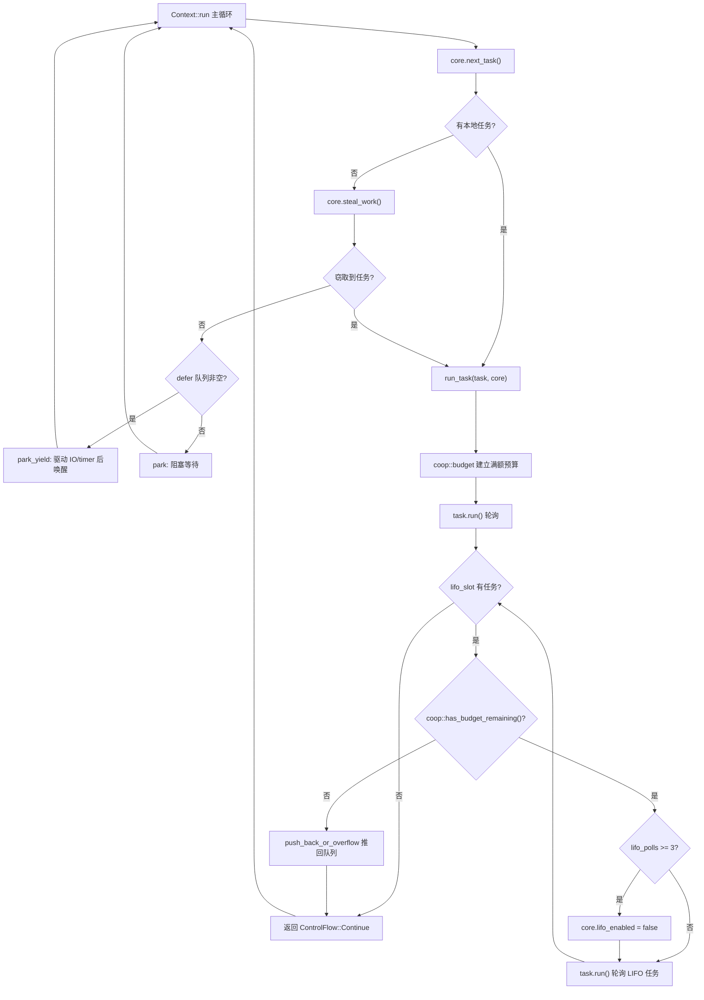

# Chapitre 12 : Ordonnancement coopératif et budget : comment le mécanisme coop empêche les tâches d'affamer l'ordonnanceur

Dans le chapitre précédent, nous avons vu comment tokio-stream et tokio-util réutilisent le Waker et le mécanisme d'ordonnancement sous-jacents pour étendre les capacités du cœur. Mais quel que soit le nombre de combinateurs étendus, la contradiction fondamentale d'un runtime asynchrone demeure : l'ordonnanceur doit répartir équitablement le temps CPU entre les tâches, alors que les tâches elles-mêmes ne sont pas préemptibles — une fois que le poll d'un Future commence à s'exécuter, l'ordonnanceur ne peut pas l'interrompre de l'extérieur. Si une tâche traite cent mille messages en boucle dans un seul poll, ou attend en boucle un Future toujours prêt dans une boucle, elle monopolisera le thread worker, privant à jamais les autres tâches du même thread de toute opportunité de polling. C'est le problème classique de la « tâche qui affame l'ordonnanceur ». La solution de Tokio n'est pas la préemption, mais la coopération : allouer à chaque tâche un budget limité par cycle d'ordonnancement, les opérations sur ressources consomment ce budget, et une fois le budget épuisé, la tâche doit céder volontairement. Ce chapitre explore en profondeur l'implémentation de ce mécanisme coop.

# 12.1 Le support du budget : stockage local au thread et structure Budget

> **[Design Inference & Architectural Trade-offs]**
> Si l'on compare l'ordonnanceur au seul serveur d'un restaurant, les tâches à des clients qui commandent sans cesse, alors le budget coop est la règle « chaque client peut commander au maximum N plats » — le serveur n'a pas besoin d'interrompre le client de force, il lui suffit de dire après N plats : « Reposez-vous un instant, je sers le client suivant ». Sans cette règle, un client bavard suffirait à paralyser tout le restaurant.

Le budget doit satisfaire deux contraintes : premièrement, il doit être accessible depuis une pile d'appels de profondeur arbitraire, sans devoir passer de paramètres couche par couche ; deuxièmement, il doit pouvoir distinguer « si l'on est actuellement à l'intérieur du runtime Tokio » — en dehors du runtime, l'appel à`poll`ne doit pas être soumis à la contrainte de budget. Tokio choisit d'utiliser le`block_on`stockage local au thread (TLS)**pour porter le budget, et de le gérer uniformément via le module**.`context`Le type central du budget est

. Bien que l'extrait de code source de ce chapitre ne donne pas directement la définition complète de`coop::Budget`, on peut déduire son contrat d'interface à partir des points d'utilisation de`coop.rs`:`worker.rs`Copier

[FACT:tokio/src/runtime/scheduler/multi_thread/worker.rs:695-795]

```rust
coop::budget(|| {
    // ... 轮询任务 ...
    task.run();
    // ...
    loop {
        // ...
        if !coop::has_budget_remaining() {
            // 预算耗尽，把 LIFO 任务推回队列
            core.run_queue.push_back_or_overflow(task, ...);
            return ControlFlow::Continue(core);
        }
        // ...
    }
})
```

établit une portée de budget,`coop::budget(closure)`interroge le budget restant, et plus loin nous verrons`coop::has_budget_remaining()`et`coop::stop()`. La sémantique de`coop::set()`。`budget`est : à l'entrée dans la closure, réinitialiser le budget du thread courant à une valeur pleine (128 par défaut) ; pendant l'exécution de la closure, toutes les opérations sur ressources partagent ce quota ; à la sortie de la closure, restaurer le budget extérieur.

> **[Design Inference & Architectural Trade-offs]**
> La valeur de budget 128 est une valeur empirique : elle est suffisamment grande pour qu'une boucle normale de traitement de messages (par exemple, traiter quelques dizaines de messages par poll) ne déclenche pas fréquemment de cession ; et suffisamment petite pour qu'une boucle incontrôlée ne puisse effectuer au maximum 128 opérations sur ressources avant de devoir céder, maintenant la latence dans une plage acceptable.

`Budget`Dans le TLS, il existe généralement sous la forme`Cell<Option<Budget>>`. La sémantique externe de`Option`est « si le thread courant se trouve dans le contexte du runtime Tokio » :`None`indique qu'on n'est pas dans le runtime (par exemple un`block_on`en dehors du runtime), auquel cas toutes les vérifications de budget passent directement.

# 12.2 Les points de consommation du budget : comment les opérations sur ressources le déduisent

Le budget ne se consomme pas de nulle part ; seules les**opérations sur ressources**le déduisent. Par opérations sur ressources, on entend les API qui peuvent être appelées en boucle infinie et qui interagissent avec le monde extérieur — le`send`/`recv`des channels, la lecture/écriture d'I/O,`yield_now`, etc. Prenons`mpsc::Sender::reserve`comme exemple : c'est le point d'entrée commun à tous les chemins d'envoi :

[FACT:tokio/src/sync/mpsc/bounded.rs:1272-1311]

```rust
async fn reserve_inner(&self, n: usize) -> Result> {
    crate::trace::async_trace_leaf().await;

    if n > self.max_capacity() {
        return Err(SendError(()));
    }
    // ... WakeReceiverOnDrop guard ...
    let guard = WakeReceiverOnDrop { chan: &self.chan };
    let result = self.chan.semaphore().semaphore.acquire(n).await;
    // ...
}
```

`reserve_inner`Avant d'acquérir réellement le permis du sémaphore,`crate::trace::async_trace_leaf()`passe par`async_trace_leaf`. Cet appel, qui semble n'être que du tracing, est en réalité l'un des points d'ancrage de la déduction du budget.`coop::poll_proceed`appelle en interne une fonction du type`Proceed`: si le budget est suffisant, déduire 1 et retourner`Pending`; si le budget est épuisé, enregistrer une action de « cession » — remettre le Waker de la tâche courante à l'ordonnanceur, retourner

, et faire terminer la tâche prématurément lors de ce poll.**C'est là la subtilité de coop :`Pending`**l'épuisement du budget ne lève pas d'erreur, mais déguise la « cession » en un`Pending`ordinaire. Le Future supérieur, voyant

`yield_now`, retourne naturellement ; l'ordonnanceur remet la tâche en file d'attente, et au prochain ordonnancement le budget est réinitialisé, la tâche reprenant là où elle s'était interrompue. Tout le processus est totalement transparent pour le code métier.**est l'expression la plus directe du mécanisme de budget : il ne consomme pas de budget, mais**：

[FACT:tokio/src/task/yield_now.rs:38-60]

```rust
pub async fn yield_now() {
    let mut yielded = false;
    poll_fn(|cx| {
        ready!(crate::trace::trace_leaf());

        if yielded {
            return Poll::Ready(());
        }

        yielded = true;

        // Don't wake the task immediately, as that would push it right back
        // onto the run queue and it could be polled again before other tasks
        // or the IO/timer driver get a chance to run. Instead, hand the waker
        // to the scheduler, which wakes deferred tasks only after it has run
        // out of ready tasks and polled the driver. When polled from outside
        // a Tokio runtime, the waker is woken immediately.
        context::defer(cx.waker());

        Poll::Pending
    })
    .await
}
```

Copier`context::defer(cx.waker())`Notez la ligne`wake`. Elle ne fait pas directement**, mais confie le Waker à la**file defer

de l'ordonnanceur. Pourquoi ? Les commentaires du code source le disent clairement : si l'on réveille immédiatement, la tâche est aussitôt repoussée dans la file d'exécution et peut être pollée à nouveau avant que le pilote I/O/timer ne s'exécute, ce qui prive la cession de son sens. La sémantique de la file defer est « attendre que le worker courant ait terminé les tâches prêtes et ait pollé les pilotes, puis réveiller ces tâches ».`Context`La file defer est définie dans le

[FACT:tokio/src/runtime/scheduler/multi_thread/worker.rs:247-257]

```rust
pub(crate) struct Context {
    worker: Arc,
    core: RefCell>>,
    /// Tasks to wake after resource drivers are polled. This is mostly to
    /// handle yielded tasks.
    pub(crate) defer: Defer,
}
```

`defer`Copier

[FACT:tokio/src/runtime/scheduler/multi_thread/worker.rs:613-621]

```rust
} else {
    // Wait for work
    core = if !self.defer.is_empty() {
        self.park_yield(core)
    } else {
        self.park(core)
    };
    core.stats.start_processing_scheduled_tasks();
}
```

Si la file defer n'est pas vide, le worker appelle`park_yield`— avec un timeout de 0, ce qui pilote les E/S et les timers, puis réveille les tâches dans defer. Cela garantit que les tâches « cédées » ne sont replanifiées qu'après l'exécution du pilote.

# 12.3 Établissement et restauration de la portée du budget : run_task et block_in_place

La portée du budget est établie dans`run_task`. Chaque fois qu'une tâche est interrogée,`coop::budget`englobe tout le processus d'interrogation :

[FACT:tokio/src/runtime/scheduler/multi_thread/worker.rs:691-704]

```rust
// Make the core available to the runtime context
*self.core.borrow_mut() = Some(core);

// Run the task
coop::budget(|| {
    // ...
    task.run();
    // ...
})
```

`coop::budget`À l'entrée, le budget dans le TLS est défini au maximum, et restauré à la sortie. Cela signifie que**chaque tâche obtient un budget entièrement nouveau à chaque interrogation**. Peu importe combien de fois`await`des opérations sur les ressources sont effectuées dans la tâche, si une seule`poll`consomme plus de 128, la cession est forcée.

Mais il y a un problème subtil ici : les tâches dans le slot LIFO sont**dans la même`budget`fermeture**interrogées. Regardez la boucle de`run_task`:

[FACT:tokio/src/runtime/scheduler/multi_thread/worker.rs:709-750]

```rust
let mut lifo_polls = 0;

// As long as there is budget remaining and a task exists in the
// `lifo_slot`, then keep running.
loop {
    let mut core = match self.core.borrow_mut().take() {
        Some(core) => core,
        None => {
            return ControlFlow::Break(());
        }
    };

    let task = match core.lifo_slot.take() {
        Some(task) => task,
        None => {
            self.reset_lifo_enabled(&mut core);
            core.stats.end_poll();
            return ControlFlow::Continue(core);
        }
    };

    if !coop::has_budget_remaining() {
        core.stats.end_poll();
        // Not enough budget left to run the LIFO task, push it to
        // the back of the queue and return.
        core.run_queue.push_back_or_overflow(task, ...);
        debug_assert!(core.lifo_enabled);
        return ControlFlow::Continue(core);
    }
    // ...
}
```

Point clé : les tâches dans le slot LIFO**partagent le budget de la tâche externe**. Le commentaire au début de`run_task`dit : « Tasks from the LIFO slot inherit the "parent"'s limits ». C'est une conception intentionnelle — si chaque tâche LIFO réinitialisait le budget, alors dans un scénario ping-pong (la tâche A réveille B, B réveille A), les deux tâches se planifieraient mutuellement à l'infini, le budget serait toujours réinitialisé, et le problème de famine persisterait. Le partage du budget signifie que A et B consomment ensemble au maximum 128 opérations sur les ressources, après quoi elles doivent céder.

Le slot LIFO lui-même possède également un limiteur de débit indépendant`MAX_LIFO_POLLS_PER_TICK`：

[FACT:tokio/src/runtime/scheduler/multi_thread/worker.rs:756-766]

```rust
// Disable the LIFO slot if we reach our limit
//
// In ping-ping style workloads where task A notifies task B,
// which notifies task A again, continuously prioritizing the
// LIFO slot can cause starvation as these two tasks will
// repeatedly schedule the other. To mitigate this, we limit the
// number of times the LIFO slot is prioritized.
if lifo_polls >= MAX_LIFO_POLLS_PER_TICK {
    core.lifo_enabled = false;
    super::counters::inc_lifo_capped();
}
```

`MAX_LIFO_POLLS_PER_TICK`La valeur de

[FACT:tokio/src/runtime/scheduler/multi_thread/worker.rs:263-263]

```rust
/// Value picked out of thin-air. Running the LIFO slot a handful of times
/// seems sufficient to benefit from locality. More than 3 times probably is
/// over-weighting. The value can be tuned in the future with data that shows
/// improvements.
const MAX_LIFO_POLLS_PER_TICK: usize = 3;
```

Copier**C'est**la deuxième ligne de défense

: même si le budget n'est pas épuisé, le slot LIFO est désactivé après avoir été priorisé 3 fois consécutivement, et les tâches suivantes passent par la file normale. Le budget gère le « volume total d'opérations sur les ressources », le limiteur LIFO gère le « nombre de réveils mutuels entre la même paire de tâches », les deux sont complémentaires.`block_in_place`La portée du budget a une exception importante dans`block_in_place`.**transfère le worker core à un autre thread, et le thread actuel entre en état de blocage. Le code bloquant n'est pas soumis au budget, il faut donc**suspendre

[FACT:tokio/src/runtime/scheduler/multi_thread/worker.rs:406-417]

```rust
if had_entered {
    // Unset the current task's budget. Blocking sections are not
    // constrained by task budgets.
    let _reset = Reset {
        take_core,
        budget: coop::stop(),
    };

    crate::runtime::context::exit_runtime(f)
} else {
    f()
}
```

`coop::stop()`Copier`None`retourne le budget actuel et le définit à`Reset`(c'est-à-dire « pas dans le runtime »),`Drop`le

[FACT:tokio/src/runtime/scheduler/multi_thread/worker.rs:374-397]

```rust
impl Drop for Reset {
    fn drop(&mut self) {
        with_current(|maybe_cx| {
            if let Some(cx) = maybe_cx {
                if self.take_core {
                    let core = cx.worker.core.take();
                    // ...
                    *cx_core = core;
                }

                // Reset the task budget as we are re-entering the
                // runtime.
                coop::set(self.budget);
            }
        });
    }
}
```

`coop::set(self.budget)`est restauré après la fin du blocage :`stop()`Copier`block_in_place`restaure le budget précédemment sauvegardé par

. Ainsi, le code bloquant synchrone dans



La figure ci-dessous montre le flux de contrôle complet depuis la planification d'une tâche jusqu'à la cession par épuisement du budget :`push_back_or_overflow`Copier

# On peut voir deux chemins de cession dans la figure : lorsque le budget est épuisé, la tâche LIFO est repoussée dans la file (

**), et lorsque la priorité LIFO consécutive dépasse la limite, le slot LIFO est désactivé. Les deux reviennent à la boucle principale, donnant au worker l'opportunité de traiter d'autres tâches ou de piloter.**12.4 Réflexions de conception, récupération d'erreurs et pièges en production`Budget`Pourquoi utiliser TLS plutôt que le passage explicite de paramètres ?`#[thread_local]`Les points de contrôle du budget sont dispersés profondément dans les modules channel, I/O, time, etc. Si les paramètres étaient passés explicitement, chaque API devrait avoir un paramètre

**supplémentaire, polluant toute l'interface publique. Le TLS rend le budget totalement transparent pour le code métier, au prix d'un accès TLS à chaque vérification. Tokio utilise**ou un TLS rapide spécifique à la plateforme pour réduire ce coût.`reserve_inner`Interaction entre épuisement du budget et sécurité d'annulation.`Pending`Lorsque l'épuisement du budget fait que`select!`retourne`select!`, la tâche peut se trouver dans une branche de`reserve_inner`. Si à ce moment une autre branche est prête,`WakeReceiverOnDrop`annule la branche actuelle —

[FACT:tokio/src/sync/mpsc/bounded.rs:1286-1299]

```rust
struct WakeReceiverOnDrop {
    chan: &'a chan::Tx,
}

impl Drop for WakeReceiverOnDrop {
    fn drop(&mut self) {
        use chan::Semaphore;

        let semaphore = self.chan.semaphore();
        if semaphore.is_closed() && semaphore.is_idle() {
            self.chan.wake_rx();
        }
    }
}
```

de`Pending`guard vérifie au drop que « le sémaphore est fermé et inactif » et réveille le récepteur :`Pending`Copier

**L'existence de ce guard montre que : le**déclenché par le budget et le véritable`spawn`« sans permis »`yield_now`。

**doivent se comporter de manière identique sur le chemin d'annulation, sinon le récepteur pourrait ne jamais recevoir la notification « channel fermé ».`block_in_place`Piège en production : latence cachée causée par l'épuisement du budget.**Un phénomène courant est : une tâche traitant des messages ralentit soudainement, mais l'utilisation CPU n'est pas élevée. Lors du diagnostic, on soupçonne facilement une contention de verrous ou des E/S, alors qu'en réalité la tâche a traité plus de 128 messages dans un seul poll, déclenchant la cession de budget, et chaque cession passe par un cycle complet « remise en file → replanification → interrogation du pilote ». Si le traitement des messages est lui-même rapide, ce coût de planification peut représenter une proportion élevée. La solution est de découper le traitement par lots en plusieurs tâches`block_in_place`, ou d'insérer explicitement`coop::stop()`dans la boucle.`coop::stop()`Frontière entre budget et`had_entered`.`block_in_place`On a vu précédemment que`f()`fait`maybe_move_runtime`suspendre le budget. Mais attention :

[FACT:tokio/src/runtime/scheduler/multi_thread/worker.rs:424-464]

```rust
with_current(|maybe_cx| {
    match (
        crate::runtime::context::current_enter_context(),
        maybe_cx.is_some(),
    ) {
        (context::EnterRuntime::Entered { .. }, true) => {
            had_entered = true;
        }
        (
            context::EnterRuntime::Entered {
                allow_block_in_place,
            },
            false,
        ) => {
            if allow_block_in_place {
                had_entered = true;
                return Ok(());
            } else {
                return Err(
                    "can call blocking only when running on the multi-threaded runtime",
                );
            }
        }
        (context::EnterRuntime::NotEntered, true) => {
            return Ok(());
        }
        (context::EnterRuntime::NotEntered, false) => {
            return Ok(());
        }
    }
    // ...
})
```

est vrai, c'est-à-dire lorsqu'on est effectivement sur un thread worker du runtime. Si`block_on`est appelé en dehors du runtime,`block_in_place`s'exécute directement, l'état du budget reste inchangé. Ce branchement est effectué dans

> **[Design Inference & Architectural Trade-offs]**
> **Copier**Les quatre combinaisons correspondent respectivement à : dans un thread worker,`Builder`option. C'est intentionnel : la valeur du budget influence le compromis entre équité d'ordonnancement et débit ; si l'on permettait aux utilisateurs de l'ajuster librement, il serait facile de produire une configuration où « un budget trop grand provoque la famine » ou « un budget trop petit fait exploser le coût d'ordonnancement ». Tokio choisit d'en faire un invariant interne.

# Résumé du chapitre

Le mécanisme coop résout le problème d'équité d'un ordonnanceur non préemptif grâce à une conception en trois couches :

1. **Porteur du budget**：`coop::Budget`stocké dans le TLS,`Option`la couche externe distingue l'intérieur et l'extérieur du runtime,`coop::budget`établit une portée à pleine capacité,`coop::stop`/`coop::set`prend en charge la pause et la reprise (`block_in_place`scénario).

2. **Points de consommation**: opérations sur les ressources (envoi/réception sur channel, I/O,`yield_now`) via`coop::poll_proceed`décrémentent le budget ; lorsqu'il est épuisé, le « yield » est déguisé en`Pending`, de manière transparente pour le code métier.

3. **Chemin de yield**：`yield_now`via`context::defer`remet le Waker à la file defer, garantissant une reprogrammation seulement après le polling du driver ; les tâches du slot LIFO partagent le budget de la tâche parente et disposent d'une limitation de débit indépendante de`MAX_LIFO_POLLS_PER_TICK = 3`.

L'idée clé de ce mécanisme est :**l'équité n'exige pas la préemption, il suffit que la « boucle infinie » s'interrompe naturellement après un nombre fini d'étapes**. Le budget est la mesure de ce « nombre fini d'étapes ».

# Réflexions et auto-évaluation du chapitre

Q1 : Si l'on modifiait`run_task`dans`coop::budget`la boucle LIFO à l'intérieur de la closure pour appeler`coop::budget`à chaque polling d'une tâche LIFO afin de réinitialiser le budget, que se passerait-il dans un scénario ping-pong (la tâche A réveille B, B réveille A) ? Pourquoi le code source choisit-il de faire partager le budget de la tâche parente aux tâches LIFO ?

**Analyse de référence**: le code source indique explicitement dans les commentaires de`run_task`que « Tasks from the LIFO slot inherit the "parent"'s limits »[FACT:tokio/src/runtime/scheduler/multi_thread/worker.rs:679-682]. Si chaque tâche LIFO réinitialisait le budget, alors dans le scénario ping-pong A→B→A→B, chaque polling obtiendrait un budget plein, et les deux tâches pourraient s'ordonnancer mutuellement à l'infini, sans jamais céder par épuisement du budget. Bien que`MAX_LIFO_POLLS_PER_TICK = 3`la limitation de débit désactive le slot LIFO après 3 fois[FACT:tokio/src/runtime/scheduler/multi_thread/worker.rs:756-766], une fois le LIFO désactivé, les tâches passent par la file normale ; si la file ne contient que A et B, elles continueront d'être ordonnancées en alternance, mais sans bénéficier de la priorité LIFO. Le partage du budget garantit au niveau du volume total d'opérations sur les ressources : A et B réunis peuvent consommer au plus 128 opérations sur les ressources avant de devoir céder, laissant une chance aux autres tâches et au driver. Les deux lignes de défense sont complémentaires et indispensables.

Q2: `yield_now`utilise`context::defer(cx.waker())`plutôt que`cx.waker().wake_by_ref()`. Supposons que l'on remplace`defer`par un`wake`direct ; dans un scénario mono-worker multi-tâches, quelles seraient les conséquences si une tâche appelait`yield_now`en boucle ? Analysez en lien avec la branche`park_yield`de la boucle principale du worker.

**Analyse de référence**：`yield_now`les commentaires de[FACT:tokio/src/task/yield_now.rs:49-54]expliquent la raison : un wake direct remettrait immédiatement la tâche dans la file d'exécution, et elle pourrait être re-pollée avant que le driver I/O/timer ne s'exécute`yield_now`. Dans un scénario mono-worker, si une tâche appelle`next_task`en boucle et fait un wake direct à chaque fois, la boucle principale du worker`park_yield`prendrait immédiatement cette tâche et la re-pollerait,[FACT:tokio/src/runtime/scheduler/multi_thread/worker.rs:613-621]la branche (chargée de piloter les I/O et les timers)`defer`ne serait jamais exécutée, car la file defer est vide et la file locale contient toujours des tâches. Il en résulterait que les événements I/O et les timers ne seraient jamais traités, et tout le runtime serait « faussement actif » — les tâches tournent, mais les événements du monde extérieur ne peuvent pas progresser.

Q3: `block_in_place`la file garantit qu'une tâche cédée ne sera réveillée qu'après le polling du driver, laissant ainsi une fenêtre d'exécution au driver.`coop::stop()`dans`None`，`Reset::drop`définit le budget à`coop::set(self.budget)`dans`block_in_place`restaure. Si à l'intérieur de la closure`f`de`block_in_place`on appelle à nouveau`maybe_move_runtime`(imbrication), que devient l'état du budget ?

**Quelle branche de**gère ce cas ?`block_in_place`Analyse de référence`maybe_move_runtime`: l'imbrication de`(context::EnterRuntime::NotEntered, true)`est gérée par la branche[FACT:tokio/src/runtime/scheduler/multi_thread/worker.rs:454-458]dans`return Ok(())`. Cette branche fait directement`had_entered`, sans définir`block_in_place`, donc le`if had_entered`de la couche externe`coop::stop()`est évalué comme faux, et`Reset`ne sera pas appelé à nouveau ni un nouveau`f()`créé. Le commentaire précise : « This is a nested call to block_in_place (we already exited). All the necessary setup has already been done. » — la couche externe a déjà mis le budget en pause et transféré le core ; la couche interne n'a qu'à exécuter directement`coop::stop()`. Si la couche interne appelait à nouveau`None`, elle sauvegarderait une seconde fois un budget déjà`Reset::drop`, et la restauration`None`pourrait rétablir une valeur erronée (

au lieu du budget d'origine de la couche externe), entraînant une perte définitive du budget ; toutes les opérations ultérieures sur les ressources de la tâche ne seraient alors plus contraintes.
