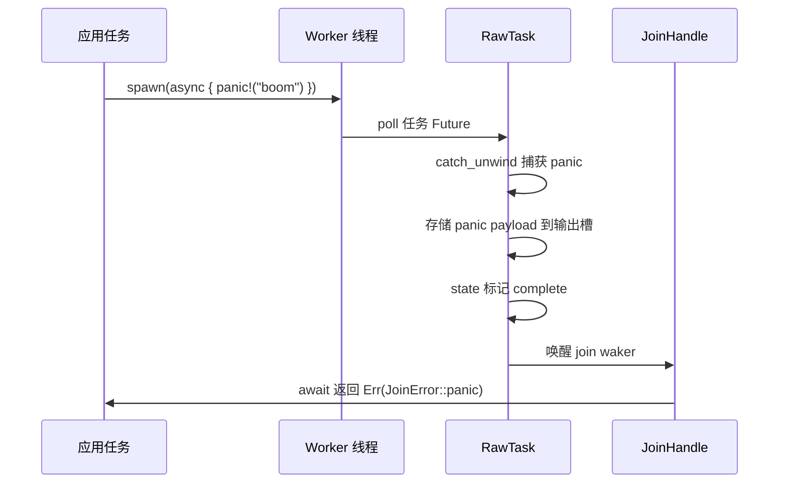
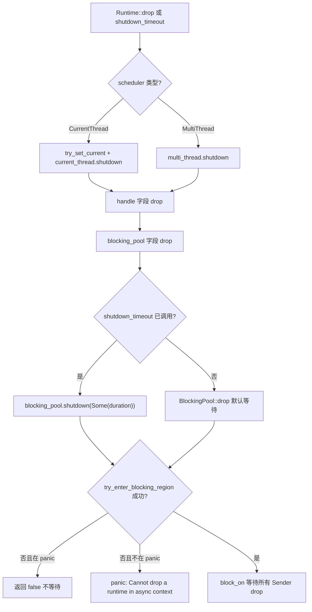
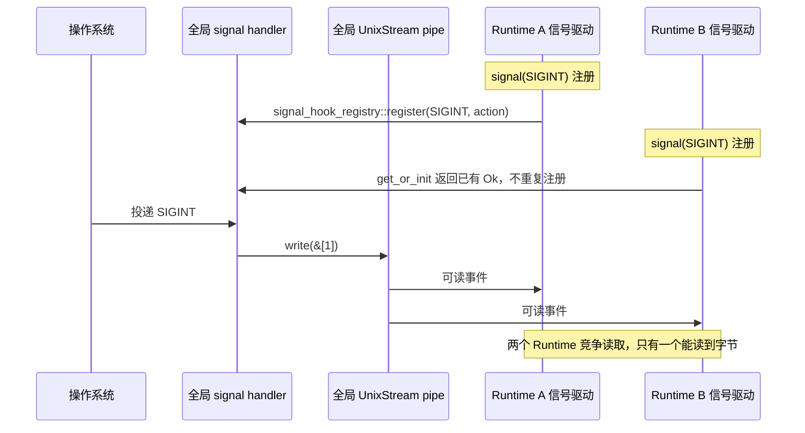

# Chapitre suivant : Chapitre 13 →

Dans le chapitre précédent, nous avons décomposé le budget de coopération coop : chaque tâche ne dispose que d'un budget limité au cours d'un cycle de planification, et doit céder une fois épuisé, évitant ainsi qu'une seule tâche affame les autres. Mais le mécanisme de budget ne résout que le problème de « planification équitable » ; dans un environnement de production réel, il existe une autre catégorie de pièges plus insidieux — la sûreté d'annulation, la propagation de panic et l'ordre d'arrêt. Lorsque select! annule un Future, lorsqu'un panic de tâche est capturé, lorsque le Runtime commence à s'arrêter, le comportement aux limites du code va souvent à l'encontre de l'intuition. Ce chapitre commence par la sûreté d'annulation, en examinant d'abord ce qu'un Future abandonné par drop perd réellement.

# 13.2 Propagation de panic : comment JoinError capture les effondrements

## Modèle intuitif

Un panic de tâche Tokio ne fait pas planter tout le processus (sauf si panic=abort), mais est capturé, empaqueté en`JoinError`, et renvoyé via`JoinHandle::await`. C'est comme un accident à un poste sur une chaîne de montage : le filet de sécurité rattrape l'ouvrier, mais le produit est mis au rebut — vous obtenez un « rapport d'accident » plutôt que le produit.

## Structure de données et états

`JoinHandle<T>`Le`Future::Output`de`super::Result<T>`est`Result<T, JoinError>` [FACT:tokio/src/runtime/task/join.rs:325]。`JoinError`, c'est-à-dire que

```rust
let join_handle = tokio::spawn(async { panic!("boom"); });
let err = join_handle.await.unwrap_err();
assert!(err.is_panic());
```

[FACT:tokio/src/runtime/task/join.rs:121-127]

Copier`RawTask`Le mécanisme de capture du panic se trouve dans le chemin poll de`catch_unwind`: lors du poll de la tâche, on l'enveloppe avec`JoinHandle::poll`, et après le panic, la payload est stockée dans le slot de sortie de la tâche, l'état est marqué comme complete, puis le join waker est réveillé.`try_read_output`Ce qui est lu via`Err(JoinError::panic(payload))`。

## est



Copier`JoinError`Point clé : la payload du panic est intégralement préservée,`std::error::Error`implémente`into_panic()`, on peut récupérer`Box<dyn Any + Send>`via`downcast_ref::<&str>()`, puis extraire le message de panic avec

## Réflexions de conception et pièges

**Piège 1 :`JoinHandle`Le`UnwindSafe`de**

```rust
impl UnwindSafe for JoinHandle {}
impl RefUnwindSafe for JoinHandle {}
```

[FACT:tokio/src/runtime/task/join.rs:176-181]

Copier`T: UnwindSafe`C'est une implémentation inconditionnelle, qui n'exige pas`JoinHandle`. Raison :`T`，`T`ne détient pas lui-même`catch_unwind`Dans l'allocation de tâche sur le tas, lors d'un panic, il a déjà été isolé par`T`. Donc même si`UnwindSafe`，`JoinHandle`n'est pas

**, c'est sûr.**Piège 2 : un panic ne se propage pas automatiquement à la tâche parente.`JoinHandle`Si la tâche A spawn la tâche B, et que B panic, A n'en est pas notifiée automatiquement, sauf si A a await le

**de B. Si A n'a pas await, le panic de B est silencieusement avalé. C'est l'une des sources de bugs les plus insidieuses en production.`spawn_blocking`Piège 3 :**Le panic de`catch_unwind`est également capturé.`Mutex`Les workers du pool de threads bloquants enveloppent aussi les tâches avec`std::sync::Mutex`; après un panic, le thread ne meurt pas, mais retourne dans le pool pour continuer à prendre du travail. Mais si vous détenez un

**dans une tâche bloquante et ne le libérez pas lors du panic, cela provoque un empoisonnement de verrou — c'est le comportement inhérent de**, Tokio n'intervient pas.`catch_unwind`Piège 4 : panic lors du drop du Runtime.

# Si une tâche panic pendant le drop du Runtime,

## reste effectif, mais à ce moment le join waker peut déjà être invalide, et la payload du panic sera abandonnée. C'est un sous-ensemble du problème d'ordre d'arrêt, développé dans la section suivante.

13.3 Ordre d'arrêt : nettoyage des threads bloquants et des ressources d'E/S

## Modèle intuitif

`Runtime`L'arrêt du Runtime ressemble à la fermeture d'un restaurant : d'abord on demande à l'accueil d'arrêter de prendre des clients (arrêter d'accepter de nouvelles tâches), puis on attend que la cuisine termine les plats en cours (les tâches asynchrones atteignent le prochain point de yield), enfin on attend que les extras sous-traitants terminent (les threads bloquants retournent). Un ordre erroné pose problème — par exemple, si l'on renvoie d'abord les extras, les plats de la cuisine ne seront jamais terminés.

```rust
pub struct Runtime {
    scheduler: Scheduler,
    handle: Handle,
    blocking_pool: BlockingPool,
}
```

[FACT:tokio/src/runtime/runtime.rs:97-106]

`Drop`Les trois champs de

```rust
impl Drop for Runtime {
    fn drop(&mut self) {
        match &mut self.scheduler {
            Scheduler::CurrentThread(current_thread) => {
                let _guard = context::try_set_current(&self.handle.inner);
                current_thread.shutdown(&self.handle.inner);
            }
            Scheduler::MultiThread(multi_thread) => {
                multi_thread.shutdown(&self.handle.inner);
            }
        }
    }
}
```

[FACT:tokio/src/runtime/runtime.rs:506-521]

Copier`Drop`Implémentation de`scheduler`，**:`blocking_pool`**。`blocking_pool`Copier`Drop`Remarque :`Runtime::drop`ne traite que`scheduler` → `handle` → `blocking_pool`ne traite pas explicitement

L'arrêt de`shutdown_timeout`se produit dans son propre

```rust
pub fn shutdown_timeout(mut self, duration: Duration) {
    self.handle.inner.shutdown();
    self.blocking_pool.shutdown(Some(duration));
}
```

[FACT:tokio/src/runtime/runtime.rs:457-461]

. L'ordre de drop des champs est l'ordre de déclaration :`handle.inner.shutdown()`. Donc le pool bloquant est arrêté en dernier.`blocking_pool.shutdown(Some(duration))`Mais`duration`。

## contrôle explicitement l'ordre :

`blocking/shutdown.rs`Copier

```rust
pub(super) struct Sender {
    _tx: Arc>,
}

pub(super) struct Receiver {
    rx: oneshot::Receiver,
}
```

[FACT:tokio/src/runtime/blocking/shutdown.rs:13-19]

notifie le planificateur et le driver d'E/S de s'arrêter, puis`Sender`attend les tâches bloquantes, au maximum`Arc<oneshot::Sender>`Mécanisme sous-jacent de l'arrêt du pool bloquant`Sender`utilise un ingénieux oneshot channel :`Receiver`Copier`wait`Chaque worker bloquant détient un clone de

```rust
pub(crate) fn wait(&mut self, timeout: Option) -> bool {
    use crate::runtime::context::try_enter_blocking_region;

    if timeout == Some(Duration::from_nanos(0)) {
        return false;
    }

    let mut e = match try_enter_blocking_region() {
        Some(enter) => enter,
        _ => {
            if std::thread::panicking() {
                return false;
            } else {
                panic!(
                    "Cannot drop a runtime in a context where blocking is not allowed. \
                    This happens when a runtime is dropped from within an asynchronous context."
                );
            }
        }
    };

    if let Some(timeout) = timeout {
        e.block_on_timeout(&mut self.rx, timeout).is_ok()
    } else {
        let _ = e.block_on(&mut self.rx);
        true
    }
}
```

[FACT:tokio/src/runtime/blocking/shutdown.rs:37-70]

). Lorsque tous les workers ont quitté et que tous les

1. `timeout == Some(0)`sont drop,`shutdown_background`reçoit la notification.

2. `try_enter_blocking_region()`Méthode`None`。

:

Copier`block_on_timeout`Analyse étape par étape :

## retourne directement false — c'est le chemin de



## Tente d'entrer dans la zone bloquante. Si l'on est actuellement dans un contexte asynchrone (par exemple, drop du Runtime dans une tâche async), retourne

**3. En cas d'échec d'entrée, si un panic est en cours, retourne false (ne pas panic pendant un panic) ; sinon panic avec un message d'erreur explicite.**Le message d'erreur est très clair : « Cannot drop a runtime in a context where blocking is not allowed »[FACT:tokio/src/runtime/blocking/shutdown.rs:51-54]. La solution consiste à utiliser`shutdown_background()`, ce qui équivaut à`shutdown_timeout(Duration::from_nanos(0))` [FACT:tokio/src/runtime/runtime.rs:494-496], sans attendre les tâches bloquantes.

**Piège 2 :`shutdown_background`va fuiter des tâches bloquantes.**La documentation avertit explicitement « this may result in a resource leak (in that any blocking tasks are still running until they return) »[FACT:tokio/src/runtime/runtime.rs:470-472]. Les tâches bloquantes continueront de s'exécuter jusqu'à leur retour naturel, mais le Runtime ayant déjà été drop, les ressources qu'elles détiennent peuvent être déjà invalides.

**Piège 3 : les ressources d'E/S deviennent invalides après le drop du Runtime.**La documentation indique « Once the runtime has been dropped, any outstanding I/O resources bound to it will no longer function »[FACT:tokio/src/runtime/runtime.rs:52-54]。`is_rt_shutdown_err`La fonction[FACT:tokio/src/runtime/runtime.rs:585-593]。

**sert précisément à détecter ce type d'erreur.`Drop`Piège 4 :**attend indéfiniment par défaut.`Drop` implementation waits forever for this」[FACT:tokio/src/runtime/runtime.rs:43-44]La documentation précise « The`shutdown_timeout`. Si une tâche bloquante se bloque (par exemple une boucle infinie), le drop du Runtime suspendra indéfiniment. En production, il faut utiliser

# pour fixer une limite.

## 13.4 Gestion des signaux et conflits entre plusieurs Runtime

Modèle intuitif`Signal`Les signaux Unix sont au niveau du processus, mais le

## de Tokio est lié au Runtime. C'est comme si tout l'immeuble partageait une alarme incendie, mais que chaque pièce installait son propre récepteur — la première personne à installer un récepteur modifie le câblage de l'alarme, et les suivants ne peuvent que partager cette modification.

`signal_enable`Structures de données et état global

```rust
fn signal_enable(signal: SignalKind, handle: &Handle) -> io::Result {
    let signal = signal.0;
    if signal  slot,
        None => return Err(io::Error::other("signal too large")),
    };

    siginfo
        .init
        .get_or_init(|| {
            unsafe { signal_hook_registry::register(signal, move || action(globals, signal)) }
                .map(|_| ())
                .map_err(|e| e.raw_os_error())
        })
        .map_err(|e| {
            e.map_or_else(
                || Error::other("registering signal handler failed"),
                || Error::from_raw_os_error,
            )
        })
}
```

[FACT:tokio/src/signal/unix.rs:266-296]

Copier

1. `signal <= 0 || FORBIDDEN.contains(&signal)`Points clés :

2. `handle.check_inner()`rejette les signaux illégaux.

3. `siginfo.init.get_or_init(...)`vérifie si le driver de signaux est en cours d'exécution — si le Runtime est déjà fermé, cela échouera ici.`OnceLock`utilise`get_or_init`pour garantir qu'un seul handler OS est enregistré par signal.`signal_hook_registry::register`La closure de

appelle`action(globals, signal)`, qui est un enregistrement global, au niveau du processus.`globals.record_event(signal)`4. Le handler enregistré est[FACT:tokio/src/signal/unix.rs:252-259]。

## , il fait deux choses :

`globals()`enregistre l'événement, puis écrit un octet dans le pipe pour réveiller le driver`Globals`，`OsExtraData`Origine des conflits entre plusieurs Runtime`UnixStream`Ce que retourne

```rust
pub(crate) struct OsExtraData {
    sender: UnixStream,
    pub(crate) receiver: UnixStream,
}
```

[FACT:tokio/src/signal/unix.rs:61-64]

`Default`global au niveau du processus.`UnixStream` [FACT:tokio/src/signal/unix.rs:61-64]Le

dans`signal_enable`est également global :`handle.check_inner()`Copier**L'implémentation de**crée une paire de`signal_hook_registry::register`. Ce pipe est globalement unique, tous les drivers de signaux des Runtime le partagent.**Le problème se pose :**Dans**,**vérifie le driver de signaux du`get_or_init`Runtime actuel`Ok(())`. Mais le handler enregistré par

## est



## , et il écrit dans le

**pipe global**. Si le Runtime A enregistre SIGINT en premier, puis le Runtime B enregistre aussi SIGINT,[FACT:tokio/src/signal/unix.rs:379-380]retournera directement le`Signal`existant, sans réenregistrer. Mais le driver de signaux du Runtime B lira les données depuis le pipe global — les deux Runtime se disputeront les octets du même pipe.[FACT:tokio/src/signal/unix.rs:338-340]。

**Walkthrough guidé par scénario : compétition de signaux entre plusieurs Runtime**Copier`poll` is called, all signal notifications are coalesced into one item returned from `poll`」[FACT:tokio/src/signal/unix.rs:312-315]Réflexions de conception et pièges

**Piège 1 : le gestionnaire de signaux n'est jamais désenregistré.**La documentation avertit explicitement « Once a signal handler is registered with the process the underlying libc signal handler is never unregistered »`signal_hook`. Même si l'instance

**est drop, les signaux suivants seront toujours capturés par Tokio, et le comportement par défaut ne sera pas restauré`signal`Piège 2 : les signaux sont fusionnés.**La documentation indique « before`rt` feature flag is not enabled」[FACT:tokio/src/signal/unix.rs:398-405]. Si vous recevez 10 SIGINT mais ne poll qu'une seule fois, vous ne verrez qu'un seul événement. C'est une caractéristique des signaux Unix eux-mêmes (les signaux standard ne sont pas mis en file d'attente), Tokio n'effectue pas de fusion supplémentaire.`signal()`Piège 3 : les signaux peuvent être perdus avec plusieurs Runtime.

**Comme le pipe global est lu en compétition par plusieurs Runtime, un Runtime peut consommer l'octet tandis qu'un autre attendra indéfiniment. En production, il faut traiter les signaux dans un seul Runtime, ou utiliser`recv()`pour gérer soi-même.**Piège 4 :`tokio::select!` and another branch completes first, then it is guaranteed that no signal is lost」[FACT:tokio/src/signal/unix.rs:423-427]conditions de panic de la fonction.`EventInfo`La documentation indique « This function panics if there is no current reactor set, or if the`recv()`. Appeler

# en dehors d'un Runtime provoquera un panic.

Piège 5 :**la sûreté d'annulation de**。

- `JoinHandle`. La documentation garantit « This method is cancel safe. If you use it as a branch in
- . Cela s'explique par le fait que les événements de signaux sont stockés dans le`Handle`, un ordre incorrect entraînera un deadlock ou une panique.
- Les signaux entrent en conflit avec plusieurs Runtime, car le handler et le pipe sont des états globaux au niveau du processus, tandis que`Signal`est une vue au niveau du Runtime.

Après avoir compris ce modèle, la liste des pièges à éviter peut être résumée en trois principes :

1. **Annulation sûre = l'état est en dehors du Future.**Si le Future contient un tampon interne, le drop entraînera une perte de données.`JoinHandle`、`Signal::recv`、`tokio::sync::mpsc::Receiver::recv`satisfont tous cette condition.

2. **Ordre de fermeture = ordre inverse de la direction des dépendances.**Celui qui dépend de l'autre, on ferme d'abord celui dont on dépend. Le planificateur dépend du pilote d'E/S, donc on ferme d'abord le planificateur ; le pool bloquant est indépendant, on le ferme en dernier.

3. **État global = conflit entre plusieurs instances.**Toute ressource au niveau du processus (handler de signaux, pipe, table des descripteurs de fichiers) entrera en conflit avec plusieurs Runtime ; soit on se limite à un seul Runtime, soit on utilise une synchronisation externe.

# Résumé de ce chapitre

# Réflexions et auto-évaluation de ce chapitre

Q1 : Si l'on supprime`JoinHandle::poll`dans`coop::poll_proceed(cx)`, dans quel scénario cela entraînerait-il la famine d'autres tâches ? Pourquoi`try_read_output`ne consomme-t-il pas de budget en lui-même ?

**Analyse de référence**：`coop::poll_proceed(cx)`consomme le budget de coopération à l'endroit[FACT:tokio/src/runtime/task/join.rs:325-325]. Si on le supprime, une tâche qui, dans une boucle, appelle répétitivement`select!`plusieurs`JoinHandle`peut, en un seul cycle de planification, interroger indéfiniment tous les handles sans jamais retourner`Pending`, affamant ainsi les autres tâches sur le même worker.`try_read_output`ne consomme pas de budget en lui-même, car il ne s'agit que d'une lecture mémoire + éventuellement d'un stockage de waker, sans E/S ni contention de verrou, avec un coût extrêmement faible. L'intention de conception du mécanisme de budget est de contraindre les « opérations susceptibles de s'exécuter longtemps », et non de facturer chaque poll. Notez que`coop.made_progress()`n'appelle`ret.is_ready()`que lorsque[FACT:tokio/src/runtime/task/join.rs:349-351], c'est-à-dire qu'il ne restitue le budget que lorsqu'il obtient réellement une sortie — cela vise à empêcher que des opérations « interrogées mais sans résultat » accumulent une consommation de budget.

Q2：`blocking/shutdown.rs`Dans la méthode`wait`de`try_enter_blocking_region()`, si`None`retourne`false`et qu'un panic est en cours, pourquoi choisir de retourner

**plutôt que de continuer à attendre ? Que se passerait-il si l'on changeait pour continuer à attendre ?**：`try_enter_blocking_region()`Analyse de référence`None`retourner[FACT:tokio/src/runtime/blocking/shutdown.rs:44-57]indique que l'on est actuellement dans un contexte asynchrone, où il n'est pas permis de bloquer`false`. Si un panic est en cours à ce moment-là, le code choisit de retourner[FACT:tokio/src/runtime/blocking/shutdown.rs:47-49]sans attendre`block_on`. La raison est la suivante : un nouveau panic pendant le déroulement d'un panic entraîne un abort du processus (double panic). Si l'on changeait pour continuer à attendre, il faudrait appeler`block_on`, or dans un contexte asynchrone`false`provoque un panic — un panic pendant le déroulement d'un panic abortit directement le processus, perdant toutes les informations de diagnostic. Retourner

permet au drop de se terminer, préservant les informations de panic. C'est une conception de « dégradation gracieuse » : une fermeture incomplète vaut mieux qu'un effondrement du processus.`Signal`Q3 : Supposons que vous ayez créé dans le Runtime A`Signal`pour écouter SIGTERM, puis déplacé`signal_enable`dans le Runtime B pour le poll.`handle.check_inner()`Dans`Signal`, quel Runtime

**vérifie-t-il ? Si le Runtime A est drop en premier, le**：`signal_enable`dans le Runtime B peut-il encore recevoir le signal ?`signal()`Analyse de référence`handle`s'exécute lors de l'appel[FACT:tokio/src/signal/unix.rs:398-405]。`check_inner()`, à ce moment-là[FACT:tokio/src/signal/unix.rs:275]。`Signal`est celui du Runtime A`RxFuture`vérifie le pilote de signaux du Runtime A`watch::Receiver<()>` [FACT:tokio/src/signal/unix.rs:366-368]contient en interne`Globals`, qui encapsule`EventInfo`, ce receiver est enregistré sur le`record_event`global`EventInfo`. Si le Runtime A est drop, son pilote de signaux cesse de lire les données du pipe global, mais le handler global continuera à`Signal`et à écrire dans le pipe. Si le pilote de signaux du Runtime B est également en cours d'exécution, il lira les données du pipe et déclenchera`Signal` **, réveillant ainsi le waker de**. Donc le`Signal`dans le Runtime B peut

# encore recevoir le signal, mais cela dépend de si le Runtime B a un pilote de signaux en cours d'exécution. Si le Runtime B n'a pas de pilote de signaux (par exemple, la feature signal n'est pas activée ou le pilote est fermé), personne ne lit les données du pipe,

n'obtiendra jamais de réveil. C'est la fragilité de la gestion des signaux avec plusieurs Runtime.`catch_unwind`Transition de fin de chapitre`Globals`Annulation sûre, propagation de panic, ordre de fermeture, conflit de signaux — la racine commune de ces quatre problèmes est l'ambiguïté de la « propriété de l'état » aux frontières asynchrones. Tokio, en plaçant l'état sur le tas, en gérant le cycle de vie par comptage de références, en isolant les panic avec

, et en partageant l'état des signaux via un

Nous avons ainsi parcouru les zones limites les plus piégeuses de Tokio en production : la sécurité d'annulation repose sur un stockage de sortie sur le tas et sur l'atomicité de try_read_output ; JoinHandle::drop n'annule pas la tâche, seul abort l'annule réellement mais reste sans effet sur spawn_blocking ; un panic capturé par catch_unwind est empaqueté en JoinError et silencieusement perdu si on ne l'await pas ; l'arrêt du Runtime suit un ordre strict, et un drop dans un contexte async provoque un panic ; les handlers de signaux sont un état global au niveau du processus, jamais désenregistrés après inscription. Derrière ces règles se cachent les arbitrages répétés de Tokio entre correction et performance. Dans le prochain chapitre, nous quitterons les mécanismes concrets pour prendre de la hauteur architecturale, revenir sur l'origine de ces arbitrages, et envisager où io_uring, la refonte des drivers et l'interface d'exécuteur personnalisé mèneront Tokio.
