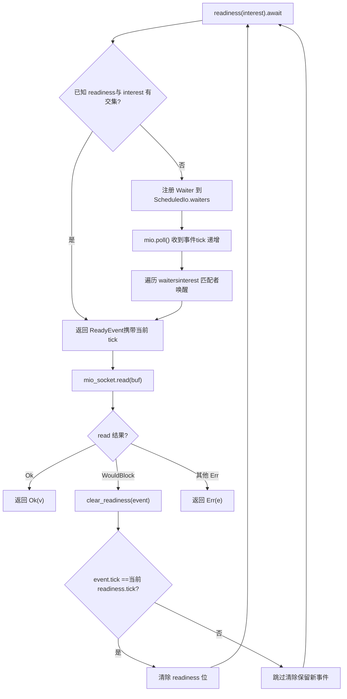
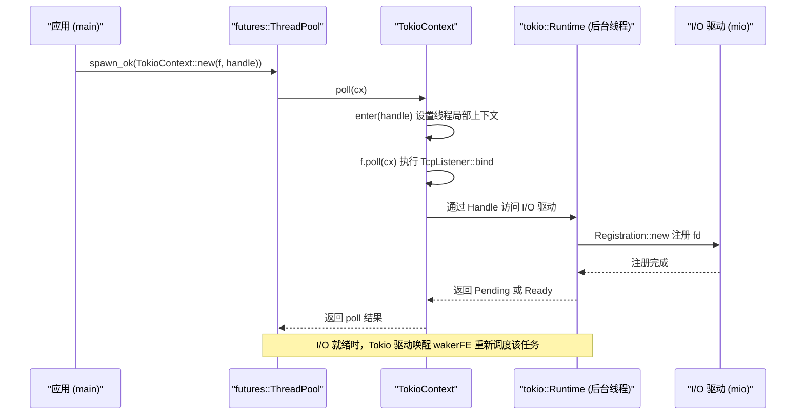

# Chapitre 14 : Arbitrages architecturaux et évolution future : de io_uring aux drivers enfichables

Dans le chapitre précédent, nous avons passé en revue quatre catégories de pièges de production : sécurité d'annulation, propagation de panic, ordre d'arrêt et conflits de signaux. Bien qu'ils semblent dispersés, ils pointent tous vers le même problème architectural : comment la propriété de l'état est clairement délimitée aux frontières asynchrones. Or, la manière de délimiter cette propriété est précisément déterminée par les trois décisions architecturales les plus fondamentales du runtime — comment les tâches sont ordonnancées, comment les événements d'I/O sont distribués, et comment la correction concurrente est vérifiée. Ce chapitre ne plonge plus dans les détails d'implémentation d'une fonction spécifique, mais se place au niveau architectural pour revenir sur les choix de Tokio concernant ces décisions, et, en suivant les pistes d'évolution déjà présentes dans la documentation officielle et le code source, examiner où io_uring, la refonte des drivers et l'interface d'exécuteur personnalisé mèneront Tokio. Après ce chapitre, vous devriez pouvoir répondre à une question pratique : quand faut-il étendre Tokio, et quand faut-il le contourner.

# I. Trois arbitrages historiques : pourquoi les choses sont ce qu'elles sont

## Modèle intuitif

Imaginez Tokio comme un restaurant ouvert depuis dix ans. La rotation en cuisine (work-stealing), l'effectif indépendant des serveurs (séparation du driver d'I/O et de l'ordonnanceur), et le système d'inspection sanitaire en cuisine (vérification de concurrence par loom) n'ont pas été conçus dès le premier jour, mais ont évolué progressivement au fil de l'augmentation du nombre de clients et de la complexité des plats. Comprendre ces évolutions permet de distinguer les choix visionnaires des héritages historiques.

## Arbitrage un : work-stealing plutôt qu'une file globale

> **[Design Inference & Architectural Trade-offs]**
> Une file globale est l'implémentation la plus simple : toutes les tâches entrent dans une`Mutex<VecDeque>`, et les threads worker se disputent le verrou pour prendre des tâches. Mais la contention de verrou s'aggrave avec le nombre de cœurs, et la localité de cache est mauvaise — le cœur sur lequel une tâche est créée et celui sur lequel elle est exécutée sont totalement aléatoires.

Le compromis du work-stealing est le suivant : chaque worker possède une file locale,`spawn`privilégie l'entrée dans la file locale (sans verrou, favorable au cache), et ne vole à la queue de la file d'un autre worker que lorsque la file locale est vide. Le coût est un délai dans l'équilibrage de charge, et le vol lui-même nécessite des opérations atomiques et des barrières mémoire. Tokio a choisi cette option parce que les serveurs modernes ont souvent des dizaines de cœurs, et le coût de la contention de verrou est bien supérieur au coût occasionnel du vol.

> **[Design Inference & Architectural Trade-offs]**
> La condition limite de cette décision est la suivante :**la granularité des tâches ne doit pas être trop fine**. Si chaque tâche ne fait que quelques microsecondes de travail, la proportion du coût de vol et d'ordonnancement devient incontrôlable. C'est aussi pourquoi Tokio, en plus de`spawn_blocking`, exige que les tâches longues`yield_now()`activement — l'ordonnancement coopératif sert essentiellement de filet de sécurité au work-stealing.

## Arbitrage deux : le driver d'I/O indépendant de l'ordonnanceur

C'est l'un des points les plus intéressants du matériel source de ce chapitre. Regardez la structure des modules de`tokio/src/runtime/io/mod.rs`:

[FACT:tokio/src/runtime/io/mod.rs:5-22]

```rust
mod driver;
use driver::{Direction, Tick};
pub(crate) use driver::{Driver, Handle, ReadyEvent};

mod registration;
pub(crate) use registration::Registration;

mod registration_set;
use registration_set::RegistrationSet;

mod scheduled_io;
use scheduled_io::ScheduledIo;

mod metrics;
use metrics::IoDriverMetrics;

use crate::util::ptr_expose::PtrExposeDomain;
static EXPOSE_IO: PtrExposeDomain = PtrExposeDomain::new();
```

Notez que`driver`、`registration`、`scheduled_io`sont trois modules indépendants, et n'exposent publiquement que les types`Driver`、`Handle`、`ReadyEvent`、`Registration`.`ScheduledIo`est`pub(crate)`de — il est enveloppé par`PtrExposeDomain`, utilisé pour exposer les pointeurs bruts à la vérification de concurrence sous les tests loom.

> **[Design Inference & Architectural Trade-offs]**
> Pourquoi le driver d'I/O n'est-il pas directement intégré dans l'ordonnanceur ? Parce que leurs cycles de vie et modèles de concurrence diffèrent. L'ordonnanceur se soucie de « quelle tâche doit s'exécuter », le driver d'I/O se soucie de « quel fd est prêt ». S'ils étaient couplés, chaque ajustement de la stratégie d'ordonnancement nécessiterait de modifier le chemin d'I/O, et inversement. Plus important encore,`block_on`le runtime mono-thread a aussi besoin d'un driver d'I/O, mais pas d'un ordonnanceur work-stealing — la séparation permet aux deux runtimes de réutiliser la même implémentation d'I/O.

## Arbitrage trois : loom pour la vérification du modèle de concurrence

`tokio/src/loom/mod.rs`ne fait que 14 lignes, mais révèle la stratégie de vérification de la correction concurrente de Tokio :

[FACT:tokio/src/loom/mod.rs:1-14]

```rust
//! This module abstracts over `loom` and `std::sync` depending on whether we
//! are running tests or not.

#![allow(unused)]

#[cfg(not(all(test, loom)))]
mod std;
#[cfg(not(all(test, loom)))]
pub(crate) use self::std::*;

#[cfg(all(test, loom))]
mod mocked;
#[cfg(all(test, loom))]
pub(crate) use self::mocked::*;
```

Le point clé est la condition`#[cfg(all(test, loom))]`: ce n'est que lorsque les deux cfg`test`et`loom`sont activés simultanément que le module`mocked`remplace`std`. Cela signifie que le code de loom n'existe pas du tout dans les builds de production, avec un coût d'exécution nul.

> **[Design Inference & Architectural Trade-offs]**
> La valeur de loom réside dans sa capacité à énumérer exhaustivement « tous les ordres d'entrelacement possibles des threads ». Comme dans`ScheduledIo`,`AtomicUsize`la lecture-modification-écriture de`Waiters`L'insertion et la suppression dans une liste chaînée peuvent s'exécuter un million de fois sans erreur sur du matériel réel, mais loom peut construire en quelques secondes un entrelacement déclenchant une race condition. Le coût est une exécution de test lente et une empreinte mémoire élevée, donc cela ne peut servir qu'aux tests unitaires, pas en production.

## Réflexions de conception

Ces trois compromis partagent une caractéristique commune :**Ils ont tous choisi la solution « plus complexe mais plus extensible », en confinant la complexité à l'intérieur**. La complexité du work-stealing est cachée dans le planificateur, celle de l'I/O piloté par les événements est cachée dans`ScheduledIo`, et celle de loom est cachée dans les conditions cfg. L'API exposée reste toujours`spawn`、`TcpStream::read`ces interfaces simples.

> **[Design Inference & Architectural Trade-offs]**
> C'est aussi le premier principe pour juger « quand étendre Tokio » :**Si votre besoin peut être exprimé par l'API existante, ne touchez pas aux structures internes**. Dès que vous commencez à dépendre des`pub(crate)`types ou des cfg de`tokio_unstable`, cela signifie que vous vous liez à l'implémentation interne de Tokio, et vous en paierez le prix lors des mises à jour.

---

# II. Refonte du driver : de « un waker, une direction » à « un ensemble d'intérêts arbitraire »

## Modèle intuitif

Les premiers types d'I/O de Tokio avaient une limitation stricte :`async fn read(&mut self)`nécessite`&mut self`. C'est comme un restaurant avec un seul guichet de retrait, où une seule personne peut faire la queue à la fois — car le waker est stocké à l'intérieur de la ressource d'I/O, et non dans le Future correspondant à l'opération.`tokio/docs/reactor-refactor.md`documente complètement la cause de cette limitation et le plan de refonte.

## Les points faibles de l'ancienne architecture

Le document expose le problème dès l'introduction :

[FACT:tokio/docs/reactor-refactor.md:16-20]

```rust
Currently, I/O types require `&mut self` for `async` functions. The reason for
this is the task's waker is stored in the I/O resource's internal state
(`ScheduledIo`) instead of in the future returned by the `async` function.
Because of this limitation, I/O types limit the number of wakers to one per
direction (a direction is either read-related events or write-related events).
```

> **[Design Inference & Architectural Trade-offs]**
> Stocker le waker à l'intérieur de la ressource signifie qu'« une direction ne peut avoir qu'un seul attendeur ». Si vous voulez lire et écrire simultanément sur le même`TcpStream`, vous devez le`split()`en deux moitiés, chacune détenant son propre emplacement de waker. C'est la raison d'être de`TcpStream::split()`— ce n'est pas une préférence de conception d'API, mais une contrainte directe de la structure de données interne.

## Nouvelle architecture : déplacer le waker dans le Future

L'idée centrale de la refonte est de « déplacer le waker de l'état de la ressource vers le Future de l'opération », permettant ainsi d'enregistrer plusieurs wakers par opération :

[FACT:tokio/docs/reactor-refactor.md:22-25]

```rust
Moving the waker from the internal I/O resource's state to the operation's
future enables multiple wakers to be registered per operation. The "intrusive
wake list" strategy used by `Notify` applies to this case, though there are some
concerns unique to the I/O driver.
```

La nouvelle structure`ScheduledIo`est la suivante :

[FACT:tokio/docs/reactor-refactor.md:97-134]

```rust
#[derive(Debug)]
pub(crate) struct ScheduledIo {
    /// Resource's known state packed with other state that must be
    /// atomically updated.
    readiness: AtomicUsize,

    /// Tracks tasks waiting on the resource
    waiters: Mutex,
}

#[derive(Debug)]
struct Waiters {
    // List of intrusive waiters.
    list: LinkedList,

    /// Waiter used by `AsyncRead` implementations.
    reader: Option,

    /// Waiter used by `AsyncWrite` implementations.
    writer: Option,
}

// This struct is contained by the **future** returned by `readiness()`.
#[derive(Debug)]
struct Waiter {
    /// Intrusive linked-list pointers
    pointers: linked_list::Pointers,

    /// Waker for task waiting on I/O resource
    waiter: Option,

    /// Readiness events being waited on. This is
    /// the value passed to `readiness()`
    interest: mio::Ready,

    /// Should not be `Unpin`.
    _p: PhantomPinned,
}
```

Voici plusieurs points de conception ingénieux qui méritent d'être développés :

**Premièrement,`readiness`est`AtomicUsize`，`waiters`est`Mutex<Waiters>`。**Pourquoi ne pas utiliser un seul verrou pour protéger les deux ? Parce que les opérations de lecture de`readiness`sont extrêmement fréquentes (vérifiées à chaque appel de`readiness()`), tandis que les écritures n'ont lieu qu'à la réception d'un événement mio. Utiliser une variable atomique pour rendre le chemin de lecture sans verrou est une optimisation typique de séparation lecture-écriture.

**Deuxièmement,`Waiter`est un nœud de liste chaînée intrusive.** `pointers: linked_list::Pointers<Waiter>`fait que`Waiter`devient lui-même une partie de la liste chaînée, sans allocation supplémentaire de nœud.`_p: PhantomPinned`le marque explicitement comme non`Unpin`— car une fois l'adresse d'un nœud de liste intrusive déplacée, la liste est rompue.

**Troisièmement,`reader`et`writer`deux`Option<Waker>`sont destinés à`AsyncRead`/`AsyncWrite`.**Le document explique la raison :

[FACT:tokio/docs/reactor-refactor.md:210-213]

```rust
The `AsyncRead` and `AsyncWrite` traits use a "poll" based API. This means that
it is not possible to use an intrusive linked list to track the waker.
Additionally, there is no future associated with the operation which means it is
not possible to cancel interest in the readiness events.
```

> **[Design Inference & Architectural Trade-offs]**
> C'est une coexistence de compromis entre les deux mécanismes, ancien et nouveau :`async fn`le chemin utilise une liste intrusive (support de plusieurs attendeurs, annulable),`poll`le chemin utilise des emplacements fixes (pas d'annulation, mais compatible avec le trait). Cette « coexistence de deux mécanismes » est le coût typique d'une refonte progressive.

## Conditions de course et mécanisme de tick

Le problème le plus épineux de la refonte est la condition de course. Le document donne un scénario concret d'interblocage :

[FACT:tokio/docs/reactor-refactor.md:175-175]

```rust
If care is not taken, if between `mio_socket.read(buf)` returning and
`clear_readiness(event)` is called, a readiness event arrives, the `read()`
function could deadlock. This happens because the readiness event is received,
`clear_readiness()` unsets the readiness event, and on the next iteration,
`readiness().await` will block forever as a new readiness event is not received.
```

La solution est d'introduire un mécanisme de tick, en découpant`readiness`ce`AtomicUsize`en plusieurs segments de bits :

[FACT:tokio/docs/reactor-refactor.md:199-199]

```
| shutdown | generation |  driver tick | readiness |
|----------+------------+--------------+-----------|
|   1 bit  |   7 bits   +    8 bits    +  16 bits  |
```

> **[Design Inference & Architectural Trade-offs]**
> Cette disposition de bits est un cas classique d'« échange d'espace contre correction ».`tick`s'incrémente à chaque`mio::poll()`,`ReadyEvent`porte le tick au moment de la lecture.`clear_readiness()`n'efface l'état prêt que si le tick correspond — si le tick ne correspond pas, cela signifie qu'un nouvel événement est arrivé entre-temps et qu'on ne peut pas effacer. Ainsi, la course entre « effacement » et « arrivée d'un nouvel événement » est résolue dans une seule lecture-modification-écriture atomique.

Le diagramme de flux ci-dessous décrit le chemin de décision entre`readiness()`et`clear_readiness()`:



La branche clé de ce diagramme est`tick_match`: si le tick ne correspond pas,`clear_readiness`doit abandonner l'effacement, sinon il perdra l'événement qui vient d'arriver, provoquant un blocage permanent du`readiness()`suivant.

## Annulation d'intérêt et fuite mémoire

La liste intrusive introduit un nouveau problème : si le Future retourné par`readiness()`est abandonné prématurément, le nœud de liste doit être retiré. Le document avertit explicitement :

[FACT:tokio/docs/reactor-refactor.md:144-148]

```rust
The future returned by `readiness()` uses an intrusive linked list to store the
waker with `ScheduledIo`. Because `readiness()` can be called concurrently, many
wakers may be stored simultaneously in the list. If the `readiness()` future is
dropped early, it is essential that the waker is removed from the list. This
prevents leaking memory.
```

> **[Design Inference & Architectural Trade-offs]**
> C'est précisément la manifestation au niveau I/O de la « sûreté d'annulation » du chapitre précédent.`readiness()`Le Future de`Drop`doit se retirer lui-même de la liste dans l'implémentation de`ScheduledIo`, sinon le nœud restera définitivement dans

## , à la fois en fuyant de la mémoire et en étant réveillé à tort lors de l'arrivée du prochain événement.

**Réflexions de conception et pièges en production`Vec<Waker>`Pourquoi ne pas utiliser**mais une liste intrusive ?`&Resource`Le document donne la réponse en discutant de l'implémentation de

[FACT:tokio/docs/reactor-refactor.md:228-233]

```rust
It is only possible to implement `AsyncRead` and `AsyncWrite` for resource types
themselves and not for `&Resource`. Implementing the traits for `&Resource`
would permit concurrent operations to the resource. Because only a single waker
is stored per direction, any concurrent usage would result in deadlocks. An
alternate implementation would call for a `Vec` but this would result in
memory leaks.
```

> **[Design Inference & Architectural Trade-offs]**
> `Vec<Waker>`〔Inférences de conception et compromis architecturaux〕

**Le problème de**：`TcpStream::by_ref()`est que : après l'abandon d'un Future, le waker correspondant reste dans le Vec sans pouvoir être localisé et supprimé, et il faut attendre l'arrivée du prochain événement pour découvrir que « ce waker est déjà invalide ». La liste intrusive fait que l'adresse du nœud est celle du champ interne du Future, permettant un retrait précis lors du drop.`TcpStreamRef`Pièges en production`read_waiter`Le`write_waiter`retourné par

[FACT:tokio/docs/reactor-refactor.md:238-244]

```rust
struct TcpStreamRef {
    stream: &'a TcpStream,

    // `Waiter` is the node in the intrusive waiter linked-list
    read_waiter: Waiter,
    write_waiter: Waiter,
}
```

> **[Design Inference & Architectural Trade-offs]**
> :`TcpStreamRef`Copier`select!`〔Inférences de conception et compromis architecturaux〕`by_ref()`Cela signifie qu'une fois`TcpStreamRef`abandonné, les deux nœuds waiter deviennent invalides simultanément. Si vous partagez une référence de`TcpStream`entre branches dans`select!`, faites attention aux durées de vie —

---

# ne peut pas vivre plus longtemps que

## Modèle intuitif

Parfois, vous ne voulez pas utiliser l'ordonnanceur de Tokio, mais seulement profiter de ses E/S et de ses timers. C'est comme si vous ne vouliez pas manger sur place au restaurant, mais seulement utiliser son comptoir de vente à emporter.`examples/custom-executor.rs`illustre ce « mode hybride » : utiliser`futures::executor::ThreadPool`pour l'ordonnancement, et Tokio pour les E/S.

## Mécanisme central : TokioContext

La clé de tout l'exemple réside dans`TokioContext`ce type d'enveloppe :

[FACT:examples/custom-executor.rs:51-54]

```rust
impl ThreadPool {
    fn spawn(&self, f: impl Future + Send + 'static) {
        let handle = self.rt.handle().clone();
        self.inner.spawn_ok(TokioContext::new(f, handle));
    }
}
```

> **[Design Inference & Architectural Trade-offs]**
> `TokioContext::new(f, handle)`lie le Future et le`Handle`de Tokio ensemble. Lorsqu'un exécuteur externe poll ce Future enveloppé,`TokioContext`entre d'abord dans le contexte d'exécution de Tokio (en définissant le`Handle`local au thread), puis poll le`f`interne. Ainsi,`f`lorsqu'on appelle`TcpListener::bind`, on peut trouver le pilote d'E/S de Tokio.

Regardons la structure de l'exemple complet :

[FACT:examples/custom-executor.rs:38-48]

```rust
static EXECUTOR: Lazy = Lazy::new(|| {
    // Spawn tokio runtime on a single background thread
    // enabling IO and timers.
    let rt = tokio::runtime::Builder::new_multi_thread()
        .enable_all()
        .build()
        .unwrap();
    let inner = futures::executor::ThreadPool::builder().create().unwrap();

    ThreadPool { inner, rt }
});
```

> **[Design Inference & Architectural Trade-offs]**
> Ici, le runtime Tokio est créé mais**n'est pas`block_on`piloté**— il « existe » simplement, fournissant le pilote d'E/S et les timers. La véritable ordonnancement des tâches est assuré par`futures::executor::ThreadPool`. Dans ce mode, les threads worker de Tokio tournent en réalité à vide (en attente d'événements d'E/S), et l'exécution des tâches se produit dans le pool de threads de futures.

## Flux de données : le voyage inter-exécuteur d'un TcpListener::bind



Le point clé de ce diagramme de séquence est :**le poll de la tâche se produit dans le pool de threads futures, mais l'attente des événements d'E/S se produit dans le thread d'arrière-plan de Tokio**. Les deux sont connectés via`Handle`et le waker.

## Réflexion de conception : quand faut-il contourner Tokio

> **[Design Inference & Architectural Trade-offs]**
> L'existence même de cet exemple est un signal : l'architecture de Tokio permet « d'utiliser uniquement le pilote d'E/S, sans l'ordonnanceur ». Les critères de décision peuvent se résumer en trois points :

1. **Si vous devez vous intégrer à un écosystème d'exécuteur existant**(par exemple, certains frameworks imposent`futures::executor`), utiliser`TokioContext`est la solution la moins intrusive.

2. **Si vous avez besoin d'un contrôle total de la stratégie d'ordonnancement**(par exemple, un système temps réel exige un ordonnancement déterministe), le work-stealing de Tokio ne répond pas aux besoins, mais son pilote d'E/S reste utilisable.

3. **Si vous trouvez simplement l'API de Tokio trop complexe**, alors il ne faut pas la contourner —`TokioContext`la frontière inter-exécuteur introduite par

**Pièges en production**：`TokioContext`Dans le mode`block_on`, le`Runtime::shutdown`du runtime Tokio n'est jamais appelé, ce qui signifie que la logique de nettoyage de`Runtime`ne se déclenchera pas automatiquement. Vous devez explicitement drop

## avant la fin du programme, sinon les threads d'arrière-plan du pilote d'E/S risquent de ne pas se fermer proprement.

> **[Design Inference & Architectural Trade-offs]**
> `tokio/src/runtime/io/mod.rs`〔Inférence de conception et compromis architecturaux〕

[FACT:tokio/src/runtime/io/mod.rs:1-4]

```rust
#![cfg_attr(
    not(all(feature = "rt", feature = "net", feature = "io-uring", tokio_unstable)),
    allow(dead_code)
)]
```

Copier`feature = "io-uring"`Notez que`tokio_unstable`et**apparaissent simultanément. Cela signifie que le support d'io_uring est actuellement**expérimental`allow(dead_code)`, et qu'il faut activer simultanément la feature unstable pour compiler.`allow`indique quant à lui que : lorsque ces features ne sont pas activées, une partie du code du module n'est pas utilisée, et le compilateur émettra un avertissement — utilisez

> **[Design Inference & Architectural Trade-offs]**
> 〔Inférence de conception et compromis architecturaux〕`read`/`write`La différence fondamentale entre io_uring et epoll réside dans le fait que : epoll est une « notification de disponibilité », io_uring est une « notification d'achèvement ». Le premier nécessite que l'application lance elle-même l'appel système`ScheduledIo`, le second fait que le noyau effectue directement l'E/S et renvoie le résultat. Cela a un impact énorme sur le modèle`readiness()`de Tokio —

---

# la sémantique de

ne s'applique plus sous io_uring, et une abstraction entièrement nouvelle de « soumission-achèvement » est nécessaire. C'est aussi pourquoi le support d'io_uring reste si longtemps en unstable : il ne s'agit pas simplement d'ajouter un backend, mais de refondre toute la couche d'abstraction du pilote d'E/S.

**Résumé de ce chapitre**：

- Ce chapitre a passé en revue, du point de vue architectural, les trois compromis fondamentaux de Tokio, et a esquissé trois pistes d'évolution :
- Compromis historiques`block_on`Le work-stealing échange la complexité d'ordonnancement contre l'extensibilité multicœur, avec pour limite que la granularité des tâches ne doit pas être trop fine ;
- le pilote d'E/S est indépendant de l'ordonnanceur, permettant à

**et au runtime multithread de réutiliser la même implémentation d'E/S ;**（`reactor-refactor.md`）：

- loom disparaît complètement des builds de production via des conditions cfg, et n'énumère les entrelacements de threads qu'en phase de test.`ScheduledIo`Refonte du pilote
- Déplacer le waker de l'intérieur de`AtomicUsize`vers le Future d'opération, en utilisant une liste intrusive pour supporter plusieurs waiters ;`clear_readiness`utiliser la disposition en champs de bits de
- `AsyncRead`/`AsyncWrite`(shutdown/generation/tick/readiness) pour éliminer la course de`reader`/`writer`;

**comme la sémantique de poll ne permet pas d'utiliser une liste intrusive, conserver**：

- avec des slots fixes comme compromis.`tokio_unstable`Évolution future
- `TokioContext`io_uring nécessite une nouvelle abstraction « soumission-achèvement », actuellement protégée par
- ;

# permet d'utiliser uniquement le pilote d'E/S sans l'ordonnanceur, mais nécessite une gestion manuelle du cycle de vie du Runtime ;

le critère pour décider « étendre ou contourner » : si l'on peut exprimer la chose avec l'API existante, ne pas toucher aux structures internes.`ScheduledIo`Réflexions et auto-évaluation de ce chapitre`readiness`Q1 : Dans la disposition en champs de bits de`tick`du`clear_readiness`, si l'on réduit le champ

**de 8 bits à 4 bits, dans quels scénarios cela déclencherait-il une erreur ? Analysez en combinant avec la logique de correspondance des ticks de**：`tick`Analyse de référence`mio::poll()`incrémente[FACT:tokio/docs/reactor-refactor.md:185-185]。`clear_readiness`à chaque`event.tick == 当前 readiness.tick`, et n'efface les bits de disponibilité que lors de[FACT:tokio/docs/reactor-refactor.md:199-199]. Si le tick ne fait que 4 bits, alors il y aura un wraparound tous les 16 polls. Supposons qu'un`ReadyEvent`porte tick=15, et qu'au moment où il est`clear_readiness`Auparavant, mio a de nouveau effectué 1 poll, et le tick est revenu à 0. À ce moment,`clear_readiness`on découvre que le tick ne correspond pas (15 != 0), et on saute incorrectement l'effacement — alors qu'en réalité aucun nouvel événement n'est peut-être arrivé entre-temps, le tick a simplement bouclé. Cela entraîne la conservation permanente des bits de disponibilité, et par la suite`readiness()`retourne immédiatement mais`read`reste toujours`WouldBlock`, ce qui provoque une boucle active. Un tick de 8 bits suffit sous charge normale (un cycle read-clear se termine en 256 polls), mais sous une concurrence extrêmement élevée, un risque de bouclage subsiste ; c'est une limite inhérente à la disposition des champs de bits.

Q2: `examples/custom-executor.rs`, le runtime Tokio est créé mais jamais`block_on`. Que se passe-t-il si on appelle`rt.shutdown_timeout()`à ce moment-là ? Pourquoi cet exemple choisit-il de ne pas l'appeler ?

**Analyse de référence**：`rt.shutdown_timeout()`attend que toutes les tâches se terminent et ferme le pilote d'E/S. Mais dans cet exemple, les tâches s'exécutent en réalité sur`futures::executor::ThreadPool`sur[FACT:examples/custom-executor.rs:51-54], il n'y a aucune tâche dans le runtime Tokio — il ne fournit que le pilote d'E/S. Si on appelle`shutdown_timeout`, il retournera immédiatement (car il n'y a aucune tâche), mais le thread d'arrière-plan du pilote d'E/S peut encore être en cours d'exécution. L'exemple choisit de ne pas l'appeler parce que`EXECUTOR`est une`Lazy`variable statique, gérée par le mécanisme de destruction des statiques de Rust à la sortie du programme. Le vrai piège est le suivant : si le Future encapsulé par`TokioContext`est encore en cours d'exécution et que`Runtime`est drop, alors les opérations d'E/S dans le Future paniqueront (contexte de runtime introuvable). En production, il faut garantir que tous les`TokioContext`Futures sont terminés avant de drop le Runtime.

Q3 : Supposons que vous vouliez ajouter à Tokio un backend d'E/S basé sur io_uring. D'après`reactor-refactor.md`dans`readiness()`la sémantique de

**, quelles parties peuvent être réutilisées directement et lesquelles doivent être réécrites ?**Analyse de référence`Registration`: ce qui peut être réutilisé directement, c'est`ScheduledIo`l'interface d'enregistrement de`waiters`et la structure de liste chaînée de`readiness()`— elles gèrent « qui attend », indépendamment du fait que la couche inférieure soit epoll ou io_uring. Ce qui doit être réécrit, c'est la sémantique de`clear_readiness`: sous epoll, elle retourne « fd prêt » ; sous io_uring, il n'y a pas de concept de « prêt », seulement « le SQE soumis est terminé ».`readiness()`Le mécanisme de tick de`Waiter`doit également être repensé — les événements de completion d'io_uring portent leur propre identifiant user_data, et n'ont pas besoin de tick pour distinguer les événements anciens des nouveaux. Le changement le plus fondamental est que :`interest`le Future retourné par`tokio_unstable`devrait, sous io_uring, devenir « soumettre un SQE et attendre le CQE », ce qui signifie que la structure[FACT:tokio/src/runtime/io/mod.rs:1-4]doit porter les paramètres du SQE, et pas seulement

. C'est aussi pourquoi le support d'io_uring est protégé par
