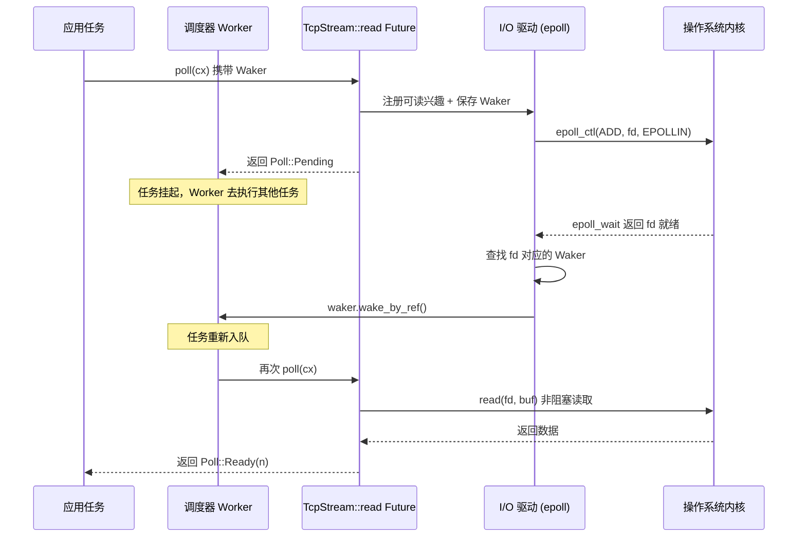

# 第 1 章：非同期のメンタルモデル：Future、Waker、Executor の三種の神器

Rust における非同期プログラミングはライブラリではなく、言語レベルのプロトコルです。Tokio が本番級ランタイムになり得たのは、Future を発明したからではなく、このプロトコルにおける各契約の境界条件を正確に実装したからです。本章では Tokio のスケジューラコードに急いで飛び込むのではなく、まず「三種の神器」——Future、Waker、Executor——の責務境界と逆方向の制御フローを徹底的に解説します。この三者がどのように噛み合うかを理解すれば、以降の章で Runtime の組み立て、work-stealing スケジューリング、I/O ドライバが地に足のついた議論となります。

# 1.1 ブロッキングからプルへ：Rust がコールバックではなく poll を選んだ理由

## 直感的モデル

レストランで調理が必要な料理を注文する場面を想像してください。コールバック型非同期（Node.js の初期スタイルなど）は、電話番号を残しておき、シェフが完成後に**能動的に電話をかけてくる**——制御権はシェフにあり、あなたのコードは受動的に応答するだけです。プル型非同期（Rust の選択）は、受け取り票を受け取り、あなた**自身が決める**いつ窓口に行って「できましたか」と聞くか：まだなら別のことをし、できたら受け取る。

この違いは一見小さく見えますが、システム全体の形態を決定します。コールバック型モデルでは、各非同期操作が「完了後に何をするか」というクロージャを必ず伴い、クロージャが幾重にもネストしてコールバック地獄を形成し、さらにキャンセルが極めて困難です——登録済みのコールバックを「撤回」することはできません。プル型モデルでは、Future は単なる状態機械であり、`poll`は純粋な問い合わせ動作であり、進めなければリソースを消費せず、キャンセルは drop であり、クリーンで明快です。

## プル型モデルの核心契約

Rust 標準ライブラリが定義する`Future`trait には二つの要素しかありません：一つの`poll`メソッドと、一つの`Output`関連型です。Tokio はこの trait を再定義せず、標準ライブラリの実装を直接再利用しています。この点はソースコードに明確に現れています：

```rust
// tokio/src/future/mod.rs
cfg_not_trace! {
    cfg_rt! {
        pub(crate) use std::future::Future;
    }
}
```

[FACT:tokio/src/future/mod.rs:24-28]

このコードは重要な事実を明らかにしています：`tracing`フィーチャーが有効でない場合、Tokio 内部の`Future`は`std::future::Future`の別名であり、何のラッパーもありません。`tracing`が有効な場合にのみ、`InstrumentedFuture`で置き換えられます：

```rust
cfg_trace! {
    mod trace;
    #[allow(unused_imports)]
    pub(crate) use trace::InstrumentedFuture as Future;
}
```

[FACT:tokio/src/future/mod.rs:18-22]

> **[Design Inference & Architectural Trade-offs]**
> この「デフォルトゼロオーバーヘッド、必要に応じて計装」という設計は Tokio の一貫した哲学です：コアパスには追加の抽象層を一切導入せず、可観測性はオプションフィーチャーとして重ね合わせます。`InstrumentedFuture`の存在は、Tokio チームが tracing の計装コストを全ユーザーが負担すべきではないと考えていることを示しています。

## poll 契約の三つの暗黙的制約

`poll`メソッドのシグネチャは`fn poll(self: Pin<&mut Self>, cx: &mut Context<'_>) -> Poll<Self::Output>`です。このシグネチャには三つの契約が隠されており、いずれかに違反すると未定義動作や論理エラーを引き起こします：

**契約一：Pin が自己参照の安全性を保証する。** `Pin<&mut Self>`は、Future が一度 poll されると、そのメモリアドレスが移動できなくなることを意味します。これは async ブロックがコンパイル後に自己参照を含む状態機械を生成するためです——ローカル変数が同一状態機械内の他のフィールドへの参照を保持する可能性があります。移動が許されれば、これらの参照はダングリングポインタになります。

**契約二：Pending はウェイクが登録済みでなければならない。**が`poll`を返すとき`Poll::Pending`、Future はすでに`cx.waker()`Wakerを取得して保存したか、あるいはWakerを何らかのイベントソースに登録済みである。そうでなければ、実行器はそのFutureがいつ再びpoll可能になるかを永遠に知ることができず、タスクが永久にサスペンドされる。

**契約三：Ready後は再びpollすべきではない。**一度`poll`が`Poll::Ready`を返したら、同じFutureを再びpollするのは論理エラーである（UBにはならないが、動作は未定義）。実行器には、Readyを受け取った後にそのタスクを再スケジュールしない責任がある。

これら三つの契約のうち、契約二が最も間違いやすい箇所であり、Wakerが存在する根本的な理由でもある。

# 1.2 Waker：逆方向の制御フローの担い手

## 直感的モデル

Wakerはレストランが渡してくれる「振動呼び出しベル」である。窓口に立って何度も「できましたか」と聞く必要はない——それは時間の無駄だ。最初に窓口に行ったときにベルをシェフに渡し（Wakerを登録し）、あとは安心して別のことをしていればよい。料理ができたら、シェフがボタンを押し、ベルが振動する（`wake`を呼び出す）。あなたは信号を受け取ってから再び窓口に料理を取りに行く（再pollする）。

Wakerがなければ、実行器には二つの選択肢しかない：すべてのタスクをビジーループでポーリングするか（CPUの無駄）、Pendingを返したタスクを永遠にpollしないか（タスクの餓死）である。Wakerはこの膠着状態を打破する唯一の仕組みである。

## Wakerのメモリレイアウトと仮想テーブル設計

Wakerは標準ライブラリの型だが、その設計はTokioのタスク構造に直接影響を与えている。`Waker`本質的にはファットポインタである：一つの`RawWaker`構造体であり、データポインタと仮想テーブルポインタを含む。

```rust
// 标准库中的定义（非 Tokio 源码，此处为背景说明）
pub struct RawWaker {
    data: *const (),
    vtable: &'static RawWakerVTable,
}

pub struct RawWakerVTable {
    clone: unsafe fn(*const ()) -> RawWaker,
    wake: unsafe fn(*const ()),
    wake_by_ref: unsafe fn(*const ()),
    drop: unsafe fn(*const ()),
}
```

> **[Design Inference & Architectural Trade-offs]**
> この設計の巧妙さは次の点にある：`Waker`自体は「起床」が具体的に何を意味するかを気にしない。それは単に四つの関数ポインタの担い手である。Tokioは、その`wake`関数がタスクを再びスケジューリングキューに押し戻すWakerを提供でき、別のランタイム（例えば`futures`クレートの`block_on`）は全く異なるWaker実装を提供できる。この「データ＋仮想テーブル」のパターンにより、Wakerは異なるランタイム間で意味を失うことなく受け渡しできる。

`wake`と`wake_by_ref`の違いは極めて重要である：`wake`はWakerの所有権を消費し（呼び出し後Wakerはdropされる）、一方`wake_by_ref`は借用するだけである。実行器は通常、`wake_by_ref`を「タスクを就緒としてマークしキューに入れる」として実装し、`wake`はその上でさらに参照カウントのデクリメントを処理する。Tokioのタスク構造では、Wakerのデータポインタはタスクの参照カウントヘッダを指し、cloneごとにカウントが増え、dropでカウントが減り、カウントがゼロになるとタスクのメモリが解放される。

## 起床の完全なタイムライン

以下のシーケンス図は、TCP読み取り操作が開始されてから起床されるまでの完全な経路を示している。WakerがタスクコンテキストからI/Oドライバまでどのように伝達されるかに注目してほしい：



この図の要点は：**WakerはReactorからExecutorへ逆方向に到達できる唯一のチャネルである**。Reactorはタスクに関する他の情報を一切保持せず、「このfdが就緒になったら、このWakerを呼び出す」ということだけを知っている。この分離により、I/Oドライバはスケジューラとは独立に実装でき、両者はWakerという狭いインターフェースを通じてのみ通信する。

## 偽の起床：契約のグレーゾーン

Tokioのドキュメントは偽の起床の存在を明確に認めている：

> Normally, tasks are scheduled only if they have been woken by calling `wake` on their waker. However, this is not guaranteed, and Tokio may schedule tasks that have not been woken under some circumstances.

[FACT:tokio/src/runtime/mod.rs:306-309]

> **[Design Inference & Architectural Trade-offs]**
> これはつまり`poll`の実装は「起床されていないのに再びpollされる」状況を許容できなければならない。正しいFutureは、Pendingを返した後、何のイベントも発生していなくても、再びpollされたときにはpanicしたり誤った結果を生じたりせず、Pendingを返すべきである。この制約は緩く見えるが、実際には状態機械の設計に要求を課す：「二回のpollの間に必ずイベントが発生する」と仮定してはならない。

# 1.3 Executor：Futureからタスクへのカプセル化

## 直感的モデル

Executorはレストランの配車係である。彼の手には注文の山（タスクキュー）があり、どの注文を先に作るか、誰が作るかを決める。呼び出しベルが振動すると、彼は対応する注文を再びキューに入れる。配車係がいなければ、シェフたちはどの料理を作ればよいか、いつ作業を切り替えるべきかもわからない。

しかしExecutorの責務は「Futureをポーリングする」だけにとどまらない。それは三つの中核的な問題を解決しなければならない：**タスクのライフサイクル管理**（作成、スケジューリング、完了、キャンセル）、**公平性の保証**（あるタスクが他のタスクを餓死させるのを防ぐ）、**リソースドライバの統合**（I/Oとタイマーイベントをどのように起床に変換するか）。

## タスクのメモリレイアウト：FutureからTaskへ

を呼び出すとき、渡されたFutureは直接キューに入れられるのではない。それは`tokio::spawn`構造体にラップされ、参照カウントヘッダ、スケジューリングメタデータ、そしてFuture自体を含む。このラップ処理には重要な最適化の決定がある：`Task`コピー

```rust
/// Boundary value to prevent stack overflow caused by a large-sized
/// Future being placed in the stack.
pub(crate) const BOX_FUTURE_THRESHOLD: usize = if cfg!(debug_assertions)  {
    2048
} else {
    16384
};

pub(crate) struct AutoBox(std::marker::PhantomData);

impl AutoBox {
    /// `true` if a value of type `T` is larger than [`BOX_FUTURE_THRESHOLD`].
    pub(crate) const SHOULD_BOX: bool = std::mem::size_of::() > BOX_FUTURE_THRESHOLD;
}
```

[FACT:tokio/src/runtime/mod.rs:649-673]

はコンパイル時定数`AutoBox`によってFutureをボックス化するかどうかを決定する。`SHOULD_BOX`〔設計上の推論とアーキテクチャのトレードオフ〕

> **[Design Inference & Architectural Trade-offs]**
> 注释中特别强调了「用关联常量而非运行时 `if`」の理由：実行時に判断する場合、コンパイラは各`T`同時に両方の分岐のコードをインスタンス化する（一つは`T`を処理し、もう一つは`Pin<Box<T>>`を処理する）ため、コード膨張を引き起こす。一方、定数分岐を使用すると、単相化コレクタが到達不可能な分岐を削除し、実際に使用される型のコードのみを生成する。これは「型システムで実行時判断を置き換える」という典型的な最適化である。

## スケジューリングの公平性：31と61のマジックナンバー

Tokioのスケジューラドキュメントには、形式化された公平性保証が定義されている：

> If the total number of tasks does not grow without bound, and no task is blocking the thread, then it is guaranteed that tasks are scheduled fairly.

[FACT:tokio/src/runtime/mod.rs:279-281]

この保証の実装は2つの重要なパラメータに依存している。current-threadランタイムの場合：

> The runtime will prefer to choose the next task to schedule from the local queue, and will only pick a task from the global queue if the local queue is empty, or if it has picked a task from the local queue 31 times in a row.

[FACT:tokio/src/runtime/mod.rs:328-333]

> The runtime will check for new IO or timer events whenever there are no tasks ready to be scheduled, or when it has scheduled 61 tasks in a row.

[FACT:tokio/src/runtime/mod.rs:335-337]

これらの数字（31と61）は恣意的に選ばれたものではない。31は2の5乗マイナス1であり、ビット演算で高速に判定できる。61はI/Oイベントが無限に遅延されないことを保証するためである——タスクキューが永遠に空でなくても、61回のスケジューリングごとに必ず一度I/Oをチェックする。

> **[Design Inference & Architectural Trade-offs]**
> なぜ32ではなく31なのか？カウンタは0から始まり、スケジューリングごとに1ずつ増加し、カウンタが31に達したときにグローバルキュー検査をトリガーする。`counter & 31 == 31`での判定は`counter % 32 == 0`よりも効率的である（現代のコンパイラは自動的に最適化するが）。61の選択はより微妙である：頻繁なepoll_waitシステムコールのオーバーヘッドを避けるために十分大きく、かつI/O遅延を許容範囲内に保つために十分小さくする必要がある。

## マルチスレッドランタイムのLIFOスロット最適化

マルチスレッドランタイムは公平性に加えて、さらに性能最適化——LIFOスロット——を追加している：

> The multi thread runtime uses the lifo slot optimization: Whenever a task wakes up another task, the other task is added to the worker thread's lifo slot instead of being added to a queue.

[FACT:tokio/src/runtime/mod.rs:373-377]

この最適化の直感は：あるタスクが別のタスクを起床させるとき、起床されたタスクは現在のタスクとデータ依存関係にある可能性が高い（例えばプロデューサー・コンシューマーパターン）。それをLIFOスロットに置くことで、現在のタスク完了後すぐに実行でき、CPUキャッシュのホットデータを活用できる。

しかしLIFOスロットには乱用防止メカニズムがある：

> if a worker thread uses the lifo slot three times in a row, it is temporarily disabled until the worker thread has scheduled a task that didn't come from the lifo slot.

[FACT:tokio/src/runtime/mod.rs:380-382]

> **[Design Inference & Architectural Trade-offs]**
> この「3回連続使用後に無効化」というルールは、2つのタスクが互いを起床させてライブロックを形成するのを防ぐためである。もしタスクAがタスクBを起床させ、BがAを起床させた場合、この制限がなければLIFOスロットはこの2つのタスクに永久に占有され、他のタスクは永遠にスケジューリングされない。3回の制限は他のタスクに割り込む機会を与える。

## タスクキャンセル：abortの真のセマンティクス

`JoinHandle::abort`の動作はしばしば誤解される。ドキュメントは明確に述べている：

> Be aware that calls to `JoinHandle::abort` just schedule the task for cancellation, and will return before the cancellation has completed.

[FACT:tokio/src/task/mod.rs:146-148]

これは`abort`が同期的でないことを意味する。それは単にフラグを設定するだけで、タスクは次の`.await`ポイントでこのフラグをチェックし、自ら終了する。もしタスクが`.await`のないCPU集約的なコードを実行している場合、`abort`は即座に効果を発揮しない。

さらに微妙なのは：

> Note that aborting a task does not guarantee that it fails with a cancelled error, since it may complete normally first.

[FACT:tokio/src/task/mod.rs:134-138]

> **[Design Inference & Architectural Trade-offs]**
> このセマンティクスの設計動機は：キャンセルは「ベストエフォート」の操作である。Tokioはタスクを強制終了しない（Rustには安全な強制終了メカニズムがない）が、協調的にタスクに自ら終了するよう要求する。これは`spawn_blocking`タスクがキャンセル不可能という設計と一致している——ブロッキングタスクには`.await`ポイントがなく、キャンセルフラグをチェックできない。

# 1.4 設計思考：三種の神器の境界とコスト

## なぜFutureはExecutorを含まないのか

Rustの`Future`traitは意図的に「自分をどのようにスケジューリングするか」という情報を含まない。これは熟慮された疎結合の決定である。もしFutureが自分のExecutorを知っていたら：

1. 同じFutureを異なるランタイムで実行できない（例えばTokioからasync-stdへの移行）

2. テスト時に単純な`block_on`で駆動できない

3. コンビネータ（例えば`select!`、`join!`）がランタイムをまたいで動作できない

Wakerの存在は、この疎結合を維持しながら、FutureがExecutorに通知できるようにするためのものである。Wakerは「能力トークン」である——Futureは「これを呼び出して再スケジューリングを要求できる」ことだけを知っており、スケジューリングが具体的にどのように行われるかは知らない。

## 協調的スケジューリングのコスト

Tokioのタスクは協調的である：タスクは`.await`ポイントでのみ実行権を譲る。これは以下を意味する：

> code that spends a long time without reaching an `.await` will prevent other tasks from running.

[FACT:tokio/src/lib.rs:178-179]

> **[Design Inference & Architectural Trade-offs]**
> これが協調的スケジューリングの根本的なコストである。OSは任意の命令境界でスレッドをプリエンプトできるが、Tokioは`.await`ポイントでのみタスクを切り替える。もしタスクが途中に`.await`のない10秒間のCPU集約的ループを実行した場合、同じworkerスレッド上の他のすべてのタスクが10秒間ブロックされる。Tokioの対処戦略は`spawn_blocking`と`block_in_place`を提供し、このような作業を専用スレッドプールに移すことである。しかしこれはユーザーの責任であり、ランタイムは自動検出できない。

## 公平性保証の境界条件

Tokioの公平性保証には2つの前提条件がある：タスク総数に上限があり、スレッドをブロックするタスクがないこと。これら2つの条件は実際の本番環境ではしばしば違反される：

- もしタスクが絶えず新しいタスクをspawnし回収しなければ、タスク総数に上限がなくなり、公平性保証が無効になる
- もしあるタスクがブロッキングシステムコール（例えば同期ファイルI/O）を実行すると、workerスレッド全体をブロックする

> **[Design Inference & Architectural Trade-offs]**
> これがTokioのドキュメントが繰り返し「非同期タスクでブロッキング操作を実行しないでください」と強調する理由である。公平性保証はランタイムのハード保証ではなく、「正しく使用する前提での」保証である。ランタイムは違反行為を検出しない。検出自体にオーバーヘッドが必要だからである。

# 1.5 本章のまとめ

本章ではTokioを理解するための3つの基石を確立した：

**Future はプル型のステートマシンである。** `poll`は純粋なクエリ操作であり、返す`Pending`時には既にウェイクアップが登録されている必要があり、返す`Ready`後はもう poll されるべきではない。Tokio は直接`std::future::Future`を再利用し、追加のラッピングは行わない（tracing を有効にしない限り）。

**Waker は逆方向制御フローの唯一のチャネルである。**それは「データポインタ + 仮想テーブル」の設計により、ランタイム非依存性を実現している。`wake`は所有権を消費し、`wake_by_ref`は借用のみを行う。偽のウェイクアップは許容され、Future はそれを容忍しなければならない。

**Executor はライフサイクル、公平性、リソース統合を担当する。**それは Future を Task にラップし、`AutoBox`を通じてコンパイル時にボクシングの有無を決定し、31/61 という2つのマジックナンバーでローカルキューとグローバルキューのスケジューリングをバランスさせ、LIFO スロットを通じてデータ依存シナリオのパフォーマンスを最適化する。

これら3つのコンポーネントは狭いインターフェースを通じて分離されている：Future は`poll`だけを知り、Waker は`wake`だけを知り、Executor は「Pending または Ready までポーリングする」ことだけを知っている。まさにこの分離により、Tokio は Future の定義を変更することなく、work-stealing スケジューリング、I/O ドライバ統合、協調的予算などの高度な機能を実装できる。

# 本章の考察とセルフチェック

Q1: もし`AutoBox::SHOULD_BOX`の判定をコンパイル時定数から実行時`if size_of::<T>() > THRESHOLD`に変更した場合、コンパイル成果物にどのような影響があるか？なぜ Tokio のコメントは特にこの点を強調しているのか？

**参考解析**：[FACT:tokio/src/runtime/mod.rs:657-667]のコメントによると、実行時`if`を使用すると、コンパイラは各`T`に対して2つの分岐のコードを同時にインスタンス化する——1つは`T`が直接インライン化される場合を処理し、もう1つは`Pin<Box<T>>`の場合を処理する。これは、spawn される各 Future 型に対して2份のタスク駆動コード（task harness）が生成され、バイナリサイズが倍増することを意味する。一方、関連定数`SHOULD_BOX`を使用すると、`T`が確定した後はコンパイル時定数となるため、単相化コレクタが到達不可能な分岐を剪定し、実際に使用されるパスのみのコードを生成する。これは「型システムで実行時判定を置き換える」典型的な最適化であり、代償として`AutoBox`は通常の関数ではなくジェネリック構造体でなければならない。

Q2: あるタスクが`poll`で`Pending`を返したが、Waker の登録を忘れたと仮定する。current-thread ランタイムと multi-thread ランタイムでは、このタスクはそれぞれどうなるか？Tokio にはこの状況を検出するメカニズムがあるか？

**参考解析**：[FACT:tokio/src/runtime/mod.rs:306-309]によると、Tokio は偽のウェイクアップを許可している。これは、タスクがウェイクアップされずに再スケジュールされる可能性があることを意味する。しかし、これは Waker の登録忘れが安全であることを意味しない。current-thread ランタイムでは、ローカルキューとグローバルキューの両方が空の場合、ランタイムは`park`状態に入り、I/O またはタイマーイベントを待機する。Waker の登録を忘れたタスクは永遠に再エンキューされず、永久にサスペンドされる。multi-thread ランタイムでは状況は類似しているが、他のタスクが継続的にウェイクアップする場合、そのタスクは偽のウェイクアップにより偶然再スケジュールされる可能性がある——しかしこれは依存できない。Tokio には「Pending を返したが Waker が登録されていない」状況を発見する実行時検出メカニズムはない。これは各 poll 後に Waker が使用されたかどうかをチェックする必要があり、オーバーヘッドが大きすぎるためである。これは Future 実装者の責任である。

Q3: LIFO スロットの「3回連続使用後に無効化」ルールは、どのような具体的なシナリオを防ぐためか？もしこの制限を除去した場合、どのようなタスク依存パターンで他のタスクが餓死するか？

**参考解析**：[FACT:tokio/src/runtime/mod.rs:380-382]によると、LIFO スロットは3回連続使用後に一時的に無効化され、非 LIFO ソースのタスクがスケジュールされるまで続く。このルールが防ぐシナリオは：2つのタスクが互いにウェイクアップして緊密なループを形成する場合である。例えば、タスク A がデータのバッチを処理した後タスク B をウェイクアップし、タスク B が処理後すぐにタスク A をウェイクアップする。3回の制限がなければ、A と B は永遠に LIFO スロットを占有し、worker スレッドはこの2つのタスク間で無限に切り替わり、ローカルキューとグローバルキューの他のタスクは永遠に実行機会を得られない。3回の制限により、「相互ウェイクアップ」の3ラウンドごとに少なくとも1つの他のタスクがスケジュールされ、ライブロックが打破される。この数字の選択は経験的である：小さすぎると LIFO 最適化の利益が減少し、大きすぎると他のタスクの遅延が増加する。

ここまでで、Future、Waker、Executor の3者の責務境界と協調メカニズムは明確になった：Future は計算を定義し、Waker はウェイクアップを担当し、Executor は実行を駆動する。しかし単一のコンポーネントは独立して動作できず、それらは統一されたランタイム環境に組み立てられなければならない。次章では、Runtime::new と Builder::build の完全な組み立てチェーンを追跡し、スケジューラ、I/O ドライバ、時間ドライバ、ブロッキングスレッドプールがどのように同じ Runtime インスタンスに注入されるかを見て、current_thread と multi_thread の2形態の組み立て段階における根本的な差異を明らかにする。
