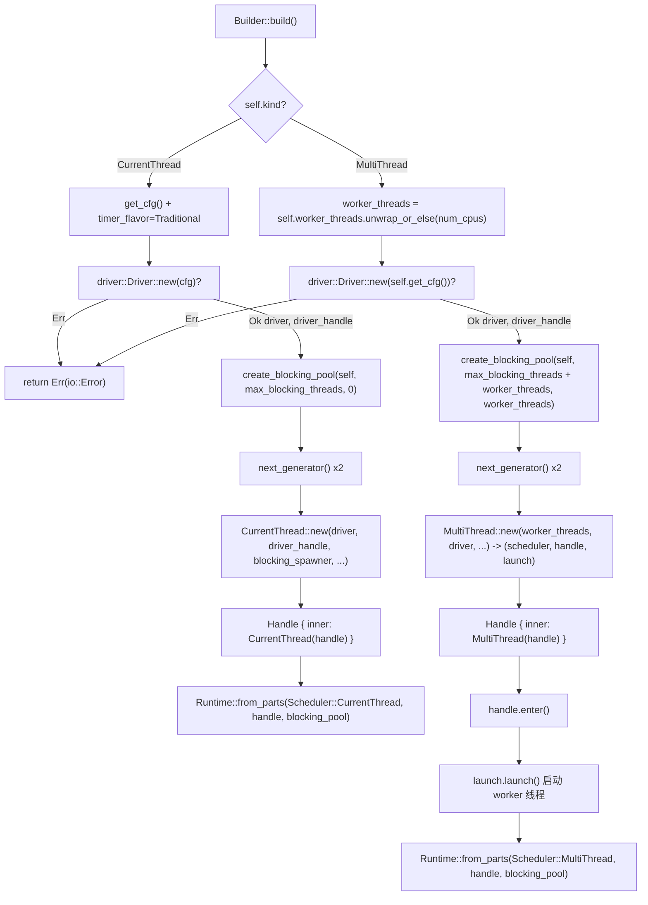

# 第 2 章：Runtime の組み立て：Builder がドライバ、スケジューラ、スレッドプールをどのように組み立てるか

# から`Builder`まで`Runtime`：一回の組み立ての完全な旅

前章では Future、Waker、Executor の三者の責務境界を明確にしました。しかし実際に使用可能なランタイムは「一つの Executor」だけでは遥かに不十分です——I/O イベントループ、タイマー、ブロッキングスレッドプールも必要であり、これらのコンポーネントは同一のハンドル、同一のライフサイクルを共有しなければなりません。本章では`Builder::build`の完全な組み立てチェーンを追跡し、一つの核心的な問いに答えます：**一つの`Runtime`の内部には一体どのようなコンポーネントがあり、それらがどのように組み立てられ、ハンドルを共有するのか**。

Tokio の組み立てエントリポイントは`Builder`です。それ自体は純粋な設定コンテナであり、すべてのフィールドは「意図宣言」であって、ランタイムリソースを一切保持しません。実際のリソース生成は`build()`の呼び出し時に行われます。

## 直感的モデル：Builder は「内装設計図」、Runtime は「引き渡し後の家」

`Builder`はちょうど一枚の内装設計図のようなものです：その上に「部屋をいくつ（worker_threads）」「水道を通すか（enable_io）」「電気を通すか（enable_time）」「外注ヘルパーの上限（max_blocking_threads）」を書き込みます。設計図自体は何の実体も生み出しません。`build()`を呼び出すまで、施工隊は図面に従って施工し、スケジューラ、ドライバ、スレッドプールといった「部屋」を実際に建て、`Runtime`インスタンスを引き渡します。

もし`Builder`という層がなければ、ユーザーは各コンポーネントを手動で new し、手動で配線し、手動で失敗時のロールバックを処理しなければなりません——どこか一箇所でも順序を誤れば、ハンドルが宙に浮いたりリソースリークが発生します。`Builder`の価値は以下にあります：**「設定」と「構築」を徹底的に分離し、構築プロセスで検証、失敗時のクリーンアップ、ハンドル共有を集中的に行えるようにする**。

## メモリレイアウト：`Builder`のフィールド区分

`Builder`のフィールドは責務ごとに四つのグループに分けられます。第一のグループは**形態とスイッチ**：`kind`がスケジューラの形態を決定し、`enable_io` / `enable_time`が対応するドライバを作成するかどうかを決定します。

[FACT:tokio/src/runtime/builder.rs:55-68]

```rust
pub struct Builder {
    kind: Kind,
    name: Option,
    enable_io: bool,
    nevents: usize,
    nevents_busy: Option,
    enable_time: bool,
    start_paused: bool,
    // ...
}
```

第二のグループは**スレッドプールパラメータ**：`worker_threads`は`Option<usize>`，`None`で「build 時に CPU コア数に応じて自動検出するまで遅延させる」ことを意味します；`max_blocking_threads`デフォルトは 512。

[FACT:tokio/src/runtime/builder.rs:73-79]

```rust
worker_threads: Option,
max_blocking_threads: usize,
```

第三のグループは**コールバックフック**、すべて`Option<Arc<dyn Fn ...>>`です。これらが`Arc`ではなく`Box`を使っていることに注意してください。これらのコールバックは各 worker スレッドの`Config`。

[FACT:tokio/src/runtime/builder.rs:87-97]

```rust
pub(super) after_start: Option,
pub(super) before_stop: Option,
pub(super) before_park: Option,
pub(super) after_unpark: Option,
```

コピー**第四のグループは**：`global_queue_interval`、`event_interval`、`disable_lifo_slot`、`seed_generator`。

[FACT:tokio/src/runtime/builder.rs:116-134]

```rust
pub(super) global_queue_interval: Option,
pub(super) event_interval: u32,
pub(super) disable_lifo_slot: bool,
pub(super) seed_generator: RngSeedGenerator,
```

コピー`Kind`ここに注目すべき設計があります：`Copy`は

[FACT:tokio/src/runtime/builder.rs:261-265]

```rust
#[derive(Clone, Copy)]
pub(crate) enum Kind {
    CurrentThread,
    #[cfg(feature = "rt-multi-thread")]
    MultiThread,
}
```

`MultiThread`コピー`rt-multi-thread`バリアントは`rt`feature でゲートされています。これは`Kind`feature のみを有効にしたビルドでは、`build()`バリアントが一つしかなく、`match`の**がコンパイラによって単一分岐に最適化されることを意味します——**。

## 型システムをランタイム判定の代わりに使うことで、マルチスレッドスケジューラのコードサイズを排除する

`Builder::new`デフォルト値の哲学：なぜ I/O と time はデフォルトで無効なのか`enable_io`はすべての構築の共通エントリポイントです。それは`enable_time`と`false`。

[FACT:tokio/src/runtime/builder.rs:309-318]

```rust
// I/O defaults to "off"
enable_io: false,
nevents: 1024,
nevents_busy: None,

// Time defaults to "off"
enable_time: false,

// The clock starts not-paused
start_paused: false,
```

> **[Design Inference & Architectural Trade-offs]**
> コピー`#[tokio::main]`〔設計推論とアーキテクチャトレードオフ〕`enable_all()`。

`enable_all()`このデフォルト値の選択は意図的です：I/O ドライバの作成には OS に epoll/kqueue ハンドルを要求する必要があり、time ドライバの作成にはタイマー基盤を起動する必要があります。ユーザーが純粋な計算タスクスケジューラ（例えば CPU 集約型の async ロジックを実行する）だけを望んでいる場合、これらのドライバを強制的に作成するのは純粋な無駄です。

[FACT:tokio/src/runtime/builder.rs:398-419]

```rust
pub fn enable_all(&mut self) -> &mut Self {
    #[cfg(any(
        feature = "net",
        all(unix, feature = "process"),
        all(unix, feature = "signal")
    ))]
    self.enable_io();

    #[cfg(all(
        tokio_unstable,
        feature = "io-uring",
        // ...
    ))]
    self.enable_io_uring();

    #[cfg(feature = "time")]
    self.enable_time();

    self
}
```

を呼び出しているからです`enable_io()`の実装は feature ゲートが「全開」のセマンティクスにどのように影響するかを明らかにします。`net`、`process`コピー`signal`注意`time` feature，`enable_all()`は

## または`build()`feature が有効な場合にのみ呼び出されます。ユーザーが

`build()`のみを有効にした場合、`kind`は I/O ドライバを開きません——コンパイル成果物に I/O ドライバのコードがそもそも存在しないためです。

[FACT:tokio/src/runtime/builder.rs:1146-1152]

```rust
pub fn build(&mut self) -> io::Result {
    match &self.kind {
        Kind::CurrentThread => self.build_current_thread_runtime(),
        #[cfg(feature = "rt-multi-thread")]
        Kind::MultiThread => self.build_threaded_runtime(),
    }
}
```

の分岐

### は組み立ての起点であり、

`build_current_thread_runtime`に従って二つの全く異なるパスに分岐します。`build_current_thread_runtime_components`コピー`Runtime`。

[FACT:tokio/src/runtime/builder.rs:1725-1736]

```rust
fn build_current_thread_runtime(&mut self) -> io::Result {
    use crate::runtime::runtime::Scheduler;

    let (scheduler, handle, blocking_pool) =
        self.build_current_thread_runtime_components(None)?;

    Ok(Runtime::from_parts(
        Scheduler::CurrentThread(scheduler),
        handle,
        blocking_pool,
    ))
}
```

パス一：current_thread の組み立て`build_current_thread_runtime_components`自体は非常に薄く、

[FACT:tokio/src/runtime/builder.rs:1760-1766]

```rust
let mut cfg = self.get_cfg();
cfg.timer_flavor = TimerFlavor::Traditional;
let (driver, driver_handle) = driver::Driver::new(cfg)?;

// Blocking pool
let blocking_pool = blocking::create_blocking_pool(self, self.max_blocking_threads, 0);
let blocking_spawner = blocking_pool.spawner().clone();
```

に包みます`driver`コピー`(driver, driver_handle)`実際の組み立てロジックは`?`にあります。その実行順序は極めて重要です：`build`コピー`Err`第一步は

を作成し、一対の`spawner`を返します。ここで`spawner`はエラーをそのまま上に伝播することに注意してください——I/O ドライバの初期化が失敗した場合（例えば epoll の作成失敗）、

全体が

[FACT:tokio/src/runtime/builder.rs:1768-1770]

```rust
let seed_generator_1 = self.seed_generator.next_generator();
let seed_generator_2 = self.seed_generator.next_generator();
```

> **[Design Inference & Architectural Trade-offs]**
> クローンを取り出します。この`seed_generator_1`はスケジューラに注入され、スケジューラがブロッキングタスクをスレッドプールに投入する能力を持てるようにします。`Config`第三步は二つの独立した RNG シード生成器を生成します。`select!`コピー`seed_generator_2`〔設計推論とアーキテクチャトレードオフ〕`CurrentThread::new`なぜ二つ必要なのか？`rng_seed`は

に置かれ、スケジューラ内部で使用されます（例えば`Config`のランダム分岐順序）；`CurrentThread::new`。

[FACT:tokio/src/runtime/builder.rs:1776-1807]

```rust
let (scheduler, handle) = CurrentThread::new(
    driver,
    driver_handle,
    blocking_spawner,
    seed_generator_2,
    Config {
        before_park: self.before_park.clone(),
        after_unpark: self.after_unpark.clone(),
        // ...
        global_queue_interval: self.global_queue_interval,
        event_interval: self.event_interval,
        // ...
        enable_eager_driver_handoff: false,
        seed_generator: seed_generator_1,
        // ...
    },
    local_tid,
    self.name.clone(),
);
```

に渡され、タスク側で使用されます。二つの生成器を分離することで、スケジューラ内部が乱数を消費することがユーザーに見える乱数シーケンスに影響を与えるのを避け、`enable_eager_driver_handoff`の再現性を保証します。`false`。

[FACT:tokio/src/runtime/builder.rs:1795-1798]

```rust
// This setting never makes sense for a current thread runtime,
// as it only configures how the I/O driver is stolen across
// workers.
enable_eager_driver_handoff: false,
```

> **[Design Inference & Architectural Trade-offs]**
> このコメントはそのオプションの本質を指摘している：それは「複数の worker 間でどのように I/O ドライバを奪い合うか」を記述しており、current_thread にはスレッドが1つしかなく、奪い合いが存在しないため、強制的に無効化される。これは「設定項目のセマンティクスが形態と強く相関する」典型例である——同じ`Builder`フィールドでも形態によって意味が異なる。

最後に、`CurrentThread::new`が返す`handle`は`scheduler::Handle::CurrentThread`に包まれ、さらに公開された`Handle`。

[FACT:tokio/src/runtime/builder.rs:1816-1822]

```rust
let handle = Handle {
    inner: scheduler::Handle::CurrentThread(handle),
};

Ok((scheduler, handle, blocking_pool))
```

### パス2：multi_thread の組み立て

`build_threaded_runtime`の骨格は current_thread と似ているが、本質的に3つの差異がある。第一の差異は worker スレッド数の決定である：

[FACT:tokio/src/runtime/builder.rs:2185]

```rust
let worker_threads = self.worker_threads.unwrap_or_else(num_cpus);
```

`None`ここで`num_cpus()`に解析される。これが「遅延自動検出」の落地点である——検出は`Builder::new`時ではなく build 時に発生する。CPU アフィニティが両者の間で変化する可能性があるためである。

第二の差異は blocking pool の容量計算にある：

[FACT:tokio/src/runtime/builder.rs:2189-2192]

```rust
let blocking_pool =
    blocking::create_blocking_pool(self, self.max_blocking_threads + worker_threads, worker_threads);
let blocking_spawner = blocking_pool.spawner().clone();
```

注意`max_blocking_threads + worker_threads`。current_thread パスでは`self.max_blocking_threads`と`0`。

[FACT:tokio/src/runtime/builder.rs:1765]

```rust
let blocking_pool = blocking::create_blocking_pool(self, self.max_blocking_threads, 0);
```

> **[Design Inference & Architectural Trade-offs]**
> この差異は blocking pool 容量のセマンティクスを明らかにする：multi_thread では、`max_blocking_threads`は「追加の」ブロッキングスレッド上限であり、実際の総スレッド上限には worker スレッド数を加える必要がある。第三の引数（current_thread は 0、multi_thread は`worker_threads`）はおそらく「予約スレッド数」または「初期スレッド数」のヒントである。この設計により`max_blocking_threads`のセマンティクスは両形態で一貫する：それは「コア worker を超えて追加でいくつのブロッキングスレッドを開けるか」を記述している。

第三の差異は`MultiThread::new`が二要素タプルではなく三要素タプルを返すことである：

[FACT:tokio/src/runtime/builder.rs:2198-2226]

```rust
let (scheduler, handle, launch) = MultiThread::new(
    worker_threads,
    driver,
    driver_handle,
    blocking_spawner,
    seed_generator_2,
    Config {
        // ...
        enable_eager_driver_handoff: self.enable_eager_driver_handoff,
        // ...
    },
    self.timer_flavor,
    self.name.clone(),
);
```

余分な`launch`は「起動ハンドル」である。`MultiThread::new`はスケジューラ構造の構築のみを担当し、**worker スレッドを即座に起動しない**。実際の起動は後で発生する：

[FACT:tokio/src/runtime/builder.rs:2228-2234]

```rust
let handle = Handle { inner: scheduler::Handle::MultiThread(handle) };

// Spawn the thread pool workers
let _enter = handle.enter();
launch.launch();

Ok(Runtime::from_parts(Scheduler::MultiThread(scheduler), handle, blocking_pool))
```

`handle.enter()`がランタイムコンテキストに入り、その後`launch.launch()`が実際にすべての worker スレッドを spawn する。この「先に構築、後に起動」という二段階設計は非常に重要である。

> **[Design Inference & Architectural Trade-offs]**
> なぜ構築しながら起動できないのか？worker スレッドは一度起動すると即座にタスクの poll を開始し、タスクが`handle`を参照する可能性があるためである。もし`handle`がまだ構築完了していなければ、「worker が半完成のハンドルを持つ」競合状態が発生する。二段階設計は以下を保証する：**すべての worker スレッド起動時に、完全な`Handle`がすでに準備完了している**。`_enter`ガードは worker スレッドが起動瞬間に正しいランタイムコンテキストにあることを保証する。

## 組み立てフロー図

下の図は2つのパスの組み立て順序、重要な分岐、エラーパスをまとめて描いている。注意`driver::Driver::new`失敗時は直接`Err`を返し、この時点で blocking pool はまだ作成されていない。



## ハンドル共有：`Handle`がコンポーネント間の「通行証」となる仕組み

組み立て完了後、`Runtime`は`scheduler`、`handle`、`blocking_pool`の三点セットを保持する。そのうち`handle`が共有の中核である。その内部は列挙型である：

[FACT:tokio/src/runtime/scheduler/mod.rs:29-41]

```rust
#[derive(Debug, Clone)]
pub(crate) enum Handle {
    #[cfg(feature = "rt")]
    CurrentThread(Arc),

    #[cfg(feature = "rt-multi-thread")]
    MultiThread(Arc),

    #[cfg(not(feature = "rt"))]
    #[allow(dead_code)]
    Disabled,
}
```

両方のバリアントが`Arc`を包んでいることに注意。これは`Handle`のクローンが安価な参照カウントのインクリメントであり、任意のスレッドに自由に配布できることを意味する。`Handle`は統一されたアクセスインターフェースを提供し、形態の差異を`match`内部にカプセル化する。例えば`driver()`：

[FACT:tokio/src/runtime/scheduler/mod.rs:53-64]

```rust
pub(crate) fn driver(&self) -> &driver::Handle {
    match *self {
        #[cfg(feature = "rt")]
        Handle::CurrentThread(ref h) => &h.driver,

        #[cfg(feature = "rt-multi-thread")]
        Handle::MultiThread(ref h) => &h.driver,

        #[cfg(not(feature = "rt"))]
        Handle::Disabled => unreachable!(),
    }
}
```

`blocking_spawner()`は`match_flavor!`マクロを使って重複を排除している：

[FACT:tokio/src/runtime/scheduler/mod.rs:96-98]

```rust
pub(crate) fn blocking_spawner(&self) -> &blocking::Spawner {
    match_flavor!(self, Handle(h) => &h.blocking_spawner)
}
```

このマクロを展開すると上記の`driver()`のような`match`になる。その価値は：形態別にディスパッチする必要があるアクセサを新規追加する際、`match_flavor!`を一行書くだけでよく、`match`の分岐を手書きで二度書く必要がないことである。

公開された`Handle`は内部`scheduler::Handle`の薄いラッパーである：

[FACT:tokio/src/runtime/handle.rs:13-15]

```rust
pub struct Handle {
    pub(crate) inner: scheduler::Handle,
}
```

ユーザーが取得する`Handle`はスレッドを跨いでクローンでき、`spawn`でき、`block_on`。`spawn`の実装は`AutoBox`のコンパイル期分岐を示す：

[FACT:tokio/src/runtime/handle.rs:197-208]

```rust
pub fn spawn(&self, future: F) -> JoinHandle
where
    F: Future + Send + 'static,
    F::Output: Send + 'static,
{
    let fut_size = mem::size_of::();
    if AutoBox::::SHOULD_BOX {
        self.spawn_named(Box::pin(future), SpawnMeta::new_unnamed(fut_size))
    } else {
        self.spawn_named(future, SpawnMeta::new_unnamed(fut_size))
    }
}
```

`AutoBox::<F>::SHOULD_BOX`は関連定数であり、`size_of::<F>()`と閾値の比較から導出される。

[FACT:tokio/src/runtime/mod.rs:668-673]

```rust
pub(crate) struct AutoBox(std::marker::PhantomData);

impl AutoBox {
    pub(crate) const SHOULD_BOX: bool = std::mem::size_of::() > BOX_FUTURE_THRESHOLD;
}
```

> **[Design Inference & Architectural Trade-offs]**
> コメントにはなぜ実行時`if`ではなく関連定数を使うのかが説明されている：実行時判断を使う場合、`spawn_named`は二度単相化され（一度は`F`向け、一度は`Pin<Box<F>>`向け）、各 spawn の future が二份のタスクハーネスを生成し、コードサイズが倍増する。定数分岐を使えば、単相化コレクタは実際に到達した分岐のみを保持する。

## 設計思考：組み立て順序、エラー回復、本番の落とし穴

**順序は契約である**。組み立て順序`driver -> blocking_pool -> scheduler`は恣意的ではない。driver が最初に作成される。それは OS リソース不足で失敗する唯一の可能性があり、失敗後に他のコンポーネントをクリーンアップする必要がないステップだからである。blocking_pool は driver の後、scheduler の前にある。scheduler が blocking_spawner を必要とするためである。もし blocking_pool の作成が失敗した場合（実際にはほとんど失敗しない）、driver は drop により自動クリーンアップされる。

**current_thread の`local_tid`分岐**。`build_local`は`build_current_thread_local_runtime`を通り、現在のスレッド ID を渡す：

[FACT:tokio/src/runtime/builder.rs:1738-1751]

```rust
fn build_current_thread_local_runtime(&mut self) -> io::Result {
    use crate::runtime::local_runtime::LocalRuntimeScheduler;

    let tid = std::thread::current().id();

    let (scheduler, handle, blocking_pool) =
        self.build_current_thread_runtime_components(Some(tid))?;

    Ok(LocalRuntime::from_parts(
        LocalRuntimeScheduler::CurrentThread(scheduler),
        handle,
        blocking_pool,
    ))
}
```

この`tid`は`Handle`に格納され、後続の`can_spawn_local_on_local_runtime`が「spawn_local が owner スレッド上で呼ばれたか」を検証するために使う：

[FACT:tokio/src/runtime/scheduler/mod.rs:140-147]

```rust
pub(crate) fn can_spawn_local_on_local_runtime(&self) -> bool {
    match self {
        Handle::CurrentThread(h) => h.local_tid.is_some_and(|x| std::thread::current().id() == x),

        #[cfg(feature = "rt-multi-thread")]
        Handle::MultiThread(_) => false,
    }
}
```

> **[Design Inference & Architectural Trade-offs]**
> これは`LocalRuntime`の安全性の基石である：`!Send`の future はその owner スレッド上でのみ poll でき、`local_tid`がこの制約の実行時チェックポイントである。このチェックを除去すると、スレッドを跨いだ spawn_local が`!Send`データの並行アクセスを引き起こし、UB を招く。

**本番の落とし穴1：`worker_threads(0)`は panic する**。`worker_threads`メソッドにはアサーションがある：

[FACT:tokio/src/runtime/builder.rs:582-586]

```rust
pub fn worker_threads(&mut self, val: usize) -> &mut Self {
    assert!(val > 0, "Worker threads cannot be set to 0");
    self.worker_threads = Some(val);
    self
}
```

このアサーションはbuildを待たずに設定段階で失敗する。利点はエラーの特定が早くなること、欠点はスレッド数が設定ファイルの動的な値に由来する場合、ユーザーが呼び出し前に自分で検証しなければならないことだ。

**本番の落とし穴その2：`max_blocking_threads`小さく設定しすぎるとハングする**。ドキュメントは明確に警告している：

[FACT:tokio/src/runtime/builder.rs:600-601]

```rust
/// It's recommended to not set this limit too low in order to avoid hanging on operations
/// requiring [`spawn_blocking`].
```

> **[Design Inference & Architectural Trade-offs]**
> blocking poolのキューには背圧がないため、タスクはスレッドが利用可能になるまで溜まり続ける。すべてのブロッキングスレッドが「新しいブロッキングスレッドがないと完了できない」操作を待っていると、デッドロックする。ドキュメントの「the queue does not apply any backpressure, it could potentially grow unbounded」はまさにこのリスクの注釈である。

**本番の落とし穴その3：`UnhandledPanic::ShutdownRuntime`current_threadのみサポート**。

[FACT:tokio/src/runtime/builder.rs:1374-1381]

```rust
pub fn unhandled_panic(&mut self, behavior: UnhandledPanic) -> &mut Self {
    if !matches!(self.kind, Kind::CurrentThread) && matches!(behavior, UnhandledPanic::ShutdownRuntime) {
        panic!("UnhandledPanic::ShutdownRuntime is only supported in current thread runtime");
    }

    self.unhandled_panic = behavior;
    self
}
```

> **[Design Inference & Architectural Trade-offs]**
> この制限の理由は、multi_threadでは「ランタイムを即座にシャットダウンする」にはすべてのworkerスレッドの停止を調整する必要があり、実装の複雑さが高くセマンティクスも曖昧になるためだ（poll中の他のタスクはどうするのか？）。current_threadはスレッドが1つだけなので、シャットダウンのセマンティクスが明確である。

## 本章のまとめ

本章では`Builder::build`の完全な組み立てチェーンを追跡した。核心的な結論：

1. `Builder`は純粋な設定コンテナであり、`build()`が初めてリソースを生成する。組み立て順序`driver -> blocking_pool -> scheduler`はエラー回復の要件によって決まる。

2. current_threadとmulti_threadの違いはスレッド数だけではない：blocking poolの容量計算が異なり（`max_blocking_threads` vs `max_blocking_threads + worker_threads`）、multi_threadには`launch`の2段階起動が追加され、`enable_eager_driver_handoff`はcurrent_threadでは強制的に無効化される。

3. `Handle`はコンポーネント間で共有される核心であり、内部で`Arc`が形態固有のハンドルを包み、`match`または`match_flavor!`マクロを通じて統一的にアクセスされる。

4. `AutoBox`は関連定数を用いてコンパイル時にfutureをボクシングするかどうかを決定し、コードサイズの倍増を避ける。

5. `local_tid`は`LocalRuntime`の安全性の実行時チェックポイントである。

次章では、タスクのライフサイクルに入る：`spawn`どのようにFutureをスケジュール可能な実体に変えるか、`JoinHandle`どのようにタスク状態機械と対話するか、そしてタスクが`PENDING` / `RUNNING` / `COMPLETE`間でどのように状態遷移するか。

# 本章の考察とセルフチェック

Q1: もし`build_threaded_runtime`の`create_blocking_pool`の容量パラメータを`self.max_blocking_threads + worker_threads`から`self.max_blocking_threads`に変更した場合、どのようなシナリオでブロッキングタスクが餓死するか？なぜcurrent_threadパスでは`self.max_blocking_threads`？

**を渡せるのか**参考解析[FACT:tokio/src/runtime/builder.rs:2189-2192]：`self.max_blocking_threads + worker_threads`によれば、multi_threadパスでは[FACT:tokio/src/runtime/builder.rs:1765]が渡され、current_threadパスでは`self.max_blocking_threads`が渡される。差異の根源は、multi_threadではworkerスレッド自体もブロッキングタスクを実行するため（例えば`block_in_place`はworkerスレッドを一時的にブロッキングスレッドに変換する）、ブロッキングスレッドの総予算にworkerスレッド数を含めなければならないことにある。もし`self.max_blocking_threads`だけを渡すように変更すると、`max_blocking_threads`が小さく設定され（例えば1）、既にworkerスレッドが`block_in_place`で予算を占有している場合、新しい`spawn_blocking`タスクは利用可能なスレッドがなくなり、背圧のないキューに溜まり、これらのブロッキングタスクに依存するasyncタスクが永久にハングする。current_threadはスレッドが1つだけで`block_in_place`のworker変換セマンティクスをサポートしないため、worker数を加える必要がない。

Q2: `MultiThread::new`は`launch`ハンドルを返し、実際にworkerスレッドを起動するのは`launch.launch()`である。もし`handle.enter()`の行を削除して直接`launch.launch()`を呼び出すと、何が起こるか？

**参考解析**：[FACT:tokio/src/runtime/builder.rs:2230-2232]によれば、起動前に`let _enter = handle.enter();`があり、その後で`launch.launch()`。`handle.enter()`の役割はスレッドローカルコンテキストを設定し、現在のスレッドを「ランタイム内部にいるように見せる」ことである。workerスレッドは起動後すぐにタスクのpollを開始し、タスクコードは`Handle::current()`、`tokio::spawn`などコンテキストに依存するAPIを呼び出す可能性がある。もし`_enter`を削除すると、workerスレッドの起動瞬間のコンテキスト設定が不完全になる可能性があり（`launch`内部で自ら設定するかによる）、最悪の場合workerスレッド上で実行される初期化コードが`Handle::current()`を呼び出してpanicする（`CONTEXT_MISSING_ERROR`）。たとえ`launch`内部が各workerにコンテキストを設定しても、`_enter`は「起動動作そのもの」が正しいコンテキストで行われることを保証し、起動プロセス中の競合を避ける。

Q3: `AutoBox::<F>::SHOULD_BOX`は実行時の`if size_of::<F>() > THRESHOLD`ではなく関連定数を用いる。仮に実行時判断に変更した場合、コードサイズの倍増以外に、どのような状況で性能劣化が起こるか？

**参考解析**：[FACT:tokio/src/runtime/mod.rs:657-673]のコメントによれば、実行時の`if`は`spawn_named`を各`T`に対して2回単相化させる（`T`と`Pin<Box<T>>`がそれぞれ1回）。コードサイズの倍増以外に、性能劣化は以下に現れる：1) 命令キャッシュ（i-cache）のプレッシャーが増大する。2セットのharnessコードが常駐する必要があるため；2) コンパイラが「実際には1つの分岐しか通らない」ことを最適化できず、実行時の分岐予測は通常正確だが、分岐自体と2セットのコードのレジスタ割り当ての差異が累積する；3) より隠れた問題として、`Pin<Box<T>>`パスは強制的にヒープ割り当てを行い、実行時判断が何らかの理由（例えば`size_of`がジェネリックコンテキストで完全に定数畳み込みされない）で誤判定すると、小さなfutureもボクシングされ、spawnごとにヒープ割り当てが1回増える。関連定数は単相化コレクタにコンパイル時に通らない分岐を刈り取らせ、実行時オーバーヘッドをゼロにする。
