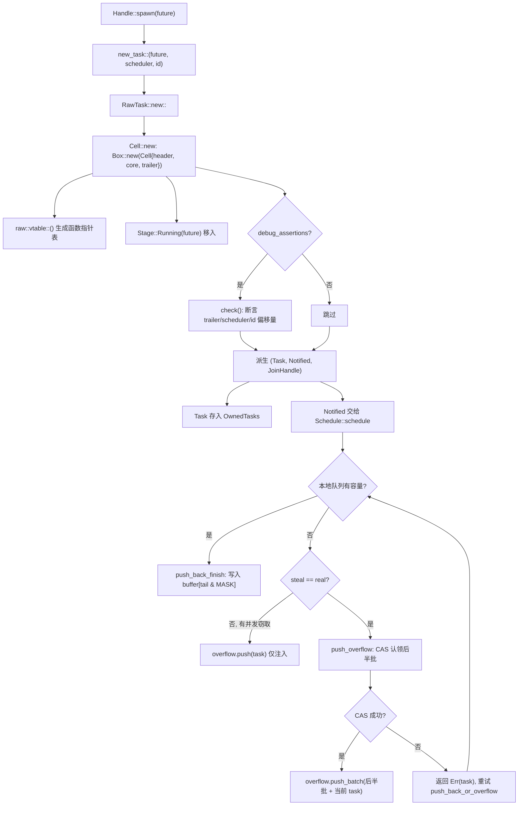
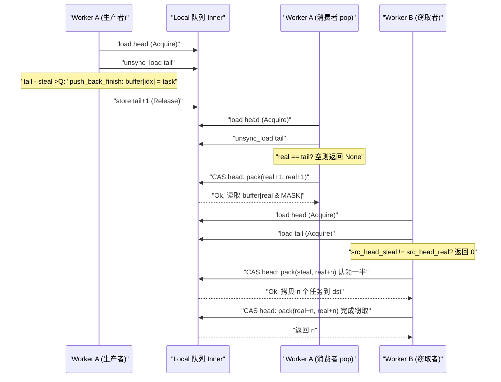

# 第 3 章：タスクの一生（上）：spawn がどのように Future をスケジュール可能な実体に変えるか

前章では Runtime の組み立てを完了しました：I/O driver、time driver、blocking pool、スケジューラが同一の`Runtime`インスタンスに注入され、`Handle`これらのコンポーネントにスレッドをまたいでアクセスするための共有ハンドルとなりました。しかし組み立て済みのランタイムはこの時点ではまだ空の殻にすぎません——タスクを駆動するエンジンは持っているものの、駆動すべきタスクが一つもないのです。本章で答える問いはまさにこれです：`tokio::spawn(async { ... })`と入力した瞬間、その`async`ブロックが一体何を経て、普通の Rust コードから「スケジューラに引き取られ、起床でき、join できる」実体へと変わるのか。これが「タスクの一生」の前半であり、私たちは誕生に焦点を当てます：`Handle::spawn`から出発し、`new_task`の参照カウント割り当てを通過し、`Cell<T, S>`のメモリレイアウトに到達し、最終的にタスクがどのようにしてある worker のローカルキューまたはグローバル注入キューに投入されるのかを見極めます。後半（第4章）でようやくスケジューリングループと poll/wake の閉ループに入ります。

# 3.1 Future はタスクではない：一度の spawn が一体何を創造するのか

## 直感的モデル

`Future`を「レシピ」、タスクを「厨房で調理中の一品」と想像してください。レシピ自体は静的で複製可能であり、実行状態を一切持ちません。厨房（スケジューラ）が「今この料理を作る」と決め、コンロ（worker）、注文番号（TaskId）、提供口（JoinHandle）を割り当てて初めて、それは「仕掛かり中の料理」になります。この包装がなければ、スケジューラは「この料理がどこまで進んだか」「誰が待っているか」「完成したら誰に通知するか」を知る由もなく——ただレシピが見えるだけで、管理できません。

## データ構造とメモリレイアウト

Tokio は`Task<S>`で「ランタイムに所有されるタスク参照」を表し、これは`RawTask`の透過的なラッパーです：

```rust
#[repr(transparent)]
pub(crate) struct Task {
    raw: RawTask,
    _p: PhantomData,
}
```

[FACT:tokio/src/runtime/task/mod.rs:233-238]

`#[repr(transparent)]`は`Task<S>`と`RawTask`がメモリ上で完全に一致することを意味し、追加のオーバーヘッドはありません。`PhantomData<S>`はコンパイル時の型マーカーにすぎず、このタスクがどのスケジューラ型`S`。

に属するかを示します。タスクの全状態を実際に担うのは`Cell<T, S>`であり、そのレイアウトはタスクモジュール全体の基盤です：

```rust
#[repr(C)]
pub(super) struct Cell {
    pub(super) header: Header,
    pub(super) core: Core,
    pub(super) trailer: Trailer,
}
```

[FACT:tokio/src/runtime/task/core.rs:126-136]

三つのフィールドは「ホット-ウォーム-コールド」の順に並んでいます。`Header`はホットデータ（毎回のスケジューリング、毎回の状態遷移でアクセスされる）、`Core`はウォームデータ（poll 時にアクセス）、`Trailer`はコールドデータ（生成と破棄の時のみアクセス）です。コメントには明確にこう書かれています：`Header`は最初のフィールドでなければならない。なぜならタスク構造体は同時に`*mut Cell`と`*mut Header`から参照されるからである[FACT:tokio/src/runtime/task/core.rs:37-43]。

さらに重要なのはキャッシュラインアラインメントです。`Cell`には長い一連の`#[cfg_attr(..., repr(align(...)))]`が付いており、対象アーキテクチャに応じてアラインメントバイト数を選択します：x86_64/aarch64/powerpc64 は128バイト、arm/mips/sparc/hexagon は32バイト、m68k は16バイト、s390x は256バイト、その他はデフォルト64バイト[FACT:tokio/src/runtime/task/core.rs:64-125]。コメントはなぜ x86_64 で64ではなく128を使うのかを説明しています：Intel Sandy Bridge 以降、空間プリフェッチャは**ペアの**64バイトキャッシュラインを一度に取得するため、偽共有を避けるには128バイトにアラインしなければなりません[FACT:tokio/src/runtime/task/core.rs:45-53]。

> **[Design Inference & Architectural Trade-offs]**
> このアラインメント戦略の代償は、各タスクが少なくとも1キャッシュライン分の空間を浪費することです。しかしタスク状態ビット（`state`）は複数の worker スレッドによって高頻度で読み書きされます——あるスレッドが poll 時に RUNNING ビットを設定し、別のスレッドが起床時に NOTIFIED ビットを読む——もし二つのタスクの状態ビットが同じキャッシュラインに載ると、状態遷移のたびにキャッシュラインがコア間で往復バウンドし（cache line ping-pong）、性能損失はメモリ浪費をはるかに超えます。Tokio は空間を時間に換える選択をしました。

`Header`自体は8ポインタサイズ以内に制約されています：

```rust
#[test]
#[cfg(not(loom))]
fn header_lte_cache_line() {
    assert!(std::mem::size_of::() ());
}
```

[FACT:tokio/src/runtime/task/core.rs:591-593]

このテストは`Header`が64バイト（8 × 8）を超えないことを保証し、それによって64バイトキャッシュラインのアーキテクチャ上で完全に1行に収まります。`Header`のフィールドには以下が含まれます：`state: State`（アトミック状態ビット）、`queue_next: UnsafeCell<Option<NonNull<Header>>>`（注入キューの連結リストポインタ）、`vtable: &'static Vtable`（関数ポインタテーブル）、`owner_id: UnsafeCell<Option<NonZeroU64>>`（所属する`OwnedTasks`リストの ID）、`scheduled_at: UnsafeCell<ScheduleLatencyInstant>`（スケジューリング遅延測定）[FACT:tokio/src/runtime/task/core.rs:169-198]。

`Core<T, S>`はスケジューラハンドル`scheduler: S`、タスク ID`task_id: Id`、そして最も核心的な`stage: CoreStage<T>` [FACT:tokio/src/runtime/task/core.rs:148-165]。`Stage`を保持します。

```rust
#[repr(C)]
pub(super) enum Stage {
    Running(T),
    Finished(super::Result),
    Consumed,
}
```

[FACT:tokio/src/runtime/task/core.rs:225-229]

これこそが「Future と Output が同じメモリを再利用する」鍵です：タスク実行中は`Stage::Running`が future を保持し、完了後はその場で`Stage::Finished(output)`に置き換えられ、`JoinHandle`に取り出されると`Stage::Consumed`。`#[repr(C)]`になります。コメントは Miri issue を指し、このレイアウトが unsafe コードの正しさに対して厳格な要件を持つことを説明しています[FACT:tokio/src/runtime/task/core.rs:225-229]。

`Trailer`はコールドデータを格納します：`owned: linked_list::Pointers<Header>`（`OwnedTasks`連結リストポインタ）、`waker: UnsafeCell<Option<Waker>>`（タスク完了を待つ消費者の waker）、`hooks: TaskHarnessScheduleHooks` [FACT:tokio/src/runtime/task/core.rs:205-213]。

## Step-by-Step：spawn からエンキューまで

具体的なシナリオを想定します：multi_thread ランタイムにおいて、worker スレッド A が`tokio::spawn(async { 42 })`。

**を実行します。第一ステップ：タスク三種の神器を構築する。** `new_task`はタスク誕生の唯一の入口です：

```rust
fn new_task(
    task: T,
    scheduler: S,
    id: Id,
    spawned_at: SpawnLocation,
) -> (Task, Notified, JoinHandle)
```

[FACT:tokio/src/runtime/task/mod.rs:336-346]

これは`RawTask::new::<T, S>`を呼び出して`Cell`を割り当て、その後同じ`raw`ポインタから三つの参照を派生させます：`Task`（owned 参照、通常は即座に`OwnedTasks`）、`Notified`（通知参照、スケジューラに渡す）、`JoinHandle`（結果読み取りハンドル）[FACT:tokio/src/runtime/task/mod.rs:347-363]。3つは同じ`raw`を共有しており、それぞれが1つの参照カウントを保持している。

**第2ステップ：`Cell`を割り当て、初期状態を書き込む。** `Cell::new`ヒープ上に構造体全体を割り当てる：

```rust
let result = Box::new(Cell {
    trailer: Trailer::new(scheduler.hooks()),
    header: new_header(state, vtable, ...),
    core: Core {
        scheduler,
        stage: CoreStage {
            stage: UnsafeCell::new(Stage::Running(future)),
        },
        task_id,
        ...
    },
});
```

[FACT:tokio/src/runtime/task/core.rs:261-278]

`vtable`は`raw::vtable::<T, S>()`によって生成され、特定の`T`と`S`に対して単相化された関数ポインタテーブル[FACT:tokio/src/runtime/task/core.rs:260]である。future は直接`Stage::Running`にムーブされ、追加のボックス化はない。

**第3ステップ：debug アサーションでレイアウトを検証する。**では`debug_assertions`の下で、`Cell::new`が`check`関数を呼び出し、`Header::get_trailer`、`Header::get_scheduler`、`Header::get_id_ptr`などの vtable オフセットに基づくポインタ演算を用いて、「header から逆引きしたフィールドアドレス」と「実際のフィールドアドレス」が一致することを1つずつアサートする[FACT:tokio/src/runtime/task/core.rs:280-321]。これは vtable オフセットの正確性に対する実行時セルフチェックである。

**第4ステップ：スケジューラへ投入する。**スケジューラは`Notified<S>`を受け取ると、`Schedule::schedule` [FACT:tokio/src/runtime/task/mod.rs:315]を呼び出す。multi_thread では`push_back_or_overflow`を通り、タスクを現在の worker のローカルキューにプッシュし、キューが満杯の場合はインジェクトキューにオーバーフローする。

次の図は`new_task`からエンキューまでの制御フローと分岐を描いている：



この図はいくつかの重要な分岐を明らかにしている：debug アサーションはデバッグビルドでのみ有効；ローカルキューが満杯のときは直接オーバーフローするのではなく、まず並行スティーラーが存在するか（`steal != real`）を判定し、存在する場合は現在のタスクのみをインジェクトキューにプッシュする。スティーラーが空けたスペースはすぐに利用可能になるからである。

## 設計上の考察：なぜ1つではなく3つの参照なのか

`new_task`は1つではなく3つの参照を返す。これが参照カウント設計の核心である：`Task`は「ランタイムがこのタスクを所有している」ことを表し、`Notified`は「このタスクは通知済みで、スケジュール待ち」を表し、`JoinHandle`は「誰かがその結果を気にしている」を表す。3つのライフサイクルは独立している——`JoinHandle`は drop できる（タスクは実行を続け、結果は破棄される）。`Notified`は poll 後に消える。`Task`はタスクが完了し`OwnedTasks`から削除された後に解放される。参照が1つしかなければ、「タスクはまだ実行中だが誰も join していない」という状態を表現できない。

`UnownedTask`はもう1つの重要な分岐である：これは**2つの**参照カウントを保持し、blocking タスク用である（`OwnedTasks`）[FACT:tokio/src/runtime/task/mod.rs:286-295]。`unowned`に格納されない）。`mem::forget(task)`関数は`mem::forget(notified)`と`UnownedTask` [FACT:tokio/src/runtime/task/mod.rs:388-397]を通じて2つの参照を`OwnedTasks`に統合する。この「2つの参照」の設計動機は：blocking タスクには owned 参照を保持する

# リストがないため、タスクが実行中に解放されないことを保証するために追加の参照カウントが必要となる。

## 3.2 状態ビット：1つの usize でタスクの全ライフサイクルをどうエンコードするか

直感的モデル**タスクの状態を「健康診断レポート」のようなものだと想像しよう。そこにはいくつかの独立したチェックボックスがある：poll 中かどうか、完了したかどうか、通知されたかどうか、キャンセルされたかどうか、誰かが join しているかどうか。Tokio は複数のブールフィールドを使わず、これらのチェックビットを`AtomicUsize`**1つの

## に押し込んでいる。こうすることで各状態遷移は複数回のロックではなく1回の CAS で済む。この設計がなければ、タスクの状態遷移は複数のロックのネストになり、デッドロックのリスクとオーバーヘッドが急増する。

`State`ビットフィールドレイアウト[FACT:tokio/src/runtime/task/mod.rs:32-53]：

- `RUNNING`のビットフィールドはモジュールドキュメントに完全な定義がある**：タスクが poll 中かキャンセル中かどうか。** [FACT:tokio/src/runtime/task/mod.rs:37-38]。
- `COMPLETE`このビットは同時にタスクのロックとしても機能する`RUNNING`：future が完全に完了し drop された。一度セットされると決してクリアされず、決して[FACT:tokio/src/runtime/task/mod.rs:40-41]。
- `NOTIFIED`と同時にセットされない`Notified`：現在[FACT:tokio/src/runtime/task/mod.rs:43]。
- `CANCELLED`オブジェクトが存在するかどうか[FACT:tokio/src/runtime/task/mod.rs:45-46]。
- `JOIN_INTEREST`：タスクはできるだけ早くキャンセルされるべき`JoinHandle` [FACT:tokio/src/runtime/task/mod.rs:48]。
- `JOIN_WAKER`：[FACT:tokio/src/runtime/task/mod.rs:50-51]。

が存在する[FACT:tokio/src/runtime/task/mod.rs:53]。

`RUNNING`：join handle waker のアクセス制御ビットとして`RUNNING`残りのビットは参照カウントに使用される[FACT:tokio/src/runtime/task/mod.rs:130-133]ビットがロックとして機能する点は詳しく述べる価値がある。モジュールドキュメントの Safety セクションは次のように述べている：future への可変アクセスは`RUNNING`ビットを変更してロックを取得した後に行わなければならず、それによって排他的アクセスが保証される

## 。これは、タスクを poll するとき、スレッドがまず CAS で

`JOIN_WAKER`をセットし、成功すれば future を独占する；失敗すれば別のスレッドが poll 中であることを意味し、今回の poll は直接戻る。これは「poll の相互排他」と「状態遷移」を1回のアトミック操作に統合し、個別のミューテックスロックを回避している。`waker`JOIN_WAKER のアクセス制御プロトコル`Trailer`ビットは状態機械の中で最も精妙な部分である。これが解決する問題は：**フィールド（**内）が2つのスレッドから並行アクセスされる——ランタイムはタスク完了時に`JoinHandle`それを**読んで join 者を起こし、**は poll 時に[FACT:tokio/src/runtime/task/mod.rs:75-120]：

1. `JOIN_WAKER`それを

書いて waker を登録する。モジュールドキュメントは7つのルールを示している`JoinHandle`初期値は0。

2. が0のとき、`JoinHandle`は waker フィールドへの排他的（可変）アクセス権を持つ。

3. が1のとき、`COMPLETE`は共有（読み取り専用）アクセス権のみを持つ。

5. `JoinHandle`4. が1かつ`JOIN_WAKER`が1のとき、ランタイムは waker フィールドへの共有（読み取り専用）アクセス権を持つ。`JOIN_WAKER`が waker を書くには：(i)

6. `JoinHandle`を0にセットして排他権を獲得することに成功し、(ii) waker を書き込み、(iii)`COMPLETE`を1にセットすることに成功する必要がある。`JOIN_WAKER`は`COMPLETE`が0のときのみ

を変更できる；ランタイムは`JOIN_INTEREST`が1のときのみ変更できる。`COMPLETE`7. もし

が0かつ`COMPLETE`が1なら、ランタイムは waker フィールドへの排他アクセス権を持つ（waker の drop 用）。[FACT:tokio/src/runtime/task/mod.rs:110-120]ルール6は競合を暗に含んでいる：ステップ (i) または (iii) が失敗する可能性がある。(i) が失敗したら waker の書き込みを諦める；(iii) が失敗したら（その間に別のスレッドが

## をセットした）、waker フィールドをクリアする

`Task`。このプロトコルの本質は：1つのアトミックビットで「書き手」と「読み手」の間で動的に所有権を移転し、waker フィールド専用のロックを回避することである。`UnownedTask`の drop が2回デクリメントされる：

```rust
impl Drop for Task {
    fn drop(&mut self) {
        if self.header().state.ref_dec() {
            self.raw.dealloc();
        }
    }
}
```

[FACT:tokio/src/runtime/task/mod.rs:580-586]

```rust
impl Drop for UnownedTask {
    fn drop(&mut self) {
        if self.raw.header().state.ref_dec_twice() {
            self.raw.dealloc();
        }
    }
}
```

[FACT:tokio/src/runtime/task/mod.rs:590-596]

`ref_dec`を返す`true`これは最後の参照であることを示し、この時点で初めて実際に解放される`Cell`メモリ。`ref_dec_twice`は`UnownedTask`2つのカウントを保持していることの直接的な現れである。

## 設計上の考察：なぜ状態ビットと参照カウントが1つのアトミックを共有するのか

> **[Design Inference & Architectural Trade-offs]**
> 状態ビットと参照カウントを同じ`AtomicUsize`に置くのは、「参照カウントのデクリメント」と「状態ビットの設定」という2つの操作を**1回のCAS**で完了させるためである。モジュールドキュメントは`Schedule::release`のコメントで明確に述べている：「タスクモジュールはref-decとその他のオプションの設定をバッチ処理する」[FACT:tokio/src/runtime/task/mod.rs:302-304]。もし状態ビットと参照カウントが2つの別々のアトミック変数に属していたら、「最後の参照の解放」と「完了のマーク」の間にウィンドウが生じ、追加の同期が必要になる。統合後は、`ref_dec`が「カウントのデクリメント＋ゼロかどうかのチェック」をアトミックに完了でき、ABA類の問題を回避できる。

# 3.3 JoinHandle：結果はどのようにタスク境界を越えて返されるか

## 直感的モデル

`JoinHandle`はレストランが渡す「呼び出しベル」のようなものである。タスク（厨房）が完了すると、料理（output）を受け渡し口（`Stage::Finished`）に置き、あなたの呼び出しベル（waker）を鳴らす。あなたは引換券を持って受け取りに来る。引換券自体は料理を保持せず、受け渡し口へのポインタにすぎない。もし引換券を失くしたら（drop`JoinHandle`）、料理はそのまま捨てられる（outputがdropされる）が、厨房はそれによって停止しない。

## データ構造

`JoinHandle<T>`も同様に`RawTask`への透過的なラッパーである：

```rust
pub struct JoinHandle {
    raw: RawTask,
    _p: PhantomData,
}
```

[FACT:tokio/src/runtime/task/join.rs:163-166]

`PhantomData<T>`は出力型をマークする。`JoinHandle<T>`が`T: Send`になるのは`Send`/`Sync` [FACT:tokio/src/runtime/task/join.rs:169-170]の時のみであり、これにより非Send出力がスレッド間で移動されないことが保証される。

## ステップバイステップ：JoinHandleをawaitする

`JoinHandle`は`Future`を実装しており、その`poll`が結果返却の核心である：

```rust
fn poll(self: Pin, cx: &mut Context) -> Poll {
    ready!(crate::trace::trace_leaf());
    let mut ret = Poll::Pending;
    let coop = ready!(crate::task::coop::poll_proceed(cx));
    unsafe {
        self.raw.try_read_output(&mut ret, cx.waker());
    }
    if ret.is_ready() {
        coop.made_progress();
    }
    ret
}
```

[FACT:tokio/src/runtime/task/join.rs:327-354]

いくつかの詳細に注意：`trace_leaf`はtracing計装に使用される；`coop::poll_proceed`は協調予算を消費する（第12章で詳述）；`try_read_output`はvtableを通じてジェネリクスを消去し、戻り値をスタック上に置き、`*mut ()`を使って[FACT:tokio/src/runtime/task/join.rs:327-354]に渡す。この「戻り値をスタックに置く」テクニックは、vtable関数が戻り値型をジェネリック化できない`T`ためであり、生ポインタを通じてのみ書き戻すことができる。

> **[Design Inference & Architectural Trade-offs]**
> `try_read_output`の内部ロジック（raw.rs内、本章ではソースコード未提供）：まず`COMPLETE`ビットをチェックし、既にセットされていれば`take_output`を呼び出して`Stage::Finished`から結果を取り出す；そうでなければ`cx.waker()`を`Trailer::waker`フィールドに登録し、`Pending`を返す。登録プロセスはまさに3.2節の`JOIN_WAKER`プロトコルに従う。

## 結果の所有権の移動

モジュールドキュメントの「Non-Send output」セクションは結果の所有権ルールを正確に記述している[FACT:tokio/src/runtime/task/mod.rs:151-170]：

- タスク完了時、outputは`Stage`に置かれ、その後「COMPLETEの設定」変換が実行され、その時点の`JOIN_INTEREST`値が読み取られる。
- もし`JOIN_INTEREST`が0なら（`JoinHandle`なし）、outputは即座にdropされる[FACT:tokio/src/runtime/task/mod.rs:157-158]。
- もし`JOIN_INTEREST`が1なら、`JoinHandle`がoutputのクリーンアップを担当する[FACT:tokio/src/runtime/task/mod.rs:160-161]。

非Send outputについて、ドキュメントは3段階の論証を示している：outputはpoll futureのスレッド上で作成される；`JoinHandle<Output>`はOutputが非Sendの時も非Sendであるため、これもspawnスレッド上にある；したがって`JoinHandle`がoutputを取り出すかdropする時にスレッド間で移動されることはない[FACT:tokio/src/runtime/task/mod.rs:164-170]。

## JoinHandleのdrop：高速パスと低速パス

```rust
impl Drop for JoinHandle {
    fn drop(&mut self) {
        if self.raw.state().drop_join_handle_fast().is_ok() {
            return;
        }
        self.raw.drop_join_handle_slow();
    }
}
```

[FACT:tokio/src/runtime/task/join.rs:358-364]

`drop_join_handle_fast`は1回のCASで「`JOIN_INTEREST`ビットのクリア＋参照カウントのデクリメント」を完了しようと試みる。失敗した場合（例えばタスクが完了中で、状態ビットが占有されている）、`drop_join_handle_slow`の低速パスに進む。これは典型的な「楽観的高速パス＋悲観的低速パス」パターンである。

## 設計上の考察：なぜJoinHandleはoutputを直接保持しないのか

> **[Design Inference & Architectural Trade-offs]**
> もし`JoinHandle`がoutputを直接保持していたら、outputはタスク完了時に`JoinHandle`のスレッドへ移動されなければならない。しかし`JoinHandle`は任意のスレッドに移動される可能性があり（`T: Send`でありさえすれば）、outputの生成スレッドはpollスレッドである。直接保持すると「outputはpollスレッドで生成されるが、joinスレッドでdropされる」というスレッド間移動が生じ、非Send outputに対して型システムに直接違反する。Tokioはoutputを`Cell`内に留めることを選択した（`Stage::Finished`），`JoinHandle`は`Cell`への`RawTask`のみを保持し、結果取得時には`take_output`を通じてその場で取り出す。これによりoutputのdropは`JoinHandle`のスレッドで発生するが、その前提はそのスレッドがpollスレッドと同じであることである（非Sendシナリオでは成立する）。

# 3.4 ローカルキュー：work-stealingのプロデューサー-コンシューマー構造

## 直感的モデル

各workerは「プライベートなToDoリスト」（ローカルキュー）を持ち、容量は256。worker自身は**先頭**からタスクを取り出し（LIFO、キャッシュ局所性を活用）、他のworkerは**末尾**からタスクを盗む（FIFO、最も古く、最も完了している可能性が高いタスクを取る）。もしローカルキューがなければ、すべてのタスクがグローバルキューに集中し、タスク取得のたびにグローバルロックを競合することになり、マルチコアのスケーラビリティが崩壊する。

## メモリレイアウト：headとtailの分離

```rust
pub(crate) struct Inner {
    head: AtomicUnsignedLong,
    tail: AtomicUnsignedShort,
    buffer: Box>>; LOCAL_QUEUE_CAPACITY]>,
}
```

[FACT:tokio/src/runtime/scheduler/multi_thread/queue.rs:36-57]

`head`は`AtomicUnsignedLong`（64ビット、プラットフォームがu64をサポートする場合）、`tail`は`AtomicUnsignedShort`（32ビット）。コメントはなぜインデックスが実際に必要な幅より広いのかを説明している：ABA緩和のため、および「満杯」と「空」のバッファを区別するため[FACT:tokio/src/runtime/scheduler/multi_thread/queue.rs:37-49]。

`head`内部にパックされている**2つの** `UnsignedShort`：下位は「リアルヘッド」（real head）、上位は「窃取者が処理中の最初の位置」（steal head）。両者が等しいとき、アクティブな窃取者は存在しない[FACT:tokio/src/runtime/scheduler/multi_thread/queue.rs:39-49]。この二値パッキングは work-stealing キューの核心的なテクニックである：窃取者はまず CAS で steal 値を更新してタスクのバッチを「claim」し、完了後に steal 値を real 値まで追いつかせて、窃取の終了を表す。

`LOCAL_QUEUE_CAPACITY`非 loom では 256、loom では 4 に縮小してより多くの境界をテストできるようにする[FACT:tokio/src/runtime/scheduler/multi_thread/queue.rs:62-69]。`MASK = LOCAL_QUEUE_CAPACITY - 1`、リングバッファのインデックスに使用[FACT:tokio/src/runtime/scheduler/multi_thread/queue.rs:71]。

## Step-by-Step：push_back_or_overflow の完全な分岐

これはローカルキューの最も複雑な関数であり、分岐ごとに解析していく：

```rust
pub(crate) fn push_back_or_overflow>(
    &mut self,
    mut task: task::Notified,
    overflow: &O,
    stats: &mut Stats,
) {
    let tail = loop {
        let head = self.inner.head.load(Acquire);
        let (steal, real) = unpack(head);
        let tail = unsafe { self.inner.tail.unsync_load() };

        if tail.wrapping_sub(steal)  return,
                Err(v) => { task = v; }
            }
        }
    };
    self.push_back_finish(task, tail);
}
```

[FACT:tokio/src/runtime/scheduler/multi_thread/queue.rs:188-223]

三つの分岐：

1. **容量あり**（`tail - steal < CAPACITY`）：`break tail`、ループを抜けた後に呼び出す`push_back_finish`でバッファに書き込む。

2. **容量なしだが並行窃取者がいる**（`steal != real`）：窃取者がスペースを空けるので、現在のタスクだけを注入キューにプッシュし、即座に戻る[FACT:tokio/src/runtime/scheduler/multi_thread/queue.rs:204-208]。

3. **容量なし且つ窃取者なし**：呼び出す`push_overflow`で後半バッチのタスクを注入キューにオーバーフローさせる[FACT:tokio/src/runtime/scheduler/multi_thread/queue.rs:209-219]。CAS が失敗した場合（並行窃取者に負けた場合）、`push_overflow`が返る`Err(task)`、ループでリトライ。

`push_back_finish`でタスクを書き込み tail を更新：

```rust
fn push_back_finish(&self, task: task::Notified, tail: UnsignedShort) {
    let idx = tail as usize & MASK;
    self.inner.buffer[idx].with_mut(|ptr| {
        unsafe { ptr::write((*ptr).as_mut_ptr(), task); }
    });
    self.inner.tail.store(tail.wrapping_add(1), Release);
}
```

[FACT:tokio/src/runtime/scheduler/multi_thread/queue.rs:226-244]

`Release`の順序が書き込まれたタスクを窃取者に対して可視にすることを保証する。

## push_overflow：なぜ後半バッチをオーバーフローさせるのか

```rust
const NUM_TASKS_TAKEN: UnsignedShort = (LOCAL_QUEUE_CAPACITY / 2) as UnsignedShort;
```

[FACT:tokio/src/runtime/scheduler/multi_thread/queue.rs:265]

オーバーフロー時に 128 個のタスクを取り出す。コメントでなぜ**後半バッチ**を取るのか（前半バッチではなく）[FACT:tokio/src/runtime/scheduler/multi_thread/queue.rs:295-306]が詳細に説明されている：注入キューからタスクを取るとき、常に前半部分に置かれる。したがって、あるタスクが後半部分にあれば、それが注入キューから取られたばかりではないと確定できる。これにより「注入キューから取り出されたタスクが即座に注入キューに戻されない」（少なくとも一度 poll されるまで）ことが保証される。

CAS で後半バッチを claim：

```rust
if self.inner.head.compare_exchange_weak(
    pack(head, head), pack(tail, tail), Release, Relaxed
).is_err() {
    return Err(task);
}
```

[FACT:tokio/src/runtime/scheduler/multi_thread/queue.rs:283-293]

`head`を`(head, head)`から`(tail, tail)`に更新する。すなわち steal と real を同時に tail まで進め、全タスクを claim する。成功後に tail を`tail + NUM_TASKS_TAKEN`に巻き戻し、前半バッチがまだローカルキューに残っていることを表す[FACT:tokio/src/runtime/scheduler/multi_thread/queue.rs:314-316]。

## pop と steal_into：タスクを取る二つの経路

`pop`は worker 自身がタスクを取る（先頭から、LIFO）：

```rust
pub(crate) fn pop(&mut self) -> Option> {
    let mut head = self.inner.head.load(Acquire);
    let idx = loop {
        let (steal, real) = unpack(head);
        let tail = unsafe { self.inner.tail.unsync_load() };
        if real == tail { return None; }
        let next_real = real.wrapping_add(1);
        let next = if steal == real {
            pack(next_real, next_real)
        } else {
            assert_ne!(steal, next_real);
            pack(steal, next_real)
        };
        let res = self.inner.head.compare_exchange_weak(head, next, AcqRel, Acquire);
        match res {
            Ok(_) => break real as usize & MASK,
            Err(actual) => head = actual,
        }
    };
    Some(self.inner.buffer[idx].with(|ptr| unsafe { ptr::read(ptr).assume_init() }))
}
```

[FACT:tokio/src/runtime/scheduler/multi_thread/queue.rs:361-399]

重要な分岐：もし`steal == real`（窃取者なし）なら、両方を同時に進める；そうでなければ real のみを進め、steal は動かさない[FACT:tokio/src/runtime/scheduler/multi_thread/queue.rs:377-384]。`assert_ne!(steal, next_real)`は real を steal の位置まで進めないことを保証する。そうでなければ窃取者の claim 状態を破壊してしまう。

`steal_into`は窃取経路であり、まず対象キューに十分なスペースがあるか確認する：

```rust
if dst_tail.wrapping_sub(steal) > LOCAL_QUEUE_CAPACITY as UnsignedShort / 2 {
    return None;
}
```

[FACT:tokio/src/runtime/scheduler/multi_thread/queue.rs:431-435]

対象キューが半分以上埋まっていれば窃取しない。窃取後に即座にオーバーフローするのを避けるため。

`steal_into2`は窃取の核心であり、窃取数を計算する：

```rust
let n = src_tail.wrapping_sub(src_head_real);
let n = n - n / 2;
```

[FACT:tokio/src/runtime/scheduler/multi_thread/queue.rs:487-488]

半分（切り上げ）を窃取する。そして CAS で head の steal 値を更新して claim する：

```rust
let steal_to = src_head_real.wrapping_add(n);
next_packed = pack(src_head_steal, steal_to);
let res = self.0.head.compare_exchange_weak(prev_packed, next_packed, AcqRel, Acquire);
```

[FACT:tokio/src/runtime/scheduler/multi_thread/queue.rs:496-506]

ここでは real 値のみを更新していることに注意（`pack(src_head_steal, steal_to)`では steal は変わらない）、real を`steal_to`まで進める。これは「これらのタスクは claim 済みで、他の窃取者は触れられない」ことを表す。窃取完了後、steal を real まで追いつかせる：

```rust
loop {
    let head = unpack(prev_packed).1;
    next_packed = pack(head, head);
    let res = self.0.head.compare_exchange_weak(prev_packed, next_packed, AcqRel, Acquire);
    match res {
        Ok(_) => return n,
        Err(actual) => prev_packed = actual,
    }
}
```

[FACT:tokio/src/runtime/scheduler/multi_thread/queue.rs:548-561]

以下のシーケンス図は「生産者 push、消費者 pop、窃取者 steal」の三者並行インタラクションを描いている：



## 設計の考察：なぜローカルキューは LIFO で窃取は FIFO なのか

> **[Design Inference & Architectural Trade-offs]**
> worker 自身は先頭から取る（LIFO）。なぜなら最近プッシュされたタスクが最も CPU キャッシュに残っている可能性が高く、また「ちょうど起こされてデータがまだ熱い」タスクである可能性が最も高いから。窃取者は末尾から取る（FIFO）。なぜなら最も古いタスクが既に大部分の作業を完了している可能性が最も高く、それを窃取すれば被害者の負荷を最速で軽減できるから。この「LIFO ローカル + FIFO 窃取」の組み合わせは work-stealing スケジューリングの古典的な設計であり、キャッシュ局所性と負荷分散を両立している。

ここまでで、タスクは Future からスケジュール可能な実体への変態を完了した：参照カウントが割り当てられ、`Cell`のメモリレイアウトに配置され、worker のローカルキューまたはグローバル注入キューに正常に投入された。しかしタスクがキューに入れられたのは始まりに過ぎず、実際にそれを動かすのは worker スレッドのスケジューリングループである。次の章では「タスクの一生」の後半に入り、worker がどのようにキューからタスクを取り出し、`Future::poll`を呼び出し、`Pending`を返す際に`Waker`を通じて wake を登録し、最終的に`schedule`の再エンキューをトリガーする——「wake → エンキュー → 再 poll」という閉ループの完全な呼び出しパス、そして work-stealing 戦略と LIFO スロット最適化がそこで明らかになる。
