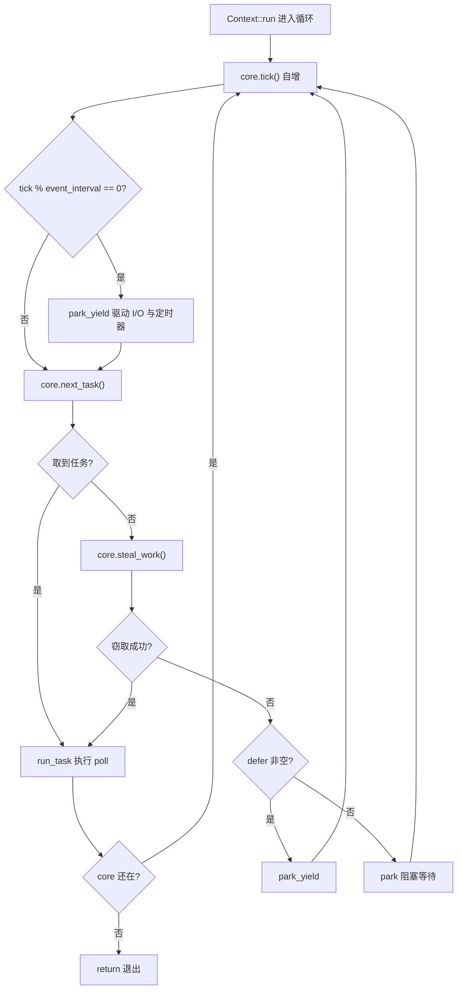
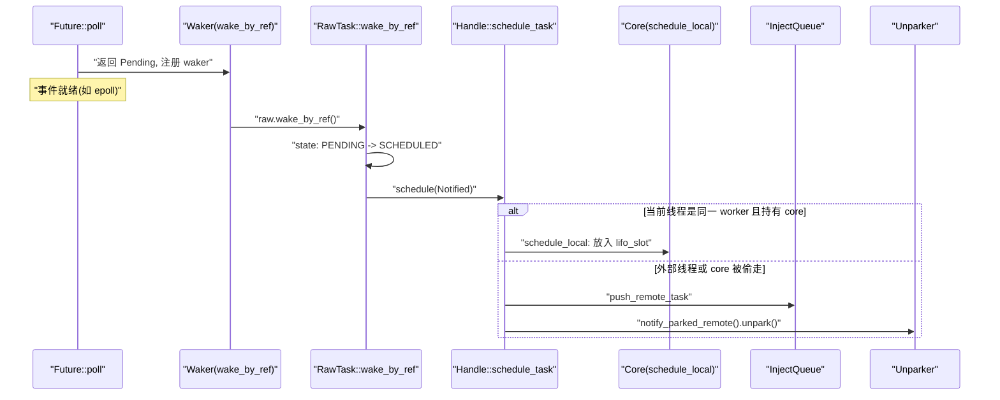
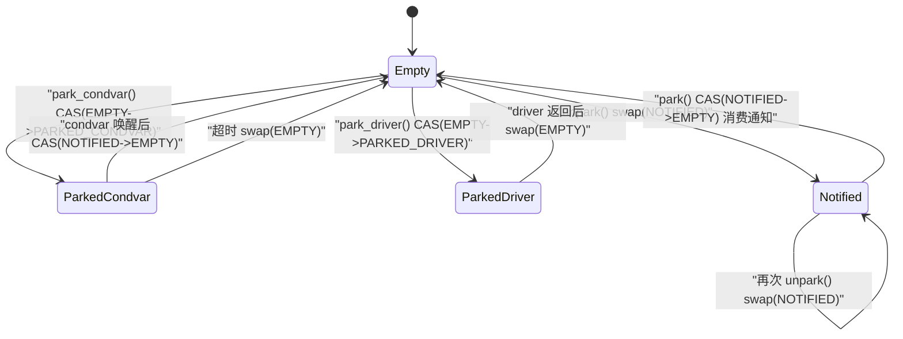

# 第 4 章：タスクの一生（下）：スケジューリングループ、poll、wake の閉ループ

# キューから実行へ：worker メインループの骨格

前の章でタスクを`Local`キューまたはグローバル注入キューに入れた。しかしキューは「ToDo リスト」に過ぎず、実際にタスクを走らせるのは worker スレッド内の決して止まらないループである。この章では`Context::run`を追跡する——これはマルチスレッドスケジューラ全体の心臓である。

まず直感を確立しよう：worker スレッドは料理人のようなもので、目の前に自分の注文の山（`run_queue`）があり、隣には共有の注文棚（`inject`）もある。料理人はまず手元の一番近い一枚を見る（`lifo_slot`）、自分の山から取れなければ、それもなければ公共の棚から一掴み取り、それでもダメなら他のシェフの山から何枚か盗む。全部空になって初めて休憩に入るが、休憩中も耳は立てたまま——注文が入ればすぐに目を覚ます。

このループがなければ、タスクはキューに入れられた後永遠にキューに横たわり、`Future::poll`永遠に呼び出されることはなく、ランタイム全体が死んだデータの山となる。

## Coreのメモリレイアウトと状態フィールド

workerの可変状態はすべて`Core`に格納され、それは`Box`によってヒープ上に割り当てられ、`AtomicCell<Core>`を介して`Worker`とスレッドローカルの`Context`の間で受け渡される。

`Core`の主要フィールドは以下の通り[FACT:tokio/src/runtime/scheduler/multi_thread/worker.rs:113-167]：

- `tick: u32`：毎回のループでインクリメントされ、定期的なメンテナンス（`maintenance`）とグローバルキューのチェックをトリガーする。
- `lifo_slot: Option<Notified>`：**LIFOスロット**、これは本章で最も精妙な設計である。workerが自分でタスクをスケジュールするとき、`run_queue`には入れず、このスロットに入れ、次回タスク取得時に**優先的に**ここから取る。
- `lifo_enabled: bool`：LIFOスロットのスイッチ。ping-pongシナリオでの飢餓を防ぐために使用。
- `run_queue: queue::Local<Arc<Handle>>`：ローカルキュー。前章で分析した`Local`構造。
- `is_searching: bool`：workerが盗めるタスクを検索中かどうか。
- `is_shutdown: bool` / `is_traced: bool`：シャットダウンとトレースのフラグ。
- `park: Option<Parker>`：park器。`Option`でラップしているのは、借用チェッカーの下で簡単に取り出し/戻しを行うため。
- `global_queue_interval: u32`：グローバルキューをどのくらいの頻度でチェックするか。
- `rand: FastRand`：高速乱数生成器。盗みの開始点をランダムに選択するために使用。

> **[Design Inference & Architectural Trade-offs]**
> 注意`lifo_slot`は`Option<Notified>`でありキューではない——それは**1つ**のタスクのみを格納する。この設計の動機はソースコードのコメントにはっきりと書かれている[FACT:tokio/src/runtime/scheduler/multi_thread/worker.rs:117-121]：workerが自分でスケジュールしたタスクはこのスロットに格納され、workerは`run_queue` **をチェックする前に**まずこれをチェックする。効果は「最後にスケジュールされたタスクが次に実行される」（LIFO）。これは局所性を改善するためであり、メッセージパッシングパターンに特に有効で、レイテンシを低減できる。

なぜLIFOがレイテンシを低減できるのか？典型的なメッセージパッシングシナリオを考えよう：タスクAがメッセージを処理した後タスクBを起こし、Bが処理した後またAを起こす。もしAがBを起こした後Bがすぐに実行されれば、Bが必要とするデータはおそらくまだCPUキャッシュにある（Aがちょうど触ったばかりだから）。もしBがキューの末尾に押し込まれ、前の数十のタスクが実行されるのを待つと、キャッシュはとっくに追い出されている。

しかしLIFOには飢餓のリスクがある。ソースコードでは`MAX_LIFO_POLLS_PER_TICK = 3`を使用して[FACT:tokio/src/runtime/scheduler/multi_thread/worker.rs:263-263]を制限している：各tickで最大3回までLIFOスロットを優先し、超えると無効化し、他のタスクに実行の機会を与える。

## メインループのウォークスルー：1回の完全なスケジューリングサイクル

具体的なシナリオを想定しよう：worker 0がちょうど`park`から目覚め、`run_queue`に5つのタスクがあり、`lifo_slot`に1つのタスクがあり、グローバルキューに3つのタスクがある。

メインループの入口は`Context::run` [FACT:tokio/src/runtime/scheduler/multi_thread/worker.rs:570-642]。まず`lifo_enabled`をリセットする（coreが`block_in_place`に盗まれた可能性があり、状態を元に戻す必要がある）[FACT:tokio/src/runtime/scheduler/multi_thread/worker.rs:571-573]、そして`while !core.is_shutdown`ループに入る。

各ループで4つのことを行う：

**ステップ1：tickとメンテナンス。** `core.tick()`がカウンタ[FACT:tokio/src/runtime/scheduler/multi_thread/worker.rs:587]をインクリメントする。次に`self.maintenance(core)`が`tick % event_interval == 0`をチェックし、そうであれば`park_yield`を呼び出して0タイムアウトでI/Oとタイマーを駆動する[FACT:tokio/src/runtime/scheduler/multi_thread/worker.rs:809-826]。

**ステップ2：タスク取得。** `core.next_task(&self.worker)`は核心的なタスク取得ロジック[FACT:tokio/src/runtime/scheduler/multi_thread/worker.rs:1090-1156]。それは2つのパスに分かれる：

- `tick % global_queue_interval == 0`のとき、**優先的に**グローバルキューから取り、取れなければローカル[FACT:tokio/src/runtime/scheduler/multi_thread/worker.rs:1091-1098]を取る。これはグローバルキューのタスクが飢餓になるのを防ぐため。
- そうでなければ**優先的に**ローカルタスクを取る[FACT:tokio/src/runtime/scheduler/multi_thread/worker.rs:1090-1156]。

ローカルタスク取得は`next_local_task`によって行われる[FACT:tokio/src/runtime/scheduler/multi_thread/worker.rs:1158-1160]：

```rust
fn next_local_task(&mut self) -> Option {
    self.lifo_slot.take().or_else(|| self.run_queue.pop())
}
```

まずLIFOスロットを取り、次にキューの先頭を取る（LIFOポップ）。これが前章で述べた「ローカルLIFO」である。

ローカルが空だがグローバルキューが空でない場合、workerは**バッチで**グローバルキューからタスクを取得する[FACT:tokio/src/runtime/scheduler/multi_thread/worker.rs:1110-1154]。バッチサイズ`n`の計算は非常に工夫されている：`min(inject.len() / remotes.len() + 1, cap)`、ここで`cap`はさらに`min(remaining_slots, max_capacity / 2)`を取る。ソースコードのコメントはなぜキューの容量の半分に制限するのか[FACT:tokio/src/runtime/scheduler/multi_thread/worker.rs:1120-1131]を説明している：取得したタスクがローカルキューの**前半部分**に収まることを保証し、これにより後でオーバーフローが発生しても、これらのタスクがグローバルキューに押し戻されない（オーバーフローは後半部分にのみ影響する）。

**ステップ3：タスク実行。**がタスクを取得した後`run_task` [FACT:tokio/src/runtime/scheduler/multi_thread/worker.rs:647-796]を呼び出す。これは本章で最も複雑な関数であり、次の節で専門的に展開する。

**ステップ4：盗みまたはpark。**もし`next_task`が`None`を返したら、ローカルとグローバルの両方に仕事がないことを意味し、`steal_work` [FACT:tokio/src/runtime/scheduler/multi_thread/worker.rs:1167-1195]を呼び出す。盗みが失敗した場合は`park`または`park_yield` [FACT:tokio/src/runtime/scheduler/multi_thread/worker.rs:613-621]。

に入る。制御フロー全体は以下の通り：



## run_task：pollとLIFOスロットの閉ループ

`run_task`はタスクが実際に`poll`される場所であり、「起床 → エンキュー → 再poll」閉ループの収束点でもある。

関数に入って最初のことは`assert_owner` [FACT:tokio/src/runtime/scheduler/multi_thread/worker.rs:648]で、`Notified`を`Task`に変換し、同時に現在のスレッドが確かにこのタスクのownerであることをアサートする（debugアサート）。

次に`transition_from_searching` [FACT:tokio/src/runtime/scheduler/multi_thread/worker.rs:652]——もしworkerが以前検索状態にあったなら、今タスクを見つけたので、検索状態を終了し、他のparked workerを起こす可能性がある。

そして重要なbudgetラップ[FACT:tokio/src/runtime/scheduler/multi_thread/worker.rs:695-795]：

```rust
coop::budget(|| {
    task.run();
    let mut lifo_polls = 0;
    loop {
        let mut core = match self.core.borrow_mut().take() {
            Some(core) => core,
            None => return ControlFlow::Break(()),
        };
        let task = match core.lifo_slot.take() {
            Some(task) => task,
            None => {
                self.reset_lifo_enabled(&mut core);
                core.stats.end_poll();
                return ControlFlow::Continue(core);
            }
        };
        if !coop::has_budget_remaining() {
            core.run_queue.push_back_or_overflow(task, ...);
            return ControlFlow::Continue(core);
        }
        lifo_polls += 1;
        if lifo_polls >= MAX_LIFO_POLLS_PER_TICK {
            core.lifo_enabled = false;
        }
        let task = self.worker.handle.shared.owned.assert_owner(task);
        *self.core.borrow_mut() = Some(core);
        task.run();
    }
})
```

このコードはLIFOスロットの完全な閉ループを明らかにする：`task.run()`が`Future::poll`を実行し、poll中にタスクが自分自身または他のタスクを起こした場合、`schedule_local`が新しいタスクを`lifo_slot` [FACT:tokio/src/runtime/scheduler/multi_thread/worker.rs:1396-1408]に入れる。pollが戻った後、ループはすぐに`lifo_slot`をチェックし、タスクがあれば実行を続ける——**メインループに戻らず**、同じbudget内で連続してpollする。

これが「起床 → エンキュー → 再poll」のLIFOパス上での具現化である：起床時にタスクが`lifo_slot`に入れられ、pollが戻った後すぐに取り出されて再pollされ、緊密な閉ループを形成する。

注意`self.core.borrow_mut().take()`の`None`分岐[FACT:tokio/src/runtime/scheduler/multi_thread/worker.rs:716-724]：もしcoreが盗まれた場合（例えばタスク内で`block_in_place`が呼ばれた）、workerは`ControlFlow::Break(())`を返さなければならず、`Context::run`を終了させる。これは`block_in_place`スケジューリングループとの相互作用点。

## ウェイクアップパス：Waker がどのように再エンキューをトリガーするか

ときに`Future::poll`が`Pending`を返すと、タスクは`Waker`を登録する必要があり、イベントが準備完了になるとウェイクアップされる。Tokio の`Waker`実装は極めて簡潔——タスクの`Header`への生ポインタと vtable だけである。

`waker_ref`を構築し、`WakerRef` [FACT:tokio/src/runtime/task/waker.rs:11-34]で`ManuallyDrop`をラップして`Waker`drop 時の参照カウント減少を避ける。vtable は静的な[FACT:tokio/src/runtime/task/waker.rs:119-119]：

```rust
static WAKER_VTABLE: RawWakerVTable =
    RawWakerVTable::new(clone_waker, wake_by_val, wake_by_ref, drop_waker);
```

4つの関数はすべて生ポインタを`Header`に復元し、その後`RawTask`の対応するメソッドを呼び出す[FACT:tokio/src/runtime/task/waker.rs:70-116]。例えば`wake_by_ref`は最終的に`raw.wake_by_ref()` [FACT:tokio/src/runtime/task/waker.rs:106-116]。

`wake_by_ref`を呼び出す。そのセマンティクスは：タスク状態を`PENDING`から`SCHEDULED`に変換し、変換が成功した場合（つまり以前が確かに PENDING だった場合）、`Schedule::schedule`を呼び出してタスクを再エンキューする。

マルチスレッドスケジューラの場合、`schedule`の実装は`Handle::schedule_task` [FACT:tokio/src/runtime/scheduler/multi_thread/worker.rs:1353-1376]：

```rust
pub(super) fn schedule_task(&self, task: Notified, is_yield: bool) {
    with_current(|maybe_cx| {
        if let Some(cx) = maybe_cx {
            if self.ptr_eq(&cx.worker.handle) {
                if let Some(core) = cx.core.borrow_mut().as_mut() {
                    self.schedule_local(core, task, is_yield);
                    return;
                }
            }
        }
        self.push_remote_task(task);
        self.notify_parked_remote();
    });
}
```

ロジックは2つの分岐に分かれる：

- 現在のスレッドがこのスケジューラの worker であり、かつ core を保持している場合、`schedule_local` [FACT:tokio/src/runtime/scheduler/multi_thread/worker.rs:1385-1417]へ——LIFO スロットまたはローカルキューに入れる。
- そうでない場合（外部スレッドからのウェイクアップ、または core が盗まれた場合）、`push_remote_task`へ進みグローバル注入キューにプッシュし、`notify_parked_remote`で parked worker をウェイクアップする[FACT:tokio/src/runtime/scheduler/multi_thread/worker.rs:1379-1383]。

`schedule_local`内部はさらに2つの分岐に分かれる[FACT:tokio/src/runtime/scheduler/multi_thread/worker.rs:1385-1417]：もし`yield`または LIFO が無効化されている場合、`run_queue`の末尾にプッシュする；そうでなければ`lifo_slot`に入れ、元のスロットにあったタスクをキューの末尾に押し出す。



## park と unpark：状態機械とウェイクアップの原子性

worker はやることがないときに park するが、park/unpark は最も競合が発生しやすい場所である。Tokio は`AtomicUsize`状態機械と`Condvar`フォールバックでこれを解決している。

`Inner`のフィールド[FACT:tokio/src/runtime/scheduler/multi_thread/park.rs:31-43]：`state: AtomicUsize`、`mutex: Mutex<()>`、`condvar: Condvar`、`shared: Arc<Shared>`。状態定数は4つある[FACT:tokio/src/runtime/scheduler/multi_thread/park.rs:36-45]：

- `EMPTY = 0`：park されていない。
- `PARKED_CONDVAR = 1`：condvar 上で park する。
- `PARKED_DRIVER = 2`：I/O driver 上で park する。
- `NOTIFIED = 3`：すでにウェイクアップされている。

これは明示的な状態機械であり、これを使って状態図を描く（これは本章で唯一`stateDiagram-v2`の准入条件に合致する箇所である——ソースコードに確かにこれら4つの状態定数が存在する）：



`unpark`の実装[FACT:tokio/src/runtime/scheduler/multi_thread/park.rs:277-290]は`swap`ではなく CAS を使用している。ソースコードのコメントがその理由を説明している[FACT:tokio/src/runtime/scheduler/multi_thread/park.rs:277-290]：park スレッドが unpark 前の書き込みを観察できるように release 操作を実行する必要があるため、たとえ state がすでに`NOTIFIED`であっても一度書き込む必要がある。

`park`まず既存の通知を消費しようと試みる[FACT:tokio/src/runtime/scheduler/multi_thread/park.rs:132-149]：もし CAS`NOTIFIED -> EMPTY`が成功すれば、以前にウェイクアップされていたことを意味し、ブロックせずに直接戻る。そうでなければ driver ロックの取得を試み、取得できれば driver 上で park し、取得できなければ condvar でフォールバックする[FACT:tokio/src/runtime/scheduler/multi_thread/park.rs:143-148]。

`park_condvar`には古典的な二重チェックがある[FACT:tokio/src/runtime/scheduler/multi_thread/park.rs:162-180]：まず CAS`EMPTY -> PARKED_CONDVAR`、もし失敗してかつ`NOTIFIED`であれば、状態設定前にウェイクアップされたことを意味し、このとき必ず`swap(EMPTY)`して unpark の書き込みを同期させる必要がある[FACT:tokio/src/runtime/scheduler/multi_thread/park.rs:167-177]。コメントは特に強調している：たとえ`NOTIFIED`とわかっていても必ず一度読み取る必要がある。なぜなら unpark が我々が`NOTIFIED`を読んだ後に再度呼び出される可能性があるからである。

`unpark_condvar`のコメント[FACT:tokio/src/runtime/scheduler/multi_thread/park.rs:292-307]は condvar の古典的な罠を指摘している：parked スレッドが`PARKED`状態を設定してから実際に`wait`するまでの間にウィンドウ期間があり、この間に notify されると無視される。解決策は、park スレッドがこのとき`mutex`を保持しており、unpark スレッドがまず`drop(self.mutex.lock())`でロックを取得し（それによって park スレッドの解放を待つ）、その後`notify_one`。

# 設計上の考察：なぜ LIFO スロットは単一スロットでありキューではないのか

> **[Design Inference & Architectural Trade-offs]**
> 単一スロット設計は意図的なトレードオフである。もしキューを使えば、毎回のウェイクアップでエンキュー、毎回のタスク取得でデキューが必要となり、オーバーヘッドが大きくなる；さらにキューは複数のタスクを蓄積し、「最近ウェイクアップされたものが最初に実行される」という局所性の仮定を壊す。単一スロットのセマンティクスは「直近の1つだけを覚える」であり、押し出されたタスクは通常のキューに入る——これはちょうど局所性の収益逓減の法則に合致する：直近の1つのタスクが最も熱く、2番目がその次、3番目以降は収益が非常に小さくなる。

`MAX_LIFO_POLLS_PER_TICK = 3`このマジックナンバー[FACT:tokio/src/runtime/scheduler/multi_thread/worker.rs:263-263]も経験値である。ソースコードのコメントには「LIFO スロットを数回実行すれば局所性の恩恵を受けるのに十分と思われ、3回を超えると過度に重み付けされる可能性がある」とある。これは A が B をウェイクアップし、B が A をウェイクアップする ping-pong シナリオが他のタスクを飢えさせるのを防ぐ。

もう一つの注目すべき設計は`steal_work`の「半数探索」戦略である[FACT:tokio/src/runtime/scheduler/multi_thread/worker.rs:1158-1160]：半分未満の worker が探索しているときにのみ、新しい worker が実際に盗みを試みる。これによりすべての worker が同時に狂ったように盗みを行い CAS 競合が発生するのを避ける。`transition_to_searching`は`idle.transition_worker_to_searching()`を通じて[FACT:tokio/src/runtime/scheduler/multi_thread/worker.rs:1197-1203]。

を調整する[FACT:tokio/src/runtime/scheduler/multi_thread/worker.rs:1172-1174]盗みはランダムな開始点から始まり[FACT:tokio/src/runtime/scheduler/multi_thread/worker.rs:1179-1182]、すべての remote を走査し、自分自身をスキップし`steal_into`、[FACT:tokio/src/runtime/scheduler/multi_thread/worker.rs:1197-1203]。

# を呼び出して盗みを試みる。すべて失敗したらグローバルキューにフォールバックする

本章のまとめ`Context::run`worker メインループ`run_task`はスケジューラの心臓である：各ラウンドの tick 後にまずタスクを取得し（LIFO スロット → ローカルキュー → グローバルキュー）、取得できれば`run_task`で poll を実行し、取得できなければ盗み、盗みに失敗すれば park する。`Waker`内部の LIFO ループは「ウェイクアップ → エンキュー → 再 poll」を同じ budget 内に圧縮し、低遅延の閉ループを形成する。`wake_by_ref`は生ポインタと静的 vtable であり、`schedule`は状態遷移を通じて`park`/`unpark`をトリガーし、現在のスレッドが同じ worker かどうかでローカルキューかグローバルキューかを決定する。

は4状態の原子的機械と condvar フォールバックで、ウェイクアップ喪失の古典的な競合を解決している。`Waker`次章ではスケジューラを離れ、I/O の世界に入る：Reactor がどのように epoll イベントを`AsyncFd`のウェイクアップに変換し、`Pending`の`Ready`。

# を

本章の考察とセルフチェック`next_local_task`Q1: もし`run_queue`次に取得する`lifo_slot`、メッセージパッシングが密集するシナリオではどのような結果になるか？

**参考解析**：`next_local_task`現在の実装は`self.lifo_slot.take().or_else(|| self.run_queue.pop())` [FACT:tokio/src/runtime/scheduler/multi_thread/worker.rs:1158-1160]、まず LIFO スロットを取得する。もし逆に先に`run_queue`を取得すると、起こされたばかりでデータがまだホットなタスクが、キューの他のタスクの後ろに回される。A→B→A のメッセージパッシングパターンでは、B は起こされてもすぐには実行されず、キューの他のタスクが終わるのを待つ。このとき A が書き込んだデータは CPU キャッシュから追い出されている可能性があり、局所性の利益が失われる。さらに深刻なのは、`lifo_slot`内のタスクが`run_queue`が空になるまでずっと待たされ、レイテンシが著しく増加することである。ソースコードのコメント[FACT:tokio/src/runtime/scheduler/multi_thread/worker.rs:117-121]は、この順序が「局所性を改善し、メッセージパッシングパターンの恩恵を受け、レイテンシを低減する」ためであると明確に指摘している。

Q2: `park_condvar`において、もし`Err(NOTIFIED)`分岐内の`self.state.swap(EMPTY, SeqCst)`を削除し、`return`だけを残すと、どのような問題が起きるか？

**参考解析**：ソースコードは`Err(NOTIFIED)`分岐内で`let old = self.state.swap(EMPTY, SeqCst)` [FACT:tokio/src/runtime/scheduler/multi_thread/park.rs:167-177]を実行する。コメントは[FACT:tokio/src/runtime/scheduler/multi_thread/park.rs:168-173]と説明している：unpark は我々が`NOTIFIED`を読んだ後に再度呼び出された可能性があり、その unpark と同期するために一度 acquire 操作を実行しなければ、その前のすべての書き込みを観測できない。もし`return`のみで swap しなければ、state は`NOTIFIED`に留まり、次回 park 時に CAS`NOTIFIED -> EMPTY`が成功して即座に戻る（すでに期限切れの通知を消費してしまう）。しかしさらに悪いことに、unpark の release 書き込みが同期されず、park スレッドが unpark 前に書き込まれたデータを見られない可能性があり、メモリ可視性の問題を引き起こす。これは典型的な「失われたウェイクアップ＋メモリオーダー」の二重バグである。

Q3: `run_task`において、`self.core.borrow_mut().take()`が`None`を返すとき、なぜ`ControlFlow::Break(())`ではなく`Continue`？

**を返すのか？**：`self.core.borrow_mut().take()`参考解析`None`が[FACT:tokio/src/runtime/scheduler/multi_thread/worker.rs:716-724]を返すことは、core がすでに盗まれたことを意味する`block_in_place`。core が盗まれる唯一の経路は、タスク内部で`maybe_move_runtime`が呼ばれ、`cx.core`を通じて core を[FACT:tokio/src/runtime/scheduler/multi_thread/worker.rs:473-497]から取り出し、新しいスレッド`Continue`，`Context::run`に渡すことである。このとき現在のスレッドはもはやスケジューリング能力を保持しておらず、もし`core.next_task()`を返すとループを続けて`self.core`など core を必要とするメソッドを呼び出すが、core はすでに`Break`にないため、panic や状態の不整合を引き起こす。`Context::run`を返すことで`return` [FACT:tokio/src/runtime/scheduler/multi_thread/worker.rs:594-597]は直接`run`し、制御権を`cx.defer.wake()` [FACT:tokio/src/runtime/scheduler/multi_thread/worker.rs:564]関数に返し、それが後続処理（例えば[FACT:tokio/src/runtime/scheduler/multi_thread/worker.rs:719-721]）を行う。コメントも`reset_lifo_enabled`と説明している：このとき`Context::run`を呼んではならない。core が盗まれており、盗んだ側が
