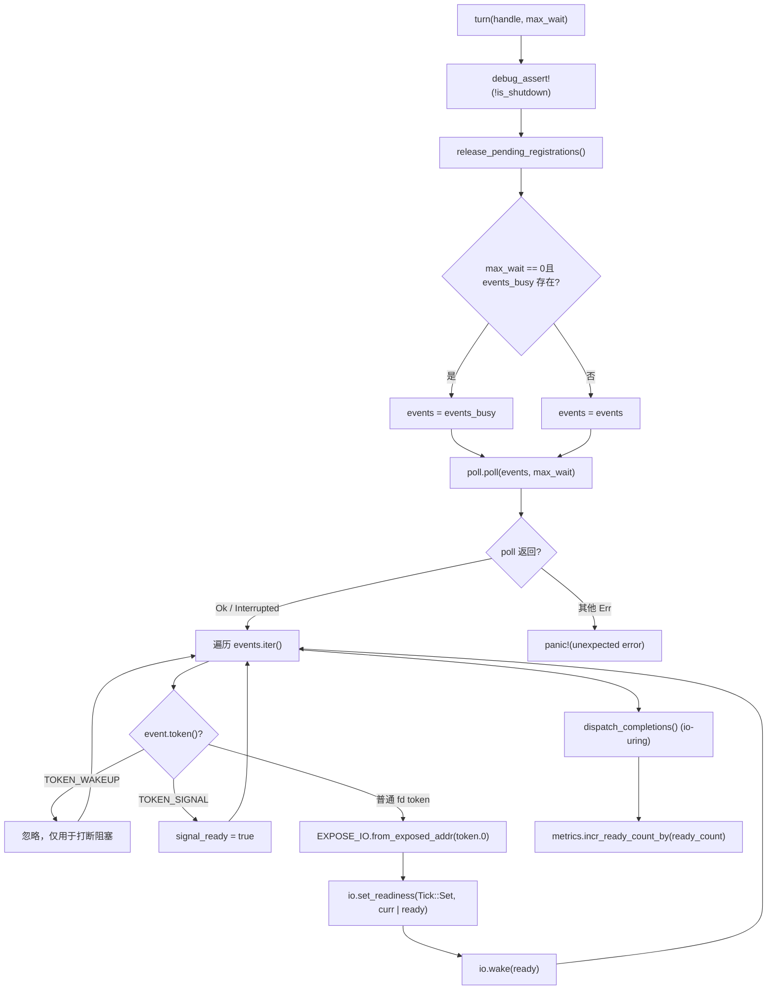
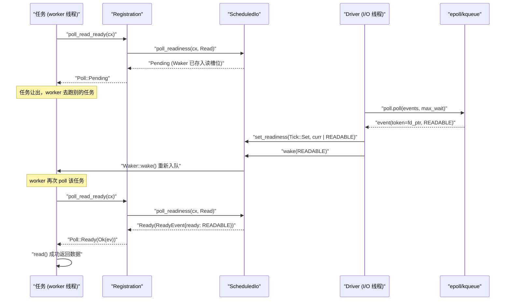

# 次の章：第 5 章 →

検証状態：FACT 行番号が実在にアンカー済み

# 前章では worker スレッドのメインループを追跡した：タスクが poll され、Pending を返すと Waker がどこかに保存され、イベントが準備完了すると Waker がトリガーされ、タスクが再びキューに入る。しかし「どこか」とは一体どこか？ epoll イベントが到来したとき、Waker はどうやって見つけ出されるのか？ これこそ Reactor が答えるべき問題である。まず直感モデルを構築しよう：I/O 準備完了通知メカニズム全体をレストランの呼び出しベルシステムと想像してほしい——顧客（タスク）は注文後、窓口でじっと待つのではなく、振動ベル（Waker）を持って席に戻る。厨房（カーネル epoll）が料理を完成させると、フロント（Reactor）が注文番号（Token）に基づいて対応する振動ベルを見つけ、ボタンを押す。このシステムがなければ、各タスクは socket をポーリングするしかなく、CPU は焼き尽くされる。あるいはブロッキングスレッドで待機すると、1 接続 1 スレッドとなり、規模が拡大しない。Tokio の Reactor は 3 つのファイルで 3 層構造を構成し、責務が厳密に分離されている：driver.rs はイベントループ本体であり、mio::Poll を保持し、poll() を呼び出してカーネルイベントをブロッキング待機し、イベントを ScheduledIo の読み書きに変換する責務を負う；registration.rs はユーザー向けの登録ハンドルであり、TcpStream が内部に保持しているのはこれで、poll_read_ready / poll_write_ready などの API を提供する；scheduled_io.rs は各 fd の状態スロットであり、読み書き準備完了ビットと Waker リストを格納し、イベントとタスクの間の橋渡しをする。モジュールの組み立て関係は tokio/src/runtime/io/mod.rs:5-16 を参照：driver は Driver、Handle、ReadyEvent をエクスポートし、registration は Registration をエクスポートし、scheduled_io は ScheduledIo をエクスポートする。下図は本章で追跡する完全なデータフローをアンカーしている：TcpStream → Registration → ScheduledIo → Handle/Driver → カーネル → ScheduledIo に戻る → Waker。次に層ごとに分解していく。`Driver`ドライバ層：`Handle`と

## の責務分担

`Driver`直感モデル**は`mio::Poll`唯一**を所有する実体である`&mut`、それは単一スレッド内でのみ`Handle`アクセスされうる——これがイベントループの排他性要件である。一方**は**、どのスレッドでも新しい fd を登録したい場合はこれを通す。この分割がなければ、要么把`mio::Poll`にロックをかける（登録ごとに競合する）か、すべての登録を driver スレッドに戻す（スレッド間メッセージキューを導入する）かのどちらかになる。Tokio は`Handle`が直接`mio::Registry`のクローンを保持することを選び、登録操作は並行して行え、実際のイベント待機のみが独占を必要とする。

## メモリレイアウトとフィールド

まず`Driver`のフィールド[FACT:tokio/src/runtime/io/driver.rs:25-38]：

- `signal_ready: bool`を見る：Unix シグナルイベントが到達したかどうか、signal 駆動に使用。
- `events: mio::Events`：メインイベントバッファ、`turn`呼び出しをまたいで再利用され、毎回の割り当てを避ける。
- `events_busy: Option<mio::Events>`：**非ブロッキング poll 専用バッファ**、`max_io_events_per_busy_tick`が設定されている場合のみ存在。
- `poll: mio::Poll`：カーネルイベントキューのラッパー。

次に`Handle` [FACT:tokio/src/runtime/io/driver.rs:41-75]：

- `registry: mio::Registry`：`mio::Poll::registry()`のクローン、`register`/`deregister`。
- `registrations: RegistrationSet`に使用：すべてのアクティブな登録の集合、`Token`と`ScheduledIo`。
- `synced: Mutex<registration_set::Synced>`の割り当てを担当：`RegistrationSet`の同期状態を保護。
- `waker: mio::Waker`：任意のスレッドから`turn`でブロックしている driver を起こすために使用。
- `metrics: IoDriverMetrics`：fd 数、準備完了イベント数を統計。

ここに重要な設計がある：`events_busy`の存在[FACT:tokio/src/runtime/io/driver.rs:25-38]は**非ブロッキング poll がイベントを飲み込む**問題を解決するため。コメント[FACT:tokio/src/runtime/io/driver.rs:189-190]が明確に述べている：非ブロッキング poll が取り出したイベントがメインバッファに残っていると、次の poll では見えなくなる。独立したバッファを使えば、未処理のイベントはカーネルキューに残り、次の poll で再び返される。

## Step-by-Step：一度の`turn`の実行

`turn`は driver の核心関数[FACT:tokio/src/runtime/io/driver.rs:184-261]。worker スレッドが実行できるタスクがないと判断し、`park` → `turn(handle, None)`を呼び出してブロック待機すると仮定する：

**第一步**：shutdown されていないことをアサート[FACT:tokio/src/runtime/io/driver.rs:185]、クリーンアップ待ちの登録[FACT:tokio/src/runtime/io/driver.rs:187]。`release_pending_registrations`を解放`needs_release()`をチェックし、あれば`registrations.release()` [FACT:tokio/src/runtime/io/driver.rs:336-340]。

**を呼び出す**第二步[FACT:tokio/src/runtime/io/driver.rs:191-194]：イベントバッファを選択`max_wait`。もし`events_busy`がゼロで

**が存在すれば、busy バッファを使用；そうでなければメインバッファを使用。**第三步`self.poll.poll(events, max_wait)` [FACT:tokio/src/runtime/io/driver.rs:198]：呼び出し`Interrupted`。ここが本当に epoll_wait でブロックする場所。エラー処理は控えめ：[FACT:tokio/src/runtime/io/driver.rs:200]は直接無視（シグナル割り込みは正常）`InvalidInput`、WASI 下の[FACT:tokio/src/runtime/io/driver.rs:201-205]も無視[FACT:tokio/src/runtime/io/driver.rs:206]。

**、その他のエラーは直接 panic**第四步[FACT:tokio/src/runtime/io/driver.rs:211-233]：イベントを走査`event`：

- 。各`token == TOKEN_WAKEUP`について[FACT:tokio/src/runtime/io/driver.rs:214]もし`unpark`（値が 0）
- 、何もしない——これは`token == TOKEN_SIGNAL`がブロックを中断するために使用。[FACT:tokio/src/runtime/io/driver.rs:216]もし`signal_ready = true`。
- （値が 1）[FACT:tokio/src/runtime/io/driver.rs:218-231]、`mio::Ready`を設定`Ready`そうでなければ通常の I/O イベント`EXPOSE_IO.from_exposed_addr(token.0)`：`*const ScheduledIo`を Tokio の`set_readiness(Tick::Set, |curr| curr | ready)`に変換し、`io.wake(ready)`で token を`Waker`。

ポインタに復元し、次に`EXPOSE_IO`で準備完了ビットを累積し、さらに`PtrExposeDomain<ScheduledIo>` [FACT:tokio/src/runtime/io/mod.rs:21-22]で対応する方向の`usize`をトリガー`mio::Token`ここで[FACT:tokio/src/runtime/io/driver.rs:222-225]は**であり、ポインタを**として`Arc<ScheduledIo>`に「露出」させる。安全性コメント

**がこの unsafe 変換が安全である理由を説明している：ポインタは mio からの登録解除**かつ[FACT:tokio/src/runtime/io/driver.rs:235-258]driver がもはや並行 poll しない前に解放されず、driver が

**の所有権を保持する。**第五步[FACT:tokio/src/runtime/io/driver.rs:265-267]。



## 、CQ オーバーフロー時の flush ループを含む。`Handle`第六步`mio::Waker`

`unpark` [FACT:tokio/src/runtime/io/driver.rs:280-283]：metrics を累積`self.waker.wake()`コピー`mio::Waker`設計思考：なぜ`Driver::new`が`TOKEN_WAKEUP`を保持し[FACT:tokio/src/runtime/io/driver.rs:124]を呼び出すのか`poll.poll()`。この`unpark`は`TOKEN_WAKEUP`時に`poll`で[FACT:tokio/src/runtime/io/driver.rs:214-215]。

> **[Design Inference & Architectural Trade-offs]**
> 。driver が`deregister_source`でブロックしているとき、別のスレッドが[FACT:tokio/src/runtime/io/driver.rs:315-334]を呼び出すと epoll に`registrations.deregister`イベントを挿入し、`unpark()`が即座に返り、走査時にこの token を見て直接スキップ`poll`〔設計推論とアーキテクチャトレードオフ〕`max_wait`このメカニズムは

で使用される`deregister_source`：source を登録解除した後、もし`self.registry.deregister(source)` [FACT:tokio/src/runtime/io/driver.rs:322]が true を返す（これが最後の参照であることを示す）なら、`registrations` [FACT:tokio/src/runtime/io/driver.rs:315-334]。なぜか？ driver が[FACT:tokio/src/runtime/io/driver.rs:320-321]でこの fd のイベントを待ってブロックしている可能性があり、fd はすでに登録解除され、カーネルはもはやイベントを生成しない；能動的に driver を起こし、登録集合を再チェックさせ、ブロックを終了させる必要がある。そうでなければ driver は[FACT:tokio/src/runtime/io/driver.rs:336-340]タイムアウトまで眠り続け、shutdown が遅延する。**もう一つの詳細：**は先に

# を呼び出し、次に`Registration`をクリーンアップ`Waker`。コメント`ScheduledIo`

## は「Cleanup ALWAYS happens」と述べている——OS 層の deregister が失敗しても、内部状態をクリーンアップし、最後に OS エラー

`Registration`を返す**。これは典型的な**リソースクリーンアップがエラー伝播より優先される`scheduler::Handle`パターン。`Arc<ScheduledIo>`登録層：`poll_read_ready`どのように`Registration`を`Waker`に格納するか`ScheduledIo`直感モデル`ScheduledIo`は`Waker`タスクと fd の間の契約

## 。それは二つのものを保持する：一つは

`Registration`（必要時に runtime にアクセスするため）、一つは[FACT:tokio/src/runtime/io/registration.rs:46-54]：

- `handle: scheduler::Handle`（fd の状態スロット）。タスクが[FACT:tokio/src/runtime/io/registration.rs:46-54]を呼び出すとき、
- `shared: Arc<ScheduledIo>`は`Arc`を

> **[Design Inference & Architectural Trade-offs]**
> から`Registration`を取り出して起こす。`Send`メモリレイアウトとフィールド`Sync` [FACT:tokio/src/runtime/io/registration.rs:57-58]は二つのフィールドのみ`scheduler::Handle`：runtime ハンドル、コメント`Send`/`Sync`は「TODO: this can probably be moved into ScheduledIo」と述べており、著者がこのフィールド位置を最適化できると考えていることを示す。`Rc`：共有状態、`Registration`が driver とタスクの両方がアクセスできることを保証。[FACT:tokio/src/runtime/io/registration.rs:28-33]〔設計推論とアーキテクチャトレードオフ〕**注意`Registration`**は手動で

## Step-by-Step：`poll_read_ready`と

を実装している。なぜ unsafe impl が必要か？`TcpStream::poll_read`で socket にデータがないことを検出し、読み取り関心を登録する必要がある。呼び出しチェーンは`TcpStream::poll_read_priv` → `PollEvented::poll_read` → `Registration::poll_read_io` → `poll_io` → `poll_ready`。

`poll_ready`が核心[FACT:tokio/src/runtime/io/registration.rs:155-171]：

**第一步**：`trace_leaf()` [FACT:tokio/src/runtime/io/registration.rs:160]、tracing 埋め込み用。

**第二步**：`coop::poll_proceed(cx)` [FACT:tokio/src/runtime/io/registration.rs:155-171]。これは第12章で説明する協調的予算メカニズム。予算が尽きたら`Pending`を返し、特別な`Waker`を登録して、タスクを次のラウンドで再スケジュールさせる。

**第三步**：`self.shared.poll_readiness(cx, direction)` [FACT:tokio/src/runtime/io/registration.rs:155-171]。ここが実際に`ScheduledIo`と対話する場所：現在のレディビットを確認し、すでにレディなら即座に`Ready`を返す。そうでなければ`cx.waker()`を`ScheduledIo`の対応する方向スロットに格納し、`Pending`。

**を返す**第四步`ev.is_shutdown` [FACT:tokio/src/runtime/io/registration.rs:155-171]：確認する`RUNTIME_SHUTTING_DOWN_ERROR`。

**。runtime がシャットダウン中なら**：`coop.made_progress()` [FACT:tokio/src/runtime/io/registration.rs:169]を返す

`poll_io`第五步`poll_ready`、予算消費をマークし、レディイベントを返す。[FACT:tokio/src/runtime/io/registration.rs:173-192]：

```rust
loop {
    let ev = ready!(self.poll_ready(cx, direction))?;
    match f() {
        Ok(ret) => return Poll::Ready(Ok(ret)),
        Err(ref e) if e.kind() == io::ErrorKind::WouldBlock => {
            self.clear_readiness(ev);
        }
        Err(e) => return Poll::Ready(Err(e)),
    }
}
```

の上にリトライループを追加した**コピー**ここに`poll_ready`readiness はヒントであり保証ではない`read()`という核心思想が表れている：`WouldBlock`は読み取り可能と言うが、実際に`clear_readiness(ev)` [FACT:tokio/src/runtime/io/registration.rs:187]すると

## を返す可能性がある（例えば別のスレッドが先にデータを読み取った）。この場合`try_io`レディビットをクリアし、ループして再び待機する必要がある。クリアしないと、タスクは「読み取り可能と思い込む → read 失敗 → また読み取り可能と思う」というビジーループに陥る。`async_io`設計上の考察：

`try_io` [FACT:tokio/src/runtime/io/registration.rs:194-213]と`ready_event(interest)`の役割分担`WouldBlock` [FACT:tokio/src/runtime/io/registration.rs:194-213]は同期版：まず`f()`レディビットを確認し、空なら直接`f()`を返す。そうでなければ`WouldBlock`を実行し、[FACT:tokio/src/runtime/io/registration.rs:207-210]が**を返したらレディビットをクリアする**。これは`try_read`Waker を登録しない

`async_io` [FACT:tokio/src/runtime/io/registration.rs:225-245]、`readiness(interest).await`のような「試しにやってみてダメなら離れる」シナリオに適している。`f()`，`WouldBlock`は非同期版：`coop::poll_proceed` [FACT:tokio/src/runtime/io/registration.rs:233]は Waker を登録して待機し、その後`WouldBlock`を実行する際にレディビットをクリアしてループする。ループ内で

## も呼び出していることに注意。大量の`Drop`リトライで予算を使い果たすのを防ぐため。

`Registration::drop` [FACT:tokio/src/runtime/io/registration.rs:253-262]本番の落とし穴：`self.shared.clear_wakers()`内の Waker クリーンアップ[FACT:tokio/src/runtime/io/registration.rs:253-262]は`ScheduledIo`を呼び出す。コメント`Waker`が理由を説明している：`Arc<driver::Inner>`に格納された`driver::Inner`が`ScheduledIo`を保持し、`Registration`がさらに`Waker`を保持して循環参照が形成される。Waker のクリーンアップは循環を断ち切る手段。ただしコメントはこれが「imperfect solution」であることも認めている——もし

> **[Design Inference & Architectural Trade-offs]**
> に格納されたら、循環は依然として存在する。これは tokio-rs/tokio#3481 で議論された問題。`clear_wakers`〔設計推論とアーキテクチャトレードオフ〕`ScheduledIo`本番環境での挙動：大量の接続が drop されたが runtime が終了していない場合、メモリは即座に回収されず、次の

# または runtime shutdown まで回収されない。長接続サービスでは通常問題にならないが、短接続の高頻度な作成/破棄が発生するシナリオでは`TcpStream::read`の回収タイミングに注意が必要。`Waker`から

## への起床の完全なチェーン

直感モデル`TcpStream`ここで3層を繋げる。ユーザーが`.read().await`で`AsyncRead::poll_read` → `PollEvented::poll_read` → `Registration::poll_read_io`を呼び出すと、実際に実行されるのは`Waker`。データが届いていない場合、`ScheduledIo`が`ScheduledIo`に格納される。epoll が読み取り可能を報告すると、driver が`Waker`から`poll_readiness`を取り出して起床し、タスクが再スケジュールされ、再度 poll する際に`Ready`，`read()`がレディビットが立っているのを検出し、直接

## を返して成功。

**Step-by-Step：1回の完全な読み取り待機**。`TcpStream::new` [FACT:tokio/src/net/tcp/stream.rs:166-169]フェーズ1：関心の登録`PollEvented::new(connected)`が`Registration::new_with_interest_and_handle` [FACT:tokio/src/runtime/io/registration.rs:73-81]を呼び出し、後者が内部的に`handle.driver().io().add_source(io, interest)` [FACT:tokio/src/runtime/io/registration.rs:73-81]。

`add_source` [FACT:tokio/src/runtime/io/driver.rs:288-312]を呼び出し、さらに

1. `registrations.allocate(&mut synced.lock())`が3つのことを行う：`ScheduledIo`を1つ割り当て、`token` [FACT:tokio/src/runtime/io/driver.rs:293-294]。

2. `self.registry.register(source, token, interest.to_mio())`を取得[FACT:tokio/src/runtime/io/driver.rs:298]カーネルに**を登録。失敗した場合、**必ず`ScheduledIo`先ほど割り当てた[FACT:tokio/src/runtime/io/driver.rs:300-303]を集合から削除する

3. `metrics.incr_fd_count()`。そうしないとリークする。[FACT:tokio/src/runtime/io/driver.rs:309]。

**をカウント**フェーズ2：レディを待機`TcpStream::poll_read` [FACT:tokio/src/net/tcp/stream.rs:1492-1498] → `poll_read_priv` [FACT:tokio/src/net/tcp/stream.rs:1451-1458] → `PollEvented::poll_read` → `Registration::poll_read_io` [FACT:tokio/src/runtime/io/registration.rs:133-139] → `poll_io` → `poll_ready` → `ScheduledIo::poll_readiness`。タスクが poll`Waker`。この時点で未レディなら、`ScheduledIo`を`Pending`。

**の読み取りスロットに格納し、**を返す`turn`フェーズ3：イベント到着`poll.poll()`。driver の[FACT:tokio/src/runtime/io/driver.rs:198]が`io.set_readiness(Tick::Set, |curr| curr | ready)`からイベント`io.wake(ready)` [FACT:tokio/src/runtime/io/driver.rs:228-229]。`wake`を取得し、走査時に各 fd イベントに対して`Waker`と`wake()`。

**を実行**。`Waker::wake()`内部で対応する方向の`poll_readiness`を取り出し、`Ready`，`read()`を呼び出す



## がタスクを worker のローカルキューに再エンキューする（前章で説明済み）。worker が再びそのタスクを poll し、`assume_ready`がレディビットが立っているのを検出し、

`TcpStream::new_accepted` [FACT:tokio/src/net/tcp/stream.rs:174-181]を返して成功。`accept`コピー`new_accepted`重要な分岐：`assume_ready(Ready::READABLE | Ready::WRITABLE)` [FACT:tokio/src/net/tcp/stream.rs:174-181]。

`assume_ready`最適化[FACT:tokio/src/runtime/io/registration.rs:103-105]は注目に値する最適化。`WouldBlock`が返す socket は自然に書き込み可能で、通常はすでにピアの最初のバイト群を保持している。driver の最初のイベントを待つと、高負荷下ではこのイベントがすべての確立済み接続のイベントの後ろに並び、遅延を引き起こす可能性がある。そこで`WouldBlock`，`poll_io`は直接**を呼び出す。コメント**はこう述べている：「A wrong guess costs one

## , which clears the readiness again.」——推測を間違えてもコストは1回の

> **[Design Inference & Architectural Trade-offs]**
> 楽観的推測 + 迅速な誤り訂正`Driver`の設計。`Driver`設計上の考察：なぜ I/O ドライバとスケジューラが分離されているか`block_on`〔設計推論とアーキテクチャトレードオフ〕`Handle`ソースコード構造から見ると、

1. **と worker スレッドは分離している：**：`Handle`は runtime の特定の専用位置（通常は`mio::Registry`スレッドまたは専用 I/O スレッド）に置かれ、worker スレッドは

2. **のみを保持する。この分離にはいくつかの利点がある：**登録のロックフリー化`epoll_wait`が

3. **のクローンを保持し、どの worker も driver スレッドに戻ることなく並行して新しい fd を登録できる。**イベント待機の集中化`ScheduledIo`：1つのスレッドだけが`Waker::wake()`，`wake()`でブロックし、複数スレッドが同時に同じ epoll fd を poll する thundering herd 問題を回避。

起床パスの短縮`ScheduledIo`：driver がイベントを受信したら直接`set_readiness`を操作し、`poll_readiness`を呼び出す

## 内部でタスクを worker キューにプッシュし、スレッド間メッセージパッシングが不要。`is_shutdown`代償は`RUNTIME_SHUTTING_DOWN_ERROR`

`poll_ready`が並行アクセスを処理する必要があること（`ev.is_shutdown` [FACT:tokio/src/runtime/io/registration.rs:155-171]と`gone()` [FACT:tokio/src/runtime/io/registration.rs:265-267]が同時に発生する可能性）。これはアトミック操作と内部ロックで解決される。`RUNTIME_SHUTTING_DOWN_ERROR`。

> **[Design Inference & Architectural Trade-offs]**
> と`shutdown` [FACT:tokio/src/runtime/io/driver.rs:174-182]登録されたすべてを走査して呼び出す`io.shutdown()`、`is_shutdown`をセットし、すべての待機者を起床させる。このフラグをチェックしないと、タスクは runtime がすでにスケジューリングを停止した後に socket を読み取ろうとし、未定義動作やハングを引き起こす可能性がある。本番環境で`RUNTIME_SHUTTING_DOWN_ERROR`を見かけた場合、通常は runtime drop 後もタスクが実行中であることを意味する——`spawn`のタスクが正しく join されていないか確認すること。

もう一つの落とし穴は`deregister_source`の`unpark` [FACT:tokio/src/runtime/io/driver.rs:328]である。driver が`poll`でブロックしており、その時点で最後の`Registration`が drop されると、`unpark`が driver を起床させる。しかし driver がブロック状態でない場合（例えば他のイベントを処理中）、`unpark`は次の`turn`を即座に[FACT:tokio/src/runtime/io/driver.rs:280-283]で返させるだけである。このセマンティクスは`Handle::unpark`のドキュメントコメントに記載されている。

# 設計上の考察：Reactor の3つの重要なトレードオフ

**トレードオフ1：`Token`インデックスではなくポインタを使用**。`EXPOSE_IO.from_exposed_addr(token.0)` [FACT:tokio/src/runtime/io/driver.rs:220]を`mio::Token`のアドレスとして直接扱う。これにより`*const ScheduledIo`のマッピングテーブルの維持を避け、検索は O(1) かつロックフリーとなる。代償は安全性が厳密なライフサイクル管理に依存することである：ポインタは登録解除され、driver が poll しなくなった後にのみ解放できる`Token → ScheduledIo` 的映射表，查找是 O(1) 且无锁。代价是安全性依赖严格的生命周期管理：指针必须在注销且 driver 不再 poll 之后才能释放 [FACT:tokio/src/runtime/io/driver.rs:222-225]。

**トレードオフ2：読み書き二重 Waker スロット**。`Registration`ドキュメント[FACT:tokio/src/runtime/io/registration.rs:24-26]には「A registration instance represents two separate readiness streams」とあり、読みと書きがそれぞれ独立した`Waker`スロットを持つ。これにより同じ socket の読みタスクと書きタスクが互いに干渉せずに登録できる。しかし`poll_read_ready`のコメント[FACT:tokio/src/net/tcp/stream.rs:549-552]は次のように警告している：複数回`poll_read_ready`/`poll_read`/`poll_peek`を呼び出しても最後の`Waker`のみが保持される——読み方向にはスロットが1つしかない。

**トレードオフ3：`events_busy`の独立バッファ**。テスト[FACT:tokio/src/runtime/io/driver.rs:364-386]がこの動作を検証している：`Driver::new(16, Some(2))`busy 容量2の driver を作成し、5つの読み取り可能な source を登録した後、非ブロッキング`turn`は2つのイベントのみを取得し[FACT:tokio/src/runtime/io/driver.rs:375-376]、残りの3つはカーネルキューに残り、次回のブロッキング`turn`で[FACT:tokio/src/runtime/io/driver.rs:379-380]を取得する。これにより非ブロッキング poll が一度にすべてのイベントを消費して後続の poll を飢餓状態にすることを防ぐ。

# 本章のまとめ

本章では`TcpStream::read`背後の完全な Reactor チェーンを追跡した：

- **ドライバ層**：`Driver`は`mio::Poll`，`turn`を独占してイベントをブロッキング待機し、`EXPOSE_IO`を使って`Token`を`ScheduledIo`ポインタに復元し、`set_readiness` + `wake`を呼び出して`Waker`。`Handle`をトリガーする`unpark`はスレッド間で共有可能な登録エントリを提供し、
- **はブロッキングを中断するために使用される。**：`Registration`登録層`Arc<ScheduledIo>`，`poll_ready`は`Waker`，`poll_io`を保持し`WouldBlock`就緒ビットをチェックするか`try_io`/`async_io`に格納する
- **は**：`ScheduledIo`リトライループで偽陽性を処理し、`Waker`それぞれ同期および非同期シナリオにサービスを提供する。

# 状態層

は fd の状態スロットであり、読み書き就緒ビットと二重`poll_io`スロットを格納し、イベントとタスク間の唯一の橋渡しである。`WouldBlock`本章の考察とセルフチェック`self.clear_readiness(ev)`Q1: もし

**内の**：`poll_io`分岐の[FACT:tokio/src/runtime/io/registration.rs:173-192]を削除した場合、どのようなシナリオでタスクのビジーループ（busy-loop）が発生するか？その理由は？`f()`参考解析`WouldBlock`のループ`clear_readiness(ev)` [FACT:tokio/src/runtime/io/registration.rs:187]。`ev`は`poll_ready`が`ReadyEvent`を返したときに`clear_readiness`を呼び出す`ScheduledIo`は

が返す`poll_ready` → `poll_readiness`であり、現在の就緒ビットを含む。`ScheduledIo`はこれらのビットを`poll_readiness`からクリアする。`Ready`クリアしない場合、次回ループで`f()`を呼び出すと、`read()`には古い「読み取り可能」ビットが残ったままで、`WouldBlock`は即座に`Pending`を返し（就緒ビットが空でないため）、その後

が再び`Registration`を実行し、socket に実際にデータがなければ再び[FACT:tokio/src/runtime/io/registration.rs:28-33]を返し、ループが続く。就緒ビットが決してクリアされないため、このループは決して`try_read`に入らず、タスクは CPU を占有してポーリングし続ける。`poll_read`トリガーシナリオ：複数のタスクが同じ socket の読み方向を共有する場合（`read()`ドキュメント`WouldBlock`には最大2タスクとあるが、読み方向にはスロットが1つしかない）、または

Q2: `add_source`と`registry.register`を混用する場合。より一般的には：epoll が読み取り可能を報告した後、別のスレッドが先にデータを読み取ってしまい、現在のタスクの`registrations.remove`が

**を返す場合、就緒ビットをクリアしなければずっとリトライし続ける。**：`add_source` [FACT:tokio/src/runtime/io/driver.rs:288-312]が`registrations.allocate`失敗時に`ScheduledIo` [FACT:tokio/src/runtime/io/driver.rs:293]を呼び出すのはなぜか？呼び出さないと何が起こるか？`registry.register`参考解析[FACT:tokio/src/runtime/io/driver.rs:298]はまず`ScheduledIo`を`RegistrationSet`に割り当て、次に

をカーネルに登録する[FACT:tokio/src/runtime/io/driver.rs:296-297]。登録が失敗した場合、`scheduled_io` from the `registrations` set if registering the `source` with the OS fails. Otherwise it will leak the `scheduled_io`はすでに割り当てられているが関連付けられた fd がない。削除しないと、永遠に

`remove`に残り続ける。[FACT:tokio/src/runtime/io/driver.rs:300-303]コメント`ScheduledIo`は明確に述べている：「we should remove the`RegistrationSet`.」——これはメモリリークである。`RegistrationSet`呼び出し`Token`は unsafe ブロックで囲まれている。なぜなら`allocate`は

Q3: `deregister_source`の一部であり、削除操作は他の参照がないことを保証する必要があるためである。リークの結果：`unpark()`が増え続け、`registrations.deregister`空間が浪費され、最終的に

**の失敗やメモリ枯渇を引き起こす可能性がある。接続の作成/破棄が頻繁なシナリオ（短命接続サーバなど）で、登録失敗率が高い場合（例えば fd 枯渇）、リークはリソース枯渇を加速させる。**：`deregister_source` [FACT:tokio/src/runtime/io/driver.rs:315-334]において、`registry.deregister(source)`が[FACT:tokio/src/runtime/io/driver.rs:322]で true を返したときのみ`registrations.deregister`を呼び出すのはなぜか？無条件に呼び出すとどのような問題があるか？[FACT:tokio/src/runtime/io/driver.rs:315-334]参考解析`unpark()` [FACT:tokio/src/runtime/io/driver.rs:328]。

`registrations.deregister`のロジックは：まず`ScheduledIo`をカーネルから登録解除し`poll`、次に`unpark`内部状態をクリーンアップし`mio::Waker`、true を返せば`TOKEN_WAKEUP`を呼び出す[FACT:tokio/src/runtime/io/driver.rs:280-283]true を返すことはこれが最後の参照であることを意味し、`poll`が実際に削除される。このとき driver は

でこの fd のイベントを待ってブロックしている可能性があるが、fd はすでに登録解除されており、カーネルはもはやイベントを生成しない。`unpark`は`ScheduledIo`を通じて epoll に`TcpStream`イベント`split`後読み書きの二半分）、毎回半分をドロップするたびに driver が起動され、CPU オーバーヘッドが増加する。さらに深刻なのは

本章では、Reactor が epoll イベントをどのように Waker ウェイクアップに変換するかを分解した。TcpStream の poll_read_ready から出発し、Registration の登録と照会を経て、ScheduledIo のレディビットと Waker スロットに到達し、さらに Driver がイベントループ内で Token に基づいて位置を特定しウェイクアップをトリガーする。主要な設計には以下が含まれる：Token がポインタそのもので O(1) 検索を実現、読み書き二重 Waker スロットが並行読み書き分離をサポート、events_busy 独立バッファがイベント飢餓を防止、assume_ready 楽観的推測が accept シナリオを最適化。ここに至り、I/O レディ通知の閉ループは完全となった。しかし非同期ランタイムはもう一つの「レディ」——時間——を処理する必要がある。次章では tokio::time::sleep と timeout の実装を剖析する：タイマーがどのように時間輪に挿入されるか、時間輪がどのように満了時間で階層化されるか、driver がどのように次の park のタイムアウトを計算し満了タスクをトリガーするか。あなたは「時間もまた一種の I/O イベントである」という統一抽象と、start_paused と test clock がテストで時間を制御可能にする方法を目にするだろう。
