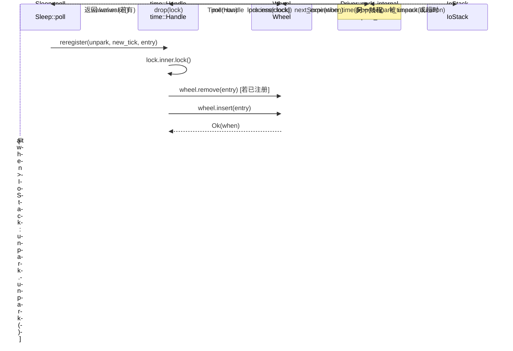

# 第 6 章：時間駆動：時間輪、Sleep、タイムアウトがどのようにウェイクアップされるか

前章では TcpStream::read の完全なチェーンを追跡し、ScheduledIo が epoll の fd レディイベントをどのように Waker ウェイクアップに変換するかを見た。しかし非同期ランタイムはもう一つの「レディ」を処理する必要がある：sleep(100ms) の Future は、100ms 後に必ずウェイクアップされなければならない。この種のイベントはカーネル fd からではなく、「時間そのもの」から来る。Tokio の設計選択は、時間も一種の I/O イベントとして扱うことである：Driver 構造体には park: IoStack という一つのフィールドしかなく、I/O driver の park/unpark メカニズムを再利用している。時間輪が「次の満了時刻」を算出すると、driver は park_timeout を呼び出してスレッドをその時刻まで眠らせる。ウェイクアップされた後、時間輪から満了エントリを取り出し、それらの Waker をトリガーする。こうして、スケジューラは一つの統一された park エントリポイントだけで、「fd レディ」と「タイマー満了」の二種類のイベントを同時に待機できる。本章では三つの問いに答える：タイマーはどのように時間輪に挿入されるか？時間輪はどのように満了時間で階層化されるか？driver はどのように次の park のタイムアウトを計算し満了タスクをトリガーするか？

# 一、時間輪：六層 64 スロットのハッシュ階層構造

## 直感モデル

機械式時計を想像してほしい：秒針が一回転すると分針を動かし、分針が一回転すると時針を動かす。秒針が一本しかなければ、「12 日後」を表すには 100 万目盛りを数えなければならない。しかし階層化すれば、秒針は 64 秒以内の精度だけを担当し、分針は 64 分を、時針は 64 時間を担当する——各層は 64 スロットだけで、2 年以上先までカバーできる。

もし階層化がなければ、遠い将来のタイマーを挿入するには O(N) の走査か、巨大な配列が必要になる。時間輪は「満了時間による階層化」で、挿入とトリガーの両方をほぼ O(1) に抑える。

## メモリレイアウトとフィールド

`Wheel`の核心フィールドは三つだけである[FACT:tokio/src/runtime/time/wheel/mod.rs:22-40]：

```rust
pub(crate) struct Wheel {
    elapsed: u64,                          // 自 wheel 创建以来经过的毫秒数
    levels: Box,      // 6 层，每层 64 槽
    pending: LinkedList,      // 已到期、待触发的条目
}
```

`NUM_LEVELS = 6`，`BITS_PER_LEVEL = 6`（つまり各層 64 スロット）[FACT:tokio/src/runtime/time/wheel/mod.rs:45-47]。`MAX_DURATION = 1 << (6 * 6) = 1 << 36`ミリ秒、約 2 年[FACT:tokio/src/runtime/time/wheel/mod.rs:50]。

六層の粒度はドキュメントコメントによると[FACT:tokio/src/runtime/time/wheel/mod.rs:22-40]：

| 層 | スロット粒度 | カバー範囲 |
| --- | --- | --- |
| 0 | 1 ms | 64 ms |
| 1 | 64 ms | ~4 s |
| 2 | ~4 s | ~4 min |
| 3 | ~4 min | ~4 hr |
| 4 | ~4 hr | ~12 day |
| 5 | ~12 day | ~2 yr |

`pending`は侵入型リンクリスト（`LinkedList<TimerShared>`）であり、すでに輪から取り出され、Waker のトリガーを待つエントリを格納する。注意すべきはこれが`LinkedList`ではなく`Vec`であること：エントリ自体が`TimerShared`に埋め込まれており、挿入/削除にアロケーションは不要。

## シナリオ駆動：100ms の sleep を挿入する

が`sleep(100ms)`最初に poll されたとき、`Sleep::poll_elapsed`は`Timer::new`を構築し`init` [FACT:tokio/src/time/sleep.rs:436-440]。`init`を呼び出し、最終的に`Handle::reregister`を呼び出し、さらに`Wheel::insert`。

`insert`を呼び出す。最初のステップはすでに満了しているかチェックすること[FACT:tokio/src/runtime/time/wheel/mod.rs:90-98]：

```rust
let when = unsafe { item.sync_when() };
if when  usize {
    const SLOT_MASK: u64 = (1 = MAX_DURATION {
        return NUM_LEVELS - 1;
    }
    masked.ilog2() as usize / BITS_PER_LEVEL
}
```

ここで`elapsed ^ when`ではなく`when - elapsed`を使うのは精妙なテクニックである：XOR の最上位有効ビットは「二つのタイムスタンプがどのビットから異なるか」、つまり「それらを区別するのにどれだけ粗い粒度が必要か」を反映する。`| SLOT_MASK`は下位 6 ビットを強制的に 1 にし、`ilog2`が同じスロット内にあるときに過小な層を算出するのを避ける。`ilog2() / 6`はビット幅を層番号にマッピングする。もし XOR 結果が`MAX_DURATION`を超える場合（つまり 2 年を超える）、強制的に最上位層に押し込む——これが「fudge the timer into the top level」である。

100ms の sleep について、`elapsed`が 0 に近いと仮定すると、`when ≈ 100`，`elapsed ^ when ≈ 100`，`ilog2(100) = 6`，`6 / 6 = 1`したがって第1層（64ms粒度）に落ちます。これは、第1層のいずれかのスロットで待機し、時間がそのスロットの境界まで進むと第0層に降下されることを意味します。

## 段階的降下：process_expiration

ときに`poll(now)`時間を進めると、`Wheel::poll`は繰り返し呼び出します`next_expiration`と`process_expiration` [FACT:tokio/src/runtime/time/wheel/mod.rs:142-166]：

```rust
pub(crate) fn poll(&mut self, now: u64) -> Option {
    loop {
        if let Some(handle) = self.pending.pop_back() {
            return Some(handle);
        }
        match self.next_expiration() {
            Some(ref expiration) if expiration.deadline  {
                self.process_expiration(expiration);
                self.set_elapsed(expiration.deadline);
            }
            _ => {
                self.set_elapsed(now);
                break;
            }
        }
    }
    self.pending.pop_back()
}
```

`process_expiration`は、ある層の期限切れエントリを「降下」させて次の層へ移動させる役割を担います。または（第0層では）pendingとしてマークします[FACT:tokio/src/runtime/time/wheel/mod.rs:218-251]：

```rust
let mut entries = self.take_entries(expiration);
while let Some(item) = entries.pop_back() {
    match unsafe { item.mark_pending(expiration.deadline) } {
        Ok(()) => {
            self.pending.push_front(item);   // 真正到期
        }
        Err(expiration_tick) => {
            let level = level_for(expiration.deadline, expiration_tick);
            unsafe { self.levels[level].add_entry(item); }  // 下沉到更低层
        }
    }
}
```

`mark_pending`が重要です：エントリの実際のdeadlineに到達しているかをチェックします。到達していれば`Ok(())`を返し、エントリは`pending`連結リストに入ります。まだ到達していない場合（スロットの境界に達しただけ）、`Err(expiration_tick)`を返し、エントリはより細かい層に再挿入されます。

コメントで強調されている点に注意[FACT:tokio/src/runtime/time/wheel/mod.rs:219-228]：スロット全体のエントリをすべて取り出してから処理する必要があります。一部のエントリが同じスロットに再挿入される可能性があるためです（挿入時間が`MAX_DURATION`を超えるとラップアラウンドが発生します）。取り出しながら挿入すると、無限ループに陥る可能性があります。

## 次の期限時刻の計算

`next_expiration`は低層から高層へスキャンし、最初の非空の期限ポイントを返します[FACT:tokio/src/runtime/time/wheel/mod.rs:169-191]：

```rust
fn next_expiration(&self) -> Option {
    if !self.pending.is_empty() {
        return Some(Expiration { level: 0, slot: 0, deadline: self.elapsed });
    }
    for (level_num, level) in self.levels.iter().enumerate() {
        if let Some(expiration) = level.next_expiration(self.elapsed) {
            debug_assert!(self.no_expirations_before(level_num + 1, expiration.deadline));
            return Some(expiration);
        }
    }
    None
}
```

もし`pending`が非空なら、期限切れのエントリがトリガー待ちであることを示し、即座に現在の`elapsed`をdeadlineとして返します（これによりdriverは0タイムアウトでparkし、すぐに戻って処理します）。そうでなければ層ごとにスキャンし、最初に内容のあるスロットのdeadlineを返します。`debug_assert`は不変条件を検証しています：より高層が現在の層より早い期限ポイントを持つことはあり得ません。

```mermaid
flowchart TD
    start["Wheel::poll(now)"] --> check_pending{"pending 非空?"}
    check_pending -->|是| pop["pop_back 返回 TimerHandle"]
    check_pending -->|否| next_exp{"next_expiration() 有到期点?"}
    next_exp -->|无| set_elapsed["set_elapsed(now) 后 break"]
    next_exp -->|有| cmp{"expiration.deadline |否| set_elapsed
    cmp -->|是| proc["process_expiration(expiration)"]
    proc --> take["take_entries 取出整槽"]
    take --> mark{"item.mark_pending()"}
    mark -->|Ok 已到期| push_pending["pending.push_front(item)"]
    mark -->|Err 未到期| reinsert["level_for 后 add_entry 下沉"]
    push_pending --> set_elapsed2["set_elapsed(expiration.deadline)"]
    reinsert --> set_elapsed2
    set_elapsed2 --> check_pending
    set_elapsed --> pop2["pending.pop_back() 返回"]
```

---

# 二、Driverのparkループ：タイムホイールをI/Oスタックに接続する

## 直感的モデル

タイムホイール自体は「自分で動く」ことはありません。外部ループが繰り返し問いかける必要があります：「次の期限はいつですか？」そしてその時刻まで眠り、目覚めてから時間を進めます。このループが`Driver::park_internal`です。これは「タイムホイールの次の期限」を`park_timeout`の期間に変換し、基盤のI/Oスタックに渡して眠らせます。

このループがなければ、タイマーは永遠にトリガーされません——タイムホイールは静的なデータ構造にすぎず、誰かが「動かす」必要があります。

## データ構造：DriverとInnerState

`Driver`にはフィールドが1つだけあります`park: IoStack` [FACT:tokio/src/runtime/time/mod.rs:90-93]。実際の状態は`Handle`にあり、`Inner`列挙型を通じて従来実装と実験的実装を区別します[FACT:tokio/src/runtime/time/mod.rs:95-127]。従来実装の`InnerState`には2つのフィールドがあります[FACT:tokio/src/runtime/time/mod.rs:130-136]：

```rust
struct InnerState {
    next_wake: Option,   // 承诺的最早唤醒时刻
    wheel: wheel::Wheel,
}
```

`next_wake`で`NonZeroU64`ではなく`Option<u64>`のネストを使うのは、niche最適化を利用するためです——`Option<NonZeroU64>`と`u64`は同じサイズです。これは「driverがどのtickまでに目覚めることを約束したか」を記録し、`reregister`時に`unpark`。

`is_shutdown`が必要かどうかを判断するために使われます。`AtomicBool`は独立した[FACT:tokio/src/runtime/time/mod.rs:90-93]：`Handle`で、コメントでMutexから分離した理由を説明しています`is_shutdown`はmutexをロックせずに

## をチェックする必要があります。これは典型的な「読み多書き少」最適化です——shutdownは一度しか発生しませんが、チェックは頻繁に行われる可能性があります。

`park_internal`シナリオ駆動：1回のparkの完全なフロー[FACT:tokio/src/runtime/time/mod.rs:213-256]：

```rust
fn park_internal(&mut self, rt_handle: &driver::Handle, limit: Option) {
    let handle = rt_handle.time();
    let mut lock = handle.inner.lock();
    assert!(!handle.is_shutdown());

    let next_wake = lock.wheel.next_expiration_time();
    lock.next_wake = next_wake.map(|t| NonZeroU64::new(t).unwrap_or_else(|| NonZeroU64::new(1).unwrap()));
    drop(lock);

    match next_wake {
        Some(when) => {
            let now = handle.time_source.now(rt_handle.clock());
            let mut duration = handle.time_source.tick_to_duration(when.saturating_sub(now));
            if duration > Duration::from_millis(0) {
                if let Some(limit) = limit {
                    duration = std::cmp::min(limit, duration);
                }
                self.park_thread_timeout(rt_handle, duration);
            } else {
                self.park.park_timeout(rt_handle, Duration::from_secs(0));
            }
        }
        None => {
            if let Some(duration) = limit {
                self.park_thread_timeout(rt_handle, duration);
            } else {
                self.park.park(rt_handle);
            }
        }
    }

    handle.process(rt_handle.clock());
}
```

コピー

1. **ステップごとの解析：**：`lock.wheel.next_expiration_time()`ロック取得、次の期限を読み取り`Option<u64>`は`lock.next_wake`を返します。つまり次の期限tickです。同時にそれを`reregister`に書き込み、

2. **がunparkの必要があるか判断するために使います。**：`drop(lock)`ロック解放

3. **はparkの前に行う必要があります。そうでなければpark中に他のスレッドがタイマーを挿入できません。**：`when.saturating_sub(now)`park期間の計算`tick_to_duration`で残りtick数を得て、`Duration`で[FACT:tokio/src/runtime/time/mod.rs:228-230]に変換します。コメントによると、ここでは実際には1msに切り上げられ

4. **、マイクロ秒レベルのsleepがOSにゼロ長として扱われるのを防ぎます。**limitの処理`limit`：呼び出し元が`park_timeout`を渡した場合（例えば`min(limit, duration)`の明示的タイムアウト）、

5. **を取り、寝過ごさないことを保証します。**特殊ケース`duration == 0`：もし`park_timeout(0)`（期限切れ）なら、

6. **で即座に戻り、実際には眠りません。**タイマーがない場合`next_wake`：もし`None`が`limit`なら、`park_thread_timeout(limit)`があれば`park`。

7. **、そうでなければ無限に**：`handle.process(clock)`覚醒後の処理

## はタイムホイールを進め、期限切れエントリをトリガーします。

`process`process_at_time：期限切れエントリのトリガー`process_at_time` [FACT:tokio/src/runtime/time/mod.rs:296-337]：

```rust
pub(self) fn process_at_time(&self, mut now: u64) {
    let mut waker_list = WakeList::new();
    let mut lock = self.inner.lock();

    if now ) {
    let waker = unsafe {
        let mut lock = self.inner.lock();
        if unsafe { entry.as_ref().might_be_registered() } {
            lock.wheel.remove(entry);
        }
        let entry = entry.as_ref().handle();
        if self.is_shutdown() {
            unsafe { entry.fire(Err(crate::time::error::Error::shutdown())) }
        } else {
            entry.set_expiration(new_tick);
            match unsafe { lock.wheel.insert(entry) } {
                Ok(when) => {
                    if lock.next_wake.is_none_or(|next_wake| when  unsafe {
                    entry.fire(Ok(()))
                },
            }
        }
    };
    if let Some(waker) = waker {
        waker.wake();
    }
}
```

ときに`next_wake`が呼び出されると、タイマーを再登録する必要があります。`unpark.unpark()`はこのシナリオを処理します

コピー`unpark`重要なロジック：挿入成功後、新しい期限時刻が**より早ければ、**を呼び出してdriverを覚醒させます。これはdriverがより遅い時刻で眠っている可能性があり、park期間を再計算するために早めに起こす必要があるためです。`waker.wake()`注意：**は**ロック保持時[FACT:tokio/src/runtime/time/mod.rs:441]に呼び出され、`unpark`は



---

# に呼び出されます。コメントは

## を説明しています：デッドロックを避けるため、Wakerを呼び出す前にロックを解放する必要があります。しかし

`Sleep`は異なります——それはepollにイベントを入れるだけで、ユーザーコードをコールバックしないため、ロック保持中の呼び出しは安全です。`.await`コピー`Timeout`は別の Future をラップするアダプタです。それ自体は時間ホイールを管理せず、「deadline」を tick に変換して委譲するだけです。`Timer`と`Handle`。

## Sleep のメモリレイアウト

`Sleep`で`pin_project!`マクロを使用して[FACT:tokio/src/time/sleep.rs:221-227]：

```rust
pub struct Sleep {
    deadline: Instant,
    driver: scheduler::Handle,
    inner: Inner,
    #[pin]
    timer: Option,
}
```

`timer`は`Option<Timer>`であり、`#[pin]`を伴います：初回 poll 前は`None`で、初回 poll 時に初めて`Timer`を作成し登録します。この「遅延初期化」により、`sleep()`呼び出し時にランタイムへアクセスすることを避けられます——`sleep()`はランタイム外で呼び出せますが、`.await`時に実際に登録されるだけです。

`PinnedDrop`実装は drop 時にタイマーをキャンセルすることを保証します[FACT:tokio/src/time/sleep.rs:230-235]：

```rust
impl PinnedDrop for Sleep {
    fn drop(this: Pin) {
        let this = this.project();
        if let Some(timer) = this.timer.as_pin_mut() {
            timer.cancel(this.driver);
        }
    }
}
```

## poll_elapsed の完全なフロー

`poll_elapsed`は`Sleep`の核心です[FACT:tokio/src/time/sleep.rs:396-454]：

```rust
fn poll_elapsed(self: Pin, cx: &mut task::Context) -> Poll> {
    ready!(crate::trace::trace_leaf());
    let mut this = self.project();

    // coop 预算
    let coop = ready!(crate::task::coop::poll_proceed(cx));

    let handle = this.driver;
    let timer = match this.timer.as_mut().as_pin_mut() {
        Some(timer) => timer,
        None => {
            let time_source = handle.driver().time().time_source();
            let deadline = time_source.deadline_to_tick(*this.deadline);
            let timer = Timer::new(handle, deadline);
            this.timer.set(Some(timer));
            let mut timer = this.timer.as_pin_mut().unwrap();
            timer.as_mut().init(handle, deadline);
            timer
        }
    };

    let result = timer.poll_elapsed(cx, handle).map(move |r| {
        coop.made_progress();
        r
    });
    result
}
```

ステップごと：

1. **coop 予算チェック**：`poll_proceed(cx)`は協調予算を1回消費します。予算が尽きると`Pending`を返して実行権を譲ります。これは Tokio が単一タスクによる他のタスクの餓死を防ぐ仕組みです。

2. **遅延 Timer 作成**：もし`timer`が`None`なら、`deadline`を tick に変換し、`Timer`を作成して`init`を呼び出し時間ホイールに登録します。

3. **Timer::poll_elapsed への委譲**：実際の期限チェックは`Timer`が行います。

4. **成功後に進捗をマーク**：`coop.made_progress()`は今回の poll に実際の進捗があったことを示します。

## Timeout の poll：先に値を poll し、次に遅延を poll

`Timeout`の poll 順序は重要です[FACT:tokio/src/time/timeout.rs:210-224]：

```rust
fn poll(self: Pin, cx: &mut task::Context) -> Poll {
    let me = self.project();
    let had_budget_before = coop::has_budget_remaining();

    // 先 poll 被包裹的 future
    if let Poll::Ready(v) = me.value.poll(cx) {
        return Poll::Ready(Ok(v));
    }

    match me.delay.as_pin_mut() {
        Some(delay) => poll_delay(had_budget_before, delay, cx).map(Err),
        None => Poll::Pending,
    }
}
```

コメントは明確に指摘しています[FACT:tokio/src/time/timeout.rs:24-26]：future が先に poll され、その後でタイムアウトがチェックされます。したがって future が yield せずに完了すると、timeout を超えても`Ok`を返す可能性があります。これは設計上の選択であり、バグではありません。

`poll_delay`は微妙なシナリオを処理します[FACT:tokio/src/time/timeout.rs:229-251]：

```rust
fn poll_delay(had_budget_before: bool, delay: Pin, cx: &mut task::Context) -> Poll {
    let delay_poll = || match delay.poll(cx) {
        Poll::Ready(()) => Poll::Ready(Elapsed::new()),
        Poll::Pending => Poll::Pending,
    };

    let has_budget_now = coop::has_budget_remaining();

    if let (true, false) = (had_budget_before, has_budget_now) {
        // 如果预算是被底层 future 耗尽的，用无约束预算 poll delay
        coop::with_unconstrained(delay_poll)
    } else {
        delay_poll()
    }
}
```

ロジック：`poll`に入る時にまだ予算があるが、value を poll した後に予算が尽きた場合、value が予算を消費したことを示します。この時、制限された予算で delay を poll すると、delay が即座に`Pending`を返す可能性があり、タイムアウトが到達したかどうかを永遠に判断できなくなります。そのため`with_unconstrained`で一時的に予算制限を解除します。コメントではこれを「pathological cases」と呼んでいます。[FACT:tokio/src/time/timeout.rs:243-246]。

## timeout の deadline オーバーフロー処理

`timeout`関数は`checked_add`でオーバーフローを処理します[FACT:tokio/src/time/timeout.rs:86-99]：

```rust
Timeout {
    value: future.into_future(),
    delay: match Instant::now().checked_add(duration) {
        Some(deadline) => Some(Sleep::new_timeout(deadline, trace::caller_location())),
        None => None,
    },
}
```

もし`Instant::now() + duration`がオーバーフローする（duration が極端に大きい）場合、`delay`は`None`となり、poll 時には直接`Poll::Pending` [FACT:tokio/src/time/timeout.rs:222]を返します。これは「決してタイムアウトしない」ことに相当し、合理的なフォールバック動作です。

---

# 設計上の考察と本番での落とし穴

**なぜ階層計算に減算ではなく XOR を使うのか？** `elapsed ^ when`の最上位ビットは「2つのタイムスタンプがどのビットから異なるか」を直接反映し、これは「どれだけ粗い粒度が必要か」の尺度です。減算`when - elapsed`は`elapsed`が`when`に近い時、上位ビットが全て 0 になり、`ilog2`は過小な階層を算出します。XOR はラップアラウンドのシナリオを自然に処理します。

**時間逆行保護の必要性** [FACT:tokio/src/runtime/time/mod.rs:301-309]：Rust は`Instant`の単調性を保証しますが、基盤 OS は保証しないかもしれません。Windows ホスト上の Linux VM では、std がハードウェアクロックを信頼することで`Instant`が逆行します。Tokio は`now = lock.wheel.elapsed()`でクランプし、`set_elapsed`の assert 失敗を回避します。

**バッチ起床とデッドロック** [FACT:tokio/src/runtime/time/mod.rs:319]：時間ホイールロックを保持したまま Waker を呼ぶのは危険です——Waker がタスクの再 poll をトリガーし、さらに`Sleep::reset`を呼び出して再び時間ホイールロックを取得しようとし、デッドロックを引き起こす可能性があります。`WakeList`のバッチ機構はロックが満杯の時に一時的にロックを解放します。これは標準的な「ロック外コールバック」パターンです。

**`next_wake`の niche 最適化** [FACT:tokio/src/runtime/time/mod.rs:130-136]：`Option<NonZeroU64>`は`u64`と同じサイズです。0 が`None`の niche として使われるためです。しかし tick 0 は有効な値なので、コードは`NonZeroU64::new(t).unwrap_or_else(|| NonZeroU64::new(1).unwrap())`で 0 を 1 にマッピングします[FACT:tokio/src/runtime/time/mod.rs:221]。これは微妙な境界処理です：tick 0 は tick 1 として扱われ、最大で 1ms の余分な起床を引き起こします。

**`process_expiration`の「先に取得してから処理」** [FACT:tokio/src/runtime/time/wheel/mod.rs:219-228]：まずスロット全体のエントリを取り出してから処理する必要があります。なぜなら`MAX_DURATION`を超えるエントリはラップアラウンドして同じスロットに再挿入されるためです。取得しながら挿入すると無限ループになります。

**`Timeout`の poll 順序の罠** [FACT:tokio/src/time/timeout.rs:24-26]：future が先に poll され、タイムアウト後にチェックされます。future が CPU 集約的で yield しない場合、timeout を超えても`Ok`を返す可能性があります。本番環境では`timeout`に非協力的な future の強制中断を依存しないでください。

---

# 本章のまとめ

本章では Tokio 時間ドライバの3層構造を分解しました：

1. **時間ホイール**（`Wheel`）：6層64スロットのハッシュ階層構造で、`elapsed ^ when`のビット幅でエントリの階層を決定し、挿入と発火はほぼ O(1) です。`pending`連結リストは期限切れエントリを格納し、`process_expiration`が層ごとの降下を担当します。

2. **Driver**（`Driver::park_internal`）：時間ホイールの`next_expiration_time`を`park_timeout`期間に変換し、I/O スタックの park/unpark を再利用します。`process_at_time`は起床後に時間ホイールを進め、Waker をバッチ発火し、時間逆行とデッドロック保護を処理します。

3. **ユーザー API**（`Sleep` / `Timeout`）：`Sleep`は遅延作成`Timer`して登録し、`Timeout`は先に value を poll してから delay を poll し、`with_unconstrained`で予算枯渇シナリオを処理します。

核心設計は「時間もまた I/O イベントである」：driver は park エントリを1つだけ持ち、fd の準備完了とタイマー満了を同時に待ちます。`next_wake`は約束された起床時刻を記録し、`reregister`はより早いタイマーを挿入する際に`unpark`で driver を起床させ再計算します。

次章では同期プリミティブに入ります：`Mutex`、`Semaphore`とチャネルがどのように非同期待機を実装するか。それらが本章の Waker 機構をどう再利用し、「許可カウント」と「待機キュー」がどう協調するかを見ていきます。

# 本章の考察とセルフチェック

Q1: もし`Wheel::insert`の`if when <= self.elapsed`を`if when < self.elapsed`（等号を外す）、どのような場面でタイマーが永遠に発火されなくなるのか？

**参考解析**：`when == self.elapsed`はタイマーの満了時刻が現在までに進んだ時間とちょうど等しいことを表す。元のコードでは`<=`それを`Elapsed`と判定し、呼び出し側が即座に[FACT:tokio/src/runtime/time/wheel/mod.rs:96-98]を発火する。もし`<`に変更すると、このエントリは`level_for(elapsed, when)`が算出した層に挿入される。`elapsed ^ when == 0`，`masked = 0 | SLOT_MASK = 63`，`ilog2(63) = 5`，`5 / 6 = 0`により、第0層に落ちる。しかし第0層の`next_expiration`は`deadline >= elapsed`のスロットを返し、`Wheel::poll`の条件は`expiration.deadline <= now`である。もし`now == elapsed`なら条件が成立し、`process_expiration`がそのエントリを取り出し、`mark_pending(elapsed)`実際のdeadlineに到達したか確認する——このとき`when == elapsed`，`mark_pending`は`Ok`を返し、エントリはpendingに入る。したがって実際には依然として発火されるが、余分に回り道をする。本当のリスクは、もし`elapsed`がすでに`when`より先に進んでいる場合（`when < elapsed`）、元のコードは`Elapsed`を返して即座に発火するが、変更後はすでに過去のスロットに挿入され、`next_expiration`が`deadline < elapsed`，`set_elapsed`を返す可能性があり、assert`elapsed <= when`が失敗してpanic[FACT:tokio/src/runtime/time/wheel/mod.rs:253-264]する。したがってこの等号はassert失敗を防ぐ重要な境界である。

Q2: `process_at_time`において`WakeList`が満杯になった後、なぜ`drop(lock)`してから`wake_all()`して再度`lock`するのか？もしこのdropを外すと、どのような並行シナリオでデッドロックするか？

**参考解析**：`WakeList`はWakerを収集し、満杯になったらスペースを空けるために一批を起床させる必要がある[FACT:tokio/src/runtime/time/mod.rs:318-325]。もし`self.inner.lock()`を保持したまま`waker.wake()`を呼び出すと、起床されたタスクが即座に別スレッド（または同一スレッドのスケジューラ）で実行され、`Sleep::reset`や`Sleep::poll_elapsed`を呼び出し、さらには`Handle::reregister`を呼び出す可能性があり、そして`reregister`が最初に行うことは`self.inner.lock()` [FACT:tokio/src/runtime/time/mod.rs:405]である。`std::sync::Mutex`は再入不可のため、同一スレッドではデッドロックする。たとえ別スレッドでも、`process_at_time`がロックを解放するまでブロックし、一方`process_at_time`は`wake_all`の戻りを待っており、循環待ちが形成される。コメントには明確に「To avoid deadlock, we must do this with the lock temporarily dropped」とある[FACT:tokio/src/runtime/time/mod.rs:319]。drop後に再lockすると、時間輪の状態は他のスレッドによって変更されている可能性がある（例えば新しいタイマーが挿入される）ため、`while let Some(entry) = lock.wheel.poll(now)`は新しい状態からエントリを取り出し続ける。これは安全である。

Q3: `Timeout::poll`において`had_budget_before`と`has_budget_now`の組み合わせ判定`(true, false)`はなぜ「進入時に予算があり、poll value後に予算がない」場合にのみ使われるのか`with_unconstrained`？もし逆に`(false, true)`ならどうなるか？

**参考解析**：`had_budget_before`はpoll valueの前に[FACT:tokio/src/time/timeout.rs:208-208]，`has_budget_now`を記録し、poll valueの後に[FACT:tokio/src/time/timeout.rs:239]。`(true, false)`を記録する。`poll_proceed`は予算がpoll value中に使い果たされたことを意味し、valueが「予算消費者」であることを示す。このとき制限付き予算でpoll delayすると、`Pending`は即座に`with_unconstrained`を返し、delayは決して実際にチェックされず、タイムアウト判定が無効になる。したがって[FACT:tokio/src/time/timeout.rs:247]。`(false, true)`で一時的に制限を解除する`with_unconstrained`は発生し得ない——予算は消費されるだけで、回復はできない（明示的な`(false, false)`がない限り。ここにはない）。`Pending`は進入時にすでに予算がないことを意味し、このときpoll valueはすでに`poll_proceed`を返している可能性があり（`(true, true)`が失敗したため）、delayも制限付き予算でpollされ、両方pendingとなり、期待通りである。

は正常な場合で、予算は十分にあり、直接poll delayする。
