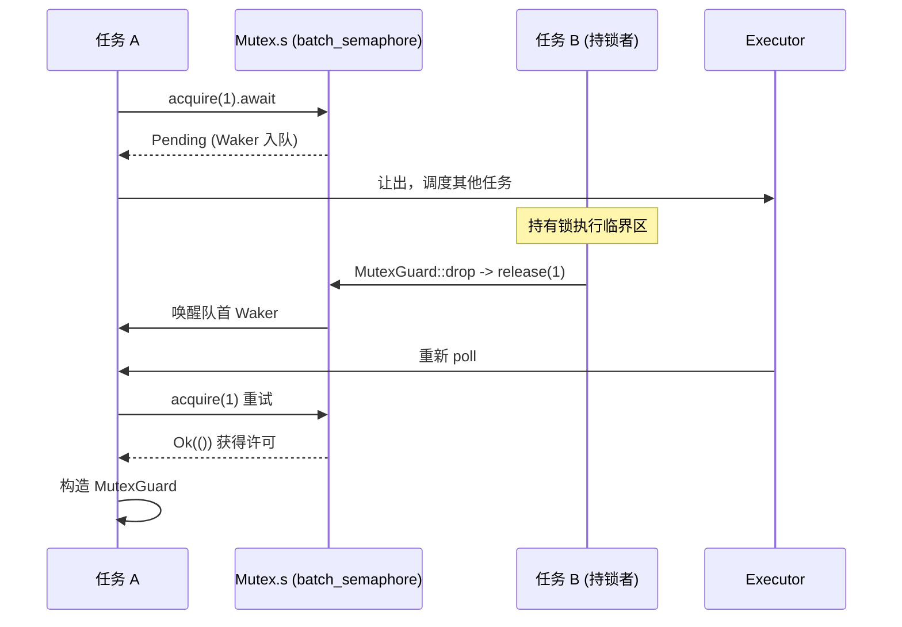

# 第 7 章：同期プリミティブ：Mutex、Semaphore、チャネルがどのように非同期待機を実現するか

前章では時間がどのようにI/Oイベントとして抽象化され、タイマーとfdレディが同じpark/unpark待機入口を共有するかを明らかにした。しかし複数のタスクが同じロックを競合したり、チャネルを通じてメッセージを渡すとき、待機対象はもはやfdや時計ではなく、別のタスクの状態変化である。本章ではtokio::syncファミリーに入り、一度のlock().awaitやrecv().awaitがブロック時にWakerをどこに格納するのか、起床時にどのように再スケジュールされるのかを探る。

# なぜ非同期Mutexはstdの実装を再利用できないのか

## 直感モデル：「席を占有する」から「席を譲る」へ

`std::sync::Mutex`の`lock()`はロックが占有されているとき**現在のスレッドをブロックする**——スレッドはOSによってサスペンドされ、ロックが解放されるまで待つ。これは非同期ランタイムでは致命的である：1つのworkerスレッドが同時に何百、何千ものタスクを駆動している可能性があり、もしロック待ちでブロックすると、それが担う他のすべてのタスクが停止する。非同期Mutexの核心的な要求は：ロック待ちのとき**スレッドを譲り**、「私はこのロックを待っている」という事実をキューに登録し、そして`Pending`を返し、実行者に他のタスクを実行させることである。

Tokioの`Mutex`は独自の待機キューを実装しておらず、代わりに**完全にセマフォの上に構築されている**。

## データ構造とメモリレイアウト

`Mutex<T>`のフィールドは極めて簡潔：

[FACT:tokio/src/sync/mutex.rs:133-138]

```rust
pub struct Mutex {
    #[cfg(all(tokio_unstable, feature = "tracing"))]
    resource_span: tracing::Span,
    s: semaphore::Semaphore,
    c: UnsafeCell,
}
```

3つのフィールドがそれぞれ役割を担う：`s`は**許可数が1のセマフォ**，`c`は`UnsafeCell<T>`が包む保護されたデータ。ここでの`semaphore`は`batch_semaphore`の別名[FACT:tokio/src/sync/mutex.rs:3-3]、つまり低レベル実装であり、`sync::Semaphore`の公開ラッパーではないことに注意。

`MutexGuard<'a, T>`は`Mutex`への参照を1つだけ保持する：

[FACT:tokio/src/sync/mutex.rs:151-157]

```rust
pub struct MutexGuard {
    #[cfg(all(tokio_unstable, feature = "tracing"))]
    resource_span: tracing::Span,
    lock: &'a Mutex,
}
```

ここに重要な設計がある：`MutexGuard` **セマフォ許可オブジェクトを保持せず**、`&Mutex`のみを保持する。ロック解放の動作は`Drop`内で行われ、`self.lock.s.release(1)` [FACT:tokio/src/sync/mutex.rs:959-961]を直接呼び出す。`SemaphorePermit`が`permits: usize`カウントを保持し、Drop時に返却するのとは異なる——Mutexの許可数は常に1であり、カウントは不要。

`Send`/`Sync`の境界は個別に見る価値がある：

[FACT:tokio/src/sync/mutex.rs:258-259]

```rust
unsafe impl Send for Mutex where T: ?Sized + Send {}
unsafe impl Sync for Mutex where T: ?Sized + Send {}
```

`Sync`は`T: Send`のみを要求し、`T: Sync`は要求しない——これは合理的である。なぜなら相互排他的アクセスにより、同時に1つのスレッドだけが`T`に触れられることが保証されるため、スレッド間で`T`の所有権（`Send`）を転送すれば十分であり、`T`自体が共有可能（`Sync`）である必要はない。これこそが`Mutex<T>`が非`Sync`の`T`を`Sync`に変えられる理由である。

## Step-by-Step：1回の`lock().await`の完全な旅

シナリオ：タスクAが`mutex.lock().await`を呼び出し、この時ロックは空き。

第一步、`lock()`がasyncブロックを構築し、内部でまず`self.acquire().await`、成功後に`MutexGuard` [FACT:tokio/src/sync/mutex.rs:434-443]。

を構築する。第二步、`acquire()`は直接セマフォに委譲する：

[FACT:tokio/src/sync/mutex.rs:655-663]

```rust
async fn acquire(&self) {
    crate::trace::async_trace_leaf().await;
    self.s.acquire(1).await.unwrap_or_else(|_| {
        unreachable!()
    });
}
```

`unwrap_or_else(|_| unreachable!())`このコメントが設計制約を語っている：Mutexはセマフォを明示的にcloseせず、かつ排他的に保持するため、`acquire`は決して`Err`を返さない。これは「セマフォクローズ」というエラーパスを型レベルで排除している。

第三步、ロックが使用中の場合、`s.acquire(1)`は`Pending`を返し、現在のタスクのWakerがセマフォの待機キューに登録される。**Wakerはどこに存在する？**答えは`batch_semaphore`の待機キューの中にある（本章のソース資料ではこのファイルは展開されていないが、その役割は：各待機者が1つのWakerを保持し、FIFOでキューイングされる）。

第四步、ロックを保持するタスクBがロックを解放する時、`MutexGuard::drop`が`s.release(1)` [FACT:tokio/src/sync/mutex.rs:965-975]を呼び出し、セマフォが許可をキューの先頭の待機者に渡してそのWakerを起床させ、タスクAが再スケジュールされ、`acquire`が`Ok`を返し、`MutexGuard`。

を構築する。全体の流れは以下のシーケンス図で描写できる：



## 設計思考：FIFO公平性とキャンセル安全性

ドキュメントはTokioのMutexがFIFO[FACT:tokio/src/sync/mutex.rs:20-22]を保証すると明確に宣言している。この公平性は低レベルセマフォのキューイングセマンティクスに由来する。公平性の代償は：1回の`lock`がキャンセルされると（例えば`select!`で敗北した場合）、あなたは**キュー内の位置を失う** [FACT:tokio/src/sync/mutex.rs:415-419]。これはバグではなく、FIFOキューの必然である——キャンセルはキューからの除去を意味し、再度`lock`するには再びキューに並ぶ必要がある。

もう一つの直感に反する設計は**ポイズニングしない**（no poisoning）。`std::sync::Mutex`はロック保持スレッドがpanicするとpoisonedとマークされ、後続の`lock`は`Err`を返す。TokioのMutexはそうしない：ロック保持者がpanicするとロックは正常に解放される[FACT:tokio/src/sync/mutex.rs:122-125]。ドキュメントは、panicがキャプチャされた場合、保護されたデータが不整合状態になる可能性があると警告している。これは非同期シナリオにおける実用的なトレードオフである——panicは非同期タスクでは通常タスク終了を意味し、ポイズニング機構はむしろ複雑さを増す。

`MutexGuard::map`系のメソッドは言及に値する。これは`MutexGuard<T>`全体を、あるサブフィールドのみを保護する`MappedMutexGuard<U>`に降格できる。実装上は、まずクロージャでサブフィールドポインタ`data`を計算し、次に`skip_drop`を通じて元のguardをDropをトリガーしない`MutexGuardInner`に分解し、最後に新しいguard[FACT:tokio/src/sync/mutex.rs:869-883]。`skip_drop`を構築する。`ManuallyDrop` + `ptr::read`でフィールド所有権を転送し、`Drop`が二度呼ばれるのを避ける[FACT:tokio/src/sync/mutex.rs:827-836]。これはRustにおける「所有権を転送するがデストラクタをトリガーしない」古典的手法である。

# Semaphore：許可カウントと待機キューがどのようにバックプレッシャーを実現するか

## 直感モデル：駐車場の駐車スペース

セマフォは駐車場のようなもの：`acquire`は車で入場し、空きがあれば入り、空きがなければ入口で並ぶ；`release`は車で退場し、1つ空きができたらキューの先頭の車に通知して入場させる。許可数は駐車スペースの総数、`acquire_many(n)`はn個のスペースを占める大型車。

## データ構造とメモリレイアウト

公開された`Semaphore`は低レベルの`batch_semaphore::Semaphore`の薄いラッパーに過ぎない：

[FACT:tokio/src/sync/semaphore.rs:427-432]

```rust
pub struct Semaphore {
    ll_sem: ll::Semaphore,
    #[cfg(all(tokio_unstable, feature = "tracing"))]
    resource_span: tracing::Span,
}
```

`SemaphorePermit<'a>`はセマフォ参照と許可カウントを保持する：

[FACT:tokio/src/sync/semaphore.rs:442-445]

```rust
pub struct SemaphorePermit {
    sem: &'a Semaphore,
    permits: usize,
}
```

`permits`フィールドは`forget`/`merge`/`split`を理解する鍵である。`forget`は`permits`をゼロに設定し[FACT:tokio/src/sync/semaphore.rs:1193-1195]、これによりDrop時に0個の許可を返却する——「永久消費」と等価。`split`は現在の許可からn個を切り出して新しいpermitに与える[FACT:tokio/src/sync/semaphore.rs:1260-1271]。`merge`は別のpermitのカウントをマージし、両者が同じセマフォ由来であることをアサートする[FACT:tokio/src/sync/semaphore.rs:1230-1240]。

> **[Design Inference & Architectural Trade-offs]**
> `MAX_PERMITS`は`usize::MAX >> 3` [FACT:tokio/src/sync/semaphore.rs:476-479]である。なぜ3ビット右シフトするのか？ 低レベルの`batch_semaphore`は高位ビットに状態フラグ（クローズフラグなど）をエンコードする必要があるため、利用可能な許可数を低位に制限し、高位をフラグ用に残す。これは「カウント＋状態」を単一の`usize`に詰め込む一般的なテクニックである。

## Step-by-Step：acquireとreleaseの許可フロー

シナリオ：セマフォ初期2許可、タスクAが`acquire()`、タスクBが`acquire_many(2)`。

`acquire()`は`ll_sem.acquire(1)`に委譲し、成功後に`SemaphorePermit { permits: 1 }` [FACT:tokio/src/sync/semaphore.rs:614-631]。`acquire_many(2)`を構築する。[FACT:tokio/src/sync/semaphore.rs:661-679]。

も類似だが、2を渡す`ll_sem.acquire(n)`許可が不足する場合、`Pending`は`acquire_many(5)`を返し、Wakerがキューに入る。ここに公平性の詳細がある：ドキュメントは、キューの先頭が`acquire(1)`で現在3許可しか残っていない場合、後ろに[FACT:tokio/src/sync/semaphore.rs:19-24]が即座に満たせるとしても、待たなければならないと指摘している——キューの先頭の大型車が列を占めているため

。これは厳格なFIFOの代償であり、飢餓を回避する。

[FACT:tokio/src/sync/semaphore.rs:1402-1404]

```rust
impl Drop for SemaphorePermit {
    fn drop(&mut self) {
        self.sem.add_permits(self.permits);
    }
}
```

`add_permits`コピー`ll_sem.release(n)` [FACT:tokio/src/sync/semaphore.rs:568-570]は

に委譲し、低レベルが許可を待機キューに返し、許可を揃えられる待機者を起床させる。`AcqRel`メモリオーダーに関して、ドキュメントは強い保証を与えている：acquire、release、closeはすべて`AcqRel` [FACT:tokio/src/sync/semaphore.rs:35-42]これは「先にデータを書き込んでから許可を release する」書き込みが、「後から許可を acquire する」タスクから可視であることを意味する——セマフォはタスク間で安全にデータを渡すことができる。

## 設計上の考察：close とバックプレッシャ

`close()`すべての待機者に`AcquireError`を受信させ、かつ後続の`try_acquire`が`Closed` [FACT:tokio/src/sync/semaphore.rs:1161-1163]を返すようにする。これが優雅なシャットダウンの基礎である：受信側がもうデータを必要としなくなったとき、close セマフォはブロックされているすべての送信者を永遠に待たせるのではなく、即座に失敗させて戻すことができる。

バックプレッシャの本質は mpsc で最もはっきりと現れる。次の節で見るように、mpsc の容量制御は許可数がバッファサイズに等しいセマフォによって実現されている。

# チャネルファミリー：待機者キューと Waker 起床の異なるトレードオフ

## 直感的モデル：4 種類のチャネル、4 種類の待機戦略

`oneshot`は「使い捨ての封筒」——手紙を 1 通しか送れず、送信側は待たない（`send`は同期である）、受信側は`await`手紙を待つ。`mpsc`は「有限のコンベアベルト」——送信側はベルトが満杯のとき待ち、受信側は空のとき待ち、容量はセマフォで制御される。`broadcast`と`watch`は「放送スピーカー」——1 つの送信側、複数の受信側だが、両者の「遅れ」の扱いはまったく異なる。

本節のソース資料は`oneshot`と`mpsc::bounded`に焦点を当てており、1 つずつ分解していく。

## oneshot：状態ビットで符号化された極めて簡潔なハンドシェイク

`oneshot`の`Inner`構造がその設計を理解する核心である：

[FACT:tokio/src/sync/oneshot.rs:386-409]

```rust
struct Inner {
    state: AtomicUsize,
    value: UnsafeCell>,
    tx_task: Task,
    rx_task: Task,
}
```

`state`は`AtomicUsize`であり、ビットフラグでチャネル全体の状態を符号化している。4 つのフラグビットはファイル末尾で定義されている：

[FACT:tokio/src/sync/oneshot.rs:1488-1505]

```rust
const RX_TASK_SET: usize = 0b00001;
const VALUE_SENT: usize = 0b00010;
const CLOSED: usize = 0b00100;
const TX_TASK_SET: usize = 0b01000;
```

`value`は`UnsafeCell<Option<T>>`，`tx_task`と`rx_task`は`Task`型であり、内部は`UnsafeCell<MaybeUninit<Waker>>` [FACT:tokio/src/sync/oneshot.rs:411-411]である。注意すべきは`MaybeUninit`——Waker は未初期化の可能性があり、有効かどうかは`state`内の`RX_TASK_SET`/`TX_TASK_SET`ビットで決まる[FACT:tokio/src/sync/oneshot.rs:396-399]。

**この設計の真髄は**：`VALUE_SENT`ビットが「値が送信済み」を表すだけでなく、`UnsafeCell`へのアクセス権の帰属も決めていることである。コメントには非常に明確に書かれている[FACT:tokio/src/sync/oneshot.rs:1491-1496]：`VALUE_SENT`がセットされていれば、`UnsafeCell`は受信側からのみアクセス可能であり、セットされていなければ送信側からのみアクセス可能である。こうして 1 つのアトミックビットでロックフリーな所有権の移転を実現し、余分なロックを避けている。

`send`の流れ：

[FACT:tokio/src/sync/oneshot.rs:622-646]

```rust
pub fn send(mut self, t: T) -> Result {
    let inner = self.inner.take().unwrap();
    inner.value.with_mut(|ptr| unsafe {
        *ptr = Some(t);
    });
    if !inner.complete() {
        unsafe {
            return Err(inner.consume_value().unwrap());
        }
    }
    Ok(())
}
```

まず値を`UnsafeCell`に書き込み（このとき`VALUE_SENT`は未セットなので、受信側はアクセスしない）、次に`complete()`を呼び出して`VALUE_SENT`。`complete()`のセットを試みる。これは CAS ループである：

[FACT:tokio/src/sync/oneshot.rs:1516-1549]

```rust
fn set_complete(cell: &AtomicUsize) -> State {
    let mut state = cell.load(Ordering::Relaxed);
    loop {
        if State(state).is_closed() {
            break;
        }
        match cell.compare_exchange_weak(
            state, state | VALUE_SENT, Ordering::AcqRel, Ordering::Acquire,
        ) {
            Ok(_) => break,
            Err(actual) => state = actual,
        }
    }
    State(state)
}
```

なぜ単純な`fetch_or`ではなく CAS を使うのか？コメントが明確に説明している[FACT:tokio/src/sync/oneshot.rs:1517-1529]：もしチャネルがすでに`CLOSED`なら、**してはならない**を再度セット`VALUE_SENT`してはならない。なぜなら一度セットされると、受信側は`UnsafeCell`にアクセスできるとみなすが、そのとき送信側は値を取り戻そうとしており（`consume_value`）、両側が同時にアクセスするとデータ競合が発生するからである。したがって CAS ループは`CLOSED`を検出すると早期に break し、セットしない。

`complete()`が戻った後、セットに成功し`RX_TASK_SET`がすでにセットされていれば、受信側を起床させる：

[FACT:tokio/src/sync/oneshot.rs:1300-1315]

```rust
fn complete(&self) -> bool {
    let prev = State::set_complete(&self.state);
    if prev.is_closed() {
        return false;
    }
    if prev.is_rx_task_set() {
        unsafe {
            self.rx_task.with_task(Waker::wake_by_ref);
        }
    }
    true
}
```

受信側の`poll_recv`は状態機械の核心である：

[FACT:tokio/src/sync/oneshot.rs:1317-1384]

まず状態をロードし、`is_complete()`なら直接`consume_value`を返し、`is_closed()`なら`Err`を返し、そうでなければ「Waker 登録」分岐に入る。登録時にはまず`is_rx_task_set()`をチェックし、すでに設定されており`will_wake`が同じ Waker と判断すれば再設定しない。異なればまず unset してから set する。ここには微妙な競合処理がある：unset 後に`is_complete()`が真になったことに気づいたら、フラグビットを**再び set し直さなければならない** [FACT:tokio/src/sync/oneshot.rs:1342-1344]。そうしないと Waker が Drop 時にリークする（Drop はフラグビットに依存して Waker を drop すべきか判断するため）。

この「unset 後に再 set」パターンは`poll_closed`にも現れており[FACT:tokio/src/sync/oneshot.rs:839-848]、oneshot が並行起床を扱う標準的な手法である。

## mpsc::bounded：セマフォ駆動のバックプレッシャ

mpsc の容量制御は完全にセマフォに委ねられている。`channel`関数は許可数がバッファに等しいセマフォを生成する：

[FACT:tokio/src/sync/mpsc/bounded.rs:159-171]

```rust
pub fn channel(buffer: usize) -> (Sender, Receiver) {
    assert!(buffer > 0, "mpsc bounded channel requires buffer > 0");
    let semaphore = Semaphore {
        semaphore: semaphore::Semaphore::new(buffer),
        bound: buffer,
    };
    let (tx, rx) = chan::channel(semaphore);
    let tx = Sender::new(tx);
    let rx = Receiver::new(rx);
    (tx, rx)
}
```

`Semaphore`は mpsc 内部のラッパーであり、底层セマフォと`bound`（最大容量）を同時に保持する[FACT:tokio/src/sync/mpsc/bounded.rs:176-179]。`bound`は`max_capacity`クエリに使われ、`available_permits`は現在の容量を与える[FACT:tokio/src/sync/mpsc/bounded.rs:591-593]。

送信パス`send`はまず`reserve`してから`send`：

[FACT:tokio/src/sync/mpsc/bounded.rs:816-824]

```rust
pub async fn send(&self, value: T) -> Result> {
    match self.reserve().await {
        Ok(permit) => {
            permit.send(value);
            Ok(())
        }
        Err(_) => Err(SendError(value)),
    }
}
```

`reserve`内部で`reserve_inner(1)`を呼び、後者はまず`n > max_capacity`をチェックして直接エラーを返し、次に`acquire(n)` [FACT:tokio/src/sync/mpsc/bounded.rs:1272-1311]する。ここには巧妙な`WakeReceiverOnDrop`ガードがある：

[FACT:tokio/src/sync/mpsc/bounded.rs:1286-1301]

```rust
struct WakeReceiverOnDrop {
    chan: &'a chan::Tx,
}
impl Drop for WakeReceiverOnDrop {
    fn drop(&mut self) {
        use chan::Semaphore;
        let semaphore = self.chan.semaphore();
        if semaphore.is_closed() && semaphore.is_idle() {
            self.chan.wake_rx();
        }
    }
}
```

コメントが動機を説明している[FACT:tokio/src/sync/mpsc/bounded.rs:1279-1285]：もし`reserve`が部分的な許可を取得した後にキャンセルされた場合（例えば`select!`が敗北した場合）、底层の`Acquire`は Drop 時にこれらの許可を返却するが、**しない**は`Permit`のように受信側に通知しない。もしこのときチャネルが閉じられておりかつアイドルなら、受信側は「チャネルが閉じられた」通知を永遠に受け取れない可能性がある。このガードは Drop 時にこの起床を補う。成功時には`mem::forget(guard)`でガードをキャンセルする[FACT:tokio/src/sync/mpsc/bounded.rs:1306-1306]。成功パスは`Permit`が通知の責務を引き継ぐためである。

`Permit`の Drop も同じことを行う：

[FACT:tokio/src/sync/mpsc/bounded.rs:1732-1745]

```rust
impl Drop for Permit {
    fn drop(&mut self) {
        use chan::Semaphore;
        let semaphore = self.chan.semaphore();
        semaphore.add_permit();
        if semaphore.is_closed() && semaphore.is_idle() {
            self.chan.wake_rx();
        }
    }
}
```

`Permit::send`は`mem::forget`で Drop をスキップし、許可の返却を避ける[FACT:tokio/src/sync/mpsc/bounded.rs:1721-1728]。

受信パス`recv`は`poll_fn`で`chan.recv(cx)` [FACT:tokio/src/sync/mpsc/bounded.rs:243-246]。`poll_recv`をラップし[FACT:tokio/src/sync/mpsc/bounded.rs:650-652]に直接委譲する`chan`。実際の待機キュー論理は`chan::Rx`モジュールにある（本章では展開しない）が、推測できる：受信側の Waker は`send`に格納され、送信側が

`try_send`したときに起床する。

[FACT:tokio/src/sync/mpsc/bounded.rs:924-934]

```rust
pub fn try_send(&self, message: T) -> Result> {
    match self.chan.semaphore().semaphore.try_acquire(1) {
        Ok(()) => {}
        Err(TryAcquireError::Closed) => return Err(TrySendError::Closed(message)),
        Err(TryAcquireError::NoPermits) => return Err(TrySendError::Full(message)),
    }
    self.chan.send(message);
    Ok(())
}
```

`try_acquire`コピー`Closed`の 2 種類のエラーは正確に`Full`と

## にマッピングされ、「チャネル閉鎖」と「バッファ満杯」の 2 種類の失敗を区別する。

設計上の考察：キャンセル安全性とメッセージ損失[FACT:tokio/src/sync/mpsc/bounded.rs:776-784]：`send`mpsc のドキュメントはキャンセル安全性を繰り返し強調している`select!`が**で敗北したとき、**メッセージは破棄される`reserve`。損失を避けるには`Permit`で`send`を取得してから`Permit`しなければならない——なぜなら`send`はすでに容量を予約しており、

`recv`は同期で、中断されないからである。[FACT:tokio/src/sync/mpsc/bounded.rs:199-204]はキャンセル安全な`recv`である：`select!`が`recv`で敗北しても、メッセージが消費されないことが保証される。これは`poll_recv`の`Ready`，`Pending`が実際にメッセージを取得したときのみ

`oneshot`を返し、`Receiver`時にはキューを動かさないためである。[FACT:tokio/src/sync/oneshot.rs:246-251]の`oneshot`は Future としてもキャンセル安全である`send`。ただし注意：`Err`の

# は同期なので、「send がキャンセルされる」問題は存在しない——送信されるか、

**落とし穴1：非同期 Mutex で純粋なデータを保護する。**ドキュメントは明確に推奨している[FACT:tokio/src/sync/mutex.rs:26-36]：保護対象が純粋なデータ（`.await`の要件なし）の場合、`std::sync::Mutex`または`parking_lot`の方が高速である。非同期 Mutex のオーバーヘッドは、セマフォのアトミック操作とタスクスケジューリングの可能性にある。ロック保持中に`.await`が必要な場合（例えばロックを保持してデータベース接続にアクセスする場合）にのみ、非同期 Mutex を使うべきである。

**落とし穴2：ロックを跨いで`.await`するとデッドロックが発生する。**これは非同期 Mutex の最も危険な罠である。タスク A がロックを取得した後に`.await`タスク B の完了を必要とするイベントを待ち、タスク B がそのロックを待っていると、デッドロックになる。`std::sync::Mutex`の guard は`Send`ではないため（移動可能なタスクにおいて）、コンパイラは`.await`を跨いだ保持を防ぐ。しかし非同期 Mutex の guard は`Send` [FACT:tokio/src/sync/mutex.rs:314-314]であり、コンパイラは止めてくれない。循環待ちを形成しないことを自分で保証する必要がある。

**落とし穴3：`reserve`後に`send`。** `Permit`を忘れる。[FACT:tokio/src/sync/mpsc/bounded.rs:1732-1745]の Drop は許可を返却する

**ため、容量はリークしない。しかしチャネルが閉じられていてアイドル状態の場合、Drop は受信側を起こす——この起床は必要である。そうでなければ、受信側は閉鎖通知を永遠に待つ可能性がある。`oneshot`落とし穴4：`poll`の`Pending`。**は偽の[FACT:tokio/src/sync/oneshot.rs:236-242]の可能性がある。`poll`ドキュメントには`Pending`と記載されている：メッセージが送信済みであっても、

**が`forget_permits`を返す可能性がある。これはバグではなく、並行競合下での正常な現象である——呼び出し側は起こされてリトライし、メッセージは失われず、ただ遅延するだけである。** `forget_permits(n)`落とし穴5：[FACT:tokio/src/sync/semaphore.rs:576-578]のセマンティクス。

# は n 個の許可を減らそうと試み、実際に減らした数を返す

。ブロックもせず、待機者も起こさない——単に許可を「飲み込む」だけである。動的にセマフォの容量を縮小するために使われる。`tokio::sync`本章のまとめ**本章は**。

- `Mutex`の核心パターンを明らかにした：`MutexGuard`すべての非同期待機プリミティブは「待機者キュー + Waker 起床」の上に構築されており、キューの具体的な実装はシナリオによって異なる`release(1)`許可数 1 のセマフォを再利用し、
- `Semaphore`は参照のみを保持し、Drop 時に`SemaphorePermit`、FIFO 公平だがポイズニングしない。`permits`は許可カウント + 待機キューであり、`forget`/`merge`/`split`，`MAX_PERMITS`は
- `oneshot`カウントで`AtomicUsize`をサポートし、右に 3 ビットシフトして状態フラグの場所を確保する。`VALUE_SENT`は単一の`UnsafeCell`のビットフラグで状態をエンコードし、`CLOSED`ビットが同時に
- `mpsc::bounded`のアクセス権の帰属を決定し、CAS ループが`WakeReceiverOnDrop`後のセットを防ぐ。

# は許可数が buffer と等しいセマフォでバックプレッシャーを実現し、

ガードがキャンセル時の起床補償を処理する。`set_complete`本章の考察とセルフチェック`fetch_or(VALUE_SENT)`Q: もし

**の CAS ループを単純な**：`set_complete`に変更した場合、どのような並行シナリオでデータ競合が発生するか？`fetch_or`参考解析[FACT:tokio/src/sync/oneshot.rs:1517-1529]が CAS ループではなく`VALUE_SENT`を使う理由はコメントに明記されている`CLOSED`：`fetch_or`をセットする前に`close()`をチェックする必要がある。もし無条件の`CLOSED` [FACT:tokio/src/sync/oneshot.rs:1569-1574]に変更した場合、このタイミングを考える：受信側が先に`send`を呼び`fetch_or(VALUE_SENT)`をセットし、送信側がその後`VALUE_SENT`で値を書き込み`CLOSED`する。この時`poll_recv`と`is_complete()`が同時にセットされ、受信側の`consume_value`は[FACT:tokio/src/sync/oneshot.rs:1325-1330]が真であるのを見て、`complete()`を呼び値を取り出す`prev.is_closed()`；そして送信側の`consume_value`が戻った後、[FACT:tokio/src/sync/oneshot.rs:1300-1315]が真であるため、`UnsafeCell`を呼び値を取り戻す`CLOSED`。両側が同時に`VALUE_SENT`にアクセスし、データ競合が発生する。CAS ループは

Q: `reserve_inner`を発見した時に早期 break し、`WakeReceiverOnDrop`をセットしないことで、「閉鎖後は送信側が独占アクセス権を持つ」という不変条件を保証する。`mem::forget`の`forget`ガードは成功パスで

**を使ってスキップするが、この**を削除すると何が起こるか？[FACT:tokio/src/sync/mpsc/bounded.rs:1290-1298]参考解析`acquire(n)`：ガードの Drop ロジックは「セマフォが閉じられていてアイドル状態なら受信側を起こす」`Ok`である。成功パスでは、`Permit`が`Permit`を返し、呼び出し側が許可を取得して`reserve_inner`を構築し、`is_idle`が後続の通知責務を負う。もしガードを削除しない場合、ガードは関数リターン時に Drop され、「閉じられていてアイドル」を余分にチェックする——しかしこの時点で許可は既に`Permit`の呼び出し側が保持しており、セマフォはアイドルではない（`mem::forget`が偽）ため、実際には重複起床は発生しない。しかしより重要なのはセマンティクスの明確さである：成功パスの起床責務は完全に`forget`が担うべきであり、ガードは「キャンセル/失敗」パスの補償のみを担当する。`acquire`は「このパスにはガードが不要」という意図を明確に表現している。もし`Ok`を削除し、かつセマフォが「閉じられていてアイドル」の境界状態にある場合（例えば`Permit`が

を返したが許可がまだ`MutexGuard`に引き継がれていない場合）、余分な起床が 1 回発生する可能性がある——エラーにはならないが、スケジューリングを 1 回無駄にする。`SemaphorePermit`Q: もし

**をセマフォ許可オブジェクトを保持するように変更した場合（**のように）、どのような問題が導入されるか？`MutexGuard`参考解析`&Mutex`：現在の`self.lock.s.release(1)` [FACT:tokio/src/sync/mutex.rs:959-961]は`MutexGuard::map`のみを保持し、Drop 時に`MappedMutexGuard`を呼び出す。もし許可オブジェクトを保持するように変更した場合、いくつかの問題が導入される。第一に、[FACT:tokio/src/sync/mutex.rs:869-883]系メソッドは guard を`MappedMutexGuard`に分解し、サブフィールド`&Semaphore`のみを保護する必要がある。現在の設計では、[FACT:tokio/src/sync/mutex.rs:190-199]は`self.s.release(1)` [FACT:tokio/src/sync/mutex.rs:1252-1262]とサブフィールドポインタ`MappedMutexGuard`のみを保持し、Drop 時に`permits: usize`する。もし guard が許可オブジェクトを保持する場合、map 時に許可オブジェクトの所有権を移転する必要があり、`MutexGuard`のフィールドレイアウトはより複雑になる。第二に、許可オブジェクトは通常`Send`/`Sync`カウントを持ち、Mutex にとってこのカウントは常に 1 であり、冗長である。第三に、`unsafe impl`の[FACT:tokio/src/sync/mutex.rs:260-263]境界は既に`map`。

で正確に`tokio::sync`を制御しており、許可オブジェクトを保持すると追加の trait 制約が導入される。現在の「参照のみ保持 + 手動 release」の設計はより軽量で、`spawn_blocking`のサポートも容易である。`block_on`ここまでで、我々は

Waker の格納場所はプリミティブによって異なる：Mutex/Semaphore は下層のセマフォの待機キュー、oneshot は Inner の tx_task/rx_task フィールド、mpsc は chan モジュールの送受信キューに存在する。しかし起床メカニズムは統一されている：状態変更時に Waker を取り出して wake_by_ref を呼び、実行器がタスクを再スケジュールする。ここまでで、非同期プリミティブ内部の待機と起床は明確に見えてきた。しかし、すべてのコードが非同期化できるわけではない——次の章では、spawn_blocking でブロッキング操作を橋渡しする方法と、block_on が非同期コンテキスト外で Future を駆動する方法を探る。
