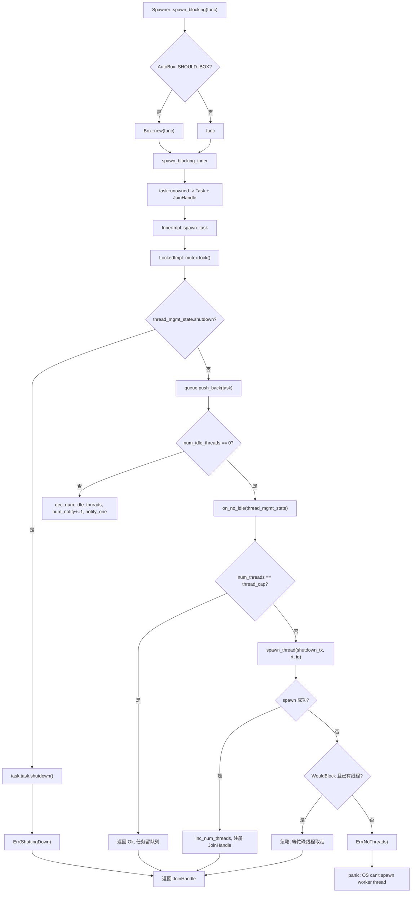
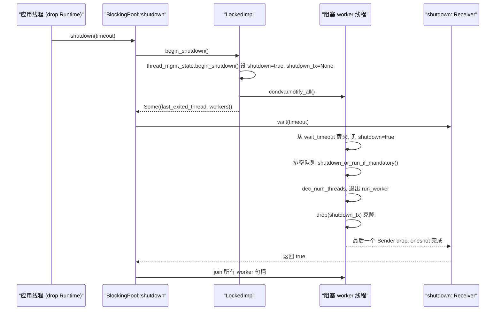

# 第 8 章：ブロッキングと橋渡し：spawn_blocking スレッドプールと block_on の境界

前章で見たように、非同期 Mutex とチャネルが待機中にスレッドを占有しないのは、Waker を待機キューに格納し、条件が満たされた後に起床者がタスクを再スケジュールするからである。しかし、このすべての前提は、タスクが Pending 時に自発的にスレッドを譲ることができることにある。一度コードが std::fs::read、libsqlite3、または純粋な CPU 圧縮ループを呼び出すと、戻るまで worker スレッドを占有し、その間そのスレッド上の他のタスクはすべて餓死する。Tokio の解決策は、このような作業を独立したブロッキングスレッドプールに外注し、block_on で非同期コンテキスト内の Future を駆動することである。本章ではこの二つの境界を分解する。

# 8.1 ブロッキングスレッドプールのメモリレイアウト：Inner と二重実装キュー

**直感的モデル**：`spawn_blocking`スレッドプールはレストランの「外注ヘルパープール」のようなものだ。フロントのウェイター（worker スレッド）は注文と配膳だけを担当し、じっくり煮込む必要のある料理に遭遇すると、伝票を書いて厨房の受け渡し窓（キュー）に投げ込み、ヘルパー（ブロッキングスレッド）が窓から伝票を取る。このプールがなければ、ウェイターが自分で料理することになり、レストラン全体が停止する。

**核心構造**。プール全体は`BlockingPool`が保持し、それは二つだけを格納する：クローン可能な`Spawner`（投入エントリ）と`shutdown_rx`（シャットダウン信号受信端）[FACT:tokio/src/runtime/blocking/pool.rs:20-23]。`Spawner`内部は`Arc<Inner>`であり、すべての投入者が同じ状態を共有する[FACT:tokio/src/runtime/blocking/pool.rs:26-28]。

`Inner`はプールの全状態であり、フィールドを一つずつ見る価値がある[FACT:tokio/src/runtime/blocking/pool.rs:77-104]：

- `inner_impl: InnerImpl`：キュー + 通知 + ロックトポロジーの実装であり、列挙型で`Locked`と`Sharded`の二つのバリアントを持つ[FACT:tokio/src/runtime/blocking/pool.rs:107-110]。これは本章で最も重要な抽象化である——「単一ロックキュー」と「シャードキュー」の二つのトポロジーを一つのインターフェース下に統一する。
- `thread_cap: usize`：スレッド数上限、すなわち`max_blocking_threads`。
- `scheduler_threads: usize`：スケジューラ worker スレッド数、メトリクスで差し引くために使用され、`num_blocking_threads`がブロッキングスレッドのみを統計するようにする[FACT:tokio/src/runtime/blocking/pool.rs:455-460]。
- `keep_alive: Duration`：アイドルスレッドの生存期間、デフォルト`KEEP_ALIVE = 10s` [FACT:tokio/src/runtime/blocking/pool.rs:231]。
- `metrics: SpawnerMetrics`：三つのアトミックカウンタ——`num_threads`、`num_idle_threads`、`queue_depth` [FACT:tokio/src/runtime/blocking/pool.rs:31-35]。

> **[Design Inference & Architectural Trade-offs]**
> **なぜロック内フィールドではなくアトミックカウンタを使うのか？** `num_idle_threads`は`spawn_task`のホットパスで読み取られる（アイドルスレッドを起床する必要があるか判断するため）。もしそれが`Mutex`の中に隠れていると、毎回の投入でまずロックを取ってから読む必要がある。それを`MetricAtomicUsize`にすることで、投入パスはキューロックを保持せずに高速判断を一度行える。代償はこれらのカウントとキュー状態の間にアトミック性保証がないことで、そのためコードでは`num_notify`カウンタで補償している——後述参照。

**スレッド管理状態**。`ThreadManagementState`は別途抽出され、二つのキュ実装で再利用される[FACT:tokio/src/runtime/blocking/pool.rs:135-150]：

- `shutdown: bool`：シャットダウンフラグ。
- `shutdown_tx: Option<shutdown::Sender>`：各 worker スレッドがクローンを一つ保持し、すべて drop されると`shutdown_rx`が通知を受け取る。
- `last_exiting_thread: Option<JoinHandle<()>>`：前回タイムアウト終了したスレッドハンドル。
- `worker_threads: HashMap<usize, JoinHandle<()>>`：すべての生存 worker のハンドル。
- `worker_thread_index: usize`：単調増加するスレッド ID アロケータ。

`last_exiting_thread`の設計動機はコメントに明確に書かれている：タイムアウト終了したスレッドは前回タイムアウト終了したスレッドを join し、Valgrind の誤報を避ける[FACT:tokio/src/runtime/blocking/pool.rs:135-150]。`worker_timed_out`まさにこのチェーン join の実装である——自身のハンドルを削除し、古い`last_exiting_thread`を交換して呼び出し元に join させるために返す[FACT:tokio/src/runtime/blocking/pool.rs:172-178]。

**タスクラッピング**。キューに格納されるのは`Task`であり、それは`UnownedTask<BlockingSchedule>`と`Mandatory`フラグを包む[FACT:tokio/src/runtime/blocking/pool.rs:187-191]。`Mandatory`はシャットダウン時にこのタスクが破棄されるか強制実行されるかを決定する：`shutdown_or_run_if_mandatory`は`NonMandatory`時に`shutdown()`を呼び、`Mandatory`時に`run()` [FACT:tokio/src/runtime/blocking/pool.rs:223-228]を呼ぶ。これが`spawn_blocking`（非強制）と`spawn_mandatory_blocking`（強制、fs 用）の違いである[FACT:tokio/src/runtime/blocking/pool.rs:233-265]。

**単一ロック実装のメモリレイアウト**。`LockedImpl`は最も原始的なトポロジーである：一つの`Mutex<LockedInner>`と一つの`Condvar` [FACT:tokio/src/runtime/blocking/pool.rs:113-116]。`LockedInner`の中は`VecDeque<Task>`、`num_notify: u32`と`thread_mgmt_state` [FACT:tokio/src/runtime/blocking/pool.rs:118-124]。注意`num_notify`と`thread_mgmt_state`は同じロック下にあり、`num_idle_threads`はロック外のアトミック量である——この「一部の状態がロック内、一部がロック外」という混合レイアウトこそ、後のすべての並行性の微妙さの根源である。

# 8.2 投入パス：spawn_blocking からスレッド起床まで

**シナリオ**：非同期タスク内で`tokio::task::spawn_blocking(move || heavy_compute(data))`を呼び出す。この瞬間何が起こるか？

**第一ステップ：ボクシング判断とタスク構築**。`Spawner::spawn_blocking`まずクロージャサイズ`fn_size`を測定し、次に`AutoBox::<F>::SHOULD_BOX`に基づいてクロージャを`Box`するかどうかを決定する[FACT:tokio/src/runtime/blocking/pool.rs:359-389]。これは Tokio 共通の「大きな Future 自動ボクシング」戦略である：クロージャが大きすぎる場合にボクシングし、タスク構造体の膨張を避ける。

に入り、まずタスク ID を割り当て、次に`spawn_blocking_inner`でクロージャを Future に包み、最後に`blocking_task`で`task::unowned`と`UnownedTask`を構築する。ここで返されるのは`JoinHandle` [FACT:tokio/src/runtime/blocking/pool.rs:440-449]の二要素タプルである——ハンドルと投入結果が別々に返される。`(JoinHandle<R>, Result<(), SpawnError>)`第二ステップ：投入結果の三つの処理

**。**に戻り、`spawn_blocking`に対して`spawn_result`をマッチする[FACT:tokio/src/runtime/blocking/pool.rs:381-388]：

- `Ok(())`：正常、ハンドルを返す。
- `Err(ShuttingDown)`：**パニックしない**、それでもハンドルを返す。コメントにはこれは互換性のための考慮であると説明されている——ハンドルは決して resolve されないが、呼び出し側はランタイムがシャットダウン中だからといってクラッシュすることはない。
- `Err(NoThreads(e))`：OS がスレッドを作成できず、プール内に引き受ける者もいない場合、直接パニックする。

**第三步：エンキューと起床の決定**。`spawn_task`は`on_no_idle`クロージャを`InnerImpl::spawn_task`に渡し、具体的な実装がいつそれを呼び出すかを決定する[FACT:tokio/src/runtime/blocking/pool.rs:462-506]。`LockedImpl::spawn_task`のクリティカルセクションを見る[FACT:tokio/src/runtime/blocking/pool.rs:603-639]：

```rust
let mut locked = self.mutex.lock();

if locked.thread_mgmt_state.shutdown {
    task.task.shutdown();
    return Err(SpawnError::ShuttingDown);
}

locked.queue.push_back(task);
metrics.inc_queue_depth();

if metrics.num_idle_threads() == 0 {
    on_no_idle(&mut locked.thread_mgmt_state)?;
} else {
    metrics.dec_num_idle_threads();
    locked.num_notify += 1;
    self.condvar.notify_one();
}
```

ここには二つの重要なポイントがある。第一に、シャットダウンチェックはエンキューより前に行われ、たとえタスクが`Mandatory`であっても直接`shutdown()`——コメントにはこう説明されている：それはシャットダウン開始後にスケジュールされたので、破棄は正当である[FACT:tokio/src/runtime/blocking/pool.rs:614-620]。第二に、起床の決定はロック外の`num_idle_threads`に依存する：もし 0 なら、`on_no_idle`を呼び出して新しいスレッドを起動しようとする；そうでなければアイドルカウントをデクリメントし、`num_notify`、`notify_one`。

**`num_notify`なぜ存在しなければならないのか？**なぜなら`Condvar`は偽の起床（spurious wakeup）を引き起こす可能性があるからだ。もし`notify_one`だけを使ってカウントしなければ、偽の起床をしたスレッドはタスクがあると誤解し、キューが空だと分かってまた眠りに戻るが、本当に起こされたスレッドは永遠に通知を受け取れないかもしれない。`num_notify`「正当な起床」をカウント可能なトークンに変える：配信側は`+1`、起こされた側は`num_notify != 0`のときに初めて起床が正当であると見なし、`-1` [FACT:tokio/src/runtime/blocking/pool.rs:674-684]。

**第四步：新しいスレッドの起動**。`on_no_idle`クロージャはキューロックを保持した状態で[FACT:tokio/src/runtime/blocking/pool.rs:462-506]を実行する。まず`num_threads == thread_cap`をチェックし、上限に達したら直接 return する`Ok(())`——タスクはキューに残り、既存のスレッドが処理するのを待つ。これがバックプレッシャーである。そうでなければ`shutdown_tx`をクローンし、`spawn_thread`を呼び出してスレッドを作成し、成功したら`num_threads`をインクリメント、`worker_thread_index`をインクリメント、ハンドルを`worker_threads`。

`spawn_thread`に挿入する`thread::Builder`でスレッド名とスタックサイズを設定し、その後クロージャを spawn する：ランタイムコンテキストに入り`rt.enter()`、`inner.run(id)`を呼び出し、最後に drop する`shutdown_tx` [FACT:tokio/src/runtime/blocking/pool.rs:508-528]。

**OS スレッド作成失敗時のフォールトトレランス**。`spawn_thread`は失敗する可能性がある。コードはエラーを分類している[FACT:tokio/src/runtime/blocking/pool.rs:488-500]：もし`WouldBlock`（一時的なエラーで、`is_temporary_os_thread_error`によって判定される[FACT:tokio/src/runtime/blocking/pool.rs:750-752]）であり、かつプール内に既にブロッキングスレッドがあれば、**静かに無視する**——タスクは現在ビジーなスレッドのいずれかが最終的に取り出す。そうでなければ`SpawnError::NoThreads`を返し、最終的にパニックを引き起こす。

制御フロー図で配信パスの決定分岐をまとめる：



# 8.3 worker メインループ：BUSY/IDLE 状態機械とタイムアウト回収

**直感的モデル**：各ブロッキングスレッドは「待機中の助っ人」である。注文があれば連続して働き（BUSY）、注文がなければうたた寝し（IDLE）、うたた寝が`keep_alive`を超えると退勤する（タイムアウト終了）。タイムアウト回収がなければ、プールはピーク時に作成されたすべてのスレッドを永久に保持し、メモリとカーネルスケジューリングのオーバーヘッドを浪費する。

**メインループの構造**。`LockedImpl::run_worker`は`'main`ループであり、内部的に BUSY と IDLE の二つのフェーズを交互に取る[FACT:tokio/src/runtime/blocking/pool.rs:642-735]。注意：ここでの BUSY/IDLE はループ内の**フェーズ**であり、明示的な列挙状態ではないので、以下では状態図ではなくフローチャートで説明する。

**BUSY フェーズ**：内側の`while let Some(task) = locked.queue.pop_front()`が絶えずタスクを取り出す[FACT:tokio/src/runtime/blocking/pool.rs:655-661]。取得後`queue_depth`，**をデクリメントし、ロックを drop し**、`task.run()`を実行し、再びロックを取得する。ロックを drop するこのステップは極めて重要である——ブロッキングタスクは長時間実行される可能性があり、絶対にロックを保持したまま実行してはならない。

**IDLE フェーズ**：キューが空になると、`num_idle_threads`をインクリメントし、`is_counted_idle = true`を設定し、その後待機ループに入る[FACT:tokio/src/runtime/blocking/pool.rs:663-696]。核心は`condvar.wait_timeout(locked, keep_alive)`であり、戻った後に三つのことをチェックする：

1. `num_notify != 0`：正当な起床。`num_notify`をデクリメントし、`is_counted_idle = false`を設定する（配信側が既に`num_idle_threads`をデクリメントしているため）、break して BUSY に戻る[FACT:tokio/src/runtime/blocking/pool.rs:674-684]。

2. 未シャットダウンかつタイムアウト：`worker_timed_out`を呼び出して前回終了したスレッドのハンドルを取得し、`break 'main`ループを終了する[FACT:tokio/src/runtime/blocking/pool.rs:689-693]。

3. それ以外は偽の起床であり、待機を続ける。

**シャットダウン時のキュードレイン**。もし`thread_mgmt_state.shutdown`が真なら、ドレインロジックに入る[FACT:tokio/src/runtime/blocking/pool.rs:698-710]：タスクを一つずつポップし、ロックを drop し、`task.shutdown_or_run_if_mandatory()`を呼び出す——非強制タスクは破棄され、強制タスクは通常通り実行される。その後 break してメインループを終了する。

**終了時のクリーンアップ**。スレッド終了前に`num_threads` [FACT:tokio/src/runtime/blocking/pool.rs:714]をデクリメントする。もし`is_counted_idle`が真なら、さらに`num_idle_threads`をデクリメントし、`assert_ne!(prev_idle, 0)`でアンダーフローがないことをアサートする[FACT:tokio/src/runtime/blocking/pool.rs:716-726]。このアサートはデバッグ期のガードレールである：ひとたび`num_idle_threads`の会計が間違えば、ここで即座にパニックし、エラーが静かに伝播することを許さない。

最後に、シャットダウン中かつ`num_threads == 0`（最後のスレッド）なら、`notify_one`待機している可能性のあるシャットダウン发起者を起床する[FACT:tokio/src/runtime/blocking/pool.rs:728-730]。`join_on_thread`を返し、`Inner::run`が終了前に join する[FACT:tokio/src/runtime/blocking/pool.rs:755-771]。

**シャットダウンハンドシェイク**。`BlockingPool::shutdown`はまず`begin_shutdown`を呼び出してすべての worker ハンドルを取得し[FACT:tokio/src/runtime/blocking/pool.rs:310-312]。`LockedImpl::begin_shutdown`シャットダウンフラグを設定し、`shutdown_tx`、`notify_all`を drop してすべての待機スレッドを起床する[FACT:tokio/src/runtime/blocking/pool.rs:740-745]。その後`shutdown_rx.wait(timeout)`はブロックして待機する[FACT:tokio/src/runtime/blocking/pool.rs:324]。

`shutdown::Receiver::wait`の実装は非常に凝っている[FACT:tokio/src/runtime/blocking/shutdown.rs:37-70]：まず`timeout == 0`の高速パスを処理し、直接 false を返す；次に`try_enter_blocking_region()`を呼び出してブロッキング領域に入り、失敗しかつ現在パニック中なら false を返し、そうでなければパニックし「非同期コンテキストで runtime を drop できません」というヒントを出す[FACT:tokio/src/runtime/blocking/shutdown.rs:44-57]。最後に timeout に応じて`block_on_timeout`または`block_on`を呼び出してその oneshot を駆動する。

`shutdown_tx`のメカニズムは：各 worker スレッドが`Arc<oneshot::Sender<()>>`のクローンを一つ保持する[FACT:tokio/src/runtime/blocking/shutdown.rs:12-14]。すべてのスレッドが終了すると、すべてのクローンが drop され、`Arc`カウントがゼロになり、`oneshot::Sender`が drop され、`Receiver`が通知を受け取る。これが「すべての Sender が drop された後に Receiver が起床する」という古典的なパターンである。



# 8.4 block_on：非同期コンテキストで Future を駆動する

**直感的モデル**：`block_on`はランタイムの「正門」である。現在のスレッドを一時的なエグゼキュータに変え、渡された Future を完了するまで繰り返し poll する。これがなければ、`main`関数は非同期コードを一切起動できない。

**エントリとボクシング**。`Runtime::block_on`も同様にまずサイズを測定し、`SHOULD_BOX`に従って`Box::pin`するかどうかを決定し、その後`block_on_inner` [FACT:tokio/src/runtime/runtime.rs:343-350]。`block_on_inner`に入る。中には二つの条件付きコンパイルの trace ラッパー（taskdump と tracing）があり、その後`self.enter()`ランタイムコンテキストに入り、最後にスケジューラタイプに応じてディスパッチする[FACT:tokio/src/runtime/runtime.rs:353-383]：

```rust
let _enter = self.enter();

match &self.scheduler {
    Scheduler::CurrentThread(exec) => exec.block_on(&self.handle.inner, future),
    Scheduler::MultiThread(exec) => exec.block_on(&self.handle.inner, future),
}
```

二種類のスケジューラの`block_on`意味が異なる。ドキュメントに明確に書かれている[FACT:tokio/src/runtime/runtime.rs:302-320]：

- **マルチスレッドスケジューラ**：Future は I/O ドライバとタイマーのコンテキストで実行され、`block_on`戻った後、spawn 済みのタスクは実行を継続する。
- **現在のスレッドスケジューラ**：`block_on`は複数のスレッドから同時に呼び出すことができ、最初の呼び出し元が I/O とタイマードライバの所有権を取得し、他のスレッドはそれに「フック」する。最初の`block_on`が完了すると、他のスレッドはドライバを「盗む」ことができる。`block_on`が戻った後、spawn 済みのタスクは中断され、再度`block_on`を呼び出すとそれらが再開される。

**重要な制約：非同期コンテキスト内で**を呼び出してはならない。ドキュメントは明確に`block_on`を非同期実行コンテキストで呼び出すと panic すると述べている[FACT:tokio/src/runtime/runtime.rs:321-324]。理由は明白である：`block_on`は Future が完了するまで現在のスレッドをブロックし、現在のスレッド自体が worker スレッドであれば、エグゼキュータ全体をブロックしてしまう——これはまさに`spawn_blocking`が解決しようとしている問題であり、したがって両者は排他的である。

**シャットダウンパス**。`Runtime::drop`はスケジューラの種類に応じてディスパッチされる[FACT:tokio/src/runtime/runtime.rs:506-521]：現在のスレッドスケジューラはまず`try_set_current`でコンテキストに入ってから shutdown する必要がある（タスクがランタイムコンテキスト内で drop されることを保証する）；マルチスレッドスケジューラは直接 shutdown する（worker スレッド自体が既にコンテキスト内にある）。`shutdown_timeout`先にスケジューラを閉じ、次にブロッキングプールを閉じる[FACT:tokio/src/runtime/runtime.rs:457-461]，`shutdown_background`は`shutdown_timeout(Duration::from_nanos(0))` [FACT:tokio/src/runtime/runtime.rs:494-496]。

# と等価である

**設計上の考察、エラー回復、本番環境での落とし穴`spawn_blocking`なぜ`ShuttingDown`の** [FACT:tokio/src/runtime/blocking/pool.rs:383-384]は panic しないのか？`spawn_blocking`コメントには互換性の考慮と書かれている。`JoinHandle`は`Result`ではなく`await`を返す。シャットダウン時に panic すると、「ランタイムがシャットダウン中」という予測可能な状態がクラッシュになってしまう。決して resolve しないハンドルを返すと、呼び出し元は`block_on`時に永遠にハングする——しかしこの時点でランタイムは既に閉じているので、

**`max_blocking_threads`全体も終了し、実際には永久にリークすることはない。**のバックプレッシャセマンティクス`spawn_blocking`。デフォルト値は非常に大きい（512）。なぜなら[FACT:tokio/src/task/blocking.rs:94-100]はファイル I/O によく使われるからである。しかしドキュメントは警告している：CPU 密集型タスクを実行する場合はセマフォで並行度を制限しなければならない。そうしないと大量のスレッドが作成される

**`spawn_blocking`。上限に達するとタスクはキューで待機し、バックプレッシャが形成される——ただしこのバックプレッシャはブロッキングプールにのみ作用し、非同期スケジューラには逆圧をかけない。**はキャンセル不可`abort`。ドキュメントは明確に述べている：[FACT:tokio/src/task/blocking.rs:106-120]は既に実行を開始したブロッキングタスクには無効であり、タスクは最後まで実行され続ける`shutdown_timeout`。まだ開始されていないタスクのみが abort によって阻止されうる。シャットダウン時、ランタイムは既に開始されたすべてのブロッキングタスクを待機し、

**`num_idle_threads`タイムアウト後これらのスレッドはリークする。**。`is_counted_idle`の会計の落とし穴`num_idle_threads`フラグの存在は、このカウントが非常に間違えやすいことを示している。投入側はウェイクアップ時に`num_notify != 0`をデクリメントし、ウェイクアップされた側は`is_counted_idle = false`を見てから[FACT:tokio/src/runtime/blocking/pool.rs:679-682]を設定し、`assert_ne!(prev_idle, 0)`の重複デクリメントを避ける。このパスにバグがあると、[FACT:tokio/src/runtime/blocking/pool.rs:722-725]は終了時に panic する`num_idle_threads`。本番環境で「

> **[Design Inference & Architectural Trade-offs]**
> **`last_exiting_thread`〔設計上の推論とアーキテクチャのトレードオフ〕**チェーン join のコスト[FACT:tokio/src/runtime/blocking/pool.rs:172-178]。タイムアウトで終了するスレッドは、前のタイムアウトで終了したスレッドを join する

**`InnerImpl`。これにより join チェーンが形成される：各終了スレッドは前のスレッドが実際に終了するのを待たなければならない。ブロッキングスレッドの作成/破棄が高頻度なシナリオでは、このチェーンが長くなり、スレッド終了の遅延が累積する可能性がある。これは Valgrind の誤検出を避けるためのトレードオフであり、通常の本番環境では影響は限定的だが、スレッドが頻繁にタイムアウトする負荷では注目に値する。**列挙型抽象化の意義`Locked`。コメントには`Sharded`バリアントの動作はリファクタリング前と完全に同一であり、[FACT:tokio/src/runtime/blocking/pool.rs:537-539]。`spawn_task`、`run_worker`、`begin_shutdown`バリアントは将来の並行キュー用に対称的なスロットを予約していると説明されている[FACT:tokio/src/runtime/blocking/pool.rs:548-582]3 つのメソッドはすべて列挙型でディスパッチされる

# 。この「列挙型ディスパッチ + バリアントごとの自己保持クリティカルセクション」という設計により、新しいキュートポロジを追加する際に呼び出し側を変更する必要がない。

本章のまとめ`spawn_blocking`本章では、Tokio が同期コードを受け入れる 2 つの境界を分解した。`Inner`はクロージャを独立したブロッキングスレッドプールに投入する：`LockedImpl`はキュー、スレッド上限、生存期間、アトミックメトリクスを保持する；`Condvar`は単一ロック +`num_notify`でキューを実装し、`max_blocking_threads`カウンタで偽のウェイクアップを補償する；worker は BUSY/IDLE 間を循環し、アイドルタイムアウト後にチェーン join で終了する；`block_on`は上限に達するとタスクがキューに並びバックプレッシャを形成する。`shutdown_tx`は非同期コンテキストで Future を駆動し、マルチスレッドと現在のスレッドスケジューラではセマンティクスが異なり、非同期コンテキストでの呼び出しは厳禁である。シャットダウンパスは`Arc`の`oneshot`カウントがゼロになることで

# をトリガーし、「すべての worker が終了したらシャットダウン发起者をウェイクアップする」というハンドシェイクを実現する。

本章の考察とセルフチェック`LockedImpl::spawn_task`Q1: もし`if metrics.num_idle_threads() == 0`の`on_no_idle`の判定を常に真に変更したら（つまり毎回

**を呼び出す）、高並行投入シナリオで何が起こるか？なぜか？**：`on_no_idle`参考解析`num_threads == thread_cap`は[FACT:tokio/src/runtime/blocking/pool.rs:471-487]をチェックし、上限に達していなければ新しいスレッドを作成する`thread_cap`。もし判定が常に真なら、アイドルスレッドがあっても新しいスレッドを起動しようとし、スレッド数が急速に`notify_one`まで達する。さらに深刻なのは、アイドルスレッドが`on_no_idle`でウェイクアップされないことである（`else`ブランチではなく`num_notify += 1; notify_one` [FACT:tokio/src/runtime/blocking/pool.rs:627-636]ブランチの

Q2: `LockedImpl::run_worker`を通るため）。キューのタスクは誰も処理しない可能性があり、新しいスレッドが起動して初めてキューが空でないことに気づく。これにより「スレッドは満杯なのにタスクはまだキューに並んでいる」という偽のデッドロック状態が発生する。元の判定の意義はまさにこれである：アイドルスレッドがある場合はそれらを優先的にウェイクアップし、無駄なスレッド作成を避ける。`task.run()`BUSY 段階で`drop(locked)` [FACT:tokio/src/runtime/blocking/pool.rs:657-658]を実行する前に`drop`を行う。もしこの

**を削除したら、どのようなシナリオでデッドロックが発生するか？**：`task.run()`参考解析`spawn_blocking`が実行するのはユーザー閉包であり、閉包内部で再び`LockedImpl::spawn_task`を呼び出して新しいタスクを投入する可能性が十分にある。投入パス`self.mutex.lock()` [FACT:tokio/src/runtime/blocking/pool.rs:612]の最初の処理は`std::sync::Mutex`再入不可のため、直接デッドロックする。さらに、ロックを保持したまま長時間タスクを実行すると、他のすべての投入者と worker のタスク取得操作をブロックし、デッドロックしなくてもプール全体が直列化される。`drop(locked)`必須である。

Q3: `shutdown::Receiver::wait`において`try_enter_blocking_region()`失敗し、かつ現在 panic 中である場合は false を返し、そうでなければ panic[FACT:tokio/src/runtime/blocking/shutdown.rs:44-57]。なぜ panic 時に特別扱いするのか？この分岐を削除すると、どのような場面で問題が起きるのか？

**参考解析**：`try_enter_blocking_region`失敗は現在が非同期コンテキストであり、ブロッキングが許可されていないことを意味する。通常は panic してユーザーに「非同期コンテキストで runtime を drop できない」と知らせるべきである。しかし現在のスレッドがすでに panic 中の場合（`std::thread::panicking()`が真）、さらに panic すると二重 panic となり、Rust のデフォルト動作ではプロセスが直接 abort される。シナリオ：ユーザーが非同期タスク内で Runtime を drop し、そのタスク自体が別の理由で panic 中である場合、drop が引き起こす shutdown が二次 panic を起こす。false を返すことで shutdown は待機を諦め、プロセスの abort を避け、ユーザーが元の panic 情報を見られる機会を保つ。これは「panic 安全」の典型的な処理である。

ブロッキングスレッドプールと block_on は非同期ランタイムの能力境界を画定する。前者はスレッドを譲れない作業を専用スレッドに隔離し、後者は非同期でない入口からも Future を駆動できるようにする。しかしこれら二つの境界はコード内でしばしば手書きされるものではない。次の章ではマクロの世界に入り、#[tokio::main]、select!、join! がコンパイル時にこれらのランタイムコードをどのように生成するかを見ていく。
