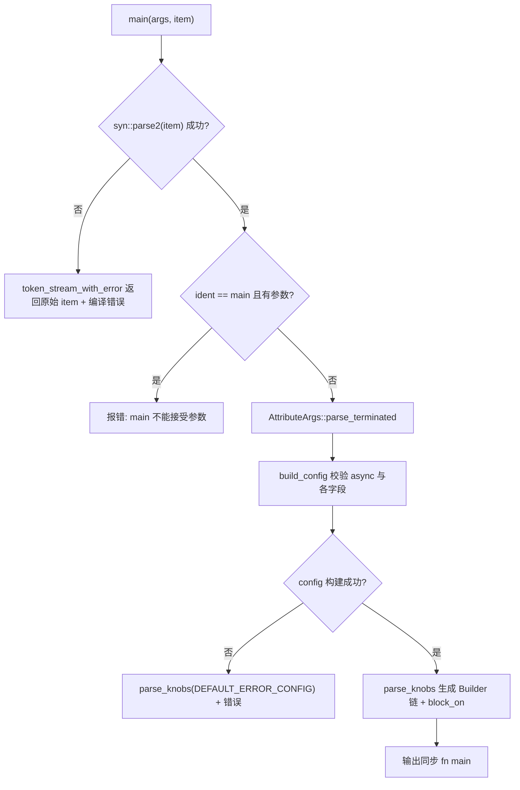
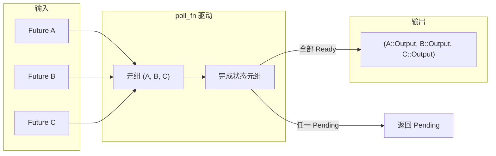

# 第 9 章：マクロの魔法：#[tokio::main]、select!、join! の背後にあるコード生成

前章では`block_on`とブロッキングスレッドプールが非同期ランタイムの能力境界をどのように画定するかを見たが、ユーザーはこれらの境界をほとんど手書きしない。彼らは`#[tokio::main]`、`select!`、`join!`を書き、マクロがコンパイル時にこれらの定型コードを展開する。マクロは Tokio がユーザーに提供する最初の糖衣であり、コンパイル時に実際にランタイムコードを生成する場所でもある。本章は`tokio-macros`crate と`tokio/src/macros/select.rs`に焦点を当て、最もよく使われる三つのマクロ展開経路を分解し、一つの問いに重点的に答える：マクロ展開後の実際の呼び出しチェーンはどのようなものか、そしてなぜ`select!`のキャンセル安全セマンティクスは特に警戒しなければならないのか。

# 9.1 #[tokio::main]：async fn を Runtime::block_on に書き換える

**直感モデル**：`#[tokio::main]`は「リフォーム委託書」のようなものである。あなたがスケルトン状態の部屋（`async fn main`）を渡すと、それが必要な設備（Runtime の構築）を整え、窓やドア（`enable_all`）を取り付け、最後にあなたの元の家具（関数本体）を搬入する。これがなければ、すべての`main`で手書きの`Builder::new_multi_thread().enable_all().build().unwrap().block_on(...)`が必要になり、定型コードがビジネスロジックを埋め尽くしてしまう。

## データ構造とメモリレイアウト

マクロ自体は実行時データ構造を生成しないが、それが解析した設定は二つの構造体に格納される。`Configuration`は「解析期の可変アキュムレータ」であり、フィールドはすべて`Option`である。属性パラメータは省略されたり、重複したり、不正であったりする可能性があるためである[FACT:tokio-macros/src/entry.rs:74-84]。注意すべきは`worker_threads`、`start_paused`、`unhandled_panic`がすべて`Span`を持つことである——これはエラー時に、マクロ内部ではなくユーザーが書いた行にエラーを位置付けるためである[FACT:tokio-macros/src/entry.rs:74-84]。`FinalConfig`は「検証後の不変な結果」であり、`flavor`はもはや`Option`ではない。なぜなら`build()`がすでに`default_flavor`でフォールバックしているからである[FACT:tokio-macros/src/entry.rs:55-62]。

`RuntimeFlavor`には三つのバリアントしかない：`CurrentThread`、`Threaded`、`Local` [FACT:tokio-macros/src/entry.rs:10-14]。`from_str`では歴史的経緯のある名前に対して親切なエラーを特に出している：`single_thread`は`current_thread`，`basic_scheduler`と呼ぶべきと提示し、`threaded_scheduler`は改名済みと提示し、[FACT:tokio-macros/src/entry.rs:17-27]は改名済みと提示する

## 。これはマクロが「ユーザーの第一接触面」である典型的な設計である：エラーメッセージがすなわちドキュメントである。

Step-by-Step 展開フロー`#[tokio::main(flavor = "multi_thread", worker_threads = 4)] async fn main() { ... }`。

シナリオを代入：ユーザーが`main`と書く。第一ステップでは、`ItemFn` [FACT:tokio-macros/src/entry.rs:577-580]の入口がまず item をカスタムの`ItemFn`として解析する。この`syn::ItemFn`は[FACT:tokio-macros/src/entry.rs:720-764]ではなく、Tokio 自身が実装したパーサーであり、その理由はコメントに書かれている：文全体を再帰的に解析したくなく、「token tree ごとにバッファし、セミコロンで区切る」軽量解析のみを行う

。これによりマクロ内で関数本体に対して完全な AST 構築を行うオーバーヘッドを避けている。`build_config`第二ステップでは、`async`が`async` keyword is missing" [FACT:tokio-macros/src/entry.rs:346-349]キーワードの存在を検証し、欠けていれば "the`worker_threads`、`flavor`、`start_paused`、`crate`、`unhandled_panic`、`name`を報告する。その後属性パラメータを走査し、[FACT:tokio-macros/src/entry.rs:369-399]を対応する setter に振り分ける`core_threads`。注意すべきは[FACT:tokio-macros/src/entry.rs:379-382]。

が明示的に拒否され、改名済みとして`Configuration::build`と提示されることである`worker_threads`第三ステップでは、`multi_thread` [FACT:tokio-macros/src/entry.rs:197-217]；`start_paused`がフィールド間の一貫性検証を行う。ここには三つの重要な制約がある：`current_thread`/`local` [FACT:tokio-macros/src/entry.rs:219-229]；`unhandled_panic`は`current_thread`/`local` [FACT:tokio-macros/src/entry.rs:231-241]のみを許可し、`multi_thread`は`rt-multi-thread`のみを許可し、[FACT:tokio-macros/src/entry.rs:209-216]。

も同様に`parse_knobs`のみを許可する`asyncness` [FACT:tokio-macros/src/entry.rs:441]。ユーザーが`CurrentThread`/`Local`を選んだが`Builder::new_current_thread()`，`Threaded`feature が有効でない場合、エラーメッセージは flavor を明示指定したかどうかで異なる`Builder::new_multi_thread()` [FACT:tokio-macros/src/entry.rs:468-477]。`Local`第四ステップでは、`build_local(Default::default())`がコードを生成する。まず`build()` [FACT:tokio-macros/src/entry.rs:479-483]を消し、その後 flavor に応じて builder の起点を選ぶ：`.worker_threads(#v)`、`.start_paused(#v)`、`.unhandled_panic(...)`、`.name(#v)` [FACT:tokio-macros/src/entry.rs:485-497]。

は`last_block`：`return #rt.enable_all().#build.expect("Failed building the Runtime").block_on(body)` [FACT:tokio-macros/src/entry.rs:509-522]を使用し、`return`は[FACT:tokio-macros/src/entry.rs:508]。

を使用する`async #body`の特殊な点は、build 呼び出しが`!`ではなく`impl Trait`であることである`if false { let _: &dyn Future<Output = #output_type> = &body; }`。その後必要に応じてチェーンで[FACT:tokio-macros/src/entry.rs:551-571]を追加する`pin!`body をスタックに固定し、`Pin<&mut dyn Future>`に変換する`block_on`これは[FACT:tokio-macros/src/entry.rs:526-548]。



## コピー

`main`設計上の考察と本番での落とし穴`test`と`parse_knobs`で`test`を共有するが、デフォルトの flavor が異なる：`CurrentThread`，`main`デフォルトは`Threaded` [FACT:tokio-macros/src/entry.rs:91-94]デフォルトは`#[tokio::test]`。これは

がデフォルトでシングルスレッドである理由を説明している——テストは通常マルチコアを必要とせず、シングルスレッドの方が再現しやすい。[FACT:tokio-macros/src/lib.rs:31-35]見落とされがちな落とし穴：マクロ展開後、関数を呼び出すたびに新しい Runtime が作成される。ドキュメントは、関数が頻繁に呼び出される場合は Builder を使って Runtime を再利用すべきだと明確に警告している`#[tokio::main]`。

を通常の関数で使うことは合法だが、呼び出しごとに Runtime 構築コストを支払うことになる。`crate`もう一つの落とし穴は`use tokio as tokio1`のリネームである。ユーザーが`tokio::runtime::Builder`した場合、マクロ内部でデフォルト生成される`crate = "tokio1"` [FACT:tokio-macros/src/lib.rs:239-264]。`parse_knobs`はパスを見つけられなくなり、明示的に`crate_path`する必要がある。`Ident::new("tokio", ...)` [FACT:tokio-macros/src/entry.rs:456-462]内の

# のデフォルト値は

**であり、これがまさにリネームシナリオでエラーが発生する根源である。**：`select!`9.2 select!：マルチブランチポーリング、ビットマスク、ランダムな公平性`poll_fn`直感的モデル

## は「複数の配膳窓口を同時に監視するウェイター」のようなものである。どの窓口が先に料理を出すかによって、その料理を持っていき、他の窓口の行列は無効になる。これがなければ、ユーザーは手動で

`select!`を書いて複数の Future をタプルに入れて一つずつ poll し、「あるブランチが準備完了したら他のブランチを破棄する」ロジックも自分で処理しなければならない。`__tokio_select_util`データ構造とメモリレイアウト`Out`展開後、ローカルモジュール`Mask` [FACT:tokio/src/macros/select.rs:615-619]。`Out`が生成され、その中に列挙型`_0`、`_1`と型エイリアス`Disabled`がある。[FACT:tokio-macros/src/select.rs:33-39]。`Mask`のバリアント名は`u8`……各ブランチに一つずつ、加えて`u16`があり、すべてのブランチが無効であることを表す`u32`。`u64`の基盤となる型はブランチ数に応じて動的に選択される：≤8 なら[FACT:tokio-macros/src/select.rs:17-31]、≤16 なら`select!`、≤32 なら

、≤64 なら`futures`、64 を超えると直接 panic`IntoFuture::into_future`。このビットマスクは[FACT:tokio/src/macros/select.rs:654-656]の中核状態である：i 番目のビットが 1 なら i 番目のブランチが無効化されていることを意味する。`futures_init`すべての Future はタプル`into_future`に格納され、各要素はまず[FACT:tokio/src/macros/select.rs:641-646]で`let mut futures = &mut futures;`に変換される`poll_fn`。ここでは先に[FACT:tokio/src/macros/select.rs:658-662]。

## を構築してから一つずつ

していることに注意。コメントでは、これは一時的なライフタイム延長を利用するためだと説明されている`select! { v = stream1.next() => ..., v = stream2.next() => ..., else => break }`。

。その後`biased;`でタプルを可変参照に降格し、`start=0` [FACT:tokio/src/macros/select.rs:801-803]クロージャが所有権を奪うのを避ける`start`。`thread_rng_n(BRANCHES)` [FACT:tokio/src/macros/select.rs:805-809]ステップバイステップのポーリングフロー[FACT:tokio/src/macros/select.rs:61-65]。

シナリオを当てはめる：`(skip) pat = fut, if cond => handler,`第一ステップ、マクロのエントリルールマッチング。もし`skip`プレフィックスがあれば、`_`；そうでなければ[FACT:tokio/src/macros/select.rs:770-793]。`skip`はランダムな式`futures_init.$($skip)*`。これがドキュメントで言う「デフォルトでランダムにブランチを選んで先にチェックする」公平性の源である`count!`。

第二ステップ、正規化。tt-muncher が各ブランチを`if $c`の形式に整形する。`disabled |= 1 << index` [FACT:tokio/src/macros/select.rs:631-636]は`$fut`の並びで、長さはそのブランチより前の branch 数に等しい[FACT:tokio/src/macros/select.rs:39-41]。

。`poll_fn`はタプルフィールドアクセスの生成`ready!(poll_budget_available(cx))`にも、`Pending` [FACT:tokio/src/macros/select.rs:664-667]でブランチインデックスを算出するのにも使われる。`select!`第三ステップ、前提条件の評価。各ブランチの

について、false なら`for i in 0..BRANCHES`，`branch = (start + i) % BRANCHES` [FACT:tokio/src/macros/select.rs:680-685]。注意：ブランチが無効化されていても、その`disabled & mask == mask`式は依然として評価される。ただし poll はされない`continue` [FACT:tokio/src/macros/select.rs:694-699]。`Pin::new_unchecked`第四ステップ、[FACT:tokio/src/macros/select.rs:701-707]クロージャに入る。まず協調予算をチェック：`Ready(out)`、予算を使い果たしたら直接`disabled |= mask`を返す。これにより[FACT:tokio/src/macros/select.rs:710-730]。

が worker を独占しないことが保証される。`out`第五ステップ、ループ`$bind`。各 branch について：まず`Poll::Ready(Out::_i(out))` [FACT:tokio/src/macros/select.rs:727-733]を確認し、無効化済みなら`continue`；そうでなければタプルからその Future を取り出し、[FACT:tokio/src/macros/select.rs:44-47]。

で一层ラップする（安全性は Future がスタック上にあり移動されないことに依存する）`is_pending`；poll して、`Pending`ならまず`Out::Disabled` [FACT:tokio/src/macros/select.rs:740-745]してからパターン`match output`をマッチする`Out::_i`。`Disabled`第六ステップ、パターンマッチング。もし`else`が[FACT:tokio/src/macros/select.rs:749-755]。

```mermaid
flowchart TD
    start["poll_fn 闭包被调用"] --> budget{"poll_budget_available(cx)?"}
    budget -->|否| pending_budget["返回 Pending"]
    budget -->|是| init["is_pending = false; start = $start"]
    init --> loop{"i |否| check_pending{"is_pending?"}
    check_pending -->|是| pending["返回 Pending"]
    check_pending -->|否| disabled_out["返回 Out::Disabled"]
    loop -->|是| branch["branch = (start+i) % BRANCHES"]
    branch --> is_disabled{"disabled & mask == mask?"}
    is_disabled -->|是| next_i["i += 1"]
    is_disabled -->|否| poll_fut["Pin::new_unchecked(fut).poll(cx)"]
    poll_fut --> poll_res{"Poll 结果?"}
    poll_res -->|Pending| set_pending["is_pending = true; i += 1"]
    poll_res -->|Ready| disable["disabled |= mask"]
    disable --> pat_match{"out 匹配 $bind?"}
    pat_match -->|否| next_i
    pat_match -->|是| ready_out["返回 Out::_i(out)"]
    next_i --> loop
    set_pending --> loop
```

## を返す；マッチしなければ、

**他のブランチのポーリングを続ける——これがまさにドキュメントのステップ 5 で言う「パターンがマッチしなければ現在のブランチを無効化する」`Vec<bool>`？**。`disabled |= mask`第七ステップ、ループ終了。もし`select!`が真なら

**を返し、そうでなければすべてのブランチが無効となり、**を返す`select!`。外側の`Some(v) = stream.next() => ...`が`stream.next()`を対応する handler にマッピングし、`None`を[FACT:tokio/src/macros/select.rs:198-223]。

**式にマッピングする**：`select!`。`read_exact`、`read_to_end`、`write_all`コピー[FACT:tokio/src/macros/select.rs:119-124]設計上の考察と本番での落とし穴`Mutex::lock`、`Semaphore::acquire`なぜ[FACT:tokio/src/macros/select.rs:126-133]ではなくビットマスクを使うのか？`.await`ビットマスクはスタック上の単一の整数で、ヒープ割り当てがなく、`.await`は単一命令である。ホットパス上の[FACT:tokio/src/macros/select.rs:135-139]。

**`if`にとって、これは各イテレーションでのヒープアクセスを避ける。**なぜパターンがマッチしないとブランチを無効化するのか？`if !sleep.is_elapsed()`これは`sleep`と「単純な race」の決定的な違いである。例えば`is_elapsed()`を考える。`while`が`select!`（ストリーム終了）を返した場合、パターンがマッチせず、そのブランチは永久に無効化され、終了したストリームを無限にポーリングするのを避ける。ドキュメントの例はまさにこのセマンティクスによって二つのストリームを両方終了するまで収集している[FACT:tokio/src/macros/select.rs:336-376]。`if`キャンセル安全性の本当の意味`sleep`あるブランチが準備完了になると、他のブランチの Future は drop される。drop された Future がすでにデータを消費したがまだ返していない場合、データは失われる。ドキュメントは`break` [FACT:tokio/src/macros/select.rs:378-405]。

**`biased;`がキャンセル安全でないことを明記しており、**はキュー公平性のため、キャンセルするとキューの位置が失われる[FACT:tokio/src/macros/select.rs:67-74]。判定方法：`biased;`ポイントを探し、[FACT:tokio/src/macros/select.rs:75-81]。

# で関数を再開しても正しければ、キャンセル安全である

**。**：`join!`前提条件の競合トラップ`select!`：ドキュメントは古典的な誤りの例を挙げている——`Ready`ガードで`poll_fn`ブランチを

## するが、

`join!`の展開も同様にタプルにFutureを格納するが、状態はビットマスクではなく「完了値」のタプルである。各Futureが完了すると、その値が取り出されて結果タプルに格納され、対応するスロットが完了済みとしてマークされる。`select!`とは異なり、`join!`は未完了のFutureをdropしない——すべてのFutureが完了するまで待ってから返す。

## ステップバイステップの流れ

`join!`のポーリングロジックは`select!`と「タプルにFutureを格納 +`poll_fn`駆動」の骨格を共有するが、セマンティクスは逆である：`select!`は「いずれかが準備完了で即返す」、`join!`は「すべて準備完了でのみ返す」。各ラウンドのpollですべての未完了Futureを走査し、いずれかが`Pending`を返せば全体が`Pending`、すべてが`Ready`なら集約して返す。



## 設計上の考察と本番での落とし穴

`join!`のキャンセル安全性セマンティクスは`select!`とは異なる：`join!`がdropされると、すべての未完了Futureがdropされ、同様にデータが失われる可能性がある。しかし`join!`はどのブランチも能動的にキャンセルしないため、`select!`のように「別のブランチが準備完了したためにこのブランチをキャンセルする」ことはない。真のリスクは`join!`全体が外側の`select!`やタイムアウトによってキャンセルされることにある。

`join!`と`try_join!`の違いは注目に値する：`try_join!`はいずれかのFutureが`Err`を返した時点で即座に返し、残りのFutureをキャンセルするため、`select!`のキャンセル安全性リスクを継承している。

# 設計上の考察

**マクロのコンパイル期コード生成器としての境界**。`#[tokio::main]`は設定検証をコンパイル期に置き、不正な組み合わせ（例：`multi_thread` + `start_paused`）は実行時panicではなく直接コンパイル失敗させる。これがBuilderに対するマクロの核心的な優位性である：エラーの早期検出。

**宣言的マクロ + 手続きマクロのハイブリッドアーキテクチャ**。`select!`の主体は`macro_rules!`だが、2箇所の重要なロジックは手続きマクロに委譲されている：`select_priv_declare_output_enum`が`Out`列挙型と`Mask`型を生成し、[FACT:tokio-macros/src/lib.rs:658-660]，`select_priv_clean_pattern`がパターン内の`ref`/`mut` [FACT:tokio-macros/src/lib.rs:666-668]を除去する。なぜか？コメントの説明によれば、宣言的マクロでは「ブランチ数に応じて動的に整数型を選択する」コードの生成が難しく、パターン位置でのトークンレベルのクリーニングも困難だからである。[FACT:tokio/src/macros/select.rs:577-579]。

**`clean_pattern`の必要性**。`select!`は`out`を`&out`形式でパターン[FACT:tokio/src/macros/select.rs:727]にマッチさせるが、ユーザーが`ref v`と書くと`&ref v`になり型エラーを引き起こす。`clean_pattern`が再帰的に`by_ref`、`mutability`を削除し、また`Reference`パターンの`mutability` [FACT:tokio-macros/src/select.rs:68-73][FACT:tokio-macros/src/select.rs:100-103]も削除する。これはマクロが「ユーザーの直感」と「借用チェッカー」の間で行った妥協である。

**64ブランチ上限の工学的現実**。`count!`、`count_field!`、`select_variant!`3つのマクロがそれぞれ0から64までのマッチルールを手書きしている[FACT:tokio/src/macros/select.rs:821-1017][FACT:tokio/src/macros/select.rs:1021-1217][FACT:tokio/src/macros/select.rs:1221-1414]。コメントには「I'm not happy about it either」と率直に書かれている[FACT:tokio/src/macros/select.rs:816-817]。これは宣言的マクロが算術を行えないことの代償である：トークン数のハードコードされたマッピングでしか整数に変換できない。

# 本章のまとめ

# 本章の考察とセルフチェック

Q1: `select!`の`disabled`ビットマスクは`select!`に入るたびに`Default::default()` [FACT:tokio/src/macros/select.rs:627]に再初期化される。この行を`poll_fn`クロージャ内部に移動した場合、「select!をループで呼び出し、あるブランチのパターンがマッチしない」シナリオで何が起こるか？

**参考解析**：`disabled`クロージャ内で初期化すると、pollのたびにリセットされ、前のラウンドでパターン不一致により無効化されたブランチが再びポーリングに参加してしまう。`Some(v) = stream.next() => ...`かつ`stream`が終了済み（`None`を返す）で、パターン不一致後にそのブランチが永続的に無効化されるべき場合を考える。`disabled`がリセットされると、次のラウンドのpollでこの終了済みストリームを再びpollし、ストリームがfusedでなければ（つまり終了後の再pollでpanicや未定義動作を引き起こす可能性がある）、問題が発生する。たとえfusedでも、永遠に`None`を返すストリームを繰り返しpollするのはCPUの無駄である。ドキュメントには「Re-entering select! due to a loop clears the disabled state」[FACT:tokio/src/macros/select.rs:37-38]と明記されており、これは`select!`マクロに再進入する（新しいループラウンド）ことを指し、同一`select!`内での複数回のpollではない。`disabled`はクロージャの外で初期化しなければならず、それによって同一`select!`呼び出し内の複数回のpoll間で状態を保持できる。

Q2: `select!`は`Ready(out)`をpollした後、まず`disabled |= mask`を実行してからパターン[FACT:tokio/src/macros/select.rs:720-730]をマッチさせる。もし`disabled |= mask`を削除した場合、パターンがマッチせずかつそのFutureがpollのたびに即座に`Ready`を返すシナリオで何が起こるか？

**参考解析**：`disabled |= mask`を削除すると、`out`が`$bind`にマッチしない場合、コードは`continue`に進み他のブランチのポーリングを続ける。しかし次のラウンドで`poll_fn`が呼ばれると（例えば他のブランチが`Pending`を返した後に再度poll）、このブランチはまだ無効化されておらず、再びpollされる。そのFutureがpollのたびに即座に`Ready`を返し値がパターンにマッチしない場合、「poll -> Ready -> 不一致 -> continue -> 他のブランチPending -> Pending返却 -> 再度poll -> 再度Ready -> ...」というライブロックが形成され、CPUが空回りする。`disabled |= mask`は`Ready`の直後にセットされ、パターンがマッチしなくてもそのブランチが再びpollされないことを保証する。セットはパターンマッチの前に行われるため、「Readyだがパターン不一致」と「Readyかつパターンマッチ」の両方でそのブランチが無効化される——前者はライブロック防止、後者は重複消費防止である。

Q3: `parse_knobs`は非testパスで`if false { let _: &dyn Future<Output = #output_type> = &body; }`を挿入して型チェックを行い[FACT:tokio-macros/src/entry.rs:557-561]、ただし`!`を返す型や`impl Trait`を含む型はチェックをスキップする[FACT:tokio-macros/src/entry.rs:551-556]。なぜ`impl Trait`はスキップが必要なのか？無理にチェックするとどうなるか？

**参考解析**：`impl Trait`は戻り位置では「不透明型」であり、コンパイラはこれを`&dyn Future<Output = impl Trait>`に強制キャストすることを許可しない。なぜなら`dyn`は具体的な型を要求するが、`impl Trait`の具体的な型は関数の外部からは見えません。無理にチェックを挿入すると、「the size for values of type`impl Future`cannot be known at compilation time」や「cannot be made into an object」といったエラーが発生します。返り値`!`の型も同様です：`!`は任意の型に強制変換できますが、`&dyn Future<Output = !>`の`Output = !`自体が never type の不安定な機能問題を引き起こす可能性があります。チェックをスキップする代償は：ユーザーが`async fn main() -> impl Trait`と書いたが実際の返り値の型が`impl Trait`と一致しない場合、エラーは`block_on`の時点で初めて露呈し、エラーメッセージは明示的なチェックほど明確でない可能性があります。これは「コンパイル時チェックの完全性」と「型システムの制約」の間のトレードオフです。

マクロはボイラープレートコードとコンパイル時検証をユーザーの手から引き受けますが、それが生成するのは依然として通常の Future と`poll`呼び出しです。次の章ではマクロのコンパイル期の世界を離れ、実行時の I/O 抽象層に入り、`AsyncRead`/`AsyncWrite`がどのようにバイトストリームをフレームに分割するか、そして`Framed`コーデックフレームワークが`select!`のキャンセル安全性制約の下でどのように正しく動作するかを見ていきます。

`#[tokio::main]`の本質は「設定解析 + Builder チェーン生成 +`block_on`ラップ」であり、設定検証はコンパイル期に完了し、flavor が builder の起点と build メソッドを決定します。`select!`の核心は「タプルに Future を格納 + ビットマスクで無効化を記録 + ランダム起点で公平性を保証」であり、パターンが一致しなければ分岐が無効化され、キャンセル安全性は drop された Future が`.await`で再起動可能かどうかに依存します。`join!`と`select!`は骨格を共有しますがセマンティクスは逆で、前者はすべての完了を待ち、後者はどれか一つが準備完了すれば即座に返ります。三者は共に Tokio マクロ設計の核心的なトレードオフを示しています：ボイラープレートコードとコンパイル時検証をマクロに任せ、実行時セマンティクスの複雑さ（特にキャンセル安全性）はユーザーの明示的な理解に委ねるということです。マクロがどのように実行時コードを生成するかを理解した後、次に自然に生じる疑問は：これらのコードが実際にバイトストリームの読み書きを開始するとき、Tokio はどのような抽象を提供するのか？第 10 章では`AsyncRead`/`AsyncWrite`とコーデックフレームワークを剖析し、`BufReader`/`BufWriter`がどのようにシステムコールを削減するか、`copy_bidirectional`がどのように双方向転送を駆動するか、`Framed`がどのようにバイトストリームをフレームに分割するかを見ることで、「非同期 I/O の抽象境界はどこにあるのか」に答えます。
