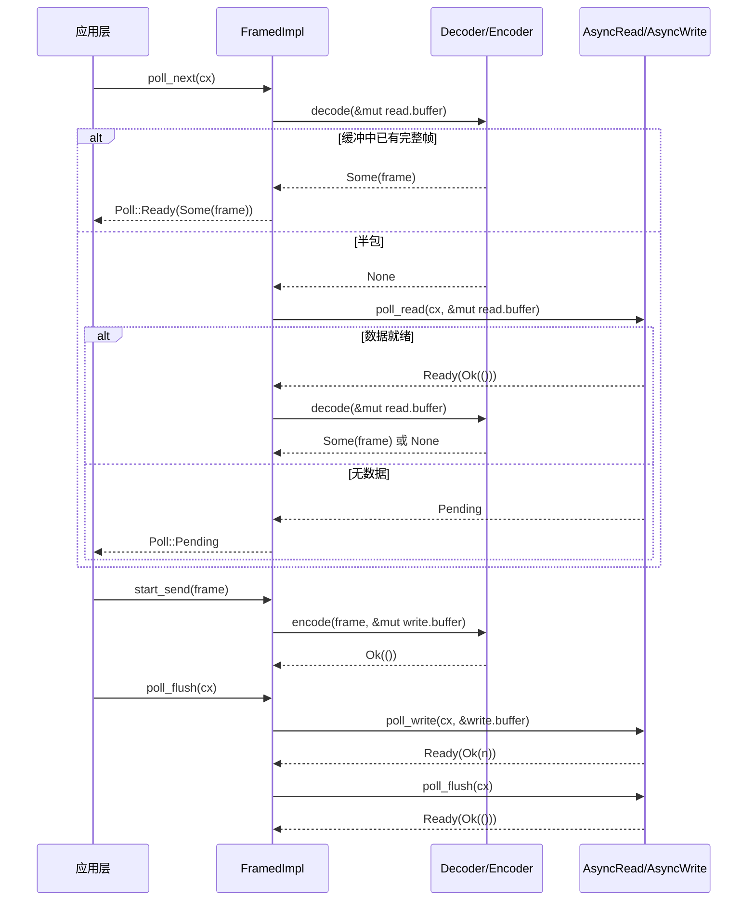

# 第 10 章：ストリーミング I/O 抽象：AsyncRead/AsyncWrite とコーデックフレームワーク

前の章では tokio-macros の展開過程を分解し、#[tokio::main]、select!、join! がどのようにボイラープレートコードとコンパイル時検証をユーザーの手から引き受けるかを見ました。しかしマクロが生成するのは依然として通常の Future と poll 呼び出しです——これらの Future が実際にバイトの読み書きを開始するとき、Tokio が提供する低レベル抽象はわずか二つの trait だけです：AsyncRead と AsyncWrite。それらの問題は「低レベルすぎる」ことにあります：一度の poll_read は「いくつかのバイトを読んだ」ことしか保証せず、「完全なメッセージを読んだ」ことは保証しません。そして大多数のプロトコル（HTTP、Redis、gRPC、カスタム RPC）は「バイトストリーム」ではなく「フレーム」指向です。本章が答えるべき核心的な問いは：非同期 I/O の抽象境界はどこに引かれるべきか？Tokio の答えは二層に分かれます：tokio::io はバイトストリームレベルの trait とツール（BufReader/BufWriter/copy_bidirectional）を提供し、tokio-util の codec フレームワークはその上にフレームレベルの Stream/Sink 適配（Framed/LengthDelimitedCodec）を提供します。この二層の分業を理解すれば、「なぜプロトコル実装がほぼすべて Framed から始まるのか」が理解できます。

# 一、AsyncRead/AsyncWrite：なぜ std::io::Read を直接再利用できないのか

## 直感的モデル

`std::io::Read::read`は「ブロッキング式の荷物受け取り」です：あなたは窓口の前に立ち、荷物が届くまでずっと待ち、スレッドはサスペンドされます。`AsyncRead::poll_read`は「整理券式の荷物受け取り」です：あなたは「できましたか」と尋ね、まだできていなければ（`Poll::Pending`）先に他のことをし、同時に Waker を残して荷物が届いたときにシステムがあなたを呼び出すようにします。この trait がなければ、すべての非同期 I/O は手書きで`epoll`登録と Waker マッピングを書かなければなりません——これはまさに第 5 章の Reactor が行っていることであり、`AsyncRead`はそれが上位層に公開する統一ファサードです。

## データ構造とメモリレイアウト

`AsyncRead`の定義は極めて簡潔で、メソッドは一つだけです：

```rust
pub trait AsyncRead {
    fn poll_read(
        self: Pin,
        cx: &mut Context,
        buf: &mut ReadBuf,
    ) -> Poll>;
}
```

[FACT:tokio/src/io/async_read.rs:44-60]

三つのパラメータにはそれぞれ理由があります。`self: Pin<&mut Self>`であり`&mut self`ではない：なぜなら`AsyncRead`はしばしば`async fn`が生成する Future に保持され、Future は一度 poll されると移動不可（自己参照）になるからであり、`Pin`はコンパイラが強制する契約です。`cx: &mut Context<'_>`は Waker を運び、「整理券受け取り器」の伝達チャネルです。`buf: &mut ReadBuf<'_>`は Tokio による`&mut [u8]`のラップです——それは同時に「充填済み長」と「未初期化容量」を記録し、`std::io::Read`「読み取ったバイト数を返すがバッファが未初期化の可能性がある」という曖昧さ。

ドキュメントでは三つの戻り値セマンティクスが明示されている[FACT:tokio/src/io/async_read.rs:15-32]：`Ready(Ok(()))`データが書き込まれたことを示す`buf`読み取り量は`ReadBuf::filled`の長さの増分で決まる；増分が0の場合、EOFか`buf.remaining() == 0`（バッファ容量ゼロ）のいずれか；`Pending`現在読み取り不可だがウェイクアップが登録済みであることを示す；`Ready(Err(e))`は基盤I/Oエラー。ここに見落とされがちな罠がある：**「読み取り量が0」はEOFと等しくない**——呼び出し側が容量ゼロのバッファを渡した場合、`poll_read`は即座に`Ready(Ok(()))`を返すが何も読んでいない。上位層が「0バイト」をEOFとして扱うと、接続クローズを誤判定する。

## シナリオ駆動Walkthrough：`&[u8]`からバイト列を読み取る

最も単純な実装を考える——`&[u8]`の`AsyncRead`：

```rust
impl AsyncRead for &[u8] {
    fn poll_read(
        mut self: Pin,
        _cx: &mut Context,
        buf: &mut ReadBuf,
    ) -> Poll> {
        let amt = std::cmp::min(self.len(), buf.remaining());
        let (a, b) = self.split_at(amt);
        buf.put_slice(a);
        *self = b;
        Poll::Ready(Ok(()))
    }
}
```

[FACT:tokio/src/io/async_read.rs:98-108]

段階的に解析する：`self.len()`は残りの未読スライス長、`buf.remaining()`はターゲットバッファの残り容量、両者の小さい方を取る`amt`。`split_at(amt)`スライスを「今回コピーする`a`」と「残りの未読`b`」。`buf.put_slice(a)`」に分割する`a`を`ReadBuf`にコピーし、そのfilledポインタを進める。`*self = b`スライス自体を残り部分へ進める——これが`&[u8]`が「カーソル」として機能する鍵：各poll後に`self`は未読部分を指す。最後に`Ready(Ok(()))`を返す。メモリスライスは常に「レディ」であり、`Pending`。

しないからである。`_cx`が無視されることに注意：メモリデータソースはWakerを必要としない。これはネットワークソケットと対照的——後者はデータがない場合に`Pending`を返し、読み取り可能関心を登録する。

`io::Cursor<T>`の実装には境界チェックがもう一層ある[FACT:tokio/src/io/async_read.rs:113-134]：まず`position()`を取得し、`pos > slice.len()`（位置が範囲外）なら直接`Ready(Ok(()))`を返しpanicしない[FACT:tokio/src/io/async_read.rs:113-134]。これは防御的設計：`Cursor`のpositionは外部の`set_position`から任意の値に設定でき、範囲外時は「読み取り済み」として扱う方がpanicよりI/Oセマンティクスに合致する。

## 設計思考：derefマクロとPinの伝播

`AsyncRead`は`Box<T>`、`&mut T`、`Pin<P>`に転送実装を提供する。前者二つは`deref_async_read!`マクロで[FACT:tokio/src/io/async_read.rs:64-70]を生成し、核心は`Pin::new(&mut **self).poll_read(cx, buf)`——`Pin<&mut Box<T>>`を`Pin<&mut T>`にデリファレンスして転送する。`Pin<P>`の実装はより微妙[FACT:tokio/src/io/async_read.rs:87-93]：それは`crate::util::pin_as_deref_mut(self)`を呼び、`Pin<&mut Pin<P>>`を`Pin<&mut P::Target>`に投影する。この投影層は必要である。そうでなければネストした`Pin`が型不一致を引き起こす。

> **[Design Inference & Architectural Trade-offs]**
> ここでの設計動機は「ゼロコスト抽象化」：転送実装により`Box<dyn AsyncRead>`、`&mut T`などのラッパー型が`poll_read`を手書きする必要がなく、同時に`Pin`セマンティクスが正しく保たれる。代償は各転送層が間接呼び出しを一回導入することだが、コンパイラは通常インライン化で除去できる。

---

# 二、copy_bidirectional：双方向転送のステートマシン

## 直感モデル

`copy_bidirectional`は「双方向配膳係」：A→BとB→Aの両方向を同時に監視し、どちらかでデータを読めば反対側に書く。これがなければTCPプロキシを実装するには二つの`copy`Futureを手書きし`select!`で組み合わせる必要がある——そして`select!`のキャンセル安全制約（第9章）により「読み取り途中でキャンセル」されたデータが失われる。`copy_bidirectional`は明示的ステートマシンで「読み-書き-クローズ」の中間状態を保存し、キャンセル安全を実現する。

## データ構造とメモリレイアウト

核心は三状態のenum：

```rust
enum TransferState {
    Running(CopyBuffer),
    ShuttingDown(u64),
    Done(u64),
}
```

[FACT:tokio/src/io/util/copy_bidirectional.rs:10-14]

`Running`が`CopyBuffer`（8KBバッファと読み書きカウントを含む）を保持し、「データを運搬中」を表す。`ShuttingDown(u64)`はコピー済みバイト数を運び、「読み端がEOF、書き端をクローズ中」を表す。`Done(u64)`は「クローズ完了、最終バイト数を記録」を表す。このenumがキャンセル安全の鍵：**いつdropされても状態はenumに保存され、次のpollでブレークポイントから継続できる**。

`CopyBuffer`は`copy.rs`から来て、デフォルトサイズは`DEFAULT_BUF_SIZE`が決定する（8KB）[FACT:tokio/src/io/util/copy_bidirectional.rs:76-88]。両方向がそれぞれ独立した`CopyBuffer`を保持するため、メモリオーバーヘッドは16KB。

## シナリオ駆動Walkthrough：双方向転送の完全なライフサイクル

`copy_bidirectional_impl`は`poll_fn`で両方向のステートマシンを組み合わせる：

```rust
let mut a_to_b = TransferState::Running(a_to_b_buffer);
let mut b_to_a = TransferState::Running(b_to_a_buffer);
poll_fn(|cx| {
    let a_to_b = transfer_one_direction(cx, &mut a_to_b, a, b)?;
    let b_to_a = transfer_one_direction(cx, &mut b_to_a, b, a)?;
    let a_to_b = ready!(a_to_b);
    let b_to_a = ready!(b_to_a);
    Poll::Ready(Ok((a_to_b, b_to_a)))
})
.await
```

[FACT:tokio/src/io/util/copy_bidirectional.rs:127-151]

の呼び出し順に注意：まずa→bを進め、次にb→aを進め、両方とも`transfer_one_direction`を返す`Poll`。`ready!`マクロはどちらかの方向が未完了なら即座に`Pending`を返す——しかし**もう一方の方向の状態は既に進められている**。これこそコメントが強調する[FACT:tokio/src/io/util/copy_bidirectional.rs:143-144]：たとえ`ready!`が早期リターンしても、もう一方の方向は次回pollで`Done(count)`を返し、進捗を失わない。

`transfer_one_direction`の内部は`loop`であり、状態に応じて進む：

```rust
loop {
    match state {
        TransferState::Running(buf) => {
            let count = ready!(buf.poll_copy(cx, r.as_mut(), w.as_mut()))?;
            *state = TransferState::ShuttingDown(count);
        }
        TransferState::ShuttingDown(count) => {
            ready!(w.as_mut().poll_shutdown(cx))?;
            *state = TransferState::Done(*count);
        }
        TransferState::Done(count) => return Poll::Ready(Ok(*count)),
    }
}
```

[FACT:tokio/src/io/util/copy_bidirectional.rs:29-42]

`Running`状態では`poll_copy`を呼び、内部で「一塊読み、一塊書く」を読み端EOFか書き端ブロックまでループする。EOF時はコピー総数を返し、状態は`ShuttingDown`。`ShuttingDown`へ`poll_shutdown`を呼び書き端をクローズ（FIN送信）、完了後`Done`。`Done`へ遷移し直接カウントを返す。

以下のフロー図は単方向ステートマシンの進行ロジックとエラー分岐を示す：

```mermaid
flowchart TD
    start["transfer_one_direction 进入 loop"] --> match_state{"当前 TransferState?"}
    match_state -->|Running| poll_copy["buf.poll_copy(cx, r, w)"]
    poll_copy --> copy_ready{"poll_copy 结果?"}
    copy_ready -->|Pending| ret_pending["返回 Poll::Pending状态保持 Running"]
    copy_ready -->|Err| ret_err["返回 Poll::Ready(Err)错误向上传播"]
    copy_ready -->|Ok(count)| to_shutdown["state = ShuttingDown(count)"]
    to_shutdown --> match_state
    match_state -->|ShuttingDown| poll_shutdown["w.poll_shutdown(cx)"]
    poll_shutdown --> shutdown_ready{"shutdown 结果?"}
    shutdown_ready -->|Pending| ret_pending2["返回 Poll::Pending状态保持 ShuttingDown"]
    shutdown_ready -->|Err| ret_err
    shutdown_ready -->|Ok| to_done["state = Done(count)"]
    to_done --> match_state
    match_state -->|Done| ret_done["返回 Poll::Ready(Ok(count))"]
```

## 設計思考：なぜasync fnでなく明示的ステートマシンか

> **[Design Inference & Architectural Trade-offs]**
> もし`transfer_one_direction`を`async fn`と書けば、コンパイラはFutureを生成し、その内部状態（`CopyBuffer`、コピー済みカウント）は生成されたステートマシンに隠される。単方向使用なら問題ないが、`copy_bidirectional`は**同じpoll周期内で**同時に両方向を進める必要がある——二つの`async fn`に`select!`を加えると、どちらかが完了した時もう一方がdropされ、その内部バッファとカウントが失われ、キャンセル安全に違反する。明示的`TransferState`は状態をスタック上に露出し、`poll_fn`再進入のたびに状態が残るため、「キャンセル後もブレークポイントから回復」を保証する。

エラー処理では、`poll_copy`が返す`Err`は`?`を通じて即座に上方伝播する[FACT:tokio/src/io/util/copy_bidirectional.rs:32]。ドキュメントは明確に説明する[FACT:tokio/src/io/util/copy_bidirectional.rs:67-70]：中断された読み書きはリトライされ、他のエラーは即座に返され、かつ**部分的に読み取られたデータは失われる可能性がある**（反対側に書き込まれていない）。これは本番環境で注意すべき点：`copy_bidirectional`は「全成功か全失敗か」を保証せず、エラー発生時には既に半分のデータが途中にある可能性がある。

`copy_bidirectional_with_sizes`は追加でゼロサイズアサーションを行う[FACT:tokio/src/io/util/copy_bidirectional.rs:99-125]。容量ゼロのバッファは`poll_copy`常に返す`Ready(Ok(0))`EOF と誤判定され、ビジーループが発生する。

---

# 三、Framed：バイトストリームをフレームに分割する

## 直感的モデル

`Framed`は「ソーセージ製造機」である：上流は連続した水流（`AsyncRead`/`AsyncWrite`）であり、下流は切り分けられたソーセージの断片（`Stream<Item = Frame>` / `Sink<Frame>`）。`Decoder`は「水流から一段を切り出す」役割を担い、`Encoder`は「一段を水流に包み込む」役割を担う。もし`Framed`がなければ、各プロトコル実装は「バッファ管理 + 半パケット処理 + 粘着パケット分割」を手書きしなければならない——これこそが codec フレームワークが排除しようとする重複作業である。

## データ構造とメモリレイアウト

`Framed`自体は単なる薄いラッパーである：

```rust
pub struct Framed {
    #[pin]
    inner: FramedImpl
}
```

[FACT:tokio-util/src/codec/framed.rs:38-41]

実際の状態は`FramedImpl`の`state: RWFrames`にあり、`read: ReadFrame`と`write: WriteFrame`の二つの部分を含む。`ReadFrame`のフィールドは`with_capacity`で可視である[FACT:tokio-util/src/codec/framed.rs:107-126]：`eof: bool`（読み取り側が EOF かどうか）、`is_readable: bool`（読み取り可能な関心が登録済みかどうか）、`buffer: BytesMut`（読み取りバッファ）、`has_errored: bool`（エラーが発生済みかどうか、重複読み取りを防ぐ）。`WriteFrame`フィールド[FACT:tokio-util/src/codec/framed.rs:119-122]：`buffer: BytesMut`（書き込みバッファ）、`backpressure_boundary: usize`（背圧閾値）。

`backpressure_boundary`は背圧メカニズムの鍵である：書き込みバッファがこの閾値を超えると、`poll_ready`は`Pending`を返し、データがフラッシュされるまで、上流の`Sink`に背圧をかける。デフォルトでは`capacity` [FACT:tokio-util/src/codec/framed.rs:121]と等しく、`set_backpressure_boundary`を通じて調整可能[FACT:tokio-util/src/codec/framed.rs:271-273]。

## シナリオ駆動 Walkthrough：socket から一つのフレームを読み取る

`Framed`の`Stream`実装は単に`FramedImpl::poll_next` [FACT:tokio-util/src/codec/framed.rs:309-311]に転送するだけである。実際のロジックは`FramedImpl`にある（本章ではこのファイルは提供されていないが、`Framed`のインターフェースから呼び出しチェーンを推測できる）：

1. `poll_next`まず`read.buffer`に完全なフレームが既にあるか確認する（`codec.decode`）；

を呼び出す）。2.`decode`が`Some(frame)`を返した場合、直接産出し、下層の I/O に触れない；

3.`None`（半パケット）を返した場合、`read.eof`を確認する：既に EOF でバッファが空でないなら、残留データがデコードできず、エラーまたは`None`；

を返す。4. そうでなければ下層の`AsyncRead::poll_read`を呼び出してより多くのバイトを`read.buffer`；

に読み込む。5. 読み取ったバイトで再び`decode`を試み、フレームが産出されるか`Pending`。

までループする。この「先に decode してから read」という順序は重要である：それは**一回の read が複数のフレームを産出し得ること**（粘着パケット）、そして**一つのフレームが複数回の read にまたがり得ること**（半パケット）を保証する。`is_readable`フラグは読み取り可能な関心の重複登録を避ける——前回の poll で既に登録済みで未準備なら、今回は直接`Pending`を返し、下層を重複呼び出ししない。

`Sink`実装の呼び出しチェーン[FACT:tokio-util/src/codec/framed.rs:315-338]：`start_send`が`codec.encode(item, &mut write.buffer)`を呼び出してフレームを書き込みバッファにエンコードする；`poll_flush`が`write.buffer`を下層`AsyncWrite`；`poll_ready`にフラッシュする。`write.buffer.len() >= backpressure_boundary`を確認し、閾値を超えていれば先に flush してから準備完了を返す。

以下のシーケンス図は`Framed`が一回の「フレーム読み取り-フレーム書き込み」往復におけるコンポーネント間の協調を示す：



## キャンセル安全性：Framed のドキュメント警告

`Framed`のドキュメントはキャンセル安全セマンティクスを特に列挙している[FACT:tokio-util/src/codec/framed.rs:23-30]：`SinkExt::send`もし`select!`で他のブランチに先に完了させられた場合、**メッセージは未送信が保証されるが、メッセージ自体は失われる**——なぜなら`send`内部では先に`poll_ready`してから`start_send`するため、もし`poll_ready`段階で drop されると、`item`は既に消費されたが未エンコードである。一方`StreamExt::next`はキャンセル安全である：それは下層 stream への参照のみを保持し、drop しても既にデコードされたフレームは失われない。

> **[Design Inference & Architectural Trade-offs]**
> この非対称性は読み書きパスの差異に由来する：読み取りパスの状態（`read.buffer`）は`Framed`内部に保存され、`next`が drop されても「フレーム取得」という動作を放棄するだけで、バッファは影響を受けない；書き込みパスの状態（送信待ちの`item`）は`send`の Future スタック上にあり、drop すれば失われる。プロダクションコードで`select!`内で`send`を使う場合、メッセージが再送可能か、あるいは損失を受け入れることを必ず確保しなければならない。

## 設計上の考察：`into_parts`と`map_codec`

`Framed`は`into_parts`/`from_parts`を提供し、「codec を交換しつつバッファを保持する」ために用いられる[FACT:tokio-util/src/codec/framed.rs:290-298] [FACT:tokio-util/src/codec/framed.rs:155-166]。`map_codec`はまさにこのメソッドペアに基づいて実装されている[FACT:tokio-util/src/codec/framed.rs:221-234]：まず`into_parts`で`io`/`codec`/`read_buf`/`write_buf`を切り出し、次に`map`関数で codec を変換し、最後に`from_parts`で再構成する。この設計により、プロトコルアップグレード（例えば平文から TLS への切り替え）時に既にバッファされたデータを保持し、再読み取りを避けることが可能になる。

`FramedParts`の`_priv: ()`フィールド[FACT:tokio-util/src/codec/framed.rs:373-375]は「非網羅的構造体」テクニックである：プライベートフィールドが外部からの直接構築を防ぎ、`new`/`from_parts`を強制することで、将来フィールドを追加しても互換性を壊さない。

---

# 四、LengthDelimitedCodec：長さプレフィックスコーデックのステートマシン

## 直感的モデル

`LengthDelimitedCodec`は「長さでソーセージを切る」専用の刀具である：各フレームの前に固定バイト数の長さフィールドがあると仮定し、まず長さを読んでから payload を読む。もしこれがなければ、長さプレフィックスプロトコルを実装するには「4 バイト読む → 長さを解析 → N バイト読む → ループ」というステートマシンを手書きしなければならない——これこそが内部の`DecodeState`が行っていることである。

## データ構造とメモリレイアウト

```rust
pub struct LengthDelimitedCodec {
    builder: Builder,
    state: DecodeState,
}

enum DecodeState {
    Head,
    Data(usize),
}
```

[FACT:tokio-util/src/codec/length_delimited.rs:451-457]

`DecodeState`は明示的なステートマシンである：`Head`は「長さフィールドを読み取り中」を表し、`Data(n)`は「長さ n を解析済みで、payload を読み取り中」を表す。この状態は`decode`呼び出しをまたいで保持されるため、**半パケットシナリオでも進捗が失われない**。

`Builder`は全ての設定を保持する[FACT:tokio-util/src/codec/length_delimited.rs:416-435]：`max_frame_len`（デフォルト 8MB）、`length_field_len`（デフォルト 4 バイト）、`length_field_offset`（デフォルト 0）、`length_adjustment`（デフォルト 0）、`num_skip`（デフォルト`None`、すなわち`offset + len`）、`length_field_is_big_endian`（デフォルト true）。

## シナリオ駆動 Walkthrough：長さプレフィックスフレームをデコードする

`decode`はステートマシンのエントリポイントである：

```rust
fn decode(&mut self, src: &mut BytesMut) -> io::Result> {
    let n = match self.state {
        DecodeState::Head => match self.decode_head(src)? {
            Some(n) => {
                self.state = DecodeState::Data(n);
                n
            }
            None => return Ok(None),
        },
        DecodeState::Data(n) => n,
    };

    match self.decode_data(n, src) {
        Some(data) => {
            self.state = DecodeState::Head;
            src.reserve(self.builder.num_head_bytes().saturating_sub(src.len()));
            Ok(Some(data))
        }
        None => Ok(None),
    }
}
```

[FACT:tokio-util/src/codec/length_delimited.rs:579-603]

`Head`状態で`decode_head`を呼び出す。`None`（データ不足）を返した場合、直接`Ok(None)`を返し、より多くのデータを待つ；`Some(n)`を返した場合、状態は`Data(n)`。`Data`に遷移する。`decode_data(n, src)`状態では直接 n を取得する。次に`split_to(n)`を呼び出す：バッファに既に n バイトあれば、`Head`がフレームを切り出し、状態は`None`に戻り、次のフレームヘッダのスペースを予約する；そうでなければ

`decode_head`を返して待つ。

```rust
let head_len = self.builder.num_head_bytes();
let field_len = self.builder.length_field_len;

if src.len()  self.builder.max_frame_len as u64 {
        return Err(io::Error::new(
            io::ErrorKind::InvalidData,
            LengthDelimitedCodecError { _priv: () },
        ));
    }

    let n = n as usize;
    let n = if self.builder.length_adjustment  n,
        None => {
            return Err(io::Error::new(
                io::ErrorKind::InvalidInput,
                "provided length would overflow after adjustment",
            ));
        }
    }
};

src.advance(self.builder.get_num_skip());
src.reserve(n.saturating_sub(src.len()));
Ok(Some(n))
```

[FACT:tokio-util/src/codec/length_delimited.rs:504-562]

コピー`src.len() >= head_len`段階的に解析する：まず`None` [FACT:tokio-util/src/codec/length_delimited.rs:499-502]を確認し、不足なら`Cursor`を返す。`src`で`advance`/`get_uint`をラップし、`advance(length_field_offset)`操作を元のバッファを消費せずに行えるようにする。[FACT:tokio-util/src/codec/length_delimited.rs:517]ヘッダプレフィックスをスキップする`field_len`。エンディアンに従って[FACT:tokio-util/src/codec/length_delimited.rs:520-524]。

**バイトの長さ値**を読み取る。重要な防御`n > max_frame_len`：もし`InvalidData`なら、直ちに[FACT:tokio-util/src/codec/length_delimited.rs:526-531]エラー

を返す。これは悪意ある相手が「長さフィールドが 4GB」のフレームを送信してメモリを枯渇させるのを防ぐ——これは長さプレフィックスプロトコルで最も古典的な DoS 攻撃面である。`checked_sub`/`checked_add`長さ調整には[FACT:tokio-util/src/codec/length_delimited.rs:537-541]を裸の演算の代わりに用い`InvalidInput`エラーであり、panic ではない。`get_num_skip()`を返す`num_skip`またはデフォルトの`offset + len` [FACT:tokio-util/src/codec/length_delimited.rs:1070-1073]を返し、ヘッダーの残り部分をスキップする。最後に`reserve(n.saturating_sub(src.len()))`payload 領域を予約する[FACT:tokio-util/src/codec/length_delimited.rs:559]——`saturating_sub`を使うのは`src`が既に部分的な payload を含んでいる可能性があるため。

以下のフローチャートは`decode`の完全な決定パスを示している：

```mermaid
flowchart TD
    entry["decode(src)"] --> check_state{"self.state?"}
    check_state -->|Head| head["decode_head(src)"]
    head --> head_result{"结果?"}
    head_result -->|Ok(None)| ret_none1["返回 Ok(None)等待更多数据"]
    head_result -->|Err| ret_err1["返回 Err长度超限或溢出"]
    head_result -->|Ok(Some(n))| set_data["state = Data(n)"]
    set_data --> decode_data
    check_state -->|Data(n)| decode_data["decode_data(n, src)"]
    decode_data --> data_result{"src.len() >= n?"}
    data_result -->|否| ret_none2["返回 Ok(None)等待更多数据"]
    data_result -->|是| split["src.split_to(n)state = Headreserve 下一帧头部"]
    split --> ret_frame["返回 Ok(Some(frame))"]
```

## 設計上の考察：max_frame_len のクリッピングとオーバーフロー防止

`Builder::adjust_max_frame_len`codec を構築する際に`max_frame_len`を長さフィールドが表現できる最大値にクリッピングする[FACT:tokio-util/src/codec/length_delimited.rs:1075-1081]。`max_allowed_frame_len`を計算する。ここで`max_length_field_value + length_adjustment` [FACT:tokio-util/src/codec/length_delimited.rs:1083-1089]、そのうち`max_length_field_value`は`checked_shl`を使って`length_field_len == 8`時のシフトオーバーフローを処理する[FACT:tokio-util/src/codec/length_delimited.rs:1091-1096]。このクリッピングにより、ユーザーが「長さフィールド 2 バイトだが max_frame_len を 1MB に設定」といった矛盾した設定を行うことを防ぐ——2 バイトで最大 65535 までしか表現できないため、クリッピング後は max_frame_len が 65535 になる。

エンコードパスの対称的な保護：`encode`をチェックし`n > max_frame_len`を返す。長さの調整も同様に`InvalidInput` [FACT:tokio-util/src/codec/length_delimited.rs:607-607]を使う。エンコード時の調整方向はデコードと逆であることに注意：デコードは「読み取った長さ ± adjustment = payload 長」、エンコードは「payload 長 ∓ adjustment = 書き込む長さフィールド」`checked_add`/`checked_sub` [FACT:tokio-util/src/codec/length_delimited.rs:620-631]〔設計上の推論とアーキテクチャのトレードオフ〕[FACT:tokio-util/src/codec/length_delimited.rs:620-624]。

> **[Design Inference & Architectural Trade-offs]**
> のセマンティクスを統一するためである：それは「長さフィールド値と payload 長の差」を表す。プロトコルの長さフィールドがヘッダーを含む場合（Example 3 など）、`length_adjustment`、デコード時は`adjustment = -2`で payload 長を取得し、エンコード時は`n - (-2) = n + 2`で長さフィールドに書き戻す。`payload - (-2) = payload + 2`設計上の考察：抽象化境界の三つの層

---

# 本章を振り返ると、Tokio の I/O 抽象は明確な三層構造を示している：

第一層：バイトストリーム trait（

**。「バイトの読み書き」のみを約束し、フレーム境界は約束しない。これは最小インターフェースであり、あらゆる I/O ソース（socket、ファイル、メモリスライス）が実装できる。代償として、上位層が半パケット/粘着パケットを自ら処理しなければならない。`AsyncRead`/`AsyncWrite`）**第二層：バイトストリームユーティリティ（

**。trait の上に「システムコール削減」「双方向転送」などの汎用機能を提供する。`BufReader`/`BufWriter`/`copy_bidirectional`）**の明示的なステートマシンは「キャンセル安全性」がユーティリティ層でどのように実現されるかを示している——状態は Future 内部ではなくスタック上に保存される。`copy_bidirectional`第三層：フレームアダプタ（

**。バイトストリームを`Framed`/`Decoder`/`Encoder`）**に昇格させ、プロトコル実装が「バッファ管理」ではなく「フレームのエンコード/デコード」のみを気にすればよいようにする。`Stream<Frame>`/`Sink<Frame>`はこの層の標準的な例であり、その`LengthDelimitedCodec`ステートマシンと`DecodeState`保護は、すべての長さプレフィックスプロトコルが再利用すべきパターンである。`max_frame_len`〔設計上の推論とアーキテクチャのトレードオフ〕

> **[Design Inference & Architectural Trade-offs]**
> に置き、`tokio-util`コアに置かなかったのは、フレームの定義がプロトコルによって異なるためである——`tokio`はバイトストリームのみを提供し、`tokio`はフレームフレームワークを提供し、具体的なプロトコル（HTTP/Redis/gRPC）はそれぞれの crate で実装する`tokio-util`本章のまとめ`Decoder`/`Encoder`。

---

# は

- `AsyncRead::poll_read`の三引数で`Pin<&mut Self>` + `Context` + `ReadBuf`を置き換え、「ブロッキング待機」を「Waker 登録 + Pending 返却」に変える。`std::io::Read::read`かつ読み取り量が 0 の場合、EOF とゼロ容量バッファを区別する必要がある。`Ready(Ok(()))`は
- `copy_bidirectional`の三状態列挙（`TransferState`）で中間状態を保存し、双方向転送が`Running`/`ShuttingDown`/`Done`キャンセル下でも復旧できるようにする。エラー発生時には一部のデータが失われる可能性がある。`select!`は
- `Framed`を`AsyncRead`/`AsyncWrite`に適合させ、読み書きバッファとバックプレッシャーをそれぞれ管理する。`Stream`/`Sink`，`ReadFrame`/`WriteFrame`は非キャンセル安全（メッセージ損失）、`SinkExt::send`はキャンセル安全。`StreamExt::next`は
- `LengthDelimitedCodec`）ステートマシンで半パケットを処理し、`DecodeState`（`Head`/`Data(n)`は長さフィールドの DoS を防ぎ、`max_frame_len`は調整のオーバーフローを防ぐ。`checked_add`/`checked_sub`本章の考察とセルフチェック

# の

Q1: `copy_bidirectional`において、`transfer_one_direction`分岐の`TransferState::ShuttingDown`を直接`ready!(w.as_mut().poll_shutdown(cx))?`に変更した場合（shutdown をスキップ）、どのようなシナリオで対向コネクションが正常にクローズできなくなるか？`*state = TransferState::Done(*count)`参考解析

**の役割は、対向に FIN パケットを送信し、「こちら側にはもうデータがない」ことを通知することである。これをスキップして直接**：`poll_shutdown`に移行すると、書き込み側がクローズされず、対向はデータを待ち続け、「ハーフオープン接続」が形成される——対向は`Done`で永遠にブロックする可能性があり、タイムアウトまで続く。TCP プロキシのシナリオでは、これによりコネクションリークが発生する：クライアントは既に切断されているが、プロキシからバックエンドへの接続は維持されたままである。ソースコードに`read`状態が存在する`ShuttingDown`のはまさに、EOF 後に書き込み側を明示的にクローズすることを保証するためである。なお[FACT:tokio/src/io/util/copy_bidirectional.rs:35-39]自体が`poll_shutdown`（送信バッファ満杯など）を返す可能性があるため、`Pending`で待機する必要があり、無視してはならない。`ready!`において、

Q2: `LengthDelimitedCodec::decode_head`のチェック`if n > self.builder.max_frame_len as u64`を削除した場合、悪意のあるクライアントが長さフィールドを[FACT:tokio-util/src/codec/length_delimited.rs:526-531]（4GB）とするフレームヘッダーを送信すると何が起こるか？なぜこのチェックは`0xFFFFFFFF`の前でなければならないのか？`length_adjustment`参考解析

**：チェックを削除すると、**は`n`に変換され`usize`に渡される。`decode_data`。`decode_data`のチェック時には`src.len() < n`が返るが、`None`の末尾の`decode_head`が 4GB のメモリを予約しようとし、OOM または割り当て失敗による panic を引き起こす。チェックは`src.reserve(n.saturating_sub(src.len()))` [FACT:tokio-util/src/codec/length_delimited.rs:559]の前でなければならない。なぜなら`length_adjustment`が負になる可能性があり（`length_adjustment`など）、先に調整してからチェックすると、`-2`は依然として 4GB に近く、チェックが形骸化する；また負の調整により`0xFFFFFFFF - 2`が先に失敗する可能性があり、エラーメッセージが「オーバーフロー」と誤って示され「フレームが大きすぎる」ではなくなる。ソースコードの順序 [FACT:tokio-util/src/codec/length_delimited.rs:526-`checked_sub` 先失败，错误信息会误导为「溢出」而非「帧过大」。源码顺序 [FACT:tokio-util/src/codec/length_delimited.rs:526-

ここまでで、Tokio におけるバイトストリームとメッセージフレーム間の2層抽象を整理した。tokio::io がバイト転送を担当し、tokio-util の codec フレームワークがフレーム分割とエンコード/デコードを担当する。Framed がプロトコル実装の出発点となるのは、「完全なメッセージを1つ読む」という高頻度の要求を再利用可能な Stream/Sink アダプタとしてカプセル化しているからに他ならない。しかしフレームはデータの容器にすぎず、プロトコルが動的タスク集合、構造化キャンセル、あるいはより複雑なストリーム合成を扱う必要がある場合、Framed だけでは不十分である。次章では tokio-stream と tokio-util の拡張メカニズムに入り、StreamExt コンビネータ、StreamMap/JoinSet/TaskTracker、そして CancellationToken がどのように基盤の Waker とスケジューリング機構を再利用し、非同期イテレーションとタスク管理のためのより高レベルなツールを提供するかを見ていく。
