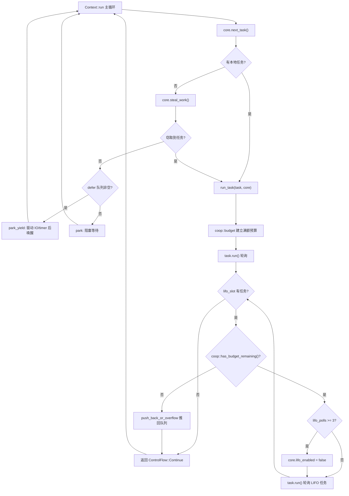

# 第 12 章：協調的スケジューリングと予算：coop メカニズムがどのようにタスクのスケジューラ飢餓を防ぐか

前章では、tokio-stream と tokio-util が基盤の Waker とスケジューリング機構をどのように再利用してコア機能を拡張するかを見た。しかし、どれだけ多くのコンビネータを拡張しても、非同期ランタイムの核心的な矛盾は常に存在する：スケジューラは複数のタスク間で CPU 時間を公平に配分しなければならないが、タスク自体は非プリエンプティブである——ある Future の poll が実行を開始すると、スケジューラは外部からそれを中断できない。もしタスクが1回の poll で10万件のメッセージをループ処理したり、loop 内で永遠に ready な Future を繰り返し await したりすると、worker スレッドを独占し、同じスレッド上の他のタスクは永遠にポーリングの機会を得られなくなる。これが古典的な「タスクがスケジューラを飢餓させる」問題である。Tokio の解決策はプリエンプションではなく協調である：各タスクに1回のスケジューリング周期内で限られた予算を割り当て、リソース操作が予算を消費し、予算を使い果たしたタスクは自発的に譲らなければならない。本章ではこの coop メカニズムの実装を深く掘り下げる。

# 12.1 予算の担い手：スレッドローカルストレージと Budget 構造体

> **[Design Inference & Architectural Trade-offs]**
> スケジューラをレストランで唯一のウェイターに例え、タスクを次々と料理を注文する客とすれば、coop 予算は「各客は最大 N 品まで注文できる」というルールである——ウェイターは客を強制的に中断する必要はなく、客が N 品を注文し終えたら「少し休んでください、次の方を対応します」と言うだけでよい。このルールがなければ、おしゃべりな客一人でレストラン全体が麻痺してしまう。

予算は2つの制約を満たす必要がある：第一に、任意の深さの`poll`呼び出しスタックからアクセスでき、引数を層ごとに渡す必要がないこと；第二に、「現在 Tokio ランタイム内にいるかどうか」を区別できること——ランタイム外で`block_on`を呼び出すときは予算の制約を受けるべきではない。Tokio は**スレッドローカルストレージ（TLS）**で予算を保持し、`context`モジュールを通じて統一的に管理することを選んだ。

予算の核心的な型は`coop::Budget`である。本章のソースコードスライスには`coop.rs`の完全な定義は直接示されていないが、`worker.rs`の使用箇所からそのインターフェース契約を逆推できる：

[FACT:tokio/src/runtime/scheduler/multi_thread/worker.rs:695-795]

```rust
coop::budget(|| {
    // ... 轮询任务 ...
    task.run();
    // ...
    loop {
        // ...
        if !coop::has_budget_remaining() {
            // 预算耗尽，把 LIFO 任务推回队列
            core.run_queue.push_back_or_overflow(task, ...);
            return ControlFlow::Continue(core);
        }
        // ...
    }
})
```

ここに3つの重要な API が現れる：`coop::budget(closure)`は予算スコープを確立し、`coop::has_budget_remaining()`は残りの予算を照会し、そして後述する`coop::stop()`と`coop::set()`。`budget`のセマンティクスは：クロージャに入るとき現在のスレッドの予算を満額値（デフォルト128）にリセットし、クロージャ実行中はすべてのリソース操作がこの枠を共有し、クロージャを抜けるとき外側の予算を復元する。

> **[Design Inference & Architectural Trade-offs]**
> 予算値128は経験値である：十分に大きく、通常のメッセージ処理ループ（例えば1回の poll で数十件のメッセージを処理）が頻繁に譲りを引き起こさない；また十分に小さく、制御不能なループが最大128回のリソース操作で必ず譲らなければならず、遅延を許容範囲に抑える。

`Budget`は TLS 内で通常`Cell<Option<Budget>>`の形で存在する。`Option`の外側のセマンティクスは「現在のスレッドが Tokio ランタイムコンテキスト内にあるかどうか」である：`None`はランタイム内にいないこと（例えばランタイム外の`block_on`）を表し、このときすべての予算チェックはそのまま通過させる。

# 12.2 予算の消費点：リソース操作がどのように差し引くか

予算は無から消費されることはなく、**リソース操作**だけがそれを差し引く。いわゆるリソース操作とは、無限ループで呼ばれうる、外部世界と相互作用する API のことである——channel の`send`/`recv`、I/O の読み書き、`yield_now`など。例えば`mpsc::Sender::reserve`は、すべての送信パスの共通エントリポイントである：

[FACT:tokio/src/sync/mpsc/bounded.rs:1272-1311]

```rust
async fn reserve_inner(&self, n: usize) -> Result> {
    crate::trace::async_trace_leaf().await;

    if n > self.max_capacity() {
        return Err(SendError(()));
    }
    // ... WakeReceiverOnDrop guard ...
    let guard = WakeReceiverOnDrop { chan: &self.chan };
    let result = self.chan.semaphore().semaphore.acquire(n).await;
    // ...
}
```

`reserve_inner`は実際にセマフォ許可を取得する前に、`crate::trace::async_trace_leaf()`を経由する。これは一見 tracing だけの呼び出しに見えるが、実際には予算差し引きのマウントポイントの一つである。`async_trace_leaf`の内部では`coop::poll_proceed`のような関数を呼び出す：予算が十分なら1を差し引いて`Proceed`を返す；予算を使い果たしたなら「譲り」アクションを登録する——現在のタスクの Waker をスケジューラに渡し、`Pending`を返して、タスクをこの poll で早期終了させる。

これが coop の巧妙さである：**予算を使い果たすことはエラーを投げることではなく、「譲り」を普通の`Pending`**に偽装することである。上位の Future は`Pending`を見て自然に返り、スケジューラはタスクを再びキューに入れ、次にスケジュールされたときには予算はリセットされており、タスクは前回中断したところから続行する。このプロセス全体はビジネスコードに対して完全に透過的である。

`yield_now`は予算メカニズムの最も直接的な現れであり、予算を消費せず、**能動的に譲りをトリガーする**：

[FACT:tokio/src/task/yield_now.rs:38-60]

```rust
pub async fn yield_now() {
    let mut yielded = false;
    poll_fn(|cx| {
        ready!(crate::trace::trace_leaf());

        if yielded {
            return Poll::Ready(());
        }

        yielded = true;

        // Don't wake the task immediately, as that would push it right back
        // onto the run queue and it could be polled again before other tasks
        // or the IO/timer driver get a chance to run. Instead, hand the waker
        // to the scheduler, which wakes deferred tasks only after it has run
        // out of ready tasks and polled the driver. When polled from outside
        // a Tokio runtime, the waker is woken immediately.
        context::defer(cx.waker());

        Poll::Pending
    })
    .await
}
```

この行に注意せよ。これは直接`context::defer(cx.waker())`するのではなく、Waker をスケジューラの`wake`defer キュー**に渡している。なぜか？ソースコードのコメントが明確に述べている：もし即座に wake すると、タスクはすぐに実行キューに戻され、I/O/timer ドライバが実行される前に再びポーリングされる可能性があり、譲りの意味が失われる。defer キューのセマンティクスは「現在の worker が ready なタスクを実行し終え、かつドライバをポーリングした後に、これらのタスクを wake する」である。**defer キューは worker の

で定義されている：`Context`コピー

[FACT:tokio/src/runtime/scheduler/multi_thread/worker.rs:247-257]

```rust
pub(crate) struct Context {
    worker: Arc,
    core: RefCell>>,
    /// Tasks to wake after resource drivers are polled. This is mostly to
    /// handle yielded tasks.
    pub(crate) defer: Defer,
}
```

`defer`コピー

[FACT:tokio/src/runtime/scheduler/multi_thread/worker.rs:613-621]

```rust
} else {
    // Wait for work
    core = if !self.defer.is_empty() {
        self.park_yield(core)
    } else {
        self.park(core)
    };
    core.stats.start_processing_scheduled_tasks();
}
```

defer キューが空でない場合、worker は呼び出す`park_yield`——タイムアウト0で park し、これが I/O と timer を駆動し、その後 defer 内のタスクを起床させる。これにより「譲った」タスクは必ず駆動が走った後に再スケジュールされることが保証される。

# 12.3 予算スコープの確立と復元：run_task と block_in_place

予算スコープは`run_task`で確立される。各タスクがポーリングされる際、`coop::budget`がポーリングプロセス全体を包む：

[FACT:tokio/src/runtime/scheduler/multi_thread/worker.rs:691-704]

```rust
// Make the core available to the runtime context
*self.core.borrow_mut() = Some(core);

// Run the task
coop::budget(|| {
    // ...
    task.run();
    // ...
})
```

`coop::budget`進入時に TLS 内の予算を満額に設定し、退出時に復元する。これはつまり**各タスクはポーリングされるたびに全新しい予算を獲得する**。タスク内部で`await`何回リソース操作を行っても、単一の`poll`内で消費が128を超えると、強制的に譲られる。

しかしここに微妙な問題がある：LIFO slot 内のタスクは**同じ`budget`クロージャ内**でポーリングされる。`run_task`のループを見てみよう：

[FACT:tokio/src/runtime/scheduler/multi_thread/worker.rs:709-750]

```rust
let mut lifo_polls = 0;

// As long as there is budget remaining and a task exists in the
// `lifo_slot`, then keep running.
loop {
    let mut core = match self.core.borrow_mut().take() {
        Some(core) => core,
        None => {
            return ControlFlow::Break(());
        }
    };

    let task = match core.lifo_slot.take() {
        Some(task) => task,
        None => {
            self.reset_lifo_enabled(&mut core);
            core.stats.end_poll();
            return ControlFlow::Continue(core);
        }
    };

    if !coop::has_budget_remaining() {
        core.stats.end_poll();
        // Not enough budget left to run the LIFO task, push it to
        // the back of the queue and return.
        core.run_queue.push_back_or_overflow(task, ...);
        debug_assert!(core.lifo_enabled);
        return ControlFlow::Continue(core);
    }
    // ...
}
```

重要な点：LIFO slot 内のタスクは**外側のタスクの予算を共有する**。コメントは`run_task`の冒頭で述べている：「Tasks from the LIFO slot inherit the "parent"'s limits」。これは意図的な設計である——もし各 LIFO タスクが予算をリセットすると、ping-pong シナリオ（タスク A が B を起床し、B がまた A を起床する）では、2つのタスクが無限に互いをスケジュールし、予算が永遠にリセットされ、飢餓問題が依然として残る。予算を共有することで、A と B は合計で最大128回のリソース操作を消費し、その後は必ず譲らなければならない。

LIFO slot 自体にはさらに独立したレートリミッタがある`MAX_LIFO_POLLS_PER_TICK`：

[FACT:tokio/src/runtime/scheduler/multi_thread/worker.rs:756-766]

```rust
// Disable the LIFO slot if we reach our limit
//
// In ping-ping style workloads where task A notifies task B,
// which notifies task A again, continuously prioritizing the
// LIFO slot can cause starvation as these two tasks will
// repeatedly schedule the other. To mitigate this, we limit the
// number of times the LIFO slot is prioritized.
if lifo_polls >= MAX_LIFO_POLLS_PER_TICK {
    core.lifo_enabled = false;
    super::counters::inc_lifo_capped();
}
```

`MAX_LIFO_POLLS_PER_TICK`の値は3である：

[FACT:tokio/src/runtime/scheduler/multi_thread/worker.rs:263-263]

```rust
/// Value picked out of thin-air. Running the LIFO slot a handful of times
/// seems sufficient to benefit from locality. More than 3 times probably is
/// over-weighting. The value can be tuned in the future with data that shows
/// improvements.
const MAX_LIFO_POLLS_PER_TICK: usize = 3;
```

これは**第二の防衛線**である：予算がまだ尽きていなくても、LIFO slot が連続して3回優先されると無効化され、後続のタスクは通常のキューに回される。予算は「リソース操作の総量」を管理し、LIFO レートリミットは「同一ペアのタスクが互いを起床させる回数」を管理し、両者は補完的である。

予算スコープには`block_in_place`に重要な例外がある。`block_in_place`は worker core を別のスレッドに引き渡し、現在のスレッドはブロッキング状態に入る。ブロッキングコードは予算の制約を受けないため、必ず**一時停止**予算を：

[FACT:tokio/src/runtime/scheduler/multi_thread/worker.rs:406-417]

```rust
if had_entered {
    // Unset the current task's budget. Blocking sections are not
    // constrained by task budgets.
    let _reset = Reset {
        take_core,
        budget: coop::stop(),
    };

    crate::runtime::context::exit_runtime(f)
} else {
    f()
}
```

`coop::stop()`は現在の予算を返し、それを`None`（つまり「ランタイム内ではない」）に設定し、`Reset`の`Drop`はブロッキング終了後に復元する：

[FACT:tokio/src/runtime/scheduler/multi_thread/worker.rs:374-397]

```rust
impl Drop for Reset {
    fn drop(&mut self) {
        with_current(|maybe_cx| {
            if let Some(cx) = maybe_cx {
                if self.take_core {
                    let core = cx.worker.core.take();
                    // ...
                    *cx_core = core;
                }

                // Reset the task budget as we are re-entering the
                // runtime.
                coop::set(self.budget);
            }
        });
    }
}
```

`coop::set(self.budget)`は以前に`stop()`保存された予算を復元する。これにより、`block_in_place`内の同期ブロッキングコードは予算を消費せず、予算枯渇による誤った譲りも発生しない；ブロッキング終了後、タスクは元の残り予算を持って実行を続ける。

次の図は、タスクがスケジュールされてから予算枯渇で譲るまでの完全な制御フローを示している：



図から2つの譲りパスが見える：予算枯渇時に LIFO タスクをキューに戻す（`push_back_or_overflow`）、および LIFO 連続優先が上限を超えた時に LIFO slot を無効化する。両方ともメインループに戻り、worker が他のタスクや駆動を処理する機会を得る。

# 12.4 設計上の考察、エラー回復、本番での落とし穴

**なぜ TLS を使い、明示的な引数渡しを使わないのか？**予算チェックポイントは channel、I/O、time など各モジュールの深部に散在しており、もし明示的に引数を渡すと、すべての API に`Budget`パラメータを追加することになり、公共インターフェース全体を汚染する。TLS は予算をビジネスコードに対して完全に透過的にし、代償として各チェックに TLS アクセスのオーバーヘッドがかかる。Tokio は`#[thread_local]`またはプラットフォーム固有の高速 TLS を使ってこのオーバーヘッドを抑えている。

**予算枯渇とキャンセル安全性の相互作用。**予算枯渇により`reserve_inner`が`Pending`を返すとき、タスクは`select!`のいずれかの分岐にいる可能性がある。このとき別の分岐が準備完了なら、`select!`は現在の分岐をキャンセルする——`reserve_inner`の`WakeReceiverOnDrop`guard は drop 時に「セマフォが閉じられかつアイドル」をチェックし、受信側を起床させる：

[FACT:tokio/src/sync/mpsc/bounded.rs:1286-1299]

```rust
struct WakeReceiverOnDrop {
    chan: &'a chan::Tx,
}

impl Drop for WakeReceiverOnDrop {
    fn drop(&mut self) {
        use chan::Semaphore;

        let semaphore = self.chan.semaphore();
        if semaphore.is_closed() && semaphore.is_idle() {
            self.chan.wake_rx();
        }
    }
}
```

この guard の存在は、予算トリガーの`Pending`と真の「許可なし」`Pending`がキャンセルパス上で一貫して振る舞わなければならないことを示している。そうでなければ受信側は「channel が閉じられた」通知を永遠に待つ可能性がある。

**本番での落とし穴：予算枯渇による隠れた遅延。**よくある現象は：あるタスクのメッセージ処理速度が突然遅くなるが、CPU 使用率は高くない。調査時にロック競合や I/O を疑いがちだが、実際にはタスクが単一の poll 内で128件を超えるメッセージを処理し、予算の譲りをトリガーし、譲りのたびに完全な「キューに戻す → 再スケジュール → 駆動ポーリング」サイクルを経ている可能性がある。メッセージ処理自体が速い場合、このスケジューリングオーバーヘッドの割合が高くなることがある。解決策は、大量バッチ処理を複数の`spawn`タスクに分割するか、ループ内に明示的に`yield_now`。

**予算と`block_in_place`の境界を挿入することである。**先に見たように`block_in_place`は`coop::stop()`予算を一時停止する。しかし注意すべきは：`coop::stop()`は`had_entered`が真のときのみ呼び出され、つまり確かにランタイム worker スレッド上にいるときのみ一時停止する。もし`block_in_place`がランタイム外で呼び出された場合、`f()`は直接実行され、予算状態は変わらない。この分岐判断は`maybe_move_runtime`で行われる：

[FACT:tokio/src/runtime/scheduler/multi_thread/worker.rs:424-464]

```rust
with_current(|maybe_cx| {
    match (
        crate::runtime::context::current_enter_context(),
        maybe_cx.is_some(),
    ) {
        (context::EnterRuntime::Entered { .. }, true) => {
            had_entered = true;
        }
        (
            context::EnterRuntime::Entered {
                allow_block_in_place,
            },
            false,
        ) => {
            if allow_block_in_place {
                had_entered = true;
                return Ok(());
            } else {
                return Err(
                    "can call blocking only when running on the multi-threaded runtime",
                );
            }
        }
        (context::EnterRuntime::NotEntered, true) => {
            return Ok(());
        }
        (context::EnterRuntime::NotEntered, false) => {
            return Ok(());
        }
    }
    // ...
})
```

4つの組み合わせはそれぞれ対応する：worker スレッド内、`block_on`のスレッドプール入口、ネストされた`block_in_place`、ランタイム外。最初の2つのみが予算を一時停止し core を引き渡す必要がある。

> **[Design Inference & Architectural Trade-offs]**
> **予算値は設定不可。**ソースコードから見ると、予算満額値はハードコードされた定数（128）であり、公開されていない`Builder`オプション。これは意図的である：予算値が影響するのはスケジューリングの公平性とスループットのトレードオフであり、ユーザーが自由に調整できると、「予算が大きすぎて飢餓を引き起こす」または「予算が小さすぎてスケジューリングオーバーヘッドが爆発する」設定を簡単に作れてしまう。Tokio はこれを内部不変条件として選択している。

# 本章のまとめ

coop メカニズムは三層設計で非プリエンプティブスケジューラの公平性問題を解決する：

1. **予算の保持場所**：`coop::Budget`は TLS に存在し、`Option`外層はランタイムの内外を区別し、`coop::budget`満額スコープを確立し、`coop::stop`/`coop::set`一時停止と再開をサポートする（`block_in_place`シナリオ）。

2. **消費ポイント**：リソース操作（channel の送受信、I/O、`yield_now`）は`coop::poll_proceed`を通じて予算を減算し、枯渇時には「譲渡」を`Pending`に偽装し、ビジネスに対して透過的である。

3. **譲渡パス**：`yield_now`は`context::defer`を通じて Waker を defer キューに渡し、ドライバのポーリング後に再スケジュールされることを保証する；LIFO スロットのタスクは親タスクの予算を共有し、`MAX_LIFO_POLLS_PER_TICK = 3`の独立したレート制限を持つ。

このメカニズムの鍵となる洞察は：**公平性にはプリエンプションは不要で、「無限ループ」が有限ステップ後に自然に中断されるだけでよい**。予算とはこの「有限ステップ」の尺度である。

# 本章の考察とセルフチェック

Q1: もし`run_task`の`coop::budget`クロージャ内の LIFO ループを、LIFO タスクをポーリングするたびに`coop::budget`を呼び出して予算をリセットするように変更した場合、ping-pong シナリオ（タスク A が B を起床し、B が A を起床する）で何が起こるか？なぜソースコードは LIFO タスクに親タスクの予算を共有させることを選択したのか？

**参考解析**：ソースコードは`run_task`のコメントで「Tasks from the LIFO slot inherit the "parent"'s limits」と明確に説明している[FACT:tokio/src/runtime/scheduler/multi_thread/worker.rs:679-682]。もし各 LIFO タスクが予算をリセットするなら、A→B→A→B の ping-pong シナリオでは、各ポーリングで満額の予算を獲得し、二つのタスクは無限に互いをスケジュールし続け、予算枯渇による譲渡が永遠に発生しない。確かに`MAX_LIFO_POLLS_PER_TICK = 3`のレート制限は 3 回後に LIFO スロットを無効化する[FACT:tokio/src/runtime/scheduler/multi_thread/worker.rs:756-766]が、LIFO 無効化後はタスクは通常のキューを通り、キューに A と B しかいなければ、依然として交互にスケジュールされるだけで、LIFO 優先度を享受しなくなるだけである。予算の共有はリソース操作の総量で底を支える：A と B を合わせて最大 128 回のリソース操作を消費すると必ず譲渡し、他のタスクとドライバに機会を残す。二つの防衛線は補完的であり、どちらも欠かせない。

Q2: `yield_now`は`context::defer(cx.waker())`ではなく`cx.waker().wake_by_ref()`を使用する。仮に`defer`を直接`wake`に変更した場合、単一 worker マルチタスクのシナリオで、あるタスクがループ内で繰り返し`yield_now`を呼び出すとどのような結果になるか？worker メインループの`park_yield`分岐と組み合わせて分析せよ。

**参考解析**：`yield_now`のコメントが理由を説明している：直接 wake するとタスクは即座に実行キューに戻され、I/O/timer ドライバが実行される前に再ポーリングされる可能性がある[FACT:tokio/src/task/yield_now.rs:49-54]。単一 worker シナリオでは、タスクがループ内で繰り返し`yield_now`を呼び出し、毎回直接 wake する場合、worker メインループの`next_task`は即座にこのタスクを取得して再ポーリングし、`park_yield`分岐（I/O と timer の駆動を担当）[FACT:tokio/src/runtime/scheduler/multi_thread/worker.rs:613-621]は永遠に実行されない。なぜなら defer キューは空で、ローカルキューには常にタスクがあるからである。結果として I/O イベントと timer は永遠に処理されず、ランタイム全体が「仮死状態」になる——タスクは動いているが、外部世界のイベントが進行できない。`defer`キューは譲渡されたタスクがドライバのポーリング後まで起床されないことを保証し、それによってドライバに実行ウィンドウを提供する。

Q3: `block_in_place`において`coop::stop()`は予算を`None`，`Reset::drop`に設定し、`coop::set(self.budget)`で`block_in_place`を復元する。もし`f`のクロージャ`block_in_place`の内部で再び`maybe_move_runtime`を呼び出した場合（ネスト）、予算状態はどうなるか？

**のどの分岐がこの状況を処理するか？**参考解析`block_in_place`：ネストされた`maybe_move_runtime`は`(context::EnterRuntime::NotEntered, true)`の[FACT:tokio/src/runtime/scheduler/multi_thread/worker.rs:454-458]分岐で処理される`return Ok(())`。この分岐は直接`had_entered`し、`block_in_place`を設定しないため、外層の`if had_entered`の`coop::stop()`判断は偽となり、`Reset`を再度呼び出したり新しい`f()`を作成したりしない。コメントは「This is a nested call to block_in_place (we already exited). All the necessary setup has already been done.」と説明している——外層はすでに予算を一時停止し core を移譲しているので、内層は単に直接`coop::stop()`を実行するだけでよい。もし内層が再び`None`を呼び出すと、すでに`Reset::drop`である予算を再度保存し、`None`復元時に誤った値（外層の元の予算ではなく

）に復元される可能性があり、予算が永久に失われ、タスクの以降のすべてのリソース操作が制約を受けなくなる。
