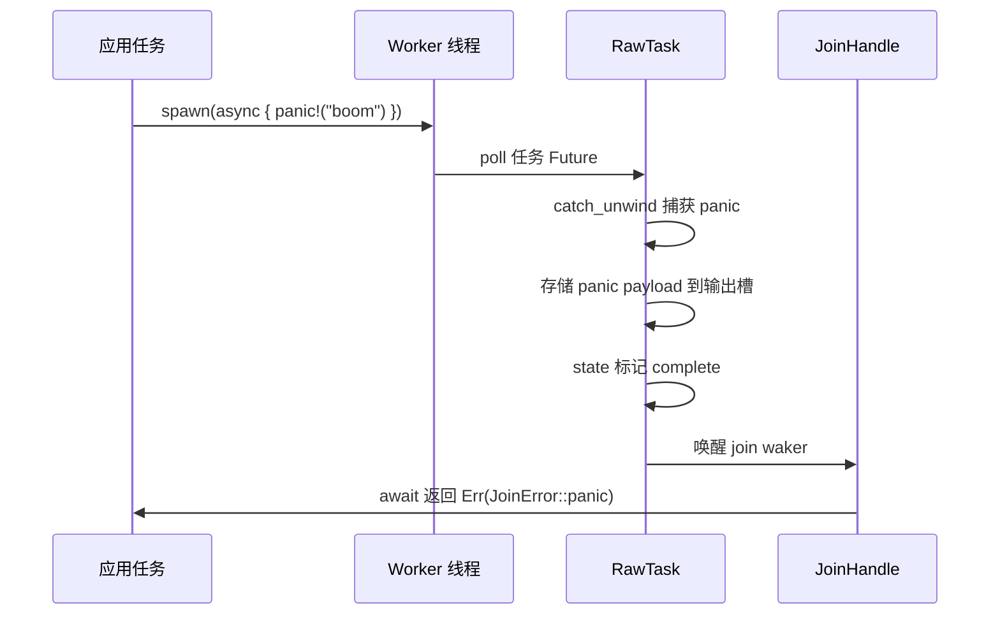
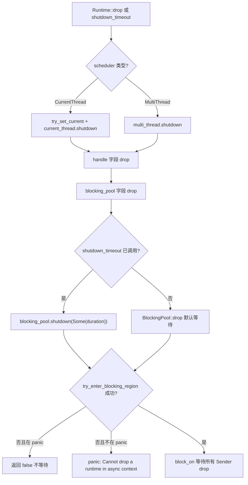
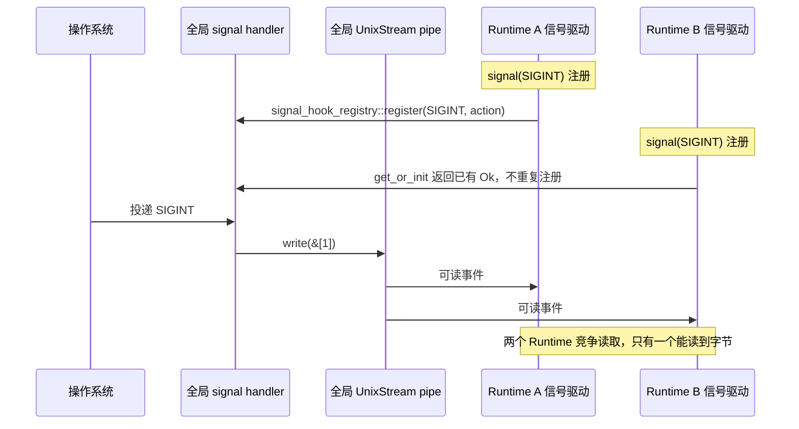

# 次章：第 13 章 →

前章では coop 協調予算を分解しました。各タスクは1回のスケジューリングサイクル内で限られた予算しか持たず、使い切ると必ず譲渡しなければならず、それによって単一タスクが他のタスクを飢えさせることを防ぎます。しかし予算メカニズムは「公平なスケジューリング」問題を解決するだけであり、実際の本番環境にはさらに隠れた罠のカテゴリがあります——キャンセル安全性、panic 伝播、シャットダウン順序です。select! が Future をキャンセルするとき、タスクの panic が捕捉されるとき、Runtime がシャットダウンを開始するとき、コードの境界動作はしばしば直感に反します。本章ではキャンセル安全性から切り込み、まず drop された Future が一体何を失うのかを見ていきます。

# 13.2 panic 伝播：JoinError がクラッシュをどのように捕捉するか

## 直感モデル

Tokio タスクの panic はプロセス全体をクラッシュさせません（panic=abort でない限り）。代わりに捕捉され、`JoinError`にパッケージされ、`JoinHandle::await`を通じて返されます。これは工場の生産ラインでとある作業ステーションが事故を起こしたようなものです。安全ネットが作業員を受け止めますが、製品は廃棄されます——あなたが手にするのは「事故報告書」であり、製品ではありません。

## データ構造と状態

`JoinHandle<T>`の`Future::Output`は`super::Result<T>`です。つまり`Result<T, JoinError>` [FACT:tokio/src/runtime/task/join.rs:325]。`JoinError`には panic と cancelled の2つの形態があります。ドキュメントの例は panic シナリオを示しています：

```rust
let join_handle = tokio::spawn(async { panic!("boom"); });
let err = join_handle.await.unwrap_err();
assert!(err.is_panic());
```

[FACT:tokio/src/runtime/task/join.rs:121-127]

panic が捕捉されるメカニズムは`RawTask`の poll パスにあります：タスク poll 時に`catch_unwind`でラップし、panic 発生後に payload をタスクの出力スロットに保存し、状態を complete にマークしてから join waker を起こします。`JoinHandle::poll`を通じて`try_read_output`で読み取られるのは`Err(JoinError::panic(payload))`。

## シナリオ駆動の Walkthrough：panic 伝播チェーン



重要な点：panic の payload は完全に保持され、`JoinError`は`std::error::Error`を実装しており、`into_panic()`を通じて`Box<dyn Any + Send>`を取り出し、さらに`downcast_ref::<&str>()`で panic メッセージを抽出できます。

## 設計上の考察と落とし穴

**落とし穴 1：`JoinHandle`の`UnwindSafe`は手動で実装されています。**

```rust
impl UnwindSafe for JoinHandle {}
impl RefUnwindSafe for JoinHandle {}
```

[FACT:tokio/src/runtime/task/join.rs:176-181]

これは無条件実装であり、`T: UnwindSafe`を要求しません。理由：`JoinHandle`自体は`T`，`T`を保持しません。ヒープ上のタスク割り当て内で、panic 時にはすでに`catch_unwind`によって隔離されています。したがって`T`が`UnwindSafe`，`JoinHandle`でなくても安全です。

**落とし穴 2：panic は親タスクに自動伝播しません。**タスク A がタスク B を spawn し、B が panic した場合、A が B の`JoinHandle`を await しない限り、A は自動的に通知を受け取りません。A が await しなければ、B の panic は静かに飲み込まれます。これは本番環境で最も隠れたバグ源の一つです。

**落とし穴 3：`spawn_blocking`の panic も同様に捕捉されます。**ブロッキングスレッドプールの worker も`catch_unwind`でタスクをラップし、panic 後もスレッドは死なず、プールに戻って作業を続けます。しかしブロッキングタスク内で`Mutex`を保持し、panic 時に解放しなければ、ロックポイズニングを引き起こします——これは`std::sync::Mutex`の固有の動作であり、Tokio は介入しません。

**落とし穴 4：Runtime drop 時の panic。**Runtime drop プロセス中にタスクが panic した場合、`catch_unwind`は依然として有効ですが、この時点で join waker がすでに無効になっている可能性があり、panic payload は破棄されます。これはシャットダウン順序問題のサブセットであり、次節で展開します。

# 13.3 シャットダウン順序：ブロッキングスレッドと I/O リソースのクリーンアップ

## 直感モデル

Runtime のシャットダウンはレストランの閉店のようなものです：まずフロントが客の受け入れを停止し（新規タスクの受付停止）、次にキッチンが手元の料理を完成させるのを待ち（非同期タスクが次の yield ポイントまで実行）、最後に外注のヘルパーが作業を終えるのを待ちます（ブロッキングスレッドの復帰）。順序を間違えると問題が発生します——例えば先にヘルパーを追い出すと、キッチンの料理は永遠に完成しません。

## データ構造とシャットダウンパス

`Runtime`の3つのフィールドがシャットダウン順序を決定します：

```rust
pub struct Runtime {
    scheduler: Scheduler,
    handle: Handle,
    blocking_pool: BlockingPool,
}
```

[FACT:tokio/src/runtime/runtime.rs:97-106]

`Drop`実装：

```rust
impl Drop for Runtime {
    fn drop(&mut self) {
        match &mut self.scheduler {
            Scheduler::CurrentThread(current_thread) => {
                let _guard = context::try_set_current(&self.handle.inner);
                current_thread.shutdown(&self.handle.inner);
            }
            Scheduler::MultiThread(multi_thread) => {
                multi_thread.shutdown(&self.handle.inner);
            }
        }
    }
}
```

[FACT:tokio/src/runtime/runtime.rs:506-521]

注意：`Drop`は`scheduler`，**のみを処理し、`blocking_pool`**。`blocking_pool`を明示的に処理しません。`Drop`のシャットダウンはそれ自身の`Runtime::drop`内で発生し、`scheduler` → `handle` → `blocking_pool`の復帰後にフィールドの drop 順序によってトリガーされます。フィールドの drop 順序は宣言順です：

。したがってブロッキングプールは最後にシャットダウンされます。`shutdown_timeout`しかし

```rust
pub fn shutdown_timeout(mut self, duration: Duration) {
    self.handle.inner.shutdown();
    self.blocking_pool.shutdown(Some(duration));
}
```

[FACT:tokio/src/runtime/runtime.rs:457-461]

コピー`handle.inner.shutdown()`まず`blocking_pool.shutdown(Some(duration))`でスケジューラと I/O ドライバに停止を通知し、次に`duration`。

## でブロッキングタスクを待機し、最大で

`blocking/shutdown.rs`ブロッキングプールシャットダウンの低レベルメカニズム

```rust
pub(super) struct Sender {
    _tx: Arc>,
}

pub(super) struct Receiver {
    rx: oneshot::Receiver,
}
```

[FACT:tokio/src/runtime/blocking/shutdown.rs:13-19]

コピー`Sender`各ブロッキング worker は`Arc<oneshot::Sender>`のクローンを保持します（内部は`Sender`）。すべての worker が終了し、すべての`Receiver`が drop されると、`wait`が通知を受け取ります。

```rust
pub(crate) fn wait(&mut self, timeout: Option) -> bool {
    use crate::runtime::context::try_enter_blocking_region;

    if timeout == Some(Duration::from_nanos(0)) {
        return false;
    }

    let mut e = match try_enter_blocking_region() {
        Some(enter) => enter,
        _ => {
            if std::thread::panicking() {
                return false;
            } else {
                panic!(
                    "Cannot drop a runtime in a context where blocking is not allowed. \
                    This happens when a runtime is dropped from within an asynchronous context."
                );
            }
        }
    };

    if let Some(timeout) = timeout {
        e.block_on_timeout(&mut self.rx, timeout).is_ok()
    } else {
        let _ = e.block_on(&mut self.rx);
        true
    }
}
```

[FACT:tokio/src/runtime/blocking/shutdown.rs:37-70]

コピー

1. `timeout == Some(0)`段階的に解析：`shutdown_background`は直接 false を返します——これは

2. `try_enter_blocking_region()`のパスであり、待機しません。`None`。

ブロッキング領域への進入を試みます。現在非同期コンテキスト内にある場合（例えば async タスク内で Runtime を drop する場合）、

を返します。`block_on_timeout`3. 進入失敗時、panic 中であれば false を返します（panic 中にさらに panic しない）；そうでなければ panic し、明確なエラーメッセージを出します。

## 4. timeout がある場合は



## シャットダウン順序の完全なフロー

**コピー**エラーメッセージは明確です：「Cannot drop a runtime in a context where blocking is not allowed」[FACT:tokio/src/runtime/blocking/shutdown.rs:51-54]。解決策は`shutdown_background()`を使うことで、これは`shutdown_timeout(Duration::from_nanos(0))` [FACT:tokio/src/runtime/runtime.rs:494-496]と等価であり、ブロッキングタスクを待機しません。

**落とし穴 2：`shutdown_background`はブロッキングタスクをリークします。**ドキュメントは明確に警告しています「this may result in a resource leak (in that any blocking tasks are still running until they return)」[FACT:tokio/src/runtime/runtime.rs:470-472]。ブロッキングタスクは自然に戻るまで実行され続けますが、Runtime はすでに drop されているため、それらが保持するリソースはすでに無効になっている可能性があります。

**落とし穴 3：I/O リソースは Runtime drop 後に無効になります。**ドキュメントは説明しています「Once the runtime has been dropped, any outstanding I/O resources bound to it will no longer function」[FACT:tokio/src/runtime/runtime.rs:52-54]。`is_rt_shutdown_err`関数はこのようなエラーを検出するために使用されます[FACT:tokio/src/runtime/runtime.rs:585-593]。

**落とし穴 4：`Drop`はデフォルトで無限に待機します。**ドキュメントは指摘しています「The`Drop` implementation waits forever for this」[FACT:tokio/src/runtime/runtime.rs:43-44]。ブロッキングタスクがスタックした場合（例えば無限ループ）、drop Runtime は永久にハングします。本番環境では`shutdown_timeout`で上限を設定すべきです。

# 13.4 シグナル処理とマルチ Runtime の競合

## 直感的モデル

Unix シグナルはプロセスレベルですが、Tokio の`Signal`は Runtime にバインドされています。これは建物全体で一つの火災警報ベルを共有しているのに、各部屋が独立した受信機を設置しているようなものです——最初に受信機を設置した人がベルの配線方法を変え、後から来た人はその変更を共有するしかありません。

## データ構造とグローバル状態

`signal_enable`はシグナルハンドラを登録するエントリポイントです：

```rust
fn signal_enable(signal: SignalKind, handle: &Handle) -> io::Result {
    let signal = signal.0;
    if signal  slot,
        None => return Err(io::Error::other("signal too large")),
    };

    siginfo
        .init
        .get_or_init(|| {
            unsafe { signal_hook_registry::register(signal, move || action(globals, signal)) }
                .map(|_| ())
                .map_err(|e| e.raw_os_error())
        })
        .map_err(|e| {
            e.map_or_else(
                || Error::other("registering signal handler failed"),
                || Error::from_raw_os_error,
            )
        })
}
```

[FACT:tokio/src/signal/unix.rs:266-296]

重要なポイント：

1. `signal <= 0 || FORBIDDEN.contains(&signal)`は不正なシグナルを拒否します。

2. `handle.check_inner()`はシグナルドライバが実行中かどうかをチェックします——Runtime が閉じられている場合、ここで失敗します。

3. `siginfo.init.get_or_init(...)`は`OnceLock`を使用して、各シグナルが一度だけ OS handler を登録することを保証します。`get_or_init`のクロージャは`signal_hook_registry::register`を呼び出します。これはグローバルでプロセスレベルの登録です。

4. 登録された handler は`action(globals, signal)`で、二つのことを行います：`globals.record_event(signal)`イベントを記録し、次に pipe に 1 バイト書き込んでドライバを起動します[FACT:tokio/src/signal/unix.rs:252-259]。

## マルチ Runtime 競合の根源

`globals()`が返すのはプロセスレベルのグローバルな`Globals`，`OsExtraData`内の`UnixStream`ペアもグローバルです：

```rust
pub(crate) struct OsExtraData {
    sender: UnixStream,
    pub(crate) receiver: UnixStream,
}
```

[FACT:tokio/src/signal/unix.rs:61-64]

`Default`の実装は`UnixStream` [FACT:tokio/src/signal/unix.rs:61-64]のペアを作成します。この pipe はグローバルに唯一であり、すべての Runtime のシグナルドライバがそれを共有します。

問題が発生します：`signal_enable`内の`handle.check_inner()`がチェックするのは**現在の Runtime**のシグナルドライバです。しかし`signal_hook_registry::register`が登録する handler は**プロセスレベル**であり、書き込む先は**グローバル**pipe です。Runtime A が先に SIGINT を登録し、その後 Runtime B も SIGINT を登録した場合、`get_or_init`は既存の`Ok(())`を直接返し、重複登録しません。しかし Runtime B のシグナルドライバはグローバル pipe からデータを読み取ります——二つの Runtime が同じ pipe のバイトを競合します。

## シナリオ駆動の Walkthrough：マルチ Runtime シグナル競合



## 設計上の考察と落とし穴

**落とし穴 1：シグナルハンドラは決してアンロードされません。**ドキュメントは明確に警告しています「Once a signal handler is registered with the process the underlying libc signal handler is never unregistered」[FACT:tokio/src/signal/unix.rs:379-380]。たとえ`Signal`インスタンスが drop されても、後続のシグナルは依然として Tokio に捕捉され、デフォルトの動作は復元されません[FACT:tokio/src/signal/unix.rs:338-340]。

**落とし穴 2：シグナルは合併されます。**ドキュメントは説明しています「before`poll` is called, all signal notifications are coalesced into one item returned from `poll`」[FACT:tokio/src/signal/unix.rs:312-315]。10 個の SIGINT を受信しても 1 回しか poll しなかった場合、1 つのイベントしか見えません。これは Unix シグナル自体の特性です（標準シグナルはキューに入らない）。Tokio は追加の合併を行いません。

**落とし穴 3：マルチ Runtime 下でシグナルが失われる可能性があります。**グローバル pipe が複数の Runtime によって競合して読み取られるため、ある Runtime がバイトを読み取り、別の Runtime が永遠に待つ可能性があります。本番環境では一つの Runtime でのみシグナルを処理するか、`signal_hook`で自分で管理すべきです。

**落とし穴 4：`signal`関数の panic 条件。**ドキュメントは説明しています「This function panics if there is no current reactor set, or if the`rt` feature flag is not enabled」[FACT:tokio/src/signal/unix.rs:398-405]。Runtime 外で`signal()`を呼び出すと panic します。

**落とし穴 5：`recv()`のキャンセル安全性。**ドキュメントは保証しています「This method is cancel safe. If you use it as a branch in`tokio::select!` and another branch completes first, then it is guaranteed that no signal is lost」[FACT:tokio/src/signal/unix.rs:423-427]。これはシグナルイベントがグローバルな`EventInfo`に存在し、`recv()`は読み取るだけで、基盤となる状態を消費しないためです。

# 設計上の考察

本章の三つのテーマは一つの基盤パターンを共有しています：**状態の所有権がキャンセル/クローズ/シグナルの安全性を決定します**。

- `JoinHandle`はキャンセル安全です。なぜなら出力はヒープ上にあり、handle は単なる参照だからです。
- Runtime のクローズ順序は敏感です。なぜならブロッキングプールとスケジューラが共有しているからです`Handle`、順序を間違えるとデッドロックやpanicが発生します。
- シグナルはマルチRuntimeで競合します。なぜならhandlerとpipeはプロセスレベルのグローバル状態であり、`Signal`はRuntimeレベルのビューだからです。

このパターンを理解すれば、落とし穴回避リストは三つの原則にまとめられます：

1. **キャンセル安全 = 状態がFutureの外部にある。**Futureの内部にバッファがあると、dropでデータが失われます。`JoinHandle`、`Signal::recv`、`tokio::sync::mpsc::Receiver::recv`はすべてこの条件を満たしています。

2. **シャットダウン順序 = 依存方向の逆順。**誰が誰に依存していても、依存される側を先に閉じます。スケジューラはI/Oドライバに依存しているので、スケジューラを先に閉じます。ブロッキングプールは独立しているので、最後に閉じます。

3. **グローバル状態 = マルチインスタンスの競合。**プロセスレベルのリソース（シグナルhandler、pipe、ファイルディスクリプタテーブル）はマルチRuntime下で必ず競合します。単一Runtimeに制限するか、外部同期を使用する必要があります。

# 本章のまとめ

# 本章の考察とセルフチェック

Q1：もし`JoinHandle::poll`の`coop::poll_proceed(cx)`を削除した場合、どのようなシナリオで他のタスクが餓死するでしょうか？なぜ`try_read_output`自体は予算を消費しないのでしょうか？

**参考解説**：`coop::poll_proceed(cx)`は[FACT:tokio/src/runtime/task/join.rs:325-325]で協調予算を消費します。もし削除すると、ループ内で繰り返し`select!`複数の`JoinHandle`を行うタスクが、一回のスケジューリングサイクル内で全てのhandleを無限にポーリングし、`Pending`を永遠に返さなくなり、同じworker上の他のタスクを餓死させます。`try_read_output`自体は予算を消費しません。なぜなら、それは単なるメモリ読み取り＋場合によってはwakerの保存であり、I/Oやロック競合を伴わず、オーバーヘッドが極めて小さいからです。予算メカニズムの設計意図は「長時間実行される可能性のある操作」を制約することであり、毎回のpollで課金することではありません。注意すべきは`coop.made_progress()`が`ret.is_ready()`の時にのみ[FACT:tokio/src/runtime/task/join.rs:349-351]を呼び出す点です。つまり、実際に出力を取得した時のみ予算を返却します——これは「ポーリングしたが結果がない」操作が予算を累積消費するのを防ぐためです。

Q2：`blocking/shutdown.rs`の`wait`メソッドにおいて、もし`try_enter_blocking_region()`が`None`を返し、かつ現在panic中である場合、なぜ待機を続けるのではなく`false`を返すことを選ぶのでしょうか？待機を続けるように変更すると何が起こるでしょうか？

**参考解説**：`try_enter_blocking_region()`が`None`を返すのは、現在非同期コンテキストにあり、[FACT:tokio/src/runtime/blocking/shutdown.rs:44-57]のブロッキングが許可されていないことを示します。もしこの時panic中であれば、コードは`false`を返し[FACT:tokio/src/runtime/blocking/shutdown.rs:47-49]を待機しません。理由は：panic展開中に再度panicするとプロセスがabort（double panic）するからです。もし待機を続けるように変更すると、`block_on`を呼び出す必要がありますが、非同期コンテキストでは`block_on`がpanicを起こします——panic展開中のpanicはプロセスを直接abortし、全ての診断情報を失います。`false`を返すことでdropが完了を続け、panic情報が保持されます。これは「優雅なデグレード」の設計です：不完全なシャットダウンもプロセスクラッシュよりはマシです。

Q3：Runtime Aで`Signal`を作成してSIGTERMを監視し、その後`Signal`をRuntime Bに移動してpollするとします。`signal_enable`内の`handle.check_inner()`はどのRuntimeをチェックするでしょうか？もしRuntime Aが先にdropされた場合、Runtime Bの`Signal`はまだシグナルを受信できるでしょうか？

**参考解説**：`signal_enable`は`signal()`呼び出し時に実行され、この時`handle`はRuntime Aの[FACT:tokio/src/signal/unix.rs:398-405]。`check_inner()`です。[FACT:tokio/src/signal/unix.rs:275]。`Signal`がチェックするのはRuntime Aのシグナルドライバです。`RxFuture`の内部は`watch::Receiver<()>` [FACT:tokio/src/signal/unix.rs:366-368]であり、ラップしているのは`Globals`です。このreceiverはグローバル`EventInfo`の`record_event`に登録されています。もしRuntime Aがdropされると、そのシグナルドライバはグローバルpipeからのデータ読み取りを停止しますが、グローバルhandlerは依然として`EventInfo`してpipeに書き込みます。Runtime Bのシグナルドライバも実行中であれば、pipeデータを読み取り`Signal`をトリガーし、`Signal` **のwakerを起床させます。したがってRuntime Bの**はおそらく`Signal`まだシグナルを受信できますが、Runtime Bにシグナルドライバが実行中かどうかに依存します。もしRuntime Bにシグナルドライバがなければ（例えばsignal featureが有効でない、またはドライバが閉じられている）、pipeデータを読む者がおらず、

# は永遠に起床を待つことになります。これがマルチRuntimeシグナル処理の脆弱性です。

章末の橋渡し`catch_unwind`キャンセル安全、panic伝播、シャットダウン順序、シグナル競合——これら四つの問題の共通の根源は「状態の所有権」が非同期境界上で曖昧であることです。Tokioは状態をヒープに置き、参照カウントでライフサイクルを管理し、`Globals`でpanicを隔離し、グローバル

でシグナル状態を共有することで、エンジニアリング上使用可能な答えを提示しています。しかしこれらの答えにはすべて境界条件があり、本番環境では明示的に処理する必要があります。

ここまでで、私たちはTokioの本番環境で最もつまずきやすい境界地帯を歩き切った。キャンセル安全が依存する出力がヒープ上に保存されること、try_read_outputの原子性、JoinHandle::dropはタスクをキャンセルせず、abortだけが実際にキャンセルするがspawn_blockingには無効であること、panicがcatch_unwindに捕捉された後にJoinErrorとしてパッケージ化され、awaitしなければ静かに失われること、Runtimeのシャットダウンには厳密な順序があり、asyncコンテキストでdropするとpanicすること、シグナルハンドラはプロセスレベルのグローバル状態であり、登録後は決してアンロードされないこと。これらのルールの背後には、Tokioが正確性と性能の間で繰り返してきたトレードオフがある。次の章では、具体的なメカニズムから離れ、アーキテクチャの高みに立ってこれらのトレードオフの由来を振り返り、io_uring、ドライバの再構築、カスタムエグゼキュータインターフェースがTokioをどこへ導くのかを展望する。
