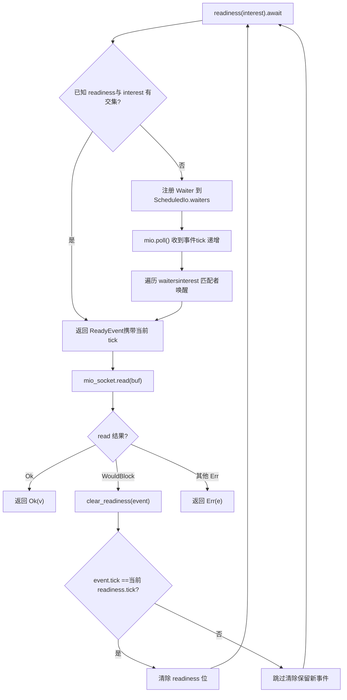
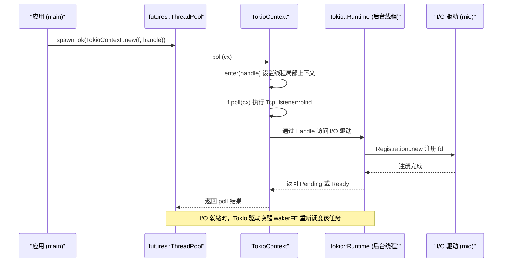

# 第 14 章：アーキテクチャのトレードオフと将来の進化：io_uringからプラガブルドライバまで

前章では、キャンセル安全、panicの伝播、シャットダウン順序、シグナル競合という4種類の本番の落とし穴を整理した。それらは一見ばらばらに見えるが、実はすべて同じアーキテクチャ上の問題を指している。すなわち、状態の所有権が非同期の境界上でいかに明確に分割されるか、である。そして所有権の分割の仕方は、まさにランタイムの最下層にある3つのアーキテクチャ上の決定によって決まる——タスクがどのようにスケジュールされるか、I/Oイベントがどのようにディスパッチされるか、並行性の正確性がどのように検証されるか。本章ではもはや特定の関数の実装詳細に踏み込まず、アーキテクチャの高みに立って、Tokioがこれらの決定においてどのような取捨選択をしてきたかを振り返り、公式ドキュメントとソースコードにすでに埋め込まれている進化の手がかりに沿って、io_uring、ドライバの再構築、カスタムエグゼキュータインターフェースがTokioをどこへ導くのかを見ていく。本章を読み終えれば、あなたは一つの実践的な問いに答えられるはずだ。いつTokioを拡張すべきか、いつそれを回避すべきか。

# 一、三つの歴史的トレードオフ：なぜ今の姿なのか

## 直感モデル

Tokioを、すでに10年営業しているレストランだと想像してほしい。厨房のシフトの組み方（work-stealing）、配膳係の独立した編成（I/Oドライバとスケジューラの分離）、そして厨房の衛生検査制度（loomによる並行性検証）は、いずれも開業初日に設計されたものではなく、「客が増え、料理が複雑になる」過程で徐々に進化してきたものである。これらの進化を理解してこそ、どの設計が先を見据えた布石で、どの設計が歴史的な負債なのかを判断できる。

## トレードオフ一：グローバルキューではなくwork-stealing

> **[Design Inference & Architectural Trade-offs]**
> グローバルキューの実装は最も単純である。すべてのタスクが一つの`Mutex<VecDeque>`に入り、workerスレッドがロックを奪い合ってタスクを取る。しかしロック競合はコア数の増加とともに悪化し、キャッシュ局所性も悪い——タスクがどのコアで生成され、どのコアで実行されるかは完全にランダムである。

work-stealingの取捨選択はこうである。各workerがローカルキューを持ち、`spawn`時には優先的にローカルキューに入れる（ロックフリー、キャッシュフレンドリー）。ローカルが空になって初めて他のworkerのキューの末尾から窃取する。代償は負荷分散に遅延があり、窃取自体にアトミック操作とメモリバリアが必要なことである。Tokioが後者を選んだのは、現代のサーバーが数十コアにもなるため、ロック競合のコストが偶発的な窃取のオーバーヘッドよりもはるかに高いからである。

> **[Design Inference & Architectural Trade-offs]**
> この決定の境界条件は、**タスクの粒度が細かすぎてはならない**ことである。もし各タスクが数マイクロ秒の仕事しかしないなら、窃取とスケジューリングのオーバーヘッドの割合が制御不能になる。これが、Tokioが`spawn_blocking`之外，还要求长任务主动`yield_now()`——協調的スケジューリングは本質的にwork-stealingを下支えしているのである。

## トレードオフ二：I/Oドライバがスケジューラから独立

これは本章のソースコード資料の中で最も味わい深い箇所である。`tokio/src/runtime/io/mod.rs`のモジュール構造を見てみよう。

[FACT:tokio/src/runtime/io/mod.rs:5-22]

```rust
mod driver;
use driver::{Direction, Tick};
pub(crate) use driver::{Driver, Handle, ReadyEvent};

mod registration;
pub(crate) use registration::Registration;

mod registration_set;
use registration_set::RegistrationSet;

mod scheduled_io;
use scheduled_io::ScheduledIo;

mod metrics;
use metrics::IoDriverMetrics;

use crate::util::ptr_expose::PtrExposeDomain;
static EXPOSE_IO: PtrExposeDomain = PtrExposeDomain::new();
```

注意すべきは`driver`、`registration`、`scheduled_io`が三つの独立したモジュールであり、外部には`Driver`、`Handle`、`ReadyEvent`、`Registration`这几个类型。这几个型だけを公開していることである。`ScheduledIo`は`pub(crate)`の——それは`PtrExposeDomain`に包まれ、loomテスト下で生ポインタを並行性検査に晒すために使われる。

> **[Design Inference & Architectural Trade-offs]**
> なぜI/Oドライバはスケジューラに直接組み込まれないのか。それは両者のライフサイクルと並行性モデルが異なるからである。スケジューラが関心を持つのは「どのタスクが走るべきか」であり、I/Oドライバが関心を持つのは「どのfdが準備完了か」である。もし結合すれば、スケジューリング戦略を調整するたびにI/Oパスを触ることになり、逆もまた然りである。さらに重要なのは、`block_on`シングルスレッドランタイムもI/Oドライバを必要とするが、work-stealingスケジューラは必要としない——分離によって二つのランタイムが同じI/O実装を再利用できるのである。

## トレードオフ三：loomによる並行性モデルの検証

`tokio/src/loom/mod.rs`はわずか14行だが、Tokioの並行性の正確性の検証戦略を明らかにしている。

[FACT:tokio/src/loom/mod.rs:1-14]

```rust
//! This module abstracts over `loom` and `std::sync` depending on whether we
//! are running tests or not.

#![allow(unused)]

#[cfg(not(all(test, loom)))]
mod std;
#[cfg(not(all(test, loom)))]
pub(crate) use self::std::*;

#[cfg(all(test, loom))]
mod mocked;
#[cfg(all(test, loom))]
pub(crate) use self::mocked::*;
```

鍵は`#[cfg(all(test, loom))]`という条件にある。`test`と`loom`の二つのcfgを同時に有効にした時だけ、`mocked`モジュールで`std`を置き換える。これは、本番ビルドにはloomのコードがまったく存在せず、ランタイムオーバーヘッドがゼロであることを意味する。

> **[Design Inference & Architectural Trade-offs]**
> loomの価値は、「スレッドのインターリーブのすべての可能な順序」を網羅的に列挙できることにある。`ScheduledIo`の中の`AtomicUsize`の読み書き、`Waiters`連結リストの挿入と削除は、実際のハードウェアでは100万回実行してもエラーが出ないかもしれないが、loomは数秒で競合状態を引き起こすインターリーブを構築できる。代償としてテストの実行が遅く、メモリ使用量が高いため、ユニットテストにのみ使用でき、本番環境には投入できない。

## 設計上の考察

これら3つのトレードオフには共通の特徴がある：**それらはすべて「より複雑だがより拡張可能」な方案を選択し、複雑さを内部に限定している**。work-stealingの複雑さはスケジューラに隠され、I/O駆動の複雑さは`ScheduledIo`に隠され、loomの複雑さはcfg条件に隠されている。外部に公開されるAPIは常に`spawn`、`TcpStream::read`これらのシンプルなインターフェースである。

> **[Design Inference & Architectural Trade-offs]**
> これもまた「いつTokioを拡張すべきか」を判断する第一の基準である：**もしあなたの要件が既存のAPIで表現できるなら、内部構造に触れてはならない**。一度`pub(crate)`の型や`tokio_unstable`のcfgに依存し始めたら、それは自分をTokioの内部実装に縛り付けたことを意味し、アップグレード時に代償を払うことになる。

---

# 二、ドライバのリファクタリング：「1つのwakerに1つの方向」から「任意の関心セット」へ

## 直感的モデル

初期のTokio I/O型には厳しい制限があった：`async fn read(&mut self)`には`&mut self`が必要である。これはレストランに1つの受け取り窓口しかなく、同時に1人しか並べないようなものである——wakerが操作に対応するFutureではなく、I/Oリソースの内部に保存されていたからだ。`tokio/docs/reactor-refactor.md`はこの制限の原因とリファクタリング方案を完全に記録している。

## 旧アーキテクチャの痛点

ドキュメントは冒頭で問題を指摘している：

[FACT:tokio/docs/reactor-refactor.md:16-20]

```rust
Currently, I/O types require `&mut self` for `async` functions. The reason for
this is the task's waker is stored in the I/O resource's internal state
(`ScheduledIo`) instead of in the future returned by the `async` function.
Because of this limitation, I/O types limit the number of wakers to one per
direction (a direction is either read-related events or write-related events).
```

> **[Design Inference & Architectural Trade-offs]**
> wakerをリソース内部に保存することは、「1つの方向に1つの待機者しか持てない」ことを意味する。もし同じ`TcpStream`を同時に読み書きしたいなら、`split()`を2つに分割し、それぞれが独立したwakerスロットを持つ必要がある。これが`TcpStream::split()`が存在する理由である——それはAPI設計の好みではなく、内部データ構造の直接的な制約なのだ。

## 新アーキテクチャ：wakerをFuture内に移動する

リファクタリングの核心的な考え方は「wakerをリソース状態から操作Future内に移動する」ことであり、これにより各操作が複数のwakerを登録できるようになる：

[FACT:tokio/docs/reactor-refactor.md:22-25]

```rust
Moving the waker from the internal I/O resource's state to the operation's
future enables multiple wakers to be registered per operation. The "intrusive
wake list" strategy used by `Notify` applies to this case, though there are some
concerns unique to the I/O driver.
```

新しい`ScheduledIo`構造は以下の通り：

[FACT:tokio/docs/reactor-refactor.md:97-134]

```rust
#[derive(Debug)]
pub(crate) struct ScheduledIo {
    /// Resource's known state packed with other state that must be
    /// atomically updated.
    readiness: AtomicUsize,

    /// Tracks tasks waiting on the resource
    waiters: Mutex,
}

#[derive(Debug)]
struct Waiters {
    // List of intrusive waiters.
    list: LinkedList,

    /// Waiter used by `AsyncRead` implementations.
    reader: Option,

    /// Waiter used by `AsyncWrite` implementations.
    writer: Option,
}

// This struct is contained by the **future** returned by `readiness()`.
#[derive(Debug)]
struct Waiter {
    /// Intrusive linked-list pointers
    pointers: linked_list::Pointers,

    /// Waker for task waiting on I/O resource
    waiter: Option,

    /// Readiness events being waited on. This is
    /// the value passed to `readiness()`
    interest: mio::Ready,

    /// Should not be `Unpin`.
    _p: PhantomPinned,
}
```

ここには展開する価値のある巧妙な設計点がいくつかある：

**第一に、`readiness`は`AtomicUsize`，`waiters`は`Mutex<Waiters>`。**なぜ両方を1つのロックで保護しないのか？なぜなら`readiness`の読み取り操作は極めて頻繁であり（毎回の`readiness()`呼び出しでチェックが必要）、書き込み操作はmioイベントを受信した時にのみ発生するからである。アトミック変数を使って読み取りパスをロックフリーにするのは、典型的な読み書き分離の最適化である。

**第二に、`Waiter`は侵入型連結リストのノードである。** `pointers: linked_list::Pointers<Waiter>`により`Waiter`自体が連結リストの一部となり、追加のノード割り当てが不要になる。`_p: PhantomPinned`はそれが`Unpin`不可であることを明確にマークしている——侵入型連結リストのノードアドレスは一度移動すると、連結リストが切れてしまうからである。

**第三に、`reader`と`writer`の2つの`Option<Waker>`は`AsyncRead`/`AsyncWrite`のためにある。**ドキュメントはその理由を説明している：

[FACT:tokio/docs/reactor-refactor.md:210-213]

```rust
The `AsyncRead` and `AsyncWrite` traits use a "poll" based API. This means that
it is not possible to use an intrusive linked list to track the waker.
Additionally, there is no future associated with the operation which means it is
not possible to cancel interest in the readiness events.
```

> **[Design Inference & Architectural Trade-offs]**
> これは新旧2つのメカニズムの妥協的な共存である：`async fn`パスは侵入型連結リストを使用し（複数の待機者をサポート、キャンセル可能）、`poll`パスは固定スロットを使用する（キャンセル非サポート、ただしtraitと互換）。この「2つのメカニズムの並存」は漸進的リファクタリングの典型的な代償である。

## 競合状態とtickメカニズム

リファクタリングで最も厄介な問題は競合である。ドキュメントは具体的なデッドロックシナリオを示している：

[FACT:tokio/docs/reactor-refactor.md:175-175]

```rust
If care is not taken, if between `mio_socket.read(buf)` returning and
`clear_readiness(event)` is called, a readiness event arrives, the `read()`
function could deadlock. This happens because the readiness event is received,
`clear_readiness()` unsets the readiness event, and on the next iteration,
`readiness().await` will block forever as a new readiness event is not received.
```

解決策はtickメカニズムを導入し、`readiness`この`AtomicUsize`を複数のビットセグメントに分割することである：

[FACT:tokio/docs/reactor-refactor.md:199-199]

```
| shutdown | generation |  driver tick | readiness |
|----------+------------+--------------+-----------|
|   1 bit  |   7 bits   +    8 bits    +  16 bits  |
```

> **[Design Inference & Architectural Trade-offs]**
> このビットセグメントのレイアウトは「空間と引き換えに正確性を得る」古典的な事例である。`tick`は毎回`mio::poll()`インクリメントされ、`ReadyEvent`は読み取り時のtickを保持する。`clear_readiness()`はtickが一致する時のみレディ状態をクリアする——もしtickが一致しなければ、その間に新しいイベントが到着したことを意味し、クリアしてはならない。これにより「クリア」と「新イベント到着」の競合を1つのアトミックな読み取り・変更・書き込みに解消している。

以下のフローチャートは`readiness()`と`clear_readiness()`の間の決定パスを描写している：



この図の重要な分岐は`tick_match`にある：もしtickが一致しなければ、`clear_readiness`はクリアを断念しなければならない。そうでなければ到着したばかりのイベントを失い、次のラウンドの`readiness()`が永久にブロックされる。

## 関心のキャンセルとメモリリーク

侵入型連結リストは新たな問題をもたらす：もし`readiness()`が返すFutureが早期にdropされた場合、連結リストノードを摘除しなければならない。ドキュメントは明確に警告している：

[FACT:tokio/docs/reactor-refactor.md:144-148]

```rust
The future returned by `readiness()` uses an intrusive linked list to store the
waker with `ScheduledIo`. Because `readiness()` can be called concurrently, many
wakers may be stored simultaneously in the list. If the `readiness()` future is
dropped early, it is essential that the waker is removed from the list. This
prevents leaking memory.
```

> **[Design Inference & Architectural Trade-offs]**
> これはまさに前章の「キャンセル安全性」がI/O層で具現化したものである。`readiness()`のFutureは`Drop`実装内で自分自身を連結リストから摘除しなければならない。そうでなければノードは永久に`ScheduledIo`に残り、メモリをリークするだけでなく、次にイベントが到着した時に誤って起床させられる。

## 設計上の考察と本番環境の落とし穴

**なぜ`Vec<Waker>`を使わずに侵入型連結リストを使うのか？**ドキュメントは`&Resource`実装を議論する際に答えを与えている：

[FACT:tokio/docs/reactor-refactor.md:228-233]

```rust
It is only possible to implement `AsyncRead` and `AsyncWrite` for resource types
themselves and not for `&Resource`. Implementing the traits for `&Resource`
would permit concurrent operations to the resource. Because only a single waker
is stored per direction, any concurrent usage would result in deadlocks. An
alternate implementation would call for a `Vec` but this would result in
memory leaks.
```

> **[Design Inference & Architectural Trade-offs]**
> `Vec<Waker>`の問題点は：Futureがdropされた後、対応するwakerがVec内に残り、位置を特定して削除できず、次にイベントが到着した時に初めて「このwakerはすでに無効である」と発見できることである。侵入型連結リストではノードアドレスがFuture内部フィールドのアドレスそのものになるため、drop時に正確に摘除できる。

**本番環境の落とし穴**：`TcpStream::by_ref()`が返す`TcpStreamRef`は`read_waiter`と`write_waiter`の2つのノードを保持する：

[FACT:tokio/docs/reactor-refactor.md:238-244]

```rust
struct TcpStreamRef {
    stream: &'a TcpStream,

    // `Waiter` is the node in the intrusive waiter linked-list
    read_waiter: Waiter,
    write_waiter: Waiter,
}
```

> **[Design Inference & Architectural Trade-offs]**
> これは`TcpStreamRef`が一度dropされると、2つのwaiterノードが同時に無効になることを意味する。もし`select!`内で`by_ref()`の参照を分岐をまたいで共有するなら、ライフタイムに注意が必要である——`TcpStreamRef`は`TcpStream`より長く生きることはできず、複数の`select!`分岐間で同時に借用されることもできない。

---

# 三、カスタムエグゼキュータ：TokioContextと「Tokioを迂回する」境界

## 直感モデル

Tokioのスケジューラを使わず、そのI/Oとタイマーだけを借りたいことがある。これはレストランで店内飲食せず、テイクアウト窓口だけを使うようなものだ。`examples/custom-executor.rs`この「ハイブリッドモード」を示している：`futures::executor::ThreadPool`でスケジューリングを行い、TokioでI/Oを行う。

## 核心メカニズム：TokioContext

この例全体の鍵は`TokioContext`というラッパー型にある：

[FACT:examples/custom-executor.rs:51-54]

```rust
impl ThreadPool {
    fn spawn(&self, f: impl Future + Send + 'static) {
        let handle = self.rt.handle().clone();
        self.inner.spawn_ok(TokioContext::new(f, handle));
    }
}
```

> **[Design Inference & Architectural Trade-offs]**
> `TokioContext::new(f, handle)`FutureとTokioの`Handle`を結びつける。外部エグゼキュータがこのラップされたFutureをpollすると、`TokioContext`はまずTokioのランタイムコンテキストに入り（スレッドローカルの`Handle`を設定）、次に内部の`f`をpollする。こうして`f`内で`TcpListener::bind`を呼び出すと、TokioのI/Oドライバを見つけられる。

例全体の構造を見てみよう：

[FACT:examples/custom-executor.rs:38-48]

```rust
static EXECUTOR: Lazy = Lazy::new(|| {
    // Spawn tokio runtime on a single background thread
    // enabling IO and timers.
    let rt = tokio::runtime::Builder::new_multi_thread()
        .enable_all()
        .build()
        .unwrap();
    let inner = futures::executor::ThreadPool::builder().create().unwrap();

    ThreadPool { inner, rt }
});
```

> **[Design Inference & Architectural Trade-offs]**
> ここではTokioランタイムが作成されるが、**によって`block_on`駆動されない**——それはただ「存在」し、I/Oドライバとタイマーを提供する。実際のタスクスケジューリングは`futures::executor::ThreadPool`が担当する。このモードでは、Tokioのワーカースレッドは実質的に空回りしており（I/Oイベントを待機）、タスク実行はfuturesのスレッドプールで行われる。

## データフロー：TcpListener::bindのエグゼキュータを跨ぐ旅



このシーケンス図の鍵は：**タスクのpollはfuturesスレッドプールで発生するが、I/Oイベントの待機はTokioバックグラウンドスレッドで発生する**。両者は`Handle`とwakerを通じて接続される。

## 設計上の考察：いつTokioを迂回すべきか

> **[Design Inference & Architectural Trade-offs]**
> この例の存在自体がシグナルである：Tokioのアーキテクチャは「I/Oドライバのみ使用し、スケジューラは使わない」ことを許容する。判断基準は三つにまとめられる：

1. **既存のエグゼキュータエコシステムと統合する必要がある場合**（例えば一部のフレームワークが`futures::executor`を強制する場合）、`TokioContext`を使うのが最小侵襲の解決策である。

2. **スケジューリング戦略を完全に制御する必要がある場合**（例えばリアルタイムシステムが決定論的スケジューリングを要求する場合）、Tokioのwork-stealingは要件を満たさないが、そのI/Oドライバは依然として使用可能である。

3. **単にTokioのAPIが複雑だと感じるだけなら**、迂回すべきではない——`TokioContext`が導入するエグゼキュータを跨ぐ境界は新たなデバッグの難しさをもたらし、割に合わない。

**本番環境での落とし穴**：`TokioContext`モードでは、Tokioランタイムの`block_on`が決して呼び出されない。つまり`Runtime::shutdown`のクリーンアップロジックが自動的にトリガーされない。プログラム終了前に明示的に`Runtime`をdropしなければならない。そうでなければI/Oドライバのバックグラウンドスレッドが優雅にシャットダウンされない可能性がある。

## io_uringとの関係

> **[Design Inference & Architectural Trade-offs]**
> `tokio/src/runtime/io/mod.rs`冒頭のcfg条件がio_uringの接続方法を明かしている：

[FACT:tokio/src/runtime/io/mod.rs:1-4]

```rust
#![cfg_attr(
    not(all(feature = "rt", feature = "net", feature = "io-uring", tokio_unstable)),
    allow(dead_code)
)]
```

`feature = "io-uring"`と`tokio_unstable`が同時に現れることに注意。これはio_uringサポートが現在**実験的**であり、unstableフィーチャーを同時に有効にしないとコンパイルできないことを意味する。`allow(dead_code)`は、これらのフィーチャーが有効でない場合、モジュール内の一部のコードが使用されず、コンパイラが警告を出すことを示している——`allow`で抑制する。

> **[Design Inference & Architectural Trade-offs]**
> io_uringとepollの根本的な違いは：epollは「準備完了通知」、io_uringは「完了通知」である。前者はアプリケーション自身が`read`/`write`システムコールを発行する必要があり、後者はカーネルが直接I/Oを完了して結果を返す。これはTokioの`ScheduledIo`モデルに大きな衝撃を与える——`readiness()`のセマンティクスはio_uringではもはや適用できず、全く新しい「submit-complete」抽象化が必要となる。これがio_uringサポートがなかなかunstableに留まっている理由でもある：単にバックエンドを追加するだけではなく、I/Oドライバの抽象化レイヤー全体を再構築する必要があるからだ。

---

# 本章のまとめ

本章ではアーキテクチャの高みからTokioの三つの核心的トレードオフを振り返り、三つの進化パスを展望した：

**歴史的トレードオフ**：

- work-stealingはスケジューリングの複雑さと引き換えにマルチコア拡張性を得る。境界はタスク粒度が細かすぎてはならないこと；
- I/Oドライバはスケジューラから独立し、`block_on`とマルチスレッドランタイムが同じI/O実装を再利用できるようにする；
- loomはcfg条件を通じて本番ビルドでは完全に消え、テスト時のみスレッドインターリーブを網羅する。

**ドライバの再構築**（`reactor-refactor.md`）：

- wakerを`ScheduledIo`内部から操作Futureへ移動し、侵入型リンクリストで複数の待機者をサポート；
- `AtomicUsize`のビットフィールドレイアウト（shutdown/generation/tick/readiness）で`clear_readiness`の競合状態を解消；
- `AsyncRead`/`AsyncWrite``reader`/`writer`はpollセマンティクスにより侵入型リンクリストが使えないため、

**固定スロットを妥協として維持。**：

- 将来の進化`tokio_unstable`io_uringは「submit-complete」の新しい抽象化が必要で、現在
- `TokioContext`で保護されている；
- 

# はI/Oドライバのみの使用を許容し、スケジューラを使わないが、Runtimeのライフサイクルを手動管理する必要がある；

「拡張か迂回か」の判断基準：既存のAPIで表現できるなら内部構造に触れない。`ScheduledIo`本章の考察とセルフチェック`readiness`Q1:`tick`の`clear_readiness`ビットフィールドレイアウトにおいて、

**フィールドを8ビットから4ビットに縮小した場合、どのようなシナリオでエラーが発生するか？**：`tick`のtickマッチングロジックと合わせて分析せよ。`mio::poll()`参考解析[FACT:tokio/docs/reactor-refactor.md:185-185]。`clear_readiness``event.tick == 当前 readiness.tick`は毎回の[FACT:tokio/docs/reactor-refactor.md:199-199]時に`ReadyEvent`をインクリメントし、`clear_readiness`以前、mio はさらに 1 回 poll し、tick は 0 にラップアラウンドした。このとき`clear_readiness`tick の不一致（15 != 0）を検出し、誤ってクリアをスキップする——しかし実際にはその間に新しいイベントは到着しておらず、単に tick がラップアラウンドしただけかもしれない。これによりレディビットが永久に保持され、以降`readiness()`は即座に戻るが`read`は依然として`WouldBlock`となり、ビジーループに陥る。8 ビットの tick は通常負荷では十分である（256 回の poll 以内に read-clear サイクルが 1 回完了する）が、極端な高並行下では依然としてラップアラウンドのリスクがあり、これはビットフィールド配置の固有の限界である。

Q2: `examples/custom-executor.rs`において、Tokio ランタイムは作成されたが一度も`block_on`されなかった。このとき`rt.shutdown_timeout()`を呼び出すと何が起こるか？なぜこの例では呼び出さないことを選んだのか？

**参考解析**：`rt.shutdown_timeout()`はすべてのタスクの完了を待ち、I/O ドライバをシャットダウンする。しかしこの例では、タスクは実際には`futures::executor::ThreadPool`上で[FACT:examples/custom-executor.rs:51-54]実行されており、Tokio ランタイム内にはタスクが存在しない——それは I/O ドライバのみを提供する。もし`shutdown_timeout`を呼び出しても、（タスクがないため）即座に戻るが、I/O ドライバのバックグラウンドスレッドは依然として動作している可能性がある。この例で呼び出さないことを選んだのは、`EXECUTOR`が`Lazy`静的変数であり、プログラム終了時に Rust の静的デストラクタ機構によって処理されるためである。本当の落とし穴は、もし`TokioContext`がラップする Future がまだ実行中で、`Runtime`が drop されると、Future 内の I/O 操作が panic する（ランタイムコンテキストが見つからない）ことである。本番環境では、すべての`TokioContext`Future が完了してから Runtime を drop することを必ず保証しなければならない。

Q3: Tokio に io_uring ベースの I/O バックエンドを追加すると仮定する。`reactor-refactor.md`における`readiness()`のセマンティクスに基づき、どの部分がそのまま再利用でき、どの部分を書き直す必要があるか？

**参考解析**：そのまま再利用できるのは`Registration`の登録インターフェースと`ScheduledIo`の`waiters`連結リスト構造である——これらが管理するのは「誰が待っているか」であり、基盤が epoll か io_uring かには関係ない。書き直す必要があるのは`readiness()`のセマンティクスである：epoll では「fd がレディ」を返すが、io_uring には「レディ」という概念がなく、「提出された SQE の完了」のみが存在する。`clear_readiness`の tick 機構も再設計が必要である——io_uring の完了イベントは user_data 識別子を備えているため、新旧イベントを区別するための tick は不要である。最も根本的な変更は：`readiness()`が返す Future は io_uring では「SQE を提出し CQE を待つ」に変わるべきであり、これは`Waiter`構造が`interest`だけでなく SQE パラメータを保持する必要があることを意味する。これが io_uring のサポートが`tokio_unstable`によって保護される[FACT:tokio/src/runtime/io/mod.rs:1-4]理由でもある——それはバックエンドの置き換えではなく、I/O ドライバの抽象契約を変更するのである。

ここまでで、具体的な落とし穴からアーキテクチャのトレードオフへの登りを完了した。本書全体を振り返ると、Future の遅延評価からスケジューラの公平性、キャンセル安全性からシャットダウン順序、そして本章の io_uring とプラガブルドライバに至るまで、すべての議論は一つの核心を巡っている：非同期境界において状態の所有権を明確に区分することである。Tokio のアーキテクチャは不変ではなく、io_uring のゼロコピー I/O、ドライバ層の分離、カスタムエグゼキュータインターフェースの開放が、それをより柔軟で効率的な方向へと進化させている。この本を閉じたとき、残るのが API の使い方の山ではなく、判断力のセットであることを願う：いつランタイムを信頼すべきか、いつ低層に介入すべきか、そして本番環境で人を噛むような組み合わせをどう避けるか。非同期 Rust のエコシステムは依然として急速に成長しており、ソースコードと公式ドキュメントを追跡し続けることが、どんな結論を覚えるよりも重要である。
