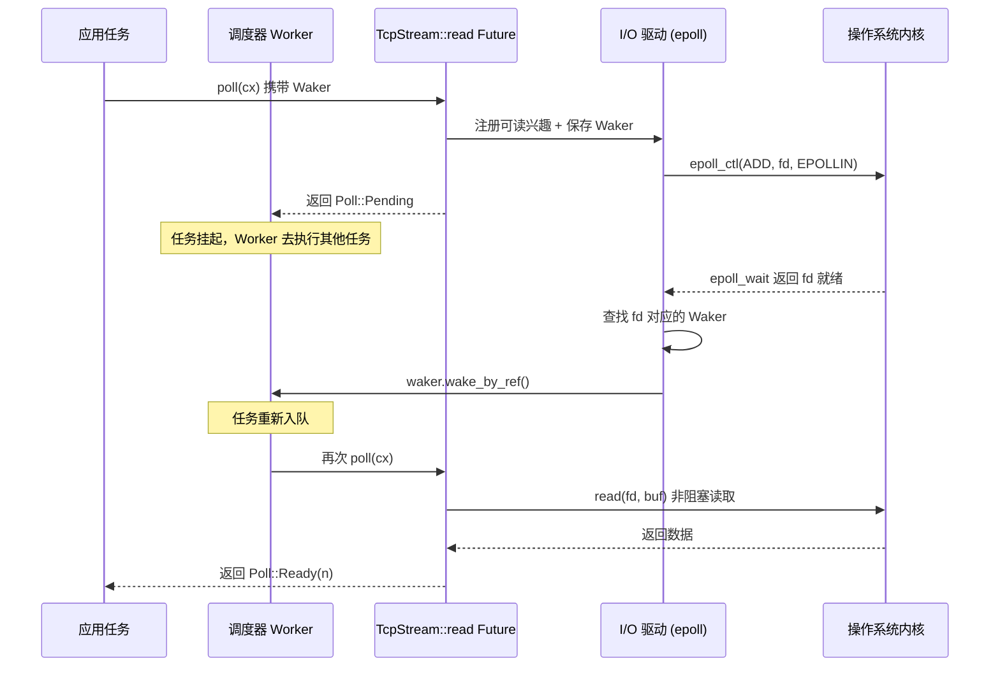

# 제 1 장: 비동기의 멘탈 모델: Future, Waker, 실행기 삼총사

Rust에서 비동기 프로그래밍은 라이브러리가 아니라 언어 차원의 프로토콜입니다. Tokio가 프로덕션급 런타임이 될 수 있었던 것은 Future를 발명했기 때문이 아니라, 이 프로토콜의 모든 계약에 대한 경계 조건을 정확히 구현했기 때문입니다. 이 장에서는 Tokio의 스케줄러 코드로 성급히 뛰어들지 않고, 먼저 '삼총사'——Future, Waker, Executor——의 책임 경계와 역방향 제어 흐름을 철저히 설명합니다. 이 세 가지가 어떻게 맞물리는지 이해해야 이후 장에서 Runtime의 조립, work-stealing 스케줄링, I/O 드라이버가 발판을 가질 수 있습니다.

# 1.1 블로킹에서 폴링으로: Rust가 콜백 대신 poll을 선택한 이유

## 직관적 모델

레스토랑에서 즉석 조리가 필요한 요리를 주문한다고 상상해 보세요. 콜백식 비동기(예: Node.js 초기 스타일)는 전화번호를 남기고 요리사가 완성되면**먼저 전화를 걸어주는**것입니다——제어권이 요리사에게 있고, 당신의 코드는 수동적으로 응답할 뿐입니다. 폴링식 비동기(Rust의 선택)는 픽업 증표를 받아**스스로 결정하여**언제 창구에 가서 "다 됐나요"라고 물을지 정하는 것입니다: 안 됐으면 다른 일을 하고, 됐으면 가져갑니다.

이 차이는 사소해 보이지만 전체 시스템의 형태를 결정합니다. 콜백식 모델에서는 모든 비동기 작업이 '완료 후 무엇을 할지'에 대한 클로저를 반드시 동반해야 하며, 클로저가 겹겹이 중첩되어 콜백 지옥을 형성하고 취소 작업이 극히 어렵습니다——이미 등록된 콜백을 '철회'할 수 없습니다. 폴링식 모델에서 Future는 단지 상태 기계일 뿐이며,`poll`은 순수한 조회 동작으로, 진행하지 않으면 자원을 소비하지 않고, 취소는 곧 drop이며, 깔끔합니다.

## 폴링식 모델의 핵심 계약

Rust 표준 라이브러리가 정의한`Future`trait은 두 가지 요소만 있습니다: 하나의`poll`메서드, 하나의`Output`연관 타입입니다. Tokio는 이 trait을 재정의하지 않고 표준 라이브러리의 구현을 직접 재사용합니다. 이 점은 소스코드에 명확히 나타납니다:

```rust
// tokio/src/future/mod.rs
cfg_not_trace! {
    cfg_rt! {
        pub(crate) use std::future::Future;
    }
}
```

[FACT:tokio/src/future/mod.rs:24-28]

이 코드는 중요한 사실을 드러냅니다:`tracing`기능이 활성화되지 않았을 때, Tokio 내부의`Future`은`std::future::Future`의 별칭이며, 어떤 래핑도 없습니다.`tracing`이 활성화될 때만`InstrumentedFuture`로 교체됩니다:

```rust
cfg_trace! {
    mod trace;
    #[allow(unused_imports)]
    pub(crate) use trace::InstrumentedFuture as Future;
}
```

[FACT:tokio/src/future/mod.rs:18-22]

> **[Design Inference & Architectural Trade-offs]**
> 이러한 '기본 제로 오버헤드, 필요 시 계측' 설계는 Tokio의 일관된 철학입니다: 핵심 경로에는 어떤 추가 추상 계층도 도입하지 않고, 관측 가능성은 선택적 기능으로叠加합니다.`InstrumentedFuture`의 존재는 Tokio 팀이 tracing의 계측 비용을 모든 사용자가 부담해서는 안 된다고 생각한다는 것을 보여줍니다.

## poll 계약의 세 가지 암묵적 제약

`poll`메서드의 시그니처는`fn poll(self: Pin<&mut Self>, cx: &mut Context<'_>) -> Poll<Self::Output>`입니다. 이 시그니처에는 세 가지 계약이 숨어 있으며, 어느 하나라도 위반하면 정의되지 않은 동작이나 논리 오류가 발생합니다:

**계약 1: Pin은 자기 참조 안전성을 보장합니다.** `Pin<&mut Self>`은 Future가 한 번 poll되면 그 메모리 주소가 더 이상 이동할 수 없음을 의미합니다. 이는 async 블록이 컴파일된 후 자기 참조를 포함하는 상태 기계를 생성하기 때문입니다——지역 변수가 동일한 상태 기계 내 다른 필드를 가리키는 참조를 보유할 수 있습니다. 이동이 허용되면 이러한 참조는 dangling됩니다.

**계약 2: Pending은 반드시 깨우기가 등록되어 있어야 합니다.**이`poll`을 반환할 때`Poll::Pending`Future는 반드시 를 통해`cx.waker()`Waker를 획득하고 저장했거나, 이미 Waker를 특정 이벤트 소스에 등록했습니다. 그렇지 않으면 실행기는 해당 Future가 언제 다시 poll될 수 있는지 영원히 알 수 없게 되어, 태스크가 영구적으로 중단됩니다.

**계약 3: Ready 이후에는 다시 poll해서는 안 됩니다.**일단`poll`가 반환되면`Poll::Ready`, 동일한 Future를 다시 poll하는 것은 논리적 오류입니다(UB를 초래하지는 않지만 동작이 정의되지 않음). 실행기는 Ready를 받은 후 해당 태스크를 다시 스케줄링하지 않을 책임이 있습니다.

이 세 가지 계약 중에서 계약 2가 가장 실수하기 쉬운 부분이며, Waker가 존재하는 근본적인 이유이기도 합니다.

# 1.2 Waker: 역방향 제어 흐름의 매개체

## 직관적 모델

Waker는 식당에서 주는 '진동 호출기'입니다. 창구 앞에 서서 "다 됐나요"를 반복해서 물을 필요가 없습니다 — 그러면 시간만 낭비됩니다. 처음 창구에 갈 때 호출기를 요리사에게 건네주고( Waker 등록), 그다음에는 안심하고 다른 일을 하면 됩니다. 음식이 완성되면 요리사가 버튼을 누르고, 호출기가 진동합니다(`wake`호출). 신호를 받은 후 다시 창구에 가서 음식을 받으면 됩니다(다시 poll).

Waker가 없다면 실행기는 두 가지 선택지만 있습니다: 모든 태스크를 바쁘게 폴링하거나(CPU 낭비), Pending을 반환한 태스크를 영원히 poll하지 않거나(태스크 기아). Waker는 이 교착 상태를 깨는 유일한 메커니즘입니다.

## Waker의 메모리 레이아웃과 가상 테이블 설계

Waker는 표준 라이브러리 타입이지만, 그 설계는 Tokio의 태스크 구조에 직접적인 영향을 미쳤습니다.`Waker`는 본질적으로 팻 포인터입니다:`RawWaker`구조체로, 데이터 포인터와 가상 테이블 포인터를 포함합니다.

```rust
// 标准库中的定义（非 Tokio 源码，此处为背景说明）
pub struct RawWaker {
    data: *const (),
    vtable: &'static RawWakerVTable,
}

pub struct RawWakerVTable {
    clone: unsafe fn(*const ()) -> RawWaker,
    wake: unsafe fn(*const ()),
    wake_by_ref: unsafe fn(*const ()),
    drop: unsafe fn(*const ()),
}
```

> **[Design Inference & Architectural Trade-offs]**
> 이 설계의 정교한 점은 다음과 같습니다:`Waker`자체는 '깨우기'가 구체적으로 무엇을 의미하는지 관심이 없습니다. 단지 네 개의 함수 포인터를 담는 매개체일 뿐입니다. Tokio는`wake`함수가 태스크를 다시 스케줄링 큐에 푸시하는 Waker를 제공할 수 있고, 다른 런타임(예:`futures`crate의`block_on`)은 완전히 다른 Waker 구현을 제공할 수 있습니다. 이러한 '데이터 + 가상 테이블' 패턴 덕분에 Waker는 서로 다른 런타임 간에 전달되어도 의미를 잃지 않습니다.

`wake`와`wake_by_ref`의 차이는 매우 중요합니다:`wake`는 Waker의 소유권을 소비하고(호출 후 Waker가 drop됨), 반면`wake_by_ref`는 단지 빌립니다. 실행기는 일반적으로`wake_by_ref`를 '태스크를 준비 상태로 표시하고 큐에 넣기'로 구현하며,`wake`는 그 위에 추가로 참조 카운트 감소를 처리합니다. Tokio의 태스크 구조에서 Waker의 데이터 포인터는 태스크의 참조 카운트 헤드를 가리키며, clone할 때마다 카운트가 증가하고, drop할 때마다 감소하며, 카운트가 0이 되면 태스크 메모리가 해제됩니다.

## 깨우기의 전체 타이밍

아래 타이밍 다이어그램은 TCP 읽기 작업이 시작되어 깨어나기까지의 전체 경로를 보여줍니다. Waker가 어떻게 태스크 컨텍스트에서 I/O 드라이버까지 전달되는지 주목하세요:



이 다이어그램의 핵심은:**Waker는 Reactor에서 Executor로 역방향으로 도달할 수 있는 유일한 채널입니다**. Reactor는 태스크에 대한 다른 정보를 전혀 보유하지 않으며, 단지 '이 fd가 준비되면 이 Waker를 호출하라'는 것만 알고 있습니다. 이러한 디커플링 덕분에 I/O 드라이버는 스케줄러와 독립적으로 구현될 수 있으며, 둘은 Waker라는 좁은 인터페이스를 통해서만 통신합니다.

## 거짓 깨우기: 계약의 회색 지대

Tokio의 문서는 거짓 깨우기의 존재를 명확히 인정합니다:

> Normally, tasks are scheduled only if they have been woken by calling `wake` on their waker. However, this is not guaranteed, and Tokio may schedule tasks that have not been woken under some circumstances.

[FACT:tokio/src/runtime/mod.rs:306-309]

> **[Design Inference & Architectural Trade-offs]**
> 이는`poll`의 구현이 '깨워지지 않았는데도 다시 poll되는' 상황을 견딜 수 있어야 함을 의미합니다. 올바른 Future는 Pending을 반환한 후, 아무런 이벤트가 발생하지 않았더라도 다시 poll될 때 panic하거나 잘못된 결과를 생성하는 대신 Pending을 반환해야 합니다. 이 제약은 느슨해 보이지만, 실제로는 상태 머신 설계에 요구 사항을 제기합니다: '두 poll 사이에 반드시 이벤트가 발생한다'고 가정할 수 없습니다.

# 1.3 Executor: Future에서 태스크로의 캡슐화

## 직관적 모델

Executor는 식당의 배차 담당자입니다. 손에 주문 더미(태스크 큐)를 들고 어떤 주문을 먼저 할지, 누가 할지를 결정합니다. 호출기가 진동하면 해당 주문을 다시 큐에 넣습니다. 배차 담당자가 없으면 요리사들은 어떤 요리를 해야 할지, 언제 작업을 전환해야 할지 알 수 없습니다.

하지만 Executor의 책임은 'Future 폴링'에 그치지 않습니다. 세 가지 핵심 문제를 해결해야 합니다:**태스크의 수명 주기 관리**(생성, 스케줄링, 완료, 취소),**공정성 보장**(특정 태스크가 다른 태스크를 기아 상태로 만드는 것을 방지),**리소스 드라이버 통합**(I/O 및 타이머 이벤트가 어떻게 깨우기로 변환되는지).

## 태스크의 메모리 레이아웃: Future에서 Task로

를 호출할 때`tokio::spawn`, 전달된 Future는 직접 큐에 들어가지 않습니다. 참조 카운트 헤드, 스케줄링 메타데이터, Future 자체를 포함하는`Task`구조로 래핑됩니다. 이 래핑 과정에는 중요한 최적화 결정이 있습니다:

```rust
/// Boundary value to prevent stack overflow caused by a large-sized
/// Future being placed in the stack.
pub(crate) const BOX_FUTURE_THRESHOLD: usize = if cfg!(debug_assertions)  {
    2048
} else {
    16384
};

pub(crate) struct AutoBox(std::marker::PhantomData);

impl AutoBox {
    /// `true` if a value of type `T` is larger than [`BOX_FUTURE_THRESHOLD`].
    pub(crate) const SHOULD_BOX: bool = std::mem::size_of::() > BOX_FUTURE_THRESHOLD;
}
```

[FACT:tokio/src/runtime/mod.rs:649-673]

이 코드는 매우 구체적인 문제를 해결합니다: Future가 너무 크면(16KB 초과, debug 모드에서 2KB), Task 구조에 직접 인라인하면 스택 오버플로나 메모리 낭비가 발생합니다.`AutoBox`는 컴파일 타임 상수`SHOULD_BOX`를 통해 Future를 박싱할지 여부를 결정합니다.

> **[Design Inference & Architectural Trade-offs]**
> 주석에서 특히 '런타임이 아닌 연관 상수를 사용하라'고 강조합니다`if`」의 이유: 만약 런타임에 판단한다면, 컴파일러는 각각의`T`를 위해 동시에 두 분기 코드를 인스턴스화합니다 (하나는`T`를 처리하고, 하나는`Pin<Box<T>>`를 처리). 이는 코드 팽창을 초래합니다. 반면 상수 분기를 사용하면, 단형화 수집기가 도달 불가능한 분기를 잘라내고 실제로 사용되는 타입에 대해서만 코드를 생성합니다. 이는 전형적인 「타입 시스템으로 런타임 판단을 대체하는」 최적화입니다.

## 스케줄링 공정성: 31과 61의 매직 넘버

Tokio의 스케줄러 문서에는 형식화된 공정성 보장이 정의되어 있습니다:

> If the total number of tasks does not grow without bound, and no task is blocking the thread, then it is guaranteed that tasks are scheduled fairly.

[FACT:tokio/src/runtime/mod.rs:279-281]

이 보장의 구현은 두 가지 핵심 매개변수에 의존합니다. current-thread 런타임의 경우:

> The runtime will prefer to choose the next task to schedule from the local queue, and will only pick a task from the global queue if the local queue is empty, or if it has picked a task from the local queue 31 times in a row.

[FACT:tokio/src/runtime/mod.rs:328-333]

> The runtime will check for new IO or timer events whenever there are no tasks ready to be scheduled, or when it has scheduled 61 tasks in a row.

[FACT:tokio/src/runtime/mod.rs:335-337]

이 두 숫자(31과 61)는 임의로 선택된 것이 아닙니다. 31은 2의 5제곱에서 1을 뺀 값으로, 비트 연산으로 빠르게 판단할 수 있습니다. 61은 I/O 이벤트가 무한히 지연되지 않도록 보장하기 위한 것입니다 — 태스크 큐가 영원히 비어 있지 않더라도, 61번 스케줄링할 때마다 반드시 I/O를 한 번 확인해야 합니다.

> **[Design Inference & Architectural Trade-offs]**
> 왜 32가 아니라 31일까요? 카운터가 0에서 시작하여 스케줄링할 때마다 1씩 증가하고, 카운터가 31에 도달하면 전역 큐 검사를 트리거하기 때문입니다.`counter & 31 == 31`로 판단하는 것이`counter % 32 == 0`보다 더 효율적입니다 (현대 컴파일러가 자동으로 최적화해 주지만). 61의 선택은 더 미묘합니다: 빈번한 epoll_wait 시스템 콜 오버헤드를 피할 만큼 충분히 커야 하고, I/O 지연을 허용 가능한 범위 내로 보장할 만큼 충분히 작아야 합니다.

## 멀티스레드 런타임의 LIFO 슬롯 최적화

멀티스레드 런타임은 공정성 위에 성능 최적화를 하나 더 추가했습니다 — LIFO 슬롯:

> The multi thread runtime uses the lifo slot optimization: Whenever a task wakes up another task, the other task is added to the worker thread's lifo slot instead of being added to a queue.

[FACT:tokio/src/runtime/mod.rs:373-377]

이 최적화의 직관은 다음과 같습니다: 한 태스크가 다른 태스크를 깨울 때, 깨어난 태스크는 현재 태스크와 데이터 의존 관계가 있을 가능성이 높습니다 (예: 생산자-소비자 패턴). 이를 LIFO 슬롯에 넣으면, 현재 태스크가 완료된 직후에 실행하여 CPU 캐시의 뜨거운 데이터를 활용할 수 있습니다.

그러나 LIFO 슬롯에는 남용 방지 메커니즘이 있습니다:

> if a worker thread uses the lifo slot three times in a row, it is temporarily disabled until the worker thread has scheduled a task that didn't come from the lifo slot.

[FACT:tokio/src/runtime/mod.rs:380-382]

> **[Design Inference & Architectural Trade-offs]**
> 이 「3회 연속 사용 후 비활성화」 규칙은 두 태스크가 서로를 깨워 라이브락을 형성하는 것을 방지하기 위한 것입니다. 만약 태스크 A가 태스크 B를 깨우고, B가 다시 A를 깨운다면, 이 제한이 없을 경우 LIFO 슬롯이 이 두 태스크에 의해 영구적으로 점유되어 다른 태스크는 영원히 스케줄링될 수 없습니다. 3회 제한은 다른 태스크에게 끼어들 기회를 줍니다.

## 태스크 취소: abort의 실제 의미

`JoinHandle::abort`의 동작은 종종 오해받습니다. 문서에서 명확히 밝히고 있습니다:

> Be aware that calls to `JoinHandle::abort` just schedule the task for cancellation, and will return before the cancellation has completed.

[FACT:tokio/src/task/mod.rs:146-148]

이는`abort`가 동기적이지 않다는 것을 의미합니다. 단지 플래그를 설정할 뿐이며, 태스크는 다음`.await`지점에서 이 플래그를 확인하고 스스로 종료합니다. 만약 태스크가`.await`가 없는 CPU 집약적 코드를 실행 중이라면,`abort`는 즉시 적용되지 않습니다.

더 미묘한 점은:

> Note that aborting a task does not guarantee that it fails with a cancelled error, since it may complete normally first.

[FACT:tokio/src/task/mod.rs:134-138]

> **[Design Inference & Architectural Trade-offs]**
> 이 의미의 설계 동기는: 취소는 「최선 노력」 작업이라는 것입니다. Tokio는 태스크를 강제로 종료하지 않으며 (Rust에는 안전한 강제 종료 메커니즘이 없음), 협력적으로 태스크에 자발적 종료를 요청합니다. 이는`spawn_blocking`태스크가 취소 불가능하다는 설계와 일치합니다 — 블로킹 태스크에는`.await`지점이 없어 취소 플래그를 확인할 수 없습니다.

# 1.4 설계 사고: 삼총사의 경계와 대가

## 왜 Future는 Executor를 포함하지 않는가

Rust의`Future`trait는 의도적으로 「자신을 어떻게 스케줄링할지」에 대한 정보를 포함하지 않습니다. 이는 심사숙고한 디커플링 결정입니다. 만약 Future가 자신의 Executor를 안다면:

1. 동일한 Future를 다른 런타임에서 실행할 수 없습니다 (예: Tokio에서 async-std로 마이그레이션)

2. 테스트 시 간단한`block_on`로 구동할 수 없습니다

3. 컴비네이터(예:`select!`、`join!`)가 런타임 간에 작동할 수 없습니다

Waker의 존재는 바로 이러한 디커플링을 유지하면서도 Future가 Executor에 알릴 수 있도록 하기 위한 것입니다. Waker는 「능력 토큰」입니다 — Future는 「이것을 호출하여 재스케줄링을 요청할 수 있다」는 것만 알 뿐, 스케줄링이 구체적으로 어떻게 발생하는지는 모릅니다.

## 협력적 스케줄링의 대가

Tokio의 태스크는 협력적입니다: 태스크는`.await`지점에서만 실행 권한을 양보합니다. 이는 다음을 의미합니다:

> code that spends a long time without reaching an `.await` will prevent other tasks from running.

[FACT:tokio/src/lib.rs:178-179]

> **[Design Inference & Architectural Trade-offs]**
> 이것이 협력적 스케줄링의 근본적인 대가입니다. 운영체제는 임의의 명령어 경계에서 스레드를 선점할 수 있지만, Tokio는`.await`지점에서만 태스크를 전환할 수 있습니다. 만약 한 태스크가 중간에`.await`없이 10초짜리 CPU 집약적 루프를 실행한다면, 같은 worker 스레드의 다른 모든 태스크가 10초 동안 블로킹됩니다. Tokio의 대응 전략은`spawn_blocking`와`block_in_place`를 제공하여 이런 작업을 전용 스레드 풀로 옮기는 것입니다. 그러나 이는 사용자의 책임이며, 런타임이 자동으로 감지할 수 없습니다.

## 공정성 보장의 경계 조건

Tokio의 공정성 보장에는 두 가지 전제 조건이 있습니다: 태스크 총수가 상한을 가지며, 스레드를 블로킹하는 태스크가 없어야 합니다. 이 두 조건은 실제 프로덕션 환경에서 자주 위반됩니다:

- 태스크가 계속 새 태스크를 spawn하고 회수하지 않으면 태스크 총수에 상한이 없어 공정성 보장이 무효화됩니다
- 어떤 태스크가 블로킹 시스템 콜(예: 동기 파일 I/O)을 실행하면 전체 worker 스레드를 블로킹합니다

> **[Design Inference & Architectural Trade-offs]**
> 이것이 Tokio 문서가 「비동기 태스크에서 블로킹 작업을 수행하지 말라」고 반복적으로 강조하는 이유입니다. 공정성 보장은 런타임의 강제적 보장이 아니라 「올바르게 사용한다는 전제 하에」의 보장입니다. 런타임은 위반 행위를 감지하지 않습니다. 감지 자체에 오버헤드가 필요하기 때문입니다.

# 1.5 이 장의 요약

이 장은 Tokio를 이해하기 위한 세 가지 초석을 세웠습니다:

**Future는 풀 방식의 상태 기계이다.** `poll`순수한 조회 동작이며, 반환 시`Pending`반드시 이미 웨이크업이 등록되어 있어야 하며, 반환`Ready`후에는 더 이상 poll되어서는 안 된다. Tokio는 직접 재사용하며`std::future::Future`, 추가 래핑을 하지 않는다 (tracing이 활성화된 경우 제외).

**Waker는 역방향 제어 흐름의 유일한 통로이다.**그것은 「데이터 포인터 + 가상 테이블」 설계를 통해 런타임 독립성을 구현한다.`wake`소유권을 소비하고,`wake_by_ref`은(는) 빌리기만 한다. 거짓 웨이크업은 허용되며, Future는 이를 반드시 용인해야 한다.

**Executor는 수명 주기, 공정성, 리소스 통합을 담당한다.**그것은 Future를 Task로 래핑하고,`AutoBox`를 통해 컴파일 시점에 박싱 여부를 결정하며, 31/61이라는 두 매직 넘버를 통해 로컬 큐와 글로벌 큐의 스케줄링을 균형 잡고, LIFO 슬롯을 통해 데이터 의존성 시나리오의 성능을 최적화한다.

이 세 컴포넌트는 좁은 인터페이스를 통해 디커플링된다: Future는`poll`만 알고, Waker는`wake`만 알며, Executor는 「Pending 또는 Ready가 될 때까지 폴링」만 안다. 바로 이러한 디커플링 덕분에 Tokio는 Future 정의를 수정하지 않고도 work-stealing 스케줄링, I/O 드라이버 통합, 협력적 예산 등의 고급 기능을 구현할 수 있다.

# 이 장의 생각과 자가 점검

Q1: 만약`AutoBox::SHOULD_BOX`의 판단을 컴파일 시점 상수에서 런타임`if size_of::<T>() > THRESHOLD`로 변경하면 컴파일 산출물에 어떤 영향을 미치는가? 왜 Tokio의 주석이 이 점을 특별히 강조하는가?

**참고 해석**:[FACT:tokio/src/runtime/mod.rs:657-667]의 주석에 따르면, 만약 런타임`if`을 사용하면 컴파일러는 각`T`에 대해 두 분기의 코드를 동시에 인스턴스화한다 — 하나는`T`이 직접 인라인되는 경우를 처리하고, 하나는`Pin<Box<T>>`인 경우를 처리한다. 이는 각 spawn된 Future 타입마다 두 개의 태스크 구동 코드(task harness)가 생성되어 바이너리 크기가 두 배로 늘어남을 의미한다. 반면 연관 상수`SHOULD_BOX`를 사용하면,`T`이 결정된 후에는 컴파일 시점 상수이므로 단형화 수집기가 도달 불가능한 분기를 제거하고 실제 사용되는 경로에 대해서만 코드를 생성한다. 이는 「타입 시스템으로 런타임 판단을 대체」하는 전형적인 최적화이며, 대가는`AutoBox`이 일반 함수가 아닌 제네릭 구조체여야 한다는 점이다.

Q2: 어떤 태스크가`poll`에서`Pending`을 반환했지만 Waker 등록을 잊었다고 가정하자. current-thread 런타임과 multi-thread 런타임에서 이 태스크는 각각 어떻게 되는가? Tokio에 이를 감지하는 메커니즘이 있는가?

**참고 해석**:[FACT:tokio/src/runtime/mod.rs:306-309]에 따르면, Tokio는 거짓 웨이크업을 허용하며, 이는 태스크가 웨이크업되지 않은 상태에서 재스케줄링될 수 있음을 의미한다. 하지만 이것이 Waker 등록을 잊는 것이 안전하다는 뜻은 아니다. current-thread 런타임에서 로컬 큐와 글로벌 큐가 모두 비어 있으면, 런타임은`park`상태로 진입하여 I/O 또는 타이머 이벤트를 기다린다. Waker 등록을 잊은 태스크는 영원히 재큐잉되지 않아 영구적으로 중단된다. multi-thread 런타임에서도 상황은 유사하지만, 다른 태스크가 지속적으로 웨이크업하면 해당 태스크는 거짓 웨이크업으로 인해 우연히 재스케줄링될 수 있다 — 그러나 이는 의존할 수 없다. Tokio에는 「Pending을 반환했지만 Waker를 등록하지 않은」 상황을 발견하는 런타임 감지 메커니즘이 없는데, 이는 매 poll 후 Waker 사용 여부를 확인해야 하므로 오버헤드가 너무 크기 때문이다. 이는 Future 구현자의 책임이다.

Q3: LIFO 슬롯의 「세 번 연속 사용 후 비활성화」 규칙은 어떤 구체적 시나리오를 방지하기 위한 것인가? 이 제한을 제거하면 어떤 태스크 의존성 패턴에서 다른 태스크가 기아 상태에 빠지는가?

**참고 해석**:[FACT:tokio/src/runtime/mod.rs:380-382]에 따르면, LIFO 슬롯은 세 번 연속 사용 후 LIFO가 아닌 소스의 태스크가 스케줄링될 때까지 일시적으로 비활성화된다. 이 규칙이 방지하는 시나리오는: 두 태스크가 서로를 깨워 긴밀한 루프를 형성하는 것이다. 예를 들어 태스크 A가 데이터 배치를 처리한 후 태스크 B를 깨우고, 태스크 B가 처리 후 즉시 태스크 A를 깨운다. 세 번 제한이 없으면 A와 B는 영원히 LIFO 슬롯을 차지하고, worker 스레드는 이 두 태스크 사이를 무한히 전환하며, 로컬 큐와 글로벌 큐의 다른 태스크는 영원히 실행 기회를 얻지 못한다. 세 번 제한은 매 세 라운드의 「상호 웨이크업」 후에 최소한 하나의 다른 태스크가 스케줄링되도록 보장하여 라이브락을 깨뜨린다. 이 숫자의 선택은 경험적이다: 너무 작으면 LIFO 최적화의 이득이 줄어들고, 너무 크면 다른 태스크의 지연이 증가한다.

여기까지 Future, Waker, Executor 세 가지의 책임 경계와 협력 메커니즘이 명확해졌다: Future는 계산을 정의하고, Waker는 웨이크업을 담당하며, Executor는 실행을 구동한다. 그러나 단일 컴포넌트는 독립적으로 작동할 수 없으며, 이들은 통합된 런타임 환경에 조립되어야 한다. 다음 장에서는 Runtime::new와 Builder::build의 전체 조립 경로를 추적하여 스케줄러, I/O 드라이버, 시간 드라이버, 블로킹 스레드 풀이 어떻게 동일한 Runtime 인스턴스에 주입되는지 살펴보고, current_thread와 multi_thread 두 형태의 조립 단계에서의 근본적 차이를 밝힌다.
