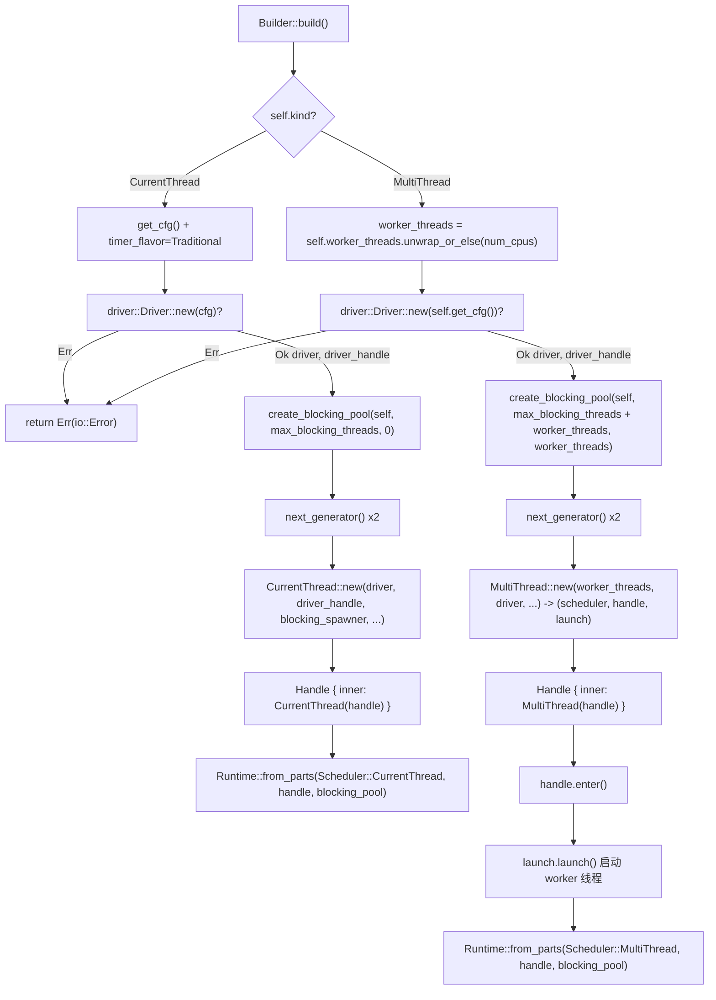

# 제 2 장: Runtime의 조립: Builder가 드라이버, 스케줄러, 스레드 풀을 어떻게 조립하는가

# 부터`Builder`까지`Runtime`: 한 번의 조립의 완전한 여정

지난 장에서 우리는 Future, Waker, Executor 세 가지의 책임 경계를 명확히 했다. 하지만 실제로 사용 가능한 런타임은 '하나의 Executor'만으로는 훨씬 부족하다 — I/O 이벤트 루프, 타이머, 블로킹 스레드 풀도 필요하며, 이러한 컴포넌트들은 반드시 동일한 핸들 세트와 동일한 라이프사이클을 공유해야 한다. 이번 장에서는`Builder::build`의 완전한 조립 체인을 추적하며, 핵심 질문 하나에 답한다:**하나의`Runtime`내부에 어떤 컴포넌트들이 있으며, 그것들이 어떻게 조립되고 핸들을 공유하는가**。

Tokio의 조립 진입점은`Builder`이다. 이것 자체는 순수한 설정 컨테이너이며, 모든 필드는 '의도 선언'이고 런타임 리소스를 전혀 보유하지 않는다. 실제 리소스 생성은`build()`호출 시에 발생한다.

## 직관적 모델: Builder는 '인테리어 도면', Runtime은 '입주 후의 집'

`Builder`은 마치 인테리어 도면과 같다: 그 위에 '방 몇 개(worker_threads)', '수도 연결 여부(enable_io)', '전기 연결 여부(enable_time)', '외주 도우미 상한(max_blocking_threads)'을 표시한다. 도면 자체는 아무런 실체도 만들어내지 않는다.`build()`을 호출할 때까지, 시공팀이 도면에 따라 시공하여 스케줄러, 드라이버, 스레드 풀이라는 '방'들을 실제로 세우고,`Runtime`인스턴스를 인도한다.

만약`Builder`이 계층이 없다면, 사용자는 각 컴포넌트를 수동으로 new하고, 수동으로 배선하고, 수동으로 실패 롤백을 처리해야 한다 — 어느 한 곳이라도 순서가 틀리면 핸들이 공중에 떠 있거나 리소스가 누출된다.`Builder`의 가치는:**'설정'과 '구성'을 완전히 분리하여, 구성 과정에서 검증, 실패 정리, 핸들 공유를 집중적으로 수행할 수 있게 한다**。

## 메모리 레이아웃:`Builder`의 필드 구역

`Builder`의 필드는 책임에 따라 네 그룹으로 나눌 수 있다. 첫 번째 그룹은**형태와 스위치**：`kind`는 스케줄러 형태를 결정하고,`enable_io` / `enable_time`는 해당 드라이버 생성 여부를 결정한다.

[FACT:tokio/src/runtime/builder.rs:55-68]

```rust
pub struct Builder {
    kind: Kind,
    name: Option,
    enable_io: bool,
    nevents: usize,
    nevents_busy: Option,
    enable_time: bool,
    start_paused: bool,
    // ...
}
```

두 번째 그룹은**스레드 풀 파라미터**：`worker_threads`는`Option<usize>`，`None`로 'build 시점까지 지연하여 CPU 코어 수에 따라 자동 감지'를 나타내며;`max_blocking_threads`기본값은 512이다.

[FACT:tokio/src/runtime/builder.rs:73-79]

```rust
worker_threads: Option,
max_blocking_threads: usize,
```

세 번째 그룹은**콜백 훅**이며, 전부`Option<Arc<dyn Fn ...>>`이다. 이들은`Arc`대신`Box`을 사용하는데, 이 콜백들이 각 워커 스레드의`Config`。

[FACT:tokio/src/runtime/builder.rs:87-97]

```rust
pub(super) after_start: Option,
pub(super) before_stop: Option,
pub(super) before_park: Option,
pub(super) after_unpark: Option,
```

복사**네 번째 그룹은**：`global_queue_interval`、`event_interval`、`disable_lifo_slot`、`seed_generator`。

[FACT:tokio/src/runtime/builder.rs:116-134]

```rust
pub(super) global_queue_interval: Option,
pub(super) event_interval: u32,
pub(super) disable_lifo_slot: bool,
pub(super) seed_generator: RngSeedGenerator,
```

복사`Kind`여기서 주목할 만한 설계가 있다:`Copy`은

[FACT:tokio/src/runtime/builder.rs:261-265]

```rust
#[derive(Clone, Copy)]
pub(crate) enum Kind {
    CurrentThread,
    #[cfg(feature = "rt-multi-thread")]
    MultiThread,
}
```

`MultiThread`복사`rt-multi-thread`변형은`rt`feature에 의해 게이트된다. 이는`Kind`feature만 활성화한 빌드에서`build()`이 하나의 변형만 가지며,`match`의**이 컴파일러에 의해 단일 분기로 최적화된다는 것을 의미한다 —**。

## 타입 시스템을 사용하여 런타임 판단 대신 멀티스레드 스케줄러의 코드 크기를 제거한다

`Builder::new`기본값의 철학: 왜 I/O와 time이 기본적으로 꺼져 있는가`enable_io`은 모든 구성의 공통 진입점이다. 이것은`enable_time`과`false`。

[FACT:tokio/src/runtime/builder.rs:309-318]

```rust
// I/O defaults to "off"
enable_io: false,
nevents: 1024,
nevents_busy: None,

// Time defaults to "off"
enable_time: false,

// The clock starts not-paused
start_paused: false,
```

> **[Design Inference & Architectural Trade-offs]**
> 복사`#[tokio::main]`〔설계 추론과 아키텍처 트레이드오프〕`enable_all()`。

`enable_all()`이 기본값 선택은 의도적이다: I/O 드라이버를 생성하려면 운영체제에 epoll/kqueue 핸들을 요청해야 하고, time 드라이버를 생성하려면 타이머 인프라를 시작해야 한다. 만약 사용자가 순수 계산 작업 스케줄러(예: CPU 집약적 async 로직 실행)만 원한다면, 이러한 드라이버를 강제로 생성하는 것은 순전한 낭비이다.

[FACT:tokio/src/runtime/builder.rs:398-419]

```rust
pub fn enable_all(&mut self) -> &mut Self {
    #[cfg(any(
        feature = "net",
        all(unix, feature = "process"),
        all(unix, feature = "signal")
    ))]
    self.enable_io();

    #[cfg(all(
        tokio_unstable,
        feature = "io-uring",
        // ...
    ))]
    self.enable_io_uring();

    #[cfg(feature = "time")]
    self.enable_time();

    self
}
```

을 호출하기 때문이다`enable_io()`의 구현은 feature 게이팅이 '전부 열기'의 의미에 어떻게 영향을 미치는지 보여준다.`net`、`process`복사`signal`주목할 점은`time` feature，`enable_all()`이

## 또는`build()`feature가 활성화된 경우에만 호출된다는 것이다. 만약 사용자가

`build()`만 활성화했다면`kind`은 I/O 드라이버를 열지 않는다 — 컴파일 산출물에 I/O 드라이버 코드가 전혀 없기 때문이다.

[FACT:tokio/src/runtime/builder.rs:1146-1152]

```rust
pub fn build(&mut self) -> io::Result {
    match &self.kind {
        Kind::CurrentThread => self.build_current_thread_runtime(),
        #[cfg(feature = "rt-multi-thread")]
        Kind::MultiThread => self.build_threaded_runtime(),
    }
}
```

의 분기

### 은 조립의 시작점이며,

`build_current_thread_runtime`에 따라 완전히 다른 두 경로로 분기한다.`build_current_thread_runtime_components`복사`Runtime`。

[FACT:tokio/src/runtime/builder.rs:1725-1736]

```rust
fn build_current_thread_runtime(&mut self) -> io::Result {
    use crate::runtime::runtime::Scheduler;

    let (scheduler, handle, blocking_pool) =
        self.build_current_thread_runtime_components(None)?;

    Ok(Runtime::from_parts(
        Scheduler::CurrentThread(scheduler),
        handle,
        blocking_pool,
    ))
}
```

경로 1: current_thread의 조립`build_current_thread_runtime_components`자체는 매우 얇으며,

[FACT:tokio/src/runtime/builder.rs:1760-1766]

```rust
let mut cfg = self.get_cfg();
cfg.timer_flavor = TimerFlavor::Traditional;
let (driver, driver_handle) = driver::Driver::new(cfg)?;

// Blocking pool
let blocking_pool = blocking::create_blocking_pool(self, self.max_blocking_threads, 0);
let blocking_spawner = blocking_pool.spawner().clone();
```

에 포장한다`driver`복사`(driver, driver_handle)`실제 조립 로직은`?`에 있다. 실행 순서가 매우 중요하다:`build`복사`Err`첫 번째 단계에서

을 생성하고, 한 쌍의`spawner`을 반환한다. 여기서`spawner`은 오류를 직접 상위로 전파한다 — 만약 I/O 드라이버 초기화가 실패하면(예: epoll 생성 실패), 전체

이

[FACT:tokio/src/runtime/builder.rs:1768-1770]

```rust
let seed_generator_1 = self.seed_generator.next_generator();
let seed_generator_2 = self.seed_generator.next_generator();
```

> **[Design Inference & Architectural Trade-offs]**
> 클론을 꺼낸다. 이`seed_generator_1`은 스케줄러에 주입되어, 스케줄러가 블로킹 작업을 스레드 풀에 전달할 수 있는 능력을 갖게 한다.`Config`세 번째 단계에서 두 개의 독립적인 RNG 시드 생성기를 생성한다.`select!`복사`seed_generator_2`〔설계 추론과 아키텍처 트레이드오프〕`CurrentThread::new`왜 두 개가 필요한가?`rng_seed`은

에 들어가 스케줄러 내부에서 사용된다(예:`Config`의 랜덤 분기 순서);`CurrentThread::new`。

[FACT:tokio/src/runtime/builder.rs:1776-1807]

```rust
let (scheduler, handle) = CurrentThread::new(
    driver,
    driver_handle,
    blocking_spawner,
    seed_generator_2,
    Config {
        before_park: self.before_park.clone(),
        after_unpark: self.after_unpark.clone(),
        // ...
        global_queue_interval: self.global_queue_interval,
        event_interval: self.event_interval,
        // ...
        enable_eager_driver_handoff: false,
        seed_generator: seed_generator_1,
        // ...
    },
    local_tid,
    self.name.clone(),
);
```

에 전달되어 작업 측에서 사용된다. 두 생성기를 분리하면 스케줄러 내부에서 소비하는 난수가 사용자에게 보이는 난수 시퀀스에 영향을 미치는 것을 방지하여,`enable_eager_driver_handoff`의 재현성을 보장한다.`false`。

[FACT:tokio/src/runtime/builder.rs:1795-1798]

```rust
// This setting never makes sense for a current thread runtime,
// as it only configures how the I/O driver is stolen across
// workers.
enable_eager_driver_handoff: false,
```

> **[Design Inference & Architectural Trade-offs]**
> 이 주석은 해당 옵션의 본질을 짚고 있다: 그것은 「여러 worker 간에 I/O 드라이버를 어떻게 선점하는가」를 설명하는데, current_thread는 스레드가 하나뿐이라 선점이 존재하지 않으므로 강제로 비활성화된다. 이는 「설정 항목의 의미가 형태와 강하게 연관된다」는 전형적인 예이다—동일한`Builder`필드가 서로 다른 형태에서 다른 의미를 가진다.

마지막으로,`CurrentThread::new`가 반환한`handle`가`scheduler::Handle::CurrentThread`에 감싸지고, 다시 공개된`Handle`。

[FACT:tokio/src/runtime/builder.rs:1816-1822]

```rust
let handle = Handle {
    inner: scheduler::Handle::CurrentThread(handle),
};

Ok((scheduler, handle, blocking_pool))
```

### 경로 2: multi_thread의 조립

`build_threaded_runtime`의 골격은 current_thread와 유사하지만, 세 가지 본질적 차이가 있다. 첫 번째 차이는 worker 스레드 수의 결정이다:

[FACT:tokio/src/runtime/builder.rs:2185]

```rust
let worker_threads = self.worker_threads.unwrap_or_else(num_cpus);
```

`None`가 여기서`num_cpus()`로 파싱된다. 이것이 「지연 자동 탐지」의 실현 지점이다—탐지는`Builder::new`시점이 아니라 build 시점에 발생하는데, CPU 친화성이 그 사이에 변할 수 있기 때문이다.

두 번째 차이는 blocking pool의 용량 계산에 있다:

[FACT:tokio/src/runtime/builder.rs:2189-2192]

```rust
let blocking_pool =
    blocking::create_blocking_pool(self, self.max_blocking_threads + worker_threads, worker_threads);
let blocking_spawner = blocking_pool.spawner().clone();
```

주목할 점은`max_blocking_threads + worker_threads`이다. current_thread 경로에서 전달되는 것은`self.max_blocking_threads`과`0`。

[FACT:tokio/src/runtime/builder.rs:1765]

```rust
let blocking_pool = blocking::create_blocking_pool(self, self.max_blocking_threads, 0);
```

> **[Design Inference & Architectural Trade-offs]**
> 이 차이는 blocking pool 용량 의미를 드러낸다: multi_thread에서`max_blocking_threads`는 「추가적인」 블로킹 스레드 상한이며, 실제 총 스레드 상한에는 worker 스레드 수를 더해야 한다. 세 번째 파라미터(current_thread는 0, multi_thread는`worker_threads`)는 「예약 스레드 수」 또는 「초기 스레드 수」에 대한 힌트일 가능성이 높다. 이 설계는`max_blocking_threads`의 의미를 두 형태에서 일관되게 유지한다: 그것은 「핵심 worker 외에 추가로 얼마나 많은 블로킹 스레드를 열 수 있는가」를 설명한다.

세 번째 차이는`MultiThread::new`가 2-튜플이 아닌 3-튜플을 반환한다는 점이다:

[FACT:tokio/src/runtime/builder.rs:2198-2226]

```rust
let (scheduler, handle, launch) = MultiThread::new(
    worker_threads,
    driver,
    driver_handle,
    blocking_spawner,
    seed_generator_2,
    Config {
        // ...
        enable_eager_driver_handoff: self.enable_eager_driver_handoff,
        // ...
    },
    self.timer_flavor,
    self.name.clone(),
);
```

추가된`launch`는 「시작 핸들」이다.`MultiThread::new`는 스케줄러 구조만 구성할 뿐,**worker 스레드를 즉시 시작하지는 않는다**. 실제 시작은 나중에 발생한다:

[FACT:tokio/src/runtime/builder.rs:2228-2234]

```rust
let handle = Handle { inner: scheduler::Handle::MultiThread(handle) };

// Spawn the thread pool workers
let _enter = handle.enter();
launch.launch();

Ok(Runtime::from_parts(Scheduler::MultiThread(scheduler), handle, blocking_pool))
```

`handle.enter()`가 런타임 컨텍스트에 진입한 후,`launch.launch()`가 비로소 모든 worker 스레드를 실제로 spawn한다. 이 「먼저 구성하고, 나중에 시작하는」 2단계 설계는 매우 중요하다.

> **[Design Inference & Architectural Trade-offs]**
> 왜 구성과 동시에 시작할 수 없는가? worker 스레드가 시작되면 즉시 태스크를 poll하기 시작하는데, 태스크가`handle`를 참조할 수 있기 때문이다. 만약`handle`가 아직 구성이 끝나지 않았다면, 「worker가 반쯤 완성된 핸들을 들고 있는」 경쟁 상태가 발생한다. 2단계 설계는 다음을 보장한다:**모든 worker 스레드가 시작될 때, 완전한`Handle`가 이미 준비되어 있다**。`_enter`가드는 worker 스레드가 시작되는 순간 올바른 런타임 컨텍스트에 있도록 보장한다.

## 조립 흐름도

아래 그림은 두 경로의 조립 순서, 핵심 분기, 오류 경로를 함께 그린 것이다. 주목할 점은`driver::Driver::new`실패 시 곧바로`Err`를 반환하며, 이때 blocking pool은 아직 생성되지 않았다는 것이다.



## 핸들 공유:`Handle`가 어떻게 컴포넌트 간의 「통행증」이 되는가

조립이 완료되면,`Runtime`는`scheduler`、`handle`、`blocking_pool`세트를 보유한다. 그중`handle`가 공유의 핵심이다. 그 내부는 열거형이다:

[FACT:tokio/src/runtime/scheduler/mod.rs:29-41]

```rust
#[derive(Debug, Clone)]
pub(crate) enum Handle {
    #[cfg(feature = "rt")]
    CurrentThread(Arc),

    #[cfg(feature = "rt-multi-thread")]
    MultiThread(Arc),

    #[cfg(not(feature = "rt"))]
    #[allow(dead_code)]
    Disabled,
}
```

두 변형 모두`Arc`를 감싸고 있다는 점에 주목하라. 이는`Handle`의 클론이 저렴한 참조 카운트 증가이며, 임의의 스레드로 자유롭게 배포될 수 있음을 의미한다.`Handle`는 통일된 접근 인터페이스를 제공하여, 형태 차이를`match`내부에 캡슐화한다. 예를 들어`driver()`：

[FACT:tokio/src/runtime/scheduler/mod.rs:53-64]

```rust
pub(crate) fn driver(&self) -> &driver::Handle {
    match *self {
        #[cfg(feature = "rt")]
        Handle::CurrentThread(ref h) => &h.driver,

        #[cfg(feature = "rt-multi-thread")]
        Handle::MultiThread(ref h) => &h.driver,

        #[cfg(not(feature = "rt"))]
        Handle::Disabled => unreachable!(),
    }
}
```

`blocking_spawner()`는`match_flavor!`매크로를 사용하여 중복을 제거한다:

[FACT:tokio/src/runtime/scheduler/mod.rs:96-98]

```rust
pub(crate) fn blocking_spawner(&self) -> &blocking::Spawner {
    match_flavor!(self, Handle(h) => &h.blocking_spawner)
}
```

이 매크로를 전개하면 위의`driver()`와 같은`match`이 된다. 그 가치는: 형태별로 분배해야 하는 접근자를 새로 추가할 때,`match_flavor!`한 줄만 필요하고,`match`분기를 두 번 손으로 작성할 필요가 없다는 것이다.

공개된`Handle`는 내부`scheduler::Handle`의 얇은 래퍼이다:

[FACT:tokio/src/runtime/handle.rs:13-15]

```rust
pub struct Handle {
    pub(crate) inner: scheduler::Handle,
}
```

사용자가 받는`Handle`는 스레드 간 클론이 가능하고,`spawn`가능하며,`block_on`。`spawn`의 구현은`AutoBox`의 컴파일 타임 분기를 보여준다:

[FACT:tokio/src/runtime/handle.rs:197-208]

```rust
pub fn spawn(&self, future: F) -> JoinHandle
where
    F: Future + Send + 'static,
    F::Output: Send + 'static,
{
    let fut_size = mem::size_of::();
    if AutoBox::::SHOULD_BOX {
        self.spawn_named(Box::pin(future), SpawnMeta::new_unnamed(fut_size))
    } else {
        self.spawn_named(future, SpawnMeta::new_unnamed(fut_size))
    }
}
```

`AutoBox::<F>::SHOULD_BOX`는 연관 상수로,`size_of::<F>()`과 임계값의 비교로 도출된다.

[FACT:tokio/src/runtime/mod.rs:668-673]

```rust
pub(crate) struct AutoBox(std::marker::PhantomData);

impl AutoBox {
    pub(crate) const SHOULD_BOX: bool = std::mem::size_of::() > BOX_FUTURE_THRESHOLD;
}
```

> **[Design Inference & Architectural Trade-offs]**
> 주석은 왜 런타임`if`대신 연관 상수를 사용하는지 설명한다: 만약 런타임 판단을 사용하면,`spawn_named`가 두 번 단형화되어(한 번은`F`에 대해, 한 번은`Pin<Box<F>>`에 대해), 모든 spawn된 future마다 두 개의 태스크 harness가 생성되어 코드 크기가 두 배가 된다. 상수 분기를 사용하면, 단형화 수집기가 실제로 도달한 분기만 유지한다.

## 설계 사고: 조립 순서, 오류 복구, 프로덕션 함정

**순서가 곧 계약이다**. 조립 순서`driver -> blocking_pool -> scheduler`는 임의가 아니다. driver가 가장 먼저 생성되는데, 이는 OS 자원 부족으로 실패할 수 있는 유일한 단계이며, 실패 후 다른 컴포넌트를 정리할 필요가 없기 때문이다. blocking_pool은 driver 이후, scheduler 이전인데, scheduler가 blocking_spawner를 필요로 하기 때문이다. 만약 blocking_pool 생성이 실패하면(실제로는 거의 실패하지 않지만), driver는 drop으로 자동 정리된다.

**current_thread의`local_tid`분기**。`build_local`는`build_current_thread_local_runtime`를 사용하며, 현재 스레드 ID를 전달한다:

[FACT:tokio/src/runtime/builder.rs:1738-1751]

```rust
fn build_current_thread_local_runtime(&mut self) -> io::Result {
    use crate::runtime::local_runtime::LocalRuntimeScheduler;

    let tid = std::thread::current().id();

    let (scheduler, handle, blocking_pool) =
        self.build_current_thread_runtime_components(Some(tid))?;

    Ok(LocalRuntime::from_parts(
        LocalRuntimeScheduler::CurrentThread(scheduler),
        handle,
        blocking_pool,
    ))
}
```

이`tid`는`Handle`에 저장되고, 이후`can_spawn_local_on_local_runtime`가 이를 사용하여 「spawn_local이 owner 스레드에서 호출되었는지」를 검증한다:

[FACT:tokio/src/runtime/scheduler/mod.rs:140-147]

```rust
pub(crate) fn can_spawn_local_on_local_runtime(&self) -> bool {
    match self {
        Handle::CurrentThread(h) => h.local_tid.is_some_and(|x| std::thread::current().id() == x),

        #[cfg(feature = "rt-multi-thread")]
        Handle::MultiThread(_) => false,
    }
}
```

> **[Design Inference & Architectural Trade-offs]**
> 이것이`LocalRuntime`안전성의 초석이다:`!Send`의 future는 그 owner 스레드에서만 poll될 수 있으며,`local_tid`가 바로 이 제약의 런타임 검사 지점이다. 만약 이 검사를 제거하면, 스레드 간 spawn_local이`!Send`데이터에 대한 동시 접근을 유발하여 UB를 초래한다.

**프로덕션 함정 1:`worker_threads(0)`는 panic을 일으킨다**。`worker_threads`메서드에는 단언이 있다:

[FACT:tokio/src/runtime/builder.rs:582-586]

```rust
pub fn worker_threads(&mut self, val: usize) -> &mut Self {
    assert!(val > 0, "Worker threads cannot be set to 0");
    self.worker_threads = Some(val);
    self
}
```

이 단언은 build 때까지 기다리지 않고 구성 단계에서 실패한다. 장점은 오류 위치 파악이 더 빠르다는 것이고, 단점은 스레드 수가 설정 파일의 동적 값에서 오는 경우 사용자가 호출 전에 직접 검증해야 한다는 것이다.

**프로덕션 함정 2:`max_blocking_threads`너무 작게 설정하면 멈춘다**. 문서에서 명확히 경고한다:

[FACT:tokio/src/runtime/builder.rs:600-601]

```rust
/// It's recommended to not set this limit too low in order to avoid hanging on operations
/// requiring [`spawn_blocking`].
```

> **[Design Inference & Architectural Trade-offs]**
> blocking pool의 큐에는 배압이 없기 때문이다——작업은 스레드가 사용 가능해질 때까지 계속 쌓인다. 모든 블로킹 스레드가 '새 블로킹 스레드가 있어야 완료할 수 있는' 작업을 기다리고 있으면 교착 상태에 빠진다. 문서의 "the queue does not apply any backpressure, it could potentially grow unbounded"가 바로 이 위험에 대한 각주다.

**프로덕션 함정 3:`UnhandledPanic::ShutdownRuntime`current_thread만 지원**。

[FACT:tokio/src/runtime/builder.rs:1374-1381]

```rust
pub fn unhandled_panic(&mut self, behavior: UnhandledPanic) -> &mut Self {
    if !matches!(self.kind, Kind::CurrentThread) && matches!(behavior, UnhandledPanic::ShutdownRuntime) {
        panic!("UnhandledPanic::ShutdownRuntime is only supported in current thread runtime");
    }

    self.unhandled_panic = behavior;
    self
}
```

> **[Design Inference & Architectural Trade-offs]**
> 이 제한의 이유는: multi_thread에서 '런타임 즉시 종료'는 모든 worker 스레드의 중지를 조정해야 하며, 구현 복잡도가 높고 의미가 모호하기 때문이다(폴링 중인 다른 작업은 어떻게 되는가?). current_thread는 스레드가 하나뿐이라 종료 의미가 명확하다.

## 이 장 요약

이 장에서는`Builder::build`의 전체 조립 경로를 추적했다. 핵심 결론:

1. `Builder`은 순수 구성 컨테이너이고,`build()`이 리소스를 생성한다. 조립 순서`driver -> blocking_pool -> scheduler`는 오류 복구 요구사항에 의해 결정된다.

2. current_thread와 multi_thread의 차이는 스레드 수만이 아니다: blocking pool 용량 계산이 다르고(`max_blocking_threads` vs `max_blocking_threads + worker_threads`), multi_thread는`launch`2단계 시작이 하나 더 있으며,`enable_eager_driver_handoff`는 current_thread에서 강제로 비활성화된다.

3. `Handle`은 컴포넌트 간 공유되는 핵심이며, 내부적으로`Arc`로 형태별 핸들을 감싸고,`match`또는`match_flavor!`매크로를 통해 통일적으로 접근한다.

4. `AutoBox`은 연관 상수를 사용해 컴파일 타임에 future의 박싱 여부를 결정하여 코드 크기가 두 배로 늘어나는 것을 방지한다.

5. `local_tid`은`LocalRuntime`안전성의 런타임 검사 지점이다.

다음 장에서는 작업의 생명주기로 들어간다:`spawn`어떻게 Future를 스케줄 가능한 실체로 만드는지,`JoinHandle`어떻게 작업 상태 머신과 상호작용하는지, 그리고 작업이`PENDING` / `RUNNING` / `COMPLETE`사이에서 상태 전이하는지.

# 이 장 생각해보기와 자가 점검

Q1: 만약`build_threaded_runtime`에서`create_blocking_pool`의 용량 파라미터를`self.max_blocking_threads + worker_threads`에서`self.max_blocking_threads`로 바꾸면, 어떤 시나리오에서 블로킹 작업이 기아 상태에 빠지는가? 왜 current_thread 경로는`self.max_blocking_threads`？

**참고 해석**:[FACT:tokio/src/runtime/builder.rs:2189-2192]에 따르면, multi_thread 경로는`self.max_blocking_threads + worker_threads`를 전달하고, current_thread 경로는[FACT:tokio/src/runtime/builder.rs:1765]를 전달한다`self.max_blocking_threads`. 차이의 근원은: multi_thread에서는 worker 스레드 자체도 블로킹 작업을 실행한다(예:`block_in_place`는 worker 스레드를 임시로 블로킹 스레드로 전환한다), 따라서 블로킹 스레드의 총 예산에는 worker 스레드 수가 포함되어야 한다. 만약`self.max_blocking_threads`만 전달하도록 바꾸면,`max_blocking_threads`이 작게 설정되고(예: 1) 이미 worker 스레드가`block_in_place`에서 예산을 점유하고 있을 때, 새로운`spawn_blocking`작업은 사용 가능한 스레드가 없어 배압 없는 큐에 쌓여, 이 블로킹 작업에 의존하는 async 작업이 영구적으로 중단된다. current_thread는 스레드가 하나뿐이고`block_in_place`의 worker 전환 의미를 지원하지 않으므로 worker 수를 더할 필요가 없다.

Q2: `MultiThread::new`은`launch`핸들을 반환하고, 실제로 worker 스레드를 시작하는 것은`launch.launch()`이다. 만약`handle.enter()`이 줄을 제거하고 직접`launch.launch()`을 호출하면 무슨 일이 발생하는가?

**참고 해석**:[FACT:tokio/src/runtime/builder.rs:2230-2232]에 따르면, 시작 전에`let _enter = handle.enter();`가 있고 그 다음에야`launch.launch()`。`handle.enter()`의 역할은 스레드 로컬 컨텍스트(thread-local)를 설정하여 현재 스레드가 런타임 내부에 '있는 것처럼' 보이게 하는 것이다. worker 스레드는 시작 후 즉시 작업 폴링을 시작하는데, 작업 코드가 컨텍스트에 의존하는`Handle::current()`、`tokio::spawn`등의 API를 호출할 수 있다. 만약`_enter`을 제거하면, worker 스레드의 시작 순간 컨텍스트 설정이 불완전할 수 있으며(`launch`내부에서 자체 설정하는지에 따라 다름), 최악의 경우 worker 스레드에서 실행되는 초기화 코드가`Handle::current()`를 호출하면 panic이 발생한다(`CONTEXT_MISSING_ERROR`). 비록`launch`내부에서 각 worker에 컨텍스트를 설정하더라도,`_enter`은 '시작 동작 자체'가 올바른 컨텍스트에서 발생하도록 보장하여 시작 과정의 경쟁 조건을 방지한다.

Q3: `AutoBox::<F>::SHOULD_BOX`은 런타임`if size_of::<F>() > THRESHOLD`대신 연관 상수를 사용한다

**. 만약 런타임 판단으로 바꾸면, 코드 크기가 두 배가 되는 것 외에 어떤 경우에 성능 저하가 발생하는가?**참고 해석[FACT:tokio/src/runtime/mod.rs:657-673]:`if`의 주석에 따르면, 런타임`spawn_named`은`T`이 각`T`에 대해 두 번 단형화되게 한다(`Pin<Box<T>>`와`Pin<Box<T>>`가 각각 한 번씩). 코드 크기가 두 배가 되는 것 외에 성능 저하는: 1) 명령어 캐시(i-cache) 압력 증가, 두 세트의 harness 코드가 모두 상주해야 하므로; 2) 컴파일러가 '실제로는 한 분기만 타는' 것에 대한 최적화를 할 수 없고, 런타임 분기 예측이 일반적으로 정확하더라도 분기 자체와 두 세트 코드의 레지스터 할당 차이가 누적됨; 3) 더 은밀한 것은,`size_of`경로가 강제 힙 할당을 하며, 만약 런타임 판단이 어떤 이유로(예:
