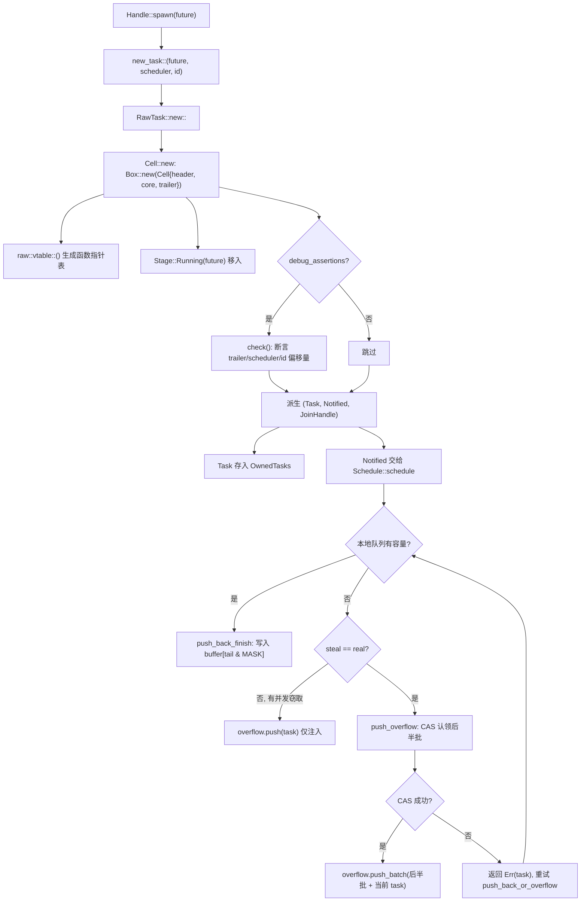
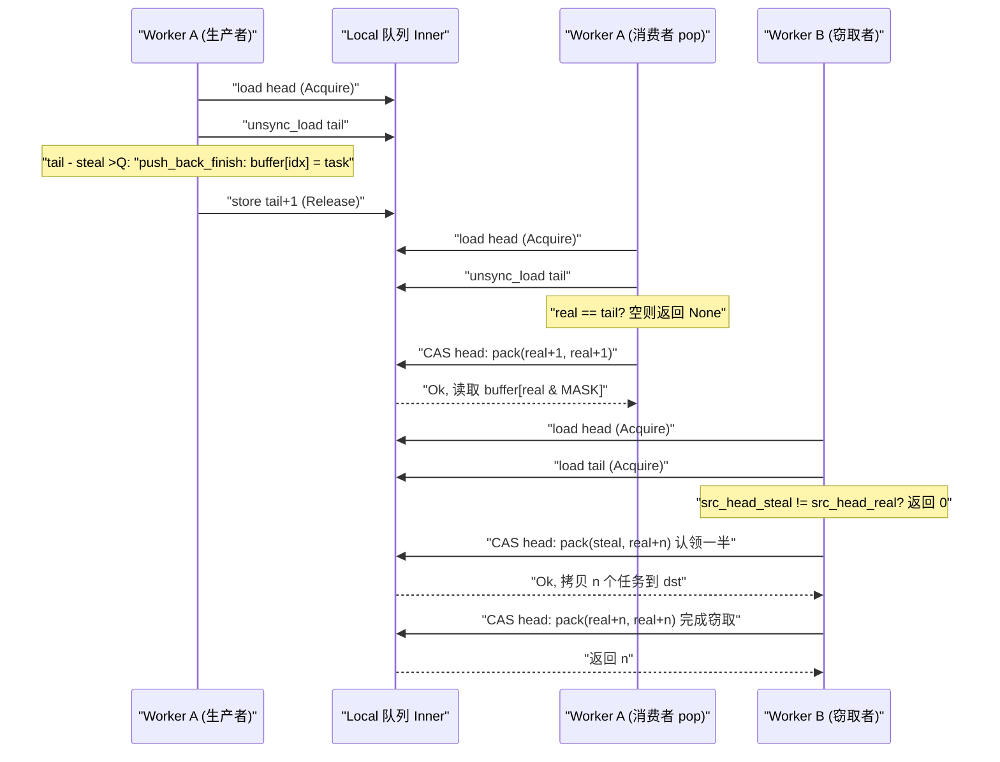

# 제 3 장: 태스크의 일생 (상): spawn이 Future를 어떻게 스케줄 가능한 실체로 만드는가

지난 장에서 우리는 Runtime의 조립을 완료했다: I/O driver, time driver, blocking pool과 스케줄러가 동일한`Runtime`인스턴스에 주입되어,`Handle`이 컴포넌트들에 대한 크로스 스레드 접근을 위한 공유 핸들이 되었다. 하지만 조립된 런타임은 아직 빈 껍데기에 불과하다——태스크를 구동할 엔진은 있지만 구동할 태스크가 없다. 이번 장에서 답할 질문은 바로 이것이다: 당신이`tokio::spawn(async { ... })`을 입력한 그 순간, 그`async`블록은 도대체 무엇을 겪었기에 평범한 Rust 코드에서 '스케줄러가 인수할 수 있고, 깨울 수 있고, join할 수 있는' 실체가 되었는가. 이것은 '태스크의 일생'의 전반부이며, 우리는 탄생에 초점을 맞춘다:`Handle::spawn`에서 출발하여,`new_task`의 참조 카운트 할당을 거쳐,`Cell<T, S>`의 메모리 레이아웃에 도달하고, 최종적으로 태스크가 어떻게 어떤 worker의 로컬 큐나 전역 주입 큐에 투입되는지 명확히 본다. 후반부(제4장)에서야 스케줄링 루프와 poll/wake 폐루프에 진입한다.

# 3.1 Future는 태스크가 아니다: 한 번의 spawn이 도대체 무엇을 창조하는가

## 직관적 모델

`Future`을 '레시피'라고 상상하고, 태스크를 '주방에서 요리되고 있는 한 접시'라고 상상하라. 레시피 자체는 정적이고, 복사 가능하며, 어떤 실행 상태도 없다; 오직 주방(스케줄러)이 '지금 이 요리를 만들자'고 결정하고, 그것에 조리대(worker), 주문 번호(TaskId), 서빙구(JoinHandle)를 할당할 때에야 비로소 '조리 중인 요리'가 된다. 이 래핑이 없다면, 스케줄러는 '이 요리가 어디까지 됐는지', '누가 그것을 기다리는지', '완성되면 누구에게 알릴지'를 알 방법이 없다——그것은 레시피 한 장만 볼 수 있을 뿐, 관리할 수 없다.

## 데이터 구조와 메모리 레이아웃

Tokio는`Task<S>`로 '런타임이 소유한 태스크 참조'를 나타내며, 이것은`RawTask`에 대한 투명한 래퍼다:

```rust
#[repr(transparent)]
pub(crate) struct Task {
    raw: RawTask,
    _p: PhantomData,
}
```

[FACT:tokio/src/runtime/task/mod.rs:233-238]

`#[repr(transparent)]`는`Task<S>`과`RawTask`이 메모리상 완전히 동일하다는 것을 의미하며, 추가 오버헤드가 없다.`PhantomData<S>`은 컴파일 타임의 타입 마커일 뿐이며, 이 태스크가 어떤 스케줄러 타입`S`。

에 속하는지 표시한다. 태스크의 모든 상태를 실제로 담고 있는 것은`Cell<T, S>`이며, 그 레이아웃은 전체 태스크 모듈의 초석이다:

```rust
#[repr(C)]
pub(super) struct Cell {
    pub(super) header: Header,
    pub(super) core: Core,
    pub(super) trailer: Trailer,
}
```

[FACT:tokio/src/runtime/task/core.rs:126-136]

세 필드는 '핫-웜-콜드' 순서로 배열된다.`Header`은 핫 데이터(매 스케줄링, 매 상태 전환마다 접근해야 함)이고,`Core`은 웜 데이터(poll 시 접근)이며,`Trailer`은 콜드 데이터(생성과 소멸 시에만 접근)이다. 주석은 명확히 적고 있다:`Header`은 반드시 첫 번째 필드여야 한다, 왜냐하면 태스크 구조체가 동시에`*mut Cell`과`*mut Header`에 의해 참조되기 때문이다[FACT:tokio/src/runtime/task/core.rs:37-43]。

더 중요한 것은 캐시 라인 정렬이다.`Cell`에는 긴`#[cfg_attr(..., repr(align(...)))]`목록이 달려 있으며, 대상 아키텍처에 따라 정렬 바이트 수를 선택한다: x86_64/aarch64/powerpc64는 128바이트, arm/mips/sparc/hexagon은 32바이트, m68k는 16바이트, s390x는 256바이트, 나머지는 기본 64바이트[FACT:tokio/src/runtime/task/core.rs:64-125]. 주석은 왜 x86_64가 64가 아닌 128을 써야 하는지 설명한다: Intel Sandy Bridge부터 공간 프리페처가 한 번에**쌍을 이루는**64바이트 캐시 라인을 가져오므로, 128바이트로 정렬해야만 거짓 공유를 피할 수 있다[FACT:tokio/src/runtime/task/core.rs:45-53]。

> **[Design Inference & Architectural Trade-offs]**
> 이 정렬 전략의 대가는 각 태스크가 최소한 하나의 캐시 라인 공간을 낭비한다는 것이다. 하지만 태스크 상태 비트(`state`)는 여러 worker 스레드에 의해 고빈도로 읽히고 쓰인다——한 스레드가 poll 시 RUNNING 비트를 설정하고, 다른 스레드가 깨울 때 NOTIFIED 비트를 읽는다——만약 두 태스크의 상태 비트가 같은 캐시 라인에 떨어진다면, 매 상태 전환마다 캐시 라인이 코어 사이를 왔다갔다 튕기는 현상(cache line ping-pong)이 발생하여, 성능 손실이 메모리 낭비를 훨씬 초과한다. Tokio는 공간을 시간과 교환하기로 선택했다.

`Header`자체는 8개의 포인터 크기 이내로 제약된다:

```rust
#[test]
#[cfg(not(loom))]
fn header_lte_cache_line() {
    assert!(std::mem::size_of::() ());
}
```

[FACT:tokio/src/runtime/task/core.rs:591-593]

이 테스트는`Header`이 64바이트(8 × 8)를 초과하지 않도록 보장하여, 64바이트 캐시 라인 아키텍처에서 완전히 한 줄에 들어갈 수 있게 한다.`Header`의 필드는 다음을 포함한다:`state: State`(원자적 상태 비트),`queue_next: UnsafeCell<Option<NonNull<Header>>>`(주입 큐의 연결 리스트 포인터),`vtable: &'static Vtable`(함수 포인터 테이블),`owner_id: UnsafeCell<Option<NonZeroU64>>`(소속`OwnedTasks`리스트의 ID),`scheduled_at: UnsafeCell<ScheduleLatencyInstant>`(스케줄링 지연 측정)[FACT:tokio/src/runtime/task/core.rs:169-198]。

`Core<T, S>`은 스케줄러 핸들`scheduler: S`, 태스크 ID`task_id: Id`, 그리고 가장 핵심적인`stage: CoreStage<T>` [FACT:tokio/src/runtime/task/core.rs:148-165]。`Stage`을 보유한다.

```rust
#[repr(C)]
pub(super) enum Stage {
    Running(T),
    Finished(super::Result),
    Consumed,
}
```

[FACT:tokio/src/runtime/task/core.rs:225-229]

복사`Stage::Running`이것이 바로 'Future와 Output이 같은 메모리 블록을 재사용'하는 핵심이다: 태스크 실행 중에는`Stage::Finished(output)`이 future를 보유하고, 완료 후 제자리에서`JoinHandle`로 교체되며,`Stage::Consumed`。`#[repr(C)]`에 의해 꺼내진 후[FACT:tokio/src/runtime/task/core.rs:225-229]。

`Trailer`이 된다. 주석은 Miri 이슈를 가리키며, 이 레이아웃이 unsafe 코드의 정확성에 강제 요구사항이 있음을 설명한다`owned: linked_list::Pointers<Header>`（`OwnedTasks`은 콜드 데이터를 저장한다:`waker: UnsafeCell<Option<Waker>>`연결 리스트 포인터),`hooks: TaskHarnessScheduleHooks` [FACT:tokio/src/runtime/task/core.rs:205-213]。

## (태스크 완료를 기다리는 소비자 waker),

단계별: spawn에서 큐잉까지`tokio::spawn(async { 42 })`。

**구체적인 시나리오를 대입해보자: multi_thread 런타임에서 worker 스레드 A가** `new_task`을 실행한다. 첫 번째 단계: 태스크 삼종 세트를 구성한다.

```rust
fn new_task(
    task: T,
    scheduler: S,
    id: Id,
    spawned_at: SpawnLocation,
) -> (Task, Notified, JoinHandle)
```

[FACT:tokio/src/runtime/task/mod.rs:336-346]

복사`RawTask::new::<T, S>`이것은`Cell`을 호출하여`raw`을 할당하고, 그런 다음 같은`Task`포인터에서 세 개의 참조를 파생한다:`OwnedTasks`）、`Notified`(owned 참조, 보통 즉시`JoinHandle`에 넣음),[FACT:tokio/src/runtime/task/mod.rs:347-363]。세 가지가 동일한`raw`를 공유하며, 각자 하나의 참조 카운트를 보유한다.

**두 번째 단계:`Cell`를 할당하고 초기 상태를 기록한다.** `Cell::new`힙에 전체 구조체를 할당한다:

```rust
let result = Box::new(Cell {
    trailer: Trailer::new(scheduler.hooks()),
    header: new_header(state, vtable, ...),
    core: Core {
        scheduler,
        stage: CoreStage {
            stage: UnsafeCell::new(Stage::Running(future)),
        },
        task_id,
        ...
    },
});
```

[FACT:tokio/src/runtime/task/core.rs:261-278]

`vtable`는`raw::vtable::<T, S>()`에 의해 생성되며, 특정`T`와`S`에 대해 단형화된 함수 포인터 테이블[FACT:tokio/src/runtime/task/core.rs:260]이다. future는 추가 박싱 없이`Stage::Running`로 직접 이동된다.

**세 번째 단계: debug 어서션으로 레이아웃을 검증한다.**에서`debug_assertions`하에,`Cell::new`는`check`함수를 호출하여`Header::get_trailer`、`Header::get_scheduler`、`Header::get_id_ptr`등 vtable 오프셋 기반 포인터 연산으로 「header를 통해 역조회한 필드 주소」와 「실제 필드 주소」가 일치하는지 하나씩 어서션한다[FACT:tokio/src/runtime/task/core.rs:280-321]. 이는 vtable 오프셋 정확성에 대한 런타임 자체 검증이다.

**네 번째 단계: 스케줄러에 전달한다.**스케줄러가`Notified<S>`를 받은 후`Schedule::schedule` [FACT:tokio/src/runtime/task/mod.rs:315]를 호출한다. multi_thread 하에서는`push_back_or_overflow`를 거쳐 현재 worker의 로컬 큐에 태스크를 푸시하며, 큐가 가득 차면 injection 큐로 오버플로한다.

아래 그림은`new_task`부터 큐 삽입까지의 제어 흐름과 분기를 묘사한다:



이 그림은 몇 가지 핵심 분기를 드러낸다: debug 어서션은 디버그 빌드에서만 적용된다; 로컬 큐가 가득 찼을 때 곧바로 오버플로하는 것이 아니라 먼저 동시 스틸러가 있는지(`steal != real`) 판단하고, 있으면 현재 태스크만 injection 큐에 푸시하는데, 스틸러가 비운 공간이 곧 사용 가능해지기 때문이다.

## 설계 고찰: 왜 하나가 아니라 세 개의 참조인가

`new_task`는 하나가 아닌 세 개의 참조를 반환한다. 이것이 참조 카운팅 설계의 핵심이다:`Task`는 「런타임이 이 태스크를 소유함」을,`Notified`는 「이 태스크가 통지되었고 스케줄 대기 중」을,`JoinHandle`는 「누군가 그 결과에 관심이 있음」을 나타낸다. 세 가지의 수명은 독립적이다——`JoinHandle`는 drop될 수 있고(태스크는 계속 실행되고 결과는 버려짐),`Notified`는 poll 후 사라지며,`Task`는 태스크가 완료되고`OwnedTasks`에서 제거된 후 해제된다. 참조가 하나뿐이라면 「태스크는 아직 실행 중이지만 아무도 join하지 않음」이라는 상태를 표현할 수 없다.

`UnownedTask`는 또 다른 중요한 분기이다: 이것은**두 개의**참조 카운트를 보유하며, blocking 태스크용이다(`OwnedTasks`）[FACT:tokio/src/runtime/task/mod.rs:286-295]。`unowned`에 저장되지 않음).`mem::forget(task)`함수는`mem::forget(notified)`와`UnownedTask` [FACT:tokio/src/runtime/task/mod.rs:388-397]를 통해 두 참조를`OwnedTasks`에 병합한다. 이 「두 개의 참조」 설계 동기는: blocking 태스크에는 owned 참조를 보유할

# 리스트가 없으므로, 태스크가 실행 중에 해제되지 않도록 보장할 추가 참조 카운트가 필요하다.

## 3.2 상태 비트: 하나의 usize로 태스크의 전체 수명 주기를 인코딩하는 방법

직관적 모델**태스크 상태를 「건강 검진 보고서」로 상상해 보자. 그 위에는 여러 독립적인 체크박스가 있다: poll 중인지, 완료되었는지, 통지되었는지, 취소되었는지, join하는 사람이 있는지. Tokio는 여러 개의 불리언 필드를 쓰지 않고 이 체크 비트들을`AtomicUsize`**하나의

## 에 압축했다. 이렇게 하면 매 상태 전환마다 여러 번 잠그는 대신 단 한 번의 CAS만 필요하다. 이 설계가 없다면 태스크 상태 전환은 여러 락의 중첩이 되어 교착 위험과 오버헤드가 치솟을 것이다.

`State`비트필드 레이아웃[FACT:tokio/src/runtime/task/mod.rs:32-53]：

- `RUNNING`의 비트필드는 모듈 문서에 완전히 정의되어 있다**: 태스크가 현재 poll 중인지 또는 취소되었는지.** [FACT:tokio/src/runtime/task/mod.rs:37-38]。
- `COMPLETE`이 비트는 동시에 태스크의 락 역할을 한다`RUNNING`: future가 완전히 완료되어 drop되었음. 한 번 설정되면 절대 지워지지 않으며, 절대[FACT:tokio/src/runtime/task/mod.rs:40-41]。
- `NOTIFIED`와 동시에 설정되지 않음`Notified`: 현재[FACT:tokio/src/runtime/task/mod.rs:43]。
- `CANCELLED`객체가 존재하는지[FACT:tokio/src/runtime/task/mod.rs:45-46]。
- `JOIN_INTEREST`: 태스크를 가능한 한 빨리 취소해야 함`JoinHandle` [FACT:tokio/src/runtime/task/mod.rs:48]。
- `JOIN_WAKER`:[FACT:tokio/src/runtime/task/mod.rs:50-51]。

가 존재함[FACT:tokio/src/runtime/task/mod.rs:53]。

`RUNNING`: join handle waker의 접근 제어 비트`RUNNING`나머지 비트는 참조 카운팅에 사용됨[FACT:tokio/src/runtime/task/mod.rs:130-133]가 락 역할을 한다는 점은 더 짚을 가치가 있다. 모듈 문서의 Safety 섹션은 다음과 같이 지적한다: future에 대한 모든 가변 접근은`RUNNING`비트를 수정하여 락을 획득한 후에만 수행되어야 하며, 이를 통해 배타적 접근을 보장한다

## . 이는 태스크를 poll할 때 스레드가 먼저 CAS로

`JOIN_WAKER`를 설정하고, 성공하면 future를 배타적으로 점유하며, 실패하면 다른 스레드가 poll 중임을 의미하므로 이번 poll은 곧바로 반환됨을 뜻한다. 이것은 「poll의 상호 배제」와 「상태 전환」을 하나의 원자적 연산으로 합쳐 별도의 뮤텍스를 피한다.`waker`JOIN_WAKER의 접근 제어 프로토콜`Trailer`비트는 전체 상태 기계에서 가장 정교한 부분이다. 이것이 해결하는 문제는:**필드(**내)가 두 스레드에 의해 동시 접근된다는 것이다——런타임은 태스크 완료 시`JoinHandle`그것을 읽어**join자를 깨우고,**는 poll 시[FACT:tokio/src/runtime/task/mod.rs:75-120]：

1. `JOIN_WAKER`그것을 써서

waker를 등록한다. 모듈 문서는 7가지 규칙을 제시한다`JoinHandle`는 초기에 0이다.

2.`JoinHandle`가 0일 때,

는 waker 필드에 배타적(가변) 접근 권한을 가진다.`COMPLETE`3.

5. `JoinHandle`가 1일 때,`JOIN_WAKER`는 공유(읽기 전용) 접근 권한만 가진다.`JOIN_WAKER`4.

6. `JoinHandle`가 1이고`COMPLETE`가 1일 때, 런타임은 waker 필드에 공유(읽기 전용) 접근 권한을 가진다.`JOIN_WAKER`waker를 쓰려면: (i)`COMPLETE`를 0으로 성공적으로 설정하여 배타적 권한을 얻고, (ii) waker를 쓰고, (iii)

를 1로 성공적으로 설정해야 한다.`JOIN_INTEREST`는`COMPLETE`가 0일 때만

를 변경할 수 있고, 런타임은`COMPLETE`가 1일 때만 변경할 수 있다.[FACT:tokio/src/runtime/task/mod.rs:110-120]7.

## 가 0이고

`Task`가 1이면, 런타임은 waker 필드에 배타적 접근 권한을 가진다(waker를 drop하기 위해).`UnownedTask`의 drop이 두 번 감소합니다:

```rust
impl Drop for Task {
    fn drop(&mut self) {
        if self.header().state.ref_dec() {
            self.raw.dealloc();
        }
    }
}
```

[FACT:tokio/src/runtime/task/mod.rs:580-586]

```rust
impl Drop for UnownedTask {
    fn drop(&mut self) {
        if self.raw.header().state.ref_dec_twice() {
            self.raw.dealloc();
        }
    }
}
```

[FACT:tokio/src/runtime/task/mod.rs:590-596]

`ref_dec`반환`true`이것이 마지막 참조임을 나타내며, 이때 비로소 실제로 해제됩니다`Cell`메모리.`ref_dec_twice`은`UnownedTask`두 개의 카운트를 보유하는 직접적인 구현입니다.

## 설계 고찰: 왜 상태 비트와 참조 카운트가 하나의 원자를 공유하는가

> **[Design Inference & Architectural Trade-offs]**
> 상태 비트와 참조 카운트를 동일한`AtomicUsize`에 배치한 것은 「참조 카운트 감소」와 「상태 비트 설정」이라는 두 동작을**한 번의 CAS**로 완료할 수 있게 하기 위해서입니다. 모듈 문서는`Schedule::release`의 주석에서 명확히 언급합니다: 「태스크 모듈은 ref-dec과 다른 옵션 설정을 일괄 처리합니다」[FACT:tokio/src/runtime/task/mod.rs:302-304]. 만약 상태 비트와 참조 카운트가 두 개의 원자 변수에 속한다면, 「마지막 참조 해제」와 「완료 표시」 사이에 윈도우가 생겨 추가적인 동기화가 필요합니다. 병합 후,`ref_dec`은 원자적으로 「카운트 감소 + 0인지 확인」을 완료할 수 있어 ABA 류 문제를 방지합니다.

# 3.3 JoinHandle: 결과가 어떻게 태스크 경계를 넘어 반환되는가

## 직관적 모델

`JoinHandle`은 식당이 주는 「진동벨」과 같습니다. 태스크(주방)가 완료되면 요리(output)를 픽업대(`Stage::Finished`)에 놓고, 당신의 진동벨(waker)을 울립니다. 당신은 진동벨을 가지고 가서 받는데, 진동벨 자체는 요리를 보유하지 않고 픽업대를 가리키는 포인터일 뿐입니다. 만약 진동벨을 잃어버리면(drop`JoinHandle`), 요리는 그냥 버려지지만(output이 drop됨), 주방은 그로 인해 멈추지 않습니다.

## 데이터 구조

`JoinHandle<T>`역시`RawTask`에 대한 투명한 래퍼입니다:

```rust
pub struct JoinHandle {
    raw: RawTask,
    _p: PhantomData,
}
```

[FACT:tokio/src/runtime/task/join.rs:163-166]

`PhantomData<T>`은 출력 타입을 표시합니다.`JoinHandle<T>`은`T: Send`일 때만`Send`/`Sync` [FACT:tokio/src/runtime/task/join.rs:169-170]이며, 이는 non-Send 출력이 스레드 간 이동되지 않음을 보장합니다.

## 단계별: JoinHandle을 await하기

`JoinHandle`은`Future`을 구현하며, 그`poll`이 결과 반환의 핵심입니다:

```rust
fn poll(self: Pin, cx: &mut Context) -> Poll {
    ready!(crate::trace::trace_leaf());
    let mut ret = Poll::Pending;
    let coop = ready!(crate::task::coop::poll_proceed(cx));
    unsafe {
        self.raw.try_read_output(&mut ret, cx.waker());
    }
    if ret.is_ready() {
        coop.made_progress();
    }
    ret
}
```

[FACT:tokio/src/runtime/task/join.rs:327-354]

몇 가지 세부 사항에 주목하세요:`trace_leaf`은 tracing 계측에 사용됩니다;`coop::poll_proceed`은 협력 예산을 소비합니다(12장에서 상세 설명);`try_read_output`은 vtable을 통해 제네릭을 소거하고, 반환값을 스택에 놓고`*mut ()`을 통해[FACT:tokio/src/runtime/task/join.rs:327-354]에 전달합니다. 이 「반환값을 스택에 놓는」 기법은 vtable 함수가 반환 타입을 제네릭화할 수 없기`T`때문이며, 원시 포인터를 통해서만 되쓸 수 있습니다.

> **[Design Inference & Architectural Trade-offs]**
> `try_read_output`의 내부 로직(raw.rs에 있으며, 이 장에서는 소스 코드를 제공하지 않음): 먼저`COMPLETE`비트를 확인하고, 이미 설정되어 있으면`take_output`을 호출하여`Stage::Finished`에서 결과를 가져옵니다; 그렇지 않으면`cx.waker()`을`Trailer::waker`필드에 등록하고`Pending`을 반환합니다. 등록 과정은 바로 3.2절의`JOIN_WAKER`프로토콜을 따릅니다.

## 결과의 소유권 이전

모듈 문서의 「Non-Send output」 섹션은 결과의 소유권 규칙을 정확히 설명합니다[FACT:tokio/src/runtime/task/mod.rs:151-170]：

- 태스크 완료 시, output이`Stage`에 놓이고, 그런 다음 「COMPLETE 설정」 변환이 실행되며, 이 시점의`JOIN_INTEREST`값을 읽습니다.
- 만약`JOIN_INTEREST`이 0이면(`JoinHandle`없음), output은 즉시 drop됩니다[FACT:tokio/src/runtime/task/mod.rs:157-158]。
- 만약`JOIN_INTEREST`이 1이면,`JoinHandle`이 output 정리를 담당합니다[FACT:tokio/src/runtime/task/mod.rs:160-161]。

non-Send output에 대해, 문서는 세 단계 논증을 제시합니다: output은 poll future의 스레드에서 생성됩니다;`JoinHandle<Output>`은 Output이 non-Send일 때 역시 non-Send이므로, 이것도 spawn 스레드에 있습니다; 따라서`JoinHandle`이 output을 가져가거나 drop할 때 스레드 간 이동이 발생하지 않습니다[FACT:tokio/src/runtime/task/mod.rs:164-170]。

## JoinHandle의 drop: 빠른 경로와 느린 경로

```rust
impl Drop for JoinHandle {
    fn drop(&mut self) {
        if self.raw.state().drop_join_handle_fast().is_ok() {
            return;
        }
        self.raw.drop_join_handle_slow();
    }
}
```

[FACT:tokio/src/runtime/task/join.rs:358-364]

`drop_join_handle_fast`은 한 번의 CAS로 「`JOIN_INTEREST`비트 지우기 + 참조 카운트 감소」를 완료하려고 시도합니다. 실패하면(예: 태스크가 완료 중이고 상태 비트가 점유됨),`drop_join_handle_slow`의 느린 경로를 따릅니다. 이는 전형적인 「낙관적 빠른 경로 + 비관적 느린 경로」 패턴입니다.

## 설계 고찰: 왜 JoinHandle이 output을 직접 보유하지 않는가

> **[Design Inference & Architectural Trade-offs]**
> 만약`JoinHandle`이 output을 직접 보유한다면, output은 태스크 완료 시`JoinHandle`이 있는 스레드로 이동해야 합니다. 하지만`JoinHandle`은 임의의 스레드로 이동될 수 있으며(`T: Send`이기만 하면), output의 생성 스레드는 poll 스레드입니다. 직접 보유하면 「output이 poll 스레드에서 생성되지만 join 스레드에서 drop되어야 하는」 스레드 간 이동이 발생하여, non-Send output에 대해 타입 시스템을 직접 위반합니다. Tokio는 output을`Cell`에 남겨두는 것을 선택했습니다(`Stage::Finished`），`JoinHandle`은`Cell`을 가리키는`RawTask`만 보유하고, 결과를 가져올 때`take_output`을 통해 제자리에서 가져옵니다. 이렇게 하면 output의 drop이`JoinHandle`이 있는 스레드에서 발생하지만, 전제는 해당 스레드가 poll 스레드와 동일하다는 것입니다(non-Send 시나리오에서 성립).

# 3.4 로컬 큐: work-stealing 생산자-소비자 구조

## 직관적 모델

각 worker는 「개인 할 일 목록」(로컬 큐)을 가지며, 용량은 256입니다. worker 자신은**헤드**에서 태스크를 가져오고(LIFO, 캐시 지역성 활용), 다른 worker는**테일**에서 태스크를 훔칩니다(FIFO, 가장 오래된, 가장 완료되었을 가능성이 높은 태스크를 가져감). 만약 로컬 큐가 없다면, 모든 태스크가 전역 큐에 몰려 매번 태스크를 가져올 때마다 전역 락을 경쟁해야 하며, 멀티코어 확장성이 붕괴될 것입니다.

## 메모리 레이아웃: head와 tail의 분리

```rust
pub(crate) struct Inner {
    head: AtomicUnsignedLong,
    tail: AtomicUnsignedShort,
    buffer: Box>>; LOCAL_QUEUE_CAPACITY]>,
}
```

[FACT:tokio/src/runtime/scheduler/multi_thread/queue.rs:36-57]

`head`은`AtomicUnsignedLong`입니다(64비트, 플랫폼이 u64를 지원하는 경우),`tail`은`AtomicUnsignedShort`입니다(32비트). 주석은 왜 인덱스가 실제로 필요한 것보다 더 넓은지 설명합니다: ABA 완화, 그리고 「가득 참」과 「비어 있음」 버퍼를 구분하기 위해서입니다[FACT:tokio/src/runtime/scheduler/multi_thread/queue.rs:37-49]。

`head`내부적으로**두 개를 패킹했습니다** `UnsignedShort`：낮은 비트는 「실제 헤드」(real head)이고, 높은 비트는 「도둑이 처리 중인 첫 번째 위치」(steal head)입니다. 둘이 같으면 활성 도둑이 없습니다[FACT:tokio/src/runtime/scheduler/multi_thread/queue.rs:39-49]. 이 이중 값 패킹은 work-stealing 큐의 핵심 기법입니다: 도둑이 먼저 steal 값을 CAS로 갱신하여 한 묶음의 작업을 「선점」하고, 완료 후 steal 값을 real 값까지 따라잡게 하여 도둑질이 끝났음을 나타냅니다.

`LOCAL_QUEUE_CAPACITY`non-loom에서는 256이고, loom에서는 더 많은 경계를 테스트하기 위해 4로 줄입니다[FACT:tokio/src/runtime/scheduler/multi_thread/queue.rs:62-69]。`MASK = LOCAL_QUEUE_CAPACITY - 1`, 링 버퍼 인덱스에 사용됩니다[FACT:tokio/src/runtime/scheduler/multi_thread/queue.rs:71]。

## Step-by-Step: push_back_or_overflow의 전체 분기

이것은 로컬 큐에서 가장 복잡한 함수입니다. 분기별로 분석해 보겠습니다:

```rust
pub(crate) fn push_back_or_overflow>(
    &mut self,
    mut task: task::Notified,
    overflow: &O,
    stats: &mut Stats,
) {
    let tail = loop {
        let head = self.inner.head.load(Acquire);
        let (steal, real) = unpack(head);
        let tail = unsafe { self.inner.tail.unsync_load() };

        if tail.wrapping_sub(steal)  return,
                Err(v) => { task = v; }
            }
        }
    };
    self.push_back_finish(task, tail);
}
```

[FACT:tokio/src/runtime/scheduler/multi_thread/queue.rs:188-223]

세 가지 분기:

1. **용량 있음**（`tail - steal < CAPACITY`）：`break tail`, 루프를 빠져나온 후 호출`push_back_finish`버퍼에 씁니다.

2. **용량 없지만 동시 도둑 있음**（`steal != real`): 도둑이 공간을 확보하므로 현재 작업만 주입 큐에 푸시하고 즉시 반환[FACT:tokio/src/runtime/scheduler/multi_thread/queue.rs:204-208]。

3. **용량 없고 도둑도 없음**: 호출`push_overflow`후반부 작업을 주입 큐로 오버플로[FACT:tokio/src/runtime/scheduler/multi_thread/queue.rs:209-219]. CAS 실패 시(동시 도둑에게 패배),`push_overflow`반환`Err(task)`, 루프 재시도.

`push_back_finish`작업을 쓰고 tail 갱신:

```rust
fn push_back_finish(&self, task: task::Notified, tail: UnsignedShort) {
    let idx = tail as usize & MASK;
    self.inner.buffer[idx].with_mut(|ptr| {
        unsafe { ptr::write((*ptr).as_mut_ptr(), task); }
    });
    self.inner.tail.store(tail.wrapping_add(1), Release);
}
```

[FACT:tokio/src/runtime/scheduler/multi_thread/queue.rs:226-244]

`Release`순서는 쓰인 작업이 도둑에게 보이도록 보장합니다.

## push_overflow: 왜 후반부를 오버플로하는가

```rust
const NUM_TASKS_TAKEN: UnsignedShort = (LOCAL_QUEUE_CAPACITY / 2) as UnsignedShort;
```

[FACT:tokio/src/runtime/scheduler/multi_thread/queue.rs:265]

오버플로 시 128개 작업을 가져갑니다. 주석은 왜**후반부**를 가져가는지 전반부가 아닌지 자세히 설명합니다[FACT:tokio/src/runtime/scheduler/multi_thread/queue.rs:295-306]: 주입 큐에서 작업을 가져올 때는 항상 전반부에 놓입니다. 따라서 작업이 후반부에 있으면 방금 주입 큐에서 가져온 것이 아님을 확신할 수 있습니다. 이는 「주입 큐에서 꺼낸 작업이 즉시 주입 큐로 되돌아가지 않음」(적어도 한 번 poll되기 전까지)을 보장합니다.

CAS로 후반부 선점:

```rust
if self.inner.head.compare_exchange_weak(
    pack(head, head), pack(tail, tail), Release, Relaxed
).is_err() {
    return Err(task);
}
```

[FACT:tokio/src/runtime/scheduler/multi_thread/queue.rs:283-293]

`head`를`(head, head)`에서`(tail, tail)`로 갱신, 즉 steal과 real을 동시에 tail로 진행시켜 모든 작업을 선점합니다. 성공 후 tail을`tail + NUM_TASKS_TAKEN`로 되돌려 전반부가 여전히 로컬 큐에 남아 있음을 나타냅니다[FACT:tokio/src/runtime/scheduler/multi_thread/queue.rs:314-316]。

## pop과 steal_into: 작업을 가져오는 두 경로

`pop`는 worker 자신이 작업을 가져오는 것(헤드에서, LIFO):

```rust
pub(crate) fn pop(&mut self) -> Option> {
    let mut head = self.inner.head.load(Acquire);
    let idx = loop {
        let (steal, real) = unpack(head);
        let tail = unsafe { self.inner.tail.unsync_load() };
        if real == tail { return None; }
        let next_real = real.wrapping_add(1);
        let next = if steal == real {
            pack(next_real, next_real)
        } else {
            assert_ne!(steal, next_real);
            pack(steal, next_real)
        };
        let res = self.inner.head.compare_exchange_weak(head, next, AcqRel, Acquire);
        match res {
            Ok(_) => break real as usize & MASK,
            Err(actual) => head = actual,
        }
    };
    Some(self.inner.buffer[idx].with(|ptr| unsafe { ptr::read(ptr).assume_init() }))
}
```

[FACT:tokio/src/runtime/scheduler/multi_thread/queue.rs:361-399]

핵심 분기:`steal == real`(도둑 없음)이면 둘 다 진행하고, 그렇지 않으면 real만 진행하고 steal은 그대로 유지[FACT:tokio/src/runtime/scheduler/multi_thread/queue.rs:377-384]。`assert_ne!(steal, next_real)`real이 steal 위치까지 진행되지 않도록 보장합니다. 그렇지 않으면 도둑의 선점 상태가 깨집니다.

`steal_into`는 도둑 경로로, 먼저 대상 큐에 충분한 공간이 있는지 확인합니다:

```rust
if dst_tail.wrapping_sub(steal) > LOCAL_QUEUE_CAPACITY as UnsignedShort / 2 {
    return None;
}
```

[FACT:tokio/src/runtime/scheduler/multi_thread/queue.rs:431-435]

대상 큐가 절반 이상 차면 도둑질하지 않아, 도둑질 후 즉시 다시 오버플로하는 것을 방지합니다.

`steal_into2`는 도둑질의 핵심으로, 도둑질 수량을 계산합니다:

```rust
let n = src_tail.wrapping_sub(src_head_real);
let n = n - n / 2;
```

[FACT:tokio/src/runtime/scheduler/multi_thread/queue.rs:487-488]

절반(올림)을 도둑질합니다. 그런 다음 head의 steal 값을 CAS로 갱신하여 선점:

```rust
let steal_to = src_head_real.wrapping_add(n);
next_packed = pack(src_head_steal, steal_to);
let res = self.0.head.compare_exchange_weak(prev_packed, next_packed, AcqRel, Acquire);
```

[FACT:tokio/src/runtime/scheduler/multi_thread/queue.rs:496-506]

여기서는 real 값만 갱신되었음에 주의(`pack(src_head_steal, steal_to)`에서 steal은 변경되지 않음), real을`steal_to`로 진행시킵니다. 이는 「이 작업들이 선점되었으니 다른 도둑은 더 이상 건드릴 수 없음」을 나타냅니다. 도둑질 완료 후 steal을 real까지 따라잡게 합니다:

```rust
loop {
    let head = unpack(prev_packed).1;
    next_packed = pack(head, head);
    let res = self.0.head.compare_exchange_weak(prev_packed, next_packed, AcqRel, Acquire);
    match res {
        Ok(_) => return n,
        Err(actual) => prev_packed = actual,
    }
}
```

[FACT:tokio/src/runtime/scheduler/multi_thread/queue.rs:548-561]

아래 시퀀스 다이어그램은 「생산자 push, 소비자 pop, 도둑 steal」 삼자 동시 상호작용을 묘사합니다:



## 설계 사고: 왜 로컬 큐는 LIFO이고 도둑질은 FIFO인가

> **[Design Inference & Architectural Trade-offs]**
> worker 자신은 헤드에서 가져옵니다(LIFO). 가장 최근에 푸시된 작업이 CPU 캐시에 아직 남아 있을 가능성이 가장 높고, 「방금 깨어나 데이터가 아직 뜨거운」 작업일 가능성이 가장 높기 때문입니다. 도둑은 테일에서 가져옵니다(FIFO). 가장 오래된 작업이 이미 대부분의 작업을 완료했을 가능성이 가장 높아, 그것을 도둑질하면 피해자의 부하를 가장 빠르게 줄일 수 있기 때문입니다. 이 「LIFO 로컬 + FIFO 도둑질」 조합은 work-stealing 스케줄링의 고전적 설계로, 캐시 지역성과 부하 균형을 모두 고려합니다.

여기까지 작업은 Future에서 스케줄 가능한 실체로의 변신을 완료했습니다: 참조 카운트가 할당되고,`Cell`의 메모리 레이아웃에 들어가, worker의 로컬 큐나 전역 주입 큐에 성공적으로 전달되었습니다. 하지만 작업이 큐에 들어가는 것은 시작일 뿐, 실제로 그것을 움직이게 하는 것은 worker 스레드의 스케줄링 루프입니다. 다음 장에서는 「작업의 일생」 하반부로 들어가, worker가 큐에서 작업을 꺼내`Future::poll`을 호출하고,`Pending`반환 시`Waker`을 통해 깨우기를 등록하여 최종적으로`schedule`재입대를 트리거하는——「깨우기 → 입대 → 재 poll」이라는 이闭环의 완전한 호출 경로, 그리고 work-stealing 전략과 LIFO 슬롯 최적화가 거기서 밝혀질 것입니다.
