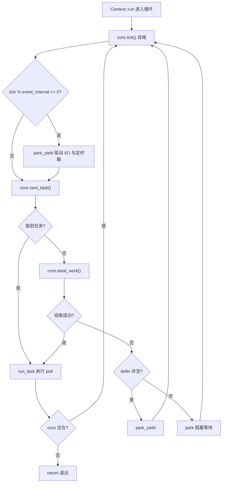
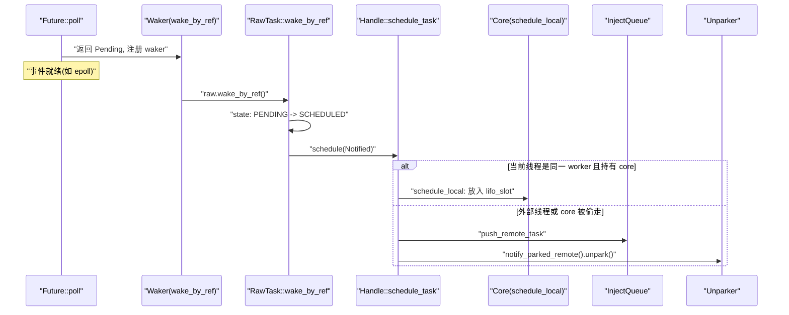
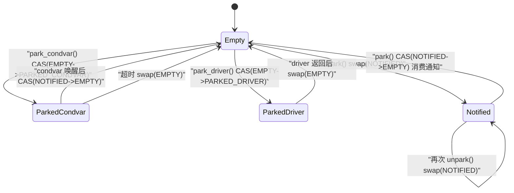

# 제 4 장: 작업의 일생(하): 스케줄링 루프, poll과 깨우기의 闭环

# 큐에서 실행까지: worker 메인 루프의 골격

이전 장에서 우리는 작업을`Local`큐나 전역 주입 큐에 넣었습니다. 하지만 큐는 「할 일 목록」일 뿐, 실제로 작업을 돌게 하는 것은 worker 스레드 안의 멈추지 않는 루프입니다. 이 장에서는`Context::run`——전체 멀티스레드 스케줄러의 심장——을 추적합니다.

먼저 직관을 세웁니다: worker 스레드는 요리사와 같아, 앞에 자신의 주문 더미(`run_queue`)가 있고, 옆에 공용 주문 선반(`inject`)도 있습니다. 요리사는 먼저 자신 손에 가장 가까운 한 장을 봅니다(`lifo_slot`), 없으면 자기 더미에서 가져오고, 그것도 없으면 공용 선반에서 한 줌 집어오고, 그래도 안 되면 다른 요리사의 더미에서 몇 장 훔쳐온다. 전부 비었을 때만 휴식을 취하는데, 휴식 중에도 귀를 세우고 있어서—주문이 들어오면 즉시 깨어난다.

이 루프가 없으면, 태스크는 큐에 들어간 후 영원히 큐에 누워 있게 되고,`Future::poll`영원히 호출되지 않으며, 전체 런타임은 죽은 데이터 덩어리에 불과하다.

## Core의 메모리 레이아웃과 상태 필드

worker의 가변 상태는 전부`Core`안에 들어 있으며, 이것은`Box`에 의해 힙에 할당되고,`AtomicCell<Core>`를 통해`Worker`와 스레드 로컬`Context`사이에서 전달된다.

`Core`의 핵심 필드는 다음과 같다[FACT:tokio/src/runtime/scheduler/multi_thread/worker.rs:113-167]：

- `tick: u32`: 매 루프마다 자동 증가하며, 주기적으로 유지보수(`maintenance`)와 전역 큐 검사를 트리거하는 데 사용된다.
- `lifo_slot: Option<Notified>`：**LIFO 슬롯**, 이것이 이 장에서 가장 정교한 설계다. worker가 스스로 태스크를 스케줄할 때, 그것은`run_queue`에 들어가지 않고 이 슬롯에 넣으며, 다음에 태스크를 가져올 때**우선적으로**여기서 꺼낸다.
- `lifo_enabled: bool`: LIFO 슬롯의 스위치로, ping-pong 시나리오에서의 기아를 방지하는 데 사용된다.
- `run_queue: queue::Local<Arc<Handle>>`: 로컬 큐, 이전 장에서 분석한`Local`구조.
- `is_searching: bool`: worker가 훔칠 수 있는 태스크를 검색 중인지 여부.
- `is_shutdown: bool` / `is_traced: bool`: 종료 및 추적 플래그.
- `park: Option<Parker>`: parker,`Option`로 감싼 것은 borrow checker 아래에서 편리하게 꺼내고/되돌려 놓기 위해서다.
- `global_queue_interval: u32`: 전역 큐를 얼마나 자주 검사할지.
- `rand: FastRand`: 빠른 난수 생성기, 훔치기 시작점을 무작위로 선택하는 데 사용된다.

> **[Design Inference & Architectural Trade-offs]**
> 주목하라,`lifo_slot`는`Option<Notified>`이지 큐가 아니다—그것은 단지**하나의**태스크만 저장한다. 이 설계 동기는 소스 주석에 명확히 나와 있다[FACT:tokio/src/runtime/scheduler/multi_thread/worker.rs:117-121]: worker가 스스로 스케줄한 태스크는 이 슬롯에 저장되고, worker는`run_queue` **을 검사하기 전에**먼저 이것을 검사하며, 효과는 「마지막으로 스케줄된 태스크가 다음에 실행된다」(LIFO)이다. 이는 지역성을 개선하기 위한 것으로, 메시지 전달 패턴에 특히 효과적이며 지연을 낮춘다.

왜 LIFO가 지연을 낮추는가? 전형적인 메시지 전달 시나리오를 고려하자: 태스크 A가 메시지를 처리한 후 태스크 B를 깨우고, B가 처리한 후 다시 A를 깨운다. A가 B를 깨운 후 B가 즉시 실행되면, B가 필요로 하는 데이터는很可能 아직 CPU 캐시에 남아 있을 것이다(A가 방금 건드렸으므로). B가 큐 꼬리에 밀려나 앞의 수십 개 태스크가 실행될 때까지 기다리면, 캐시는 이미 밀려나 버린다.

그러나 LIFO에는 기아 위험이 있다. 소스는`MAX_LIFO_POLLS_PER_TICK = 3`를 사용하여[FACT:tokio/src/runtime/scheduler/multi_thread/worker.rs:263-263]을 제한한다: 각 tick마다 최대 3번 LIFO 슬롯을 우선하며, 초과하면 비활성화하여 다른 태스크가 실행될 기회를 갖게 한다.

## 메인 루프 walkthrough: 하나의 완전한 스케줄링 주기

구체적인 시나리오를 대입해 보자: worker 0이 방금`park`에서 깨어났고,`run_queue`에 5개의 태스크가 있으며,`lifo_slot`에 1개의 태스크가 있고, 전역 큐에 3개의 태스크가 있다.

메인 루프 진입점은`Context::run` [FACT:tokio/src/runtime/scheduler/multi_thread/worker.rs:570-642]이다. 먼저`lifo_enabled`을 재설정하고(core가`block_in_place`에 의해 훔쳐졌을 수 있으므로 상태를 원위치시켜야 함)[FACT:tokio/src/runtime/scheduler/multi_thread/worker.rs:571-573], 그런 다음`while !core.is_shutdown`루프에 들어간다.

매 루프마다 네 가지를 한다:

**첫 번째 단계: tick과 유지보수.** `core.tick()`자동 증가 카운터[FACT:tokio/src/runtime/scheduler/multi_thread/worker.rs:587]. 이어서`self.maintenance(core)`가`tick % event_interval == 0`을 검사하고, 그렇다면`park_yield`를 호출하여 0 타임아웃으로 I/O와 타이머를 구동한다[FACT:tokio/src/runtime/scheduler/multi_thread/worker.rs:809-826]。

**두 번째 단계: 태스크 가져오기.** `core.next_task(&self.worker)`는 핵심 태스크 가져오기 로직이다[FACT:tokio/src/runtime/scheduler/multi_thread/worker.rs:1090-1156]. 두 가지 경로로 나뉜다:

- 当`tick % global_queue_interval == 0`일 때,**우선적으로**전역 큐에서 가져오고, 가져오지 못하면 로컬[FACT:tokio/src/runtime/scheduler/multi_thread/worker.rs:1091-1098]을 가져온다. 이는 전역 큐의 태스크가 굶주리는 것을 방지하기 위해서다.
- 그렇지 않으면**우선적으로**로컬 태스크를 가져온다[FACT:tokio/src/runtime/scheduler/multi_thread/worker.rs:1090-1156]。

로컬 태스크 가져오기는`next_local_task`에 의해 완료된다[FACT:tokio/src/runtime/scheduler/multi_thread/worker.rs:1158-1160]：

```rust
fn next_local_task(&mut self) -> Option {
    self.lifo_slot.take().or_else(|| self.run_queue.pop())
}
```

먼저 LIFO 슬롯을 가져오고, 그다음 큐 헤드를 가져온다(LIFO 팝). 이것이 이전 장에서 말한 「로컬 LIFO」다.

로컬이 비었지만 전역 큐가 비어 있지 않으면, worker는**배치로**전역 큐에서 태스크를 가져온다[FACT:tokio/src/runtime/scheduler/multi_thread/worker.rs:1110-1154]. 배치 크기`n`의 계산은 매우 정교하다:`min(inject.len() / remotes.len() + 1, cap)`, 여기서`cap`는 다시`min(remaining_slots, max_capacity / 2)`을 취한다. 소스 주석은 왜 큐 용량의 절반으로 제한하는지 설명한다[FACT:tokio/src/runtime/scheduler/multi_thread/worker.rs:1120-1131]: 가져온 태스크가 로컬 큐의**전반부**에 떨어지도록 보장하여, 이후 오버플로가 발생하더라도 이 태스크들이 전역 큐로 다시 밀려나지 않도록 한다(오버플로는 후반부에만 영향을 미침).

**세 번째 단계: 태스크 실행.**태스크를 얻은 후`run_task` [FACT:tokio/src/runtime/scheduler/multi_thread/worker.rs:647-796]을 호출한다. 이것은 이 장에서 가장 복잡한 함수이며, 다음 절에서专门展开한다.

**네 번째 단계: 훔치기 또는 park.**만약`next_task`가`None`을 반환하면, 로컬과 전역 모두 할 일이 없다는 뜻이므로`steal_work` [FACT:tokio/src/runtime/scheduler/multi_thread/worker.rs:1167-1195]을 호출한다. 훔치기 실패 시`park`또는`park_yield` [FACT:tokio/src/runtime/scheduler/multi_thread/worker.rs:613-621]。

에 들어간다. 전체 제어 흐름은 다음과 같다:



## run_task: poll과 LIFO 슬롯의 폐루프

`run_task`는 태스크가 실제로`poll`되는 곳이며, 「깨우기 → 인큐 → 재-poll」 폐루프의 수렴점이기도 하다.

함수에 들어간 후 첫 번째 일은`assert_owner` [FACT:tokio/src/runtime/scheduler/multi_thread/worker.rs:648]으로,`Notified`을`Task`로 변환하고, 동시에 현재 스레드가 действительно 이 태스크의 owner임을 단언한다(debug 단언).

이어서`transition_from_searching` [FACT:tokio/src/runtime/scheduler/multi_thread/worker.rs:652]—만약 worker가 이전에 검색 상태였다면, 이제 태스크를 찾았으므로 검색 상태를 종료하고, 다른 parked worker를 깨울 수 있다.

그다음은 핵심 budget 감싸기[FACT:tokio/src/runtime/scheduler/multi_thread/worker.rs:695-795]：

```rust
coop::budget(|| {
    task.run();
    let mut lifo_polls = 0;
    loop {
        let mut core = match self.core.borrow_mut().take() {
            Some(core) => core,
            None => return ControlFlow::Break(()),
        };
        let task = match core.lifo_slot.take() {
            Some(task) => task,
            None => {
                self.reset_lifo_enabled(&mut core);
                core.stats.end_poll();
                return ControlFlow::Continue(core);
            }
        };
        if !coop::has_budget_remaining() {
            core.run_queue.push_back_or_overflow(task, ...);
            return ControlFlow::Continue(core);
        }
        lifo_polls += 1;
        if lifo_polls >= MAX_LIFO_POLLS_PER_TICK {
            core.lifo_enabled = false;
        }
        let task = self.worker.handle.shared.owned.assert_owner(task);
        *self.core.borrow_mut() = Some(core);
        task.run();
    }
})
```

이 코드는 LIFO 슬롯의 완전한 폐루프를 드러낸다:`task.run()`가`Future::poll`를 실행하고, poll 과정에서 태스크가 자신이나 다른 태스크를 깨우면,`schedule_local`가 새 태스크를`lifo_slot` [FACT:tokio/src/runtime/scheduler/multi_thread/worker.rs:1396-1408]에 넣는다. poll이 반환된 후 루프는 즉시`lifo_slot`를 검사하고, 태스크가 있으면 계속 실행한다—**메인 루프로 돌아가지 않고**, 같은 budget 내에서 연속 poll한다.

이것이 LIFO 경로에서의 「깨우기 → 인큐 → 재-poll」의 구현이다: 깨울 때 태스크가`lifo_slot`에 들어가고, poll 반환 후 즉시 꺼내져 재-poll되어 긴밀한 폐루프를 형성한다.

주목하라,`self.core.borrow_mut().take()`의`None`분기[FACT:tokio/src/runtime/scheduler/multi_thread/worker.rs:716-724]: 만약 core가 훔쳐졌다면(예: 태스크 내에서`block_in_place`를 호출한 경우), worker는 반드시`ControlFlow::Break(())`를 반환하여`Context::run`가 종료되도록 해야 한다. 이것은`block_in_place`스케줄링 루프와의 상호작용 지점.

## 깨우기 경로: Waker가 어떻게 재큐잉을 트리거하는가

当`Future::poll`가`Pending`를 반환할 때, 태스크는`Waker`를 등록해야 하며, 이벤트가 준비되면 깨어납니다. Tokio의`Waker`구현은 극도로 간결합니다——태스크`Header`를 가리키는 원시 포인터와 vtable 하나일 뿐입니다.

`waker_ref`를 구성하고,`WakerRef` [FACT:tokio/src/runtime/task/waker.rs:11-34]로`ManuallyDrop`를 감싸서`Waker`drop 시 참조 카운트가 감소하는 것을 방지합니다. vtable은 정적[FACT:tokio/src/runtime/task/waker.rs:119-119]：

```rust
static WAKER_VTABLE: RawWakerVTable =
    RawWakerVTable::new(clone_waker, wake_by_val, wake_by_ref, drop_waker);
```

네 함수 모두 원시 포인터를`Header`로 복원한 다음,`RawTask`의 해당 메서드를 호출합니다[FACT:tokio/src/runtime/task/waker.rs:70-116]. 예를 들어`wake_by_ref`는 최종적으로`raw.wake_by_ref()` [FACT:tokio/src/runtime/task/waker.rs:106-116]。

`wake_by_ref`를 호출합니다. 그 의미는: 태스크 상태를`PENDING`에서`SCHEDULED`로 전환하고, 전환이 성공하면(즉, 이전에 실제로 PENDING이었다면),`Schedule::schedule`를 호출하여 태스크를 다시 큐에 넣습니다.

멀티스레드 스케줄러의 경우,`schedule`의 구현은`Handle::schedule_task` [FACT:tokio/src/runtime/scheduler/multi_thread/worker.rs:1353-1376]：

```rust
pub(super) fn schedule_task(&self, task: Notified, is_yield: bool) {
    with_current(|maybe_cx| {
        if let Some(cx) = maybe_cx {
            if self.ptr_eq(&cx.worker.handle) {
                if let Some(core) = cx.core.borrow_mut().as_mut() {
                    self.schedule_local(core, task, is_yield);
                    return;
                }
            }
        }
        self.push_remote_task(task);
        self.notify_parked_remote();
    });
}
```

로직이 두 갈래로 나뉩니다:

- 현재 스레드가 이 스케줄러의 worker이고 core를 보유하고 있다면,`schedule_local` [FACT:tokio/src/runtime/scheduler/multi_thread/worker.rs:1385-1417]를 통해——LIFO 슬롯이나 로컬 큐에 넣습니다.
- 그렇지 않으면(외부 스레드에서 깨우거나 core가 도난당한 경우),`push_remote_task`를 통해 전역 주입 큐에 푸시하고,`notify_parked_remote`로 parked worker를 깨웁니다[FACT:tokio/src/runtime/scheduler/multi_thread/worker.rs:1379-1383]。

`schedule_local`내부적으로 다시 두 갈래로 나뉩니다[FACT:tokio/src/runtime/scheduler/multi_thread/worker.rs:1385-1417]: 만약`yield`이거나 LIFO가 비활성화된 경우,`run_queue`의 꼬리에 푸시하고; 그렇지 않으면`lifo_slot`에 넣고, 원래 슬롯에 있던 태스크를 큐 꼬리로 밀어냅니다.



## park와 unpark: 상태 머신과 깨우기의 원자성

worker가 할 일이 없을 때 park해야 하지만, park/unpark는 경쟁 조건이 가장 쉽게 발생하는 곳입니다. Tokio는`AtomicUsize`상태 머신과`Condvar`를 보완책으로 사용하여 해결합니다.

`Inner`의 필드[FACT:tokio/src/runtime/scheduler/multi_thread/park.rs:31-43]：`state: AtomicUsize`、`mutex: Mutex<()>`、`condvar: Condvar`、`shared: Arc<Shared>`. 상태 상수는 네 개[FACT:tokio/src/runtime/scheduler/multi_thread/park.rs:36-45]：

- `EMPTY = 0`: park되지 않음.
- `PARKED_CONDVAR = 1`: condvar에서 park.
- `PARKED_DRIVER = 2`: I/O driver에서 park.
- `NOTIFIED = 3`: 이미 깨어남.

이것은 명시적 상태 머신이며, 우리는 이를 사용하여 상태 다이어그램을 그립니다(이것이 이 장에서`stateDiagram-v2`진입 조건에 부합하는 유일한 곳입니다——소스 코드에 실제로 이 네 가지 상태 상수가 존재합니다):



`unpark`의 구현[FACT:tokio/src/runtime/scheduler/multi_thread/park.rs:277-290]은`swap`를 사용하고 CAS가 아닙니다. 소스 코드 주석에서 그 이유를 설명합니다[FACT:tokio/src/runtime/scheduler/multi_thread/park.rs:277-290]: park 스레드가 unpark 이전의 쓰기를 관찰할 수 있도록 release 연산을 수행해야 하므로, state가 이미`NOTIFIED`이더라도 한 번 써야 합니다.

`park`은 먼저 기존 알림을 소비하려고 시도합니다[FACT:tokio/src/runtime/scheduler/multi_thread/park.rs:132-149]: 만약 CAS`NOTIFIED -> EMPTY`가 성공하면, 이전에 이미 깨어났음을 의미하므로 블로킹 없이 직접 반환합니다. 그렇지 않으면 driver 잠금을 시도하고, 획득하면 driver에서 park하고, 획득하지 못하면 condvar를 보완책으로 사용합니다[FACT:tokio/src/runtime/scheduler/multi_thread/park.rs:143-148]。

`park_condvar`에는 고전적인 이중 검사[FACT:tokio/src/runtime/scheduler/multi_thread/park.rs:162-180]가 있습니다`EMPTY -> PARKED_CONDVAR`: 먼저 CAS`NOTIFIED`, 만약 실패하고`swap(EMPTY)`라면, 상태를 설정하기 전에 깨어났음을 의미하므로, 이때 반드시[FACT:tokio/src/runtime/scheduler/multi_thread/park.rs:167-177]를 통해 unpark의 쓰기를 동기화해야 합니다`NOTIFIED`. 주석에서 특히 강조합니다:`NOTIFIED`임을 알고 있더라도 반드시 한 번 읽어야 합니다. 왜냐하면 unpark가 우리가

`unpark_condvar`를 읽은 후에 다시 호출되었을 수 있기 때문입니다.[FACT:tokio/src/runtime/scheduler/multi_thread/park.rs:292-307]의 주석`PARKED`은 condvar의 고전적인 함정을 지적합니다: parked 스레드가`wait`상태를 설정하는 것과 실제로`mutex`사이에 윈도우 기간이 있으며, 이 기간 동안 notify가 발생하면 무시됩니다. 해결책은 park 스레드가 이때`drop(self.mutex.lock())`를 보유하고, unpark 스레드가 먼저`notify_one`。

# 로 잠금을 획득하여(park 스레드가 해제할 때까지 대기), 그런 다음

> **[Design Inference & Architectural Trade-offs]**
> 〔설계 추론과 아키텍처 트레이드오프〕

`MAX_LIFO_POLLS_PER_TICK = 3`단일 슬롯 설계는 의도적인 트레이드오프입니다. 큐를 사용하면 매번 깨울 때마다 큐에 넣고, 매번 태스크를 가져올 때마다 큐에서 꺼내야 하므로 오버헤드가 더 큽니다; 또한 큐는 여러 태스크를 축적하여 "가장 최근에 깨어난 것이 가장 먼저 실행된다"는 지역성 가정을 깨뜨립니다. 단일 슬롯의 의미는 "가장 최근 하나만 기억한다"이며, 밀려난 태스크는 일반 큐로 들어갑니다——이는 지역성 수익 체감의 법칙에 정확히 부합합니다: 가장 최근 태스크가 가장 뜨겁고, 두 번째가 그 다음이며, 세 번째부터는 수익이 매우 작아집니다.[FACT:tokio/src/runtime/scheduler/multi_thread/worker.rs:263-263]이 매직 넘버

도 경험값입니다. 소스 코드 주석에 따르면 "LIFO 슬롯을 몇 번 실행하는 것만으로도 지역성 이점을 누리기에 충분해 보이며, 3회를 초과하면 과도하게 가중될 수 있다"고 합니다. 이는 A가 B를 깨우고, B가 A를 깨우는 핑퐁 시나리오가 다른 태스크를 기아 상태에 빠뜨리는 것을 방지합니다.`steal_work`또 다른 주목할 만한 설계는[FACT:tokio/src/runtime/scheduler/multi_thread/worker.rs:1158-1160]의 "절반 검색" 전략`transition_to_searching`입니다`idle.transition_worker_to_searching()`: worker의 절반 미만이 검색 중일 때만 새 worker가 실제로 훔치기를 시도합니다. 이는 모든 worker가 동시에 미친 듯이 훔치려고 시도하여 발생하는 CAS 경쟁을 방지합니다.[FACT:tokio/src/runtime/scheduler/multi_thread/worker.rs:1197-1203]。

은[FACT:tokio/src/runtime/scheduler/multi_thread/worker.rs:1172-1174]를 통해[FACT:tokio/src/runtime/scheduler/multi_thread/worker.rs:1179-1182]를 조정합니다`steal_into`훔치기는 무작위 시작점에서 시작하여[FACT:tokio/src/runtime/scheduler/multi_thread/worker.rs:1197-1203]。

# , 모든 remote를 순회하고, 자신을 건너뛰고

,`Context::run`를 호출하여 훔치기를 시도합니다. 모두 실패하면 전역 큐로 폴백합니다`run_task`이 장 요약`run_task`worker 메인 루프`Waker`는 스케줄러의 심장입니다: 매 라운드 tick 후 먼저 태스크를 가져오고(LIFO 슬롯 → 로컬 큐 → 전역 큐), 가져오면`wake_by_ref`를 실행하여 poll하고, 가져오지 못하면 훔치고, 훔치기 실패하면 park합니다.`schedule`내부의 LIFO 루프는 "깨우기 → 큐잉 → 재poll"을 동일한 budget 내에 압축하여 저지연 폐루프를 형성합니다.`park`/`unpark`는 원시 포인터와 정적 vtable이며,

는 상태 전환을 통해`Waker`를 트리거하고, 현재 스레드가 동일한 worker인지에 따라 로컬 큐로 갈지 전역 큐로 갈지 결정합니다.`AsyncFd`는 4상태 원자 머신과 condvar 보완책을 사용하여 깨우기 손실의 고전적인 경쟁 조건을 해결합니다.`Pending`다음 장에서 우리는 스케줄러를 떠나 I/O 세계로 들어갑니다: Reactor가 어떻게 epoll 이벤트를`Ready`。

# 깨우기로 변환하여

의`next_local_task`를`run_queue`다시 가져오면`lifo_slot`, 메시지 전달이密集한 시나리오에서 어떤 결과가 발생하는가?

**참고 해석**：`next_local_task`현재 구현은`self.lifo_slot.take().or_else(|| self.run_queue.pop())` [FACT:tokio/src/runtime/scheduler/multi_thread/worker.rs:1158-1160], LIFO 슬롯을 먼저 가져온다. 만약 반대로 먼저 가져온다면`run_queue`, 방금 깨어나고 데이터가 아직 뜨거운 작업이 큐의 다른 작업 뒤에 밀려 실행된다. A→B→A 메시지 전달 패턴에서 B는 깨어난 후 즉시 실행되지 않고 큐의 다른 작업이 끝날 때까지 기다리며, 이때 A가 쓴 데이터는 이미 CPU 캐시에서 밀려나 지역성 이점을 잃는다. 더 심각한 것은,`lifo_slot`의 작업이`run_queue`이 비워질 때까지 계속 기다려 지연이 현저히 증가한다. 소스 주석[FACT:tokio/src/runtime/scheduler/multi_thread/worker.rs:117-121]은 이 순서가 「지역성을 개선하고 메시지 전달 패턴의 이점을 누리며 지연을 낮추기 위함」이라고 명확히 밝힌다.

Q2: `park_condvar`에서 만약`Err(NOTIFIED)`분기의`self.state.swap(EMPTY, SeqCst)`을 제거하고`return`만 유지하면 어떤 문제가 발생하는가?

**참고 해석**: 소스는`Err(NOTIFIED)`분기에서`let old = self.state.swap(EMPTY, SeqCst)` [FACT:tokio/src/runtime/scheduler/multi_thread/park.rs:167-177]을 실행한다. 주석은[FACT:tokio/src/runtime/scheduler/multi_thread/park.rs:168-173]을 설명한다: unpark는 우리가`NOTIFIED`을 읽은 후 다시 호출될 수 있으므로, 그 unpark와 동기화하는 acquire 연산을 한 번 수행해야 그 이전의 모든 쓰기를 관찰할 수 있다. 만약`return`만 하고 swap하지 않으면 state는`NOTIFIED`에 머물고, 다음 park 시 CAS`NOTIFIED -> EMPTY`이 성공하여 즉시 반환된다(이미 만료된 알림을 소비). 하지만 더 나쁜 것은 unpark의 release 쓰기가 동기화되지 않아 park 스레드가 unpark 이전에 쓴 데이터를 보지 못해 메모리 가시성 문제가 발생한다. 이는 전형적인 「깨진 깨우기 + 메모리 순서」 이중 버그다.

Q3: `run_task`에서`self.core.borrow_mut().take()`이`None`을 반환할 때 왜`ControlFlow::Break(())`이 아니라`Continue`？

**을 반환하는가?**：`self.core.borrow_mut().take()`참고 해석`None`이[FACT:tokio/src/runtime/scheduler/multi_thread/worker.rs:716-724]을 반환한다는 것은 core가 이미 훔쳐졌다는 의미다`block_in_place`. core가 훔쳐지는 유일한 경로는 작업 내부에서`maybe_move_runtime`을 호출하는 것이며, 이는`cx.core`을 통해 core를[FACT:tokio/src/runtime/scheduler/multi_thread/worker.rs:473-497]에서 꺼내 새 스레드`Continue`，`Context::run`에게 넘긴다. 이때 현재 스레드는 더 이상 스케줄링 능력을 보유하지 않으며, 만약`core.next_task()`을 반환하면 계속 루프를 돌며`self.core`등 core가 필요한 메서드를 호출하지만 core는 이미`Break`에 없으므로 panic 또는 상태 불일치가 발생한다.`Context::run`을 반환하면`return` [FACT:tokio/src/runtime/scheduler/multi_thread/worker.rs:594-597]이 직접`run`하여 제어권을`cx.defer.wake()` [FACT:tokio/src/runtime/scheduler/multi_thread/worker.rs:564]함수에 돌려주고, 그것이 후속(예:[FACT:tokio/src/runtime/scheduler/multi_thread/worker.rs:719-721])을 처리한다. 주석도`reset_lifo_enabled`을 설명한다: 이때`Context::run`을 호출할 수 없는데, core가 훔쳐졌고 훔친 자가
