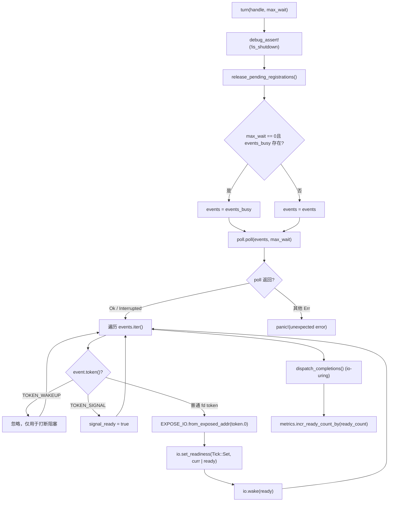
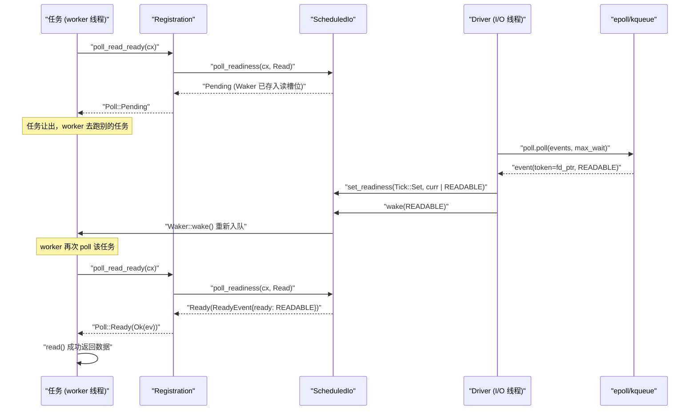

# 제 5 장: I/O 준비 알림: Reactor가 epoll 이벤트를 Waker 깨우기로 변환하는 방법

이전 장에서 우리는 worker 스레드의 메인 루프를 추적했다: 작업이 poll되고, Pending을 반환하면 Waker를 어딘가에 저장하고, 이벤트가 준비되면 Waker가 트리거되어 작업이 다시 큐에 들어간다. 하지만 「어딘가」는 대체 어디인가? Waker는 epoll 이벤트가 도착할 때 어떻게 다시 찾아지는가? 이것이 바로 Reactor가 답해야 할 질문이다. 먼저 직관적 모델을 세우자: 전체 I/O 준비 알림 메커니즘을 식당의 진동벨 호출 시스템이라고 상상하자——손님(작업)은 주문 후 창구에서 죽치고 기다리지 않고 진동벨(Waker)을 받아 자리로 돌아간다; 주방(커널 epoll)이 음식을 완성하면 프런트(Reactor)가 주문 번호(Token)로 해당 진동벨을 찾아 버튼을 누른다. 이 시스템이 없다면 각 작업은 소켓을 폴링해야 하고 CPU가 타버리거나, 블로킹 스레드로 기다려 연결당 스레드 하나로 규모가 커지지 않는다. Tokio의 Reactor는 세 파일로 세 계층 구조를 이루며 책임이 엄격히 분리된다: driver.rs는 이벤트 루프 본체로 mio::Poll을 보유하고 poll()을 호출해 커널 이벤트를 블로킹 대기하며 이벤트를 ScheduledIo의 읽기/쓰기로 변환한다; registration.rs는 사용자 대상 등록 핸들로 TcpStream 내부가 이것을 보유하며 poll_read_ready / poll_write_ready 등의 API를 제공한다; scheduled_io.rs는 각 fd의 상태 슬롯으로 읽기/쓰기 준비 비트와 Waker 목록을 저장하며 이벤트와 작업 사이의 다리다. 모듈 조립 관계는 tokio/src/runtime/io/mod.rs:5-16을 참고하라: driver는 Driver, Handle, ReadyEvent를 내보내고, registration은 Registration을, scheduled_io는 ScheduledIo를 내보낸다. 아래 그림은 이 장에서 추적할 전체 데이터 흐름을 앵커링한다: TcpStream → Registration → ScheduledIo → Handle/Driver → 커널 → ScheduledIo로 복귀 → Waker. 이제 계층별로 분해한다.

# 드라이버 계층:`Driver`과`Handle`의 책임 분할

## 직관적 모델

`Driver`은**유일하게`mio::Poll`을 보유한 엔티티**이며, 단일 스레드에서만`&mut`접근할 수 있다——이것이 이벤트 루프의 독점성 요구다. 반면`Handle`은**복제 가능하고 스레드 간 공유 가능한 등록 진입점**, 어떤 스레드든 새 fd를 등록하려면 이를 통한다. 만약 이 분할이 없다면,要么`mio::Poll`에 락을 걸거나(매 등록마다 경쟁),要么 모든 등록을 driver 스레드로 되돌려야 한다(스레드 간 메시지 큐 도입). Tokio는`Handle`이 직접`mio::Registry`의 클론을 보유하도록 선택하여, 등록 작업은 동시에 진행될 수 있고, 실제 이벤트 대기만 독점이 필요하다.

## 메모리 레이아웃과 필드

먼저`Driver`의 필드[FACT:tokio/src/runtime/io/driver.rs:25-38]：

- `signal_ready: bool`를 보자: Unix 시그널 이벤트 도착 여부로, signal 구동에 사용된다.
- `events: mio::Events`: 메인 이벤트 버퍼로,`turn`호출에 걸쳐 재사용되어 매번 할당을 피한다.
- `events_busy: Option<mio::Events>`：**논블로킹 poll 전용 버퍼**,`max_io_events_per_busy_tick`이 설정된 경우에만 존재한다.
- `poll: mio::Poll`: 커널 이벤트 큐의 래퍼.

다음으로`Handle` [FACT:tokio/src/runtime/io/driver.rs:41-75]：

- `registry: mio::Registry`：`mio::Poll::registry()`의 클론을 보자,`register`/`deregister`。
- `registrations: RegistrationSet`에 사용된다: 모든 활성 등록의 집합으로,`Token`과`ScheduledIo`。
- `synced: Mutex<registration_set::Synced>`할당을 담당한다`RegistrationSet`의 동기화 상태를 보호한다.
- `waker: mio::Waker`: 임의의 스레드에서`turn`에 블로킹된 driver를 깨우는 데 사용된다.
- `metrics: IoDriverMetrics`: fd 수, 준비된 이벤트 수를 통계한다.

여기에는 핵심 설계가 있다:`events_busy`의 존재[FACT:tokio/src/runtime/io/driver.rs:25-38]는**논블로킹 poll이 이벤트를 삼켜버리는**문제를 해결하기 위한 것이다. 주석[FACT:tokio/src/runtime/io/driver.rs:189-190]에 명확히 나와 있다: 논블로킹 poll이 가져간 이벤트가 메인 버퍼에 남아 있으면 다음 poll에서 보이지 않는다; 별도 버퍼를 사용하면 처리되지 않은 이벤트가 여전히 커널 큐에 남아 다음 poll에서 다시 반환된다.

## Step-by-Step: 한 번의`turn`실행

`turn`은 driver의 핵심 함수[FACT:tokio/src/runtime/io/driver.rs:184-261]이다. worker 스레드가 실행할 작업이 없다고 판단하여`park` → `turn(handle, None)`을 호출해 블로킹 대기한다고 가정하자:

**첫 번째 단계**: shutdown되지 않았음을 단언[FACT:tokio/src/runtime/io/driver.rs:185]하고, 정리할 등록[FACT:tokio/src/runtime/io/driver.rs:187]。`release_pending_registrations`을 해제한다.`needs_release()`을 확인하고, 있으면`registrations.release()` [FACT:tokio/src/runtime/io/driver.rs:336-340]。

**을 호출한다**두 번째 단계[FACT:tokio/src/runtime/io/driver.rs:191-194]: 이벤트 버퍼 선택`max_wait`. 만약`events_busy`이 0이고

**이 존재하면 busy 버퍼를 사용하고, 그렇지 않으면 메인 버퍼를 사용한다.**세 번째 단계`self.poll.poll(events, max_wait)` [FACT:tokio/src/runtime/io/driver.rs:198]:`Interrupted`을 호출한다. 이것이 실제로 epoll_wait에 블로킹되는 곳이다. 에러 처리는 매우 절제되어 있다:[FACT:tokio/src/runtime/io/driver.rs:200]은 직접 무시한다(시그널에 의한 중단은 정상)`InvalidInput`, WASI에서의[FACT:tokio/src/runtime/io/driver.rs:201-205]도 무시[FACT:tokio/src/runtime/io/driver.rs:206]。

**, 다른 에러는 직접 panic**네 번째 단계[FACT:tokio/src/runtime/io/driver.rs:211-233]: 이벤트 순회`event`：

- . 각`token == TOKEN_WAKEUP`에 대해[FACT:tokio/src/runtime/io/driver.rs:214]만약`unpark`(값이 0)
- 이면, 아무것도 하지 않는다——이것은`token == TOKEN_SIGNAL`이 블로킹을 중단하는 데 사용된다.[FACT:tokio/src/runtime/io/driver.rs:216]만약`signal_ready = true`。
- (값이 1)[FACT:tokio/src/runtime/io/driver.rs:218-231]이면,`mio::Ready`을 설정한다`Ready`그렇지 않으면 일반 I/O 이벤트`EXPOSE_IO.from_exposed_addr(token.0)`:`*const ScheduledIo`을 Tokio의`set_readiness(Tick::Set, |curr| curr | ready)`로 변환하고,`io.wake(ready)`을 사용해 token을`Waker`。

포인터로 복원한 다음,`EXPOSE_IO`이 준비 비트를 누적하고,`PtrExposeDomain<ScheduledIo>` [FACT:tokio/src/runtime/io/mod.rs:21-22]이 해당 방향의`usize`을 트리거한다`mio::Token`여기서[FACT:tokio/src/runtime/io/driver.rs:222-225]은**으로, 포인터를**로 「노출」시켜`Arc<ScheduledIo>`로 사용한다. 안전성 주석

**은 이 unsafe 변환이 왜 안전한지 설명한다: 포인터는 mio에서 등록 해제되고**且[FACT:tokio/src/runtime/io/driver.rs:235-258]driver가 더 이상 동시에 poll하지 않기 전까지 해제되지 않으며, driver가

**의 소유권을 보유한다.**다섯 번째 단계[FACT:tokio/src/runtime/io/driver.rs:265-267]。



## , CQ 오버플로 시 flush 루프를 포함한다.`Handle`여섯 번째 단계`mio::Waker`

`unpark` [FACT:tokio/src/runtime/io/driver.rs:280-283]: metrics 누적`self.waker.wake()`복사`mio::Waker`설계 사고: 왜`Driver::new`이`TOKEN_WAKEUP`을 보유하고[FACT:tokio/src/runtime/io/driver.rs:124]을 호출해야 하는가`poll.poll()`. 이`unpark`은`TOKEN_WAKEUP`시에`poll`을 사용해[FACT:tokio/src/runtime/io/driver.rs:214-215]。

> **[Design Inference & Architectural Trade-offs]**
> 에 블로킹되어 있을 때, 다른 스레드가`deregister_source`을 호출하면 epoll에[FACT:tokio/src/runtime/io/driver.rs:315-334]이벤트를 넣고,`registrations.deregister`이 즉시 반환되며, 순회 시 이 token을 보면 직접 건너뛴다`unpark()`〔설계 추론 및 아키텍처 트레이드오프〕`poll`이 메커니즘은`max_wait`에서

에 사용된다: source를 등록 해제한 후, 만약`deregister_source`이 true를 반환하면(마지막 참조임을 나타냄),`self.registry.deregister(source)` [FACT:tokio/src/runtime/io/driver.rs:322]을 한다. 왜? driver가`registrations` [FACT:tokio/src/runtime/io/driver.rs:315-334]에 블로킹되어 이 fd의 이벤트를 기다리고 있을 수 있는데, fd가 이미 등록 해제되어 커널이 더 이상 이벤트를 생성하지 않기 때문이다; 반드시 driver를 능동적으로 깨워 등록 집합을 다시 확인하고 블로킹에서 벗어날 수 있게 해야 한다. 그렇지 않으면 driver는[FACT:tokio/src/runtime/io/driver.rs:320-321]타임아웃까지 계속 잠들어 shutdown이 지연된다.[FACT:tokio/src/runtime/io/driver.rs:336-340]또 다른 세부사항:**이 먼저**을 호출하고, 그다음

# 을 정리한다. 주석`Registration`에 「Cleanup ALWAYS happens」라고 나와 있다——OS 계층 deregister가 실패하더라도 내부 상태를 정리하고, 마지막에야 OS 에러`Waker`를 반환한다. 이것은 전형적인`ScheduledIo`

## 자원 정리가 에러 전파보다 우선

`Registration`패턴이다.**등록 계층:**이 어떻게`scheduler::Handle`을`Arc<ScheduledIo>`에 저장하는가`poll_read_ready`직관적 모델`Registration`은`Waker`작업과 fd 사이의 계약`ScheduledIo`이다. 그것은 두 가지를 보유한다: 하나는`ScheduledIo`(필요할 때 runtime에 접근하기 위함), 하나는`Waker`(fd의 상태 슬롯). 작업이

## 을 호출할 때,

`Registration`이[FACT:tokio/src/runtime/io/registration.rs:46-54]：

- `handle: scheduler::Handle`을[FACT:tokio/src/runtime/io/registration.rs:46-54]에 맡겨 보관한다; driver가 이벤트를 받으면
- `shared: Arc<ScheduledIo>`에서`Arc`을 꺼내 깨운다.

> **[Design Inference & Architectural Trade-offs]**
> 은 두 개의 필드만 있다`Registration`: runtime 핸들, 주석`Send`에 「TODO: this can probably be moved into ScheduledIo」라고 나와 있어, 작성자가 이 필드 위치가 최적화될 수 있다고 생각함을 보여준다.`Sync` [FACT:tokio/src/runtime/io/registration.rs:57-58]: 공유 상태,`scheduler::Handle`이 driver와 작업 모두 접근할 수 있음을 보장한다.`Send`/`Sync`〔설계 추론 및 아키텍처 트레이드오프〕`Rc`주목하라`Registration`이 수동으로[FACT:tokio/src/runtime/io/registration.rs:28-33]과**을 구현했다. 왜 unsafe impl이 필요한가?`Registration`**내부에

## Step-by-Step：`poll_read_ready`이 아닌 필드(예:

)를 포함할 수 있지만,`TcpStream::poll_read`에서 socket에 데이터가 없는 것을 발견하면 읽기 관심을 등록해야 합니다. 호출 체인은`TcpStream::poll_read_priv` → `PollEvented::poll_read` → `Registration::poll_read_io` → `poll_io` → `poll_ready`。

`poll_ready`는 핵심입니다[FACT:tokio/src/runtime/io/registration.rs:155-171]：

**첫 번째 단계**：`trace_leaf()` [FACT:tokio/src/runtime/io/registration.rs:160]는 tracing埋点에 사용됩니다.

**두 번째 단계**：`coop::poll_proceed(cx)` [FACT:tokio/src/runtime/io/registration.rs:155-171]. 이것은 제12장에서 다룰 협력적 예산 메커니즘입니다. 예산이 소진되면`Pending`을 반환하고 특수한`Waker`을 등록하여 작업이 다음 라운드에서 다시 스케줄되도록 합니다.

**세 번째 단계**：`self.shared.poll_readiness(cx, direction)` [FACT:tokio/src/runtime/io/registration.rs:155-171]. 이것은 실제로`ScheduledIo`와 상호작용하는 곳입니다: 현재 준비 비트를 확인하고, 이미 준비되었다면 즉시`Ready`을 반환합니다. 그렇지 않으면`cx.waker()`을`ScheduledIo`의 해당 방향 슬롯에 저장하고`Pending`。

**을 반환합니다**네 번째 단계`ev.is_shutdown` [FACT:tokio/src/runtime/io/registration.rs:155-171]: 확인합니다`RUNTIME_SHUTTING_DOWN_ERROR`。

**. runtime이 종료 중이면**：`coop.made_progress()` [FACT:tokio/src/runtime/io/registration.rs:169]을 반환합니다

`poll_io`다섯 번째 단계`poll_ready`, 예산 소비를 표시하고 준비 이벤트를 반환합니다.[FACT:tokio/src/runtime/io/registration.rs:173-192]：

```rust
loop {
    let ev = ready!(self.poll_ready(cx, direction))?;
    match f() {
        Ok(ret) => return Poll::Ready(Ok(ret)),
        Err(ref e) if e.kind() == io::ErrorKind::WouldBlock => {
            self.clear_readiness(ev);
        }
        Err(e) => return Poll::Ready(Err(e)),
    }
}
```

위에 재시도 루프를 추가했습니다**복사**여기서`poll_ready`readiness는 보장이 아닌 힌트라는`read()`핵심 사상을 보여줍니다:`WouldBlock`이 읽기 가능하다고 말하지만, 실제로`clear_readiness(ev)` [FACT:tokio/src/runtime/io/registration.rs:187]할 때

## 을 반환할 수 있습니다 (예를 들어 다른 스레드가 먼저 데이터를 읽어갔을 경우). 이때 반드시`try_io`준비 비트를 지우고 루프를 돌며 다시 기다려야 합니다. 지우지 않으면 작업은 '읽기 가능하다고 생각 → read 실패 → 다시 읽기 가능하다고 생각'하는 바쁜 루프에 빠집니다.`async_io`설계 고찰:

`try_io` [FACT:tokio/src/runtime/io/registration.rs:194-213]과`ready_event(interest)`의 분업`WouldBlock` [FACT:tokio/src/runtime/io/registration.rs:194-213]은 동기 버전입니다: 먼저`f()`준비 비트를 확인하고, 비어 있으면 직접`f()`을 반환합니다. 그렇지 않으면`WouldBlock`을 실행하고,[FACT:tokio/src/runtime/io/registration.rs:207-210]이**을 반환하면 준비 비트를 지웁니다**. 이것은`try_read`Waker를 등록하지 않으며

`async_io` [FACT:tokio/src/runtime/io/registration.rs:225-245]과 같은 '한번 시도하고 떠나는' 시나리오에 적합합니다.`readiness(interest).await`는 비동기 버전입니다:`f()`，`WouldBlock`은 Waker를 등록하고 기다린 후,`coop::poll_proceed` [FACT:tokio/src/runtime/io/registration.rs:233]을 실행할 때 준비 비트를 지우고 루프를 돕니다. 루프 안에서`WouldBlock`도 호출하여 대량의

## 재시도에서 예산이 소진되는 것을 방지합니다.`Drop`프로덕션 함정:

`Registration::drop` [FACT:tokio/src/runtime/io/registration.rs:253-262]의 Waker 정리`self.shared.clear_wakers()`이[FACT:tokio/src/runtime/io/registration.rs:253-262]을 호출합니다. 주석`ScheduledIo`이 이유를 설명합니다:`Waker`에 저장된`Arc<driver::Inner>`이`driver::Inner`을 보유할 수 있고,`ScheduledIo`이 다시`Registration`을 보유하여 순환 참조가 형성됩니다. Waker 정리는 순환을 끊는 수단입니다. 하지만 주석은 이것이 'imperfect solution'임을 인정합니다 — 만약`Waker`자체가

> **[Design Inference & Architectural Trade-offs]**
> 〔설계 추론 및 아키텍처 트레이드오프〕`clear_wakers`프로덕션 환경에서의 동작은: 많은 연결이 drop되었지만 runtime이 종료되지 않으면, 다음`ScheduledIo`또는 runtime shutdown까지 메모리가 즉시 회수되지 않습니다. 장기 연결 서비스에서는 일반적으로 문제가 되지 않지만, 단기 연결이 빈번하게 생성/소멸되는 시나리오에서는

# 의 회수 시점을 주의해야 합니다.`TcpStream::read`에서`Waker`깨우기까지의 전체 체인

## 직관적 모델

이제 세 계층을 연결해 봅시다. 사용자가`TcpStream`에서`.read().await`을 호출하면, 실제로 실행되는 것은`AsyncRead::poll_read` → `PollEvented::poll_read` → `Registration::poll_read_io`입니다. 데이터가 도착하지 않았을 때,`Waker`이`ScheduledIo`에 저장됩니다. epoll이 읽기 가능을 보고하면, driver가`ScheduledIo`에서`Waker`을 꺼내 깨우고, 작업이 다시 스케줄되며, 다시 poll할 때`poll_readiness`이 준비 비트가 설정된 것을 발견하고 직접`Ready`，`read()`성공을 반환합니다.

## Step-by-Step: 완전한 읽기 대기 한 번

**1단계: 관심 등록**。`TcpStream::new` [FACT:tokio/src/net/tcp/stream.rs:166-169]이`PollEvented::new(connected)`을 호출하고, 후자가 내부적으로`Registration::new_with_interest_and_handle` [FACT:tokio/src/runtime/io/registration.rs:73-81]을 호출하며, 이어서`handle.driver().io().add_source(io, interest)` [FACT:tokio/src/runtime/io/registration.rs:73-81]。

`add_source` [FACT:tokio/src/runtime/io/driver.rs:288-312]이 세 가지를 수행합니다:

1. `registrations.allocate(&mut synced.lock())`이`ScheduledIo`을 할당하고`token` [FACT:tokio/src/runtime/io/driver.rs:293-294]。

2. `self.registry.register(source, token, interest.to_mio())`을 얻습니다[FACT:tokio/src/runtime/io/driver.rs:298]커널에**을 등록합니다. 실패하면**반드시`ScheduledIo`방금 할당한[FACT:tokio/src/runtime/io/driver.rs:300-303]을 집합에서 제거해야 합니다

3. `metrics.incr_fd_count()`, 그렇지 않으면 누수됩니다.[FACT:tokio/src/runtime/io/driver.rs:309]。

**이**을 카운트합니다`TcpStream::poll_read` [FACT:tokio/src/net/tcp/stream.rs:1492-1498] → `poll_read_priv` [FACT:tokio/src/net/tcp/stream.rs:1451-1458] → `PollEvented::poll_read` → `Registration::poll_read_io` [FACT:tokio/src/runtime/io/registration.rs:133-139] → `poll_io` → `poll_ready` → `ScheduledIo::poll_readiness`2단계: 준비 대기`Waker`. 작업 poll`ScheduledIo`. 이때 준비되지 않았다면,`Pending`。

**이**의 읽기 슬롯에 저장되고`turn`을 반환합니다`poll.poll()`3단계: 이벤트 도착[FACT:tokio/src/runtime/io/driver.rs:198]. driver의`io.set_readiness(Tick::Set, |curr| curr | ready)`이`io.wake(ready)` [FACT:tokio/src/runtime/io/driver.rs:228-229]。`wake`에서 이벤트`Waker`을 가져오고, 순회하면서 각 fd 이벤트에 대해`wake()`。

**을 실행하고**。`Waker::wake()`내부에서 해당 방향의`poll_readiness`을 꺼내`Ready`，`read()`을 호출합니다



## 이 작업을 worker의 로컬 큐에 다시 넣습니다 (이전 장에서 설명). worker가 해당 작업을 다시 poll하면,`assume_ready`이 준비 비트가 설정된 것을 발견하고

`TcpStream::new_accepted` [FACT:tokio/src/net/tcp/stream.rs:174-181]성공을 반환합니다.`accept`복사`new_accepted`중요한 분기:`assume_ready(Ready::READABLE | Ready::WRITABLE)` [FACT:tokio/src/net/tcp/stream.rs:174-181]。

`assume_ready`최적화[FACT:tokio/src/runtime/io/registration.rs:103-105]은 주목할 만한 최적화입니다.`WouldBlock`이 반환한 socket은 자연스럽게 쓰기 가능하며, 일반적으로 이미 상대방의 첫 번째 바이트를 보유하고 있습니다. driver의 첫 이벤트를 기다리면, 고부하에서 이 이벤트가 모든 설정된 연결의 이벤트 뒤에排队될 수 있어 지연이 발생합니다. 그래서`WouldBlock`，`poll_io`이 직접**을 호출합니다. 주석**은 이렇게 말합니다: 「A wrong guess costs one

## , which clears the readiness again.」— 잘못 추측한 대가는 단 한 번의

> **[Design Inference & Architectural Trade-offs]**
> 낙관적 추측 + 빠른 오류 수정`Driver`설계입니다.`Driver`설계 고찰: 왜 I/O 드라이버와 스케줄러가 분리되는가`block_on`〔설계 추론 및 아키텍처 트레이드오프〕`Handle`소스 구조에서 보면,

1. **과 worker 스레드는 분리되어 있습니다:**：`Handle`은 runtime의 특정 전용 위치 (일반적으로`mio::Registry`스레드 또는 전용 I/O 스레드)에 배치되고, worker 스레드는

2. **만 보유합니다. 이러한 분리는 몇 가지 이점을 가져옵니다:**등록 무잠금화`epoll_wait`이

3. **클론을 보유하여, 어떤 worker든 동시에 새 fd를 등록할 수 있고 driver 스레드로 돌아갈 필요가 없습니다.**이벤트 대기 집중화`ScheduledIo`: 오직 하나의 스레드만`Waker::wake()`，`wake()`에서 블록되어, 여러 스레드가 동시에 같은 epoll fd를 poll하는 thundering herd 문제를 피합니다.

깨우기 경로 단축`ScheduledIo`: driver가 이벤트를 받은 후 직접`set_readiness`을 조작하고`poll_readiness`을 호출합니다

## 내부에서 작업을 worker 큐에 푸시하며, 스레드 간 메시지 전달이 필요 없습니다.`is_shutdown`대가는`RUNTIME_SHUTTING_DOWN_ERROR`

`poll_ready`이 동시 접근을 처리해야 한다는 것입니다 (`ev.is_shutdown` [FACT:tokio/src/runtime/io/registration.rs:155-171]과`gone()` [FACT:tokio/src/runtime/io/registration.rs:265-267]이 동시에 발생할 수 있음). 이는 원자적 연산과 내부 잠금으로 해결됩니다.`RUNTIME_SHUTTING_DOWN_ERROR`。

> **[Design Inference & Architectural Trade-offs]**
> 과`shutdown` [FACT:tokio/src/runtime/io/driver.rs:174-182]등록된 모든 것을 순회하며 호출합니다`io.shutdown()`,`is_shutdown`를 설정하고 모든 대기자를 깨웁니다. 이 플래그를 확인하지 않으면, 태스크가 runtime이 이미 스케줄링을 중단한 후에도 소켓을 읽으려고 시도하여 정의되지 않은 동작이나 행(hang)을 유발할 수 있습니다. 프로덕션 환경에서`RUNTIME_SHUTTING_DOWN_ERROR`를 보게 된다면, 일반적으로 runtime drop 이후에도 실행 중인 태스크가 있다는 의미입니다——제대로 join되지 않은`spawn`태스크가 있는지 확인하세요.

또 다른 함정은`deregister_source`의`unpark` [FACT:tokio/src/runtime/io/driver.rs:328]입니다. driver가`poll`에서 블로킹 중이고 이때 마지막`Registration`가 drop되면,`unpark`가 driver를 깨웁니다. 하지만 driver가 블로킹 상태가 아니라면(예: 다른 이벤트를 처리 중),`unpark`는 다음`turn`가 즉시[FACT:tokio/src/runtime/io/driver.rs:280-283]를 반환하게 할 뿐입니다. 이 의미는`Handle::unpark`의 문서 주석에 설명되어 있습니다.

# 설계 고찰: Reactor의 세 가지 핵심 트레이드오프

**트레이드오프 1:`Token`은 인덱스 대신 포인터를 사용합니다**。`EXPOSE_IO.from_exposed_addr(token.0)` [FACT:tokio/src/runtime/io/driver.rs:220]는`mio::Token`를 직접`*const ScheduledIo`의 주소로 취급합니다. 이는`Token → ScheduledIo`의 매핑 테이블 유지를 피하며, 조회는 O(1)이고 락이 없습니다. 대가는 안전성이 엄격한 수명 관리에 의존한다는 것입니다: 포인터는 등록 해제되고 driver가 더 이상 poll하지 않은 후에만 해제되어야 합니다[FACT:tokio/src/runtime/io/driver.rs:222-225]。

**트레이드오프 2: 읽기/쓰기 이중 Waker 슬롯**。`Registration`문서[FACT:tokio/src/runtime/io/registration.rs:24-26]는 "A registration instance represents two separate readiness streams"라고 말합니다——읽기와 쓰기 각각 독립적인`Waker`슬롯을 가집니다. 이는 동일한 소켓의 읽기 태스크와 쓰기 태스크가 각각 등록되어 서로 간섭하지 않도록 합니다. 하지만`poll_read_ready`의 주석[FACT:tokio/src/net/tcp/stream.rs:549-552]은 경고합니다:`poll_read_ready`/`poll_read`/`poll_peek`를 여러 번 호출하면 마지막`Waker`만 유지됩니다——읽기 방향에는 슬롯이 하나뿐입니다.

**트레이드오프 3:`events_busy`의 독립 버퍼**. 테스트[FACT:tokio/src/runtime/io/driver.rs:364-386]가 이 동작을 검증합니다:`Driver::new(16, Some(2))`busy 용량이 2인 driver를 생성하고, 5개의 읽기 가능한 source를 등록한 후, 비블로킹`turn`는 2개의 이벤트만 가져오고[FACT:tokio/src/runtime/io/driver.rs:375-376], 나머지 3개는 커널 큐에 남아 다음 블로킹`turn`에서[FACT:tokio/src/runtime/io/driver.rs:379-380]를 가져옵니다. 이는 비블로킹 poll이 한 번에 모든 이벤트를 삼켜 이후 poll이 기아 상태가 되는 것을 방지합니다.

# 이 장 요약

이 장은`TcpStream::read`뒤의 완전한 Reactor 체인을 추적했습니다:

- **드라이버 계층**：`Driver`은`mio::Poll`，`turn`를 독점하여 이벤트를 블로킹 대기하고,`EXPOSE_IO`를 사용하여`Token`를`ScheduledIo`포인터로 복원하고,`set_readiness` + `wake`를 호출하여`Waker`。`Handle`를 트리거합니다.`unpark`는 스레드 간 등록 진입점을 제공하며,
- **는 블로킹을 중단하는 데 사용됩니다.**：`Registration`등록 계층`Arc<ScheduledIo>`，`poll_ready`은`Waker`，`poll_io`를 보유하고 준비 비트를 확인하거나`WouldBlock`에 저장합니다.`try_io`/`async_io`는
- **재시도 루프로 거짓 양성을 처리하며,**：`ScheduledIo`는 각각 동기 및 비동기 시나리오를 서비스합니다.`Waker`상태 계층

# 은 fd의 상태 슬롯으로, 읽기/쓰기 준비 비트와 이중

슬롯을 저장하며, 이벤트와 태스크 사이의 유일한 다리입니다.`poll_io`이 장 생각과 자가 테스트`WouldBlock`Q1: 만약`self.clear_readiness(ev)`에서

**분기의**：`poll_io`를 삭제하면, 어떤 시나리오에서 태스크 busy-loop를 유발할까요? 왜일까요?[FACT:tokio/src/runtime/io/registration.rs:173-192]참고 해석`f()`의 루프`WouldBlock`는`clear_readiness(ev)` [FACT:tokio/src/runtime/io/registration.rs:187]。`ev`가`poll_ready`를 반환할 때`ReadyEvent`를 호출합니다.`clear_readiness`는`ScheduledIo`가 반환한

로, 현재 준비 비트를 포함합니다.`poll_ready` → `poll_readiness`는 이 비트들을`ScheduledIo`에서 지웁니다.`poll_readiness`만약 지우지 않으면, 다음 루프에서`Ready`를 호출할 때`f()`에 여전히 이전 "읽기 가능" 비트가 남아 있어,`read()`가 즉시`WouldBlock`를 반환하고(준비 비트가 비어 있지 않으므로),`Pending`가 다시

를 실행합니다. 소켓에 실제로 데이터가 없으면 다시`Registration`를 반환하고 루프가 계속됩니다. 준비 비트가 절대 지워지지 않으므로 이 루프는 결코[FACT:tokio/src/runtime/io/registration.rs:28-33]에 진입하지 않고, 태스크는 계속 CPU를 점유하며 폴링합니다.`try_read`트리거 시나리오: 여러 태스크가 동일한 소켓의 읽기 방향을 공유하거나(`poll_read`문서`read()`는 최대 두 태스크라고 하지만 읽기 방향에는 슬롯이 하나뿐입니다),`WouldBlock`와

Q2: `add_source`를 혼용하는 경우입니다. 더 흔한 것은: epoll이 읽기 가능을 보고한 후 다른 스레드가 먼저 데이터를 읽어갔고, 현재 태스크의`registry.register`가`registrations.remove`를 반환하는 경우입니다. 이때 반드시 준비 비트를 지워야 하며, 그렇지 않으면 계속 재시도합니다.

**가**：`add_source` [FACT:tokio/src/runtime/io/driver.rs:288-312]실패 시 왜`registrations.allocate`를 호출해야 할까요? 호출하지 않으면 무슨 일이 발생할까요?`ScheduledIo` [FACT:tokio/src/runtime/io/driver.rs:293]참고 해석`registry.register`는 먼저[FACT:tokio/src/runtime/io/driver.rs:298]를 할당하고, 그다음`ScheduledIo`로 커널에 등록합니다. 등록이 실패하면`RegistrationSet`는 이미 할당되었지만 연결된 fd가 없습니다. 제거하지 않으면 영원히

에 남습니다.[FACT:tokio/src/runtime/io/driver.rs:296-297]주석`scheduled_io` from the `registrations` set if registering the `source` with the OS fails. Otherwise it will leak the `scheduled_io`은 명확히 말합니다: "we should remove the

`remove`."——이것은 메모리 누수입니다.[FACT:tokio/src/runtime/io/driver.rs:300-303]호출`ScheduledIo`은 unsafe 블록으로 감싸집니다. 왜냐하면`RegistrationSet`는`RegistrationSet`의 일부이고, 제거 작업은 다른 참조가 없음을 보장해야 하기 때문입니다. 누수의 결과:`Token`가 계속 증가하고,`allocate`공간이 낭비되며, 최종적으로

Q3: `deregister_source`실패나 메모리 고갈을 초래할 수 있습니다. 연결 생성/소멸이 빈번한 시나리오(예: 단기 연결 서버)에서 등록 실패율이 높으면(예: fd 고갈), 누수가 자원 고갈을 가속화합니다.`unpark()`에서 왜`registrations.deregister`는

**가 true를 반환할 때만 호출될까요? 무조건 호출하면 어떤 문제가 있을까요?**：`deregister_source` [FACT:tokio/src/runtime/io/driver.rs:315-334]참고 해석`registry.deregister(source)`의 로직은: 먼저[FACT:tokio/src/runtime/io/driver.rs:322]로 커널에`registrations.deregister`를 등록 해제하고, 그다음[FACT:tokio/src/runtime/io/driver.rs:315-334]로 내부 상태`unpark()` [FACT:tokio/src/runtime/io/driver.rs:328]。

`registrations.deregister`를 정리하며, true를 반환하면`ScheduledIo`를 호출합니다. true 반환은 이것이 마지막 참조이고`poll`가 실제로 제거되었음을 의미합니다. 이때 driver는`unpark`에서 이 fd의 이벤트를 기다리며 블로킹 중일 수 있지만, fd가 이미 등록 해제되어 커널은 더 이상 이벤트를 생성하지 않습니다.`mio::Waker`는`TOKEN_WAKEUP`를 통해 epoll에[FACT:tokio/src/runtime/io/driver.rs:280-283]이벤트`poll`를 넣어

가 즉시 반환하게 하고, driver는 등록 집합을 다시 확인하고 블로킹을 종료할 수 있습니다.`unpark`만약 무조건`ScheduledIo`를 호출하면: 마지막이 아닌 참조를 등록 해제할 때마다 driver를 깨워 불필요한 웨이크업을 유발합니다. 많은 연결이 동일한`TcpStream`를 공유하는 시나리오(예:`split`후반 읽기/쓰기 두 부분), 매번 절반을 drop할 때마다 driver를 깨워 CPU 오버헤드가 증가한다. 더 심각하게는

이 장에서는 Reactor가 epoll 이벤트를 Waker 깨우기로 변환하는 방법을 분석했다: TcpStream의 poll_read_ready에서 출발하여 Registration의 등록과 조회를 거쳐 ScheduledIo의 준비 비트와 Waker 슬롯에 도달하고, Driver가 이벤트 루프에서 Token을 기반으로 위치를 찾아 깨우기를 트리거한다. 핵심 설계로는 Token이 포인터로서 O(1) 조회를 구현하고, 읽기/쓰기 이중 Waker 슬롯이 동시 읽기/쓰기 분리를 지원하며, events_busy 독립 버퍼가 이벤트 기아를 방지하고, assume_ready 낙관적 추측이 accept 시나리오를 최적화한다. 여기까지 I/O 준비 알림의 폐쇄 루프가 완성되었다. 하지만 비동기 런타임은 또 다른 종류의 '준비'—시간—을 처리해야 한다. 다음 장에서는 tokio::time::sleep과 timeout의 구현을 분석할 것이다: 타이머가 어떻게 시간 휠에 삽입되는지, 시간 휠이 만료 시간에 따라 어떻게 계층화되는지, driver가 다음 park의 타임아웃을 어떻게 계산하고 만료된 작업을 트리거하는지. '시간도 하나의 I/O 이벤트'라는 통합 추상화와 start_paused 및 test clock이 테스트에서 시간을 어떻게 제어 가능하게 만드는지 살펴볼 것이다.
