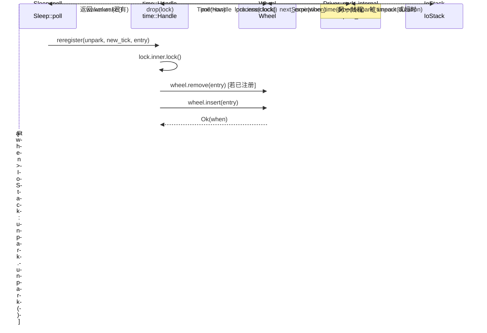

# 제 6 장: 시간 구동: 시간 휠, Sleep과 타임아웃이 어떻게 깨어나는가

이전 장에서 우리는 TcpStream::read의 전체 체인을 추적하며 ScheduledIo가 epoll의 fd 준비 이벤트를 Waker 깨우기로 변환하는 방법을 살펴보았다. 하지만 비동기 런타임은 또 다른 종류의 '준비'를 처리해야 한다: sleep(100ms) Future는 100ms 후에 반드시 깨어나야 한다. 이런 이벤트는 커널 fd에서 오지 않고 '시간 자체'에서 온다. Tokio의 설계 선택은 시간도 I/O 이벤트로 취급하는 것이다: Driver 구조체에는 park: IoStack 필드 하나만 있으며, I/O driver의 park/unpark 메커니즘을 재사용한다. 시간 휠이 '다음 만료 시각'을 계산하면, driver는 park_timeout을 호출하여 스레드를 그 시각까지 재운다; 깨어난 후 시간 휠에서 만료 항목을 꺼내 해당 Waker를 트리거한다. 이렇게 하면 스케줄러는 하나의 통합된 park 진입점만으로 'fd 준비'와 '타이머 만료' 두 종류의 이벤트를 동시에 기다릴 수 있다. 이 장에서는 세 가지 질문에 답한다: 타이머는 어떻게 시간 휠에 삽입되는가? 시간 휠은 만료 시간에 따라 어떻게 계층화되는가? driver는 다음 park의 타임아웃을 어떻게 계산하고 만료된 작업을 트리거하는가?

# 1. 시간 휠: 6계층 64슬롯의 해시 계층 구조

## 직관적 모델

기계식 시계를 상상해 보자: 초침이 한 바퀴 돌면 분침을 움직이고, 분침이 한 바퀴 돌면 시침을 움직인다. 초침만 있다면 '12일 후'를 표현하려면 100만 칸을 세어야 한다; 하지만 계층화하면 초침은 64초 이내의 정밀도만 담당하고, 분침은 64분, 시침은 64시간을 담당한다—각 계층은 64개 슬롯만으로 2년 후까지 커버할 수 있다.

계층화가 없다면 먼 미래의 타이머를 삽입할 때 O(N) 순회가 필요하거나 거대한 배열이 필요하다. 시간 휠은 '만료 시간에 따른 계층화'로 삽입과 트리거를 모두 거의 O(1)로 압축한다.

## 메모리 레이아웃과 필드

`Wheel`의 핵심 필드는 단 세 개뿐이다[FACT:tokio/src/runtime/time/wheel/mod.rs:22-40]：

```rust
pub(crate) struct Wheel {
    elapsed: u64,                          // 自 wheel 创建以来经过的毫秒数
    levels: Box,      // 6 层，每层 64 槽
    pending: LinkedList,      // 已到期、待触发的条目
}
```

`NUM_LEVELS = 6`，`BITS_PER_LEVEL = 6`(즉 계층당 64슬롯)[FACT:tokio/src/runtime/time/wheel/mod.rs:45-47]。`MAX_DURATION = 1 << (6 * 6) = 1 << 36`밀리초, 약 2년[FACT:tokio/src/runtime/time/wheel/mod.rs:50]。

6계층의 세분성은 문서 주석에 따르면[FACT:tokio/src/runtime/time/wheel/mod.rs:22-40]：

| 계층 | 슬롯 세분성 | 커버 범위 |
| --- | --- | --- |
| 0 | 1 ms | 64 ms |
| 1 | 64 ms | ~4 s |
| 2 | ~4 s | ~4 min |
| 3 | ~4 min | ~4 hr |
| 4 | ~4 hr | ~12 day |
| 5 | ~12 day | ~2 yr |

`pending`는 침투적 연결 리스트(`LinkedList<TimerShared>`)로, 이미 휠에서 꺼내져 Waker 트리거를 기다리는 항목을 저장한다. 주의할 점은 이것이`LinkedList`가 아니라`Vec`라는 것이다: 항목 자체가`TimerShared`에 내장되어 있어 삽입/제거에 할당이 필요 없다.

## 시나리오 구동: 100ms sleep 삽입

가`sleep(100ms)`처음 poll될 때,`Sleep::poll_elapsed`는`Timer::new`를 생성하고`init` [FACT:tokio/src/time/sleep.rs:436-440]。`init`를 호출하며 최종적으로`Handle::reregister`를 호출하고, 이어서`Wheel::insert`。

`insert`를 호출한다. 첫 번째 단계는 이미 만료되었는지 확인하는 것이다[FACT:tokio/src/runtime/time/wheel/mod.rs:90-98]：

```rust
let when = unsafe { item.sync_when() };
if when  usize {
    const SLOT_MASK: u64 = (1 = MAX_DURATION {
        return NUM_LEVELS - 1;
    }
    masked.ilog2() as usize / BITS_PER_LEVEL
}
```

여기서`elapsed ^ when`가 아니라`when - elapsed`를 사용하는 것은 정교한 기법이다: XOR의 최상위 유효 비트는 '두 타임스탬프가 어느 비트부터 다른지', 즉 '이들을 구분하려면 얼마나 거친 세분성이 필요한지'를 반영한다.`| SLOT_MASK`는 하위 6비트를 강제로 1로 설정하여`ilog2`가 같은 슬롯에 떨어질 때 너무 작은 계층이 계산되는 것을 방지한다.`ilog2() / 6`는 비트 폭을 계층 번호로 매핑한다. XOR 결과가`MAX_DURATION`를 초과하면(즉 2년 초과), 최상위 계층에 강제로 넣는다—이것이 'fudge the timer into the top level'이다.

100ms sleep의 경우,`elapsed`가 0에 가깝다고 가정하면,`when ≈ 100`，`elapsed ^ when ≈ 100`，`ilog2(100) = 6`，`6 / 6 = 1`，따라서 1계층(64ms 입도)에 위치합니다. 이는 1계층의 특정 슬롯에서 대기하다가, 시간이 해당 슬롯의 경계로 진행될 때 0계층으로 내려간다는 것을 의미합니다.

## 계층적 하강: process_expiration

当`poll(now)`시간을 진행할 때,`Wheel::poll`는 반복적으로 호출합니다`next_expiration`와`process_expiration` [FACT:tokio/src/runtime/time/wheel/mod.rs:142-166]：

```rust
pub(crate) fn poll(&mut self, now: u64) -> Option {
    loop {
        if let Some(handle) = self.pending.pop_back() {
            return Some(handle);
        }
        match self.next_expiration() {
            Some(ref expiration) if expiration.deadline  {
                self.process_expiration(expiration);
                self.set_elapsed(expiration.deadline);
            }
            _ => {
                self.set_elapsed(now);
                break;
            }
        }
    }
    self.pending.pop_back()
}
```

`process_expiration`는 특정 계층의 만료 항목을 다음 계층으로 "하강"시키거나 (0계층에서는) pending으로 표시하는 역할을 합니다[FACT:tokio/src/runtime/time/wheel/mod.rs:218-251]：

```rust
let mut entries = self.take_entries(expiration);
while let Some(item) = entries.pop_back() {
    match unsafe { item.mark_pending(expiration.deadline) } {
        Ok(()) => {
            self.pending.push_front(item);   // 真正到期
        }
        Err(expiration_tick) => {
            let level = level_for(expiration.deadline, expiration_tick);
            unsafe { self.levels[level].add_entry(item); }  // 下沉到更低层
        }
    }
}
```

`mark_pending`가 핵심입니다: 항목의 실제 deadline이 도달했는지 확인합니다. 도달했다면`Ok(())`을 반환하고, 항목은`pending`연결 리스트에 들어갑니다; 아직 도달하지 않았다면 (단지 해당 슬롯의 경계에 도달했을 뿐이라면)`Err(expiration_tick)`을 반환하고, 항목은 더 세밀한 계층에 다시 삽입됩니다.

주석에서 강조하는 한 가지 점[FACT:tokio/src/runtime/time/wheel/mod.rs:219-228]: 슬롯 전체의 항목을 모두 꺼낸 후에 처리해야 합니다. 일부 항목이 동일한 슬롯에 다시 삽입될 수 있기 때문입니다 (삽입 시간이`MAX_DURATION`를 초과할 때 랩어라운드가 발생합니다). 꺼내면서 동시에 삽입하면 무한 루프에 빠질 수 있습니다.

## 다음 만료 시각 계산

`next_expiration`저계층에서 고계층으로 스캔하여 첫 번째 비어 있지 않은 만료 지점을 반환합니다[FACT:tokio/src/runtime/time/wheel/mod.rs:169-191]：

```rust
fn next_expiration(&self) -> Option {
    if !self.pending.is_empty() {
        return Some(Expiration { level: 0, slot: 0, deadline: self.elapsed });
    }
    for (level_num, level) in self.levels.iter().enumerate() {
        if let Some(expiration) = level.next_expiration(self.elapsed) {
            debug_assert!(self.no_expirations_before(level_num + 1, expiration.deadline));
            return Some(expiration);
        }
    }
    None
}
```

만약`pending`이 비어 있지 않다면, 이미 만료된 항목이 트리거를 기다리고 있다는 뜻이므로 즉시 현재`elapsed`를 deadline으로 반환합니다 (이렇게 하면 driver가 0 타임아웃으로 park하고 즉시 돌아와 처리합니다). 그렇지 않으면 계층별로 스캔하여 내용이 있는 첫 번째 슬롯의 deadline을 반환합니다.`debug_assert`는 불변량을 검증합니다: 더 높은 계층이 현재 계층보다 더 이른 만료 지점을 가질 수 없다는 것입니다.

```mermaid
flowchart TD
    start["Wheel::poll(now)"] --> check_pending{"pending 非空?"}
    check_pending -->|是| pop["pop_back 返回 TimerHandle"]
    check_pending -->|否| next_exp{"next_expiration() 有到期点?"}
    next_exp -->|无| set_elapsed["set_elapsed(now) 后 break"]
    next_exp -->|有| cmp{"expiration.deadline |否| set_elapsed
    cmp -->|是| proc["process_expiration(expiration)"]
    proc --> take["take_entries 取出整槽"]
    take --> mark{"item.mark_pending()"}
    mark -->|Ok 已到期| push_pending["pending.push_front(item)"]
    mark -->|Err 未到期| reinsert["level_for 后 add_entry 下沉"]
    push_pending --> set_elapsed2["set_elapsed(expiration.deadline)"]
    reinsert --> set_elapsed2
    set_elapsed2 --> check_pending
    set_elapsed --> pop2["pending.pop_back() 返回"]
```

---

# 二、Driver의 park 루프: 타이밍 휠을 I/O 스택에 연결하기

## 직관적 모델

타이밍 휠 자체는 "스스로 돌아가지" 않습니다. 외부 루프가 반복적으로 물어봐야 합니다: "다음 만료는 언제인가?" 그런 다음 그 시각까지 잠들고, 깨어난 후 시간을 진행합니다. 이 루프가 바로`Driver::park_internal`입니다. 이는 "타이밍 휠의 다음 만료"를`park_timeout`의 duration으로 변환하여 하위 I/O 스택에 전달해 잠들게 합니다.

이 루프가 없다면 타이머는 절대 트리거되지 않습니다 — 타이밍 휠은 정적 데이터 구조일 뿐이며, 누군가 "돌려줘야" 합니다.

## 데이터 구조: Driver와 InnerState

`Driver`에는 필드가 하나만 있습니다`park: IoStack` [FACT:tokio/src/runtime/time/mod.rs:90-93]. 실제 상태는`Handle`에 있으며,`Inner`열거형을 통해 전통적 구현과 실험적 구현을 구분합니다[FACT:tokio/src/runtime/time/mod.rs:95-127]. 전통적 구현의`InnerState`은 두 개의 필드를 포함합니다[FACT:tokio/src/runtime/time/mod.rs:130-136]：

```rust
struct InnerState {
    next_wake: Option,   // 承诺的最早唤醒时刻
    wheel: wheel::Wheel,
}
```

`next_wake`은`NonZeroU64`대신`Option<u64>`의 중첩을 사용하여 niche 최적화를 활용합니다 —`Option<NonZeroU64>`와`u64`은 같은 크기입니다. 이는 "driver가 어느 tick 전에 깨어날 것을 약속했는지"를 기록하며,`reregister`시`unpark`。

`is_shutdown`이 필요한지 판단하는 데 사용됩니다`AtomicBool`는 독립적인[FACT:tokio/src/runtime/time/mod.rs:90-93]：`Handle`이며, 주석에서 Mutex에서 분리한 이유를 설명합니다`is_shutdown`은 mutex를 잠그지 않고

## 을 확인해야 합니다. 이는 전형적인 "읽기 많고 쓰기 적은" 최적화입니다 — shutdown은 한 번만 발생하지만, 확인은 빈번할 수 있습니다.

`park_internal`시나리오 기반: 한 번의 park 전체 흐름[FACT:tokio/src/runtime/time/mod.rs:213-256]：

```rust
fn park_internal(&mut self, rt_handle: &driver::Handle, limit: Option) {
    let handle = rt_handle.time();
    let mut lock = handle.inner.lock();
    assert!(!handle.is_shutdown());

    let next_wake = lock.wheel.next_expiration_time();
    lock.next_wake = next_wake.map(|t| NonZeroU64::new(t).unwrap_or_else(|| NonZeroU64::new(1).unwrap()));
    drop(lock);

    match next_wake {
        Some(when) => {
            let now = handle.time_source.now(rt_handle.clock());
            let mut duration = handle.time_source.tick_to_duration(when.saturating_sub(now));
            if duration > Duration::from_millis(0) {
                if let Some(limit) = limit {
                    duration = std::cmp::min(limit, duration);
                }
                self.park_thread_timeout(rt_handle, duration);
            } else {
                self.park.park_timeout(rt_handle, Duration::from_secs(0));
            }
        }
        None => {
            if let Some(duration) = limit {
                self.park_thread_timeout(rt_handle, duration);
            } else {
                self.park.park(rt_handle);
            }
        }
    }

    handle.process(rt_handle.clock());
}
```

복사

1. **단계별 분석:**：`lock.wheel.next_expiration_time()`잠금 획득, 다음 만료 읽기`Option<u64>`이`lock.next_wake`을 반환합니다, 즉 다음 만료 tick입니다. 동시에 이를`reregister`에 기록하여

2. **이 unpark 필요 여부를 판단할 수 있게 합니다.**：`drop(lock)`잠금 해제

3. **은 park 전에 반드시 이루어져야 합니다, 그렇지 않으면 park 중에 다른 스레드가 타이머를 삽입할 수 없습니다.**：`when.saturating_sub(now)`park 시간 계산`tick_to_duration`이 남은 tick 수를 얻고,`Duration`이[FACT:tokio/src/runtime/time/mod.rs:228-230]로 변환합니다. 주석에 따르면 실제로는 1ms로 올림합니다

4. **, 마이크로초 수준의 sleep이 OS에 의해 0 길이로 처리되는 것을 방지합니다.**limit 처리`limit`: 호출자가`park_timeout`을 전달한 경우 (예:`min(limit, duration)`의 명시적 타임아웃),

5. **을 취하여 너무 오래 자지 않도록 보장합니다.**특수 경우`duration == 0`: 만약`park_timeout(0)`(이미 만료됨)이면,

6. **으로 즉시 반환하고 실제로 자지 않습니다.**타이머 없을 때`next_wake`: 만약`None`이`limit`이면,`park_thread_timeout(limit)`이 있으면`park`。

7. **, 그렇지 않으면 무한**：`handle.process(clock)`깨어난 후 처리

## 이 타이밍 휠을 진행하고 만료 항목을 트리거합니다.

`process`process_at_time: 만료 항목 트리거`process_at_time` [FACT:tokio/src/runtime/time/mod.rs:296-337]：

```rust
pub(self) fn process_at_time(&self, mut now: u64) {
    let mut waker_list = WakeList::new();
    let mut lock = self.inner.lock();

    if now ) {
    let waker = unsafe {
        let mut lock = self.inner.lock();
        if unsafe { entry.as_ref().might_be_registered() } {
            lock.wheel.remove(entry);
        }
        let entry = entry.as_ref().handle();
        if self.is_shutdown() {
            unsafe { entry.fire(Err(crate::time::error::Error::shutdown())) }
        } else {
            entry.set_expiration(new_tick);
            match unsafe { lock.wheel.insert(entry) } {
                Ok(when) => {
                    if lock.next_wake.is_none_or(|next_wake| when  unsafe {
                    entry.fire(Ok(()))
                },
            }
        }
    };
    if let Some(waker) = waker {
        waker.wake();
    }
}
```

当`next_wake`이 호출되면, 타이머를 재등록해야 합니다.`unpark.unpark()`이 이 시나리오를 처리합니다

복사`unpark`핵심 로직: 삽입 성공 후, 새 만료 시각이**보다 이르면,**을 호출하여 driver를 깨웁니다. 이는 driver가 더 늦은 시각에 자고 있을 수 있으며, park 시간을 재계산하기 위해 미리 깨워야 하기 때문입니다.`waker.wake()`주의:**은**잠금을 보유한 상태에서[FACT:tokio/src/runtime/time/mod.rs:441]호출되고,`unpark`은



---

# 호출됩니다. 주석에서

## 을 설명합니다

`Sleep`: 교착 상태를 피하기 위해 Waker 호출 전에 잠금을 해제해야 합니다. 하지만`.await`은 다릅니다 — 단지 epoll에 이벤트를 넣을 뿐이며, 사용자 코드를 콜백하지 않으므로 잠금을 보유한 상태에서 호출해도 안전합니다.`Timeout`다른 Future를 감싸는 어댑터입니다. 이것들은 자체적으로 타이머 휠을 관리하지 않고, 단지 "deadline"을 tick으로 변환하여 위임합니다.`Timer`와`Handle`。

## Sleep의 메모리 레이아웃

`Sleep`를 사용하여`pin_project!`매크로로 정의합니다[FACT:tokio/src/time/sleep.rs:221-227]：

```rust
pub struct Sleep {
    deadline: Instant,
    driver: scheduler::Handle,
    inner: Inner,
    #[pin]
    timer: Option,
}
```

`timer`은`Option<Timer>`이고`#[pin]`을 가집니다: 최초 poll 전에는`None`이며, 최초 poll 시에만`Timer`을 생성하고 등록합니다. 이러한 "지연 초기화"는`sleep()`호출 시점에 런타임에 접근하는 것을 방지합니다——`sleep()`은 런타임 외부에서 호출할 수 있으며,`.await`시에만 실제로 등록됩니다.

`PinnedDrop`구현은 drop 시 타이머 취소를 보장합니다[FACT:tokio/src/time/sleep.rs:230-235]：

```rust
impl PinnedDrop for Sleep {
    fn drop(this: Pin) {
        let this = this.project();
        if let Some(timer) = this.timer.as_pin_mut() {
            timer.cancel(this.driver);
        }
    }
}
```

## poll_elapsed의 전체 흐름

`poll_elapsed`은`Sleep`의 핵심입니다[FACT:tokio/src/time/sleep.rs:396-454]：

```rust
fn poll_elapsed(self: Pin, cx: &mut task::Context) -> Poll> {
    ready!(crate::trace::trace_leaf());
    let mut this = self.project();

    // coop 预算
    let coop = ready!(crate::task::coop::poll_proceed(cx));

    let handle = this.driver;
    let timer = match this.timer.as_mut().as_pin_mut() {
        Some(timer) => timer,
        None => {
            let time_source = handle.driver().time().time_source();
            let deadline = time_source.deadline_to_tick(*this.deadline);
            let timer = Timer::new(handle, deadline);
            this.timer.set(Some(timer));
            let mut timer = this.timer.as_pin_mut().unwrap();
            timer.as_mut().init(handle, deadline);
            timer
        }
    };

    let result = timer.poll_elapsed(cx, handle).map(move |r| {
        coop.made_progress();
        r
    });
    result
}
```

단계별:

1. **coop 예산 검사**：`poll_proceed(cx)`협력 예산을 한 번 소비합니다. 예산이 소진되면`Pending`을 반환하고 실행 권한을 양보합니다. 이것은 Tokio가 단일 태스크가 다른 태스크를 기아 상태로 만드는 것을 방지하는 메커니즘입니다.

2. **지연 Timer 생성**: 만약`timer`이`None`이면,`deadline`을 tick으로 변환하고,`Timer`을 생성하여`init`을 호출해 타이머 휠에 등록합니다.

3. **Timer::poll_elapsed에 위임**: 실제 만료 검사는`Timer`이 수행합니다.

4. **성공 후 진행 상황 표시**：`coop.made_progress()`은 이번 poll에 실제 진행이 있었음을 나타냅니다.

## Timeout의 poll: 먼저 value를 poll하고, 그 다음 delay를 poll

`Timeout`의 poll 순서는 매우 중요합니다[FACT:tokio/src/time/timeout.rs:210-224]：

```rust
fn poll(self: Pin, cx: &mut task::Context) -> Poll {
    let me = self.project();
    let had_budget_before = coop::has_budget_remaining();

    // 先 poll 被包裹的 future
    if let Poll::Ready(v) = me.value.poll(cx) {
        return Poll::Ready(Ok(v));
    }

    match me.delay.as_pin_mut() {
        Some(delay) => poll_delay(had_budget_before, delay, cx).map(Err),
        None => Poll::Pending,
    }
}
```

주석은 명확히 지적합니다[FACT:tokio/src/time/timeout.rs:24-26]: future가 먼저 poll되고, 그 다음에 타임아웃이 검사됩니다. 따라서 future가 yield 없이 완료되면, timeout을 초과한 후에도`Ok`을 반환할 수 있습니다. 이것은 설계 선택이지 버그가 아닙니다.

`poll_delay`은 미묘한 시나리오를 처리합니다[FACT:tokio/src/time/timeout.rs:229-251]：

```rust
fn poll_delay(had_budget_before: bool, delay: Pin, cx: &mut task::Context) -> Poll {
    let delay_poll = || match delay.poll(cx) {
        Poll::Ready(()) => Poll::Ready(Elapsed::new()),
        Poll::Pending => Poll::Pending,
    };

    let has_budget_now = coop::has_budget_remaining();

    if let (true, false) = (had_budget_before, has_budget_now) {
        // 如果预算是被底层 future 耗尽的，用无约束预算 poll delay
        coop::with_unconstrained(delay_poll)
    } else {
        delay_poll()
    }
}
```

로직: 만약`poll`에 진입할 때 예산이 남아 있지만, value를 poll한 후 예산이 소진되었다면, value가 예산을 소비한 것입니다. 이때 제한된 예산으로 delay를 poll하면, delay가 즉시`Pending`을 반환하여 타임아웃 도달 여부를 영원히 판단할 수 없게 됩니다. 따라서`with_unconstrained`으로 일시적으로 예산 제한을 해제합니다. 주석은 이를 "pathological cases"라고 부릅니다[FACT:tokio/src/time/timeout.rs:243-246]。

## timeout의 deadline 오버플로 처리

`timeout`함수는`checked_add`로 오버플로를 처리합니다[FACT:tokio/src/time/timeout.rs:86-99]：

```rust
Timeout {
    value: future.into_future(),
    delay: match Instant::now().checked_add(duration) {
        Some(deadline) => Some(Sleep::new_timeout(deadline, trace::caller_location())),
        None => None,
    },
}
```

만약`Instant::now() + duration`이 오버플로하면 (duration이 극도로 큰 경우),`delay`이`None`이 되고, poll 시 직접`Poll::Pending` [FACT:tokio/src/time/timeout.rs:222]을 반환합니다. 이는 "절대 타임아웃되지 않음"에 해당하며, 합리적인 성능 저하 동작입니다.

---

# 설계 고찰과 프로덕션 함정

**왜 계층 계산에 뺄셈 대신 XOR을 사용하는가?** `elapsed ^ when`의 최상위 유효 비트는 "두 타임스탬프가 어느 비트부터 다른지"를 직접 반영하며, 이것이 바로 "얼마나 거친 입자가 필요한지"의 척도입니다. 뺄셈`when - elapsed`은`elapsed`이`when`에 가까울 때 상위 비트가 모두 0이 되어,`ilog2`이 너무 작은 계층을 계산합니다. XOR은 랩어라운드 시나리오를 자연스럽게 처리합니다.

**시간 역행 보호의 필요성** [FACT:tokio/src/runtime/time/mod.rs:301-309]: Rust는`Instant`의 단조성을 보장하지만, 하위 OS는 보장하지 않을 수 있습니다. Windows 호스트의 Linux VM에서 std가 하드웨어 시계를 신뢰하여`Instant`이 역행합니다. Tokio는`now = lock.wheel.elapsed()`으로 클램프하여`set_elapsed`의 assert 실패를 방지합니다.

**배치 깨우기와 교착 상태** [FACT:tokio/src/runtime/time/mod.rs:319]: 타이머 휠 잠금을 보유한 상태에서 Waker를 호출하는 것은 위험합니다——Waker가 태스크 재-poll을 트리거하고, 이어서`Sleep::reset`을 호출하여 타이머 휠 잠금을 다시 획득하려 시도하면 교착 상태가 발생합니다.`WakeList`의 배치 메커니즘은 잠금이 가득 찼을 때 일시적으로 잠금을 해제하며, 이는 표준적인 "잠금 외 콜백" 패턴입니다.

**`next_wake`의 niche 최적화** [FACT:tokio/src/runtime/time/mod.rs:130-136]：`Option<NonZeroU64>`은`u64`과 같은 크기입니다. 0이`None`의 niche로 사용되기 때문입니다. 하지만 tick 0은 유효한 값이므로, 코드는`NonZeroU64::new(t).unwrap_or_else(|| NonZeroU64::new(1).unwrap())`으로 0을 1에 매핑합니다[FACT:tokio/src/runtime/time/mod.rs:221]. 이것은 미묘한 경계 처리입니다: tick 0이 tick 1로 취급되어, 최대 1ms의 추가 깨우기가 발생합니다.

**`process_expiration`의 "먼저 꺼내고 나중에 처리"** [FACT:tokio/src/runtime/time/wheel/mod.rs:219-228]: 반드시 전체 슬롯 항목을 먼저 꺼낸 후 처리해야 합니다. 왜냐하면`MAX_DURATION`을 초과하는 항목은 랩어라운드되어 동일한 슬롯에 다시 삽입되기 때문입니다. 꺼내면서 동시에 삽입하면 무한 루프에 빠집니다.

**`Timeout`의 poll 순서 함정** [FACT:tokio/src/time/timeout.rs:24-26]: future가 먼저 poll되고, 타임아웃 후에 검사됩니다. 만약 future가 CPU 집약적이고 yield하지 않으면, timeout을 초과한 후에도`Ok`을 반환할 수 있습니다. 프로덕션 환경에서는`timeout`에 의존하여 비협조적인 future를 강제 중단하지 마십시오.

---

# 이 장의 요약

이 장에서는 Tokio 시간 구동의 3계층 구조를 분석했습니다:

1. **타이머 휠**（`Wheel`): 6계층 64슬롯의 해시 계층 구조로,`elapsed ^ when`의 비트 폭이 항목 계층을 결정하며, 삽입과 트리거가 거의 O(1)입니다.`pending`연결 리스트는 만료된 항목을 저장하고,`process_expiration`은 계층별 하강을 담당합니다.

2. **Driver**（`Driver::park_internal`): 타이머 휠의`next_expiration_time`을`park_timeout`기간으로 변환하고, I/O 스택의 park/unpark를 재사용합니다.`process_at_time`은 깨어난 후 타이머 휠을 진행시키고, Waker를 배치 트리거하며, 시간 역행과 교착 상태 보호를 처리합니다.

3. **사용자 API**（`Sleep` / `Timeout`）：`Sleep`은 지연적으로`Timer`을 생성하고 등록하며,`Timeout`은 먼저 value를 poll한 후 delay를 poll하고,`with_unconstrained`으로 예산 소진 시나리오를 처리합니다.

핵심 설계는 "시간도 일종의 I/O 이벤트"입니다: driver는 단 하나의 park 진입점을 가지며, fd 준비와 타이머 만료를 동시에 기다립니다.`next_wake`은 약속된 깨우기 시각을 기록하고,`reregister`은 더 이른 타이머가 삽입될 때`unpark`을 깨워 driver가 재계산하도록 합니다.

다음 장에서는 동기화 원시 요소로 들어갑니다:`Mutex`、`Semaphore`과 채널이 어떻게 비동기 대기를 구현하는지. 이것들이 이 장의 Waker 메커니즘을 어떻게 재사용하는지, 그리고 "허가 카운트"와 "대기 큐"가 어떻게 협력하는지 보게 될 것입니다.

# 이 장의 생각과 자가 점검

Q1: 만약`Wheel::insert`의`if when <= self.elapsed`을`if when < self.elapsed`(등호를 제거하면), 어떤 시나리오에서 타이머가 영원히 트리거되지 않게 되는가?

**참고 해석**：`when == self.elapsed`타이머의 만료 시각이 현재 진행된 시간과 정확히 같음을 나타낸다. 원래 코드는`<=`이를`Elapsed`로 판정하고, 호출자가 즉시[FACT:tokio/src/runtime/time/wheel/mod.rs:96-98]를 트리거한다. 만약`<`로 바꾸면, 이 항목은`level_for(elapsed, when)`가 계산한 계층에 삽입된다.`elapsed ^ when == 0`，`masked = 0 | SLOT_MASK = 63`，`ilog2(63) = 5`，`5 / 6 = 0`로 인해 0번째 계층에 떨어진다. 하지만 0번째 계층의`next_expiration`은`deadline >= elapsed`인 슬롯을 반환하고,`Wheel::poll`의 조건은`expiration.deadline <= now`이다. 만약`now == elapsed`이면 조건이 성립하고,`process_expiration`이 해당 항목을 꺼내며,`mark_pending(elapsed)`실제 deadline이 도달했는지 확인한다——이때`when == elapsed`，`mark_pending`이`Ok`을 반환하면 항목은 pending에 들어간다. 따라서 실제로는 여전히 트리거되지만, 한 바퀴 더 돌게 된다. 진짜 위험은:`elapsed`이 이미`when`이후로 진행된 경우(`when < elapsed`), 원래 코드는`Elapsed`를 반환하여 즉시 트리거하지만, 변경 후에는 이미 지나간 슬롯에 삽입되어,`next_expiration`이`deadline < elapsed`，`set_elapsed`의 assert`elapsed <= when`를 반환하면 실패 panic[FACT:tokio/src/runtime/time/wheel/mod.rs:253-264]이 발생할 수 있다. 따라서 이 등호는 assert 실패를 방지하는 핵심 경계이다.

Q2: `process_at_time`에서`WakeList`이 가득 찬 후 왜`drop(lock)`를 다시`wake_all()`한 뒤 다시`lock`하는가? 만약 이 drop을 제거하면, 어떤 동시성 시나리오에서 데드락이 발생하는가?

**참고 해석**：`WakeList`은 Waker를 수집하고, 가득 차면 공간을 확보하기 위해 일부를 깨워야 한다[FACT:tokio/src/runtime/time/mod.rs:318-325]. 만약`self.inner.lock()`를 보유한 상태에서`waker.wake()`를 호출하면, 깨어난 태스크가 즉시 다른 스레드(또는 같은 스레드의 스케줄러)에서 실행되어`Sleep::reset`또는`Sleep::poll_elapsed`를 호출하고, 이어서`Handle::reregister`를 호출할 수 있는데,`reregister`이 가장 먼저 하는 일이`self.inner.lock()` [FACT:tokio/src/runtime/time/mod.rs:405]이다.`std::sync::Mutex`은 재진입 불가능하므로 같은 스레드는 데드락에 빠진다. 다른 스레드에 있더라도`process_at_time`이 락을 해제할 때까지 블록되는데,`process_at_time`은`wake_all`이 반환되기를 기다리고 있어 순환 대기가 형성된다. 주석은 명확히 "To avoid deadlock, we must do this with the lock temporarily dropped"[FACT:tokio/src/runtime/time/mod.rs:319]라고 말한다. drop 후 다시 lock할 때, 타이밍 휠 상태는 다른 스레드에 의해 이미 수정되었을 수 있으므로(예: 새 타이머 삽입),`while let Some(entry) = lock.wheel.poll(now)`은 새 상태에서 계속 항목을 가져오며, 이는 안전하다.

Q3: `Timeout::poll`에서`had_budget_before`와`has_budget_now`의 조합 판정`(true, false)`은 왜 "진입 시 예산이 있고, value를 poll한 후 예산이 없을 때"에만 사용되는가`with_unconstrained`? 만약 반대로`(false, true)`하면 어떻게 되는가?

**참고 해석**：`had_budget_before`은 value를 poll하기 전에 기록하고[FACT:tokio/src/time/timeout.rs:208-208]，`has_budget_now`은 value를 poll한 후에 기록한다.[FACT:tokio/src/time/timeout.rs:239]。`(true, false)`은 예산이 value를 poll하는 동안 소진되었음을 의미하며, value가 "예산 소비자"임을 나타낸다. 이때 제한된 예산으로 delay를 poll하면,`poll_proceed`이 즉시`Pending`을 반환하여 delay가 실제로 검사되지 않고 타임아웃 판정이 무효화된다. 따라서`with_unconstrained`으로 일시적으로 제한을 해제한다[FACT:tokio/src/time/timeout.rs:247]。`(false, true)`은 불가능하다——예산은 소비될 수만 있고 복구될 수는 없다(명시적`with_unconstrained`이 있지 않은 한, 하지만 여기에는 없다).`(false, false)`은 진입 시 예산이 없음을 의미하며, 이때 value poll은 이미`Pending`을 반환했을 수 있고(`poll_proceed`실패로 인해), delay도 제한된 예산으로 poll되어 둘 다 pending이며, 이는 예상대로이다.`(true, true)`은 정상 상황으로, 예산이 충분하여 delay를 직접 poll한다.

여기까지 우리는 시간 구동이 어떻게 I/O driver의 park/unpark 메커니즘을 재사용하여 타이머와 fd 준비가 동일한 대기 진입점을 공유하게 하는지 살펴보았다. 타이밍 휠의 계층화, 만료 계산 및 Waker 트리거는 비동기 런타임이 "시간 준비"를 처리하는 완전한 폐루프를 구성한다. 그러나 비동기 대기는 I/O와 시간에 그치지 않는다——여러 태스크가 같은 락을 두고 경쟁하거나 채널을 통해 메시지를 전달할 때, Waker는 어디에 저장되어야 하는가? 다음 장에서는 tokio::sync 패밀리로 들어가, Mutex, Semaphore 및 각종 채널이 "대기자 큐 + Waker 깨우기"에서 어떻게 서로 다른 절충을 하는지 살펴본다.
