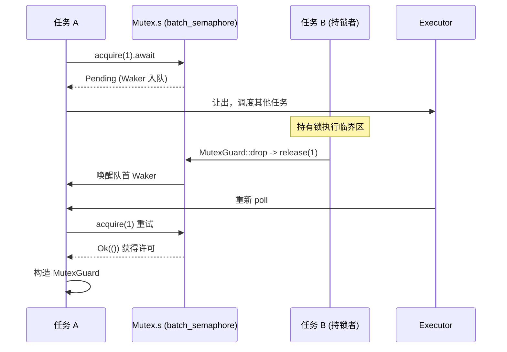

# 제 7 장: 동기화 원시 요소: Mutex, Semaphore 및 채널이 비동기 대기를 구현하는 방법

이전 장에서는 시간이 어떻게 I/O 이벤트로 추상화되어 타이머와 fd 준비가 동일한 park/unpark 대기 진입점을 공유하게 하는지 밝혔다. 그러나 여러 태스크가 같은 락을 두고 경쟁하거나 채널을 통해 메시지를 전달할 때, 대기 대상은 더 이상 fd나 시계가 아니라 다른 태스크의 상태 변화이다. 이 장에서는 tokio::sync 패밀리로 들어가, 한 번의 lock().await 또는 recv().await가 블록될 때 Waker를 어디에 저장하는지, 깨어날 때 어떻게 다시 스케줄링되는지 탐구한다.

# 왜 비동기 Mutex가 std 구현을 재사용할 수 없는가

## 직관적 모델: "자리 차지"에서 "자리 양보"로

`std::sync::Mutex`의`lock()`은 락이 점유되었을 때**현재 스레드를 블록한다**——스레드는 운영체제에 의해 일시 중단되고, 락이 해제될 때까지 기다린다. 이는 비동기 런타임에서 재앙적이다: 하나의 worker 스레드가 동시에 수백 수천 개의 태스크를 구동할 수 있는데, 락을 기다리느라 블록되면 그 스레드가 담당하는 다른 모든 태스크가 전부 멈춘다. 비동기 Mutex의 핵심 요구는: 락을 기다릴 때**스레드를 양보하고**, "내가 이 락을 기다리고 있다"는 사실을 큐에 등록한 뒤`Pending`을 반환하여, 실행기가 다른 태스크를 실행하게 하는 것이다.

Tokio의`Mutex`은 자체적으로 대기 큐를 구현하지 않고,**완전히 세마포어 위에 구축됨**。

## 데이터 구조와 메모리 레이아웃

`Mutex<T>`의 필드는 극도로 간결하다:

[FACT:tokio/src/sync/mutex.rs:133-138]

```rust
pub struct Mutex {
    #[cfg(all(tokio_unstable, feature = "tracing"))]
    resource_span: tracing::Span,
    s: semaphore::Semaphore,
    c: UnsafeCell,
}
```

세 필드가 각자의 역할을 한다:`s`은 하나의**허가 수가 1인 세마포어**，`c`은`UnsafeCell<T>`으로 감싸진 보호 데이터이다. 여기서`semaphore`은`batch_semaphore`의 별칭[FACT:tokio/src/sync/mutex.rs:3-3], 즉 저수준 구현이며,`sync::Semaphore`그 공개 래퍼 계층이 아니다.

`MutexGuard<'a, T>`은 단지`Mutex`에 대한 참조만 보유한다:

[FACT:tokio/src/sync/mutex.rs:151-157]

```rust
pub struct MutexGuard {
    #[cfg(all(tokio_unstable, feature = "tracing"))]
    resource_span: tracing::Span,
    lock: &'a Mutex,
}
```

여기에는 핵심 설계가 있다:`MutexGuard` **세마포어 허가 객체를 보유하지 않고**, 오직`&Mutex`만 보유한다. 잠금 해제 동작은`Drop`에서 발생하며, 직접`self.lock.s.release(1)` [FACT:tokio/src/sync/mutex.rs:959-961]을 호출한다. 이는`SemaphorePermit`이`permits: usize`카운트를 보유하고 Drop 시 반환하는 것과 다르다 — Mutex의 허가 수는 항상 1이므로 카운트가 필요 없다.

`Send`/`Sync`의 경계는 따로 살펴볼 가치가 있다:

[FACT:tokio/src/sync/mutex.rs:258-259]

```rust
unsafe impl Send for Mutex where T: ?Sized + Send {}
unsafe impl Sync for Mutex where T: ?Sized + Send {}
```

`Sync`은`T: Send`만 요구하며`T: Sync`은 요구하지 않는다 — 이는 합리적인데, 상호 배타적 접근이 동시에 하나의 스레드만`T`을 건드릴 수 있음을 보장하므로, 스레드 간에`T`의 소유권(`Send`)을 전달하는 것으로 충분하며,`T`자체가 공유 가능(`Sync`)할 필요는 없다. 이것이 바로`Mutex<T>`이`Sync`가 아닌`T`을`Sync`로 만들 수 있는 이유이다.

## 단계별: 한 번의`lock().await`완전한 여정

시나리오: 태스크 A가`mutex.lock().await`을 호출하고, 이때 잠금은 유휴 상태이다.

첫 번째 단계,`lock()`은 async 블록을 생성하고, 내부에서 먼저`self.acquire().await`한 후, 성공하면`MutexGuard` [FACT:tokio/src/sync/mutex.rs:434-443]。

을 생성한다.`acquire()`두 번째 단계,

[FACT:tokio/src/sync/mutex.rs:655-663]

```rust
async fn acquire(&self) {
    crate::trace::async_trace_leaf().await;
    self.s.acquire(1).await.unwrap_or_else(|_| {
        unreachable!()
    });
}
```

`unwrap_or_else(|_| unreachable!())`복사`acquire`이 줄의 주석은 설계 제약을 드러낸다: Mutex는 세마포어를 명시적으로 close하지 않으며, 독점적으로 보유하므로`Err`은 결코

을 반환하지 않는다. 이는 "세마포어 닫힘"이라는 오류 경로를 타입 수준에서 배제한 것이다.`s.acquire(1)`세 번째 단계, 잠금이 점유되어 있으면,`Pending`은**을 반환하고, 현재 태스크의 Waker가 세마포어의 대기 큐에 등록된다.**Waker는 어디에 저장되는가?`batch_semaphore`답은

의 대기 큐에 있다 (이 장의 소스 자료에서는 해당 파일을 전개하지 않았지만, 그 역할은: 각 대기자가 하나의 Waker를 보유하고 FIFO로 대기한다).`MutexGuard::drop`네 번째 단계, 잠금을 보유한 태스크 B가 잠금을 해제할 때,`s.release(1)` [FACT:tokio/src/sync/mutex.rs:965-975]은`acquire`을 호출하고, 세마포어는 허가를 큐 선두 대기자에게 넘기고 그 Waker를 깨우며, 태스크 A가 다시 스케줄되고,`Ok`이`MutexGuard`。

을 반환하여



## 전체 흐름은 아래 시퀀스 다이어그램으로 묘사할 수 있다:

복사[FACT:tokio/src/sync/mutex.rs:20-22]설계 사고: FIFO 공정성과 취소 안전성`lock`문서는 Tokio의 Mutex가 FIFO`select!`을 보장한다고 명확히 선언한다. 이 공정성은 저수준 세마포어의 큐잉 의미론에서 비롯된다. 공정성의 대가는: 한 번의**이 취소되면 (예를 들어** [FACT:tokio/src/sync/mutex.rs:415-419]에서 패배하면)`lock`큐에서의 위치를 잃는다

. 이는 버그가 아니라 FIFO 큐의 필연이다 — 취소는 큐에서 제거됨을 의미하며, 다시**하려면 다시 줄을 서야 한다.**（no poisoning）。`std::sync::Mutex`또 다른 반직관적 설계는`lock`이 독을 넣지 않는다`Err`는 것이다.[FACT:tokio/src/sync/mutex.rs:122-125]은 잠금 보유 스레드가 panic할 때 poisoned로 표시되고, 이후

`MutexGuard::map`이`MutexGuard<T>`을 반환한다. Tokio의 Mutex는 그렇게 하지 않는다: 보유자가 panic하면 잠금은 정상적으로 해제된다`MappedMutexGuard<U>`. 문서는 panic이 포착되면 보호 데이터가 일관성 없는 상태에 있을 수 있다고 경고한다. 이는 비동기 시나리오에서의 실용적 절충이다 — 비동기 태스크에서 panic은 보통 태스크 종료를 의미하며, 독극물 메커니즘은 오히려 복잡성을 증가시킨다.`data`시리즈 메서드는 언급할 가치가 있다. 이는 전체`skip_drop`을 특정 하위 필드만 보호하는`MutexGuardInner`로 강등할 수 있게 한다. 구현상, 먼저 클로저로 하위 필드 포인터[FACT:tokio/src/sync/mutex.rs:869-883]。`skip_drop`를 계산하고, 그다음`ManuallyDrop` + `ptr::read`을 통해 원래 guard를 Drop을 트리거하지 않는`Drop`로 분해하고, 마지막으로 새 guard[FACT:tokio/src/sync/mutex.rs:827-836]를 생성한다.

# 은

## 을 사용하여 필드 소유권을 이전하고,

이 두 번 호출되는 것을 피한다`acquire`. 이는 Rust에서 "소유권을 이전하되 소멸을 트리거하지 않는" 전형적인 기법이다.`release`Semaphore: 허가 카운트와 대기 큐가 백프레셔를 구현하는 방법`acquire_many(n)`직관적 모델: 주차장의 주차 공간

## 세마포어는 주차장과 같다:

은 차를 몰고 들어가는 것이고, 빈자리가 있으면 들어가고, 없으면 입구에서 줄을 선다;`Semaphore`은 차를 몰고 나가는 것이고, 자리가 하나 비면 큐 선두의 차에게 들어오라고 알린다. 허가 수는 총 주차 공간 수이고,`batch_semaphore::Semaphore`은 n개의 주차 공간을 차지하는 큰 차이다.

[FACT:tokio/src/sync/semaphore.rs:427-432]

```rust
pub struct Semaphore {
    ll_sem: ll::Semaphore,
    #[cfg(all(tokio_unstable, feature = "tracing"))]
    resource_span: tracing::Span,
}
```

`SemaphorePermit<'a>`공개된

[FACT:tokio/src/sync/semaphore.rs:442-445]

```rust
pub struct SemaphorePermit {
    sem: &'a Semaphore,
    permits: usize,
}
```

`permits`의 얇은 래퍼이다:`forget`/`merge`/`split`복사`forget`은 세마포어 참조와 허가 카운트를 보유한다:`permits`복사[FACT:tokio/src/sync/semaphore.rs:1193-1195]필드는`split`을 이해하는 핵심이다.[FACT:tokio/src/sync/semaphore.rs:1260-1271]。`merge`은[FACT:tokio/src/sync/semaphore.rs:1230-1240]。

> **[Design Inference & Architectural Trade-offs]**
> `MAX_PERMITS`, Drop 시 0개의 허가를 반환한다 — 이는 이 허가들을 "영구 소비"하는 것과 동등하다.`usize::MAX >> 3` [FACT:tokio/src/sync/semaphore.rs:476-479]은 현재 허가에서 n개를 잘라 새 permit에 준다.`batch_semaphore`은 다른 permit의 카운트를 병합하고, 둘이 같은 세마포어에서 왔음을 단언한다`usize`〔설계 추론과 아키텍처 절충〕

## 은

이다. 왜 오른쪽으로 3비트 시프트하는가? 저수준`acquire()`은 상위 비트에 상태 플래그(예: 닫힘 플래그)를 인코딩해야 하므로, 사용 가능한 허가 수를 하위 비트로 제한하고 상위 비트를 플래그용으로 남긴다. 이는 "카운트 + 상태"를 단일`acquire_many(2)`。

`acquire()`에 압축하는 흔한 기법이다.`ll_sem.acquire(1)`단계별: acquire와 release의 허가 흐름`SemaphorePermit { permits: 1 }` [FACT:tokio/src/sync/semaphore.rs:614-631]。`acquire_many(2)`시나리오: 세마포어 초기 허가 2개, 태스크 A[FACT:tokio/src/sync/semaphore.rs:661-679]。

, 태스크 B`ll_sem.acquire(n)`은`Pending`에 위임하고, 성공 후`acquire_many(5)`을 생성한다.`acquire(1)`과 유사하지만 2를 전달한다[FACT:tokio/src/sync/semaphore.rs:19-24]허가가 부족하면,

은

[FACT:tokio/src/sync/semaphore.rs:1402-1404]

```rust
impl Drop for SemaphorePermit {
    fn drop(&mut self) {
        self.sem.add_permits(self.permits);
    }
}
```

`add_permits`인데 현재 3개의 허가만 남아 있고, 뒤에`ll_sem.release(n)` [FACT:tokio/src/sync/semaphore.rs:568-570]이 있어 즉시 충족할 수 있더라도, 기다려야 한다고 지적한다 — 큐 선두의 큰 차가 큐를 차지하고 있기

때문이다. 이는 엄격한 FIFO의 대가이며, 기아를 방지한다.`AcqRel`해제 경로는 Drop에 있다:`AcqRel` [FACT:tokio/src/sync/semaphore.rs:35-42]. 이는 '데이터를 먼저 쓰고 release 허가를 하는' 쓰기가 '나중에 acquire 허가를 하는' 태스크에 가시적임을 의미한다——세마포어는 태스크 간에 데이터를 안전하게 전달할 수 있다.

## 설계 고찰: close와 배압

`close()`모든 대기자가`AcquireError`를 수신하고, 이후`try_acquire`가`Closed` [FACT:tokio/src/sync/semaphore.rs:1161-1163]를 반환하게 한다. 이것이 우아한 종료의 기초이다: 수신 측이 더 이상 데이터를 필요로 하지 않을 때, close 세마포어는 모든 블로킹된 송신자가 영원히 기다리는 대신 즉시 실패로 반환하게 할 수 있다.

배압의 본질은 mpsc에서 가장 명확하게 드러난다. 다음 절에서 보겠지만, mpsc의 용량 제어는 허가 수가 buffer 크기와 같은 세마포어로 구현된다.

# 채널 패밀리: 대기자 큐와 Waker 깨우기의 서로 다른 절충

## 직관적 모델: 네 가지 채널, 네 가지 대기 전략

`oneshot`은 '일회용 봉투'이다——편지 한 통만 보낼 수 있고, 송신자는 기다리지 않으며(`send`는 동기적이다), 수신자는`await`편지를 기다린다.`mpsc`은 '유계 컨베이어 벨트'이다——송신자는 벨트가 가득 차면 기다리고, 수신자는 비어 있으면 기다리며, 용량은 세마포어로 제어된다.`broadcast`와`watch`는 '방송 확성기'이다——하나의 송신자, 여러 수신자이지만, 둘은 '뒤처짐'에 대한 처리가 전혀 다르다.

이 절의 소스 자료는`oneshot`와`mpsc::bounded`에 초점을 맞추며, 하나씩 분석한다.

## oneshot: 상태 비트로 인코딩된 극도로 간결한 핸드셰이크

`oneshot`의`Inner`구조는 그 설계를 이해하는 핵심이다:

[FACT:tokio/src/sync/oneshot.rs:386-409]

```rust
struct Inner {
    state: AtomicUsize,
    value: UnsafeCell>,
    tx_task: Task,
    rx_task: Task,
}
```

`state`은`AtomicUsize`이며, 비트 플래그로 전체 채널의 상태를 인코딩한다. 네 개의 플래그 비트는 파일 끝에 정의되어 있다:

[FACT:tokio/src/sync/oneshot.rs:1488-1505]

```rust
const RX_TASK_SET: usize = 0b00001;
const VALUE_SENT: usize = 0b00010;
const CLOSED: usize = 0b00100;
const TX_TASK_SET: usize = 0b01000;
```

`value`은`UnsafeCell<Option<T>>`，`tx_task`과`rx_task`은`Task`타입이며, 내부는`UnsafeCell<MaybeUninit<Waker>>` [FACT:tokio/src/sync/oneshot.rs:411-411]이다. 주목할 점은`MaybeUninit`——Waker는 초기화되지 않았을 수 있으며, 유효한지는`state`안의`RX_TASK_SET`/`TX_TASK_SET`비트로 결정된다[FACT:tokio/src/sync/oneshot.rs:396-399]。

**이 설계의 정수**：`VALUE_SENT`비트는 '값이 전송되었음'을 나타낼 뿐만 아니라,`UnsafeCell`의 접근 권한 귀속을 결정한다. 주석은 매우 명확하게 쓰여 있다[FACT:tokio/src/sync/oneshot.rs:1491-1496]: 만약`VALUE_SENT`이 설정되면,`UnsafeCell`은 수신자만 접근할 수 있고; 설정되지 않으면 송신자만 접근할 수 있다. 이렇게 하나의 원자적 비트로 락 없는 소유권 이전을 구현하여 추가적인 락을 피한다.

`send`의 흐름:

[FACT:tokio/src/sync/oneshot.rs:622-646]

```rust
pub fn send(mut self, t: T) -> Result {
    let inner = self.inner.take().unwrap();
    inner.value.with_mut(|ptr| unsafe {
        *ptr = Some(t);
    });
    if !inner.complete() {
        unsafe {
            return Err(inner.consume_value().unwrap());
        }
    }
    Ok(())
}
```

먼저 값을`UnsafeCell`에 쓴다(이때`VALUE_SENT`은 설정되지 않았으므로 수신자는 접근하지 않는다), 그런 다음`complete()`를 호출하여`VALUE_SENT`。`complete()`설정을 시도한다. 이는 CAS 루프이다:

[FACT:tokio/src/sync/oneshot.rs:1516-1549]

```rust
fn set_complete(cell: &AtomicUsize) -> State {
    let mut state = cell.load(Ordering::Relaxed);
    loop {
        if State(state).is_closed() {
            break;
        }
        match cell.compare_exchange_weak(
            state, state | VALUE_SENT, Ordering::AcqRel, Ordering::Acquire,
        ) {
            Ok(_) => break,
            Err(actual) => state = actual,
        }
    }
    State(state)
}
```

왜 단순한`fetch_or`대신 CAS를 사용하는가? 주석이 명확히 설명한다[FACT:tokio/src/sync/oneshot.rs:1517-1529]: 만약 채널이 이미`CLOSED`이면,**할 수 없다**다시`VALUE_SENT`을 설정할 수 없다. 왜냐하면 일단 설정되면 수신자는`UnsafeCell`에 접근할 수 있다고 생각하는데, 이때 송신자는 값을 되가져가려고 준비 중이며(`consume_value`), 양쪽이 동시에 접근하면 데이터 경쟁이 발생한다. 따라서 CAS 루프는`CLOSED`을 발견하면 조기에 break하여 설정하지 않는다.

`complete()`가 반환된 후, 성공적으로 설정되었고`RX_TASK_SET`이 이미 설정되어 있으면 수신자를 깨운다:

[FACT:tokio/src/sync/oneshot.rs:1300-1315]

```rust
fn complete(&self) -> bool {
    let prev = State::set_complete(&self.state);
    if prev.is_closed() {
        return false;
    }
    if prev.is_rx_task_set() {
        unsafe {
            self.rx_task.with_task(Waker::wake_by_ref);
        }
    }
    true
}
```

수신자의`poll_recv`은 상태 기계의 핵심이다:

[FACT:tokio/src/sync/oneshot.rs:1317-1384]

먼저 상태를 로드하고, 만약`is_complete()`이면 직접`consume_value`을 반환하며; 만약`is_closed()`이면`Err`을 반환하고; 그렇지 않으면 'Waker 등록' 분기로 들어간다. 등록 시 먼저`is_rx_task_set()`을 확인하고, 이미 설정되어 있고`will_wake`이 동일한 Waker로 판단되면 중복 설정하지 않으며; 다르면 먼저 unset한 후 set한다. 여기에는 미묘한 경쟁 처리 가 있다: unset 후에`is_complete()`이 참이 된 것을 발견하면, 플래그 비트를**다시 set해야 한다** [FACT:tokio/src/sync/oneshot.rs:1342-1344], 그렇지 않으면 Waker가 Drop 시 누출된다(Drop이 플래그 비트에 의존하여 Waker를 drop할지 판단하기 때문이다).

이 'unset 후 재설정' 패턴은`poll_closed`에서도 나타나며[FACT:tokio/src/sync/oneshot.rs:839-848], oneshot이 동시 깨우기를 처리하는 표준 기법이다.

## mpsc::bounded: 세마포어가 구동하는 배압

mpsc의 용량 제어는 전적으로 세마포어에 위임된다.`channel`함수는 허가 수가 buffer와 같은 세마포어를 생성한다:

[FACT:tokio/src/sync/mpsc/bounded.rs:159-171]

```rust
pub fn channel(buffer: usize) -> (Sender, Receiver) {
    assert!(buffer > 0, "mpsc bounded channel requires buffer > 0");
    let semaphore = Semaphore {
        semaphore: semaphore::Semaphore::new(buffer),
        bound: buffer,
    };
    let (tx, rx) = chan::channel(semaphore);
    let tx = Sender::new(tx);
    let rx = Receiver::new(rx);
    (tx, rx)
}
```

`Semaphore`은 mpsc 내부의 래퍼로,底层 세마포어와`bound`(최대 용량)을 동시에 보유한다[FACT:tokio/src/sync/mpsc/bounded.rs:176-179]。`bound`은`max_capacity`조회에 사용되고,`available_permits`은 현재 용량을 제공한다[FACT:tokio/src/sync/mpsc/bounded.rs:591-593]。

송신 경로`send`은 먼저`reserve`한 후`send`：

[FACT:tokio/src/sync/mpsc/bounded.rs:816-824]

```rust
pub async fn send(&self, value: T) -> Result> {
    match self.reserve().await {
        Ok(permit) => {
            permit.send(value);
            Ok(())
        }
        Err(_) => Err(SendError(value)),
    }
}
```

`reserve`내부에서`reserve_inner(1)`을 호출하며, 후자는 먼저`n > max_capacity`을 확인하여 직접 오류를 반환하고, 그런 다음`acquire(n)` [FACT:tokio/src/sync/mpsc/bounded.rs:1272-1311]을 한다. 여기에는 정교한`WakeReceiverOnDrop`가드가 있다:

[FACT:tokio/src/sync/mpsc/bounded.rs:1286-1301]

```rust
struct WakeReceiverOnDrop {
    chan: &'a chan::Tx,
}
impl Drop for WakeReceiverOnDrop {
    fn drop(&mut self) {
        use chan::Semaphore;
        let semaphore = self.chan.semaphore();
        if semaphore.is_closed() && semaphore.is_idle() {
            self.chan.wake_rx();
        }
    }
}
```

주석이 동기를 설명한다[FACT:tokio/src/sync/mpsc/bounded.rs:1279-1285]: 만약`reserve`이 부분 허가를 얻은 후 취소되면(예:`select!`이 패배), 底层`Acquire`은 Drop 시 이 허가들을 반환하지만,**하지 않는다**처럼`Permit`수신자에게 알리지 않는다. 만약 이때 채널이 이미 닫혔고 유휴 상태라면, 수신자는 '채널이 닫혔음' 알림을 영원히 받지 못할 수 있다. 이 가드는 Drop 시 이 깨우기를 보충한다. 성공 시`mem::forget(guard)`으로 가드를 취소하며[FACT:tokio/src/sync/mpsc/bounded.rs:1306-1306], 성공 경로는`Permit`이 알림 책임을 인계받기 때문이다.

`Permit`의 Drop도 같은 일을 한다:

[FACT:tokio/src/sync/mpsc/bounded.rs:1732-1745]

```rust
impl Drop for Permit {
    fn drop(&mut self) {
        use chan::Semaphore;
        let semaphore = self.chan.semaphore();
        semaphore.add_permit();
        if semaphore.is_closed() && semaphore.is_idle() {
            self.chan.wake_rx();
        }
    }
}
```

`Permit::send`은`mem::forget`으로 Drop을 건너뛰어 허가 반환을 피한다[FACT:tokio/src/sync/mpsc/bounded.rs:1721-1728]。

수신 경로`recv`은`poll_fn`으로`chan.recv(cx)` [FACT:tokio/src/sync/mpsc/bounded.rs:243-246]。`poll_recv`을 래핑하여 직접[FACT:tokio/src/sync/mpsc/bounded.rs:650-652]에 위임한다. 실제 대기 큐 로직은`chan`모듈에 있지만(이 장에서 다루지 않음), 추론할 수 있다: 수신자 Waker는`chan::Rx`에 저장되고, 송신자가`send`할 때 깨운다.

`try_send`은 비블로킹 경로를 보여준다:

[FACT:tokio/src/sync/mpsc/bounded.rs:924-934]

```rust
pub fn try_send(&self, message: T) -> Result> {
    match self.chan.semaphore().semaphore.try_acquire(1) {
        Ok(()) => {}
        Err(TryAcquireError::Closed) => return Err(TrySendError::Closed(message)),
        Err(TryAcquireError::NoPermits) => return Err(TrySendError::Full(message)),
    }
    self.chan.send(message);
    Ok(())
}
```

`try_acquire`의 두 가지 오류는 정확히`Closed`과`Full`에 매핑되어, '채널 닫힘'과 '버퍼 가득 참' 두 가지 실패를 구분한다.

## 설계 고찰: 취소 안전성과 메시지 손실

mpsc 문서는 취소 안전성을 반복적으로 강조한다[FACT:tokio/src/sync/mpsc/bounded.rs:776-784]：`send`이`select!`에서 패배하면,**메시지가 버려진다**. 손실을 피하려면 반드시`reserve`으로`Permit`을 얻은 후`send`해야 한다——왜냐하면`Permit`이 이미 용량을 예약했고,`send`은 동기적이며 중단되지 않기 때문이다.

`recv`은 취소 안전한[FACT:tokio/src/sync/mpsc/bounded.rs:199-204]이다: 만약`recv`이`select!`에서 패배하면, 메시지가 소비되지 않음이 보장된다. 이는`recv`의`poll_recv`이 실제로 메시지를 얻었을 때만`Ready`，`Pending`을 반환하고

`oneshot`시 큐를 건드리지 않기 때문이다.`Receiver`의[FACT:tokio/src/sync/oneshot.rs:246-251]은 Future로서 취소 안전하다`oneshot`. 하지만 주의할 점:`send`의`Err`은 동기적이므로 'send가 취소되는' 문제는 존재하지 않는다——要么 보내지거나,

# 이 원래 값을 반환한다.

**함정 1: 비동기 Mutex로 순수 데이터를 보호하는 것.**문서는 명확히 권장한다[FACT:tokio/src/sync/mutex.rs:26-36]: 보호 대상이 순수 데이터(없음`.await`요구사항)라면,`std::sync::Mutex`또는`parking_lot`가 더 빠르다. 비동기 Mutex의 오버헤드는 세마포어의 원자적 연산과 가능한 태스크 스케줄링에 있다. 오직 잠금을 보유한 동안`.await`(예: 잠금을 보유하고 데이터베이스 연결에 접근)이 필요할 때만 비동기 Mutex를 사용해야 한다.

**함정 2: 잠금을 보유한 채`.await`를 넘어 데드락 발생.**이것은 비동기 Mutex의 가장 위험한 함정이다. 만약 태스크 A가 잠금을 보유한 후`.await`태스크 B의 완료가 필요한 이벤트를 기다리고, 태스크 B는 이 잠금을 기다린다면, 데드락이 발생한다.`std::sync::Mutex`의 guard는`Send`가 아니므로(이동 가능한 태스크에서), 컴파일러는`.await`를 넘어 보유하는 것을 막는다; 그러나 비동기 Mutex의 guard는`Send` [FACT:tokio/src/sync/mutex.rs:314-314]이므로, 컴파일러가 막지 않으며, 순환 대기를 형성하지 않도록 스스로 보장해야 한다.

**함정 3:`reserve`후`send`。** `Permit`를 잊는 것. Drop은 허가를 반환하므로[FACT:tokio/src/sync/mpsc/bounded.rs:1732-1745], 용량이 누출되지 않는다. 그러나 채널이 닫혔고 유휴 상태라면, Drop은 수신자를 깨운다—이 깨움은 필수적이며, 그렇지 않으면 수신자가 닫힘 알림을 영원히 기다릴 수 있다.

**함정 4:`oneshot`의`poll`는 거짓`Pending`。**일 수 있다. 문서 설명[FACT:tokio/src/sync/oneshot.rs:236-242]: 메시지가 이미 전송되었더라도,`poll`는`Pending`를 반환할 수 있다. 이것은 버그가 아니라 동시성 경쟁 상태에서의 정상 현상이다—호출자는 깨어나 재시도하며, 메시지는 손실되지 않고 단지 지연될 뿐이다.

**함정 5:`forget_permits`의 의미론.** `forget_permits(n)`n개의 허가를 줄이려 시도하고, 실제로 줄어든 수를 반환한다[FACT:tokio/src/sync/semaphore.rs:576-578]. 이것은 블록하지 않고, 대기자를 깨우지도 않는다—단순히 허가를 "삼킨다". 동적으로 세마포어 용량을 축소하는 데 사용된다.

# 이 장 요약

이 장은`tokio::sync`의 핵심 패턴을 밝힌다:**모든 비동기 대기 원시 요소는 "대기자 큐 + Waker 깨움" 위에 구축되며, 큐의 구체적 구현은 시나리오에 따라 다르다**。

- `Mutex`허가 수가 1인 세마포어를 재사용하고,`MutexGuard`참조만 보유하며, Drop 시`release(1)`, FIFO 공정하지만 독살하지 않는다.
- `Semaphore`는 허가 카운트 + 대기 큐이며,`SemaphorePermit`는`permits`카운트를 사용하여`forget`/`merge`/`split`，`MAX_PERMITS`를 지원하고, 오른쪽으로 3비트 시프트하여 상태 플래그를 위한 자리를 남긴다.
- `oneshot`단일`AtomicUsize`의 비트 플래그로 상태를 인코딩하고,`VALUE_SENT`비트가 동시에`UnsafeCell`의 접근 권한 귀속을 결정하며, CAS 루프는`CLOSED`후 설정을 방지한다.
- `mpsc::bounded`허가 수가 buffer와 같은 세마포어로 배압을 구현하고,`WakeReceiverOnDrop`가드는 취소 시 깨움 보상을 처리한다.

# 이 장 사고와 자가 테스트

Q: 만약`set_complete`의 CAS 루프를 단순한`fetch_or(VALUE_SENT)`로 바꾸면, 어떤 동시성 시나리오에서 데이터 경쟁이 발생하는가?

**참고 해석**：`set_complete`가`fetch_or`대신 CAS 루프를 사용하는 이유는 주석에 명시되어 있다[FACT:tokio/src/sync/oneshot.rs:1517-1529]: 반드시`VALUE_SENT`를 설정하기 전에`CLOSED`를 확인해야 한다. 만약 무조건`fetch_or`로 바꾸면, 이 타이밍을 고려하라: 수신자가 먼저`close()`를 호출하여`CLOSED` [FACT:tokio/src/sync/oneshot.rs:1569-1574]를 설정하고, 송신자가 이후`send`로 값을 쓰고`fetch_or(VALUE_SENT)`를 한다. 이때`VALUE_SENT`와`CLOSED`가 동시에 설정되고, 수신자의`poll_recv`는`is_complete()`가 참임을 보고`consume_value`를 호출하여 값[FACT:tokio/src/sync/oneshot.rs:1325-1330]을 가져간다; 그리고 송신자의`complete()`가 반환된 후,`prev.is_closed()`가 참이므로`consume_value`를 호출하여 값을 되찾는다[FACT:tokio/src/sync/oneshot.rs:1300-1315]. 양쪽이 동시에`UnsafeCell`에 접근하여 데이터 경쟁이 발생한다. CAS 루프는`CLOSED`를 발견하면 조기 break하여`VALUE_SENT`를 설정하지 않음으로써, "닫힌 후 송신자 독점 접근 권한"이라는 불변성을 보장한다.

Q: `reserve_inner`의`WakeReceiverOnDrop`가드는 성공 경로에서`mem::forget`로 건너뛰는데, 만약 이`forget`를 제거하면 무슨 일이 발생하는가?

**참고 해석**: 가드의 Drop 로직은 "세마포어가 닫혔고 유휴 상태면 수신자를 깨운다"[FACT:tokio/src/sync/mpsc/bounded.rs:1290-1298]이다. 성공 경로에서,`acquire(n)`는`Ok`를 반환하고, 호출자는 허가를 얻고`Permit`를 구성할 것이며,`Permit`가 이후 알림 책임을 맡는다. 만약 가드를 제거하지 않으면, 가드는 함수 반환 시 Drop되어 "닫혔고 유휴"를 추가로 확인한다—그러나 이때 허가는 이미`reserve_inner`의 호출자가 보유하고 있어, 세마포어는 유휴가 아니므로(`is_idle`가 거짓), 실제로 중복 깨움은 발생하지 않는다. 그러나 더 중요한 것은 의미론적 명확성이다: 성공 경로의 깨움 책임은 전적으로`Permit`가 맡아야 하며, 가드는 "취소/실패" 경로의 보상만 담당한다.`mem::forget`는 "이 경로는 가드가 필요 없다"는 의도를 명확히 표현한다. 만약`forget`를 제거하고 마침 세마포어가 "닫혔고 유휴" 경계 상태에 있다면(예:`acquire`가`Ok`를 반환했지만 허가가 아직`Permit`에 의해 인수되지 않음), 중복 깨움이 한 번 발생할 수 있다—오류를 초래하지는 않지만, 스케줄링을 한 번 낭비한다.

Q: 만약`MutexGuard`를 세마포어 허가 객체를 보유하도록(`SemaphorePermit`처럼) 바꾸면, 어떤 문제가 발생하는가?

**참고 해석**: 현재`MutexGuard`는`&Mutex`만 보유하고, Drop 시`self.lock.s.release(1)` [FACT:tokio/src/sync/mutex.rs:959-961]를 호출한다. 만약 허가 객체를 보유하도록 바꾸면, 몇 가지 문제가 발생한다. 첫째,`MutexGuard::map`계열 메서드는 guard를`MappedMutexGuard`로 분해하여 하위 필드[FACT:tokio/src/sync/mutex.rs:869-883]만 보호해야 한다. 현재 설계에서,`MappedMutexGuard`는`&Semaphore`와 하위 필드 포인터[FACT:tokio/src/sync/mutex.rs:190-199]만 보유하면 되고, Drop 시`self.s.release(1)` [FACT:tokio/src/sync/mutex.rs:1252-1262]를 한다. 만약 guard가 허가 객체를 보유하면, map 시 허가 객체의 소유권을 이전해야 하며,`MappedMutexGuard`의 필드 레이아웃이 더 복잡해진다. 둘째, 허가 객체는 보통`permits: usize`카운트를 가지며, Mutex에 대해 이 카운트는 항상 1이므로 중복이다. 셋째,`MutexGuard`의`Send`/`Sync`경계는 이미`unsafe impl`를 통해 정확히 제어되어[FACT:tokio/src/sync/mutex.rs:260-263], 허가 객체를 보유하면 추가 trait 제약이 도입된다. 현재 "참조만 보유 + 수동 release" 설계가 더 가볍고,`map`。

를 더 쉽게 지원한다. 여기까지, 우리는`tokio::sync`가 "대기자 큐 + Waker 깨움"이라는 통일된 패턴으로 Mutex, Semaphore 및 다양한 채널의 비동기 대기를 어떻게 지원하는지 명확히 보았다. 그러나 모든 블로킹이 비동기화될 수 있는 것은 아니다—일부 작업(예: 파일 시스템 호출, CPU 집약 계산)은 본질적으로 스레드를 블록한다. 다음 장에서는`spawn_blocking`스레드 풀과`block_on`의 경계로 들어가, Tokio가 비동기 런타임과 동기 블로킹 사이에 어떻게 다리를 놓는지 살펴본다.

Waker의 저장 위치는 원시 연산에 따라 다르다: Mutex/Semaphore는 하위 세마포어의 대기 큐에, oneshot은 Inner의 tx_task/rx_task 필드에, mpsc는 chan 모듈의 송수신 큐에 저장된다. 그러나 깨우기 메커니즘은 통일되어 있다: 상태 변경 시 Waker를 꺼내 wake_by_ref를 호출하면 실행기가 태스크를 다시 스케줄링한다. 여기까지 비동기 원시 연산 내부의 대기와 깨우기가 명확히 드러났다. 그러나 모든 코드가 비동기화될 수 있는 것은 아니다—다음 장에서는 spawn_blocking으로 블로킹 작업을 브리징하는 방법과 block_on이 비동기 컨텍스트가 아닌 곳에서 Future를 구동하는 방법을 살펴본다.
