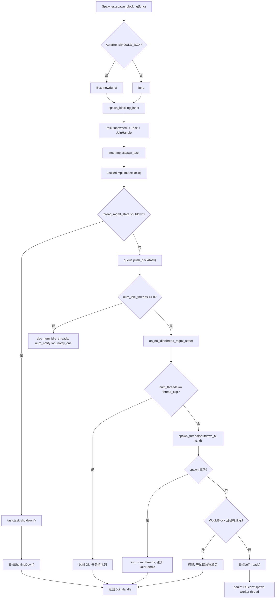
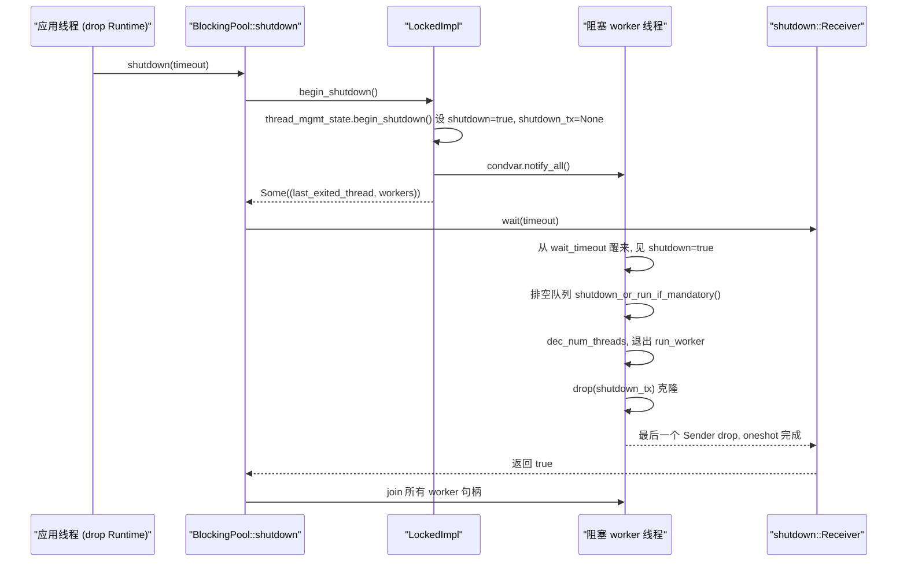

# 제 8 장: 블로킹과 브리징: spawn_blocking 스레드 풀과 block_on의 경계

이전 장에서 우리는 비동기 Mutex와 채널이 대기할 때 스레드를 점유하지 않을 수 있는 핵심이 Waker를 대기 큐에 저장하고, 조건이 충족된 후 깨우는 자가 태스크를 다시 스케줄링하는 데 있다는 것을 보았다. 그러나 이 모든 것의 전제는 태스크가 Pending일 때 능동적으로 스레드를 양보할 수 있다는 것이다. 일단 코드가 std::fs::read, libsqlite3 또는 순수 CPU 압축 루프를 호출하면, 반환될 때까지 worker 스레드를 독점하게 되고, 그 동안 해당 스레드의 다른 태스크들은 모두 굶어 죽는다. Tokio의 해결책은 이런 작업을 독립적인 블로킹 스레드 풀에 외주하고, block_on으로 비동기 컨텍스트가 아닌 곳에서 Future를 구동하는 것이다. 이 장에서는 이 두 경계를 분해한다.

# 8.1 블로킹 스레드 풀의 메모리 레이아웃: Inner와 이중 구현 큐

**직관적 모델**：`spawn_blocking`스레드 풀은 식당의 「외주 도우미 풀」과 같다. 홀 서빙 직원(worker 스레드)은 주문 받고 음식 나르는 것만 담당하고, 오래 끓여야 하는 요리를 만나면 작업 지시서를 써서 주방의 전달 창구(큐)에 던져 넣고, 도우미(블로킹 스레드)가 창구에서 주문서를 가져간다. 이 풀이 없다면 서빙 직원이 직접 요리해야 하고, 식당 전체가 멈춘다.

**핵심 구조**. 전체 풀은`BlockingPool`이 보유하며, 두 가지만 저장한다: 복제 가능한`Spawner`(투입 입구)와`shutdown_rx`(종료 신호 수신단)[FACT:tokio/src/runtime/blocking/pool.rs:20-23]。`Spawner`내부는`Arc<Inner>`이며, 모든 투입자가 동일한 상태를 공유한다[FACT:tokio/src/runtime/blocking/pool.rs:26-28]。

`Inner`은 풀의 전체 상태이며, 필드를 하나씩 살펴볼 가치가 있다[FACT:tokio/src/runtime/blocking/pool.rs:77-104]：

- `inner_impl: InnerImpl`: 큐 + 알림 + 잠금 토폴로지의 구현으로, 열거형이며`Locked`과`Sharded`두 가지 변형이 있다[FACT:tokio/src/runtime/blocking/pool.rs:107-110]. 이것이 이 장의 가장 핵심적인 추상화다—「단일 잠금 큐」와 「샤딩 큐」 두 토폴로지를 하나의 인터페이스 아래 통합한다.
- `thread_cap: usize`: 스레드 수 상한, 즉`max_blocking_threads`。
- `scheduler_threads: usize`: 스케줄러 worker 스레드 수, 지표에서 차감하는 데 사용되어`num_blocking_threads`이 블로킹 스레드만 집계하도록 한다[FACT:tokio/src/runtime/blocking/pool.rs:455-460]。
- `keep_alive: Duration`: 유휴 스레드 생존 시간, 기본값`KEEP_ALIVE = 10s` [FACT:tokio/src/runtime/blocking/pool.rs:231]。
- `metrics: SpawnerMetrics`: 세 개의 원자 카운터——`num_threads`、`num_idle_threads`、`queue_depth` [FACT:tokio/src/runtime/blocking/pool.rs:31-35]。

> **[Design Inference & Architectural Trade-offs]**
> **왜 잠금 내 필드 대신 원자 카운터를 사용하는가?** `num_idle_threads`은`spawn_task`의 핫 패스에서 읽힌다(유휴 스레드를 깨워야 하는지 판단). 만약 이것이`Mutex`안에 숨어 있다면, 매번 투입할 때마다 먼저 잠금을 잡고 읽어야 한다. 이것을`MetricAtomicUsize`으로 만들면, 투입 경로가 큐 잠금을 보유하지 않고 먼저 빠른 판단을 할 수 있다. 대가는 이 카운터들과 큐 상태 사이에 원자성 보장이 없다는 것이며, 따라서 코드에서`num_notify`카운터로 보상한다—아래 참조.

**스레드 관리 상태**。`ThreadManagementState`이 별도로 추출되어 두 큐 구현에서 재사용된다[FACT:tokio/src/runtime/blocking/pool.rs:135-150]：

- `shutdown: bool`: 종료 플래그.
- `shutdown_tx: Option<shutdown::Sender>`: 각 worker 스레드가 하나의 복제본을 보유하며, 모두 drop된 후`shutdown_rx`이 알림을 받는다.
- `last_exiting_thread: Option<JoinHandle<()>>`: 마지막으로 타임아웃 종료한 스레드 핸들.
- `worker_threads: HashMap<usize, JoinHandle<()>>`: 모든 살아있는 worker의 핸들.
- `worker_thread_index: usize`: 단조 증가하는 스레드 ID 할당기.

`last_exiting_thread`의 설계 동기는 주석에 명확히 쓰여 있다: 타임아웃 종료한 스레드가 이전에 타임아웃 종료한 스레드를 join하여 Valgrind 오탐을 피한다[FACT:tokio/src/runtime/blocking/pool.rs:135-150]。`worker_timed_out`이 바로 이 체인 join의 구현이다—자신의 핸들을 제거하고, 이전`last_exiting_thread`을 교체하여 호출자에게 반환해 join하게 한다[FACT:tokio/src/runtime/blocking/pool.rs:172-178]。

**태스크 래핑**. 큐에 저장되는 것은`Task`이며, 이는`UnownedTask<BlockingSchedule>`과`Mandatory`플래그를 감싼다[FACT:tokio/src/runtime/blocking/pool.rs:187-191]。`Mandatory`은 종료 시 이 태스크가 버려질지 강제 실행될지를 결정한다:`shutdown_or_run_if_mandatory`은`NonMandatory`시`shutdown()`을 호출하고,`Mandatory`시`run()` [FACT:tokio/src/runtime/blocking/pool.rs:223-228]을 호출한다. 이것이`spawn_blocking`(비강제)와`spawn_mandatory_blocking`(강제, fs에서 사용)의 차이다[FACT:tokio/src/runtime/blocking/pool.rs:233-265]。

**단일 잠금 구현의 메모리 레이아웃**。`LockedImpl`은 가장 원시적인 토폴로지다:`Mutex<LockedInner>`하나에`Condvar` [FACT:tokio/src/runtime/blocking/pool.rs:113-116]。`LockedInner`하나를 더한 것`VecDeque<Task>`、`num_notify: u32`안에는`thread_mgmt_state` [FACT:tokio/src/runtime/blocking/pool.rs:118-124]과`num_notify`이 있다. 주목할 점은`thread_mgmt_state`과`num_idle_threads`이 같은 잠금 아래에 있고,

# 은 잠금 밖의 원자량이라는 것이다—이러한 「일부 상태는 잠금 안에, 일부는 잠금 밖에」 있는 혼합 레이아웃이 바로 이후 모든 동시성 미묘함의 근원이다.

**8.2 투입 경로: spawn_blocking에서 스레드 깨우기까지**시나리오`tokio::task::spawn_blocking(move || heavy_compute(data))`: 비동기 태스크에서

**을 호출하면, 이 순간 무슨 일이 일어나는가?**。`Spawner::spawn_blocking`1단계: 박싱 결정과 태스크 구성`fn_size`은 먼저 클로저 크기`AutoBox::<F>::SHOULD_BOX`를 측정한 후,`Box`에 따라 클로저를[FACT:tokio/src/runtime/blocking/pool.rs:359-389]할지 결정한다

. 이것은 Tokio의 일반적인 「큰 Future 자동 박싱」 전략이다: 클로저가 너무 크면 박싱하여 태스크 구조체 비대화를 피한다.`spawn_blocking_inner`에 진입하여, 먼저 태스크 ID를 할당하고,`blocking_task`으로 클로저를 Future로 감싼 후,`task::unowned`으로`UnownedTask`과`JoinHandle` [FACT:tokio/src/runtime/blocking/pool.rs:440-449]을 구성한다. 여기서 반환되는 것은`(JoinHandle<R>, Result<(), SpawnError>)`이중 튜플이다—핸들과 투입 결과가 분리되어 반환된다.

**2단계: 투입 결과의 세 가지 처리**.`spawn_blocking`로 돌아가서,`spawn_result`에 대해 매칭한다[FACT:tokio/src/runtime/blocking/pool.rs:381-388]：

- `Ok(())`: 정상이면 핸들을 반환한다.
- `Err(ShuttingDown)`：**panic하지 않음**, 여전히 핸들을 반환한다. 주석은 이것이 호환성 고려사항이라고 설명한다 — 핸들은 결코 resolve되지 않지만, 호출자는 런타임이 종료 중이라는 이유로 크래시하지 않는다.
- `Err(NoThreads(e))`: OS가 스레드를 생성할 수 없고 풀에서 아무도 인수하지 않으면, 직접 panic한다.

**세 번째 단계: 큐잉과 깨우기 결정**。`spawn_task`가`on_no_idle`클로저를`InnerImpl::spawn_task`에 전달하고, 구체적 구현이 언제 그것을 호출할지 결정한다[FACT:tokio/src/runtime/blocking/pool.rs:462-506].`LockedImpl::spawn_task`의 임계 영역을 보자[FACT:tokio/src/runtime/blocking/pool.rs:603-639]：

```rust
let mut locked = self.mutex.lock();

if locked.thread_mgmt_state.shutdown {
    task.task.shutdown();
    return Err(SpawnError::ShuttingDown);
}

locked.queue.push_back(task);
metrics.inc_queue_depth();

if metrics.num_idle_threads() == 0 {
    on_no_idle(&mut locked.thread_mgmt_state)?;
} else {
    metrics.dec_num_idle_threads();
    locked.num_notify += 1;
    self.condvar.notify_one();
}
```

여기에는 두 가지 핵심 사항이 있다. 첫째, 종료 검사가 큐잉 이전에 이루어지며, 작업이`Mandatory`이더라도 직접`shutdown()`— 주석은 설명한다: 종료가 시작된 이후에 스케줄되었으므로 폐기가 합법적이다[FACT:tokio/src/runtime/blocking/pool.rs:614-620]. 둘째, 깨우기 결정은 락 외부의`num_idle_threads`에 의존한다: 0이면`on_no_idle`를 호출하여 새 스레드를 시작하려 시도하고, 그렇지 않으면 유휴 카운트를 감소시키고`num_notify`、`notify_one`。

**`num_notify`를 증가시킨다. 왜 반드시 존재해야 하는가?**는 허위 깨우기(spurious wakeup)를 생성할 수 있기 때문이다.`Condvar`만 사용하고 카운트하지 않으면, 허위로 깨어난 스레드는 가져갈 작업이 있다고 잘못 생각하고, 큐가 비어 있는 것을 발견한 후 다시 잠들며, 실제로 깨어나야 할 스레드는 영원히 알림을 받지 못할 수 있다.`notify_one`는 "합법적 깨우기"를 카운트 가능한 토큰으로 만든다: 전달자가`num_notify`, 깨어난 쪽이`+1`일 때만 깨우기가 합법적이라고 간주하고`num_notify != 0``-1` [FACT:tokio/src/runtime/blocking/pool.rs:674-684]。

**네 번째 단계: 새 스레드 시작**。`on_no_idle`클로저는 큐 락을 보유한 상태에서[FACT:tokio/src/runtime/blocking/pool.rs:462-506]을 실행한다. 먼저`num_threads == thread_cap`을 검사하고, 상한에 도달하면 직접 반환한다`Ok(())`— 작업은 큐에 남아 기존 스레드가 처리하기를 기다리며, 이것이 배압이다. 그렇지 않으면`shutdown_tx`을 복제하고,`spawn_thread`을 호출하여 스레드를 생성하고, 성공하면`num_threads`을 증가시키고,`worker_thread_index`을 증가시키고, 핸들을`worker_threads`。

`spawn_thread`에 삽입한다.`thread::Builder`로 스레드 이름과 스택 크기를 설정한 다음, 클로저를 spawn한다: 런타임 컨텍스트에 진입하고`rt.enter()`,`inner.run(id)`을 호출하고, 마지막으로 drop한다`shutdown_tx` [FACT:tokio/src/runtime/blocking/pool.rs:508-528]。

**OS 스레드 생성 실패에 대한 내성**。`spawn_thread`은 실패할 수 있다. 코드는 오류를 분류한다[FACT:tokio/src/runtime/blocking/pool.rs:488-500]: 만약`WouldBlock`(일시적 오류,`is_temporary_os_thread_error`이 판정[FACT:tokio/src/runtime/blocking/pool.rs:750-752])이고 풀에 이미 블로킹 스레드가 있다면,**조용히 무시한다**— 작업은 결국 현재 바쁜 스레드 중 하나가 가져갈 것이다. 그렇지 않으면`SpawnError::NoThreads`을 반환하고, 최종적으로 panic을 유발한다.

제어 흐름도로 전달 경로의 결정 분기를 요약하면:



# 8.3 worker 메인 루프: BUSY/IDLE 상태 머신과 타임아웃 회수

**직관적 모델**: 각 블로킹 스레드는 하나의 "대기 중인 조력자"이다. 작업이 있으면 연속으로 일하고(BUSY), 작업이 없으면 졸고(IDLE),`keep_alive`이상 졸면 퇴근한다(타임아웃 종료). 타임아웃 회수가 없으면 풀은 피크 시 생성된 모든 스레드를 영구적으로 유지하여 메모리와 커널 스케줄링 오버헤드를 낭비한다.

**메인 루프 구조**。`LockedImpl::run_worker`은`'main`루프이며, 내부에서 BUSY와 IDLE 두 단계를 교대로 거친다[FACT:tokio/src/runtime/blocking/pool.rs:642-735]. 주의: 여기서 BUSY/IDLE은 루프 내부의**단계**이며, 명시적 열거 상태가 아니므로 아래에서는 상태도가 아닌 흐름도로 설명한다.

**BUSY 단계**: 내부`while let Some(task) = locked.queue.pop_front()`이 계속 작업을 가져온다[FACT:tokio/src/runtime/blocking/pool.rs:655-661]. 가져온 후`queue_depth`，**을 감소시키고, 락을 drop하고**,`task.run()`을 실행한 후 다시 락을 획득한다. 락을 drop하는 단계는 매우 중요하다 — 블로킹 작업은 오래 실행될 수 있으므로 절대 락을 보유한 채 실행해서는 안 된다.

**IDLE 단계**: 큐가 비면`num_idle_threads`을 증가시키고,`is_counted_idle = true`을 설정한 후 대기 루프에 진입한다[FACT:tokio/src/runtime/blocking/pool.rs:663-696]. 핵심은`condvar.wait_timeout(locked, keep_alive)`이며, 반환 후 세 가지를 검사한다:

1. `num_notify != 0`: 합법적 깨우기.`num_notify`을 감소시키고,`is_counted_idle = false`을 설정한다(전달자가 이미`num_idle_threads`을 감소시켰으므로), break하여 BUSY로 돌아간다[FACT:tokio/src/runtime/blocking/pool.rs:674-684]。

2. 종료되지 않았고 타임아웃:`worker_timed_out`을 호출하여 이전에 종료된 스레드의 핸들을 가져오고,`break 'main`루프를 종료한다[FACT:tokio/src/runtime/blocking/pool.rs:689-693]。

3. 그렇지 않으면 허위 깨우기이므로 계속 대기한다.

**종료 시 큐 비우기**. 만약`thread_mgmt_state.shutdown`이 참이면, 비우기 로직에 진입한다[FACT:tokio/src/runtime/blocking/pool.rs:698-710]: 작업을 하나씩 꺼내고, 락을 drop하고,`task.shutdown_or_run_if_mandatory()`을 호출한다 — 비강제 작업은 폐기되고, 강제 작업은 정상적으로 실행된다. 그런 다음 break하여 메인 루프를 종료한다.

**종료 정리**. 스레드가 종료되기 전에`num_threads` [FACT:tokio/src/runtime/blocking/pool.rs:714]을 감소시킨다. 만약`is_counted_idle`이 참이면,`num_idle_threads`도 감소시키고,`assert_ne!(prev_idle, 0)`로 언더플로가 없음을 단언한다[FACT:tokio/src/runtime/blocking/pool.rs:716-726]. 이 단언은 디버그 시기의 가드레일이다:`num_idle_threads`회계에 오류가 생기면, 오류가 조용히 전파되도록 두는 대신 여기서 즉시 panic한다.

마지막으로, 종료 중이고`num_threads == 0`(마지막 스레드)이면,`notify_one`은 대기 중일 수 있는 종료 발기자를 깨운다[FACT:tokio/src/runtime/blocking/pool.rs:728-730].`join_on_thread`을 반환하고,`Inner::run`이 종료 전에 join한다[FACT:tokio/src/runtime/blocking/pool.rs:755-771]。

**종료 핸드셰이크**。`BlockingPool::shutdown`는 먼저`begin_shutdown`을 호출하여 모든 worker 핸들을 가져오고[FACT:tokio/src/runtime/blocking/pool.rs:310-312]。`LockedImpl::begin_shutdown`종료 플래그를 설정하고,`shutdown_tx`、`notify_all`을 drop하고[FACT:tokio/src/runtime/blocking/pool.rs:740-745]모든 대기 스레드를 깨운다. 그런 다음`shutdown_rx.wait(timeout)`은[FACT:tokio/src/runtime/blocking/pool.rs:324]。

`shutdown::Receiver::wait`을 블로킹 대기한다.[FACT:tokio/src/runtime/blocking/shutdown.rs:37-70]의 구현은 매우 정교하다`timeout == 0`: 먼저`try_enter_blocking_region()`의 빠른 경로를 처리하여 직접 false를 반환하고; 그런 다음[FACT:tokio/src/runtime/blocking/shutdown.rs:44-57]을 호출하여 블로킹 영역에 진입하며, 실패하고 현재 panic 중이면 false를 반환하고, 그렇지 않으면 panic하며 "비동기 컨텍스트에서 runtime을 drop할 수 없음"이라는 힌트를 제공한다`block_on_timeout`. 마지막으로 timeout에 따라`block_on`또는

`shutdown_tx`을 호출하여 그 oneshot을 구동한다.`Arc<oneshot::Sender<()>>`의 메커니즘은: 각 worker 스레드가[FACT:tokio/src/runtime/blocking/shutdown.rs:12-14]의 클론을 하나씩 보유한다`Arc`. 모든 스레드가 종료되면, 모든 클론이 drop되고,`oneshot::Sender`카운트가 0이 되고,`Receiver`이 drop되고,



# 복사

**8.4 block_on: 비동기 컨텍스트에서 Future 구동**：`block_on`직관적 모델`main`은 런타임의 "정문"이다. 현재 스레드를 임시 실행기로 만들어, 전달된 Future를 완료될 때까지 반복적으로 poll한다. 이것이 없으면,

**함수는 어떤 비동기 코드도 시작할 수 없다.**。`Runtime::block_on`진입점과 박싱`SHOULD_BOX`도 마찬가지로 먼저 크기를 측정하고,`Box::pin`에 따라`block_on_inner` [FACT:tokio/src/runtime/runtime.rs:343-350]。`block_on_inner`여부를 결정한 후,`self.enter()`에 진입한다. 내부에는 두 개의 조건부 컴파일된 trace 래퍼(taskdump와 tracing)가 있고, 그런 다음[FACT:tokio/src/runtime/runtime.rs:353-383]：

```rust
let _enter = self.enter();

match &self.scheduler {
    Scheduler::CurrentThread(exec) => exec.block_on(&self.handle.inner, future),
    Scheduler::MultiThread(exec) => exec.block_on(&self.handle.inner, future),
}
```

복사`block_on`의미가 다르며, 문서에 아주 명확히 설명되어 있다[FACT:tokio/src/runtime/runtime.rs:302-320]：

- **멀티스레드 스케줄러**: Future는 I/O 드라이버와 타이머 컨텍스트에서 실행되며,`block_on`반환된 후 이미 spawn된 작업은 계속 실행된다.
- **현재 스레드 스케줄러**：`block_on`은 여러 스레드에서 동시에 호출될 수 있으며, 첫 번째 호출자가 I/O 및 타이머 드라이버의 소유권을 획득하고 다른 스레드들은 여기에 "훅인"한다. 첫 번째`block_on`가 완료되면 다른 스레드들이 드라이버를 "훔칠" 수 있다.`block_on`반환된 후 이미 spawn된 작업은 일시 중단되며, 다시 호출하면`block_on`이들을 재개한다.

**핵심 제한: 비동기 컨텍스트에서 호출할 수 없다**. 문서에서 명확히`block_on`을 비동기 실행 컨텍스트에서 호출하면 panic이 발생한다고 밝히고 있다[FACT:tokio/src/runtime/runtime.rs:321-324]. 이유는 직접적이다:`block_on`은 Future가 완료될 때까지 현재 스레드를 블로킹하며, 현재 스레드 자체가 어떤 worker 스레드라면 전체 실행기를 블로킹하게 된다——이것이 바로`spawn_blocking`이 해결하려는 문제이므로, 둘은 상호 배타적이다.

**종료 경로**。`Runtime::drop`은 스케줄러 유형에 따라 디스패치된다[FACT:tokio/src/runtime/runtime.rs:506-521]: 현재 스레드 스케줄러는 먼저`try_set_current`로 컨텍스트에 진입한 후 shutdown해야 한다(작업이 런타임 컨텍스트에서 drop되도록 보장); 멀티스레드 스케줄러는 직접 shutdown한다(worker 스레드 자체가 이미 컨텍스트에 있으므로).`shutdown_timeout`스케줄러를 먼저 닫고 블로킹 풀을 나중에 닫는 것은[FACT:tokio/src/runtime/runtime.rs:457-461]，`shutdown_background`과 동등하다`shutdown_timeout(Duration::from_nanos(0))` [FACT:tokio/src/runtime/runtime.rs:494-496]。

# 설계 고찰, 오류 복구 및 프로덕션 함정

**왜`spawn_blocking`의`ShuttingDown`은 panic하지 않는가?** [FACT:tokio/src/runtime/blocking/pool.rs:383-384]주석에는 호환성 고려라고 되어 있다.`spawn_blocking`은`JoinHandle`이 아닌`Result`을 반환하며, 종료 시 panic하면 "런타임이 종료 중"이라는 예측 가능한 상태가 크래시로 변하게 된다. 절대 resolve되지 않는 핸들을 반환하면, 호출자가`await`할 때 계속 일시 중단된다——하지만 이 시점에 런타임은 이미 종료되었고 전체`block_on`도 종료되므로, 실제로 영구 누수되지는 않는다.

**`max_blocking_threads`의 백프레셔 의미**. 기본값이 매우 크며(512),`spawn_blocking`이 파일 I/O에 자주 사용되기 때문이다. 하지만 문서에서는 경고한다: CPU 집약적 작업을 실행할 때는 세마포어로 동시성을 제한해야 하며, 그렇지 않으면 대량의 스레드가 생성된다[FACT:tokio/src/task/blocking.rs:94-100]. 상한에 도달하면 작업이 큐에서 대기하며 백프레셔를 형성한다——하지만 이 백프레셔는 블로킹 풀에만 작용하며, 비동기 스케줄러로 역압되지 않는다.

**`spawn_blocking`은 취소 불가**. 문서에서 명확히:`abort`은 이미 실행을 시작한 블로킹 작업에 대해 무효이며, 작업은 계속 끝까지 실행된다[FACT:tokio/src/task/blocking.rs:106-120]. 아직 시작하지 않은 작업만 abort로 중단될 수 있다. 종료 시 런타임은 이미 시작된 모든 블로킹 작업을 대기하며,`shutdown_timeout`타임아웃 후에는 이 스레드들이 누수된다.

**`num_idle_threads`의 회계 함정**。`is_counted_idle`플래그의 존재는 이 카운트가 쉽게 오류를 일으킬 수 있음을 보여준다. 투입 측은 깨어날 때`num_idle_threads`을 감소시키고, 깨어난 측은`num_notify != 0`을 본 후`is_counted_idle = false`을 설정하여 중복 감소를 방지한다[FACT:tokio/src/runtime/blocking/pool.rs:679-682]. 이 경로에 버그가 있으면,`assert_ne!(prev_idle, 0)`이 종료 시 panic한다[FACT:tokio/src/runtime/blocking/pool.rs:722-725]. 프로덕션 환경에서 "`num_idle_threads`underflowed on thread exit"가 보인다면, 풀의 회계 로직이 파괴되었음을 의미한다.

> **[Design Inference & Architectural Trade-offs]**
> **`last_exiting_thread`체인형 join의 비용**. 타임아웃으로 종료된 스레드는 이전에 타임아웃으로 종료된 스레드를 join한다[FACT:tokio/src/runtime/blocking/pool.rs:172-178]. 이는 join 체인을 형성한다: 각 종료 스레드는 이전 스레드가 실제로 끝날 때까지 기다려야 한다. 블로킹 스레드가 고빈도로 생성/소멸되는 시나리오에서 이 체인은 길어질 수 있으며, 스레드 종료 지연이 누적된다. 이는 Valgrind 오탐을 피하기 위한 트레이드오프이며, 일반 프로덕션 환경에서의 영향은 제한적이지만 스레드가 빈번히 타임아웃되는 부하에서는 주목할 가치가 있다.

**`InnerImpl`열거형 추상화의 의미**. 주석에 따르면`Locked`변형의 동작은 리팩토링 전과 완전히 동일하며,`Sharded`변형은 미래의 동시 큐를 위해 대칭적인 슬롯을 예약한다[FACT:tokio/src/runtime/blocking/pool.rs:537-539]。`spawn_task`、`run_worker`、`begin_shutdown`세 메서드 모두 열거형을 통해 디스패치된다[FACT:tokio/src/runtime/blocking/pool.rs:548-582]. 이러한 "열거형 디스패치 + 변형별 자체 임계 영역 보유" 설계는 새로운 큐 토폴로지를 추가할 때 호출자를 수정할 필요가 없게 한다.

# 이 장 요약

이 장에서는 Tokio가 동기 코드를 수용하는 두 가지 경계를 분석했다.`spawn_blocking`은 클로저를 독립적인 블로킹 스레드 풀에 투입한다:`Inner`은 큐, 스레드 상한, 생존 시간 및 원자적 지표를 보유하며;`LockedImpl`단일 락 +`Condvar`으로 큐를 구현하고,`num_notify`카운터로 허위 깨우기를 보상한다; worker는 BUSY/IDLE 사이를 순환하며, 유휴 타임아웃 후 체인형 join으로 종료된다;`max_blocking_threads`상한에 도달하면 작업이 대기열에 쌓여 백프레셔를 형성한다.`block_on`은 비동기 컨텍스트가 아닌 곳에서 Future를 구동하며, 멀티스레드와 현재 스레드 스케줄러의 의미가 다르고, 비동기 컨텍스트에서 호출하는 것이 엄격히 금지된다. 종료 경로는`shutdown_tx`의`Arc`카운트가 0이 되면`oneshot`을 트리거하여, "모든 worker가 종료된 후 종료 개시자를 깨우는" 핸드셰이크를 구현한다.

# 이 장 생각해보기와 자가 테스트

Q1: 만약`LockedImpl::spawn_task`에서`if metrics.num_idle_threads() == 0`의 판단을 항상 참으로 변경하면(즉, 매번`on_no_idle`을 호출하면), 고동시성 투입 시나리오에서 무슨 일이 발생하는가? 왜인가?

**참고 해석**：`on_no_idle`은`num_threads == thread_cap`을 확인하고, 상한에 도달하지 않으면 새 스레드를 생성한다[FACT:tokio/src/runtime/blocking/pool.rs:471-487]. 판단이 항상 참이면, 유휴 스레드가 있어도 새 스레드를 시작하려 시도하여 스레드 수가 빠르게`thread_cap`까지 치솟는다. 더 심각한 것은, 유휴 스레드가`notify_one`으로 깨어나지 않는다는 점이다(`on_no_idle`분기가 아닌`else`분기의`num_notify += 1; notify_one` [FACT:tokio/src/runtime/blocking/pool.rs:627-636]을 타기 때문). 큐의 작업은 아무도 처리하지 않을 수 있으며, 어떤 새 스레드가 시작된 후에야 큐가 비어 있지 않음을 발견한다. 이는 "스레드는 폭주하지만 작업은 여전히 대기 중"인 가사 상태를 초래한다. 원래 판단의 의미는 바로 이것이다: 유휴 스레드가 있을 때 우선적으로 깨워 불필요한 스레드 생성을 피한다.

Q2: `LockedImpl::run_worker`은 BUSY 단계에서`task.run()`을 실행하기 전에`drop(locked)` [FACT:tokio/src/runtime/blocking/pool.rs:657-658]을 한다. 만약 이`drop`을 제거하면, 어떤 시나리오에서 교착 상태가 발생하는가?

**참고 해석**：`task.run()`은 사용자 클로저를 실행하며, 클로저 내부에서 다시`spawn_blocking`을 호출하여 새 작업을 투입할 수 있다. 투입 경로`LockedImpl::spawn_task`의 첫 번째 작업이 바로`self.mutex.lock()` [FACT:tokio/src/runtime/blocking/pool.rs:612]이다. 만약 worker가 락을 보유한 채 클로저를 실행하면, 클로저 내부의 투입이 동일한 락을 획득하려 시도하고,`std::sync::Mutex`재진입 불가, 직접 교착 상태 발생. 또한 잠금을 보유한 채 장시간 작업을 실행하면 다른 모든 제출자와 worker의 작업 가져오기 작업을 차단하여, 교착 상태가 발생하지 않더라도 전체 풀이 직렬화됩니다.`drop(locked)`필수입니다.

Q3: `shutdown::Receiver::wait`에서`try_enter_blocking_region()`실패하고 현재 panic 중일 때 false를 반환하고, 그렇지 않으면 panic[FACT:tokio/src/runtime/blocking/shutdown.rs:44-57]합니다. 왜 panic 시에 특별 처리를 해야 할까요? 이 분기를 제거하면 어떤 시나리오에서 문제가 발생할까요?

**참고 해석**：`try_enter_blocking_region`실패는 현재 비동기 컨텍스트에 있으므로 블로킹이 허용되지 않음을 의미합니다. 정상적인 경우에는 사용자에게 「비동기 컨텍스트에서 runtime을 drop할 수 없습니다」라고 panic으로 알려야 합니다. 하지만 현재 스레드가 이미 panic 중이라면(`std::thread::panicking()`이 true), 다시 panic하면 이중 panic이 발생하여 Rust의 기본 동작은 프로세스를 즉시 abort하는 것입니다. 시나리오: 사용자가 비동기 작업에서 Runtime을 drop하는데, 해당 작업 자체가 다른 이유로 panic 중일 때, drop이 트리거한 shutdown이 두 번째 panic을 일으킵니다. false를 반환하면 shutdown이 대기를 포기하여 프로세스 abort를 방지하고, 사용자가 원래 panic 정보를 볼 수 있는 기회를 보존합니다. 이것은 「panic 안전」의 전형적인 처리입니다.

블로킹 스레드 풀과 block_on은 비동기 런타임의 능력 경계를 설정합니다: 전자는 스레드를 양보할 수 없는 작업을 전용 스레드로 격리하고, 후자는 비동기 진입점이 아닌 곳에서도 Future를 구동할 수 있게 합니다. 하지만 이 두 경계는 코드에서 항상 직접 작성되는 것이 아닙니다——다음 장에서는 매크로의 세계로 들어가서 #[tokio::main], select! 및 join!이 컴파일 시점에 이러한 런타임 코드를 어떻게 생성하는지 살펴보겠습니다.
