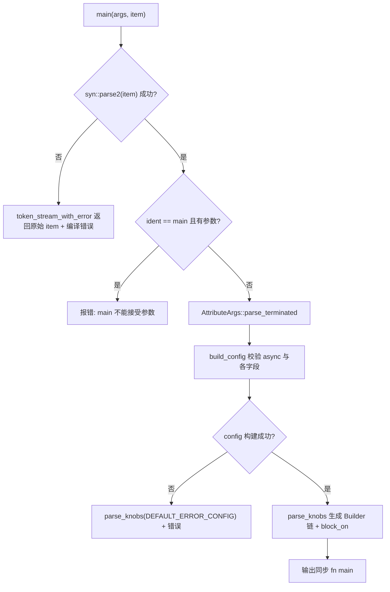
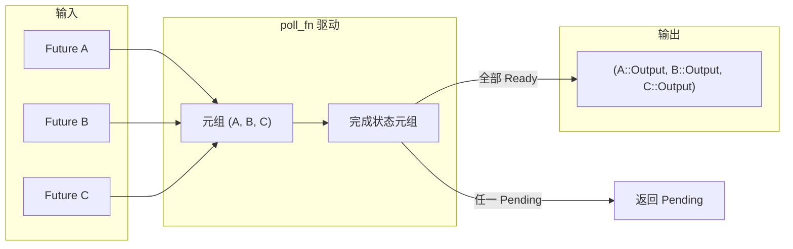

# 제 9 장: 매크로의 마법: #[tokio::main], select!와 join! 뒤의 코드 생성

이전 장에서 우리는`block_on`과 블로킹 스레드 풀이 어떻게 비동기 런타임의 능력 경계를 설정하는지 보았고, 사용자는 거의 이러한 경계를 직접 작성하지 않습니다——그들은`#[tokio::main]`、`select!`、`join!`을 작성하여 매크로가 컴파일 시점에 이러한 보일러플레이트 코드를 펼치도록 합니다. 매크로는 Tokio가 사용자에게 제공하는 첫 번째 설탕 코팅이며, 컴파일 시점에 실제로 런타임 코드를 생성하는 곳입니다. 이 장에서는`tokio-macros`crate와`tokio/src/macros/select.rs`에 초점을 맞추어, 가장 많이 사용되는 세 가지 매크로 확장 경로를 분해하고, 한 가지 질문에 중점적으로 답합니다: 매크로 확장 후 실제 호출 체인은 어떤 모습이며, 왜`select!`의 취소 안전 의미를 별도로 경계해야 하는가.

# 9.1 #[tokio::main]: async fn을 Runtime::block_on으로 재작성

**직관적 모델**：`#[tokio::main]`은 「인테리어 위임장」과 같습니다. 당신이 빈 집(`async fn main`)을 넘겨주면, 그것이 수전과 전기를 깔아주고(런타임 구축), 문과 창문(`enable_all`)을 설치하고, 마지막으로 당신의 원래 가구(함수 본문)를 옮겨 넣습니다. 이것이 없다면 모든`main`이`Builder::new_multi_thread().enable_all().build().unwrap().block_on(...)`을 직접 작성해야 하며, 보일러플레이트 코드가 비즈니스 로직을 압도할 것입니다.

## 데이터 구조와 메모리 레이아웃

매크로 자체는 런타임 데이터 구조를 생성하지 않지만, 파싱한 설정은 두 구조체에 담깁니다.`Configuration`은 「파싱 시점의 가변 누산기」이며, 필드가 전부`Option`입니다. 속성 매개변수가 누락되거나, 중복되거나, 불법일 수 있기 때문입니다[FACT:tokio-macros/src/entry.rs:74-84]. 주의:`worker_threads`、`start_paused`、`unhandled_panic`모두`Span`을 가지고 있습니다——이는 오류 발생 시 오류를 매크로 내부가 아닌 사용자가 작성한 줄에 위치시키기 위함입니다[FACT:tokio-macros/src/entry.rs:74-84]。`FinalConfig`은 「검증 후의 불변 결과」이며,`flavor`은 더 이상`Option`이 아닙니다.`build()`이 이미`default_flavor`로 폴백했기 때문입니다[FACT:tokio-macros/src/entry.rs:55-62]。

`RuntimeFlavor`은 세 가지 변형만 있습니다:`CurrentThread`、`Threaded`、`Local` [FACT:tokio-macros/src/entry.rs:10-14]。`from_str`에는 역사적 레거시 이름을 위한 친절한 오류가特意로 제공됩니다:`single_thread`은`current_thread`，`basic_scheduler`이라고 불러야 함을 알려주고,`threaded_scheduler`은 이름이 변경되었음을 알려주며,[FACT:tokio-macros/src/entry.rs:17-27]은 이름이

## 으로 변경되었음을 알려줍니다. 이것은 매크로가 「사용자 첫 접점」으로서의 전형적인 설계입니다: 오류 메시지가 곧 문서입니다.

단계별 확장 흐름`#[tokio::main(flavor = "multi_thread", worker_threads = 4)] async fn main() { ... }`。

시나리오 대입: 사용자가`main`을 작성합니다. 첫 번째 단계,`ItemFn` [FACT:tokio-macros/src/entry.rs:577-580]진입점이 먼저 item을 사용자 정의`ItemFn`으로 파싱합니다. 이`syn::ItemFn`은[FACT:tokio-macros/src/entry.rs:720-764]이 아니라 Tokio가 자체 구현한 파서이며, 그 이유는 주석에 적혀 있습니다: 전체 문장을 재귀적으로 파싱하지 않고 「토큰 트리별 버퍼링, 세미콜론 만나면 분할」하는 경량 파싱만 수행합니다

. 이는 매크로에서 함수 본문에 대한 완전한 AST 구축 오버헤드를 피합니다.`build_config`두 번째 단계,`async`이`async` keyword is missing" [FACT:tokio-macros/src/entry.rs:346-349]키워드 존재 여부를 검증하고, 누락 시 "the`worker_threads`、`flavor`、`start_paused`、`crate`、`unhandled_panic`、`name`을 보고합니다. 그런 다음 속성 매개변수를 순회하며[FACT:tokio-macros/src/entry.rs:369-399]을 해당 setter`core_threads`에 분배합니다. 주의:[FACT:tokio-macros/src/entry.rs:379-382]。

은 명시적으로 거부되고 이름이`Configuration::build`으로 변경되었음을 알려줍니다`worker_threads`세 번째 단계,`multi_thread` [FACT:tokio-macros/src/entry.rs:197-217]；`start_paused`이 교차 필드 일관성 검증을 수행합니다. 여기에는 세 가지 핵심 제약이 있습니다:`current_thread`/`local` [FACT:tokio-macros/src/entry.rs:219-229]；`unhandled_panic`은`current_thread`/`local` [FACT:tokio-macros/src/entry.rs:231-241]만 허용하고,`multi_thread`은`rt-multi-thread`만 허용하며,[FACT:tokio-macros/src/entry.rs:209-216]。

도 마찬가지로`parse_knobs`만 허용합니다. 사용자가`asyncness` [FACT:tokio-macros/src/entry.rs:441]을 선택했지만`CurrentThread`/`Local`feature가 활성화되지 않은 경우, 오류 메시지는 flavor를 명시적으로 지정했는지 여부에 따라 달라집니다`Builder::new_current_thread()`，`Threaded`네 번째 단계,`Builder::new_multi_thread()` [FACT:tokio-macros/src/entry.rs:468-477]。`Local`이 코드를 생성합니다. 먼저`build_local(Default::default())`을 제거한 다음, flavor에 따라 builder 시작점을 선택합니다:`build()` [FACT:tokio-macros/src/entry.rs:479-483]은`.worker_threads(#v)`、`.start_paused(#v)`、`.unhandled_panic(...)`、`.name(#v)` [FACT:tokio-macros/src/entry.rs:485-497]。

을 사용하고,`last_block`：`return #rt.enable_all().#build.expect("Failed building the Runtime").block_on(body)` [FACT:tokio-macros/src/entry.rs:509-522]은`return`을 사용합니다. 특이한 점은 build 호출이[FACT:tokio-macros/src/entry.rs:508]。

이 아니라`async #body`이라는 것입니다. 그런 다음 필요에 따라 체인으로`!`을追加합니다`impl Trait`다섯 번째 단계, 최종 함수 본문을 생성합니다. 핵심은`if false { let _: &dyn Future<Output = #output_type> = &body; }`입니다. 명시적인[FACT:tokio-macros/src/entry.rs:551-571]에 주목하세요. 주석은 tokio-rs/tokio#4636을 가리키며, 타입 추론 문제를 수정하기 위한 것입니다`pin!`body를 스택에 고정하고`Pin<&mut dyn Future>`로 변환한다`block_on`제네릭 인스턴스화의 컴파일 오버헤드를 줄이기 위함이라고 주석에 설명되어 있다[FACT:tokio-macros/src/entry.rs:526-548]。



## 설계 사고와 프로덕션 함정

`main`과`test`는`parse_knobs`을 공유하지만 기본 flavor가 다르다:`test`기본`CurrentThread`，`main`기본`Threaded` [FACT:tokio-macros/src/entry.rs:91-94]. 이것은 왜`#[tokio::test]`가 기본적으로 단일 스레드인지 설명한다——테스트는 보통 멀티코어가 필요 없고, 단일 스레드가 재현하기 더 쉽다.

쉽게 간과되는 함정: 매크로 확장 후 함수를 호출할 때마다 새로운 Runtime이 생성된다. 문서는 함수가 빈번하게 호출되는 경우 Builder를 사용하여 Runtime을 재사용해야 한다고 명확히 경고한다[FACT:tokio-macros/src/lib.rs:31-35].`#[tokio::main]`를 일반 함수에 사용하는 것은 합법적이지만, 매 호출마다 Runtime 구축 비용을 지불한다.

또 다른 함정은`crate`이름 변경이다. 사용자가`use tokio as tokio1`할 때, 매크로 내부에서 기본 생성되는`tokio::runtime::Builder`는 경로를 찾을 수 없으므로 명시적으로`crate = "tokio1"` [FACT:tokio-macros/src/lib.rs:239-264]。`parse_knobs`해야 한다.`crate_path`의 기본값은`Ident::new("tokio", ...)` [FACT:tokio-macros/src/entry.rs:456-462]이며, 이것이 바로 이름 변경 시나리오에서 오류가 발생하는 근본 원인이다.

# 9.2 select!: 다중 분기 폴링, 비트마스크와 무작위 공정성

**직관적 모델**：`select!`는 「여러 수령 창구를 동시에 지켜보는 서비스원」과 같다. 어느 창구에서 먼저 음식이 나오면, 그는 그 음식을 가져가고 나머지 창구의 대기는 무효화된다. 이것이 없다면, 사용자는 직접`poll_fn`를 작성하여 여러 Future를 튜플에 넣고 하나씩 poll해야 하며, 「어떤 분기가 준비되면 나머지 분기를 버려야 하는」 로직도 스스로 처리해야 한다.

## 데이터 구조와 메모리 레이아웃

`select!`가 확장되면 로컬 모듈`__tokio_select_util`이 생성되며, 그 안에 열거형`Out`과 타입 별칭`Mask` [FACT:tokio/src/macros/select.rs:615-619]。`Out`이 있다.`_0`、`_1`의 변형 이름은`Disabled`……각 분기마다 하나씩, 그리고[FACT:tokio-macros/src/select.rs:33-39]。`Mask`가 있어 모든 분기가 무효함을 나타낸다.`u8`의 하위 타입은 분기 수에 따라 동적으로 선택된다: ≤8이면`u16`, ≤16이면`u32`, ≤32이면`u64`, ≤64이면[FACT:tokio-macros/src/select.rs:17-31], 64를 초과하면 직접 panic`select!`. 이 비트마스크는

의 핵심 상태이다: i번째 비트가 1이면 i번째 분기가 비활성화되었음을 의미한다.`futures`모든 Future는 튜플`IntoFuture::into_future`에 저장되며, 각 요소는 먼저[FACT:tokio/src/macros/select.rs:654-656]를 거쳐`futures_init`로 변환된다. 여기서 먼저`into_future`를 구성한 후 하나씩[FACT:tokio/src/macros/select.rs:641-646]하는데, 주석은 이것이 임시 수명 연장을 활용하기 위함이라고 설명한다`let mut futures = &mut futures;`. 이후`poll_fn`가 튜플을 가변 참조로 강등하여[FACT:tokio/src/macros/select.rs:658-662]。

## 클로저가 소유권을 빼앗는 것을 방지한다

단계별 폴링 흐름`select! { v = stream1.next() => ..., v = stream2.next() => ..., else => break }`。

시나리오 대입:`biased;`첫 번째 단계, 매크로 진입 규칙 매칭. 만약`start=0` [FACT:tokio/src/macros/select.rs:801-803]접두사가 있으면,`start`; 그렇지 않으면`thread_rng_n(BRANCHES)` [FACT:tokio/src/macros/select.rs:805-809]는 무작위 표현식이다[FACT:tokio/src/macros/select.rs:61-65]。

. 이것이 문서에서 말하는 「기본적으로 무작위로 분기를 선택하여 먼저 검사」하는 공정성의 근원이다`(skip) pat = fut, if cond => handler,`두 번째 단계, 정규화. tt-muncher가 각 분기를`skip`형태로 정규화하며,`_`는 일련의[FACT:tokio/src/macros/select.rs:770-793]。`skip`이고, 길이는 해당 분기 이전의 branch 수와 같다`futures_init.$($skip)*`.`count!`는 튜플 필드 접근

을 생성하는 데도 사용되고,`if $c`를 통해 분기 인덱스를 계산하는 데도 사용된다.`disabled |= 1 << index` [FACT:tokio/src/macros/select.rs:631-636]세 번째 단계, 전제 조건 평가. 각 분기의`$fut`에 대해, false이면[FACT:tokio/src/macros/select.rs:39-41]。

. 주의: 분기가 비활성화되어도 그`poll_fn`표현식은 여전히 평가되며, 단지 poll되지 않을 뿐이다`ready!(poll_budget_available(cx))`네 번째 단계,`Pending` [FACT:tokio/src/macros/select.rs:664-667]클로저 진입. 먼저 협력 예산을 확인한다:`select!`, 예산이 소진되면 직접

을 반환한다. 이것은`for i in 0..BRANCHES`，`branch = (start + i) % BRANCHES` [FACT:tokio/src/macros/select.rs:680-685]가 worker를 독점하지 않도록 보장한다.`disabled & mask == mask`다섯 번째 단계, 루프`continue` [FACT:tokio/src/macros/select.rs:694-699]. 각 branch에 대해: 먼저`Pin::new_unchecked`를 확인하고, 이미 비활성화되었으면[FACT:tokio/src/macros/select.rs:701-707]; 그렇지 않으면 튜플에서 해당 Future를 꺼내`Ready(out)`로 한 겹 감싼다(안전성은 Future가 스택에 저장되고 이동되지 않는 것에 의존)`disabled |= mask`; poll하고,[FACT:tokio/src/macros/select.rs:710-730]。

이면 먼저`out`한 후 패턴`$bind`을 매칭한다`Poll::Ready(Out::_i(out))` [FACT:tokio/src/macros/select.rs:727-733]여섯 번째 단계, 패턴 매칭. 만약`continue`이[FACT:tokio/src/macros/select.rs:44-47]。

와 매칭되면,`is_pending`을 반환한다; 매칭되지 않으면,`Pending`다른 분기를 계속 폴링한다——이것이 바로 문서 단계 5에서 말하는 「패턴이 매칭되지 않으면 현재 분기를 비활성화」이다`Out::Disabled` [FACT:tokio/src/macros/select.rs:740-745]일곱 번째 단계, 루프 종료. 만약`match output`이 참이면`Out::_i`을 반환하고, 그렇지 않으면 모든 분기가 무효이므로`Disabled`을 반환한다`else`. 외부[FACT:tokio/src/macros/select.rs:749-755]。

```mermaid
flowchart TD
    start["poll_fn 闭包被调用"] --> budget{"poll_budget_available(cx)?"}
    budget -->|否| pending_budget["返回 Pending"]
    budget -->|是| init["is_pending = false; start = $start"]
    init --> loop{"i |否| check_pending{"is_pending?"}
    check_pending -->|是| pending["返回 Pending"]
    check_pending -->|否| disabled_out["返回 Out::Disabled"]
    loop -->|是| branch["branch = (start+i) % BRANCHES"]
    branch --> is_disabled{"disabled & mask == mask?"}
    is_disabled -->|是| next_i["i += 1"]
    is_disabled -->|否| poll_fut["Pin::new_unchecked(fut).poll(cx)"]
    poll_fut --> poll_res{"Poll 结果?"}
    poll_res -->|Pending| set_pending["is_pending = true; i += 1"]
    poll_res -->|Ready| disable["disabled |= mask"]
    disable --> pat_match{"out 匹配 $bind?"}
    pat_match -->|否| next_i
    pat_match -->|是| ready_out["返回 Out::_i(out)"]
    next_i --> loop
    set_pending --> loop
```

## 을 해당 handler에 매핑하고,

**은`Vec<bool>`？**표현식에 매핑한다`disabled |= mask`복사`select!`설계 사고와 프로덕션 함정

**왜 비트마스크를 사용하고**를 사용하지 않는가? 비트마스크는 스택上的 단일 정수로, 힙 할당이 없고,`select!`는 단일 명령어이다. 핫 패스上的`Some(v) = stream.next() => ...`에 대해, 이는 매 반복마다의 힙 접근을 피한다.`stream.next()`왜 패턴이 매칭되지 않으면 분기를 비활성화해야 하는가?`None`이것이[FACT:tokio/src/macros/select.rs:198-223]。

**와 「단순 race」의 핵심 차이이다.**：`select!`를 고려하면, 만약`read_exact`、`read_to_end`、`write_all`이[FACT:tokio/src/macros/select.rs:119-124]를 반환하면(스트림 종료), 패턴이 매칭되지 않고, 해당 분기는 영구적으로 비활성화되어 이미 종료된 스트림을 무한 폴링하는 것을 방지한다. 문서 예제는 바로 이 의미론에 의존하여 두 스트림이 모두 종료될 때까지 수집한다`Mutex::lock`、`Semaphore::acquire`취소 안전성의 진정한 의미[FACT:tokio/src/macros/select.rs:126-133]어떤 분기가 준비되면, 나머지 분기의 Future는 drop된다. 만약 drop된 Future가 이미 데이터를 소비했지만 아직 반환하지 않았다면, 데이터는 손실된다. 문서는 명확히`.await`가 취소 안전하지 않다고 나열하며,`.await`는 큐 공정성 때문에 취소 시 큐 위치를 잃는다[FACT:tokio/src/macros/select.rs:135-139]。

**`if`. 판정 방법:**지점을 찾아,`if !sleep.is_elapsed()`에서 함수를 재시작해도 여전히 올바르면 취소 안전하다`sleep`전제 조건의 경쟁 조건 함정`is_elapsed()`: 문서는 고전적인 오류 예제를 제공한다——`while`가드를 사용하여`select!`분기를 보호하지만,[FACT:tokio/src/macros/select.rs:336-376]이`if`검사와`sleep`사이에 true로 변할 수 있어 타임아웃이 누락된다`break` [FACT:tokio/src/macros/select.rs:378-405]。

**`biased;`. 올바른 작성법은**를 제거하고,[FACT:tokio/src/macros/select.rs:67-74]분기가 항상 폴링에 참여하도록 하여, 타임아웃 후`biased;`의 비용[FACT:tokio/src/macros/select.rs:75-81]。

# : 무작위 RNG는 CPU 비용이 있으며, 일부 시나리오에서는 결정적인 폴링 순서가 필요하다

**. 그러나**：`join!`는 공정성 책임을 사용자에게 넘긴다: 만약 한 분기가 영원히 준비되면, 뒤의 분기는 기아 상태가 된다`select!`9.3 join!과 매크로 확장의 엔지니어링 제약`Ready`직관적 모델`poll_fn`는 「모든 택배가 동시에 도착하기를 기다리는 것」과 같다.

## 처럼 먼저 도착한 것이 나머지를 취소하지 않고, 모든 Future의

`join!`의 확장 역시 튜플에 Future를 저장하는 것을 기반으로 하지만, 상태는 비트마스크가 아니라 「완료된 값」의 튜플입니다. 각 Future가 완료되면 그 값이 추출되어 결과 튜플에 저장되고, 해당 슬롯은 완료로 표시됩니다.`select!`와 달리,`join!`는 완료되지 않은 Future를 drop하지 않습니다——모든 Future가 완료되어야 반환합니다.

## 단계별 흐름

`join!`의 폴링 로직은`select!`와 「튜플에 Future 저장 +`poll_fn`구동」이라는 골격을 공유하지만, 의미는 반대입니다:`select!`는 「하나라도 준비되면 반환」,`join!`는 「전부 준비되어야 반환」입니다. 매 라운드 poll은 모든 미완료 Future를 순회하며, 하나라도`Pending`를 반환하면 전체가`Pending`되고, 전부`Ready`이면 집계하여 반환합니다.



## 설계 고찰과 프로덕션 함정

`join!`의 취소 안전성 의미는`select!`와 다릅니다:`join!`가 drop될 때, 완료되지 않은 모든 Future가 drop되며, 마찬가지로 데이터를 잃을 수 있습니다. 하지만`join!`는 어떤 분기도 능동적으로 취소하지 않으므로,`select!`처럼 「다른 분기가 준비되어 이 분기를 취소」하지는 않습니다. 진짜 위험은`join!`전체가 외부`select!`또는 타임아웃으로 취소되는 것입니다.

`join!`와`try_join!`의 차이는 주목할 만합니다:`try_join!`는 어떤 Future가`Err`를 반환하면 즉시 반환하고 나머지 Future를 취소하므로,`select!`의 취소 안전성 위험을 계승합니다.

# 설계 고찰

**매크로를 컴파일 타임 코드 생성기로 사용하는 경계**。`#[tokio::main]`는 설정 검증을 컴파일 타임에 두어, 잘못된 조합(예:`multi_thread` + `start_paused`)이 런타임 panic이 아니라 컴파일 실패가 되도록 합니다. 이것이 Builder 대비 매크로의 핵심 이점입니다: 오류를 앞당깁니다.

**선언적 매크로 + 절차적 매크로의 혼합 아키텍처**。`select!`의 본체는`macro_rules!`이지만, 두 곳의 핵심 로직은 절차적 매크로에 위임합니다:`select_priv_declare_output_enum`가`Out`열거형과`Mask`타입[FACT:tokio-macros/src/lib.rs:658-660]，`select_priv_clean_pattern`을 생성하고, 패턴에서`ref`/`mut` [FACT:tokio-macros/src/lib.rs:666-668]를 제거합니다. 왜일까요? 주석의 설명: 선언적 매크로는 「분기 수에 따라 정수 타입을 동적으로 선택」하는 코드를 생성하기 어렵고, 패턴 위치에서 토큰 수준 정리도 어렵습니다.[FACT:tokio/src/macros/select.rs:577-579]。

**`clean_pattern`의 필요성**。`select!`는`out`를`&out`형태로 패턴[FACT:tokio/src/macros/select.rs:727]에 매칭하는데, 사용자가`ref v`를 작성하면`&ref v`가 되어 타입 오류가 발생합니다.`clean_pattern`는 재귀적으로`by_ref`、`mutability`를 제거하고,`Reference`패턴의`mutability` [FACT:tokio-macros/src/select.rs:68-73][FACT:tokio-macros/src/select.rs:100-103]도 제거합니다. 이것은 매크로가 「사용자 직관」과 「borrow checker」 사이에서 한 타협입니다.

**64 분기 상한의 공학적 현실**。`count!`、`count_field!`、`select_variant!`세 매크로가 각각 0부터 64까지의 매칭 규칙을 손으로 작성했습니다[FACT:tokio/src/macros/select.rs:821-1017][FACT:tokio/src/macros/select.rs:1021-1217][FACT:tokio/src/macros/select.rs:1221-1414]. 주석은 노골적으로 「I'm not happy about it either」[FACT:tokio/src/macros/select.rs:816-817]라고 말합니다. 이것은 선언적 매크로가 산술을 할 수 없는 대가입니다: 토큰 수를 정수에 하드코딩 매핑할 수밖에 없습니다.

# 이 장 요약

# 이 장 고찰과 자가 점검

Q1: `select!`의`disabled`비트마스크는`select!`에 진입할 때마다`Default::default()` [FACT:tokio/src/macros/select.rs:627]로 재초기화됩니다. 이 줄을`poll_fn`클로저 내부로 옮기면, 「루프에서 select!를 호출하고 어떤 분기 패턴이 매칭되지 않는」 시나리오에서 무슨 일이 발생할까요?

**참고 해설**：`disabled`클로저 내부에서 초기화하면 매 poll마다 리셋되어, 이전 라운드에서 패턴 불일치로 비활성화된 분기가 다시 폴링에 참여합니다.`Some(v) = stream.next() => ...`이고`stream`가 이미 종료되어(`None`반환) 패턴 불일치 후 해당 분기가 영구히 비활성화되어야 하는 상황을 생각해 봅시다.`disabled`가 리셋되면, 다음 라운드 poll이 이미 종료된 이 스트림을 다시 poll하게 되는데, 스트림이 fused가 아니면(즉 종료 후 다시 poll하면 panic하거나 정의되지 않은 동작을 반환할 수 있음) 문제가 생깁니다. 스트림이 fused라 해도, 영원히`None`를 반환하는 스트림을 반복 poll하며 CPU를 낭비합니다. 문서는 명확히 「Re-entering select! due to a loop clears the disabled state」[FACT:tokio/src/macros/select.rs:37-38]라고 말합니다. 이는`select!`매크로에 재진입하는 것(새 루프 라운드)을 의미하며, 동일`select!`내의 여러 poll이 아닙니다.`disabled`는 클로저 외부에서 초기화해야 동일`select!`호출의 여러 poll 사이에서 상태를 유지할 수 있습니다.

Q2: `select!`는`Ready(out)`를 poll한 후`disabled |= mask`를 먼저 실행하고 패턴[FACT:tokio/src/macros/select.rs:720-730]을 매칭합니다.`disabled |= mask`를 제거하면, 패턴이 불일치하고 해당 Future가 매 poll마다 즉시`Ready`를 반환하는 시나리오에서 무슨 일이 발생할까요?

**참고 해설**:`disabled |= mask`를 제거하면,`out`가`$bind`와 불일치할 때 코드는`continue`로 가서 다른 분기를 계속 폴링합니다. 하지만 다음 라운드에`poll_fn`가 호출될 때(예: 다른 분기가`Pending`를 반환한 후 다시 poll), 이 분기는 여전히 비활성화되지 않아 다시 poll됩니다. 해당 Future가 매 poll마다 즉시`Ready`를 반환하고 값이 패턴과 불일치하면, 「poll -> Ready -> 불일치 -> continue -> 다른 분기 Pending -> Pending 반환 -> 다시 poll -> 다시 Ready -> ...」의 라이브락이 형성되어 CPU가 헛돕니다.`disabled |= mask`는`Ready`후 즉시 플래그를 세워, 패턴이 불일치하더라도 해당 분기가 다시 poll되지 않도록 합니다. 플래그 설정이 패턴 매칭 전에 일어나므로, 「Ready지만 패턴 불일치」와 「Ready이고 패턴 일치」 두 경우 모두 해당 분기를 비활성화합니다——전자는 라이브락 방지, 후자는 중복 소비 방지입니다.

Q3: `parse_knobs`는 비-test 경로에서`if false { let _: &dyn Future<Output = #output_type> = &body; }`를 삽입해 타입 검사를[FACT:tokio-macros/src/entry.rs:557-561]하지만,`!`를 반환하거나`impl Trait`를 포함하는 타입은 검사를 건너뜁니다[FACT:tokio-macros/src/entry.rs:551-556]. 왜`impl Trait`는 건너뛰어야 할까요? 강제로 검사하면 어떻게 될까요?

**참고 해설**：`impl Trait`는 반환 위치가 「불투명 타입」이라 컴파일러가 이를`&dyn Future<Output = impl Trait>`로 강제 변환하는 것을 허용하지 않습니다. 왜냐하면`dyn`는 구체적 타입을 요구하는데,`impl Trait`의 구체적인 타입은 함수 외부에서 보이지 않는다. 억지로 검사를 삽입하면 「the size for values of type`impl Future`cannot be known at compilation time」또는 「cannot be made into an object」같은 오류가 발생한다. 반환`!`의 타입도 마찬가지다:`!`는 어떤 타입으로든 강제 변환할 수 있지만,`&dyn Future<Output = !>`의`Output = !`자체가 never type의 불안정 특성 문제를 유발할 수 있다. 검사를 건너뛰는 대가는: 만약 사용자가`async fn main() -> impl Trait`를 작성했지만 실제 반환 타입이`impl Trait`과 맞지 않으면, 오류는`block_on`에서야 드러나며, 오류 메시지가 명시적 검사보다 명확하지 않을 수 있다. 이것은 「컴파일 타임 검사 완전성」과 「타입 시스템 제한」 사이의 트레이드오프다.

매크로는 보일러플레이트 코드와 컴파일 타임 검증을 사용자로부터 대신 떠맡지만, 그것이 생성하는 것은 여전히 평범한 Future와`poll`호출이다. 다음 장에서 우리는 매크로의 컴파일 타임 세계를 떠나 런타임 I/O 추상화 계층으로 들어가,`AsyncRead`/`AsyncWrite`가 어떻게 바이트 스트림을 프레임으로 자르는지, 그리고`Framed`코덱 프레임워크가`select!`의 취소 안전 제약 아래에서 어떻게 올바르게 작동하는지 살펴본다.

`#[tokio::main]`의 본질은 「설정 파싱 + Builder 체인 생성 +`block_on`래핑」이며, 설정 검증은 컴파일 타임에 완료되고, flavor가 builder 시작점과 build 메서드를 결정한다.`select!`의 핵심은 「튜플에 Future 저장 + 비트마스크로 비활성화 기록 + 무작위 시작점으로 공정성 보장」이며, 패턴이 일치하지 않으면 분기를 비활성화하고, 취소 안전성은 drop된 Future가`.await`에서 재시작 가능한지에 달려 있다.`join!`와`select!`는 골격을 공유하지만 의미는 반대이며, 전자는 전부 완료될 때까지 기다리고 후자는 어느 하나라도 준비되면 반환한다. 세 가지 모두 Tokio 매크로 설계의 핵심 트레이드오프를 보여준다: 보일러플레이트 코드와 컴파일 타임 검증은 매크로에 맡기고, 런타임 의미의 복잡성(특히 취소 안전성)은 사용자가 명시적으로 이해하도록 남겨둔다. 매크로가 런타임 코드를 어떻게 생성하는지 이해한 후, 다음 자연스러운 질문은: 이 코드들이 실제로 바이트 스트림을 읽고 쓰기 시작할 때, Tokio는 어떤 추상화를 제공하는가? 제 10장에서는`AsyncRead`/`AsyncWrite`와 코덱 프레임워크를 분석하여,`BufReader`/`BufWriter`가 어떻게 시스템 호출을 줄이는지,`copy_bidirectional`가 어떻게 양방향 전달을 구동하는지,`Framed`가 어떻게 바이트 스트림을 프레임으로 분할하는지 살펴봄으로써 「비동기 I/O의 추상화 경계는 어디인가」에 답한다.
