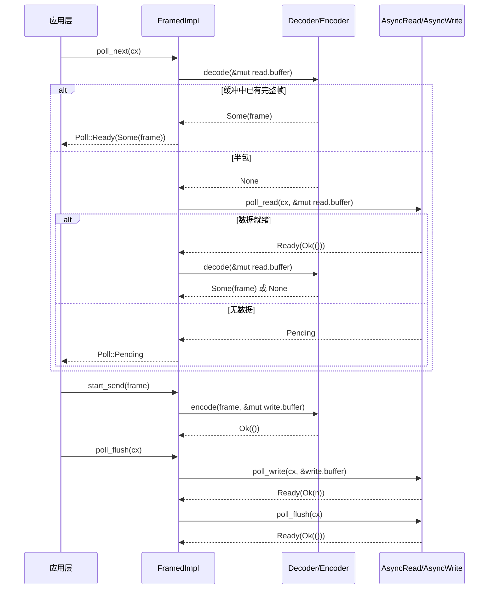

# 제 10 장: 스트리밍 I/O 추상화: AsyncRead/AsyncWrite와 코덱 프레임워크

이전 장에서는 tokio-macros의 전개 과정을 분해했고, #[tokio::main], select!, join!이 어떻게 보일러플레이트 코드와 컴파일 타임 검증을 사용자로부터 대신 떠맡는지 보았다. 하지만 매크로가 생성하는 것은 여전히 평범한 Future와 poll 호출이다——이 Future들이 실제로 바이트를 읽고 쓰기 시작할 때, Tokio가 제공하는 저수준 추상화는 단 두 개의 trait뿐이다: AsyncRead와 AsyncWrite. 이들의 문제는 「너무 저수준」이라는 것이다: 한 번의 poll_read는 「약간의 바이트를 읽었다」만 보장할 뿐 「완전한 메시지를 읽었다」를 보장하지 않는다. 그리고 대부분의 프로토콜(HTTP, Redis, gRPC, 커스텀 RPC)은 「바이트 스트림」이 아닌 「프레임」 지향이다. 이 장에서 답할 핵심 질문은: 비동기 I/O의 추상화 경계는 어디에 그어야 하는가? Tokio의 답은 두 계층으로 나뉜다: tokio::io는 바이트 스트림 수준의 trait과 도구(BufReader/BufWriter/copy_bidirectional)를 제공하고, tokio-util의 codec 프레임워크는 그 위에 프레임 수준의 Stream/Sink 어댑터(Framed/LengthDelimitedCodec)를 제공한다. 이 두 계층의 분업을 이해하면 「왜 프로토콜 구현이 거의 모두 Framed에서 시작하는가」를 이해하게 된다.

# 一、AsyncRead/AsyncWrite: 왜 std::io::Read를 직접 재사용할 수 없는가

## 직관적 모델

`std::io::Read::read`는 「블로킹식 수령」이다: 당신이 창구 앞에 서서 물건이 올 때까지 계속 기다리면 스레드가 일시 중단된다.`AsyncRead::poll_read`는 「식권식 수령」이다: 당신이 「됐어요?」라고 한마디 물으면, 아직 안 됐으면(`Poll::Pending`) 먼저 다른 일을 하고, 동시에 Waker를 남겨 물건이 도착하면 시스템이 당신을 부르게 한다. 만약 이 trait이 없다면, 모든 비동기 I/O는`epoll`등록과 Waker 매핑을 직접 작성해야 한다——이것이 바로 제 5장 Reactor가 하는 일이며,`AsyncRead`는 그것이 상위 계층에 노출하는 통합 파사드다.

## 데이터 구조와 메모리 레이아웃

`AsyncRead`의 정의는 극도로 간결하며, 메서드가 하나뿐이다:

```rust
pub trait AsyncRead {
    fn poll_read(
        self: Pin,
        cx: &mut Context,
        buf: &mut ReadBuf,
    ) -> Poll>;
}
```

[FACT:tokio/src/io/async_read.rs:44-60]

세 매개변수에는 각각 이유가 있다.`self: Pin<&mut Self>`가 아니라`&mut self`: 왜냐하면`AsyncRead`는 종종`async fn`가 생성한 Future에 의해 보유되며, Future는 한 번 poll되면 이동할 수 없기(자기 참조) 때문이다.`Pin`는 컴파일러가 강제하는 계약이다.`cx: &mut Context<'_>`는 Waker를 운반하며, 「호출기」의 전달 통로다.`buf: &mut ReadBuf<'_>`는 Tokio가`&mut [u8]`를 래핑한 것이다——그것은 동시에 「채워진 길이」와 「초기화되지 않은 용량」을 기록하여,`std::io::Read`'읽은 바이트 수를 반환하지만 버퍼가 초기화되지 않았을 수 있다'는 모호함.

문서는 세 가지 반환 의미를 명확히 나열한다[FACT:tokio/src/io/async_read.rs:15-32]：`Ready(Ok(()))`데이터가 기록되었음을 나타내며`buf`읽기량은`ReadBuf::filled`의 길이 증가분으로 결정된다; 증가분이 0이면 EOF이거나`buf.remaining() == 0`(버퍼 용량 0)이다;`Pending`현재 읽을 수 없지만 깨우기가 등록되었음을 나타낸다;`Ready(Err(e))`은 하위 I/O 오류이다. 여기 간과하기 쉬운 함정이 있다:**'읽기량이 0'이 EOF를 의미하지는 않는다**——호출자가 용량 0인 버퍼를 전달하면`poll_read`은 즉시`Ready(Ok(()))`을 반환하지만 아무것도 읽지 않는다. 상위 계층에서 '0 바이트'를 EOF로 처리하면 연결 종료를 오판하게 된다.

## 시나리오 기반 Walkthrough:`&[u8]`에서 바이트 일부 읽기

가장 단순한 구현을 고려하자——`&[u8]`의`AsyncRead`：

```rust
impl AsyncRead for &[u8] {
    fn poll_read(
        mut self: Pin,
        _cx: &mut Context,
        buf: &mut ReadBuf,
    ) -> Poll> {
        let amt = std::cmp::min(self.len(), buf.remaining());
        let (a, b) = self.split_at(amt);
        buf.put_slice(a);
        *self = b;
        Poll::Ready(Ok(()))
    }
}
```

[FACT:tokio/src/io/async_read.rs:98-108]

단계별 분석:`self.len()`은 남은 미읽기 슬라이스 길이이고,`buf.remaining()`은 대상 버퍼의 남은 용량이며, 둘 중 작은 값`amt`。`split_at(amt)`을 취한다. 슬라이스를 '이번에 복사할`a`'과 '남은 미읽기`b`」。`buf.put_slice(a)`'으로 나눈다.`a`을`ReadBuf`에 복사하고 filled 포인터를 전진시킨다.`*self = b`슬라이스 자체를 남은 부분으로 전진시킨다——이것이`&[u8]`이 '커서'로서 갖는 핵심이다: 매 poll 후`self`은 미읽기 부분을 가리킨다. 마지막으로`Ready(Ok(()))`을 반환하는데, 메모리 슬라이스는 항상 '준비'되어 있어`Pending`。

하지 않기 때문이다.`_cx`이 무시됨에 주의하라: 메모리 데이터 소스는 Waker가 필요 없다. 이는 네트워크 socket과 대조된다——후자는 데이터가 없을 때`Pending`을 반환하고 읽기 가능 관심을 등록한다.

`io::Cursor<T>`의 구현에는 경계 검사가 한 겹 더 있다[FACT:tokio/src/io/async_read.rs:113-134]: 먼저`position()`을 가져오고,`pos > slice.len()`(위치 범위 초과)이면 panic 없이 바로`Ready(Ok(()))`을 반환한다[FACT:tokio/src/io/async_read.rs:113-134]. 이는 방어적 설계이다:`Cursor`의 position은 외부`set_position`에 의해 임의 값으로 설정될 수 있으며, 범위를 벗어나면 '이미 다 읽음'으로 처리하는 것이 panic보다 I/O 의미에 더 부합한다.

## 설계 사고: deref 매크로와 Pin의 전파

`AsyncRead`은`Box<T>`、`&mut T`、`Pin<P>`에 전달 구현을 제공한다. 앞의 둘은`deref_async_read!`매크로를 통해[FACT:tokio/src/io/async_read.rs:64-70]을 생성하며, 핵심은`Pin::new(&mut **self).poll_read(cx, buf)`이다——즉`Pin<&mut Box<T>>`을`Pin<&mut T>`로 역참조한 뒤 전달한다.`Pin<P>`의 구현은 더 미묘하다[FACT:tokio/src/io/async_read.rs:87-93]: 이것은`crate::util::pin_as_deref_mut(self)`을 호출하여`Pin<&mut Pin<P>>`을`Pin<&mut P::Target>`으로 투영한다. 이 투영 계층은 필수적인데, 그렇지 않으면 중첩된`Pin`이 타입 불일치를 일으키기 때문이다.

> **[Design Inference & Architectural Trade-offs]**
> 여기서의 설계 동기는 '제로 비용 추상화'이다: 전달 구현은`Box<dyn AsyncRead>`、`&mut T`등의 래퍼 타입이`poll_read`을 직접 작성할 필요 없게 하면서`Pin`의미를 올바르게 유지한다. 대가는 각 전달 계층마다 간접 호출이 한 번 도입된다는 점인데, 컴파일러가 보통 인라인으로 제거한다.

---

# 2. copy_bidirectional: 양방향 전달의 상태 머신

## 직관적 모델

`copy_bidirectional`은 '양방향 배달원'이다: A→B와 B→A 두 방향을 동시에 지켜보다가, 어느 쪽이든 데이터를 읽으면 반대쪽에 쓴다. 이것이 없다면 TCP 프록시를 구현할 때 두 개의`copy`Future를 직접 작성하고`select!`로 조합해야 한다——그런데`select!`의 취소 안전 제약(9장) 때문에 '읽다가 중간에 취소된' 데이터가 손실될 수 있다.`copy_bidirectional`은 명시적 상태 머신으로 '읽기-쓰기-닫기'의 중간 상태를 보존하여 취소 안전을 달성한다.

## 데이터 구조와 메모리 레이아웃

핵심은 3-상태 열거형이다:

```rust
enum TransferState {
    Running(CopyBuffer),
    ShuttingDown(u64),
    Done(u64),
}
```

[FACT:tokio/src/io/util/copy_bidirectional.rs:10-14]

`Running`은`CopyBuffer`(내부에 8KB 버퍼와 읽기/쓰기 카운트 포함)을 보유하며, '데이터를 옮기는 중'을 나타낸다.`ShuttingDown(u64)`은 이미 복사한 바이트 수를 담고, '읽기 쪽이 EOF이고 쓰기 쪽을 닫는 중'을 나타낸다.`Done(u64)`은 '닫기 완료, 최종 바이트 수 기록'을 나타낸다. 이 열거형이 취소 안전의 핵심이다:**어느 시점에 drop되더라도 상태가 열거형에 보존되어, 다음 poll에서 중단점부터 계속할 수 있다**。

`CopyBuffer`은`copy.rs`에서 오며, 기본 크기는`DEFAULT_BUF_SIZE`이 결정한다(8KB)[FACT:tokio/src/io/util/copy_bidirectional.rs:76-88]. 두 방향이 각각 독립적인`CopyBuffer`을 보유하므로 메모리 오버헤드는 16KB이다.

## 시나리오 기반 Walkthrough: 양방향 전달의 전체 생애주기

`copy_bidirectional_impl`은`poll_fn`로 두 방향의 상태 머신을 조합한다:

```rust
let mut a_to_b = TransferState::Running(a_to_b_buffer);
let mut b_to_a = TransferState::Running(b_to_a_buffer);
poll_fn(|cx| {
    let a_to_b = transfer_one_direction(cx, &mut a_to_b, a, b)?;
    let b_to_a = transfer_one_direction(cx, &mut b_to_a, b, a)?;
    let a_to_b = ready!(a_to_b);
    let b_to_a = ready!(b_to_a);
    Poll::Ready(Ok((a_to_b, b_to_a)))
})
.await
```

[FACT:tokio/src/io/util/copy_bidirectional.rs:127-151]

의 호출 순서에 주의하라: 먼저 a→b를 진행하고, 그다음 b→a를 진행하며, 둘 다`transfer_one_direction`을 반환한다`Poll`。`ready!`매크로는 어느 한 방향이 미완료면 즉시`Pending`을 반환한다——하지만**다른 방향의 상태는 이미 진행되었다**. 이것이 바로 주석이 강조하는[FACT:tokio/src/io/util/copy_bidirectional.rs:143-144]이다: 설령`ready!`이 조기 반환하더라도, 다른 방향은 다음 poll에서 여전히`Done(count)`을 반환하여 진행 상황을 잃지 않는다.

`transfer_one_direction`내부는`loop`이며, 상태에 따라 진행한다:

```rust
loop {
    match state {
        TransferState::Running(buf) => {
            let count = ready!(buf.poll_copy(cx, r.as_mut(), w.as_mut()))?;
            *state = TransferState::ShuttingDown(count);
        }
        TransferState::ShuttingDown(count) => {
            ready!(w.as_mut().poll_shutdown(cx))?;
            *state = TransferState::Done(*count);
        }
        TransferState::Done(count) => return Poll::Ready(Ok(*count)),
    }
}
```

[FACT:tokio/src/io/util/copy_bidirectional.rs:29-42]

`Running`상태에서`poll_copy`을 호출하는데, 내부적으로 '한 블록 읽고, 한 블록 쓰기'를 읽기 쪽 EOF 또는 쓰기 쪽 블록까지 반복한다. EOF 시 복사한 총수를 반환하고 상태가`ShuttingDown`。`ShuttingDown`로 전환된다.`poll_shutdown`을 호출해 쓰기 쪽을 닫고(FIN 전송), 완료 후`Done`。`Done`로 전환한다.

직접 카운트를 반환한다.

```mermaid
flowchart TD
    start["transfer_one_direction 进入 loop"] --> match_state{"当前 TransferState?"}
    match_state -->|Running| poll_copy["buf.poll_copy(cx, r, w)"]
    poll_copy --> copy_ready{"poll_copy 结果?"}
    copy_ready -->|Pending| ret_pending["返回 Poll::Pending状态保持 Running"]
    copy_ready -->|Err| ret_err["返回 Poll::Ready(Err)错误向上传播"]
    copy_ready -->|Ok(count)| to_shutdown["state = ShuttingDown(count)"]
    to_shutdown --> match_state
    match_state -->|ShuttingDown| poll_shutdown["w.poll_shutdown(cx)"]
    poll_shutdown --> shutdown_ready{"shutdown 结果?"}
    shutdown_ready -->|Pending| ret_pending2["返回 Poll::Pending状态保持 ShuttingDown"]
    shutdown_ready -->|Err| ret_err
    shutdown_ready -->|Ok| to_done["state = Done(count)"]
    to_done --> match_state
    match_state -->|Done| ret_done["返回 Poll::Ready(Ok(count))"]
```

## 복사

> **[Design Inference & Architectural Trade-offs]**
> 〔설계 추론 및 아키텍처 트레이드오프〕`transfer_one_direction`만약`async fn`을`CopyBuffer`로 작성하면, 컴파일러는 내부 상태(`copy_bidirectional`, 복사 카운트)가 생성된 상태 머신에 숨겨진 Future를 만든다. 이는 단방향 사용에는 문제없지만,**은**같은 poll 주기 내에서`async fn`두 방향을 동시에 진행해야 한다——만약 두 개의`select!`에`TransferState`를 더하면, 한 방향이 완료될 때 다른 쪽이 drop되어 내부 버퍼와 카운트가 손실되므로 취소 안전을 위반한다. 명시적`poll_fn`은 상태를 스택에 노출하여,

매번 재진입할 때 상태가 여전히 남아 있으므로 '취소 후 중단점부터 복구'를 보장한다.`poll_copy`오류 처리에서,`Err`이 반환한`?`은[FACT:tokio/src/io/util/copy_bidirectional.rs:32]을 통해 즉시 위로 전파된다[FACT:tokio/src/io/util/copy_bidirectional.rs:67-70]. 문서는**을 명확히 설명한다: 중단된 읽기/쓰기는 재시도되고, 다른 오류는 즉시 반환되며,**부분적으로 읽은 데이터는 손실될 수 있다`copy_bidirectional`(반대쪽에 기록되지 않음). 이는 프로덕션 환경에서 주의할 점이다:

`copy_bidirectional_with_sizes`은 '전부 성공 또는 전부 실패'를 보장하지 않으며, 오류 발생 시 이미 절반의 데이터가 전송 중일 수 있다.[FACT:tokio/src/io/util/copy_bidirectional.rs:99-125]은 추가로 크기 0 단언`poll_copy`항상 반환`Ready(Ok(0))`EOF로 오판되어 바쁜 루프(busy loop)가 형성된다.

---

# 三、Framed: 바이트 스트림을 프레임으로 자르기

## 직관적 모델

`Framed`은 「소시지 기계」다: 업스트림은 연속적인 물줄기(`AsyncRead`/`AsyncWrite`)이고, 다운스트림은 잘린 소시지 조각(`Stream<Item = Frame>` / `Sink<Frame>`）。`Decoder`은 「물줄기에서 한 조각을 잘라내는」 역할을,`Encoder`은 「한 조각을 물줄기로 포장하는」 역할을 담당한다. 만약`Framed`이 없다면, 모든 프로토콜 구현이 「버퍼 관리 + 반 패킷 처리 + 붙은 패킷 분할」을 직접 작성해야 한다——이것이 바로 codec 프레임워크가 제거하려는 반복 노동이다.

## 데이터 구조와 메모리 레이아웃

`Framed`자체는 단순한 얇은 래퍼일 뿐이다:

```rust
pub struct Framed {
    #[pin]
    inner: FramedImpl
}
```

[FACT:tokio-util/src/codec/framed.rs:38-41]

실제 상태는`FramedImpl`의`state: RWFrames`안에 있으며,`read: ReadFrame`과`write: WriteFrame`두 부분을 포함한다.`ReadFrame`의 필드는`with_capacity`에서 볼 수 있다[FACT:tokio-util/src/codec/framed.rs:107-126]：`eof: bool`(읽기 측이 EOF인지),`is_readable: bool`(읽기 가능 관심이 등록되었는지),`buffer: BytesMut`(읽기 버퍼),`has_errored: bool`(오류 발생 여부, 중복 읽기 방지).`WriteFrame`필드[FACT:tokio-util/src/codec/framed.rs:119-122]：`buffer: BytesMut`(쓰기 버퍼),`backpressure_boundary: usize`(배압 임계값).

`backpressure_boundary`은 배압 메커니즘의 핵심이다: 쓰기 버퍼가 해당 임계값을 초과하면,`poll_ready`은`Pending`을 반환하여 데이터가 플러시될 때까지, 업스트림`Sink`에 배압을 가한다. 기본값은`capacity` [FACT:tokio-util/src/codec/framed.rs:121]과 같으며,`set_backpressure_boundary`을 통해 조정할 수 있다[FACT:tokio-util/src/codec/framed.rs:271-273]。

## 시나리오 기반 Walkthrough: socket에서 프레임 하나 읽기

`Framed`의`Stream`구현은 단지`FramedImpl::poll_next` [FACT:tokio-util/src/codec/framed.rs:309-311]으로 전달할 뿐이다. 실제 로직은`FramedImpl`안에 있다 (이 장에서는 해당 파일을 제공하지 않지만,`Framed`의 인터페이스로부터 호출 체인을 추론할 수 있다):

1. `poll_next`은 먼저`read.buffer`에 완전한 프레임이 이미 있는지 확인한다 (`codec.decode`）；

호출`decode`2. 만약`Some(frame)`이

을 반환하면, 직접 산출하고 하위 I/O를 건드리지 않는다;`None`3. 만약`read.eof`(반 패킷)을 반환하면,`None`；

을 확인한다: 이미 EOF이고 버퍼가 비어 있지 않다면, 잔여 데이터를 디코딩할 수 없다는 뜻이므로 오류를 반환하거나`AsyncRead::poll_read`4. 그렇지 않으면 하위`read.buffer`；

을 호출하여 더 많은 바이트를`decode`5. 읽은 바이트로 다시`Pending`。

을 시도하고, 프레임이 산출되거나**이 「먼저 decode 후 read」 순서는 중요하다: 이것은**한 번의 read가 여러 프레임을 산출할 수 있음**(붙은 패킷)을 보장하며, 또한**하나의 프레임이 여러 번의 read에 걸칠 수 있음`is_readable`(반 패킷)을 보장한다.`Pending`플래그는 읽기 가능 관심의 중복 등록을 방지한다——만약 지난 poll에서 이미 등록되었고 준비되지 않았다면, 이번에는 직접

`Sink`을 반환하고 하위를 중복 호출하지 않는다.[FACT:tokio-util/src/codec/framed.rs:315-338]：`start_send`구현의 호출 체인`codec.encode(item, &mut write.buffer)`은`poll_flush`을 호출하여 프레임을 쓰기 버퍼에 인코딩한다;`write.buffer`은`AsyncWrite`；`poll_ready`을 하위`write.buffer.len() >= backpressure_boundary`으로 플러시한다

은`Framed`을 확인하고, 임계값을 초과하면 먼저 flush한 후 준비 상태를 반환한다.



## 이 한 번의 「프레임 읽기-프레임 쓰기」 왕복에서의 컴포넌트 간 협력을 보여준다:

`Framed`복사[FACT:tokio-util/src/codec/framed.rs:23-30]：`SinkExt::send`취소 안전성: Framed의 문서 경고`select!`의 문서는 취소 안전성 의미를专门列出한다**만약**에서 다른 분기에 의해 먼저 완료되면,`send`메시지는 전송되지 않음이 보장되지만, 메시지 자체는 손실된다`poll_ready`——왜냐하면`start_send`내부에서 먼저`poll_ready`후`item`을 하며, 만약`StreamExt::next`단계에서 drop되면,

> **[Design Inference & Architectural Trade-offs]**
> 은 취소 안전하다: 이것은 하위 stream에 대한 참조만 보유하므로, drop해도 이미 디코딩된 프레임을 잃지 않는다.`read.buffer`〔설계 추론과 아키텍처 트레이드오프〕`Framed`이 비대칭성은 읽기/쓰기 경로의 차이에서 비롯된다: 읽기 경로의 상태(`next`)는`item`내부에 저장되며,`send`이 drop되는 것은 단지 「프레임 가져오기」라는 동작을 포기하는 것일 뿐, 버퍼는 영향을 받지 않는다; 쓰기 경로의 상태(전송 대기 중인`select!`)는`send`의 Future 스택 위에 있으며, drop 즉시 손실된다. 프로덕션 코드에서 만약

## 안에서`into_parts`을 사용한다면, 메시지가 재전송 가능하거나 손실을 수용할 수 있음을 반드시 보장해야 한다.`map_codec`

`Framed`설계 사고:`into_parts`/`from_parts`과[FACT:tokio-util/src/codec/framed.rs:290-298] [FACT:tokio-util/src/codec/framed.rs:155-166]。`map_codec`은[FACT:tokio-util/src/codec/framed.rs:221-234]을 제공하여 「codec을 교체하되 버퍼는 유지」한다`into_parts`은 바로 이 메서드 쌍을 기반으로 구현되었다`io`/`codec`/`read_buf`/`write_buf`: 먼저`map`로`from_parts`을 분리하고, 그 다음

`FramedParts`함수로 codec을 변환하고, 마지막으로`_priv: ()`을 재조립한다. 이 설계는 프로토콜 업그레이드(예: 평문에서 TLS로 전환) 시 이미 버퍼링된 데이터를 유지하여 재읽기를 피할 수 있게 한다.[FACT:tokio-util/src/codec/framed.rs:373-375]의`new`/`from_parts`필드

---

# 은 「비완전 구조체(non-exhaustive struct)」 기법이다: 비공개 필드가 외부의 직접 생성을 막고,

## 을 강제하여, 향후 필드를 추가해도 호환성을 깨뜨리지 않도록 한다.

`LengthDelimitedCodec`四、LengthDelimitedCodec: 길이 접두사 코덱의 상태 머신`DecodeState`직관적 모델

## 은 「길이에 따라 소시지를 자르는」 전용 칼이다: 이것은 각 프레임 앞에 고정 바이트 수의 길이 필드가 있다고 가정하고, 먼저 길이를 읽은 후 payload를 읽는다. 만약 이것이 없다면, 길이 접두사 프로토콜을 구현하려면 「4바이트 읽기 → 길이 파싱 → N바이트 읽기 → 반복」 상태 머신을 직접 작성해야 한다——이것이 바로 이것의 내부

```rust
pub struct LengthDelimitedCodec {
    builder: Builder,
    state: DecodeState,
}

enum DecodeState {
    Head,
    Data(usize),
}
```

[FACT:tokio-util/src/codec/length_delimited.rs:451-457]

`DecodeState`데이터 구조와 메모리 레이아웃`Head`복사`Data(n)`은 명시적 상태 머신이다:`decode`은 「길이 필드를 읽는 중」을 나타내고,**은 「길이 n이 파싱되었고, payload를 읽는 중」을 나타낸다. 이 상태는**。

`Builder`호출에 걸쳐 유지되므로,[FACT:tokio-util/src/codec/length_delimited.rs:416-435]：`max_frame_len`반 패킷 시나리오에서 진행 상황을 잃지 않는다`length_field_len`은 모든 설정을 보유한다`length_field_offset`(기본 8MB),`length_adjustment`(기본 4바이트),`num_skip`(기본 0),`None`(기본 0),`offset + len`）、`length_field_is_big_endian`(기본

## , 즉

`decode`(기본 true).

```rust
fn decode(&mut self, src: &mut BytesMut) -> io::Result> {
    let n = match self.state {
        DecodeState::Head => match self.decode_head(src)? {
            Some(n) => {
                self.state = DecodeState::Data(n);
                n
            }
            None => return Ok(None),
        },
        DecodeState::Data(n) => n,
    };

    match self.decode_data(n, src) {
        Some(data) => {
            self.state = DecodeState::Head;
            src.reserve(self.builder.num_head_bytes().saturating_sub(src.len()));
            Ok(Some(data))
        }
        None => Ok(None),
    }
}
```

[FACT:tokio-util/src/codec/length_delimited.rs:579-603]

`Head`은 상태 머신의 진입점이다:`decode_head`복사`None`상태에서`Ok(None)`을 호출한다. 만약`Some(n)`(데이터 부족)을 반환하면, 직접`Data(n)`。`Data`을 반환하고 더 많은 데이터를 기다린다; 만약`decode_data(n, src)`을 반환하면, 상태가`split_to(n)`로 전환된다`Head`상태에서는 직접 n을 취한다. 그런 다음`None`을 호출한다: 만약 버퍼에 이미 n바이트가 있으면,

`decode_head`이 프레임을 잘라내고, 상태가

```rust
let head_len = self.builder.num_head_bytes();
let field_len = self.builder.length_field_len;

if src.len()  self.builder.max_frame_len as u64 {
        return Err(io::Error::new(
            io::ErrorKind::InvalidData,
            LengthDelimitedCodecError { _priv: () },
        ));
    }

    let n = n as usize;
    let n = if self.builder.length_adjustment  n,
        None => {
            return Err(io::Error::new(
                io::ErrorKind::InvalidInput,
                "provided length would overflow after adjustment",
            ));
        }
    }
};

src.advance(self.builder.get_num_skip());
src.reserve(n.saturating_sub(src.len()));
Ok(Some(n))
```

[FACT:tokio-util/src/codec/length_delimited.rs:504-562]

을 반환하고 기다린다.`src.len() >= head_len`은 핵심 파싱 로직이다:`None` [FACT:tokio-util/src/codec/length_delimited.rs:499-502]복사`Cursor`단계적으로 파싱한다: 먼저`src`을 확인하고, 부족하면`advance`/`get_uint`을 반환한다.`advance(length_field_offset)`을[FACT:tokio-util/src/codec/length_delimited.rs:517]로 감싸서`field_len`연산이 원래 버퍼를 소비하지 않도록 한다.[FACT:tokio-util/src/codec/length_delimited.rs:520-524]。

**은 헤더 접두사를 건너뛴다**. 엔디안에 따라`n > max_frame_len`바이트의 길이 값`InvalidData`을 읽는다[FACT:tokio-util/src/codec/length_delimited.rs:526-531]핵심 방어

: 만약`checked_sub`/`checked_add`이면, 즉시[FACT:tokio-util/src/codec/length_delimited.rs:537-541]오류를 반환한다`InvalidInput`오류이며 panic이 아니다.`get_num_skip()`반환`num_skip`또는 기본`offset + len` [FACT:tokio-util/src/codec/length_delimited.rs:1070-1073]을(를) 반환하고, 헤더의 나머지 부분을 건너뛴다. 마지막으로`reserve(n.saturating_sub(src.len()))`payload 공간을 예약한다[FACT:tokio-util/src/codec/length_delimited.rs:559]——`saturating_sub`을(를) 사용하는 이유는`src`이(가) 이미 일부 payload를 포함하고 있을 수 있기 때문이다.

아래 흐름도는`decode`의 전체 의사결정 경로를 보여준다:

```mermaid
flowchart TD
    entry["decode(src)"] --> check_state{"self.state?"}
    check_state -->|Head| head["decode_head(src)"]
    head --> head_result{"结果?"}
    head_result -->|Ok(None)| ret_none1["返回 Ok(None)等待更多数据"]
    head_result -->|Err| ret_err1["返回 Err长度超限或溢出"]
    head_result -->|Ok(Some(n))| set_data["state = Data(n)"]
    set_data --> decode_data
    check_state -->|Data(n)| decode_data["decode_data(n, src)"]
    decode_data --> data_result{"src.len() >= n?"}
    data_result -->|否| ret_none2["返回 Ok(None)等待更多数据"]
    data_result -->|是| split["src.split_to(n)state = Headreserve 下一帧头部"]
    split --> ret_frame["返回 Ok(Some(frame))"]
```

## 설계 고찰: max_frame_len의 클리핑과 오버플로 방지

`Builder::adjust_max_frame_len`codec을 구성할 때`max_frame_len`을(를) 길이 필드가 표현할 수 있는 최댓값으로 클리핑한다[FACT:tokio-util/src/codec/length_delimited.rs:1075-1081]。`max_allowed_frame_len`을(를) 계산하며, 여기서`max_length_field_value + length_adjustment` [FACT:tokio-util/src/codec/length_delimited.rs:1083-1089]은(는)`max_length_field_value`을(를) 사용하여`checked_shl`을(를) 처리한다`length_field_len == 8`시의 시프트 오버플로[FACT:tokio-util/src/codec/length_delimited.rs:1091-1096]. 이 클리핑은 사용자가 "길이 필드 2바이트인데 max_frame_len을 1MB로 설정"하는 모순된 구성을 방지한다——2바이트는 최대 65535까지만 표현할 수 있으므로, 클리핑 후 max_frame_len은 65535가 된다.

인코딩 경로의 대칭적 방지:`encode`을(를) 검사한다`n > max_frame_len`을(를) 반환한다`InvalidInput` [FACT:tokio-util/src/codec/length_delimited.rs:607-607], 길이 조정 역시`checked_add`/`checked_sub` [FACT:tokio-util/src/codec/length_delimited.rs:620-631]을(를) 사용한다. 인코딩 시의 조정 방향은 디코딩과 반대임에 유의하라: 디코딩은 "읽은 길이 ± adjustment = payload 길이"이고, 인코딩은 "payload 길이 ∓ adjustment = 기록하는 길이 필드"이다[FACT:tokio-util/src/codec/length_delimited.rs:620-624]。

> **[Design Inference & Architectural Trade-offs]**
> 이러한 "디코딩은 더하고, 인코딩은 빼는" 대칭적 설계는`length_adjustment`의 의미를 통일하기 위한 것이다: 이는 "길이 필드 값과 payload 길이의 차이"를 나타낸다. 프로토콜의 길이 필드가 헤더를 포함할 때(예: Example 3),`adjustment = -2`, 디코딩 시`n - (-2) = n + 2`으로 payload 길이를 얻고, 인코딩 시`payload - (-2) = payload + 2`으로 길이 필드에 다시 기록한다.

---

# 설계 고찰: 추상화 경계의 세 가지 계층

이 장을 돌아보면, Tokio의 I/O 추상화는 명확한 3계층 구조를 보여준다:

**첫 번째 계층: 바이트 스트림 trait(`AsyncRead`/`AsyncWrite`）**. "일부 바이트를 읽기/쓰기"만 약속하고, 프레임 경계는 약속하지 않는다. 이것은 최소 인터페이스이며, 모든 I/O 소스(socket, 파일, 메모리 슬라이스)가 구현할 수 있다. 대가는 상위 계층이 반 패킷/점착 패킷을 스스로 처리해야 한다는 것이다.

**두 번째 계층: 바이트 스트림 도구(`BufReader`/`BufWriter`/`copy_bidirectional`）**. trait 위에 "시스템 호출 감소", "양방향 전달" 등의 범용 기능을 제공한다.`copy_bidirectional`의 명시적 상태 머신은 "취소 안전성"이 도구 계층에서 어떻게 구현되는지 보여준다——상태는 Future 내부가 아닌 스택에 저장된다.

**세 번째 계층: 프레임 어댑터(`Framed`/`Decoder`/`Encoder`）**. 바이트 스트림을`Stream<Frame>`/`Sink<Frame>`로 승격시켜, 프로토콜 구현이 "버퍼 관리"가 아닌 "프레임의 인코딩/디코딩"만 신경 쓰면 되게 한다.`LengthDelimitedCodec`은(는) 이 계층의 표준 예시이며, 그`DecodeState`상태 머신과`max_frame_len`방지는 모든 길이 접두사 프로토콜이 재사용해야 할 패턴이다.

> **[Design Inference & Architectural Trade-offs]**
> 이 세 계층의 구분은 우연이 아니다: 이는 "추상화 누수"의 세 가지 그라디언트에 대응한다. 더 낮은 계층일수록 범용적이지만 사용하기 어렵고, 더 높은 계층일수록 사용하기 쉽지만 더 특수하다. Tokio가 "프레임"을 일급 시민으로`tokio-util`이 아닌`tokio`핵심에 둔 이유는 프레임의 정의가 프로토콜마다 다르기 때문이다——`tokio`은(는) 바이트 스트림만 제공하고,`tokio-util`은(는) 프레임 프레임워크를 제공하며, 구체적 프로토콜(HTTP/Redis/gRPC)은 각자의 crate에서 구현한다`Decoder`/`Encoder`。

---

# 이 장 요약

- `AsyncRead::poll_read`은(는)`Pin<&mut Self>` + `Context` + `ReadBuf`세 매개변수로`std::io::Read::read`을(를) 대체하여, "블로킹 대기"를 "Waker 등록 + Pending 반환"으로 바꾼다.`Ready(Ok(()))`이고 읽은 양이 0일 때는 EOF와 영용량 버퍼를 구분해야 한다.
- `copy_bidirectional`은(는)`TransferState`삼태 열거형(`Running`/`ShuttingDown`/`Done`)으로 중간 상태를 저장하여, 양방향 전달이`select!`취소 하에서도 복구될 수 있게 한다. 오류 발생 시 일부 데이터가 손실될 수 있다.
- `Framed`은(는)`AsyncRead`/`AsyncWrite`을(를)`Stream`/`Sink`，`ReadFrame`/`WriteFrame`로 적응시켜 읽기/쓰기 버퍼와 배압을 각각 관리한다.`SinkExt::send`은(는) 취소 안전하지 않으며(메시지 손실),`StreamExt::next`은(는) 취소 안전하다.
- `LengthDelimitedCodec`은(는)`DecodeState`（`Head`/`Data(n)`) 상태 머신으로 반 패킷을 처리하고,`max_frame_len`은(는) 길이 필드 DoS를 방지하며,`checked_add`/`checked_sub`은(는) 조정 오버플로를 방지한다.

# 이 장 생각해보기와 자가 점검

Q1: `copy_bidirectional`의`transfer_one_direction`에서, 만약`TransferState::ShuttingDown`분기의`ready!(w.as_mut().poll_shutdown(cx))?`을(를) 직접`*state = TransferState::Done(*count)`(으)로 바꾸면(shutdown 건너뛰기), 어떤 시나리오에서 상대방 연결이 정상적으로 닫히지 않게 되는가?

**참고 해석**：`poll_shutdown`의 역할은 상대방에게 FIN 패킷을 보내 "내 쪽에는 더 이상 데이터가 없다"고 알리는 것이다. 이를 건너뛰고 바로`Done`로 전환하면, 쓰기 측이 닫히지 않아 상대방은 계속 데이터를 기다리게 되어 "반개방 연결"이 형성된다——상대방은 타임아웃까지`read`에서 영원히 블로킹될 수 있다. TCP 프록시 시나리오에서는 연결 누수가 발생한다: 클라이언트는 이미 끊겼지만, 프록시에서 백엔드로의 연결은 여전히 유지된다. 소스 코드에서`ShuttingDown`상태의 존재[FACT:tokio/src/io/util/copy_bidirectional.rs:35-39]는 바로 EOF 후 쓰기 측을 명시적으로 닫도록 보장하기 위한 것이다.`poll_shutdown`자체가`Pending`을(를) 반환할 수 있으므로(예: 전송 버퍼 가득 참),`ready!`으로 대기해야 하며 무시해서는 안 된다.

Q2: `LengthDelimitedCodec::decode_head`에서, 만약`if n > self.builder.max_frame_len as u64`의 검사[FACT:tokio-util/src/codec/length_delimited.rs:526-531]을(를) 제거하면, 악의적 클라이언트가 길이 필드를`0xFFFFFFFF`(4GB)로 하는 프레임 헤더를 보낼 때 어떤 결과가 발생하는가? 왜 이 검사가`length_adjustment`이전에 있어야 하는가?

**참고 해석**: 검사를 제거하면,`n`은(는)`usize`(으)로 변환되어`decode_data`。`decode_data`에 전달된다`src.len() < n`을(를) 검사할 때`None`을(를) 반환하지만,`decode_head`끝의`src.reserve(n.saturating_sub(src.len()))` [FACT:tokio-util/src/codec/length_delimited.rs:559]이(가) 4GB 메모리를 예약하려 시도하여 OOM 또는 할당 실패 panic을 유발한다. 검사는`length_adjustment`이전에 있어야 하는데,`length_adjustment`이(가) 음수일 수 있기 때문이다(예:`-2`). 만약 먼저 조정하고 나중에 검사하면,`0xFFFFFFFF - 2`은(는) 여전히 4GB에 가까워 검사가 무의미해지며; 또한 음수 조정으로 인해`checked_sub`이(가) 먼저 실패할 수 있어, 오류 메시지가 "오버플로"로 오인되어 "프레임 과대"가 아닌 것으로误导된다. 소스 코드 순서 [FACT:tokio-util/src/codec/length_delimited.rs:526-

여기까지 우리는 Tokio가 바이트 스트림과 메시지 프레임 사이에 두는 두 계층의 추상화를 정리했다. tokio::io는 바이트 운반을 담당하고, tokio-util의 codec 프레임워크는 프레임 분할과 인코딩/디코딩을 담당한다. Framed가 프로토콜 구현의 출발점이 되는 이유는 바로 '완전한 메시지 하나 읽기'라는 고빈도 요구를 재사용 가능한 Stream/Sink 어댑터로 캡슐화하기 때문이다. 하지만 프레임은 데이터의 컨테이너일 뿐이며, 프로토콜이 동적 작업 집합, 구조적 취소, 또는 더 복잡한 스트리밍 조합을 처리해야 할 때 Framed만으로는 충분하지 않다. 다음 장에서는 tokio-stream과 tokio-util의 확장 메커니즘으로 들어가, StreamExt 조합자, StreamMap/JoinSet/TaskTracker, 그리고 CancellationToken이 어떻게 하위 Waker와 스케줄링 메커니즘을 재사용하여 비동기 반복과 작업 관리에 더 상위 수준의 도구를 제공하는지 살펴본다.
