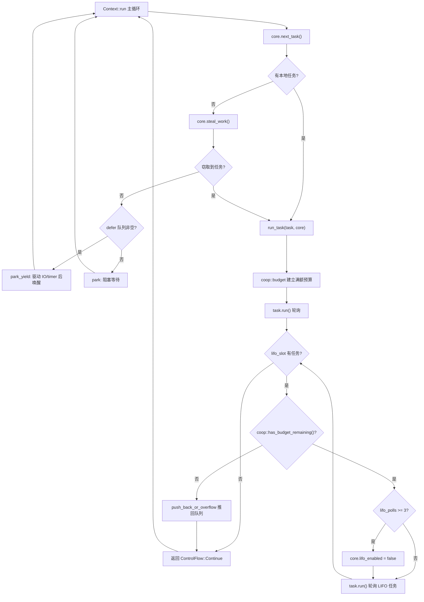

# 제 12 장: 협력적 스케줄링과 예산: coop 메커니즘이 어떻게 태스크가 스케줄러를 기아 상태로 만드는 것을 방지하는가

지난 장에서 우리는 tokio-stream과 tokio-util이 어떻게 하위 계층의 Waker와 스케줄링 메커니즘을 재사용하여 핵심 기능을 확장하는지 살펴보았다. 그러나 아무리 많은 조합자를 확장하더라도 비동기 런타임의 핵심 모순은 항상 존재한다: 스케줄러는 여러 태스크 사이에 CPU 시간을 공정하게 분배해야 하지만, 태스크 자체는 비선점적이다——일단 어떤 Future의 poll이 실행되기 시작하면 스케줄러는 외부에서 그것을 중단할 수 없다. 만약 어떤 태스크가 단일 poll에서 십만 개의 메시지를 루프로 처리하거나, loop 안에서 영원히 준비된 Future를 반복적으로 await한다면, 그것은 worker 스레드를 독점하여 같은 스레드의 다른 태스크들이 영원히 폴링 기회를 얻지 못하게 한다. 이것이 바로 고전적인 「태스크가 스케줄러를 기아 상태로 만드는」 문제다. Tokio의 해법은 선점이 아니라 협력이다: 각 태스크에 하나의 스케줄링 주기 내에서 제한된 예산을 할당하고, 자원 작업이 예산을 소모하며, 예산이 고갈되면 태스크가 스스로 양보해야 한다. 이 장에서는 이 coop 메커니즘의 구현을 깊이 파고든다.

# 12.1 예산의 운반체: 스레드 로컬 저장소와 Budget 구조체

> **[Design Inference & Architectural Trade-offs]**
> 스케줄러를 식당의 유일한 서버라고 비유하고, 태스크를 끊임없이 주문하는 손님이라고 한다면, coop 예산은 「각 손님은 최대 N개의 요리만 주문할 수 있다」는 규칙이다——서버는 손님을 강제로 중단할 필요 없이, 손님이 N개를 다 주문한 후에 「잠시 쉬세요, 다음 분을 서빙하겠습니다」라고 말하기만 하면 된다. 이 규칙이 없으면, 수다스러운 손님 하나가 식당 전체를 마비시킬 수 있다.

예산은 두 가지 제약을 충족해야 한다: 첫째, 임의 깊이의`poll`호출 스택에서 접근할 수 있어야 하며, 매번 인자를 전달할 필요가 없어야 한다; 둘째, 「현재 Tokio 런타임 내에 있는지」를 구분할 수 있어야 한다——런타임 외부에서`block_on`를 호출할 때는 예산 제약을 받지 않아야 한다. Tokio는**스레드 로컬 저장소(TLS)**를 사용하여 예산을 운반하고,`context`모듈을 통해 통합 관리하기로 선택했다.

예산의 핵심 타입은`coop::Budget`이다. 이 장의 소스 코드 슬라이스가`coop.rs`의 완전한 정의를 직접 제공하지는 않지만,`worker.rs`의 사용 지점에서 그 인터페이스 계약을 역추론할 수 있다:

[FACT:tokio/src/runtime/scheduler/multi_thread/worker.rs:695-795]

```rust
coop::budget(|| {
    // ... 轮询任务 ...
    task.run();
    // ...
    loop {
        // ...
        if !coop::has_budget_remaining() {
            // 预算耗尽，把 LIFO 任务推回队列
            core.run_queue.push_back_or_overflow(task, ...);
            return ControlFlow::Continue(core);
        }
        // ...
    }
})
```

여기에 세 가지 핵심 API가 등장한다:`coop::budget(closure)`는 예산 스코프를 설정하고,`coop::has_budget_remaining()`는 남은 예산을 조회하며, 그리고 후술할`coop::stop()`와`coop::set()`。`budget`의 의미는: 클로저에 진입할 때 현재 스레드의 예산을 최대값(기본 128)으로 재설정하고, 클로저 실행 동안 모든 자원 작업이 이 할당량을 공유하며, 클로저 종료 시 외부 예산을 복원한다.

> **[Design Inference & Architectural Trade-offs]**
> 예산 값 128은 경험값이다: 정상적인 메시지 처리 루프(예를 들어 한 번의 poll에서 수십 개의 메시지 처리)가 빈번하게 양보를 트리거하지 않을 만큼 충분히 크고, 통제 불능의 루프가 최대 128번의 자원 작업만 실행하면 반드시 양보하여 지연을 수용 가능한 범위로 제어할 만큼 충분히 작다.

`Budget`는 TLS에서 일반적으로`Cell<Option<Budget>>`형태로 존재한다.`Option`의 외부 의미는 「현재 스레드가 Tokio 런타임 컨텍스트에 있는지」이다:`None`는 런타임 내에 있지 않음을 나타내며(예를 들어 런타임 외부의`block_on`), 이때 모든 예산 검사는 직접 통과된다.

# 12.2 예산의 소모 지점: 자원 작업이 어떻게 차감하는가

예산은 공짜로 소모되지 않으며, 오직**자원 작업**만이 그것을 차감한다. 소위 자원 작업이란 무한 루프로 호출될 수 있는, 외부 세계와 상호작용하는 API를 말한다——channel의`send`/`recv`, I/O의 읽기/쓰기,`yield_now`등. 예를 들어`mpsc::Sender::reserve`는 모든 전송 경로의 공통 진입점이다:

[FACT:tokio/src/sync/mpsc/bounded.rs:1272-1311]

```rust
async fn reserve_inner(&self, n: usize) -> Result> {
    crate::trace::async_trace_leaf().await;

    if n > self.max_capacity() {
        return Err(SendError(()));
    }
    // ... WakeReceiverOnDrop guard ...
    let guard = WakeReceiverOnDrop { chan: &self.chan };
    let result = self.chan.semaphore().semaphore.acquire(n).await;
    // ...
}
```

`reserve_inner`는 실제로 세마포어 허가를 획득하기 전에`crate::trace::async_trace_leaf()`를 거친다. 이것은 단지 tracing처럼 보이는 호출이지만, 실제로는 예산 차감의 마운트 지점 중 하나이다.`async_trace_leaf`내부에서는`coop::poll_proceed`같은 함수를 호출한다: 예산이 충분하면 1을 차감하고`Proceed`를 반환한다; 예산이 고갈되면 「양보」 동작을 등록한다——현재 태스크의 Waker를 스케줄러에 넘기고`Pending`를 반환하여, 태스크가 이번 poll에서 조기에 종료되게 한다.

이것이 coop의 정묘한 점이다:**예산 고갈은 오류를 던지는 것이 아니라, 「양보」를 평범한`Pending`**로 위장한다. 상위 Future는`Pending`를 보고 자연스럽게 반환하고, 스케줄러는 태스크를 다시 큐에 넣으며, 다음에 스케줄될 때 예산이 이미 재설정되어 태스크는 지난번 중단 지점부터 계속한다. 전체 과정은 비즈니스 코드에 완전히 투명하다.

`yield_now`는 예산 메커니즘의 가장 직관적인 표현으로, 예산을 소모하지 않고**능동적으로 양보를 트리거한다**：

[FACT:tokio/src/task/yield_now.rs:38-60]

```rust
pub async fn yield_now() {
    let mut yielded = false;
    poll_fn(|cx| {
        ready!(crate::trace::trace_leaf());

        if yielded {
            return Poll::Ready(());
        }

        yielded = true;

        // Don't wake the task immediately, as that would push it right back
        // onto the run queue and it could be polled again before other tasks
        // or the IO/timer driver get a chance to run. Instead, hand the waker
        // to the scheduler, which wakes deferred tasks only after it has run
        // out of ready tasks and polled the driver. When polled from outside
        // a Tokio runtime, the waker is woken immediately.
        context::defer(cx.waker());

        Poll::Pending
    })
    .await
}
```

주목하라`context::defer(cx.waker())`이 줄을. 그것은 직접`wake`하지 않고, Waker를 스케줄러의**defer 큐**에 넘긴다. 왜인가? 소스 코드 주석이 명확히 설명한다: 즉시 깨우면 태스크가 즉시 실행 큐로 다시 푸시되어, I/O/timer 드라이버가 실행되기 전에 다시 폴링될 수 있어 양보가 의미를 잃는다. defer 큐의 의미는 「현재 worker가 준비된 태스크를 모두 실행하고, 드라이버를 폴링한 후에 이 태스크들을 깨우는 것」이다.

defer 큐는 worker의`Context`에 정의되어 있다:

[FACT:tokio/src/runtime/scheduler/multi_thread/worker.rs:247-257]

```rust
pub(crate) struct Context {
    worker: Arc,
    core: RefCell>>,
    /// Tasks to wake after resource drivers are polled. This is mostly to
    /// handle yielded tasks.
    pub(crate) defer: Defer,
}
```

`defer`필드의 주석은 그 용도를 직접 밝힌다: 「mostly to handle yielded tasks」. worker 메인 루프에서 로컬 큐와 스틸 모두 할 일이 없을 때, defer 큐를 검사한다:

[FACT:tokio/src/runtime/scheduler/multi_thread/worker.rs:613-621]

```rust
} else {
    // Wait for work
    core = if !self.defer.is_empty() {
        self.park_yield(core)
    } else {
        self.park(core)
    };
    core.stats.start_processing_scheduled_tasks();
}
```

defer 큐가 비어 있지 않으면, worker는`park_yield`——0 타임아웃으로 park하며, 이는 I/O와 timer를 구동한 다음 defer에 있는 작업을 깨웁니다. 이로써 "양보"한 작업은 반드시 드라이버가 실행된 후에야 다시 스케줄링됨이 보장됩니다.

# 12.3 예산 범위의 설정과 복원: run_task와 block_in_place

예산 범위는`run_task`에서 설정됩니다. 각 작업이 폴링될 때,`coop::budget`가 전체 폴링 과정을 감쌉니다:

[FACT:tokio/src/runtime/scheduler/multi_thread/worker.rs:691-704]

```rust
// Make the core available to the runtime context
*self.core.borrow_mut() = Some(core);

// Run the task
coop::budget(|| {
    // ...
    task.run();
    // ...
})
```

`coop::budget`진입 시 TLS의 예산을 최대치로 설정하고, 종료 시 복원합니다. 이는**각 작업이 폴링될 때마다 완전히 새로운 예산을 받는다는 것을 의미합니다**. 작업 내부에서`await`를 몇 번이나 하든, 단일`poll`내에서 소비가 128을 초과하면 강제로 양보됩니다.

하지만 여기에는 미묘한 문제가 있습니다: LIFO slot의 작업은**동일한`budget`클로저 내에서**폴링됩니다.`run_task`의 루프를 보세요:

[FACT:tokio/src/runtime/scheduler/multi_thread/worker.rs:709-750]

```rust
let mut lifo_polls = 0;

// As long as there is budget remaining and a task exists in the
// `lifo_slot`, then keep running.
loop {
    let mut core = match self.core.borrow_mut().take() {
        Some(core) => core,
        None => {
            return ControlFlow::Break(());
        }
    };

    let task = match core.lifo_slot.take() {
        Some(task) => task,
        None => {
            self.reset_lifo_enabled(&mut core);
            core.stats.end_poll();
            return ControlFlow::Continue(core);
        }
    };

    if !coop::has_budget_remaining() {
        core.stats.end_poll();
        // Not enough budget left to run the LIFO task, push it to
        // the back of the queue and return.
        core.run_queue.push_back_or_overflow(task, ...);
        debug_assert!(core.lifo_enabled);
        return ControlFlow::Continue(core);
    }
    // ...
}
```

핵심: LIFO slot의 작업은**외부 작업의 예산을 공유합니다**. 주석은`run_task`시작 부분에서 "Tasks from the LIFO slot inherit the 'parent's limits"라고 말합니다. 이는 의도된 설계입니다——만약 각 LIFO 작업이 예산을 재설정한다면, ping-pong 시나리오(작업 A가 B를 깨우고, B가 다시 A를 깨우는 경우)에서 두 작업이 무한히 서로를 스케줄링하고 예산이 영원히 재설정되어 기아 문제가 여전히 남습니다. 예산 공유는 A와 B가 합쳐서 최대 128번의 리소스 작업을 소비한 후 반드시 양보해야 함을 의미합니다.

LIFO slot 자체에는 독립적인 제한기`MAX_LIFO_POLLS_PER_TICK`：

[FACT:tokio/src/runtime/scheduler/multi_thread/worker.rs:756-766]

```rust
// Disable the LIFO slot if we reach our limit
//
// In ping-ping style workloads where task A notifies task B,
// which notifies task A again, continuously prioritizing the
// LIFO slot can cause starvation as these two tasks will
// repeatedly schedule the other. To mitigate this, we limit the
// number of times the LIFO slot is prioritized.
if lifo_polls >= MAX_LIFO_POLLS_PER_TICK {
    core.lifo_enabled = false;
    super::counters::inc_lifo_capped();
}
```

`MAX_LIFO_POLLS_PER_TICK`의 값은 3입니다:

[FACT:tokio/src/runtime/scheduler/multi_thread/worker.rs:263-263]

```rust
/// Value picked out of thin-air. Running the LIFO slot a handful of times
/// seems sufficient to benefit from locality. More than 3 times probably is
/// over-weighting. The value can be tuned in the future with data that shows
/// improvements.
const MAX_LIFO_POLLS_PER_TICK: usize = 3;
```

이것은**두 번째 방어선**입니다: 예산이 아직 소진되지 않았더라도, LIFO slot이 연속 3번 우선되면 비활성화되고 이후 작업은 일반 큐로 갑니다. 예산은 "리소스 작업 총량"을 관리하고, LIFO 제한은 "동일한 두 작업이 서로를 깨우는 횟수"를 관리하며, 둘은 상호 보완적입니다.

예산 범위는`block_in_place`에서 중요한 예외가 있습니다.`block_in_place`는 worker core를 다른 스레드로 이관하고, 현재 스레드는 블로킹 상태로 들어갑니다. 블로킹 코드는 예산 제약을 받지 않으므로 반드시**일시 중지**해야 합니다:

[FACT:tokio/src/runtime/scheduler/multi_thread/worker.rs:406-417]

```rust
if had_entered {
    // Unset the current task's budget. Blocking sections are not
    // constrained by task budgets.
    let _reset = Reset {
        take_core,
        budget: coop::stop(),
    };

    crate::runtime::context::exit_runtime(f)
} else {
    f()
}
```

`coop::stop()`는 현재 예산을 반환하고 이를`None`(즉 "런타임 내에 있지 않음")로 설정하며,`Reset`의`Drop`는 블로킹 종료 후 복원합니다:

[FACT:tokio/src/runtime/scheduler/multi_thread/worker.rs:374-397]

```rust
impl Drop for Reset {
    fn drop(&mut self) {
        with_current(|maybe_cx| {
            if let Some(cx) = maybe_cx {
                if self.take_core {
                    let core = cx.worker.core.take();
                    // ...
                    *cx_core = core;
                }

                // Reset the task budget as we are re-entering the
                // runtime.
                coop::set(self.budget);
            }
        });
    }
}
```

`coop::set(self.budget)`는 이전에`stop()`저장한 예산을 복원합니다. 이렇게 하면`block_in_place`내의 동기 블로킹 코드는 예산을 소비하지 않고, 예산 소진으로 인해 잘못 양보가 트리거되지도 않습니다; 블로킹 종료 후 작업은 원래의 남은 예산을 가지고 계속 실행됩니다.

아래 그림은 작업이 스케줄링되어 예산 소진으로 양보될 때까지의 전체 제어 흐름을 보여줍니다:



그림에서 두 가지 양보 경로를 볼 수 있습니다: 예산 소진 시 LIFO 작업을 큐로 되돌리는 것(`push_back_or_overflow`), 그리고 LIFO 연속 우선 초과 시 LIFO slot을 비활성화하는 것입니다. 둘 다 메인 루프로 돌아가 worker가 다른 작업이나 드라이버를 처리할 기회를 갖게 합니다.

# 12.4 설계 고찰, 오류 복구 및 프로덕션 함정

**왜 TLS를 사용하고 명시적 매개변수 전달을 사용하지 않는가?**예산 검사점은 channel, I/O, time 등 여러 모듈 깊숙이 흩어져 있습니다. 만약 명시적으로 전달한다면 모든 API에`Budget`매개변수가 하나씩 추가되어 전체 공용 인터페이스를 오염시킬 것입니다. TLS는 예산을 비즈니스 코드에 완전히 투명하게 만들며, 대가는 매 검사마다 TLS 접근 오버헤드가 한 번 발생한다는 것입니다. Tokio는`#[thread_local]`또는 플랫폼 특정 고속 TLS를 사용하여 이 오버헤드를 낮춥니다.

**예산 소진과 취소 안전성의 상호작용.**예산 소진으로`reserve_inner`가`Pending`를 반환할 때, 작업은`select!`의 특정 분기에 있을 수 있습니다. 이때 다른 분기가 준비되면,`select!`는 현재 분기를 취소합니다——`reserve_inner`의`WakeReceiverOnDrop`guard는 drop 시 "세마포어가 닫혔고 유휴 상태"를 확인하고 수신 측을 깨웁니다:

[FACT:tokio/src/sync/mpsc/bounded.rs:1286-1299]

```rust
struct WakeReceiverOnDrop {
    chan: &'a chan::Tx,
}

impl Drop for WakeReceiverOnDrop {
    fn drop(&mut self) {
        use chan::Semaphore;

        let semaphore = self.chan.semaphore();
        if semaphore.is_closed() && semaphore.is_idle() {
            self.chan.wake_rx();
        }
    }
}
```

이 guard의 존재는 다음을 설명합니다: 예산으로 트리거된`Pending`와 진정한 "허가 없음"`Pending`는 취소 경로에서 반드시 일관되게 동작해야 하며, 그렇지 않으면 수신 측이 "channel이 닫혔음" 알림을 영원히 받지 못할 수 있습니다.

**프로덕션 함정: 예산 소진으로 인한 숨은 지연.**흔한 현상은: 특정 작업의 메시지 처리 속도가 갑자기 느려지지만 CPU 사용률은 높지 않은 것입니다. 조사할 때 락 경합이나 I/O를 의심하기 쉽지만, 실제로는 작업이 단일 poll 내에서 128개 이상의 메시지를 처리하여 예산 양보가 트리거되고, 매 양보마다 완전한 "큐로 되돌림 → 재스케줄링 → 드라이버 폴링" 주기를 거치기 때문일 수 있습니다. 메시지 처리 자체가 빠르다면 이 스케줄링 오버헤드가 차지하는 비율이 높을 수 있습니다. 해결책은 대량 처리를 여러`spawn`작업으로 나누거나, 루프에 명시적으로`yield_now`。

**를 삽입하는 것입니다.`block_in_place`예산과**의 경계.`block_in_place`는`coop::stop()`예산을 일시 중지합니다. 하지만 주의할 점:`coop::stop()`는`had_entered`가 참일 때만 호출됩니다, 즉 실제로 런타임 worker 스레드에 있을 때만 일시 중지합니다. 만약`block_in_place`가 런타임 외부에서 호출되면,`f()`가 직접 실행되고 예산 상태는 변하지 않습니다. 이 분기 판단은`maybe_move_runtime`에서 완료됩니다:

[FACT:tokio/src/runtime/scheduler/multi_thread/worker.rs:424-464]

```rust
with_current(|maybe_cx| {
    match (
        crate::runtime::context::current_enter_context(),
        maybe_cx.is_some(),
    ) {
        (context::EnterRuntime::Entered { .. }, true) => {
            had_entered = true;
        }
        (
            context::EnterRuntime::Entered {
                allow_block_in_place,
            },
            false,
        ) => {
            if allow_block_in_place {
                had_entered = true;
                return Ok(());
            } else {
                return Err(
                    "can call blocking only when running on the multi-threaded runtime",
                );
            }
        }
        (context::EnterRuntime::NotEntered, true) => {
            return Ok(());
        }
        (context::EnterRuntime::NotEntered, false) => {
            return Ok(());
        }
    }
    // ...
})
```

네 가지 조합은 각각 다음에 대응합니다: worker 스레드 내,`block_on`의 스레드 풀 진입점, 중첩`block_in_place`, 런타임 외부. 처음 두 가지만 예산을 일시 중지하고 core를 이관해야 합니다.

> **[Design Inference & Architectural Trade-offs]**
> **예산 값은 구성 불가.**소스 코드에서 보면, 예산 최대치는 하드코딩된 상수(128)이며,`Builder`옵션. 이것은 의도적이다: 예산 값은 스케줄링 공정성과 처리량 간의 트레이드오프에 영향을 미치며, 사용자가 마음대로 조정할 수 있게 하면 "예산이 너무 커서 기아를 초래"하거나 "예산이 너무 작아 스케줄링 오버헤드가 폭발"하는 설정을 쉽게 만들 수 있다. Tokio는 이를 내부 불변량으로 선택했다.

# 이 장 요약

coop 메커니즘은 세 계층 설계로 비선점 스케줄러의 공정성 문제를 해결한다:

1. **예산 운반체**：`coop::Budget`TLS에 존재하며,`Option`외부 계층은 런타임 내부와 외부를 구분하고,`coop::budget`만액 스코프를 설정하며,`coop::stop`/`coop::set`일시정지와 재개를 지원한다(`block_in_place`시나리오).

2. **소비 지점**: 리소스 작업(channel 송수신, I/O,`yield_now`)은`coop::poll_proceed`을 통해 예산을 차감하고, 소진 시 "양보"를`Pending`로 위장하여 비즈니스에 투명하게 만든다.

3. **양보 경로**：`yield_now`는`context::defer`을 통해 Waker를 defer 큐에 넘겨 드라이버 폴링 이후에만 재스케줄링되도록 보장한다; LIFO slot 작업은 부모 작업 예산을 공유하며,`MAX_LIFO_POLLS_PER_TICK = 3`의 독립적 속도 제한을 가진다.

이 메커니즘의 핵심 통찰은:**공정성은 선점이 필요 없고, "무한 루프"가 유한한 단계 후에 자연스럽게 중단되도록 하면 된다**. 예산이 바로 이 "유한한 단계"의 척도다.

# 이 장 사고와 자가 테스트

Q1: 만약`run_task`에서`coop::budget`클로저 내의 LIFO 루프를 매번 LIFO 작업을 폴링하기 전에`coop::budget`를 호출하여 예산을 재설정하도록 변경하면, ping-pong 시나리오(작업 A가 B를 깨우고, B가 A를 깨움)에서 무슨 일이 발생하는가? 왜 소스 코드는 LIFO 작업이 부모 작업 예산을 공유하도록 선택했는가?

**참고 해석**: 소스 코드는`run_task`의 주석에서 "Tasks from the LIFO slot inherit the "parent"'s limits"라고 명확히 설명한다[FACT:tokio/src/runtime/scheduler/multi_thread/worker.rs:679-682]. 만약 각 LIFO 작업이 예산을 재설정하면, A→B→A→B의 ping-pong 시나리오에서 매 폴링마다 만액 예산을 얻어 두 작업이 무한히 서로를 스케줄링할 수 있고, 예산 소진으로 인해 결코 양보하지 않는다. 비록`MAX_LIFO_POLLS_PER_TICK = 3`의 속도 제한이 3회 후 LIFO slot[FACT:tokio/src/runtime/scheduler/multi_thread/worker.rs:756-766]을 비활성화하지만, LIFO 비활성화 후 작업은 일반 큐로 가고, 큐에 A와 B만 있으면 여전히 교대로 스케줄링되며 단지 LIFO 우선순위를 누리지 못할 뿐이다. 공유 예산은 리소스 작업 총량에서 최후 방어선을 제공한다: A와 B를 합쳐 최대 128회 리소스 작업을 소비하면 반드시 양보하여 다른 작업과 드라이버에 기회를 준다. 두 방어선은 상호 보완적이며 하나도 빠질 수 없다.

Q2: `yield_now`는`context::defer(cx.waker())`대신`cx.waker().wake_by_ref()`을 사용한다. 만약`defer`를 직접`wake`로 변경하면, 단일 worker 다중 작업 시나리오에서 한 작업이 루프에서 반복적으로`yield_now`를 호출하면 어떤 결과가 발생하는가? worker 메인 루프의`park_yield`분기를 결합하여 분석하라.

**참고 해석**：`yield_now`의 주석이 이유를 설명한다: 직접 wake는 작업을 즉시 실행 큐로 되돌려보내며, I/O/timer 드라이버가 실행되기 전에 다시 폴링될 수 있다[FACT:tokio/src/task/yield_now.rs:49-54]. 단일 worker 시나리오에서, 만약 작업이 루프에서 반복적으로`yield_now`하고 매번 직접 wake하면, worker 메인 루프의`next_task`가 즉시 이 작업을 가져와 다시 폴링하고,`park_yield`분기(I/O와 timer 구동 담당)는[FACT:tokio/src/runtime/scheduler/multi_thread/worker.rs:613-621]결코 실행되지 않는다, 왜냐하면 defer 큐가 비어 있고 로컬 큐에 항상 작업이 있기 때문이다. 결과적으로 I/O 이벤트와 timer는 영원히 처리되지 않고, 전체 런타임이 "가짜로 살아있는" 상태가 된다 — 작업은 실행되지만 외부 세계의 이벤트는 진행될 수 없다.`defer`큐는 양보한 작업이 드라이버 폴링 이후까지 반드시 기다려야 깨어나도록 보장하여, 드라이버에 실행 창을 제공한다.

Q3: `block_in_place`에서`coop::stop()`는 예산을`None`，`Reset::drop`로 설정하고`coop::set(self.budget)`에서 복구한다. 만약`block_in_place`의 클로저`f`내부에서 다시`block_in_place`를 호출하면(중첩), 예산 상태는 어떻게 되는가?`maybe_move_runtime`의 어느 분기가 이 상황을 처리하는가?

**참고 해석**: 중첩`block_in_place`은`maybe_move_runtime`의`(context::EnterRuntime::NotEntered, true)`분기에 의해 처리된다[FACT:tokio/src/runtime/scheduler/multi_thread/worker.rs:454-458]. 이 분기는 직접`return Ok(())`하고,`had_entered`을 설정하지 않으므로, 외부`block_in_place`의`if had_entered`판단이 거짓이 되어 다시`coop::stop()`를 호출하거나 새로운`Reset`을 생성하지 않는다. 주석은 "This is a nested call to block_in_place (we already exited). All the necessary setup has already been done."라고 설명한다 — 외부 계층은 이미 예산을 일시정지하고 core를 이양했으므로, 내부 계층은 단지 직접`f()`을 실행하면 된다. 만약 내부 계층이 다시`coop::stop()`하면, 이미`None`인 예산을 다시 저장하게 되어,`Reset::drop`복구 시 잘못된 값(`None`이 아닌 외부 계층의 원래 예산)으로 복구될 수 있어, 예산이 영구적으로 손실되고 작업의 이후 모든 리소스 작업이 제약을 받지 않게 된다.

coop 메커니즘은 예산 제약을 통해 작업이 리소스 작업 중에 능동적으로 양보하도록 하여, 비선점 모델에서 스케줄링 공정성을 유지한다. 그러나 예산 소진으로 트리거된 Pending은 취소 경로에서 진정한 대기와 일관되게 동작해야 하며, 그렇지 않으면 select! 등의 조합자가 상태 일관성을 깨뜨린다. 다음 장에서는 생산 함정과 경계 조건: 취소 안전성, panic 전파와 종료 순서로 들어가며, 이러한 "겉보기에 무관한 메커니즘이 경계에서 결합되는" 사례를 더 많이 보게 될 것이다.
