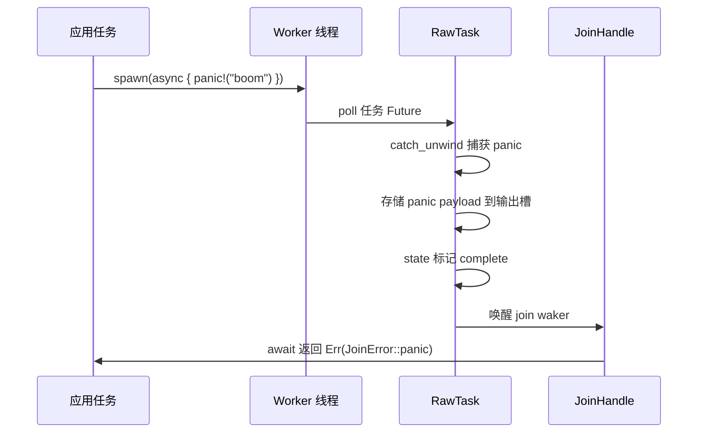
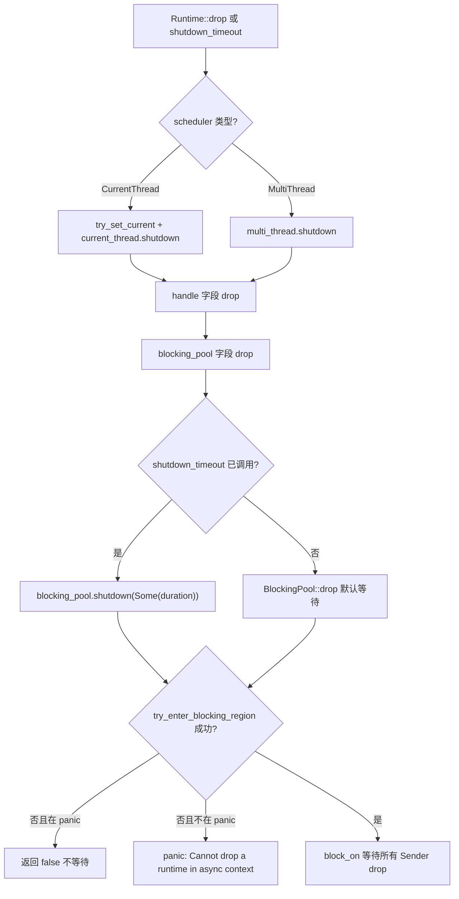
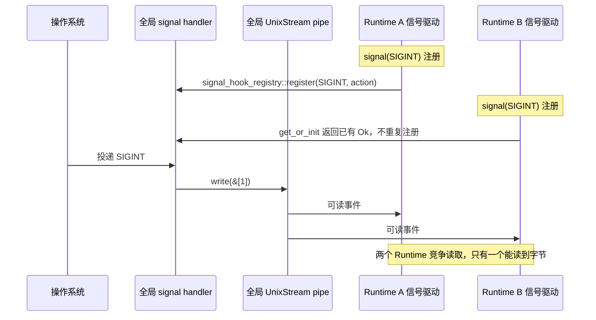

# 제 13 장: 생산 함정과 경계 조건: 취소 안전성, panic 전파와 종료 순서

지난 장에서 우리는 coop 협력 예산을 분석했습니다: 각 태스크는 하나의 스케줄링 주기 내에서 제한된 예산만 가지며, 소진되면 반드시 양보해야 하므로 단일 태스크가 다른 태스크를 기아 상태로 만드는 것을 방지합니다. 하지만 예산 메커니즘은 '공정 스케줄링' 문제만 해결했을 뿐, 실제 프로덕션 환경에는 더 은밀한 함정이 있습니다——취소 안전성, panic 전파, 종료 순서입니다. select!가 Future를 취소할 때, 태스크 panic이 포착될 때, Runtime이 종료를 시작할 때, 코드의 경계 동작은 종종 직관과 배치됩니다. 이번 장에서는 취소 안전성부터 시작하여, drop된 Future가 실제로 무엇을 잃는지 먼저 살펴보겠습니다.

# 13.2 panic 전파: JoinError가 크래시를 포착하는 방법

## 직관적 모델

Tokio 태스크 panic은 전체 프로세스를 크래시시키지 않으며(panic=abort가 아닌 한), 대신 포착되어`JoinError`로 패키징되어`JoinHandle::await`를 통해 반환됩니다. 이는 공장 조립 라인에서 특정 작업장에 사고가 발생했을 때 안전망이 작업자를 잡아주지만 제품은 폐기되는 것과 같습니다——당신이 받는 것은 '사고 보고서'이지 제품이 아닙니다.

## 데이터 구조와 상태

`JoinHandle<T>`의`Future::Output`는`super::Result<T>`입니다. 즉`Result<T, JoinError>` [FACT:tokio/src/runtime/task/join.rs:325]。`JoinError`는 두 가지 형태를 가집니다: panic과 cancelled. 문서 예제는 panic 시나리오를 보여줍니다:

```rust
let join_handle = tokio::spawn(async { panic!("boom"); });
let err = join_handle.await.unwrap_err();
assert!(err.is_panic());
```

[FACT:tokio/src/runtime/task/join.rs:121-127]

panic이 포착되는 메커니즘은`RawTask`의 poll 경로에 있습니다: 태스크 poll 시`catch_unwind`로 감싸고, panic 발생 후 payload를 태스크의 출력 슬롯에 저장하고, 상태를 complete로 표시한 다음, join waker를 깨웁니다.`JoinHandle::poll`는`try_read_output`를 통해 읽은 것이`Err(JoinError::panic(payload))`。

## 입니다.



복사`JoinError`핵심 포인트: panic의 payload가 완전히 보존되며,`std::error::Error`는`into_panic()`를 구현하여,`Box<dyn Any + Send>`를 통해`downcast_ref::<&str>()`를 되찾고,

## 로 panic 메시지를 추출할 수 있습니다.

**설계 고찰과 함정`JoinHandle`함정 1:`UnwindSafe`의**

```rust
impl UnwindSafe for JoinHandle {}
impl RefUnwindSafe for JoinHandle {}
```

[FACT:tokio/src/runtime/task/join.rs:176-181]

복사`T: UnwindSafe`이는 무조건적 구현이며,`JoinHandle`를 요구하지 않습니다. 이유:`T`，`T`자체는`catch_unwind`를 보유하지 않으며, 힙上的 태스크 할당에서 panic 시 이미`T`에 의해 격리됩니다. 따라서`UnwindSafe`，`JoinHandle`가

**가 아니더라도 안전합니다.**함정 2: panic은 부모 태스크로 자동 전파되지 않습니다.`JoinHandle`태스크 A가 태스크 B를 spawn했고 B가 panic하면, A가 B의

**를 await하지 않는 한 A는 자동으로 알림을 받지 않습니다. A가 await하지 않으면 B의 panic은 조용히 삼켜집니다. 이는 프로덕션 환경에서 가장 은밀한 버그 원인 중 하나입니다.`spawn_blocking`함정 3:**의 panic도 마찬가지로 포착됩니다.`catch_unwind`블로킹 스레드 풀의 worker도`Mutex`로 태스크를 감싸며, panic 후 스레드는 죽지 않고 풀로 돌아가 계속 작업을 받습니다. 하지만 블로킹 태스크에서`std::sync::Mutex`를 보유하고 panic 시 해제하지 않으면 lock poisoning이 발생합니다——이는

**의 고유 동작이며, Tokio는 개입하지 않습니다.**함정 4: Runtime drop 시의 panic.`catch_unwind`태스크가 Runtime drop 과정에서 panic하면,

# 는 여전히 유효하지만, 이 시점에 join waker가 이미 무효화되었을 수 있어 panic payload가 버려집니다. 이는 종료 순서 문제의 하위 집합이며, 다음 절에서 전개합니다.

## 13.3 종료 순서: 블로킹 스레드와 I/O 리소스 정리

직관적 모델

## Runtime 종료는 식당 폐점과 같습니다: 먼저 프런트에서 손님 받기를 중단하고(새 태스크 수락 중지), 주방이 하던 요리를 마무리할 때까지 기다린 다음(비동기 태스크가 다음 yield 지점까지 실행), 마지막으로 외주 도우미가 퇴근하기를 기다립니다(블로킹 스레드 반환). 순서가 틀리면 문제가 발생합니다——예를 들어 도우미를 먼저 내보내면 주방의 요리는 영원히 완성되지 않습니다.

`Runtime`데이터 구조와 종료 경로

```rust
pub struct Runtime {
    scheduler: Scheduler,
    handle: Handle,
    blocking_pool: BlockingPool,
}
```

[FACT:tokio/src/runtime/runtime.rs:97-106]

`Drop`복사

```rust
impl Drop for Runtime {
    fn drop(&mut self) {
        match &mut self.scheduler {
            Scheduler::CurrentThread(current_thread) => {
                let _guard = context::try_set_current(&self.handle.inner);
                current_thread.shutdown(&self.handle.inner);
            }
            Scheduler::MultiThread(multi_thread) => {
                multi_thread.shutdown(&self.handle.inner);
            }
        }
    }
}
```

[FACT:tokio/src/runtime/runtime.rs:506-521]

복사`Drop`주의:`scheduler`，**는`blocking_pool`**。`blocking_pool`만 처리하며`Drop`를 명시적으로 처리하지 않습니다.`Runtime::drop`의 종료는 자체`scheduler` → `handle` → `blocking_pool`에서 발생하며,

반환 후 필드 drop 순서에 의해 트리거됩니다. 필드 drop 순서는 선언 순서입니다:`shutdown_timeout`. 따라서 블로킹 풀이 마지막에 종료됩니다.

```rust
pub fn shutdown_timeout(mut self, duration: Duration) {
    self.handle.inner.shutdown();
    self.blocking_pool.shutdown(Some(duration));
}
```

[FACT:tokio/src/runtime/runtime.rs:457-461]

는 순서를 명시적으로 제어합니다:`handle.inner.shutdown()`복사`blocking_pool.shutdown(Some(duration))`먼저`duration`。

## 로 스케줄러와 I/O 드라이버에 중지를 알리고, 그다음

`blocking/shutdown.rs`로 블로킹 태스크를 기다리며, 최대

```rust
pub(super) struct Sender {
    _tx: Arc>,
}

pub(super) struct Receiver {
    rx: oneshot::Receiver,
}
```

[FACT:tokio/src/runtime/blocking/shutdown.rs:13-19]

블로킹 풀 종료의 저수준 메커니즘`Sender`는 정교한 oneshot channel을 사용합니다:`Arc<oneshot::Sender>`복사`Sender`각 블로킹 worker는`Receiver`클론(내부는`wait`)을 보유합니다. 모든 worker가 종료되고 모든

```rust
pub(crate) fn wait(&mut self, timeout: Option) -> bool {
    use crate::runtime::context::try_enter_blocking_region;

    if timeout == Some(Duration::from_nanos(0)) {
        return false;
    }

    let mut e = match try_enter_blocking_region() {
        Some(enter) => enter,
        _ => {
            if std::thread::panicking() {
                return false;
            } else {
                panic!(
                    "Cannot drop a runtime in a context where blocking is not allowed. \
                    This happens when a runtime is dropped from within an asynchronous context."
                );
            }
        }
    };

    if let Some(timeout) = timeout {
        e.block_on_timeout(&mut self.rx, timeout).is_ok()
    } else {
        let _ = e.block_on(&mut self.rx);
        true
    }
}
```

[FACT:tokio/src/runtime/blocking/shutdown.rs:37-70]

가 알림을 받습니다.

1. `timeout == Some(0)`메서드:`shutdown_background`복사

2. `try_enter_blocking_region()`단계별 분석:`None`。

는 즉시 false를 반환합니다——이는

의 경로이며, 기다리지 않습니다.`block_on_timeout`는 블로킹 영역 진입을 시도합니다. 현재 비동기 컨텍스트에 있으면(예: async 태스크에서 Runtime을 drop),

## 를 반환합니다.



## 4. timeout이 있으면

**를 사용하고, 초과 시 false를 반환하며; timeout이 없으면 무한 대기합니다.**오류 메시지는 명확하다: 「Cannot drop a runtime in a context where blocking is not allowed」[FACT:tokio/src/runtime/blocking/shutdown.rs:51-54]。해결책은`shutdown_background()`을 사용하는 것이며, 이는`shutdown_timeout(Duration::from_nanos(0))` [FACT:tokio/src/runtime/runtime.rs:494-496]와 동등하고, 블로킹 작업을 기다리지 않는다.

**함정 2:`shutdown_background`은 블로킹 작업을 누수시킨다.**문서는 「this may result in a resource leak (in that any blocking tasks are still running until they return)」라고 명확히 경고한다.[FACT:tokio/src/runtime/runtime.rs:470-472]。블로킹 작업은 자연스럽게 반환될 때까지 계속 실행되지만, Runtime은 이미 drop되었고, 이들이 보유한 리소스는 이미 무효화되었을 수 있다.

**함정 3: I/O 리소스가 Runtime drop 후 무효화된다.**문서는 「Once the runtime has been dropped, any outstanding I/O resources bound to it will no longer function」이라고 설명한다.[FACT:tokio/src/runtime/runtime.rs:52-54]。`is_rt_shutdown_err`함수는 바로 이러한 오류를 감지하기 위한 것이다.[FACT:tokio/src/runtime/runtime.rs:585-593]。

**함정 4:`Drop`은 기본적으로 무한 대기한다.**문서는 「The`Drop` implementation waits forever for this」[FACT:tokio/src/runtime/runtime.rs:43-44]。만약 블로킹 작업이 교착 상태에 빠지면(예: 무한 루프), drop Runtime은 영원히 중단된다. 프로덕션 환경에서는`shutdown_timeout`으로 상한을 설정해야 한다.

# 13.4 신호 처리와 다중 Runtime 충돌

## 직관적 모델

Unix 신호는 프로세스 수준이지만, Tokio의`Signal`은 Runtime에 바인딩된다. 이는 마치 건물 전체가 하나의 화재 경보 벨을 공유하지만, 각 방에 독립적인 수신기가 설치된 것과 같다——첫 번째로 수신기를 설치한 사람이 벨의 배선 방식을 변경하면, 이후 사람들은 이 변경을 공유할 수밖에 없다.

## 데이터 구조와 전역 상태

`signal_enable`은 신호 핸들러를 등록하는 진입점이다:

```rust
fn signal_enable(signal: SignalKind, handle: &Handle) -> io::Result {
    let signal = signal.0;
    if signal  slot,
        None => return Err(io::Error::other("signal too large")),
    };

    siginfo
        .init
        .get_or_init(|| {
            unsafe { signal_hook_registry::register(signal, move || action(globals, signal)) }
                .map(|_| ())
                .map_err(|e| e.raw_os_error())
        })
        .map_err(|e| {
            e.map_or_else(
                || Error::other("registering signal handler failed"),
                || Error::from_raw_os_error,
            )
        })
}
```

[FACT:tokio/src/signal/unix.rs:266-296]

핵심 포인트:

1. `signal <= 0 || FORBIDDEN.contains(&signal)`은 잘못된 신호를 거부한다.

2. `handle.check_inner()`은 신호 드라이버가 실행 중인지 확인한다——만약 Runtime이 이미 종료되었다면, 여기서 실패한다.

3. `siginfo.init.get_or_init(...)`은`OnceLock`을 사용하여 각 신호가 OS handler에 한 번만 등록되도록 보장한다.`get_or_init`의 클로저는`signal_hook_registry::register`을 호출하며, 이는 전역적이고 프로세스 수준의 등록이다.

4. 등록된 handler는`action(globals, signal)`이며, 두 가지 일을 한다:`globals.record_event(signal)`이벤트를 기록한 후, pipe에 1바이트를 써서 드라이버를 깨운다.[FACT:tokio/src/signal/unix.rs:252-259]。

## 다중 Runtime 충돌의 근원

`globals()`이 반환하는 것은 프로세스 수준의 전역`Globals`，`OsExtraData`안의`UnixStream`쌍도 전역이다:

```rust
pub(crate) struct OsExtraData {
    sender: UnixStream,
    pub(crate) receiver: UnixStream,
}
```

[FACT:tokio/src/signal/unix.rs:61-64]

`Default`구현은 한 쌍의`UnixStream` [FACT:tokio/src/signal/unix.rs:61-64]을 생성한다. 이 pipe는 전역적으로 유일하며, 모든 Runtime의 신호 드라이버가 이를 공유한다.

문제가 발생한다:`signal_enable`안의`handle.check_inner()`이 확인하는 것은**현재 Runtime**의 신호 드라이버이다. 하지만`signal_hook_registry::register`이 등록한 handler는**프로세스 수준**이며, 여기에 쓰는 것은**전역**pipe이다. 만약 Runtime A가 먼저 SIGINT를 등록하고, 그 다음 Runtime B도 SIGINT를 등록하면,`get_or_init`은 이미 존재하는`Ok(())`을 직접 반환하고, 중복 등록하지 않는다. 하지만 Runtime B의 신호 드라이버는 전역 pipe에서 데이터를 읽는다——두 Runtime이 동일한 pipe의 바이트를 경쟁하게 된다.

## 시나리오 기반 Walkthrough: 다중 Runtime 신호 경쟁



## 설계 사고와 함정

**함정 1: 신호 핸들러는 절대 해제되지 않는다.**문서는 「Once a signal handler is registered with the process the underlying libc signal handler is never unregistered」라고 명확히 경고한다.[FACT:tokio/src/signal/unix.rs:379-380]。비록`Signal`인스턴스가 drop되더라도, 이후 신호는 여전히 Tokio에 의해 포착되며, 기본 동작은 복원되지 않는다.[FACT:tokio/src/signal/unix.rs:338-340]。

**함정 2: 신호는 병합된다.**문서는 「before`poll` is called, all signal notifications are coalesced into one item returned from `poll`」[FACT:tokio/src/signal/unix.rs:312-315]。만약 10개의 SIGINT를 받았지만 한 번만 poll했다면, 하나의 이벤트만 보게 된다. 이는 Unix 신호 자체의 특성이다(표준 신호는 큐에 쌓이지 않음). Tokio는 추가로 병합하지 않는다.

**함정 3: 다중 Runtime에서 신호가 손실될 수 있다.**전역 pipe가 여러 Runtime에 의해 경쟁적으로 읽히기 때문에, 하나의 Runtime이 바이트를 읽어가면 다른 하나는 영원히 기다릴 수 있다. 프로덕션 환경에서는 하나의 Runtime에서만 신호를 처리하거나,`signal_hook`으로 직접 관리해야 한다.

**함정 4:`signal`함수의 panic 조건.**문서는 「This function panics if there is no current reactor set, or if the`rt` feature flag is not enabled」[FACT:tokio/src/signal/unix.rs:398-405]。Runtime 외부에서`signal()`을 호출하면 panic이 발생한다.

**함정 5:`recv()`의 취소 안전성.**문서는 「This method is cancel safe. If you use it as a branch in`tokio::select!` and another branch completes first, then it is guaranteed that no signal is lost」[FACT:tokio/src/signal/unix.rs:423-427]。이는 신호 이벤트가 전역`EventInfo`에 존재하기 때문이며,`recv()`은 단지 읽기만 하고, 기본 상태를 소비하지 않는다.

# 설계 사고

이 장의 세 가지 주제는 하나의 근본적인 패턴을 공유한다:**상태의 소유권이 취소/종료/신호의 안전성을 결정한다**。

- `JoinHandle`은 취소 안전하다, 왜냐하면 출력이 힙에 있고, handle은 단지 참조일 뿐이기 때문이다.
- Runtime 종료 순서는 민감하다, 왜냐하면 블로킹 풀과 스케줄러가 공유되기 때문이다`Handle`, 순서가 틀리면 데드락이나 panic이 발생한다.
- 신호는 다중 Runtime 충돌이 발생하는데, handler와 pipe는 프로세스 수준의 전역 상태인 반면`Signal`은 Runtime 수준 뷰이기 때문이다.

이 패턴을 이해하면, 함정 회피 목록은 세 가지 원칙으로 정리할 수 있다:

1. **취소 안전성 = 상태가 Future 외부에 있음.**만약 Future 내부에 버퍼가 있으면, drop 시 데이터가 유실된다.`JoinHandle`、`Signal::recv`、`tokio::sync::mpsc::Receiver::recv`모두 이 조건을 만족한다.

2. **종료 순서 = 의존 방향의 역순.**누가 누구에게 의존하는지, 의존받는 쪽을 먼저 닫는다. 스케줄러는 I/O 드라이버에 의존하므로 스케줄러를 먼저 닫고, 블로킹 풀은 독립적이므로 마지막에 닫는다.

3. **전역 상태 = 다중 인스턴스 충돌.**모든 프로세스 수준 자원(신호 handler, pipe, 파일 디스크립터 테이블)은 다중 Runtime 하에서 충돌한다. 단일 Runtime으로 제한하거나 외부 동기화를 사용해야 한다.

# 이 장 요약

# 이 장 생각해보기와 자가 점검

Q1: 만약`JoinHandle::poll`에서`coop::poll_proceed(cx)`을 제거하면, 어떤 시나리오에서 다른 태스크가 기아 상태에 빠지는가? 왜`try_read_output`자체는 예산을 소비하지 않는가?

**참고 해석**：`coop::poll_proceed(cx)`은[FACT:tokio/src/runtime/task/join.rs:325-325]에서 협력 예산을 소비한다. 만약 제거하면, 루프 안에서 반복적으로`select!`여러`JoinHandle`를 처리하는 태스크가 한 번의 스케줄링 주기 내에서 모든 handle을 무한히 폴링하고, 영원히`Pending`로 반환하지 않아 같은 worker의 다른 태스크를 기아 상태에 빠뜨릴 수 있다.`try_read_output`자체는 예산을 소비하지 않는데, 이는 단순한 메모리 읽기 + 가능한 waker 저장일 뿐이며 I/O나 락 경합이 수반되지 않아 오버헤드가 극히 적기 때문이다. 예산 메커니즘의 설계 의도는 「장시간 실행될 수 있는 연산」을 제약하는 것이지, 매 poll마다 비용을 부과하는 것이 아니다. 주의할 점은`coop.made_progress()`이`ret.is_ready()`일 때만[FACT:tokio/src/runtime/task/join.rs:349-351]을 호출한다는 것, 즉 실제로 출력을 얻었을 때만 예산을 반환한다는 것이다 — 이는 「폴링했지만 결과가 없는」 연산이 예산을 누적 소비하는 것을 방지하기 위함이다.

Q2：`blocking/shutdown.rs`의`wait`메서드에서, 만약`try_enter_blocking_region()`이`None`을 반환하고 현재 panic 중이라면, 왜 계속 기다리는 대신`false`을 반환하는가? 만약 계속 기다리도록 변경하면 무슨 일이 발생하는가?

**참고 해석**：`try_enter_blocking_region()`이`None`을 반환하는 것은 현재 비동기 컨텍스트에 있으므로[FACT:tokio/src/runtime/blocking/shutdown.rs:44-57]을 블로킹할 수 없음을 나타낸다. 만약 이때 panic 중이라면, 코드는`false`을 반환하고[FACT:tokio/src/runtime/blocking/shutdown.rs:47-49]을 기다리지 않는다. 이유는: panic 전개 과정에서 다시 panic이 발생하면 프로세스가 abort되기 때문이다(double panic). 만약 계속 기다리도록 변경하면`block_on`을 호출해야 하는데, 비동기 컨텍스트에서`block_on`은 panic을 발생시킨다 — panic 전개 중 panic은 프로세스를 즉시 abort시켜 모든 진단 정보를 잃게 된다.`false`을 반환하면 drop이 계속 완료되어 panic 정보가 보존된다. 이것은 「우아한 성능 저하」 설계이다: 불완전한 종료가 프로세스 크래시보다 낫다.

Q3: Runtime A에서`Signal`을 생성하여 SIGTERM을 수신하고, 그런 다음`Signal`을 Runtime B로 이동하여 poll한다고 가정하자.`signal_enable`의`handle.check_inner()`은 어느 Runtime을 검사하는가? 만약 Runtime A가 먼저 drop되면, Runtime B의`Signal`은 여전히 신호를 수신할 수 있는가?

**참고 해석**：`signal_enable`은`signal()`호출 시 실행되며, 이때`handle`은 Runtime A의[FACT:tokio/src/signal/unix.rs:398-405]。`check_inner()`이다. 검사하는 것은 Runtime A의 신호 드라이버[FACT:tokio/src/signal/unix.rs:275]。`Signal`이다. 내부는`RxFuture`이며, 래핑하는 것은`watch::Receiver<()>` [FACT:tokio/src/signal/unix.rs:366-368]이고, 이 receiver는 전역`Globals`의`EventInfo`에 등록된다. 만약 Runtime A가 drop되면, 그 신호 드라이버는 전역 pipe에서 데이터 읽기를 중단하지만, 전역 handler는 여전히`record_event`하고 pipe에 쓴다. Runtime B의 신호 드라이버가 실행 중이라면, pipe 데이터를 읽고`EventInfo`을 트리거하여`Signal`의 waker를 깨운다. 따라서 Runtime B의`Signal` **은 아마도**여전히 신호를 수신할 수 있지만, Runtime B에 신호 드라이버가 실행 중인지에 달려 있다. 만약 Runtime B에 신호 드라이버가 없다면(예: signal feature가 활성화되지 않았거나 드라이버가 종료됨), pipe 데이터를 읽는 자가 없어`Signal`은 영원히 깨어나지 못한다. 이것이 다중 Runtime 신호 처리의 취약성이다.

# 장말 전환

취소 안전성, panic 전파, 종료 순서, 신호 충돌 — 이 네 가지 문제의 공통 근원은 「상태 소유권」이 비동기 경계에서 모호하다는 것이다. Tokio는 상태를 힙에 배치하고, 참조 카운팅으로 수명 주기를 관리하며,`catch_unwind`으로 panic을 격리하고, 전역`Globals`으로 신호 상태를 공유함으로써 엔지니어링적으로 사용 가능한 답을 제시한다. 그러나 이 답들에는 모두 경계 조건이 있으며, 프로덕션 환경에서는 반드시 명시적으로 처리해야 한다.

다음 장에서는 아키텍처 트레이드오프와 미래 진화로 들어간다: io_uring에서 플러거블 드라이버까지. Tokio가 API 안정성을 유지하면서 차세대 I/O 인터페이스를 위해 어떻게 확장 공간을 확보하는지, 그리고 현재 아키텍처에서 어떤 설계 결정이 역사적 부담이고 어떤 것이 선제적 배치인지 살펴볼 것이다.

이로써 우리는 Tokio 프로덕션 환경에서 가장 실수하기 쉬운 경계 지대를 모두 살펴보았다: 취소 안전성이 출력 저장이 힙에 있다는 것에 의존하는 점, try_read_output의 원자성; JoinHandle::drop은 태스크를 취소하지 않고 abort만이 실제로 취소하지만 spawn_blocking에는 효과가 없다는 점; panic이 catch_unwind에 의해 포착된 후 JoinError로 패키징되어 await하지 않으면 조용히 손실된다는 점; Runtime 종료에는 엄격한 순서가 있어 async 컨텍스트에서 drop하면 panic이 발생한다는 점; 시그널 핸들러는 프로세스 전역 상태이며 등록 후 절대 해제되지 않는다는 점. 이러한 규칙 뒤에는 정확성과 성능 사이의 Tokio의 반복적인 트레이드오프가 있다. 다음 장에서는 구체적인 메커니즘을 벗어나 아키텍처 높이에서 이러한 트레이드오프의 유래를 되돌아보고, io_uring, 드라이버 재구성, 커스텀 실행기 인터페이스가 Tokio를 어디로 이끌지 전망할 것이다.
