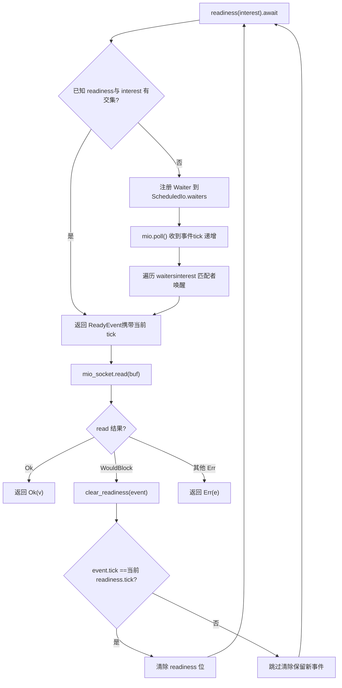
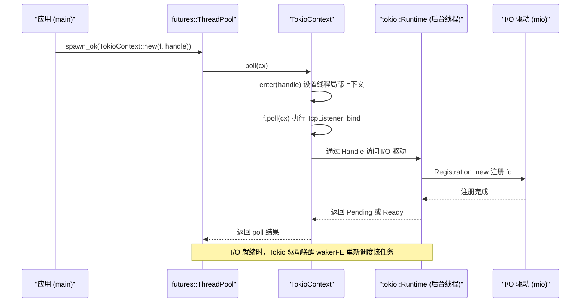

# 제 14 장: 아키텍처 트레이드오프와 미래 진화: io_uring에서 플러그 가능 드라이버까지

이전 장에서 우리는 취소 안전성, panic 전파, 종료 순서, 시그널 충돌이라는 네 가지 프로덕션 함정을 정리했는데, 이들은 겉보기에는 분산되어 있지만 실은 모두 동일한 아키텍처 문제를 가리킨다: 상태 소유권이 비동기 경계에서 어떻게 명확하게 구분되는가. 그리고 소유권을 구분하는 방식은 런타임 최하층의 세 가지 아키텍처 결정에 의해 결정된다——태스크가 어떻게 스케줄링되는가, I/O 이벤트가 어떻게 분배되는가, 동시성 정확성이 어떻게 검증되는가. 이 장에서는 더 이상 특정 함수의 구현 세부사항에 파고들지 않고, 아키텍처 높이에서 Tokio가 이러한 결정에서의 트레이드오프를 되돌아보며, 공식 문서와 소스 코드에 이미 심어져 있는 진화 단서를 따라 io_uring, 드라이버 재구성, 커스텀 실행기 인터페이스가 Tokio를 어디로 이끌지 살펴본다. 이 장을 읽고 나면 실용적인 질문에 답할 수 있어야 한다: 언제 Tokio를 확장해야 하고, 언제 그것을 우회해야 하는가.

# 一, 세 가지 역사적 트레이드오프: 왜 지금 이런 모습인가

## 직관적 모델

Tokio를 10년째 운영 중인 식당이라고 상상해 보자. 주방의 교대 방식(work-stealing), 서빙 담당자의 독립 편제(I/O 드라이버와 스케줄러 분리), 그리고 주방의 위생 검사 제도(loom 동시성 검증)는 모두 개업 첫날부터 설계된 것이 아니라 "손님이 많아지고 요리가 복잡해지는" 과정에서 점진적으로 진화한 것이다. 이러한 진화를 이해해야 어떤 설계가 선견지명 있는 배치이고 어떤 것이 역사적 부담인지 판단할 수 있다.

## 트레이드오프 1: 전역 큐 대신 work-stealing

> **[Design Inference & Architectural Trade-offs]**
> 전역 큐 구현이 가장 간단하다: 모든 태스크가 하나의`Mutex<VecDeque>`에 들어가고, worker 스레드가 락을 잡고 태스크를 가져간다. 하지만 락 경합은 코어 수가 늘어날수록 악화되고, 캐시 지역성도 나쁘다——태스크가 어느 코어에서 생성되고 어느 코어에서 실행되는지가 완전히 무작위다.

work-stealing의 트레이드오프는: 각 worker가 로컬 큐를 보유하고,`spawn`시 우선 로컬 큐에 넣고(무락, 캐시 친화적), 로컬이 비었을 때만 다른 worker 큐의 꼬리에서 훔친다. 대가는 로드 밸런싱에 지연이 있고, 훔치기 자체에 원자적 연산과 메모리 배리어가 필요하다는 것이다. Tokio가 후자를 선택한 이유는 현대 서버가 수십 코어에 달하는 경우가 많아 락 경합 비용이 간헐적 훔치기 오버헤드보다 훨씬 크기 때문이다.

> **[Design Inference & Architectural Trade-offs]**
> 이 결정의 경계 조건은:**태스크 입자가 너무 세밀하면 안 된다**. 만약 각 태스크가 몇 마이크로초의 작업만 한다면, 훔치기와 스케줄링 오버헤드 비율이 통제 불능이 된다. 이것이 Tokio가`spawn_blocking`외에도 장기 태스크가 능동적으로`yield_now()`할 것을 요구하는 이유다——협력적 스케줄링은 본질적으로 work-stealing을 위한 안전망이다.

## 트레이드오프 2: I/O 드라이버가 스케줄러로부터 독립

이것이 이 장의 소스 자료에서 가장 흥미로운 부분이다.`tokio/src/runtime/io/mod.rs`의 모듈 구조를 보자:

[FACT:tokio/src/runtime/io/mod.rs:5-22]

```rust
mod driver;
use driver::{Direction, Tick};
pub(crate) use driver::{Driver, Handle, ReadyEvent};

mod registration;
pub(crate) use registration::Registration;

mod registration_set;
use registration_set::RegistrationSet;

mod scheduled_io;
use scheduled_io::ScheduledIo;

mod metrics;
use metrics::IoDriverMetrics;

use crate::util::ptr_expose::PtrExposeDomain;
static EXPOSE_IO: PtrExposeDomain = PtrExposeDomain::new();
```

주목할 점은`driver`、`registration`、`scheduled_io`이 세 개의 독립 모듈이고, 외부에는`Driver`、`Handle`、`ReadyEvent`、`Registration`이 몇 가지 타입만 노출한다는 것이다.`ScheduledIo`은`pub(crate)`의 것이다——그것은`PtrExposeDomain`에 의해 감싸져 loom 테스트에서 원시 포인터를 동시성 검사에 노출하는 데 사용된다.

> **[Design Inference & Architectural Trade-offs]**
> 왜 I/O 드라이버가 스케줄러에 직접 내장되지 않는가? 둘의 수명 주기와 동시성 모델이 다르기 때문이다. 스케줄러는 "어떤 태스크가 실행되어야 하는가"를 관심 갖고, I/O 드라이버는 "어떤 fd가 준비되었는가"를 관심 갖는다. 만약 결합되면 스케줄링 전략을 조정할 때마다 I/O 경로를 건드려야 하고, 그 반대도 마찬가지다. 더 중요한 것은,`block_on`단일 스레드 런타임도 I/O 드라이버가 필요하지만 work-stealing 스케줄러는 필요 없다——분리가 두 런타임이 동일한 I/O 구현을 재사용할 수 있게 한다.

## 트레이드오프 3: loom으로 동시성 모델 검증

`tokio/src/loom/mod.rs`은 14줄에 불과하지만 Tokio 동시성 정확성의 검증 전략을 드러낸다:

[FACT:tokio/src/loom/mod.rs:1-14]

```rust
//! This module abstracts over `loom` and `std::sync` depending on whether we
//! are running tests or not.

#![allow(unused)]

#[cfg(not(all(test, loom)))]
mod std;
#[cfg(not(all(test, loom)))]
pub(crate) use self::std::*;

#[cfg(all(test, loom))]
mod mocked;
#[cfg(all(test, loom))]
pub(crate) use self::mocked::*;
```

핵심은`#[cfg(all(test, loom))]`이 조건이다: 동시에`test`과`loom`두 cfg를 활성화할 때만`mocked`모듈로`std`을 대체한다. 이는 프로덕션 빌드에는 loom 코드가 전혀 없어 런타임 오버헤드가 제로라는 것을 의미한다.

> **[Design Inference & Architectural Trade-offs]**
> loom의 가치는 "스레드 인터리빙의 모든 가능한 순서"를 열거할 수 있다는 것이다.`ScheduledIo`안의`AtomicUsize`의 읽기-수정-쓰기,`Waiters`연결 리스트의 삽입과 삭제는 실제 하드웨어에서 백만 번을 실행해도 오류가 나지 않을 수 있지만, loom은 몇 초 만에 경쟁 조건을 유발하는 인터리빙을 구성할 수 있다. 대가는 테스트 실행이 느리고 메모리 사용량이 높다는 것이므로, 단위 테스트에만 사용할 수 있고 프로덕션에는 들어갈 수 없다.

## 설계 사고

이 세 가지 트레이드오프에는 공통된 특징이 있다:**모두 "더 복잡하지만 더 확장 가능한" 방식을 선택했고, 복잡성을 내부에 제한했다**. work-stealing의 복잡성은 스케줄러에 숨겨져 있고, I/O 기반의 복잡성은`ScheduledIo`에 숨겨져 있으며, loom의 복잡성은 cfg 조건에 숨겨져 있다. 외부에 노출되는 API는 항상`spawn`、`TcpStream::read`이러한 단순한 인터페이스들이다.

> **[Design Inference & Architectural Trade-offs]**
> 이것이 또한 "언제 Tokio를 확장해야 하는가"를 판단하는 첫 번째 기준이다:**만약 당신의 요구사항이 기존 API로 표현될 수 있다면, 내부 구조를 건드리지 마라**. 일단 당신이`pub(crate)`의 타입이나`tokio_unstable`의 cfg에 의존하기 시작하면, 자신을 Tokio의 내부 구현에 묶어버린 것이며, 업그레이드할 때 대가를 치르게 된다.

---

# 2. 드라이버 리팩토링: "하나의 waker, 하나의 방향"에서 "임의의 관심 집합"으로

## 직관적 모델

초기 Tokio I/O 타입에는 강한 제약이 있었다:`async fn read(&mut self)`은`&mut self`을 필요로 했다. 이는 식당에 음식 수령 창구가 하나뿐이어서 동시에 한 사람만 줄을 설 수 있는 것과 같다 — waker가 작업에 대응하는 Future 안이 아니라 I/O 리소스 내부에 저장되었기 때문이다.`tokio/docs/reactor-refactor.md`이 제약의 원인과 리팩토링 방안을 완전히 기록하고 있다.

## 구 아키텍처의 문제점

문서는 서두에서 바로 문제를 지적한다:

[FACT:tokio/docs/reactor-refactor.md:16-20]

```rust
Currently, I/O types require `&mut self` for `async` functions. The reason for
this is the task's waker is stored in the I/O resource's internal state
(`ScheduledIo`) instead of in the future returned by the `async` function.
Because of this limitation, I/O types limit the number of wakers to one per
direction (a direction is either read-related events or write-related events).
```

> **[Design Inference & Architectural Trade-offs]**
> waker를 리소스 내부에 저장한다는 것은 "하나의 방향에 하나의 대기자만 있을 수 있다"는 뜻이다. 만약 동시에 같은`TcpStream`을 읽고 쓰고 싶다면, 반드시`split()`을 둘로 나누어 각각 독립적인 waker 슬롯을 가져야 한다. 이것이`TcpStream::split()`이 존재하는 이유다 — API 설계 선호가 아니라 내부 데이터 구조의 직접적인 제약이다.

## 새 아키텍처: waker를 Future 안으로 이동

리팩토링의 핵심 아이디어는 "waker를 리소스 상태에서 작업 Future로 이동"하여 각 작업이 여러 waker를 등록할 수 있도록 지원하는 것이다:

[FACT:tokio/docs/reactor-refactor.md:22-25]

```rust
Moving the waker from the internal I/O resource's state to the operation's
future enables multiple wakers to be registered per operation. The "intrusive
wake list" strategy used by `Notify` applies to this case, though there are some
concerns unique to the I/O driver.
```

새로운`ScheduledIo`구조는 다음과 같다:

[FACT:tokio/docs/reactor-refactor.md:97-134]

```rust
#[derive(Debug)]
pub(crate) struct ScheduledIo {
    /// Resource's known state packed with other state that must be
    /// atomically updated.
    readiness: AtomicUsize,

    /// Tracks tasks waiting on the resource
    waiters: Mutex,
}

#[derive(Debug)]
struct Waiters {
    // List of intrusive waiters.
    list: LinkedList,

    /// Waiter used by `AsyncRead` implementations.
    reader: Option,

    /// Waiter used by `AsyncWrite` implementations.
    writer: Option,
}

// This struct is contained by the **future** returned by `readiness()`.
#[derive(Debug)]
struct Waiter {
    /// Intrusive linked-list pointers
    pointers: linked_list::Pointers,

    /// Waker for task waiting on I/O resource
    waiter: Option,

    /// Readiness events being waited on. This is
    /// the value passed to `readiness()`
    interest: mio::Ready,

    /// Should not be `Unpin`.
    _p: PhantomPinned,
}
```

여기에는 몇 가지 정교한 설계 포인트가 있어 자세히 살펴볼 가치가 있다:

**첫째,`readiness`은`AtomicUsize`，`waiters`은`Mutex<Waiters>`。**왜 하나의 잠금으로 둘 다 보호하지 않는가? 왜냐하면`readiness`의 읽기 작업이 극도로 빈번하고(매번`readiness()`호출 시 확인해야 함), 쓰기 작업은 mio 이벤트를 받을 때만 발생하기 때문이다. 원자 변수를 사용하여 읽기 경로를 무잠금으로 만드는 것은 전형적인 읽기-쓰기 분리 최적화다.

**둘째,`Waiter`은 침투적 연결 리스트 노드다.** `pointers: linked_list::Pointers<Waiter>`이`Waiter`자체를 연결 리스트의 일부로 만들어 별도의 노드 할당이 필요 없다.`_p: PhantomPinned`은 명시적으로`Unpin`을 표시하지 않는다 — 침투적 연결 리스트의 노드 주소가 한 번 이동하면 연결 리스트가 끊어지기 때문이다.

**셋째,`reader`과`writer`두 개의`Option<Waker>`은`AsyncRead`/`AsyncWrite`을 위해 사용된다.**문서는 그 이유를 설명한다:

[FACT:tokio/docs/reactor-refactor.md:210-213]

```rust
The `AsyncRead` and `AsyncWrite` traits use a "poll" based API. This means that
it is not possible to use an intrusive linked list to track the waker.
Additionally, there is no future associated with the operation which means it is
not possible to cancel interest in the readiness events.
```

> **[Design Inference & Architectural Trade-offs]**
> 이것은 신구 두 메커니즘의 타협적 공존이다:`async fn`경로는 침투적 연결 리스트를 사용하고(다중 대기자 지원, 취소 가능),`poll`경로는 고정 슬롯을 사용한다(취소 불가, 하지만 trait 호환). 이러한 "두 메커니즘 병존"은 점진적 리팩토링의 전형적인 대가다.

## 경쟁 조건과 tick 메커니즘

리팩토링에서 가장 까다로운 문제는 경쟁이다. 문서는 구체적인 교착 상태 시나리오를 제시한다:

[FACT:tokio/docs/reactor-refactor.md:175-175]

```rust
If care is not taken, if between `mio_socket.read(buf)` returning and
`clear_readiness(event)` is called, a readiness event arrives, the `read()`
function could deadlock. This happens because the readiness event is received,
`clear_readiness()` unsets the readiness event, and on the next iteration,
`readiness().await` will block forever as a new readiness event is not received.
```

해결책은 tick 메커니즘을 도입하여`readiness`이`AtomicUsize`을 여러 비트 세그먼트로 분할하는 것이다:

[FACT:tokio/docs/reactor-refactor.md:199-199]

```
| shutdown | generation |  driver tick | readiness |
|----------+------------+--------------+-----------|
|   1 bit  |   7 bits   +    8 bits    +  16 bits  |
```

> **[Design Inference & Architectural Trade-offs]**
> 이 비트 세그먼트 레이아웃은 "공간으로 정확성을 교환"하는 전형적인 사례다.`tick`은 매번`mio::poll()`증가하고,`ReadyEvent`은 읽을 때의 tick을 운반한다.`clear_readiness()`은 tick이 일치할 때만 준비 상태를 지운다 — tick이 일치하지 않으면 그 사이에 새 이벤트가 도착한 것이므로 지울 수 없다. 이렇게 하여 "지우기"와 "새 이벤트 도착"의 경쟁을 하나의 원자적 읽기-수정-쓰기 안에서 해소한다.

아래 흐름도는`readiness()`과`clear_readiness()`사이의 결정 경로를 묘사한다:



이 그림의 핵심 분기는`tick_match`에 있다: 만약 tick이 일치하지 않으면,`clear_readiness`은 반드시 지우기를 포기해야 한다. 그렇지 않으면 방금 도착한 이벤트를 잃어버려 다음 라운드`readiness()`이 영구적으로 차단된다.

## 관심 취소와 메모리 누수

침투적 연결 리스트는 새로운 문제를 가져온다: 만약`readiness()`이 반환한 Future가 조기에 drop되면, 연결 리스트 노드가 반드시 제거되어야 한다. 문서는 명확히 경고한다:

[FACT:tokio/docs/reactor-refactor.md:144-148]

```rust
The future returned by `readiness()` uses an intrusive linked list to store the
waker with `ScheduledIo`. Because `readiness()` can be called concurrently, many
wakers may be stored simultaneously in the list. If the `readiness()` future is
dropped early, it is essential that the waker is removed from the list. This
prevents leaking memory.
```

> **[Design Inference & Architectural Trade-offs]**
> 이것이 바로 이전 장의 "취소 안전성"이 I/O 계층에서 구현된 것이다.`readiness()`의 Future는 반드시`Drop`구현에서 자신을 연결 리스트에서 제거해야 한다. 그렇지 않으면 노드가 영구적으로`ScheduledIo`에 남아 메모리를 누수시키고, 다음 이벤트 도착 시 잘못 깨워진다.

## 설계 사고와 프로덕션 함정

**왜`Vec<Waker>`을 사용하지 않고 침투적 연결 리스트를 사용하는가?**문서는`&Resource`구현을 논의할 때 답을 제시한다:

[FACT:tokio/docs/reactor-refactor.md:228-233]

```rust
It is only possible to implement `AsyncRead` and `AsyncWrite` for resource types
themselves and not for `&Resource`. Implementing the traits for `&Resource`
would permit concurrent operations to the resource. Because only a single waker
is stored per direction, any concurrent usage would result in deadlocks. An
alternate implementation would call for a `Vec` but this would result in
memory leaks.
```

> **[Design Inference & Architectural Trade-offs]**
> `Vec<Waker>`의 문제는: Future가 drop된 후 해당 waker가 Vec에 남아 위치를 찾아 삭제할 수 없고, 다음 이벤트가 도착할 때에야 "이 waker가 이미 무효화되었다"는 것을 발견할 수 있다는 것이다. 침투적 연결 리스트는 노드 주소가 Future 내부 필드의 주소가 되어 drop 시 정확히 제거할 수 있다.

**프로덕션 함정 포인트**：`TcpStream::by_ref()`이 반환한`TcpStreamRef`은`read_waiter`과`write_waiter`두 노드를 보유한다:

[FACT:tokio/docs/reactor-refactor.md:238-244]

```rust
struct TcpStreamRef {
    stream: &'a TcpStream,

    // `Waiter` is the node in the intrusive waiter linked-list
    read_waiter: Waiter,
    write_waiter: Waiter,
}
```

> **[Design Inference & Architectural Trade-offs]**
> 이것은`TcpStreamRef`이 한 번 drop되면 두 waiter 노드가 동시에 무효화된다는 뜻이다. 만약`select!`안에서`by_ref()`의 참조를 여러 분기에 걸쳐 공유한다면, 수명 주기를 조심해야 한다 —`TcpStreamRef`은`TcpStream`보다 오래 살 수 없고, 여러`select!`분기 사이에서 동시에 빌려질 수도 없다.

---

# 3. 사용자 정의 실행기: TokioContext와 "Tokio 우회"의 경계

## 직관 모델

때로는 Tokio의 스케줄러를 사용하고 싶지 않고, 그저 Tokio의 I/O와 타이머만 빌리고 싶을 때가 있다. 이는 식당에서 먹지 않고 포장 창구만 이용하는 것과 같다.`examples/custom-executor.rs`이러한 '하이브리드 모드'를 보여준다:`futures::executor::ThreadPool`로 스케줄링하고, Tokio로 I/O를 한다.

## 핵심 메커니즘: TokioContext

전체 예제의 핵심은`TokioContext`이 래퍼 타입에 있다:

[FACT:examples/custom-executor.rs:51-54]

```rust
impl ThreadPool {
    fn spawn(&self, f: impl Future + Send + 'static) {
        let handle = self.rt.handle().clone();
        self.inner.spawn_ok(TokioContext::new(f, handle));
    }
}
```

> **[Design Inference & Architectural Trade-offs]**
> `TokioContext::new(f, handle)`Future와 Tokio의`Handle`를 함께 묶는다. 외부 실행기가 이 래핑된 Future를 poll할 때,`TokioContext`는 먼저 Tokio의 런타임 컨텍스트에 진입하고(스레드 로컬`Handle`설정), 그 다음 내부의`f`를 poll한다. 이렇게 하면`f`에서`TcpListener::bind`를 호출할 때 Tokio의 I/O 드라이버를 찾을 수 있다.

전체 예제의 구조를 보자:

[FACT:examples/custom-executor.rs:38-48]

```rust
static EXECUTOR: Lazy = Lazy::new(|| {
    // Spawn tokio runtime on a single background thread
    // enabling IO and timers.
    let rt = tokio::runtime::Builder::new_multi_thread()
        .enable_all()
        .build()
        .unwrap();
    let inner = futures::executor::ThreadPool::builder().create().unwrap();

    ThreadPool { inner, rt }
});
```

> **[Design Inference & Architectural Trade-offs]**
> 여기서 Tokio 런타임은 생성되지만**에 의해`block_on`구동되지 않는다**—그것은 단지 '존재'하여 I/O 드라이버와 타이머를 제공할 뿐이다. 실제 태스크 스케줄링은`futures::executor::ThreadPool`가 담당한다. 이 모드에서 Tokio의 워커 스레드는 실제로 유휴 상태(I/O 이벤트 대기)이며, 태스크 실행은 futures의 스레드 풀에서 발생한다.

## 데이터 흐름: TcpListener::bind의 크로스 실행기 여정



이 시퀀스 다이어그램의 핵심은:**태스크의 poll은 futures 스레드 풀에서 발생하지만, I/O 이벤트 대기는 Tokio 백그라운드 스레드에서 발생한다**. 둘은`Handle`와 waker를 통해 연결된다.

## 설계 고찰: 언제 Tokio를 우회해야 하는가

> **[Design Inference & Architectural Trade-offs]**
> 이 예제의 존재 자체가 신호다: Tokio의 아키텍처는 'I/O 드라이버만 사용하고 스케줄러는 사용하지 않는' 것을 허용한다. 판단 기준은 세 가지로 요약할 수 있다:

1. **기존 실행기 생태계와 통합해야 한다면**(예를 들어 일부 프레임워크가`futures::executor`를 강제하는 경우),`TokioContext`를 사용하는 것이 최소 침습적 방안이다.

2. **스케줄링 정책을 완전히 제어해야 한다면**(예를 들어 실시간 시스템이 결정적 스케줄링을 요구하는 경우), Tokio의 work-stealing은 요구를 충족하지 못하지만, I/O 드라이버는 여전히 사용할 수 있다.

3. **단지 Tokio의 API가 복잡하다고 느낀다면**, 우회해서는 안 된다—`TokioContext`가 도입하는 크로스 실행기 경계는 새로운 디버깅 난이도를 초래하여 득보다 실이 크다.

**프로덕션 함정 포인트**：`TokioContext`모드에서 Tokio 런타임의`block_on`가 결코 호출되지 않는다는 것은`Runtime::shutdown`의 정리 로직이 자동으로 트리거되지 않음을 의미한다. 프로그램 종료 전에 명시적으로`Runtime`를 drop해야 하며, 그렇지 않으면 I/O 드라이버의 백그라운드 스레드가 우아하게 종료되지 않을 수 있다.

## io_uring과의 관계

> **[Design Inference & Architectural Trade-offs]**
> `tokio/src/runtime/io/mod.rs`상단의 cfg 조건이 io_uring의 접속 방식을 드러낸다:

[FACT:tokio/src/runtime/io/mod.rs:1-4]

```rust
#![cfg_attr(
    not(all(feature = "rt", feature = "net", feature = "io-uring", tokio_unstable)),
    allow(dead_code)
)]
```

주목할 점은`feature = "io-uring"`와`tokio_unstable`가 동시에 나타난다는 것이다. 이는 io_uring 지원이 현재**실험적**이며, unstable 기능을 함께 활성화해야 컴파일된다는 것을 의미한다.`allow(dead_code)`는 이러한 기능이 활성화되지 않았을 때 모듈 내 일부 코드가 사용되지 않아 컴파일러가 경고한다는 것을 의미한다—`allow`로 억제한다.

> **[Design Inference & Architectural Trade-offs]**
> io_uring과 epoll의 근본적 차이는: epoll은 '준비 알림'이고, io_uring은 '완료 알림'이다. 전자는 애플리케이션이 직접`read`/`write`시스템 콜을 발행해야 하고, 후자는 커널이 직접 I/O를 완료하고 결과를 반환한다. 이는 Tokio의`ScheduledIo`모델에 큰 충격이다—`readiness()`의 의미가 io_uring에서는 더 이상 적용되지 않으며, 완전히 새로운 '제출-완료' 추상화가 필요하다. 이것이 io_uring 지원이 오랫동안 unstable에 머물러 있는 이유다: 단순히 백엔드를 추가하는 것이 아니라 전체 I/O 드라이버 추상화 계층을 재구성해야 하기 때문이다.

---

# 이 장 요약

이 장에서는 아키텍처 관점에서 Tokio의 세 가지 핵심 트레이드오프를 되돌아보고, 세 가지 진화 경로를 전망했다:

**역사적 트레이드오프**：

- work-stealing은 스케줄링 복잡성으로 멀티코어 확장성을 얻으며, 경계는 태스크 입자가 너무 세밀하면 안 된다는 것이다;
- I/O 드라이버는 스케줄러와 독립적이어서`block_on`와 멀티스레드 런타임이 동일한 I/O 구현을 재사용할 수 있다;
- loom은 cfg 조건을 통해 프로덕션 빌드에서 완전히 사라지고, 테스트 시에만 스레드 인터리빙을 전수 탐색한다.

**드라이버 재구성**（`reactor-refactor.md`）：

- waker를`ScheduledIo`내부에서 작업 Future로 이동시키고, 침습적 연결 리스트로 다중 대기자를 지원한다;
- 의 비트 필드 레이아웃(shutdown/generation/tick/readiness)으로`AtomicUsize`의 경쟁 상태를 해소한다;`clear_readiness`는 poll 의미론상 침습적 연결 리스트를 사용할 수 없어
- `AsyncRead`/`AsyncWrite`고정 슬롯을 타협안으로 유지한다.`reader`/`writer`미래 진화

**io_uring은 '제출-완료'라는 새로운 추상화가 필요하며, 현재**：

- 로 보호된다;`tokio_unstable`는 I/O 드라이버만 사용하고 스케줄러는 사용하지 않는 것을 허용하지만, Runtime 수명 주기를 수동으로 관리해야 한다;
- `TokioContext`'확장할 것인가 우회할 것인가'의 판단 기준: 기존 API로 표현할 수 있으면 내부 구조를 건드리지 않는다.
- 이 장 생각과 자가 점검

# Q1:

의`ScheduledIo`비트 필드 레이아웃에서`readiness`필드를 8비트에서 4비트로 줄이면 어떤 시나리오에서 오류가 발생하는가?`tick`의 tick 매칭 로직과 결합하여 분석하라.`clear_readiness`참고 해석

**는 매**：`tick`시`mio::poll()`를 증가시키고[FACT:tokio/docs/reactor-refactor.md:185-185]。`clear_readiness`는`event.tick == 当前 readiness.tick`일 때만 준비 비트를 지운다[FACT:tokio/docs/reactor-refactor.md:199-199]. tick이 4비트만 있으면 매 16번 poll마다 랩어라운드된다. 어떤`ReadyEvent`가 tick=15를 가지고 있을 때, 그것이`clear_readiness`이전에 mio가 다시 1번 poll했고, tick이 0으로 되돌아갔다. 이때`clear_readiness`tick 불일치(15 != 0)를 발견하고, 잘못하여 클리어를 건너뛴다——하지만 실제로는 그 사이에 새로운 이벤트가 도착하지 않았을 수 있으며, 단지 tick이 되돌아간 것뿐이다. 이로 인해 준비 비트가 영구적으로 유지되고, 이후`readiness()`즉시 반환되지만`read`여전히`WouldBlock`상태가 되어 바쁜 루프에 빠진다. 8비트 tick은 정상 부하에서는 충분하지만(256번의 poll 내에 read-clear 주기가 완료됨), 극단적인 고동시성 상황에서는 여전히 되돌아갈 위험이 있으며, 이는 비트 필드 레이아웃의 고유한 한계이다.

Q2: `examples/custom-executor.rs`에서 Tokio 런타임이 생성되었지만 한 번도`block_on`되지 않았다. 이때`rt.shutdown_timeout()`을 호출하면 무슨 일이 발생할까? 왜 이 예제는 호출하지 않기로 선택했을까?

**참고 해석**：`rt.shutdown_timeout()`은 모든 태스크가 완료될 때까지 기다리고 I/O 드라이버를 종료한다. 하지만 이 예제에서 태스크는 실제로`futures::executor::ThreadPool`위에서[FACT:examples/custom-executor.rs:51-54]실행되며, Tokio 런타임에는 태스크가 없다——그것은 I/O 드라이버만 제공한다. 만약`shutdown_timeout`을 호출하면 (태스크가 없으므로) 즉시 반환되지만, I/O 드라이버의 백그라운드 스레드는 여전히 실행 중일 수 있다. 예제가 호출하지 않기로 선택한 이유는`EXECUTOR`이`Lazy`정적 변수이기 때문이며, 프로그램 종료 시 Rust의 정적 소멸 메커니즘에 의해 처리된다. 진짜 함정은: 만약`TokioContext`이 감싼 Future가 아직 실행 중인데`Runtime`이 drop되면, Future 내의 I/O 작업이 panic을 일으킨다(런타임 컨텍스트를 찾을 수 없음). 프로덕션 환경에서는 모든`TokioContext`Future가 완료된 후에만 Runtime을 drop해야 한다.

Q3: Tokio에 io_uring 기반 I/O 백엔드를 추가한다고 가정하자.`reactor-refactor.md`의`readiness()`시맨틱에 따르면, 어떤 부분을 직접 재사용할 수 있고 어떤 부분을 반드시 재작성해야 하는가?

**참고 해석**: 직접 재사용할 수 있는 것은`Registration`의 등록 인터페이스와`ScheduledIo`의`waiters`연결 리스트 구조이다——이들은 "누가 기다리고 있는가"를 관리하며, 하위 계층이 epoll인지 io_uring인지와 무관하다. 반드시 재작성해야 하는 것은`readiness()`의 시맨틱이다: epoll에서는 "fd 준비됨"을 반환하지만, io_uring에는 "준비됨"이라는 개념이 없고 "제출된 SQE 완료"만 있을 뿐이다.`clear_readiness`의 tick 메커니즘도 재설계해야 한다——io_uring의 완료 이벤트는 user_data 식별자를 자체적으로 가지므로, tick으로 신구 이벤트를 구분할 필요가 없다. 가장 근본적인 변경은:`readiness()`이 반환하는 Future가 io_uring에서는 "SQE를 제출하고 CQE를 기다림"으로 바뀌어야 하며, 이는`Waiter`구조가 단순한`interest`이 아니라 SQE 매개변수를 포함해야 함을 의미한다. 이것이 바로 io_uring 지원이`tokio_unstable`의 보호를 받는[FACT:tokio/src/runtime/io/mod.rs:1-4]이유이기도 하다——그것은 백엔드를 교체하는 것이 아니라, I/O 드라이버의 추상 계약을 변경하는 것이다.

여기까지, 우리는 구체적인 함정에서 아키텍처 트레이드오프로의 상승을 완료했다. 이 책 전체를 돌아보면, Future의 지연 평가에서 스케줄러의 공정성까지, 취소 안전성에서 종료 순서까지, 그리고 이 장의 io_uring과 플러그 가능 드라이버까지, 모든 논의는 하나의 핵심을 둘러싸고 있다: 비동기 경계에서 상태 소유권을 명확히 구분하는 것. Tokio의 아키텍처는 불변하지 않으며, io_uring의 제로 카피 I/O, 드라이버 계층의 디커플링, 커스텀 실행기 인터페이스의 개방이 모두 그것을 더 유연하고 더 효율적인 방향으로 진화시키고 있다. 이 책을 덮을 때, 남겨지길 바라는 것은 API 사용법 더미가 아니라 일련의 판단력이다: 언제 런타임을 신뢰해야 하는지, 언제 하위 계층에 개입해야 하는지, 그리고 프로덕션 환경에서 물어뜯는 조합을 어떻게 피할 것인지. 비동기 Rust 생태계는 여전히 빠르게 성장하고 있으며, 소스 코드와 공식 문서를 추적하는 것이 어떤 결론을 기억하는 것보다 더 중요하다.
