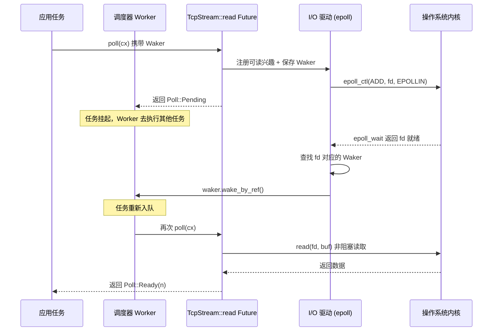

# Capítulo 1: O modelo mental da assincronia: o trio Future, Waker e executor

A programação assíncrona em Rust não é uma biblioteca, mas um protocolo em nível de linguagem. O motivo pelo qual o Tokio se tornou um runtime de nível de produção não é porque inventou o Future, mas porque implementa com precisão as condições de contorno de cada contrato desse protocolo. Este capítulo não se apressa em mergulhar no código do scheduler do Tokio, mas primeiro explica a fundo os limites de responsabilidade e o fluxo de controle reverso do "trio" — Future, Waker e Executor. Ao entender como esses três se encaixam, a montagem do Runtime, o agendamento work-stealing e o driver de I/O nos capítulos seguintes terão base para se sustentar.

# 1.1 Do bloqueio ao polling: por que Rust escolheu poll em vez de callbacks

## Modelo intuitivo

Imagine que você pediu em um restaurante um prato que precisa ser preparado na hora. A assincronia baseada em callback (como o estilo inicial do Node.js) equivale a você deixar seu número de telefone e, quando o chef terminar, ele**ligar ativamente para você**— o controle está nas mãos do chef, e seu código apenas responde passivamente. A assincronia baseada em polling (a escolha do Rust) equivale a você receber uma senha de retirada e**você mesmo decidir**quando ir à janela perguntar "já está pronto?": se não estiver, faça outra coisa; se estiver, retire.

Essa diferença parece pequena, mas determina a forma de todo o sistema. No modelo de callback, cada operação assíncrona precisa carregar uma closure de "o que fazer após concluir", closures aninhadas em camadas formam o callback hell, e cancelar a operação é extremamente difícil — você não consegue "revogar" um callback já registrado. No modelo de polling, o Future é apenas uma máquina de estados,`poll`é uma ação pura de consulta; se não for impulsionado, não consome recursos; cancelar é apenas drop, limpo e direto.

## O contrato central do modelo de polling

A biblioteca padrão do Rust define a trait`Future`com apenas dois elementos: um método`poll`e um tipo associado`Output`. O Tokio não redefine essa trait, mas reutiliza diretamente a implementação da biblioteca padrão. Isso fica claramente evidente no código-fonte:

```rust
// tokio/src/future/mod.rs
cfg_not_trace! {
    cfg_rt! {
        pub(crate) use std::future::Future;
    }
}
```

[FACT:tokio/src/future/mod.rs:24-28]

Este trecho de código revela um fato importante: quando o recurso`tracing`não está habilitado, o`Future`interno do Tokio é um alias de`std::future::Future`, sem qualquer wrapper. Somente quando`tracing`está habilitado é que`InstrumentedFuture`é substituído:

```rust
cfg_trace! {
    mod trace;
    #[allow(unused_imports)]
    pub(crate) use trace::InstrumentedFuture as Future;
}
```

[FACT:tokio/src/future/mod.rs:18-22]

> **[Design Inference & Architectural Trade-offs]**
> Esse design de "custo zero por padrão, instrumentação sob demanda" é a filosofia consistente do Tokio: o caminho crítico não introduz nenhuma camada extra de abstração, e a observabilidade é adicionada como recurso opcional.`InstrumentedFuture`A existência de

## mostra que a equipe do Tokio considera que o custo de instrumentação do tracing não deve ser arcado por todos os usuários.

`poll`As três restrições implícitas do contrato de poll`fn poll(self: Pin<&mut Self>, cx: &mut Context<'_>) -> Poll<Self::Output>`A assinatura do método

**é** `Pin<&mut Self>`. Essa assinatura esconde três contratos; violar qualquer um deles leva a comportamento indefinido ou erro lógico:

**Contrato um: Pin garante segurança de autorreferência.**significa que, uma vez que um Future é polled, seu endereço de memória não pode mais mudar. Isso ocorre porque blocos async, após compilação, geram uma máquina de estados contendo autorreferências — variáveis locais podem conter referências a outros campos dentro da mesma máquina de estados. Se a movimentação fosse permitida, essas referências ficariam pendentes.`poll`Contrato dois: Pending deve ter wake já registrado.`Poll::Pending`Quando`cx.waker()`O Waker foi obtido e guardado, ou já foi registado em alguma fonte de eventos. Caso contrário, o executor nunca saberá quando este Future pode voltar a ser poll, fazendo com que a tarefa fique permanentemente suspensa.

**Contrato três: após Ready, não deve voltar a ser poll.**Uma vez que`poll`retorna`Poll::Ready`, voltar a fazer poll do mesmo Future é um erro lógico (embora não cause UB, o comportamento é indefinido). O executor tem a responsabilidade de, após receber Ready, deixar de agendar essa tarefa.

Destes três contratos, o contrato dois é o ponto mais propenso a erros e é também a razão fundamental para a existência do Waker.

# 1.2 Waker: o veículo do fluxo de controlo inverso

## Modelo intuitivo

O Waker é o «vibrador de recolha de pedido» que o restaurante te dá. Não precisas de ficar junto à janela a perguntar repetidamente «já está?» — isso desperdiçaria o teu tempo. Só precisas de, na primeira vez que vais à janela, entregar o vibrador ao chef (registar o Waker) e depois fazer outras coisas tranquilamente. Quando o prato estiver pronto, o chef carrega no botão, o vibrador vibra (chama`wake`), recebes o sinal e voltas à janela para levantar o pedido (novo poll).

Sem o Waker, o executor teria apenas duas opções: ou fazer busy polling de todas as tarefas (desperdiçando CPU), ou nunca voltar a fazer poll das tarefas que já retornaram Pending (fazendo as tarefas morrer à fome). O Waker é o único mecanismo para quebrar este impasse.

## Layout de memória e design da vtable do Waker

O Waker é um tipo da biblioteca padrão, mas o seu design influenciou diretamente a estrutura de tarefas do Tokio.`Waker`é essencialmente um ponteiro gordo: uma`RawWaker`estrutura, contendo um ponteiro de dados e um ponteiro de vtable.

```rust
// 标准库中的定义（非 Tokio 源码，此处为背景说明）
pub struct RawWaker {
    data: *const (),
    vtable: &'static RawWakerVTable,
}

pub struct RawWakerVTable {
    clone: unsafe fn(*const ()) -> RawWaker,
    wake: unsafe fn(*const ()),
    wake_by_ref: unsafe fn(*const ()),
    drop: unsafe fn(*const ()),
}
```

> **[Design Inference & Architectural Trade-offs]**
> A genialidade deste design está em:`Waker`em si não se importa com o que «despertar» significa concretamente. É apenas um veículo para quatro ponteiros de função. O Tokio pode fornecer um Waker cuja`wake`função volta a empurrar a tarefa para a fila de agendamento; enquanto outro runtime (por exemplo, o`futures`crate`block_on`) pode fornecer uma implementação de Waker completamente diferente. Este padrão de «dados + vtable» permite que o Waker seja transmitido entre diferentes runtimes sem perder semântica.

`wake`A diferença entre`wake_by_ref`e`wake`é crucial:`wake_by_ref`consome a propriedade do Waker (após a chamada o Waker é dropado), enquanto`wake_by_ref`apenas empresta. O executor normalmente implementa`wake`como «marcar a tarefa como pronta e colocá-la na fila», enquanto

## , com base nisso, trata adicionalmente da decrementação da contagem de referências. Na estrutura de tarefas do Tokio, o ponteiro de dados do Waker aponta para o cabeçalho de contagem de referências da tarefa; cada clone incrementa a contagem, cada drop decrementa a contagem, e quando a contagem chega a zero a memória da tarefa é libertada.

Sequência completa do despertar



Copiar**O ponto-chave deste diagrama é:**O Waker é o único canal capaz de alcançar o Executor a partir do Reactor no sentido inverso

## . O Reactor não possui qualquer outra informação sobre a tarefa; só sabe «quando este fd estiver pronto, chamar este Waker». Este desacoplamento permite que o driver de I/O seja implementado independentemente do agendador, comunicando ambos apenas através da interface estreita do Waker.

Despertares falsos: a zona cinzenta do contrato

> Normally, tasks are scheduled only if they have been woken by calling `wake` on their waker. However, this is not guaranteed, and Tokio may schedule tasks that have not been woken under some circumstances.

[FACT:tokio/src/runtime/mod.rs:306-309]

> **[Design Inference & Architectural Trade-offs]**
> 〔Inferência de design e compromissos arquiteturais〕`poll`Isto significa que a implementação de

# deve ser capaz de tolerar a situação de «ser novamente pollado sem ter sido despertado». Um Future correto, após retornar Pending, mesmo que nenhum evento tenha ocorrido, ao ser novamente pollado deve retornar Pending em vez de entrar em panic ou produzir resultados errados. Esta restrição parece permissiva, mas na verdade impõe requisitos ao design da máquina de estados: não se pode assumir que «entre dois polls ocorre necessariamente um evento».

## 1.3 Executor: do Future ao encapsulamento em tarefa

Modelo intuitivo

O Executor é o despachante do restaurante. Tem na mão uma pilha de pedidos (fila de tarefas) e decide qual pedido é feito primeiro e por quem. Quando o vibrador de recolha vibra, ele volta a colocar o pedido correspondente na fila. Sem o despachante, os chefs não saberiam qual prato preparar nem quando mudar de trabalho.**Mas as responsabilidades do Executor vão muito além de «fazer poll do Future». Ele tem de resolver três problemas centrais:**Gestão do ciclo de vida das tarefas**(criação, agendamento, conclusão, cancelamento),**Garantia de justiça**(evitar que uma tarefa faça as outras morrer à fome),**Integração com fontes de recursos

## (como os eventos de I/O e de temporizador se transformam em despertares).

Layout de memória da tarefa: do Future à Task`tokio::spawn`Quando se chama`Task`, o Future passado não é colocado diretamente na fila. É encapsulado numa

```rust
/// Boundary value to prevent stack overflow caused by a large-sized
/// Future being placed in the stack.
pub(crate) const BOX_FUTURE_THRESHOLD: usize = if cfg!(debug_assertions)  {
    2048
} else {
    16384
};

pub(crate) struct AutoBox(std::marker::PhantomData);

impl AutoBox {
    /// `true` if a value of type `T` is larger than [`BOX_FUTURE_THRESHOLD`].
    pub(crate) const SHOULD_BOX: bool = std::mem::size_of::() > BOX_FUTURE_THRESHOLD;
}
```

[FACT:tokio/src/runtime/mod.rs:649-673]

Copiar`AutoBox`Este código resolve um problema muito concreto: se o Future for demasiado grande (mais de 16KB, 2KB em modo debug), inliná-lo diretamente na estrutura Task causaria stack overflow ou desperdício de memória.`SHOULD_BOX`decide se deve boxar o Future através da constante de tempo de compilação

> **[Design Inference & Architectural Trade-offs]**
> Nos comentários é especialmente realçado «usar constantes associadas em vez de em tempo de execução`if`」的原因：如果用运行时判断，编译器会为每个`T`同时实例化两条分支的代码（一条处理`T`，一条处理`Pin<Box<T>>`），导致代码膨胀。而用常量分支，单态化收集器会剪掉不可达的分支，只为实际使用的类型生成代码。这是一个典型的「用类型系统替代运行时判断」的优化。

## 调度公平性：31 与 61 的魔法数字

A documentação do agendador do Tokio define uma garantia formal de justiça:

> If the total number of tasks does not grow without bound, and no task is blocking the thread, then it is guaranteed that tasks are scheduled fairly.

[FACT:tokio/src/runtime/mod.rs:279-281]

A implementação dessa garantia depende de dois parâmetros-chave. Para o runtime current-thread:

> The runtime will prefer to choose the next task to schedule from the local queue, and will only pick a task from the global queue if the local queue is empty, or if it has picked a task from the local queue 31 times in a row.

[FACT:tokio/src/runtime/mod.rs:328-333]

> The runtime will check for new IO or timer events whenever there are no tasks ready to be scheduled, or when it has scheduled 61 tasks in a row.

[FACT:tokio/src/runtime/mod.rs:335-337]

Esses dois números (31 e 61) não foram escolhidos aleatoriamente. 31 é 2 elevado à 5ª potência menos 1, podendo ser verificado rapidamente com operações de bits; 61 serve para garantir que eventos de I/O não sejam indefinidamente adiados — mesmo que a fila de tarefas nunca esteja vazia, a cada 61 agendamentos é obrigatório verificar o I/O.

> **[Design Inference & Architectural Trade-offs]**
> Por que 31 e não 32? Porque o contador começa em 0, incrementa 1 a cada agendamento, e quando atinge 31 dispara a verificação da fila global. Usar`counter & 31 == 31`para verificar é mais eficiente que`counter % 32 == 0`(embora compiladores modernos otimizem automaticamente). A escolha de 61 é mais sutil: precisa ser grande o suficiente para evitar o custo frequente de chamadas de sistema epoll_wait, e pequeno o suficiente para garantir que a latência de I/O fique dentro de um intervalo aceitável.

## Otimização de slot LIFO no runtime multi-thread

O runtime multi-thread adiciona, além da justiça, uma otimização de desempenho — o slot LIFO:

> The multi thread runtime uses the lifo slot optimization: Whenever a task wakes up another task, the other task is added to the worker thread's lifo slot instead of being added to a queue.

[FACT:tokio/src/runtime/mod.rs:373-377]

A intuição por trás dessa otimização é: quando uma tarefa desperta outra, a tarefa despertada provavelmente tem dependência de dados com a tarefa atual (como no padrão produtor-consumidor). Colocá-la no slot LIFO permite executá-la imediatamente após a conclusão da tarefa atual, aproveitando dados quentes no cache da CPU.

Mas o slot LIFO tem um mecanismo antiabuso:

> if a worker thread uses the lifo slot three times in a row, it is temporarily disabled until the worker thread has scheduled a task that didn't come from the lifo slot.

[FACT:tokio/src/runtime/mod.rs:380-382]

> **[Design Inference & Architectural Trade-offs]**
> A regra de "desabilitar após três usos consecutivos" serve para evitar que duas tarefas se despertem mutuamente formando um livelock. Se a tarefa A desperta a tarefa B, e B desperta A, sem essa restrição o slot LIFO seria permanentemente ocupado por essas duas tarefas, e as demais nunca seriam agendadas. O limite de três dá às outras tarefas uma oportunidade de se inserir.

## Cancelamento de tarefas: a semântica real do abort

`JoinHandle::abort`O comportamento de muitas vezes é mal interpretado. A documentação deixa claro:

> Be aware that calls to `JoinHandle::abort` just schedule the task for cancellation, and will return before the cancellation has completed.

[FACT:tokio/src/task/mod.rs:146-148]

Isso significa que`abort`não é síncrono. Ele apenas define uma flag, e a tarefa verificará essa flag no próximo`.await`e se encerrará por conta própria. Se a tarefa estiver executando um trecho de código intensivo em CPU sem`.await`,`abort`não terá efeito imediato.

Mais sutil ainda:

> Note that aborting a task does not guarantee that it fails with a cancelled error, since it may complete normally first.

[FACT:tokio/src/task/mod.rs:134-138]

> **[Design Inference & Architectural Trade-offs]**
> A motivação de design dessa semântica é: o cancelamento é uma operação de "melhor esforço". O Tokio não força o encerramento da tarefa (Rust não possui mecanismo seguro de terminação forçada), mas solicita cooperativamente que a tarefa se encerre. Isso é consistente com o design de que tarefas`spawn_blocking`não são canceláveis — tarefas bloqueantes não têm`.await`pontos, não podendo verificar a flag de cancelamento.

# 1.4 Reflexões de design: fronteiras e custos do trio

## Por que Future não inclui Executor

A trait`Future`do Rust deliberadamente não inclui informações sobre "como se agendar". Essa é uma decisão de desacoplamento cuidadosamente pensada. Se Future soubesse seu Executor, então:

1. O mesmo Future não poderia ser executado em runtimes diferentes (por exemplo, migrar de Tokio para async-std)

2. Em testes, não seria possível usar um simples`block_on`para impulsionar

3. Combinadores (como`select!`、`join!`) não funcionariam entre runtimes

A existência do Waker serve justamente para, mantendo esse desacoplamento, ainda permitir que o Future notifique o Executor. O Waker é um "token de capacidade" — o Future só sabe que "posso chamar isto para solicitar reagendamento", mas não sabe como o agendamento ocorre concretamente.

## O custo do agendamento cooperativo

As tarefas do Tokio são cooperativas: a tarefa só cede o controle nos`.await`pontos. Isso significa:

> code that spends a long time without reaching an `.await` will prevent other tasks from running.

[FACT:tokio/src/lib.rs:178-179]

> **[Design Inference & Architectural Trade-offs]**
> Esse é o custo fundamental do agendamento cooperativo. O sistema operacional pode preemptar threads em qualquer fronteira de instrução, mas o Tokio só pode alternar tarefas nos`.await`pontos. Se uma tarefa executa um loop intensivo em CPU de 10 segundos sem`.await`no meio, todas as outras tarefas na mesma worker thread ficarão bloqueadas por 10 segundos. A estratégia do Tokio é oferecer`spawn_blocking`e`block_in_place`, transferindo esse tipo de trabalho para um pool de threads dedicado. Mas isso é responsabilidade do usuário; o runtime não consegue detectar automaticamente.

## Condições de contorno da garantia de justiça

A garantia de justiça do Tokio tem duas premissas: o número total de tarefas tem limite superior, e nenhuma tarefa bloqueia a thread. Essas duas condições são frequentemente violadas em ambientes de produção reais:

- Se tarefas continuamente criam novas tarefas sem reciclar, o número total de tarefas não tem limite superior, e a garantia de justiça falha
- Se alguma tarefa executa uma chamada de sistema bloqueante (como I/O de arquivo síncrono), ela bloqueia toda a worker thread

> **[Design Inference & Architectural Trade-offs]**
> É por isso que a documentação do Tokio enfatiza repetidamente "não execute operações bloqueantes em tarefas assíncronas". A garantia de justiça não é uma garantia rígida do runtime, mas uma garantia "sob a premissa de uso correto". O runtime não detecta violações, porque a própria detecção teria custo.

# 1.5 Resumo do capítulo

Este capítulo estabeleceu três pilares para entender o Tokio:

**Future é uma máquina de estados baseada em pull.** `poll`É uma ação de consulta pura, retorna`Pending`Deve ter o wake registrado ao retornar`Ready`Após retornar, não deve mais ser polled. Tokio reutiliza diretamente`std::future::Future`Sem wrapper adicional (a menos que tracing esteja habilitado).

**Waker é o único canal de controle de fluxo reverso.**Ele alcança independência de runtime através do design de «ponteiro de dados + vtable».`wake`Consome a ownership,`wake_by_ref`Apenas empresta. Despertares falsos são permitidos, o Future deve tolerá-los.

**O Executor é responsável pelo ciclo de vida, justiça e integração de recursos.**Ele encapsula o Future em uma Task, através de`AutoBox`Decide em tempo de compilação se faz boxing, através dos dois números mágicos 31/61 equilibra o agendamento da fila local e da fila global, e através do slot LIFO otimiza o desempenho em cenários de dependência de dados.

Esses três componentes são desacoplados através de interfaces estreitas: o Future só conhece`poll`O Waker só conhece`wake`O Executor só conhece «poll até Pending ou Ready». É precisamente esse desacoplamento que permite ao Tokio implementar recursos avançados como agendamento work-stealing, integração de driver de I/O e orçamento cooperativo sem modificar a definição do Future.

# Reflexão e autoavaliação deste capítulo

Q1: Se`AutoBox::SHOULD_BOX`A verificação de compile-time constante for alterada para runtime`if size_of::<T>() > THRESHOLD`Que impacto isso teria no artefato de compilação? Por que os comentários do Tokio enfatizam especialmente esse ponto?

**Análise de referência**: De acordo com[FACT:tokio/src/runtime/mod.rs:657-667]Os comentários de, se usar runtime`if`O compilador irá, para cada`T`Instanciar simultaneamente o código de ambos os ramos — um tratando`T`O caso de inlining direto, outro tratando`Pin<Box<T>>`O caso de. Isso significa que cada tipo de Future spawnado irá gerar duas cópias do código de condução de tarefa (task harness), causando a duplicação do tamanho do binário. Já usando a constante associada`SHOULD_BOX`Como ela é`T`Após ser determinado, torna-se uma constante de compile-time, o coletor de monomorfização irá cortar os ramos inalcançáveis, gerando código apenas para o caminho realmente utilizado. Esta é uma otimização típica de «substituir verificação em runtime pelo sistema de tipos», ao custo de`AutoBox`Deve ser uma struct genérica em vez de uma função comum.

Q2: Suponha que uma tarefa em`poll`Retornou`Pending`Mas esqueceu de registrar o Waker. No runtime current-thread e no runtime multi-thread, o que acontece com essa tarefa em cada caso? O Tokio tem algum mecanismo para detectar essa situação?

**Análise de referência**: De acordo com[FACT:tokio/src/runtime/mod.rs:306-309]O Tokio permite despertares falsos, o que significa que a tarefa pode ser reagendada sem ter sido acordada. Mas isso não significa que esquecer de registrar o Waker seja seguro. No runtime current-thread, se tanto a fila local quanto a fila global estiverem vazias, o runtime entra no estado`park`Aguardando eventos de I/O ou timer. Uma tarefa que esqueceu de registrar o Waker nunca será reenfileirada, causando suspensão permanente. No runtime multi-thread, a situação é semelhante, mas se outras tarefas continuarem acordando, essa tarefa pode ser reagendada acidentalmente devido a despertares falsos — mas isso não é confiável. O Tokio não tem mecanismo de detecção em runtime para descobrir «retornou Pending mas não registrou Waker», porque isso exigiria verificar após cada poll se o Waker foi usado, com custo muito alto. Essa é a responsabilidade do implementador do Future.

Q3: A regra do slot LIFO de «desabilitar após três usos consecutivos» é para prevenir qual cenário específico? Se essa restrição fosse removida, em qual padrão de dependência de tarefas outras tarefas sofreriam starvation?

**Análise de referência**: De acordo com[FACT:tokio/src/runtime/mod.rs:380-382]O slot LIFO é temporariamente desabilitado após três usos consecutivos, até que uma tarefa de origem não-LIFO seja agendada. O cenário que essa regra previne é: duas tarefas se acordando mutuamente formando um loop apertado. Por exemplo, a tarefa A após processar um lote de dados acorda a tarefa B, e a tarefa B após processar acorda imediatamente a tarefa A. Sem o limite de três vezes, A e B ocupariam o slot LIFO para sempre, a thread worker ficaria alternando infinitamente entre essas duas tarefas, e outras tarefas na fila local e global nunca teriam chance de executar. O limite de três vezes garante que após cada três rodadas de «acordar mutuamente», pelo menos uma outra tarefa seja agendada, quebrando o livelock. A escolha desse número é empírica: muito pequeno reduz o ganho da otimização LIFO, muito grande aumenta a latência das outras tarefas.

Até aqui, os limites de responsabilidade e o mecanismo de cooperação entre Future, Waker e Executor estão claros: o Future define a computação, o Waker é responsável pelo despertar, o Executor conduz a execução. Mas um componente individual não pode funcionar sozinho, eles devem ser montados em um ambiente de runtime unificado. No próximo capítulo, vamos rastrear a cadeia completa de montagem de Runtime::new e Builder::build, ver como o scheduler, o driver de I/O, o driver de tempo e o pool de threads bloqueantes são injetados na mesma instância de Runtime, e revelar as diferenças fundamentais entre as duas formas current_thread e multi_thread na fase de montagem.
