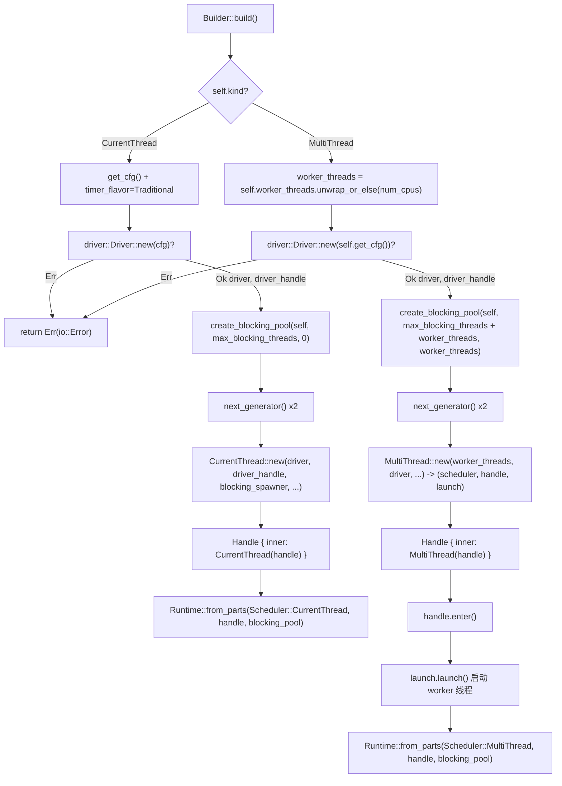

# Capítulo 2: A montagem do Runtime: Como o Builder monta drivers, scheduler e pool de threads

# De`Builder`para`Runtime`: uma jornada completa de montagem

No capítulo anterior, deixamos claras as fronteiras de responsabilidade entre Future, Waker e Executor. Mas um runtime realmente utilizável vai muito além de "um Executor" — ele também precisa de um loop de eventos de I/O, timers, um pool de threads bloqueantes, e esses componentes devem compartilhar o mesmo conjunto de handles e o mesmo ciclo de vida. Este capítulo rastreia`Builder::build`a cadeia completa de montagem, respondendo a uma questão central:**Quais componentes existem dentro de um`Runtime`e como eles são montados e compartilham handles**。

O ponto de entrada da montagem do Tokio é`Builder`. Ele em si é um contêiner puramente de configuração, todos os seus campos são "declarações de intenção", não possuindo nenhum recurso de runtime. A criação real de recursos ocorre quando`build()`é chamado.

## Modelo intuitivo: Builder é a "planta de reforma", Runtime é a "casa após a entrega"

`Builder`é como uma planta de reforma: você anota nela "quantos quartos (worker_threads)", "se precisa de encanamento (enable_io)", "se precisa de eletricidade (enable_time)", "limite de ajudantes terceirizados (max_blocking_threads)". A planta em si não produz nenhuma entidade. Somente quando`build()`é chamado, a equipe de construção segue a planta, construindo de fato os "quartos" — scheduler, driver, pool de threads — e entregando uma instância de`Runtime`.

Se não houvesse a camada`Builder`, o usuário teria que manualmente instanciar cada componente, conectar manualmente, tratar manualmente rollback de falhas — qualquer erro de ordem causaria handles pendentes ou vazamento de recursos.`Builder`O valor de**está em:**。

## Separar completamente "configuração" de "construção", permitindo que o processo de construção centralize validação, limpeza de falhas e compartilhamento de handles`Builder`Layout de memória:

`Builder`partição de campos de**Os campos de**：`kind`podem ser divididos em quatro grupos por responsabilidade. O primeiro grupo é`enable_io` / `enable_time`Forma e interruptores

[FACT:tokio/src/runtime/builder.rs:55-68]

```rust
pub struct Builder {
    kind: Kind,
    name: Option,
    enable_io: bool,
    nevents: usize,
    nevents_busy: Option,
    enable_time: bool,
    start_paused: bool,
    // ...
}
```

determina se o driver correspondente será criado.**Copiar**：`worker_threads`O segundo grupo é`Option<usize>`，`None`Parâmetros do pool de threads`max_blocking_threads`é

[FACT:tokio/src/runtime/builder.rs:73-79]

```rust
worker_threads: Option,
max_blocking_threads: usize,
```

padrão 512.**Copiar**O terceiro grupo é`Option<Arc<dyn Fn ...>>`Hooks de callback`Arc`, todos são`Box`. Note que usam`Config`。

[FACT:tokio/src/runtime/builder.rs:87-97]

```rust
pub(super) after_start: Option,
pub(super) before_stop: Option,
pub(super) before_park: Option,
pub(super) after_unpark: Option,
```

, porque esses callbacks precisam ser clonados para o**de cada thread worker**：`global_queue_interval`、`event_interval`、`disable_lifo_slot`、`seed_generator`。

[FACT:tokio/src/runtime/builder.rs:116-134]

```rust
pub(super) global_queue_interval: Option,
pub(super) event_interval: u32,
pub(super) disable_lifo_slot: bool,
pub(super) seed_generator: RngSeedGenerator,
```

O quarto grupo é`Kind`Heurísticas de agendamento e semente aleatória`Copy`Copiar

[FACT:tokio/src/runtime/builder.rs:261-265]

```rust
#[derive(Clone, Copy)]
pub(crate) enum Kind {
    CurrentThread,
    #[cfg(feature = "rt-multi-thread")]
    MultiThread,
}
```

`MultiThread`é um pequeno enum`rt-multi-thread`com apenas duas variantes.`rt`Copiar`Kind`A variante`build()`é controlada pela feature`match`. Isso significa que em builds com apenas a feature**habilitada,**。

## tem apenas uma variante,

`Builder::new`o`enable_io`de`enable_time`será otimizado pelo compilador para um único branch —`false`。

[FACT:tokio/src/runtime/builder.rs:309-318]

```rust
// I/O defaults to "off"
enable_io: false,
nevents: 1024,
nevents_busy: None,

// Time defaults to "off"
enable_time: false,

// The clock starts not-paused
start_paused: false,
```

> **[Design Inference & Architectural Trade-offs]**
> é o ponto de entrada comum para todas as construções. Ele define`#[tokio::main]`e`enable_all()`。

`enable_all()`ambos como

[FACT:tokio/src/runtime/builder.rs:398-419]

```rust
pub fn enable_all(&mut self) -> &mut Self {
    #[cfg(any(
        feature = "net",
        all(unix, feature = "process"),
        all(unix, feature = "signal")
    ))]
    self.enable_io();

    #[cfg(all(
        tokio_unstable,
        feature = "io-uring",
        // ...
    ))]
    self.enable_io_uring();

    #[cfg(feature = "time")]
    self.enable_time();

    self
}
```

〔Inferência de design e trade-offs arquiteturais〕`enable_io()`Essa escolha de padrão é intencional: criar o driver de I/O requer solicitar handles epoll/kqueue ao sistema operacional, criar o driver de time requer iniciar a infraestrutura de timers. Se o usuário só quer um scheduler de tarefas puramente computacional (por exemplo, executar lógica async intensiva em CPU), forçar a criação desses drivers é puro desperdício.`net`、`process`O macro`signal`é "pronto para uso" porque internamente chama`time` feature，`enable_all()`A implementação de

## revela como o feature gating afeta a semântica de "tudo ligado".`build()`Copiar

`build()`Note que`kind`só é chamado quando a feature

[FACT:tokio/src/runtime/builder.rs:1146-1152]

```rust
pub fn build(&mut self) -> io::Result {
    match &self.kind {
        Kind::CurrentThread => self.build_current_thread_runtime(),
        #[cfg(feature = "rt-multi-thread")]
        Kind::MultiThread => self.build_threaded_runtime(),
    }
}
```

está habilitada. Se o usuário habilitou apenas

### não abrirá o driver de I/O — porque simplesmente não há código de driver de I/O no artefato compilado.

`build_current_thread_runtime`Caminho principal de montagem:`build_current_thread_runtime_components`ramificação de`Runtime`。

[FACT:tokio/src/runtime/builder.rs:1725-1736]

```rust
fn build_current_thread_runtime(&mut self) -> io::Result {
    use crate::runtime::runtime::Scheduler;

    let (scheduler, handle, blocking_pool) =
        self.build_current_thread_runtime_components(None)?;

    Ok(Runtime::from_parts(
        Scheduler::CurrentThread(scheduler),
        handle,
        blocking_pool,
    ))
}
```

em dois caminhos completamente diferentes.`build_current_thread_runtime_components`Copiar

[FACT:tokio/src/runtime/builder.rs:1760-1766]

```rust
let mut cfg = self.get_cfg();
cfg.timer_flavor = TimerFlavor::Traditional;
let (driver, driver_handle) = driver::Driver::new(cfg)?;

// Blocking pool
let blocking_pool = blocking::create_blocking_pool(self, self.max_blocking_threads, 0);
let blocking_spawner = blocking_pool.spawner().clone();
```

Caminho um: montagem de current_thread`driver`em si é muito fino, ele delega para`(driver, driver_handle)`, e então empacota a tupla de três elementos retornada em`?`Copiar`build`A lógica real de montagem está em`Err`. Sua ordem de execução é crucial:

Copiar`spawner`O primeiro passo cria`spawner`, retornando um par de

. Note que aqui

[FACT:tokio/src/runtime/builder.rs:1768-1770]

```rust
let seed_generator_1 = self.seed_generator.next_generator();
let seed_generator_2 = self.seed_generator.next_generator();
```

> **[Design Inference & Architectural Trade-offs]**
> , e neste momento o blocking pool ainda não foi criado, não sendo necessária limpeza.`seed_generator_1`O segundo passo cria o blocking pool, e imediatamente extrai seu`Config`clonado. Este`select!`será injetado no scheduler, dando ao scheduler a capacidade de despachar tarefas bloqueantes para o pool de threads.`seed_generator_2`O terceiro passo gera dois geradores de semente RNG independentes.`CurrentThread::new`Copiar`rng_seed`〔Inferência de design e trade-offs arquiteturais〕

Por que são necessários dois?`Config`é colocado em`CurrentThread::new`。

[FACT:tokio/src/runtime/builder.rs:1776-1807]

```rust
let (scheduler, handle) = CurrentThread::new(
    driver,
    driver_handle,
    blocking_spawner,
    seed_generator_2,
    Config {
        before_park: self.before_park.clone(),
        after_unpark: self.after_unpark.clone(),
        // ...
        global_queue_interval: self.global_queue_interval,
        event_interval: self.event_interval,
        // ...
        enable_eager_driver_handoff: false,
        seed_generator: seed_generator_1,
        // ...
    },
    local_tid,
    self.name.clone(),
);
```

ordem de ramificação aleatória);`enable_eager_driver_handoff`é passado para`false`。

[FACT:tokio/src/runtime/builder.rs:1795-1798]

```rust
// This setting never makes sense for a current thread runtime,
// as it only configures how the I/O driver is stolen across
// workers.
enable_eager_driver_handoff: false,
```

> **[Design Inference & Architectural Trade-offs]**
> Este comentário aponta a essência dessa opção: ela descreve "como múltiplos workers disputam o driver de I/O", e current_thread tem apenas uma thread, não havendo disputa, portanto é forçado a desativar. Este é um exemplo típico de "semântica de item de configuração fortemente correlacionada com a forma" — o mesmo`Builder`campo tem significados diferentes em formas diferentes.

Por fim,`CurrentThread::new`o`handle`retornado por`scheduler::Handle::CurrentThread`é encapsulado em`Handle`。

[FACT:tokio/src/runtime/builder.rs:1816-1822]

```rust
let handle = Handle {
    inner: scheduler::Handle::CurrentThread(handle),
};

Ok((scheduler, handle, blocking_pool))
```

### público. Copiar

`build_threaded_runtime`Caminho dois: montagem do multi_thread

[FACT:tokio/src/runtime/builder.rs:2185]

```rust
let worker_threads = self.worker_threads.unwrap_or_else(num_cpus);
```

`None`é semelhante ao do current_thread, mas há três diferenças essenciais. A primeira é a determinação do número de threads worker:`num_cpus()`Copiar`Builder::new`Aqui

é resolvido como

[FACT:tokio/src/runtime/builder.rs:2189-2192]

```rust
let blocking_pool =
    blocking::create_blocking_pool(self, self.max_blocking_threads + worker_threads, worker_threads);
let blocking_spawner = blocking_pool.spawner().clone();
```

, porque a afinidade de CPU pode mudar entre os dois.`max_blocking_threads + worker_threads`A segunda diferença está no cálculo da capacidade do blocking pool:`self.max_blocking_threads`Copiar`0`。

[FACT:tokio/src/runtime/builder.rs:1765]

```rust
let blocking_pool = blocking::create_blocking_pool(self, self.max_blocking_threads, 0);
```

> **[Design Inference & Architectural Trade-offs]**
> e`max_blocking_threads`Copiar`worker_threads`〔Inferência de design e trade-offs arquiteturais〕`max_blocking_threads`Essa diferença revela a semântica da capacidade do blocking pool: em multi_thread,

é o limite de threads de bloqueio "adicionais", e o limite total real de threads deve somar o número de threads worker. O terceiro parâmetro (current_thread passa 0, multi_thread passa`MultiThread::new`) é provavelmente uma dica de "número de threads reservadas" ou "número de threads iniciais". Esse design mantém a semântica de

[FACT:tokio/src/runtime/builder.rs:2198-2226]

```rust
let (scheduler, handle, launch) = MultiThread::new(
    worker_threads,
    driver,
    driver_handle,
    blocking_spawner,
    seed_generator_2,
    Config {
        // ...
        enable_eager_driver_handoff: self.enable_eager_driver_handoff,
        // ...
    },
    self.timer_flavor,
    self.name.clone(),
);
```

A terceira diferença é que`launch`retorna uma tripla em vez de um par:`MultiThread::new`Copiar**O**extra é um "handle de inicialização".

[FACT:tokio/src/runtime/builder.rs:2228-2234]

```rust
let handle = Handle { inner: scheduler::Handle::MultiThread(handle) };

// Spawn the thread pool workers
let _enter = handle.enter();
launch.launch();

Ok(Runtime::from_parts(Scheduler::MultiThread(scheduler), handle, blocking_pool))
```

`handle.enter()`e não inicia imediatamente as threads worker`launch.launch()`. A inicialização real ocorre depois:

> **[Design Inference & Architectural Trade-offs]**
> O`handle`entra no contexto de runtime, e então`handle`realmente faz spawn de todas as threads worker. Esse design de duas fases, "construir primeiro, iniciar depois", é muito crítico.**〔Inferência de design e trade-offs arquiteturais〕`Handle`Por que não é possível iniciar enquanto se constrói? Porque assim que as threads worker iniciam, elas começam imediatamente a fazer poll de tarefas, e as tarefas podem referenciar**。`_enter`. Se

## ainda não tiver sido construído, ocorrerá uma race condition de "worker segurando um handle semiacabado". O design de duas fases garante:

Quando todas as threads worker iniciam, o`driver::Driver::new`completo já está pronto`Err`A guarda garante que as threads worker estejam no contexto de runtime correto no instante da inicialização.



## A figura abaixo reúne a ordem de montagem, os ramos críticos e os caminhos de erro das duas rotas. Observe que quando`Handle`falha, retorna diretamente

, e nesse momento o blocking pool ainda não foi criado.`Runtime`Copiar`scheduler`、`handle`、`blocking_pool`Compartilhamento de handle:`handle`Como

[FACT:tokio/src/runtime/scheduler/mod.rs:29-41]

```rust
#[derive(Debug, Clone)]
pub(crate) enum Handle {
    #[cfg(feature = "rt")]
    CurrentThread(Arc),

    #[cfg(feature = "rt-multi-thread")]
    MultiThread(Arc),

    #[cfg(not(feature = "rt"))]
    #[allow(dead_code)]
    Disabled,
}
```

Após a montagem,`Arc`mantém o trio`Handle`. Entre eles,`Handle`é o núcleo compartilhado. Seu interior é um enum:`match`Copiar`driver()`：

[FACT:tokio/src/runtime/scheduler/mod.rs:53-64]

```rust
pub(crate) fn driver(&self) -> &driver::Handle {
    match *self {
        #[cfg(feature = "rt")]
        Handle::CurrentThread(ref h) => &h.driver,

        #[cfg(feature = "rt-multi-thread")]
        Handle::MultiThread(ref h) => &h.driver,

        #[cfg(not(feature = "rt"))]
        Handle::Disabled => unreachable!(),
    }
}
```

`blocking_spawner()`. Isso significa que o clone de`match_flavor!`é um incremento barato de contagem de referências, podendo ser distribuído livremente para qualquer thread.

[FACT:tokio/src/runtime/scheduler/mod.rs:96-98]

```rust
pub(crate) fn blocking_spawner(&self) -> &blocking::Spawner {
    match_flavor!(self, Handle(h) => &h.blocking_spawner)
}
```

. Por exemplo`driver()`Copiar`match`usa a macro`match_flavor!`para eliminar repetição:`match`Copiar

Essa macro expande para`Handle`como o`scheduler::Handle`acima. Seu valor está em: ao adicionar um novo acessador que precisa ser despachado por forma, basta uma linha de

[FACT:tokio/src/runtime/handle.rs:13-15]

```rust
pub struct Handle {
    pub(crate) inner: scheduler::Handle,
}
```

.`Handle`O`spawn`público é um wrapper fino do`block_on`。`spawn`interno:`AutoBox`Copiar

[FACT:tokio/src/runtime/handle.rs:197-208]

```rust
pub fn spawn(&self, future: F) -> JoinHandle
where
    F: Future + Send + 'static,
    F::Output: Send + 'static,
{
    let fut_size = mem::size_of::();
    if AutoBox::::SHOULD_BOX {
        self.spawn_named(Box::pin(future), SpawnMeta::new_unnamed(fut_size))
    } else {
        self.spawn_named(future, SpawnMeta::new_unnamed(fut_size))
    }
}
```

`AutoBox::<F>::SHOULD_BOX`que o usuário recebe pode ser clonado entre threads, pode`size_of::<F>()`, pode

[FACT:tokio/src/runtime/mod.rs:668-673]

```rust
pub(crate) struct AutoBox(std::marker::PhantomData);

impl AutoBox {
    pub(crate) const SHOULD_BOX: bool = std::mem::size_of::() > BOX_FUTURE_THRESHOLD;
}
```

> **[Design Inference & Architectural Trade-offs]**
> :`if`Copiar`spawn_named`é uma constante associada, obtida pela comparação de`F`com um limiar.`Pin<Box<F>>`Copiar

## 〔Inferência de design e trade-offs arquiteturais〕

**O comentário explica por que usar uma constante associada em vez de**em tempo de execução: se fosse uma verificação em tempo de execução,`driver -> blocking_pool -> scheduler`seria monomorfizado duas vezes (uma para

**, uma para`local_tid`), fazendo com que cada future de spawn gerasse duas cópias do task harness, dobrando o tamanho do código. Com o ramo constante, o coletor de monomorfização mantém apenas o ramo realmente alcançado.**。`build_local`Reflexões de design: ordem de montagem, recuperação de erros e armadilhas em produção`build_current_thread_local_runtime`A ordem é o contrato

[FACT:tokio/src/runtime/builder.rs:1738-1751]

```rust
fn build_current_thread_local_runtime(&mut self) -> io::Result {
    use crate::runtime::local_runtime::LocalRuntimeScheduler;

    let tid = std::thread::current().id();

    let (scheduler, handle, blocking_pool) =
        self.build_current_thread_runtime_components(Some(tid))?;

    Ok(LocalRuntime::from_parts(
        LocalRuntimeScheduler::CurrentThread(scheduler),
        handle,
        blocking_pool,
    ))
}
```

não é arbitrária. O driver é criado primeiro, porque é a única etapa que pode falhar por recursos insuficientes do SO e que, após falhar, não exige limpeza de outros componentes. O blocking_pool vem depois do driver e antes do scheduler, porque o scheduler precisa do blocking_spawner. Se a criação do blocking_pool falhar (na prática, é improvável que falhe), o driver será limpo automaticamente via drop.`tid`O ramo`Handle`de current_thread`can_spawn_local_on_local_runtime`segue

[FACT:tokio/src/runtime/scheduler/mod.rs:140-147]

```rust
pub(crate) fn can_spawn_local_on_local_runtime(&self) -> bool {
    match self {
        Handle::CurrentThread(h) => h.local_tid.is_some_and(|x| std::thread::current().id() == x),

        #[cfg(feature = "rt-multi-thread")]
        Handle::MultiThread(_) => false,
    }
}
```

> **[Design Inference & Architectural Trade-offs]**
> Esse`LocalRuntime`é armazenado em`!Send`, e posteriormente`local_tid`o usa para validar "se spawn_local está sendo chamado na thread owner":`!Send`Copiar

**〔Inferência de design e trade-offs arquiteturais〕`worker_threads(0)`Esta é a base da segurança de**。`worker_threads`:

[FACT:tokio/src/runtime/builder.rs:582-586]

```rust
pub fn worker_threads(&mut self, val: usize) -> &mut Self {
    assert!(val > 0, "Worker threads cannot be set to 0");
    self.worker_threads = Some(val);
    self
}
```

Esta asserção falha na fase de configuração, em vez de esperar pelo build. A vantagem é que o erro é localizado mais cedo, a desvantagem é que, se o número de threads vier de um valor dinâmico do ficheiro de configuração, o utilizador tem de o validar antes de chamar.

**Armadilha de produção dois:`max_blocking_threads`Definir demasiado pequeno causa suspensão**. A documentação avisa explicitamente:

[FACT:tokio/src/runtime/builder.rs:600-601]

```rust
/// It's recommended to not set this limit too low in order to avoid hanging on operations
/// requiring [`spawn_blocking`].
```

> **[Design Inference & Architectural Trade-offs]**
> Porque a fila do blocking pool não tem backpressure — as tarefas acumulam-se até haver uma thread disponível. Se todas as threads bloqueantes estiverem à espera de uma operação que «requer uma nova thread bloqueante para ser concluída», ocorre deadlock. A frase da documentação «the queue does not apply any backpressure, it could potentially grow unbounded» é precisamente uma nota sobre este risco.

**Armadilha de produção três:`UnhandledPanic::ShutdownRuntime`Só suporta current_thread**。

[FACT:tokio/src/runtime/builder.rs:1374-1381]

```rust
pub fn unhandled_panic(&mut self, behavior: UnhandledPanic) -> &mut Self {
    if !matches!(self.kind, Kind::CurrentThread) && matches!(behavior, UnhandledPanic::ShutdownRuntime) {
        panic!("UnhandledPanic::ShutdownRuntime is only supported in current thread runtime");
    }

    self.unhandled_panic = behavior;
    self
}
```

> **[Design Inference & Architectural Trade-offs]**
> A razão desta limitação é: em multi_thread, «encerrar imediatamente o runtime» exige coordenar a paragem de todas as worker threads, o que tem elevada complexidade de implementação e semântica ambígua (o que acontece às outras tarefas que estão a ser poll?). current_thread tem apenas uma thread, pelo que a semântica de encerramento é clara.

## Resumo do capítulo

Este capítulo seguiu`Builder::build`a cadeia completa de montagem. Conclusões principais:

1. `Builder`é um contentor puro de configuração,`build()`é que cria recursos. A ordem de montagem`driver -> blocking_pool -> scheduler`é determinada pela necessidade de recuperação de erros.

2. A diferença entre current_thread e multi_thread não se resume ao número de threads: o cálculo da capacidade do blocking pool é diferente (`max_blocking_threads` vs `max_blocking_threads + worker_threads`), multi_thread tem mais um`launch`arranque em duas fases,`enable_eager_driver_handoff`é forçado a encerrar em current_thread.

3. `Handle`é o núcleo partilhado entre componentes, internamente usa`Arc`para envolver handles específicos da forma, acedidos uniformemente através de`match`ou`match_flavor!`macros.

4. `AutoBox`usa constantes associadas para decidir em tempo de compilação se o future é boxed, evitando duplicar o tamanho do código.

5. `local_tid`é`LocalRuntime`o ponto de verificação em runtime da segurança.

No próximo capítulo, entraremos no ciclo de vida das tarefas:`spawn`como transformar um Future numa entidade agendável,`JoinHandle`como interagir com a máquina de estados da tarefa, e as transições de estado da tarefa entre`PENDING` / `RUNNING` / `COMPLETE`.

# Reflexão e autoavaliação deste capítulo

Q1: Se alterar em`build_threaded_runtime`o parâmetro de capacidade de`create_blocking_pool`de`self.max_blocking_threads + worker_threads`para`self.max_blocking_threads`, em que cenários é que isto causaria inanição de tarefas bloqueantes? Porque é que o caminho current_thread pode passar`self.max_blocking_threads`？

**Análise de referência**: De acordo com[FACT:tokio/src/runtime/builder.rs:2189-2192], o caminho multi_thread passa`self.max_blocking_threads + worker_threads`, enquanto o caminho current_thread[FACT:tokio/src/runtime/builder.rs:1765]passa`self.max_blocking_threads`. A raiz da diferença está em que: em multi_thread, as próprias worker threads também executam tarefas bloqueantes (por exemplo,`block_in_place`converte temporariamente uma worker thread em thread bloqueante), pelo que o orçamento total de threads bloqueantes tem de incluir o número de worker threads. Se se alterar para passar apenas`self.max_blocking_threads`, quando`max_blocking_threads`for definido como pequeno (por exemplo, 1) e já houver worker threads a ocupar o orçamento em`block_in_place`, as novas tarefas`spawn_blocking`ficarão sem threads disponíveis, acumulando-se numa fila sem backpressure, o que fará com que as tarefas async que dependem destas tarefas bloqueantes fiquem permanentemente suspensas. current_thread tem apenas uma thread e não suporta a semântica de conversão de worker de`block_in_place`, pelo que não é necessário somar o número de workers.

Q2: `MultiThread::new`devolve`launch`o handle, quem realmente inicia as worker threads é`launch.launch()`. Se remover`handle.enter()`esta linha e chamar diretamente`launch.launch()`, o que aconteceria?

**Análise de referência**: De acordo com[FACT:tokio/src/runtime/builder.rs:2230-2232], antes do arranque há`let _enter = handle.enter();`e só depois`launch.launch()`。`handle.enter()`. A função de`Handle::current()`、`tokio::spawn`é definir o contexto thread-local, fazendo com que a thread atual «pareça» estar dentro do runtime. As worker threads, após o arranque, começam imediatamente a fazer poll de tarefas, e o código das tarefas pode chamar`_enter`e outras APIs que dependem do contexto. Se remover`launch`, a definição de contexto no instante de arranque da worker thread pode ficar incompleta (dependendo de`Handle::current()`se define internamente), e no pior caso o código de inicialização executado na worker thread ao chamar`CONTEXT_MISSING_ERROR`entrará em panic (`launch`). Mesmo que`_enter`defina internamente o contexto para cada worker,

Q3: `AutoBox::<F>::SHOULD_BOX`também garante que «a própria ação de arranque» ocorre no contexto correto, evitando condições de corrida durante o arranque.`if size_of::<F>() > THRESHOLD`usa constantes associadas em vez de

**em runtime. Suponha que se alterava para verificação em runtime; além de duplicar o tamanho do código, em que situações causaria degradação de desempenho?**Análise de referência[FACT:tokio/src/runtime/mod.rs:657-673]: De acordo com`if`os comentários de`spawn_named`, o`T`em runtime faria com que`T`monomorfizasse cada`Pin<Box<T>>`duas vezes (`Pin<Box<T>>`e`size_of`uma vez cada). Além de duplicar o tamanho do código, a degradação de desempenho manifesta-se em: 1) maior pressão na cache de instruções (i-cache), porque ambos os conjuntos de código harness têm de residir; 2) o compilador não consegue otimizar «na prática só segue um ramo», e embora a previsão de ramos em runtime seja geralmente precisa, o próprio ramo e as diferenças de alocação de registos entre os dois conjuntos de código acumulam-se; 3) mais subtil ainda,
