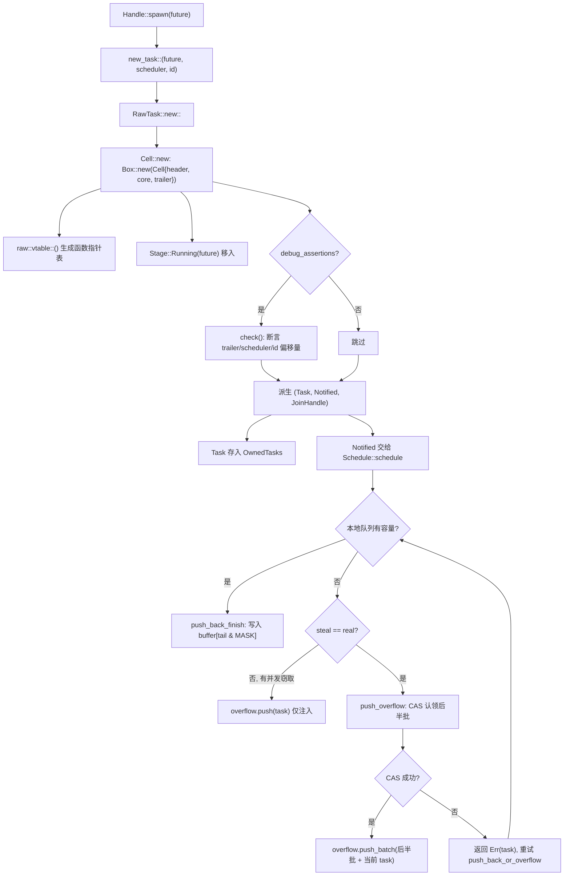
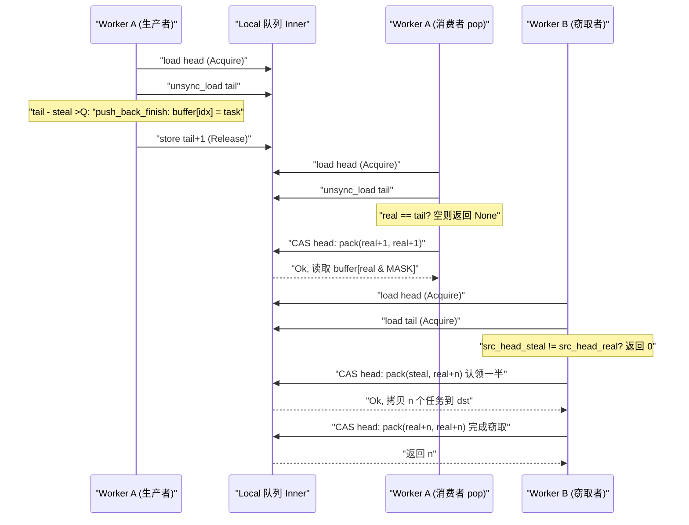

# Capítulo 3: A vida de uma tarefa (Parte 1): como spawn transforma um Future em uma entidade agendável

No capítulo anterior, concluímos a montagem do Runtime: o driver de I/O, o driver de tempo, o blocking pool e o agendador são injetados na mesma instância`Runtime`de`Handle`tornando-se um handle compartilhado para acessar esses componentes entre threads. Mas o runtime montado ainda é apenas um invólucro vazio — ele possui o motor para impulsionar tarefas, mas não tem nenhuma tarefa para impulsionar. A questão que este capítulo responde é exatamente: quando você digita`tokio::spawn(async { ... })`naquele momento, o bloco`async`o que exatamente ele passou para se transformar de um código Rust comum em uma entidade "que pode ser assumida pelo agendador, despertada e aguardada com join". Esta é a primeira metade de "A vida de uma tarefa", focamos no nascimento: partindo de`Handle::spawn`atravessando`new_task`a alocação de contagem de referências, chegando ao`Cell<T, S>`layout de memória, e finalmente vendo como a tarefa é entregue à fila local de algum worker ou à fila de injeção global. A segunda metade (Capítulo 4) só então entrará no loop de agendamento e no ciclo fechado poll/wake.

# 3.1 Future não é tarefa: o que exatamente um spawn cria

## Modelo intuitivo

Pense em`Future`como uma "receita", e pense na tarefa como "um prato sendo cozinhado na cozinha". A receita em si é estática, copiável e não possui nenhum estado de execução; somente quando a cozinha (o agendador) decide "agora faça este prato", atribui a ele um fogão (worker), um número de pedido (TaskId) e uma saída de prato (JoinHandle), é que ele se torna um "prato em produção". Sem essa camada de empacotamento, o agendador não teria como saber "em que passo este prato está", "quem está esperando por ele", "quem notificar quando estiver pronto" — ele só veria uma receita, incapaz de gerenciar.

## Estrutura de dados e layout de memória

Tokio usa`Task<S>`para representar "uma referência de tarefa possuída pelo runtime", que é um wrapper transparente sobre`RawTask`:

```rust
#[repr(transparent)]
pub(crate) struct Task {
    raw: RawTask,
    _p: PhantomData,
}
```

[FACT:tokio/src/runtime/task/mod.rs:233-238]

`#[repr(transparent)]`significa que`Task<S>`e`RawTask`são completamente idênticos em memória, sem overhead adicional.`PhantomData<S>`é apenas uma marcação de tipo em tempo de compilação, marcando a qual tipo de agendador esta tarefa pertence`S`。

O que realmente carrega todo o estado da tarefa é`Cell<T, S>`, cujo layout é a pedra fundamental de todo o módulo de tarefas:

```rust
#[repr(C)]
pub(super) struct Cell {
    pub(super) header: Header,
    pub(super) core: Core,
    pub(super) trailer: Trailer,
}
```

[FACT:tokio/src/runtime/task/core.rs:126-136]

Os três campos são organizados em ordem "quente-morno-frio".`Header`são dados quentes (acessados a cada agendamento, a cada transição de estado),`Core`são dados mornos (acessados durante o poll),`Trailer`são dados frios (acessados apenas na criação e destruição). O comentário afirma explicitamente:`Header`deve ser o primeiro campo, porque a estrutura da tarefa será simultaneamente referenciada por`*mut Cell`e`*mut Header`Mais crucial é o alinhamento de linha de cache.[FACT:tokio/src/runtime/task/core.rs:37-43]。

possui uma longa série de`Cell`anexada, escolhendo o número de bytes de alinhamento de acordo com a arquitetura alvo: x86_64/aarch64/powerpc64 usam 128 bytes, arm/mips/sparc/hexagon usam 32 bytes, m68k usa 16 bytes, s390x usa 256 bytes, e o restante usa 64 bytes por padrão`#[cfg_attr(..., repr(align(...)))]`. O comentário explica por que x86_64 deve usar 128 em vez de 64: a partir do Intel Sandy Bridge, o prefetcher espacial busca de uma vez[FACT:tokio/src/runtime/task/core.rs:64-125]pares**de linhas de cache de 64 bytes, então é necessário alinhar a 128 bytes para evitar falso compartilhamento**〔Inferência de design e trade-offs arquiteturais〕[FACT:tokio/src/runtime/task/core.rs:45-53]。

> **[Design Inference & Architectural Trade-offs]**
> ) são lidos e escritos com alta frequência por múltiplas threads worker — uma thread define o bit RUNNING durante o poll, outra thread lê o bit NOTIFIED durante o wake — se os bits de estado de duas tarefas caírem na mesma linha de cache, cada transição de estado disparará um vaivém da linha de cache entre os núcleos (cache line ping-pong), com perda de desempenho muito maior que o desperdício de memória. Tokio escolhe trocar espaço por tempo.`state`é restringido a 8 tamanhos de ponteiro ou menos:

`Header`Copiar

```rust
#[test]
#[cfg(not(loom))]
fn header_lte_cache_line() {
    assert!(std::mem::size_of::() ());
}
```

[FACT:tokio/src/runtime/task/core.rs:591-593]

não exceda 64 bytes (8 × 8), podendo assim caber completamente em uma linha em arquiteturas com linha de cache de 64 bytes.`Header`Os campos de`Header`incluem:`state: State`(bits de estado atômicos),`queue_next: UnsafeCell<Option<NonNull<Header>>>`(ponteiro de lista encadeada da fila de injeção),`vtable: &'static Vtable`(tabela de ponteiros de função),`owner_id: UnsafeCell<Option<NonZeroU64>>`(ID da lista de`OwnedTasks`à qual pertence),`scheduled_at: UnsafeCell<ScheduleLatencyInstant>`(medição de latência de agendamento)[FACT:tokio/src/runtime/task/core.rs:169-198]。

`Core<T, S>`mantém o handle do agendador`scheduler: S`, o ID da tarefa`task_id: Id`, e o mais central`stage: CoreStage<T>` [FACT:tokio/src/runtime/task/core.rs:148-165]。`Stage`é um enum de três estados:

```rust
#[repr(C)]
pub(super) enum Stage {
    Running(T),
    Finished(super::Result),
    Consumed,
}
```

[FACT:tokio/src/runtime/task/core.rs:225-229]

Isto é exatamente a chave para "Future e Output reutilizarem o mesmo bloco de memória": durante a execução da tarefa`Stage::Running`mantém o future, após a conclusão é substituído no local por`Stage::Finished(output)`, e após ser retirado por`JoinHandle`torna-se`Stage::Consumed`。`#[repr(C)]`O comentário aponta para uma issue do Miri, indicando que este layout tem requisitos rígidos de correção para código unsafe[FACT:tokio/src/runtime/task/core.rs:225-229]。

`Trailer`armazena dados frios:`owned: linked_list::Pointers<Header>`（`OwnedTasks`ponteiro de lista encadeada),`waker: UnsafeCell<Option<Waker>>`(waker do consumidor aguardando a conclusão da tarefa),`hooks: TaskHarnessScheduleHooks` [FACT:tokio/src/runtime/task/core.rs:205-213]。

## Passo a Passo: do spawn à entrada na fila

Vamos inserir um cenário concreto: em um runtime multi_thread, a thread worker A executa`tokio::spawn(async { 42 })`。

**Primeiro passo: construir o trio de tarefas.** `new_task`é a única entrada para o nascimento de uma tarefa:

```rust
fn new_task(
    task: T,
    scheduler: S,
    id: Id,
    spawned_at: SpawnLocation,
) -> (Task, Notified, JoinHandle)
```

[FACT:tokio/src/runtime/task/mod.rs:336-346]

Ele chama`RawTask::new::<T, S>`para alocar`Cell`, e então deriva três referências a partir do mesmo ponteiro`raw`:`Task`(referência owned, geralmente colocada imediatamente em`OwnedTasks`）、`Notified`(referência de notificação, entregue ao agendador),`JoinHandle`(handle de leitura de resultado)[FACT:tokio/src/runtime/task/mod.rs:347-363]. Observe que os três compartilham o mesmo`raw`, cada um mantendo uma contagem de referências.

**Segundo passo: alocar`Cell`e escrever o estado inicial.** `Cell::new`Alocar toda a estrutura no heap:

```rust
let result = Box::new(Cell {
    trailer: Trailer::new(scheduler.hooks()),
    header: new_header(state, vtable, ...),
    core: Core {
        scheduler,
        stage: CoreStage {
            stage: UnsafeCell::new(Stage::Running(future)),
        },
        task_id,
        ...
    },
});
```

[FACT:tokio/src/runtime/task/core.rs:261-278]

`vtable`gerado por`raw::vtable::<T, S>()`, é uma tabela de ponteiros de função monomorfizada para`T`e`S`específicos[FACT:tokio/src/runtime/task/core.rs:260]. O future é movido diretamente para`Stage::Running`, sem boxing adicional.

**Terceiro passo: asserção de debug para verificar o layout.**Sob`debug_assertions`,`Cell::new`chamará a`check`função, usando`Header::get_trailer`、`Header::get_scheduler`、`Header::get_id_ptr`e outras operações de ponteiro baseadas em deslocamentos de vtable, para afirmar uma a uma que "o endereço do campo obtido via header" e "o endereço real do campo" são consistentes[FACT:tokio/src/runtime/task/core.rs:280-321]. Esta é uma autoverificação em tempo de execução da correção dos deslocamentos da vtable.

**Quarto passo: despachar para o agendador.**O agendador, após receber`Notified<S>`, chama`Schedule::schedule` [FACT:tokio/src/runtime/task/mod.rs:315]. Sob multi_thread, isso percorrerá`push_back_or_overflow`, empurrando a tarefa para a fila local do worker atual, transbordando para a fila de injeção quando a fila estiver cheia.

A figura abaixo descreve o fluxo de controle e as ramificações de`new_task`até o enfileiramento:



Esta figura revela vários ramos críticos: as asserções de debug só têm efeito em builds de depuração; quando a fila local está cheia, não há transbordamento direto, mas primeiro verifica-se se há ladrões concorrentes (`steal != real`), e se houver, apenas a tarefa atual é empurrada para a fila de injeção, pois o espaço liberado pelos ladrões logo estará disponível.

## Reflexão de design: por que três referências em vez de uma

`new_task`retorna três referências, em vez de uma. Este é o núcleo do design de contagem de referências:`Task`representa "o runtime possui esta tarefa",`Notified`representa "esta tarefa foi notificada, aguardando agendamento",`JoinHandle`representa "alguém se importa com seu resultado". Os três têm ciclos de vida independentes —`JoinHandle`pode ser dropado (a tarefa continua executando, o resultado é descartado),`Notified`desaparece após o poll,`Task`é liberado após a tarefa completar e ser removida de`OwnedTasks`. Se houvesse apenas uma referência, não seria possível expressar o estado "a tarefa ainda está rodando mas ninguém faz join".

`UnownedTask`é outro ramo importante: ele mantém**duas**contagens de referências, usadas para tarefas blocking (não armazenadas em`OwnedTasks`）[FACT:tokio/src/runtime/task/mod.rs:286-295]。`unowned`A função`mem::forget(task)`através de`mem::forget(notified)`e`UnownedTask` [FACT:tokio/src/runtime/task/mod.rs:388-397]mescla as duas referências em`OwnedTasks`. A motivação de design para "duas referências" é: tarefas blocking não têm uma

# lista para manter a referência owned, então é necessária uma contagem de referência extra para garantir que a tarefa não seja liberada durante a execução.

## 3.2 Bits de estado: como um usize codifica todo o ciclo de vida de uma tarefa

Modelo intuitivo**Imagine o estado da tarefa como um "relatório de exame médico", com várias caixas de seleção independentes: está sendo pollada, foi concluída, foi notificada, foi cancelada, alguém fez join. Tokio não usa múltiplos campos booleanos, mas comprime esses bits de seleção em`AtomicUsize`**um

## . Assim, cada transição de estado requer apenas um CAS, em vez de múltiplos locks. Sem esse design, as transições de estado da tarefa se tornariam aninhamentos de múltiplos locks, e o risco de deadlock e a sobrecarga disparariam.

`State`Layout de bits[FACT:tokio/src/runtime/task/mod.rs:32-53]：

- `RUNNING`Os campos de bits de**estão completamente definidos na documentação do módulo** [FACT:tokio/src/runtime/task/mod.rs:37-38]。
- `COMPLETE`: se a tarefa está sendo pollada ou cancelada.`RUNNING`Este bit também serve como o lock da tarefa[FACT:tokio/src/runtime/task/mod.rs:40-41]。
- `NOTIFIED`: o future foi completamente concluído e dropado. Uma vez definido, nunca é limpo, e nunca é definido simultaneamente com`Notified`: se existe atualmente um[FACT:tokio/src/runtime/task/mod.rs:43]。
- `CANCELLED`objeto[FACT:tokio/src/runtime/task/mod.rs:45-46]。
- `JOIN_INTEREST`: a tarefa deve ser cancelada o mais rápido possível`JoinHandle` [FACT:tokio/src/runtime/task/mod.rs:48]。
- `JOIN_WAKER`: existe[FACT:tokio/src/runtime/task/mod.rs:50-51]。

: bit de controle de acesso como join handle waker[FACT:tokio/src/runtime/task/mod.rs:53]。

`RUNNING`Os bits restantes são usados para contagem de referências`RUNNING`O fato de[FACT:tokio/src/runtime/task/mod.rs:130-133]bit servir como lock merece ser expandido. A seção Safety da documentação do módulo aponta: qualquer acesso mutável ao future deve ocorrer após modificar`RUNNING`bit para obter o lock, garantindo assim acesso exclusivo

## . Isso significa que, ao pollar uma tarefa, a thread primeiro faz CAS para definir

`JOIN_WAKER`, e em caso de sucesso obtém acesso exclusivo ao future; se falhar, significa que outra thread está pollando, e este poll retorna diretamente. Isso funde "exclusão mútua do poll" e "transição de estado" em uma única operação atômica, evitando um mutex separado.`waker`Protocolo de controle de acesso do JOIN_WAKER`Trailer`O bit**é a parte mais engenhosa de toda a máquina de estados. Ele resolve o problema de:**campo (em`JoinHandle`) ser acessado concorrentemente por duas threads — o runtime, ao completar a tarefa,**lê**para acordar o join,[FACT:tokio/src/runtime/task/mod.rs:75-120]：

1. `JOIN_WAKER`ao pollar

escreve`JoinHandle`para registrar o waker. A documentação do módulo fornece 7 regras

inicialmente é 0.`JoinHandle`2. Quando é 0,

tem acesso exclusivo (mutável) ao campo waker.`COMPLETE`3. Quando é 1,

5. `JoinHandle`tem apenas acesso compartilhado (somente leitura).`JOIN_WAKER`4. Quando é 1 e`JOIN_WAKER`é 1, o runtime tem acesso compartilhado (somente leitura) ao campo waker.

6. `JoinHandle`Para escrever o waker, é necessário: (i) definir com sucesso`COMPLETE`para 0 para obter acesso exclusivo, (ii) escrever o waker, (iii) definir com sucesso`JOIN_WAKER`para 1.`COMPLETE`só pode modificar

quando`JOIN_INTEREST`é 0; o runtime só pode modificar quando`COMPLETE`é 1.

7. Se`COMPLETE`é 0 e[FACT:tokio/src/runtime/task/mod.rs:110-120]é 1, o runtime tem acesso exclusivo ao campo waker (para dropar o waker).

## A regra 6 implica uma corrida: o passo (i) ou (iii) pode falhar. Se (i) falhar, desiste-se de escrever o waker; se (iii) falhar (outra thread definiu

`Task`nesse meio tempo), então o campo waker é limpo`UnownedTask`o drop decrementa duas vezes:

```rust
impl Drop for Task {
    fn drop(&mut self) {
        if self.header().state.ref_dec() {
            self.raw.dealloc();
        }
    }
}
```

[FACT:tokio/src/runtime/task/mod.rs:580-586]

```rust
impl Drop for UnownedTask {
    fn drop(&mut self) {
        if self.raw.header().state.ref_dec_twice() {
            self.raw.dealloc();
        }
    }
}
```

[FACT:tokio/src/runtime/task/mod.rs:590-596]

`ref_dec`retorna`true`indica que esta é a última referência, e só então libera de fato a`Cell`memória.`ref_dec_twice`é`UnownedTask`a manifestação direta de manter duas contagens.

## Reflexão de design: por que o bit de estado e a contagem de referências compartilham um único atômico

> **[Design Inference & Architectural Trade-offs]**
> Colocar o bit de estado e a contagem de referências no mesmo`AtomicUsize`serve para que as duas ações — "decrementar a contagem de referências" e "definir o bit de estado" — possam ser concluídas em**um único CAS**A documentação do módulo, no comentário de`Schedule::release`menciona explicitamente: "o módulo de tarefas processará em lote o ref-dec e a definição de outras opções"[FACT:tokio/src/runtime/task/mod.rs:302-304]. Se o bit de estado e a contagem de referências estivessem em duas variáveis atômicas separadas, então surgiria uma janela entre "liberar a última referência" e "marcar como concluído", exigindo sincronização adicional. Após a fusão,`ref_dec`é possível concluir atomicamente "decrementar a contagem + verificar se chegou a zero", evitando problemas do tipo ABA.

# 3.3 JoinHandle: como o resultado é devolvido através da fronteira da tarefa

## Modelo intuitivo

`JoinHandle`é como o "comprovante de retirada" que o restaurante lhe dá. Quando a tarefa (cozinha) termina, ela coloca o prato (output) na janela de entrega (`Stage::Finished`), e então aciona seu pager (waker). Você usa o comprovante para retirar; o comprovante em si não contém o prato, é apenas um ponteiro para a janela de entrega. Se você perder o comprovante (drop`JoinHandle`), o prato será descartado diretamente (output é dropado), mas a cozinha não para por causa disso.

## Estrutura de dados

`JoinHandle<T>`também é um wrapper transparente sobre`RawTask`:

```rust
pub struct JoinHandle {
    raw: RawTask,
    _p: PhantomData,
}
```

[FACT:tokio/src/runtime/task/join.rs:163-166]

`PhantomData<T>`marca o tipo de saída.`JoinHandle<T>`só é`T: Send`em`Send`/`Sync` [FACT:tokio/src/runtime/task/join.rs:169-170], o que garante que saídas não-Send não sejam movidas entre threads.

## Passo a passo: aguardar um JoinHandle

`JoinHandle`implementa`Future`, cujo`poll`é o núcleo da devolução do resultado:

```rust
fn poll(self: Pin, cx: &mut Context) -> Poll {
    ready!(crate::trace::trace_leaf());
    let mut ret = Poll::Pending;
    let coop = ready!(crate::task::coop::poll_proceed(cx));
    unsafe {
        self.raw.try_read_output(&mut ret, cx.waker());
    }
    if ret.is_ready() {
        coop.made_progress();
    }
    ret
}
```

[FACT:tokio/src/runtime/task/join.rs:327-354]

Observe alguns detalhes:`trace_leaf`é usado para instrumentação de tracing;`coop::poll_proceed`consome o orçamento de cooperação (detalhado no capítulo 12);`try_read_output`apaga os genéricos via vtable, coloca o valor de retorno na pilha e o passa com`*mut ()`para[FACT:tokio/src/runtime/task/join.rs:327-354]. Essa técnica de "colocar o valor de retorno na pilha" existe porque funções de vtable não podem genericizar o tipo de retorno`T`, só podendo escrever de volta por meio de ponteiro bruto.

> **[Design Inference & Architectural Trade-offs]**
> `try_read_output`lógica interna (em raw.rs, cujo código-fonte não é fornecido neste capítulo): primeiro verifica o bit`COMPLETE`, e se já estiver definido, chama`take_output`para retirar o resultado de`Stage::Finished`; caso contrário, registra`cx.waker()`no campo`Trailer::waker`e retorna`Pending`. O processo de registro segue exatamente o protocolo`JOIN_WAKER`da seção 3.2.

## Transferência de posse do resultado

A seção "Non-Send output" da documentação do módulo descreve com precisão as regras de posse do resultado[FACT:tokio/src/runtime/task/mod.rs:151-170]：

- Quando a tarefa é concluída, o output é colocado em`Stage`, então é executada a transição que "define COMPLETE", e é lido o valor de`JOIN_INTEREST`nesse instante.
- Se`JOIN_INTEREST`for 0 (sem`JoinHandle`), o output é dropado imediatamente[FACT:tokio/src/runtime/task/mod.rs:157-158]。
- Se`JOIN_INTEREST`for 1,`JoinHandle`é responsável por limpar o output[FACT:tokio/src/runtime/task/mod.rs:160-161]。

Para output não-Send, a documentação apresenta uma argumentação em três passos: o output é criado na thread que faz poll do future;`JoinHandle<Output>`também não é Send quando o Output não é Send, então ele também está na thread de spawn; portanto, quando`JoinHandle`retira ou dropa o output, não há movimentação entre threads[FACT:tokio/src/runtime/task/mod.rs:164-170]。

## O drop do JoinHandle: dois caminhos, rápido e lento

```rust
impl Drop for JoinHandle {
    fn drop(&mut self) {
        if self.raw.state().drop_join_handle_fast().is_ok() {
            return;
        }
        self.raw.drop_join_handle_slow();
    }
}
```

[FACT:tokio/src/runtime/task/join.rs:358-364]

`drop_join_handle_fast`tenta concluir em um único CAS "limpar o bit`JOIN_INTEREST`+ decrementar a contagem de referências". Se falhar (por exemplo, a tarefa está sendo concluída e o bit de estado está ocupado), segue o caminho lento de`drop_join_handle_slow`. Este é o padrão típico de "caminho rápido otimista + caminho lento pessimista".

## Reflexão de design: por que o JoinHandle não mantém o output diretamente

> **[Design Inference & Architectural Trade-offs]**
> Se`JoinHandle`mantivesse o output diretamente, então o output teria de ser movido para a thread onde`JoinHandle`está quando a tarefa fosse concluída. Mas`JoinHandle`pode ser movido para qualquer thread (desde que`T: Send`), enquanto a thread de produção do output é a thread de poll. Mantê-lo diretamente causaria a movimentação entre threads de "o output é produzido na thread de poll, mas precisa ser dropado na thread de join", o que, para output não-Send, viola diretamente o sistema de tipos. Tokio opta por deixar o output em`Cell`(`Stage::Finished`），`JoinHandle`mantém apenas o`Cell`que aponta para`RawTask`, e ao obter o resultado o retira no local via`take_output`. Assim, o drop do output ocorre na thread onde`JoinHandle`está, mas sob a premissa de que essa thread é a mesma que a de poll (o que vale no cenário não-Send).

# 3.4 Fila local: a estrutura produtor-consumidor do work-stealing

## Modelo intuitivo

Cada worker tem uma "lista de tarefas privada" (fila local), com capacidade 256. O próprio worker retira tarefas da**cabeça**(LIFO, aproveitando a localidade de cache), enquanto outros workers roubam tarefas da**cauda**(FIFO, levando as mais antigas, mais provavelmente já concluídas). Sem a fila local, todas as tarefas se acumulariam na fila global, e cada retirada de tarefa disputaria o lock global, fazendo a escalabilidade multicore desmoronar.

## Layout de memória: a separação entre head e tail

```rust
pub(crate) struct Inner {
    head: AtomicUnsignedLong,
    tail: AtomicUnsignedShort,
    buffer: Box>>; LOCAL_QUEUE_CAPACITY]>,
}
```

[FACT:tokio/src/runtime/scheduler/multi_thread/queue.rs:36-57]

`head`é`AtomicUnsignedLong`(64 bits, se a plataforma suportar u64),`tail`é`AtomicUnsignedShort`(32 bits). O comentário explica por que os índices são mais largos do que o necessário: para mitigação de ABA e para distinguir buffers "cheios" e "vazios"[FACT:tokio/src/runtime/scheduler/multi_thread/queue.rs:37-49]。

`head`empacota internamente**dois** `UnsignedShort`：o bit baixo é a "cabeça real" (real head), o bit alto é a "primeira posição sendo processada pelo ladrão" (steal head). Quando ambos são iguais, não há ladrões ativos[FACT:tokio/src/runtime/scheduler/multi_thread/queue.rs:39-49]. Essa compactação de dois valores é a técnica central da fila work-stealing: o ladrão primeiro faz CAS para atualizar o valor steal e "reivindicar" um lote de tarefas; após concluir, avança o valor steal até o valor real, indicando o fim do roubo.

`LOCAL_QUEUE_CAPACITY`Em modo não-loom é 256, em loom reduz para 4 para testar mais casos limite[FACT:tokio/src/runtime/scheduler/multi_thread/queue.rs:62-69]。`MASK = LOCAL_QUEUE_CAPACITY - 1`, usado para indexação do buffer circular[FACT:tokio/src/runtime/scheduler/multi_thread/queue.rs:71]。

## Passo a Passo: os ramos completos de push_back_or_overflow

Esta é a função mais complexa da fila local; vamos analisá-la ramo a ramo:

```rust
pub(crate) fn push_back_or_overflow>(
    &mut self,
    mut task: task::Notified,
    overflow: &O,
    stats: &mut Stats,
) {
    let tail = loop {
        let head = self.inner.head.load(Acquire);
        let (steal, real) = unpack(head);
        let tail = unsafe { self.inner.tail.unsync_load() };

        if tail.wrapping_sub(steal)  return,
                Err(v) => { task = v; }
            }
        }
    };
    self.push_back_finish(task, tail);
}
```

[FACT:tokio/src/runtime/scheduler/multi_thread/queue.rs:188-223]

Três ramos:

1. **Com capacidade**（`tail - steal < CAPACITY`）：`break tail`, sai do loop e chama`push_back_finish`para escrever no buffer.

2. **Sem capacidade mas com ladrões concorrentes**（`steal != real`): o ladrão liberará espaço, então apenas empurra a tarefa atual para a fila de injeção e retorna imediatamente[FACT:tokio/src/runtime/scheduler/multi_thread/queue.rs:204-208]。

3. **Sem capacidade e sem ladrões**: chama`push_overflow`para transbordar a segunda metade das tarefas para a fila de injeção[FACT:tokio/src/runtime/scheduler/multi_thread/queue.rs:209-219]. Se o CAS falhar (perder para um ladrão concorrente),`push_overflow`retorna`Err(task)`, e o loop tenta novamente.

`push_back_finish`Escreve a tarefa e atualiza tail:

```rust
fn push_back_finish(&self, task: task::Notified, tail: UnsignedShort) {
    let idx = tail as usize & MASK;
    self.inner.buffer[idx].with_mut(|ptr| {
        unsafe { ptr::write((*ptr).as_mut_ptr(), task); }
    });
    self.inner.tail.store(tail.wrapping_add(1), Release);
}
```

[FACT:tokio/src/runtime/scheduler/multi_thread/queue.rs:226-244]

`Release`A ordenação garante que a tarefa escrita seja visível para os ladrões.

## push_overflow: por que transbordar a segunda metade

```rust
const NUM_TASKS_TAKEN: UnsignedShort = (LOCAL_QUEUE_CAPACITY / 2) as UnsignedShort;
```

[FACT:tokio/src/runtime/scheduler/multi_thread/queue.rs:265]

No transbordamento, retira 128 tarefas. O comentário explica em detalhes por que retirar**a segunda metade**em vez da primeira metade[FACT:tokio/src/runtime/scheduler/multi_thread/queue.rs:295-306]: ao retirar tarefas da fila de injeção, elas sempre são colocadas na primeira metade. Portanto, se uma tarefa está na segunda metade, pode-se determinar que ela não foi recém-retirada da fila de injeção. Isso garante que "tarefas retiradas da fila de injeção não sejam imediatamente devolvidas à fila de injeção" (pelo menos antes de serem polled uma vez).

CAS reivindica a segunda metade:

```rust
if self.inner.head.compare_exchange_weak(
    pack(head, head), pack(tail, tail), Release, Relaxed
).is_err() {
    return Err(task);
}
```

[FACT:tokio/src/runtime/scheduler/multi_thread/queue.rs:283-293]

Atualiza`head`de`(head, head)`para`(tail, tail)`, ou seja, avança simultaneamente steal e real até tail, reivindicando todas as tarefas. Após sucesso, recua tail para`tail + NUM_TASKS_TAKEN`, indicando que a primeira metade permanece na fila local[FACT:tokio/src/runtime/scheduler/multi_thread/queue.rs:314-316]。

## pop e steal_into: os dois caminhos para obter tarefas

`pop`é o worker obtendo tarefas por conta própria (da cabeça, LIFO):

```rust
pub(crate) fn pop(&mut self) -> Option> {
    let mut head = self.inner.head.load(Acquire);
    let idx = loop {
        let (steal, real) = unpack(head);
        let tail = unsafe { self.inner.tail.unsync_load() };
        if real == tail { return None; }
        let next_real = real.wrapping_add(1);
        let next = if steal == real {
            pack(next_real, next_real)
        } else {
            assert_ne!(steal, next_real);
            pack(steal, next_real)
        };
        let res = self.inner.head.compare_exchange_weak(head, next, AcqRel, Acquire);
        match res {
            Ok(_) => break real as usize & MASK,
            Err(actual) => head = actual,
        }
    };
    Some(self.inner.buffer[idx].with(|ptr| unsafe { ptr::read(ptr).assume_init() }))
}
```

[FACT:tokio/src/runtime/scheduler/multi_thread/queue.rs:361-399]

Ramo crítico: se`steal == real`(sem ladrões), avança ambos; caso contrário, avança apenas real, mantendo steal inalterado[FACT:tokio/src/runtime/scheduler/multi_thread/queue.rs:377-384]。`assert_ne!(steal, next_real)`garante que real não seja avançado até a posição de steal, o que corromperia o estado de reivindicação do ladrão.

`steal_into`é o caminho de roubo, primeiro verifica se a fila alvo tem espaço suficiente:

```rust
if dst_tail.wrapping_sub(steal) > LOCAL_QUEUE_CAPACITY as UnsignedShort / 2 {
    return None;
}
```

[FACT:tokio/src/runtime/scheduler/multi_thread/queue.rs:431-435]

Se a fila alvo estiver mais da metade cheia, não rouba, evitando transbordar logo após o roubo.

`steal_into2`é o núcleo do roubo, calcula a quantidade a roubar:

```rust
let n = src_tail.wrapping_sub(src_head_real);
let n = n - n / 2;
```

[FACT:tokio/src/runtime/scheduler/multi_thread/queue.rs:487-488]

Rouba metade (arredondado para cima). Em seguida, CAS atualiza o valor steal de head para reivindicar:

```rust
let steal_to = src_head_real.wrapping_add(n);
next_packed = pack(src_head_steal, steal_to);
let res = self.0.head.compare_exchange_weak(prev_packed, next_packed, AcqRel, Acquire);
```

[FACT:tokio/src/runtime/scheduler/multi_thread/queue.rs:496-506]

Note que aqui apenas o valor real é atualizado (`pack(src_head_steal, steal_to)`em steal permanece inalterado), avançando real até`steal_to`. Isso indica que "estas tarefas foram reivindicadas, outros ladrões não podem tocá-las". Após concluir o roubo, avança steal até real:

```rust
loop {
    let head = unpack(prev_packed).1;
    next_packed = pack(head, head);
    let res = self.0.head.compare_exchange_weak(prev_packed, next_packed, AcqRel, Acquire);
    match res {
        Ok(_) => return n,
        Err(actual) => prev_packed = actual,
    }
}
```

[FACT:tokio/src/runtime/scheduler/multi_thread/queue.rs:548-561]

O diagrama de sequência abaixo descreve a interação concorrente entre três partes: "produtor push, consumidor pop, ladrão steal":



## Reflexão de design: por que a fila local é LIFO e o roubo é FIFO

> **[Design Inference & Architectural Trade-offs]**
> O worker retira da cabeça (LIFO), porque a tarefa recém-inserida provavelmente ainda está no cache da CPU e é mais provavelmente a tarefa "recém-despertada, com dados ainda quentes". O ladrão retira da cauda (FIFO), porque a tarefa mais antiga provavelmente já completou a maior parte do trabalho, e roubá-la alivia mais rapidamente a carga da vítima. Essa combinação de "LIFO local + FIFO roubo" é o design clássico do escalonamento work-stealing, equilibrando localidade de cache e balanceamento de carga.

Até aqui, a tarefa completou sua transformação de Future para entidade escalonável: recebeu contagem de referências, foi colocada no`Cell`layout de memória, e foi entregue com sucesso à fila local do worker ou à fila de injeção global. Mas colocar a tarefa na fila é apenas o começo; o que realmente a faz funcionar é o loop de escalonamento da thread worker. No próximo capítulo entraremos na segunda metade de "a vida de uma tarefa", rastreando como o worker retira tarefas da fila, chama`Future::poll`, e ao retornar`Pending`registra o despertar via`Waker`, finalmente disparando`schedule`o reenfileiramento — o caminho completo de chamadas do ciclo fechado "despertar → enfileirar → re-poll", bem como a estratégia work-stealing e a otimização de slots LIFO, serão revelados lá.
