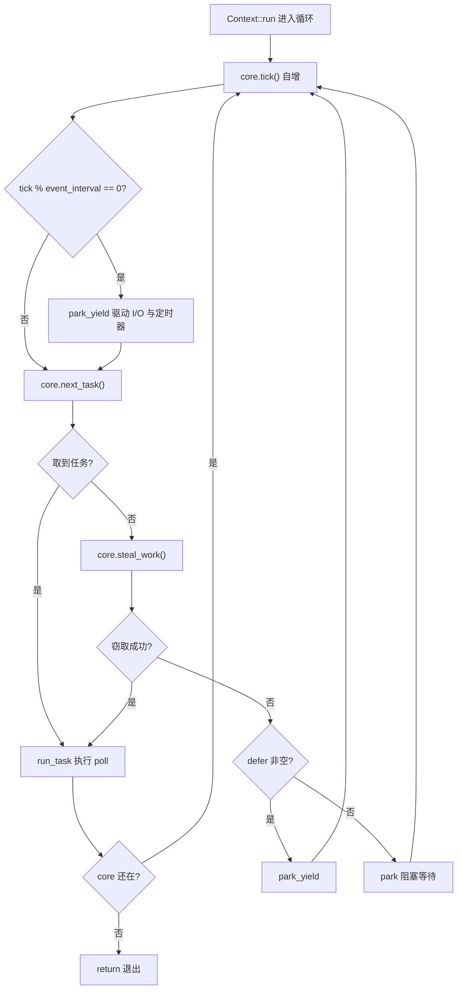
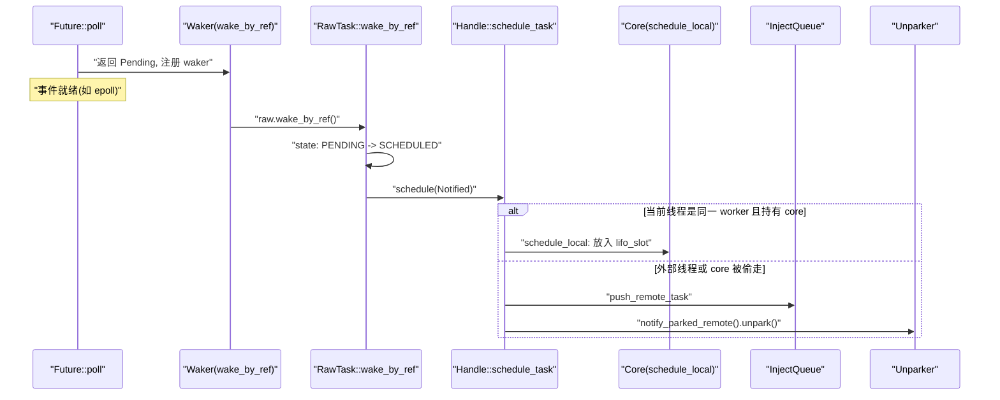
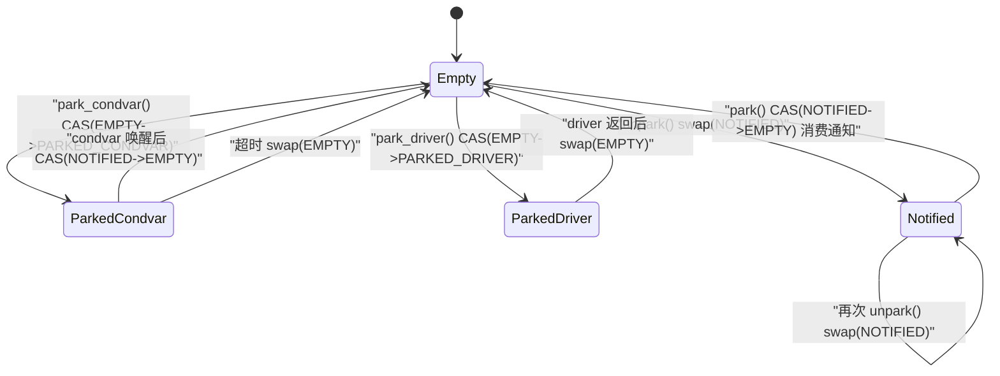

# Capítulo 4: A vida de uma tarefa (parte 2): loop de escalonamento, poll e o ciclo fechado do despertar

# Da fila à execução: o esqueleto do loop principal do worker

No capítulo anterior enviamos a tarefa para a`Local`fila ou fila de injeção global. Mas a fila é apenas uma "lista de afazeres"; o que realmente faz a tarefa rodar é aquele loop infinito na thread worker. Neste capítulo rastreamos`Context::run`— é o coração de todo o escalonador multithread.

Primeiro, construa a intuição: a thread worker é como um chef, com uma pilha de seus próprios pedidos à frente (`run_queue`), e ao lado um suporte público de pedidos (`inject`). O chef primeiro olha o pedido mais próximo à mão (`lifo_slot`), se não houver, pega da própria pilha; se ainda não houver, vai até a prateleira pública e pega um punhado; se ainda assim não der, vai até a pilha de outro chef e rouba algumas folhas. Só quando tudo estiver vazio ele vai descansar, mas mesmo descansando mantém os ouvidos atentos — assim que chega um pedido, acorda imediatamente.

Sem esse loop, a tarefa, após ser enfileirada, ficaria para sempre na fila,`Future::poll`nunca seria chamada, e todo o runtime seria um monte de dados mortos.

## Layout de memória e campos de estado do Core

Todo o estado mutável do worker está guardado em`Core`, que é`Box`alocado no heap, e passado através de`AtomicCell<Core>`entre`Worker`e o thread-local`Context`.

`Core`Os campos-chave de são os seguintes[FACT:tokio/src/runtime/scheduler/multi_thread/worker.rs:113-167]：

- `tick: u32`: incrementa a cada iteração do loop, usado para disparar periodicamente a manutenção (`maintenance`) e a verificação da fila global.
- `lifo_slot: Option<Notified>`：**Slot LIFO**, este é o design mais engenhoso deste capítulo. Quando o worker agenda uma tarefa por conta própria, ele não a coloca em`run_queue`, mas sim neste slot, e na próxima vez que for buscar tarefas**dá prioridade**para pegar daqui.
- `lifo_enabled: bool`: interruptor do slot LIFO, usado para evitar inanição em cenários de ping-pong.
- `run_queue: queue::Local<Arc<Handle>>`: fila local, a estrutura`Local`analisada no capítulo anterior.
- `is_searching: bool`: indica se o worker está procurando tarefas para roubar.
- `is_shutdown: bool` / `is_traced: bool`: flags de encerramento e rastreamento.
- `park: Option<Parker>`: parker, envolto em`Option`para facilitar retirar/colocar de volta sob o borrow checker.
- `global_queue_interval: u32`: com que frequência verificar a fila global.
- `rand: FastRand`: gerador de números aleatórios rápido, usado para escolher aleatoriamente o ponto de início do roubo.

> **[Design Inference & Architectural Trade-offs]**
> Note que`lifo_slot`é`Option<Notified>`e não uma fila — ele armazena**apenas uma**tarefa. A motivação desse design está claramente explicada nos comentários do código-fonte[FACT:tokio/src/runtime/scheduler/multi_thread/worker.rs:117-121]: tarefas agendadas pelo próprio worker são guardadas neste slot, e o worker verifica`run_queue` **antes de verificar**, tendo como efeito "a última tarefa agendada é a próxima a executar" (LIFO). Isso serve para melhorar a localidade, sendo especialmente eficaz para padrões de passagem de mensagens, reduzindo a latência.

Por que LIFO reduz a latência? Considere um cenário típico de passagem de mensagens: a tarefa A, após processar uma mensagem, acorda a tarefa B; B, após processar, acorda A novamente. Se, depois que A acorda B, B executar imediatamente, os dados de que B precisa provavelmente ainda estarão no cache da CPU (porque A acabou de acessá-los). Se B for jogada para o final da fila, esperando dezenas de tarefas à frente terminarem, o cache já terá sido completamente substituído.

Mas LIFO tem risco de inanição. O código-fonte usa`MAX_LIFO_POLLS_PER_TICK = 3`para limitar[FACT:tokio/src/runtime/scheduler/multi_thread/worker.rs:263-263]: a cada tick, no máximo 3 priorizações do slot LIFO; ultrapassando isso, ele é desabilitado, dando chance a outras tarefas de executar.

## Walkthrough do loop principal: um ciclo completo de agendamento

Vamos considerar um cenário concreto: o worker 0 acabou de acordar de`park`,`run_queue`tem 5 tarefas,`lifo_slot`tem 1 tarefa, e a fila global tem 3 tarefas.

A entrada do loop principal é`Context::run` [FACT:tokio/src/runtime/scheduler/multi_thread/worker.rs:570-642]. Ele primeiro reinicializa`lifo_enabled`(porque o core pode ter sido roubado por`block_in_place`, e o estado precisa ser restaurado)[FACT:tokio/src/runtime/scheduler/multi_thread/worker.rs:571-573], e então entra no loop`while !core.is_shutdown`.

A cada iteração do loop, quatro coisas são feitas:

**Primeiro passo: tick e manutenção.** `core.tick()`incrementa o contador[FACT:tokio/src/runtime/scheduler/multi_thread/worker.rs:587]. Em seguida,`self.maintenance(core)`verifica`tick % event_interval == 0`, e se sim, chama`park_yield`para acionar I/O e timers com timeout 0[FACT:tokio/src/runtime/scheduler/multi_thread/worker.rs:809-826]。

**Segundo passo: obter tarefa.** `core.next_task(&self.worker)`é a lógica central de obtenção de tarefas[FACT:tokio/src/runtime/scheduler/multi_thread/worker.rs:1090-1156]. Ela se divide em dois caminhos:

- Quando`tick % global_queue_interval == 0`,**dá prioridade**para pegar da fila global; se não conseguir, pega da fila local[FACT:tokio/src/runtime/scheduler/multi_thread/worker.rs:1091-1098]. Isso serve para evitar que tarefas na fila global morram de inanição.
- Caso contrário,**dá prioridade**para pegar tarefas locais[FACT:tokio/src/runtime/scheduler/multi_thread/worker.rs:1090-1156]。

A obtenção local de tarefas é feita por`next_local_task`, que[FACT:tokio/src/runtime/scheduler/multi_thread/worker.rs:1158-1160]：

```rust
fn next_local_task(&mut self) -> Option {
    self.lifo_slot.take().or_else(|| self.run_queue.pop())
}
```

primeiro o slot LIFO, depois a cabeça da fila (pop LIFO). É isso que o capítulo anterior chamou de "LIFO local".

Se a fila local estiver vazia mas a fila global não, o worker**em lote**puxa tarefas da fila global[FACT:tokio/src/runtime/scheduler/multi_thread/worker.rs:1110-1154]. O cálculo do tamanho do lote`n`é bastante criterioso:`min(inject.len() / remotes.len() + 1, cap)`, onde`cap`por sua vez pega`min(remaining_slots, max_capacity / 2)`. Os comentários do código-fonte explicam por que limitar à metade da capacidade da fila[FACT:tokio/src/runtime/scheduler/multi_thread/worker.rs:1120-1131]: garantir que as tarefas puxadas caiam na**primeira metade**da fila local, de modo que, mesmo que ocorra overflow depois, essas tarefas não sejam empurradas de volta para a fila global (o overflow afeta apenas a segunda metade).

**Terceiro passo: executar a tarefa.**Após obter a tarefa, chama`run_task` [FACT:tokio/src/runtime/scheduler/multi_thread/worker.rs:647-796]. Esta é a função mais complexa do capítulo, que detalharemos na próxima seção.

**Quarto passo: roubar ou park.**Se`next_task`retorna`None`, significa que não há trabalho nem local nem globalmente, então chama`steal_work` [FACT:tokio/src/runtime/scheduler/multi_thread/worker.rs:1167-1195]. Se o roubo falhar, entra em`park`ou`park_yield` [FACT:tokio/src/runtime/scheduler/multi_thread/worker.rs:613-621]。

Todo o fluxo de controle é o seguinte:



## run_task: o ciclo fechado entre poll e o slot LIFO

`run_task`é onde a tarefa realmente é`poll`, e também o ponto de fechamento do ciclo "acordar → enfileirar → poll novamente".

A primeira coisa ao entrar na função é`assert_owner` [FACT:tokio/src/runtime/scheduler/multi_thread/worker.rs:648], converter`Notified`em`Task`, e ao mesmo tempo afirmar que a thread atual é de fato a owner desta tarefa (asserção de debug).

Em seguida`transition_from_searching` [FACT:tokio/src/runtime/scheduler/multi_thread/worker.rs:652]— se o worker estava antes no estado de busca, agora que encontrou a tarefa, deve sair do estado de busca e possivelmente acordar outros workers em park.

Depois vem o envoltório chave de budget[FACT:tokio/src/runtime/scheduler/multi_thread/worker.rs:695-795]：

```rust
coop::budget(|| {
    task.run();
    let mut lifo_polls = 0;
    loop {
        let mut core = match self.core.borrow_mut().take() {
            Some(core) => core,
            None => return ControlFlow::Break(()),
        };
        let task = match core.lifo_slot.take() {
            Some(task) => task,
            None => {
                self.reset_lifo_enabled(&mut core);
                core.stats.end_poll();
                return ControlFlow::Continue(core);
            }
        };
        if !coop::has_budget_remaining() {
            core.run_queue.push_back_or_overflow(task, ...);
            return ControlFlow::Continue(core);
        }
        lifo_polls += 1;
        if lifo_polls >= MAX_LIFO_POLLS_PER_TICK {
            core.lifo_enabled = false;
        }
        let task = self.worker.handle.shared.owned.assert_owner(task);
        *self.core.borrow_mut() = Some(core);
        task.run();
    }
})
```

Este trecho de código revela o ciclo fechado completo do slot LIFO:`task.run()`executa`Future::poll`, e durante o poll, se a tarefa acordar a si mesma ou a outra tarefa,`schedule_local`coloca a nova tarefa em`lifo_slot` [FACT:tokio/src/runtime/scheduler/multi_thread/worker.rs:1396-1408]. Após o poll retornar, o loop verifica imediatamente`lifo_slot`, e se houver tarefa, continua executando —**sem voltar ao loop principal**, fazendo polls consecutivos diretamente dentro do mesmo budget.

É assim que "acordar → enfileirar → poll novamente" se manifesta no caminho LIFO: ao acordar, a tarefa é colocada em`lifo_slot`, e após o poll retornar, ela é imediatamente retirada e sofre poll de novo, formando um ciclo fechado e estreito.

Note o`self.core.borrow_mut().take()`de`None`no branch[FACT:tokio/src/runtime/scheduler/multi_thread/worker.rs:716-724]: se o core foi roubado (por exemplo, se dentro da tarefa foi chamado`block_in_place`), o worker deve retornar`ControlFlow::Break(())`, fazendo com que`Context::run`saia. Isto é`block_in_place`Pontos de interação com o loop de agendamento.

## Caminho de despertar: como o Waker dispara o reenfileiramento

Quando`Future::poll`retorna`Pending`a tarefa precisa registrar um`Waker`e ser despertada quando o evento estiver pronto. A implementação de`Waker`do Tokio é extremamente enxuta — é apenas um ponteiro bruto para a`Header`da tarefa mais uma vtable.

`waker_ref`Constrói`WakerRef` [FACT:tokio/src/runtime/task/waker.rs:11-34]envolvendo`ManuallyDrop`com`Waker`para evitar decrementar a contagem de referências no drop. A vtable é estática[FACT:tokio/src/runtime/task/waker.rs:119-119]：

```rust
static WAKER_VTABLE: RawWakerVTable =
    RawWakerVTable::new(clone_waker, wake_by_val, wake_by_ref, drop_waker);
```

As quatro funções apenas restauram o ponteiro bruto para`Header`e então chamam o método correspondente de`RawTask`[FACT:tokio/src/runtime/task/waker.rs:70-116]Por exemplo,`wake_by_ref`eventualmente chama`raw.wake_by_ref()` [FACT:tokio/src/runtime/task/waker.rs:106-116]。

`wake_by_ref`A semântica é: mudar o estado da tarefa de`PENDING`para`SCHEDULED`e, se a transição for bem-sucedida (ou seja, se antes era de fato PENDING), chamar`Schedule::schedule`para reenfileirar a tarefa.

Para o agendador multithread,`schedule`a implementação de`Handle::schedule_task` [FACT:tokio/src/runtime/scheduler/multi_thread/worker.rs:1353-1376]：

```rust
pub(super) fn schedule_task(&self, task: Notified, is_yield: bool) {
    with_current(|maybe_cx| {
        if let Some(cx) = maybe_cx {
            if self.ptr_eq(&cx.worker.handle) {
                if let Some(core) = cx.core.borrow_mut().as_mut() {
                    self.schedule_local(core, task, is_yield);
                    return;
                }
            }
        }
        self.push_remote_task(task);
        self.notify_parked_remote();
    });
}
```

A lógica se divide em dois ramos:

- Se a thread atual for um worker desse agendador e estiver com o core, segue por`schedule_local` [FACT:tokio/src/runtime/scheduler/multi_thread/worker.rs:1385-1417]— coloca no slot LIFO ou na fila local.
- Caso contrário (despertar de uma thread externa, ou core roubado), segue por`push_remote_task`empurra para a fila de injeção global e`notify_parked_remote`desperta um worker estacionado[FACT:tokio/src/runtime/scheduler/multi_thread/worker.rs:1379-1383]。

`schedule_local`Internamente também se divide em dois ramos[FACT:tokio/src/runtime/scheduler/multi_thread/worker.rs:1385-1417]: se for`yield`ou o LIFO estiver desabilitado, empurra para o final de`run_queue`; caso contrário, coloca em`lifo_slot`e empurra a tarefa que estava no slot para o final da fila.



## park e unpark: atomicidade entre máquina de estados e despertar

O worker precisa estacionar quando não tem trabalho, mas park/unpark é onde as condições de corrida mais acontecem. O Tokio resolve com uma máquina de estados`AtomicUsize`mais`Condvar`como fallback.

`Inner`Os campos de[FACT:tokio/src/runtime/scheduler/multi_thread/park.rs:31-43]：`state: AtomicUsize`、`mutex: Mutex<()>`、`condvar: Condvar`、`shared: Arc<Shared>`. Há quatro constantes de estado[FACT:tokio/src/runtime/scheduler/multi_thread/park.rs:36-45]：

- `EMPTY = 0`: não estacionado.
- `PARKED_CONDVAR = 1`: estacionado em uma condvar.
- `PARKED_DRIVER = 2`: estacionado no driver de I/O.
- `NOTIFIED = 3`: já foi despertado.

Esta é uma máquina de estados explícita; usamos ela para desenhar o diagrama de estados (este é o único lugar do capítulo que atende aos critérios de admissão de`stateDiagram-v2`— de fato existem essas quatro constantes de estado no código-fonte):



`unpark`A implementação de[FACT:tokio/src/runtime/scheduler/multi_thread/park.rs:277-290]usa`swap`em vez de CAS; o comentário do código-fonte explica o motivo[FACT:tokio/src/runtime/scheduler/multi_thread/park.rs:277-290]: é necessário executar uma operação release para que a thread estacionada observe as escritas anteriores ao unpark, então mesmo que o state já seja`NOTIFIED`é preciso escrever uma vez.

`park`primeiro tenta consumir uma notificação existente[FACT:tokio/src/runtime/scheduler/multi_thread/park.rs:132-149]: se o CAS de`NOTIFIED -> EMPTY`for bem-sucedido, significa que já foi despertado antes, então retorna diretamente sem bloquear. Caso contrário, tenta obter o lock do driver; se conseguir, estaciona no driver; se não conseguir, usa a condvar como fallback[FACT:tokio/src/runtime/scheduler/multi_thread/park.rs:143-148]。

`park_condvar`Há uma verificação dupla clássica em[FACT:tokio/src/runtime/scheduler/multi_thread/park.rs:162-180]: primeiro CAS`EMPTY -> PARKED_CONDVAR`; se falhar e for`NOTIFIED`, significa que fomos despertados antes de definir o estado, então é obrigatório`swap(EMPTY)`para sincronizar a escrita do unpark[FACT:tokio/src/runtime/scheduler/multi_thread/park.rs:167-177]. O comentário enfatiza especialmente: mesmo sabendo que é`NOTIFIED`ainda é preciso ler uma vez, porque o unpark pode ter sido chamado novamente depois que lemos`NOTIFIED`.

`unpark_condvar`O comentário de[FACT:tokio/src/runtime/scheduler/multi_thread/park.rs:292-307]aponta a armadilha clássica da condvar: a thread estacionada define o estado`PARKED`e realmente`wait`há uma janela entre os dois; se um notify ocorrer nesse intervalo, ele será ignorado. A solução é que a thread que estaciona mantém`mutex`nesse momento, e a thread que faz unpark primeiro`drop(self.mutex.lock())`adquire o lock (esperando assim que a thread estacionada o libere), e então`notify_one`。

# Reflexão de design: por que o slot LIFO é um slot único e não uma fila

> **[Design Inference & Architectural Trade-offs]**
> O design de slot único é um trade-off deliberado. Se fosse uma fila, cada despertar exigiria enfileirar e cada retirada de tarefa exigiria desenfileirar, com custo maior; além disso, a fila acumularia várias tarefas, quebrando a hipótese de localidade de "a tarefa despertada mais recentemente executa primeiro". A semântica do slot único é "lembrar apenas a mais recente"; a tarefa expulsa vai para a fila comum — o que se encaixa exatamente na lei dos retornos decrescentes de localidade: a tarefa mais recente é a mais quente, a segunda vem depois, e da terceira em diante o benefício se torna muito pequeno.

`MAX_LIFO_POLLS_PER_TICK = 3`Esse número mágico[FACT:tokio/src/runtime/scheduler/multi_thread/worker.rs:263-263]também é um valor empírico. O comentário do código-fonte diz que "executar algumas vezes o slot LIFO parece suficiente para se beneficiar da localidade; mais de 3 vezes pode dar peso excessivo". Isso evita que o cenário ping-pong em que A desperta B e B desperta A faça outras tarefas passarem fome.

Outro design digno de nota é a estratégia de "busca pela metade" de`steal_work`:[FACT:tokio/src/runtime/scheduler/multi_thread/worker.rs:1158-1160]: somente quando menos da metade dos workers estão buscando é que um novo worker realmente tenta roubar. Isso evita a disputa de CAS causada por todos os workers tentando roubar freneticamente ao mesmo tempo.`transition_to_searching`coordena`idle.transition_worker_to_searching()`por meio de[FACT:tokio/src/runtime/scheduler/multi_thread/worker.rs:1197-1203]。

O roubo começa de um ponto aleatório[FACT:tokio/src/runtime/scheduler/multi_thread/worker.rs:1172-1174], percorre todos os remotes, pula a si mesmo[FACT:tokio/src/runtime/scheduler/multi_thread/worker.rs:1179-1182], chama`steal_into`para tentar roubar. Após todas as falhas, recorre à fila global[FACT:tokio/src/runtime/scheduler/multi_thread/worker.rs:1197-1203]。

# Resumo do capítulo

O loop principal do worker`Context::run`é o coração do agendador: após cada tick, primeiro pega uma tarefa (slot LIFO → fila local → fila global); se conseguir,`run_task`executa o poll; se não conseguir, tenta roubar; se o roubo falhar, estaciona.`run_task`O loop LIFO interno comprime "despertar → enfileirar → poll novamente" dentro do mesmo budget, formando um ciclo fechado de baixa latência.`Waker`é um ponteiro bruto mais uma vtable estática,`wake_by_ref`dispara`schedule`por meio de transições de estado, e decide entre fila local ou fila global conforme a thread atual seja ou não o mesmo worker.`park`/`unpark`usa uma máquina atômica de quatro estados mais condvar como fallback, resolvendo a condição de corrida clássica de perda de despertar.

No próximo capítulo deixaremos o agendador e entraremos no mundo de I/O: como o Reactor traduz eventos do epoll em`Waker`despertares, fazendo com que`AsyncFd`de`Pending`se torne`Ready`。

# Reflexões e autoavaliação deste capítulo

Q1: Se mudarmos`next_local_task`para primeiro pegar`run_queue`Em seguida, pegue`lifo_slot`, quais seriam as consequências em cenários com intensa troca de mensagens?

**Análise de referência**：`next_local_task`A implementação atual é`self.lifo_slot.take().or_else(|| self.run_queue.pop())` [FACT:tokio/src/runtime/scheduler/multi_thread/worker.rs:1158-1160], primeiro pega o slot LIFO. Se, ao contrário, pegar primeiro`run_queue`, então tarefas recém-despertadas, cujos dados ainda estão quentes, seriam executadas depois de outras tarefas na fila. No padrão de troca de mensagens A→B→A, após B ser despertada, ela não seria executada imediatamente, mas esperaria que as outras tarefas na fila terminassem; nesse momento, os dados escritos por A podem já ter sido expulsos do cache da CPU, e o ganho de localidade seria perdido. Mais grave ainda,`lifo_slot`as tarefas em esperariam até que`run_queue`fosse esvaziado para serem executadas, aumentando significativamente a latência. O comentário no código-fonte[FACT:tokio/src/runtime/scheduler/multi_thread/worker.rs:117-121]indica explicitamente que essa ordem é para "melhorar a localidade, beneficiar-se do padrão de troca de mensagens e reduzir a latência".

Q2: `park_condvar`, se removermos`Err(NOTIFIED)`do branch`self.state.swap(EMPTY, SeqCst)`, mantendo apenas`return`, qual seria o problema?

**Análise de referência**: o código-fonte, no branch`Err(NOTIFIED)`, executa`let old = self.state.swap(EMPTY, SeqCst)` [FACT:tokio/src/runtime/scheduler/multi_thread/park.rs:167-177]. O comentário explica[FACT:tokio/src/runtime/scheduler/multi_thread/park.rs:168-173]: unpark pode ter sido chamado novamente depois que lemos`NOTIFIED`, e é necessário executar uma operação acquire para sincronizar com aquele unpark, a fim de observar todas as escritas anteriores a ele. Se apenas`return`sem swap, o state permaneceria em`NOTIFIED`, e no próximo park o CAS`NOTIFIED -> EMPTY`teria sucesso e retornaria imediatamente (consumindo uma notificação já expirada), mas pior: a escrita release do unpark não seria sincronizada, e a thread em park poderia não ver os dados escritos antes do unpark, causando problemas de visibilidade de memória. Este é um bug duplo típico de "wakeup perdido + ordenação de memória".

Q3: `run_task`, quando`self.core.borrow_mut().take()`retorna`None`, por que retorna`ControlFlow::Break(())`em vez de`Continue`？

**Análise de referência**：`self.core.borrow_mut().take()`retornar`None`significa que o core já foi roubado[FACT:tokio/src/runtime/scheduler/multi_thread/worker.rs:716-724]. A única forma de o core ser roubado é uma tarefa internamente chamar`block_in_place`, que através de`maybe_move_runtime`retira o core de`cx.core`e o entrega para uma nova thread[FACT:tokio/src/runtime/scheduler/multi_thread/worker.rs:473-497]. Nesse momento, a thread atual já não detém capacidade de agendamento; se retornasse`Continue`，`Context::run`, continuaria o loop e chamaria`core.next_task()`e outros métodos que precisam do core, mas o core já não está em`self.core`, causando panic ou inconsistência de estado. Retornar`Break`faz com que`Context::run`diretamente`return` [FACT:tokio/src/runtime/scheduler/multi_thread/worker.rs:594-597], devolvendo o controle para a função`run`, que trata o restante (por exemplo,`cx.defer.wake()` [FACT:tokio/src/runtime/scheduler/multi_thread/worker.rs:564]). O comentário também explica[FACT:tokio/src/runtime/scheduler/multi_thread/worker.rs:719-721]: neste momento não se pode chamar`reset_lifo_enabled`, porque o core foi roubado, e o ladrão tratará isso no topo de`Context::run`.
