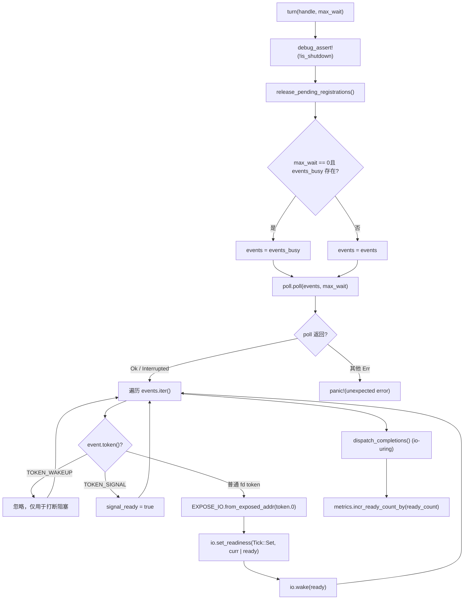
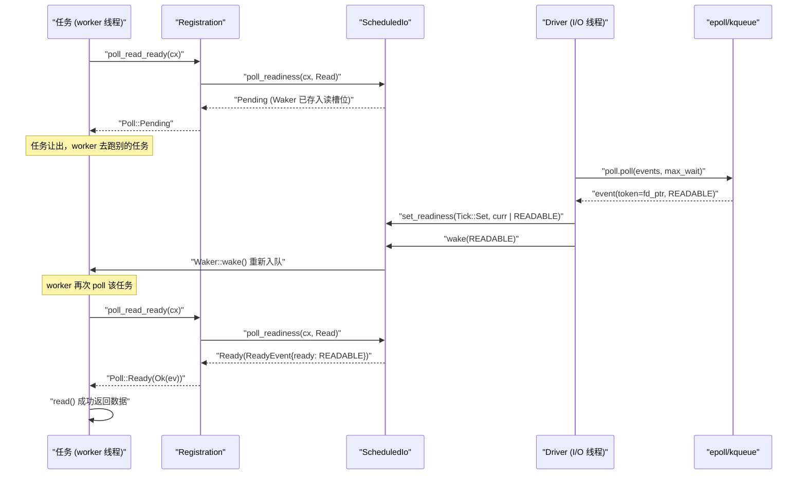

# Capítulo 5: Notificação de prontidão de I/O: como o Reactor traduz eventos epoll em despertar via Waker

No capítulo anterior, rastreamos o loop principal da thread worker: a tarefa é pollada, ao retornar Pending o Waker é armazenado em algum lugar, e quando o evento fica pronto o Waker é acionado e a tarefa é reenfileirada. Mas onde exatamente é esse "algum lugar"? Como o Waker é recuperado quando um evento epoll chega? É exatamente isso que o Reactor responde. Primeiro, vamos construir um modelo intuitivo: imagine todo o mecanismo de notificação de prontidão de I/O como o sistema de chamada de pedidos de um restaurante — o cliente (tarefa), após fazer o pedido, não fica esperando parado na janela, mas pega um pager (Waker) e volta ao seu lugar; a cozinha (epoll do kernel), após preparar o pedido, a recepção (Reactor) encontra o pager correspondente pelo número do pedido (Token) e aperta o botão. Sem esse sistema, cada tarefa só poderia fazer polling no socket, queimando a CPU; ou usar threads bloqueantes para esperar, uma conexão por thread, o que não escala. O Reactor do Tokio é composto por três arquivos em uma estrutura de três camadas, com responsabilidades estritamente separadas: driver.rs é o corpo do loop de eventos, possui o mio::Poll, responsável por chamar poll() para bloquear aguardando eventos do kernel e traduzir eventos em leituras/escritas no ScheduledIo; registration.rs é o handle de registro voltado ao usuário, que o TcpStream mantém internamente, oferecendo APIs como poll_read_ready / poll_write_ready; scheduled_io.rs é o slot de estado de cada fd, armazenando bits de prontidão de leitura/escrita e a lista de Wakers, sendo a ponte entre eventos e tarefas. A relação de montagem dos módulos pode ser consultada em tokio/src/runtime/io/mod.rs:5-16: driver exporta Driver, Handle, ReadyEvent; registration exporta Registration; scheduled_io exporta ScheduledIo. A figura abaixo ancora o fluxo de dados completo a ser rastreado neste capítulo: TcpStream → Registration → ScheduledIo → Handle/Driver → kernel → de volta ao ScheduledIo → Waker. A seguir, vamos destrinchar camada por camada.

# Camada de driver:`Driver`e`Handle`divisão de responsabilidades

## Modelo intuitivo

`Driver`é**a única entidade que possui`mio::Poll`, e só pode ser acessado por**em uma única thread — este é o requisito de exclusividade do loop de eventos. Já`&mut`é`Handle`um ponto de registro clonável e compartilhável entre threads**可克隆、可跨线程共享的注册入口**, qualquer thread que queira registrar um novo fd passa por ele. Sem essa divisão, seria necessário ou adicionar`mio::Poll`um lock (competindo a cada registro), ou fazer com que todos os registros voltem para a thread do driver (introduzindo uma fila de mensagens entre threads). O Tokio escolhe fazer com que`Handle`detenha diretamente`mio::Registry`um clone de , permitindo que as operações de registro ocorram concorrentemente, e apenas a espera real por eventos exija exclusividade.

## Layout de memória e campos

Primeiro, vejamos`Driver`os campos de[FACT:tokio/src/runtime/io/driver.rs:25-38]：

- `signal_ready: bool`: se um evento de sinal Unix chegou, usado para o driver de signal.
- `events: mio::Events`: buffer principal de eventos, reutilizado entre chamadas de`turn`, evitando alocação a cada vez.
- `events_busy: Option<mio::Events>`：**Buffer dedicado para poll não bloqueante**, existente apenas quando`max_io_events_per_busy_tick`está definido.
- `poll: mio::Poll`: encapsulamento da fila de eventos do kernel.

Agora vejamos`Handle` [FACT:tokio/src/runtime/io/driver.rs:41-75]：

- `registry: mio::Registry`：`mio::Poll::registry()`o clone de , usado para`register`/`deregister`。
- `registrations: RegistrationSet`: o conjunto de todos os registros ativos, responsável por alocar`Token`e`ScheduledIo`。
- `synced: Mutex<registration_set::Synced>`: estado de sincronização que protege`RegistrationSet`.
- `waker: mio::Waker`: usado para acordar de qualquer thread o driver bloqueado em`turn`.
- `metrics: IoDriverMetrics`: contabiliza o número de fds e de eventos prontos.

Aqui há um design crucial:`events_busy`A existência de[FACT:tokio/src/runtime/io/driver.rs:25-38]serve para resolver**o problema de que o poll não bloqueante engole eventos**. O comentário[FACT:tokio/src/runtime/io/driver.rs:189-190]deixa claro: se os eventos retirados pelo poll não bloqueante permanecerem no buffer principal, o próximo poll não os verá; usando um buffer separado, os eventos não processados permanecem na fila do kernel e serão retornados novamente no próximo poll.

## Passo a passo: uma execução de`turn`

`turn`é a função central do driver[FACT:tokio/src/runtime/io/driver.rs:184-261]. Suponha que uma thread worker descubra que não há tarefas para executar e chame`park` → `turn(handle, None)`para bloquear e esperar:

**Primeiro passo**: afirma que não houve shutdown[FACT:tokio/src/runtime/io/driver.rs:185], e libera os registros pendentes de limpeza[FACT:tokio/src/runtime/io/driver.rs:187]。`release_pending_registrations`Verifica`needs_release()`, e se houver, chama`registrations.release()` [FACT:tokio/src/runtime/io/driver.rs:336-340]。

**Segundo passo**: escolhe o buffer de eventos[FACT:tokio/src/runtime/io/driver.rs:191-194]. Se`max_wait`for zero e`events_busy`existir, usa o buffer busy; caso contrário, usa o buffer principal.

**Terceiro passo**: chama`self.poll.poll(events, max_wait)` [FACT:tokio/src/runtime/io/driver.rs:198]. Este é o ponto onde realmente se bloqueia em epoll_wait. O tratamento de erros é contido:`Interrupted`é ignorado diretamente (interrupção por sinal é normal)[FACT:tokio/src/runtime/io/driver.rs:200], sob WASI`InvalidInput`também é ignorado[FACT:tokio/src/runtime/io/driver.rs:201-205], outros erros causam panic diretamente[FACT:tokio/src/runtime/io/driver.rs:206]。

**Quarto passo**: percorre os eventos[FACT:tokio/src/runtime/io/driver.rs:211-233]. Para cada`event`：

- se`token == TOKEN_WAKEUP`(valor 0)[FACT:tokio/src/runtime/io/driver.rs:214], não faz nada — isto é`unpark`usado para interromper o bloqueio.
- Se`token == TOKEN_SIGNAL`(valor 1)[FACT:tokio/src/runtime/io/driver.rs:216], define`signal_ready = true`。
- Caso contrário, é um evento de I/O normal[FACT:tokio/src/runtime/io/driver.rs:218-231]: converte`mio::Ready`para o`Ready`do Tokio, usa`EXPOSE_IO.from_exposed_addr(token.0)`para restaurar o token ao ponteiro`*const ScheduledIo`, então`set_readiness(Tick::Set, |curr| curr | ready)`acumula os bits de prontidão, e em seguida`io.wake(ready)`dispara o`Waker`。

na direção correspondente`EXPOSE_IO`Aqui`PtrExposeDomain<ScheduledIo>` [FACT:tokio/src/runtime/io/mod.rs:21-22]é um`usize`, que "expõe" o ponteiro como um`mio::Token`como[FACT:tokio/src/runtime/io/driver.rs:222-225]. O comentário de segurança**explica por que essa conversão unsafe é segura: o ponteiro não será liberado antes de ser desregistrado do mio**e`Arc<ScheduledIo>`o driver não fizer mais poll concorrente, e o driver detém a propriedade de

**Quinto passo**: processa a fila de conclusão do io_uring (apenas Linux + tokio_unstable)[FACT:tokio/src/runtime/io/driver.rs:235-258], incluindo o loop de flush quando há overflow de CQ.

**Sexto passo**: acumula métricas[FACT:tokio/src/runtime/io/driver.rs:265-267]。



## Reflexão de design: por que`Handle`deve deter`mio::Waker`

`unpark` [FACT:tokio/src/runtime/io/driver.rs:280-283]chama`self.waker.wake()`. Este`mio::Waker`em`Driver::new`usa`TOKEN_WAKEUP`para registrar[FACT:tokio/src/runtime/io/driver.rs:124]. Quando o driver está bloqueado em`poll.poll()`, outra thread chamando`unpark`insere um evento`TOKEN_WAKEUP`no epoll,`poll`retorna imediatamente, e ao percorrer, ao ver esse token, simplesmente o ignora[FACT:tokio/src/runtime/io/driver.rs:214-215]。

> **[Design Inference & Architectural Trade-offs]**
> Este mecanismo é usado em`deregister_source`[FACT:tokio/src/runtime/io/driver.rs:315-334]: após desregistrar um source, se`registrations.deregister`retornar true (indicando que esta é a última referência), então`unpark()`. Por quê? Porque o driver pode estar bloqueado em`poll`esperando eventos deste fd, e o fd já foi desregistrado, então o kernel não gerará mais eventos; é necessário acordar ativamente o driver para que ele reexamine o conjunto de registros e possa sair do bloqueio. Caso contrário, o driver dormirá até o timeout de`max_wait`, atrasando o shutdown.

Outro detalhe:`deregister_source`chama primeiro`self.registry.deregister(source)` [FACT:tokio/src/runtime/io/driver.rs:322], depois limpa`registrations` [FACT:tokio/src/runtime/io/driver.rs:315-334]. O comentário[FACT:tokio/src/runtime/io/driver.rs:320-321]diz "Cleanup ALWAYS happens" — mesmo que o deregister na camada do SO falhe, o estado interno deve ser limpo, e só então o erro do SO é retornado[FACT:tokio/src/runtime/io/driver.rs:336-340]. Este é o padrão típico de**limpeza de recursos tem prioridade sobre propagação de erros**.

# Camada de registro:`Registration`como`Waker`armazena em`ScheduledIo`

## Modelo intuitivo

`Registration`é**o contrato entre a tarefa e o fd**. Ele detém duas coisas: um`scheduler::Handle`(usado para acessar o runtime quando necessário), e um`Arc<ScheduledIo>`(o slot de estado do fd). Quando a tarefa chama`poll_read_ready`,`Registration`entrega`Waker`a`ScheduledIo`para guardar; quando o driver recebe um evento, retira`ScheduledIo`de`Waker`para acordar.

## Layout de memória e campos

`Registration`tem apenas dois campos[FACT:tokio/src/runtime/io/registration.rs:46-54]：

- `handle: scheduler::Handle`: o handle do runtime, com o comentário[FACT:tokio/src/runtime/io/registration.rs:46-54]dizendo "TODO: this can probably be moved into ScheduledIo", indicando que o autor acredita que a posição deste campo pode ser otimizada.
- `shared: Arc<ScheduledIo>`: estado compartilhado,`Arc`garante que tanto o driver quanto a tarefa possam acessá-lo.

> **[Design Inference & Architectural Trade-offs]**
> Note que`Registration`implementa manualmente`Send`e`Sync` [FACT:tokio/src/runtime/io/registration.rs:57-58]. Por que é necessário unsafe impl? Porque`scheduler::Handle`internamente pode conter campos que não são`Send`/`Sync`(como`Rc`), mas o cenário de uso de`Registration`exige que ele possa atravessar threads. O comentário de documentação[FACT:tokio/src/runtime/io/registration.rs:28-33]fornece a restrição crucial:**O chamador deve garantir que no máximo duas tarefas usem o mesmo`Registration`**concorrentemente, uma para leitura e uma para escrita. Violar essa restrição, embora seja seguro em termos de memória, causará perda de notificações e suspensão de tarefas.

## Step-by-Step：`poll_read_ready`A cadeia de chamadas de

Suponha que a tarefa em`TcpStream::poll_read`descobre que o socket não tem dados, é necessário registrar interesse de leitura. A cadeia de chamadas é`TcpStream::poll_read_priv` → `PollEvented::poll_read` → `Registration::poll_read_io` → `poll_io` → `poll_ready`。

`poll_ready`é o núcleo[FACT:tokio/src/runtime/io/registration.rs:155-171]：

**Primeiro passo**：`trace_leaf()` [FACT:tokio/src/runtime/io/registration.rs:160], usado para tracing e instrumentação.

**Segundo passo**：`coop::poll_proceed(cx)` [FACT:tokio/src/runtime/io/registration.rs:155-171]. Este é o mecanismo de orçamento cooperativo que será explicado no Capítulo 12. Se o orçamento se esgotar, retorna`Pending`e registra um`Waker`especial, fazendo a tarefa ser reagendada na próxima rodada.

**Terceiro passo**：`self.shared.poll_readiness(cx, direction)` [FACT:tokio/src/runtime/io/registration.rs:155-171]. Este é o local onde realmente interage com`ScheduledIo`: verifica o bit de prontidão atual; se já estiver pronto, retorna imediatamente`Ready`; caso contrário, armazena`cx.waker()`no slot de direção correspondente de`ScheduledIo`, e retorna`Pending`。

**Quarto passo**: verifica`ev.is_shutdown` [FACT:tokio/src/runtime/io/registration.rs:155-171]. Se o runtime estiver sendo encerrado, retorna`RUNTIME_SHUTTING_DOWN_ERROR`。

**Quinto passo**：`coop.made_progress()` [FACT:tokio/src/runtime/io/registration.rs:169], marca o consumo de orçamento e retorna o evento de prontidão.

`poll_io`adiciona uma camada de loop de retry sobre`poll_ready`[FACT:tokio/src/runtime/io/registration.rs:173-192]：

```rust
loop {
    let ev = ready!(self.poll_ready(cx, direction))?;
    match f() {
        Ok(ret) => return Poll::Ready(Ok(ret)),
        Err(ref e) if e.kind() == io::ErrorKind::WouldBlock => {
            self.clear_readiness(ev);
        }
        Err(e) => return Poll::Ready(Err(e)),
    }
}
```

Aqui se reflete**readiness é uma dica, não uma garantia**a ideia central de:`poll_ready`diz que é legível, mas quando realmente`read()`pode retornar`WouldBlock`(por exemplo, outra thread leu os dados primeiro). Nesse caso, é necessário`clear_readiness(ev)` [FACT:tokio/src/runtime/io/registration.rs:187]limpar o bit de prontidão e então repetir o loop aguardando novamente. Se não limpar, a tarefa entrará em um busy loop de "acha que é legível → read falha → acha que é legível de novo".

## Reflexão de design:`try_io`e`async_io`a divisão de responsabilidades

`try_io` [FACT:tokio/src/runtime/io/registration.rs:194-213]é a versão síncrona: primeiro`ready_event(interest)`verifica o bit de prontidão; se estiver vazio, retorna diretamente`WouldBlock` [FACT:tokio/src/runtime/io/registration.rs:194-213]; caso contrário, executa`f()`, se`f()`retornar`WouldBlock`então limpa o bit de prontidão[FACT:tokio/src/runtime/io/registration.rs:207-210]. Ele**não registra Waker**, adequado para`try_read`cenários do tipo "tenta uma vez e sai".

`async_io` [FACT:tokio/src/runtime/io/registration.rs:225-245]é a versão assíncrona:`readiness(interest).await`registra o Waker e aguarda, então ao executar`f()`，`WouldBlock`limpa o bit de prontidão e faz o loop. Note que dentro do loop ele também chama`coop::poll_proceed` [FACT:tokio/src/runtime/io/registration.rs:233], para evitar esgotar o orçamento em muitas`WouldBlock`tentativas de retry.

## Armadilhas em produção:`Drop`limpeza de Waker em

`Registration::drop` [FACT:tokio/src/runtime/io/registration.rs:253-262]chama`self.shared.clear_wakers()`. O comentário[FACT:tokio/src/runtime/io/registration.rs:253-262]explica o motivo:`ScheduledIo`armazenado em`Waker`pode conter`Arc<driver::Inner>`, e`driver::Inner`por sua vez contém`ScheduledIo`, formando uma referência circular. Limpar o Waker é um meio de quebrar o ciclo. Mas o comentário também admite que é uma "imperfect solution" — se`Registration`em si for armazenado em`Waker`, o ciclo ainda existe. Este é o problema discutido em tokio-rs/tokio#3481.

> **[Design Inference & Architectural Trade-offs]**
> O comportamento em produção é: se muitas conexões forem dropadas mas o runtime não sair, a memória não será recuperada imediatamente, até o próximo`clear_wakers`ou runtime shutdown. Para serviços de conexão longa, isso geralmente não é problema; mas para cenários de conexão curta com criação/destruição de alta frequência, é preciso ficar atento ao momento de recuperação de`ScheduledIo`.

# De`TcpStream::read`até`Waker`a cadeia completa de despertar

## Modelo intuitivo

Agora vamos conectar as três camadas. O usuário chama`TcpStream`em`.read().await`, o que na prática executa`AsyncRead::poll_read` → `PollEvented::poll_read` → `Registration::poll_read_io`. Quando os dados não chegam,`Waker`é armazenado em`ScheduledIo`; quando o epoll reporta legibilidade, o driver retira`ScheduledIo`de`Waker`e desperta, a tarefa é reagendada, e ao pollar novamente`poll_readiness`descobre que o bit de prontidão já está setado, retornando diretamente`Ready`，`read()`com sucesso.

## Step-by-Step: uma espera de leitura completa

**Fase 1: registrar interesse**。`TcpStream::new` [FACT:tokio/src/net/tcp/stream.rs:166-169]chama`PollEvented::new(connected)`, que internamente chama`Registration::new_with_interest_and_handle` [FACT:tokio/src/runtime/io/registration.rs:73-81], e então`handle.driver().io().add_source(io, interest)` [FACT:tokio/src/runtime/io/registration.rs:73-81]。

`add_source` [FACT:tokio/src/runtime/io/driver.rs:288-312]faz três coisas:

1. `registrations.allocate(&mut synced.lock())`aloca um`ScheduledIo`, obtém`token` [FACT:tokio/src/runtime/io/driver.rs:293-294]。

2. `self.registry.register(source, token, interest.to_mio())`registra[FACT:tokio/src/runtime/io/driver.rs:298]no kernel. Se falhar,**deve**remover o`ScheduledIo`recém-alocado do conjunto[FACT:tokio/src/runtime/io/driver.rs:300-303], caso contrário vaza.

3. `metrics.incr_fd_count()`conta[FACT:tokio/src/runtime/io/driver.rs:309]。

**Fase 2: aguardar prontidão**. A tarefa polla`TcpStream::poll_read` [FACT:tokio/src/net/tcp/stream.rs:1492-1498] → `poll_read_priv` [FACT:tokio/src/net/tcp/stream.rs:1451-1458] → `PollEvented::poll_read` → `Registration::poll_read_io` [FACT:tokio/src/runtime/io/registration.rs:133-139] → `poll_io` → `poll_ready` → `ScheduledIo::poll_readiness`. Nesse momento, se não estiver pronta,`Waker`armazena em`ScheduledIo`o slot de leitura, retorna`Pending`。

**Fase 3: evento chega**. O`turn`do driver obtém o evento`poll.poll()`de[FACT:tokio/src/runtime/io/driver.rs:198], e ao iterar executa para cada evento de fd`io.set_readiness(Tick::Set, |curr| curr | ready)`e`io.wake(ready)` [FACT:tokio/src/runtime/io/driver.rs:228-229]。`wake`internamente retira o`Waker`da direção correspondente e chama`wake()`。

**Fase 4: reagendamento da tarefa**。`Waker::wake()`reenfileira a tarefa na fila local do worker (explicado no capítulo anterior). O worker polla a tarefa novamente,`poll_readiness`descobre que o bit de prontidão já está setado, retorna`Ready`，`read()`com sucesso.



## Ramificações importantes:`assume_ready`otimização

`TcpStream::new_accepted` [FACT:tokio/src/net/tcp/stream.rs:174-181]é uma otimização que vale a pena notar.`accept`O socket retornado por é naturalmente gravável e geralmente já contém o primeiro lote de bytes do par. Se esperar pelo primeiro evento do driver, sob alta carga esse evento pode ficar atrás de todos os eventos de conexões já estabelecidas, causando latência. Então`new_accepted`chama diretamente`assume_ready(Ready::READABLE | Ready::WRITABLE)` [FACT:tokio/src/net/tcp/stream.rs:174-181]。

`assume_ready`o comentário de[FACT:tokio/src/runtime/io/registration.rs:103-105]diz: "A wrong guess costs one`WouldBlock`, which clears the readiness again." — o custo de errar é apenas um`WouldBlock`，`poll_io`o loop de limpa o bit de prontidão e aguarda novamente. Este é um design de**palpite otimista + correção rápida**.

## Reflexão de design: por que o driver de I/O é desacoplado do scheduler

> **[Design Inference & Architectural Trade-offs]**
> Pela estrutura do código-fonte,`Driver`e as threads worker são separadas:`Driver`é colocado em algum local dedicado do runtime (geralmente a thread`block_on`ou uma thread de I/O dedicada), enquanto as threads worker mantêm apenas`Handle`. Esse desacoplamento traz vários benefícios:

1. **Registro sem lock**：`Handle`mantém`mio::Registry`clonado, qualquer worker pode registrar novos fds concorrentemente, sem precisar voltar à thread do driver.

2. **Centralização da espera por eventos**: apenas uma thread bloqueia em`epoll_wait`, evitando o problema de thundering herd de múltiplas threads pollando o mesmo epoll fd simultaneamente.

3. **Caminho de despertar curto**: após receber o evento, o driver opera diretamente`ScheduledIo`e chama`Waker::wake()`，`wake()`internamente empurra a tarefa para a fila do worker, sem necessidade de passagem de mensagem entre threads.

O custo é que`ScheduledIo`precisa lidar com acesso concorrente (`set_readiness`e`poll_readiness`podem ocorrer simultaneamente), o que é resolvido por operações atômicas e locks internos.

## Armadilhas em produção:`is_shutdown`e`RUNTIME_SHUTTING_DOWN_ERROR`

`poll_ready`verifica`ev.is_shutdown` [FACT:tokio/src/runtime/io/registration.rs:155-171], se verdadeiro retorna`gone()` [FACT:tokio/src/runtime/io/registration.rs:265-267], ou seja`RUNTIME_SHUTTING_DOWN_ERROR`。

> **[Design Inference & Architectural Trade-offs]**
> O significado dessa verificação é: quando o runtime está sendo encerrado, o driver`shutdown` [FACT:tokio/src/runtime/io/driver.rs:174-182]irá percorrer todos os registos e chamar`io.shutdown()`, definir`is_shutdown`e acordar todos os que esperam. Se este sinalizador não for verificado, a tarefa pode ainda tentar ler o socket depois de o runtime já ter parado o agendamento, causando comportamento indefinido ou bloqueio. Em ambiente de produção, se vires`RUNTIME_SHUTTING_DOWN_ERROR`, normalmente significa que há tarefas ainda em execução depois de o runtime ter sido dropado — verifica se há`spawn`tarefas que não foram corretamente joined.

Outra armadilha é`deregister_source`o`unpark` [FACT:tokio/src/runtime/io/driver.rs:328]. Se o driver estiver bloqueado em`poll`, e nesse momento o último`Registration`for dropado,`unpark`irá acordar o driver. Mas se o driver não estiver bloqueado (por exemplo, estiver a processar outros eventos),`unpark`apenas faz com que o próximo`turn`retorne imediatamente[FACT:tokio/src/runtime/io/driver.rs:280-283]. Esta semântica está descrita nos comentários da documentação de`Handle::unpark`.

# Reflexão de design: os três compromissos-chave do Reactor

**Compromisso um:`Token`usar ponteiros em vez de índices**。`EXPOSE_IO.from_exposed_addr(token.0)` [FACT:tokio/src/runtime/io/driver.rs:220]Tratar`mio::Token`diretamente como o endereço de`*const ScheduledIo`. Isto evita manter uma tabela de mapeamento de`Token → ScheduledIo`, e a pesquisa é O(1) e sem locks. O custo é que a segurança depende de uma gestão rigorosa do ciclo de vida: o ponteiro só pode ser libertado depois de ser desregistado e de o driver já não fazer poll[FACT:tokio/src/runtime/io/driver.rs:222-225]。

**Compromisso dois: dois slots Waker de leitura e escrita**。`Registration`A documentação[FACT:tokio/src/runtime/io/registration.rs:24-26]diz «A registration instance represents two separate readiness streams» — leitura e escrita têm cada uma um`Waker`slot independente. Isto permite que tarefas de leitura e de escrita do mesmo socket se registem separadamente, sem interferirem entre si. Mas o comentário`poll_read_ready`de[FACT:tokio/src/net/tcp/stream.rs:549-552]alerta: chamar`poll_read_ready`/`poll_read`/`poll_peek`várias vezes só preserva o`Waker`da última chamada — a direção de leitura tem apenas um slot.

**Compromisso três:`events_busy`o buffer independente de**. O teste[FACT:tokio/src/runtime/io/driver.rs:364-386]verifica este comportamento:`Driver::new(16, Some(2))`cria um driver com capacidade busy de 2, regista 5 sources legíveis, e o`turn`não bloqueante obtém apenas 2 eventos[FACT:tokio/src/runtime/io/driver.rs:375-376], ficando os restantes 3 na fila do kernel, e o próximo`turn`bloqueante obtém[FACT:tokio/src/runtime/io/driver.rs:379-380]. Isto evita que um poll não bloqueante consuma todos os eventos de uma vez e cause fome nos polls seguintes.

# Resumo deste capítulo

Este capítulo seguiu a cadeia completa do Reactor por trás de`TcpStream::read`:

- **Camada de driver**：`Driver`detém exclusivamente`mio::Poll`，`turn`e bloqueia à espera de eventos, usa`EXPOSE_IO`para restaurar`Token`para um ponteiro`ScheduledIo`, chama`set_readiness` + `wake`para acionar`Waker`。`Handle`fornece um ponto de entrada de registo que pode atravessar threads,`unpark`é usado para interromper o bloqueio.
- **Camada de registo**：`Registration`mantém`Arc<ScheduledIo>`，`poll_ready`verifica os bits de prontidão ou armazena em`Waker`，`poll_io`usa`WouldBlock`um ciclo de retry para lidar com falsos positivos,`try_io`/`async_io`serve separadamente cenários síncronos e assíncronos.
- **Camada de estado**：`ScheduledIo`é o slot de estado do fd, armazena os bits de prontidão de leitura e escrita e os dois`Waker`slots, e é a única ponte entre eventos e tarefas.

# Reflexão e autoavaliação deste capítulo

Q1: Se em`poll_io`o ramo`WouldBlock`de`self.clear_readiness(ev)`for removido, em que cenário isso causaria um busy-loop na tarefa? Porquê?

**Análise de referência**：`poll_io`O ciclo[FACT:tokio/src/runtime/io/registration.rs:173-192]de`f()`chama`WouldBlock`quando`clear_readiness(ev)` [FACT:tokio/src/runtime/io/registration.rs:187]。`ev`retorna`poll_ready`é o`ReadyEvent`retornado por`clear_readiness`, contendo os bits de prontidão atuais.`ScheduledIo`remove estes bits de

.`poll_ready` → `poll_readiness`Se não forem limpos, na próxima chamada do ciclo a`ScheduledIo`, os bits antigos de «legível» ainda permanecem em`poll_readiness`,`Ready`retornará imediatamente`f()`(porque os bits de prontidão não estão vazios), e depois`read()`executa novamente`WouldBlock`, e se o socket realmente não tiver dados, retorna outra vez`Pending`, e o ciclo continua. Como os bits de prontidão nunca são limpos, este ciclo nunca entra em

, e a tarefa fica permanentemente a consumir CPU em polling.`Registration`Cenário de acionamento: várias tarefas partilham a direção de leitura do mesmo socket (embora a documentação[FACT:tokio/src/runtime/io/registration.rs:28-33]de`try_read`diga no máximo duas tarefas, a direção de leitura tem apenas um slot), ou`poll_read`e`read()`são usados em conjunto. Mais comum ainda: depois de o epoll reportar legível, outra thread lê os dados primeiro, e o`WouldBlock`da tarefa atual retorna

Q2: `add_source`, e nesse momento é obrigatório limpar os bits de prontidão, caso contrário haverá retry infinito.`registry.register`Porque é que em`registrations.remove`, quando

**falha, se deve chamar**：`add_source` [FACT:tokio/src/runtime/io/driver.rs:288-312]? O que aconteceria se não fosse chamado?`registrations.allocate`Análise de referência`ScheduledIo` [FACT:tokio/src/runtime/io/driver.rs:293]primeiro`registry.register`aloca[FACT:tokio/src/runtime/io/driver.rs:298], depois`ScheduledIo`regista no kernel`RegistrationSet`. Se o registo falhar,

já foi alocado mas não tem nenhum fd associado; se não for removido, ficará para sempre em[FACT:tokio/src/runtime/io/driver.rs:296-297].`scheduled_io` from the `registrations` set if registering the `source` with the OS fails. Otherwise it will leak the `scheduled_io`O comentário

`remove`diz explicitamente: «we should remove the[FACT:tokio/src/runtime/io/driver.rs:300-303].» — isto é uma fuga de memória.`ScheduledIo`A chamada`RegistrationSet`é envolvida num bloco unsafe, porque`RegistrationSet`faz parte de`Token`, e a operação de remoção precisa de garantir que não há outras referências. Consequências da fuga:`allocate`cresce continuamente,

Q3: `deregister_source`espaço é desperdiçado, e eventualmente pode causar falha de`unpark()`ou esgotamento de memória. Em cenários de criação/destruição de conexões em alta frequência (como servidores de conexões curtas), se a taxa de falha de registo for elevada (por exemplo, esgotamento de fd), a fuga acelera o esgotamento de recursos.`registrations.deregister`Em

**, porque é que**：`deregister_source` [FACT:tokio/src/runtime/io/driver.rs:315-334]só é chamado quando`registry.deregister(source)`retorna true? Que problemas haveria se fosse chamado incondicionalmente?[FACT:tokio/src/runtime/io/driver.rs:322]Análise de referência`registrations.deregister`A lógica de[FACT:tokio/src/runtime/io/driver.rs:315-334]é: primeiro`unpark()` [FACT:tokio/src/runtime/io/driver.rs:328]。

`registrations.deregister`desregista`ScheduledIo`do kernel, depois`poll`limpa o estado interno`unpark`, e se retornar true então`mio::Waker`retornar true significa que esta é a última referência,`TOKEN_WAKEUP`é realmente removido. Nesse momento o driver pode estar bloqueado em[FACT:tokio/src/runtime/io/driver.rs:280-283]à espera de eventos deste fd, mas o fd já foi desregistado, e o kernel já não produzirá eventos.`poll`através de

insere um evento`unpark`no epoll`ScheduledIo`, fazendo com que`TcpStream`retorne imediatamente, e o driver reexamina o conjunto de registos e pode sair do bloqueio.`split`后读写两半），每次 drop 一个半都会唤醒 driver，增加 CPU 开销。更严重

Neste capítulo, desmontamos como o Reactor traduz eventos epoll em despertar do Waker: partindo do poll_read_ready do TcpStream, passando pelo registro e consulta do Registration, chegando aos bits de prontidão e slots de Waker do ScheduledIo, e então o Driver localiza e dispara o despertar com base no Token durante o loop de eventos. Os designs principais incluem: Token como ponteiro para busca O(1), slots duplos de Waker para leitura e escrita suportando separação de leitura/escrita concorrente, buffer independente events_busy para evitar inanição de eventos, e assume_ready para otimizar o cenário de accept com suposição otimista. Até aqui, o ciclo de notificação de prontidão de I/O está completo. Mas o runtime assíncrono ainda precisa lidar com outro tipo de "prontidão" — o tempo. No próximo capítulo, analisaremos a implementação de tokio::time::sleep e timeout: como os temporizadores são inseridos na roda do tempo, como a roda do tempo é hierarquizada por tempo de expiração, e como o driver calcula o timeout do próximo park e dispara as tarefas expiradas. Você verá a abstração unificada de que "tempo também é um evento de I/O", e como start_paused e test clock tornam o tempo controlável em testes.
