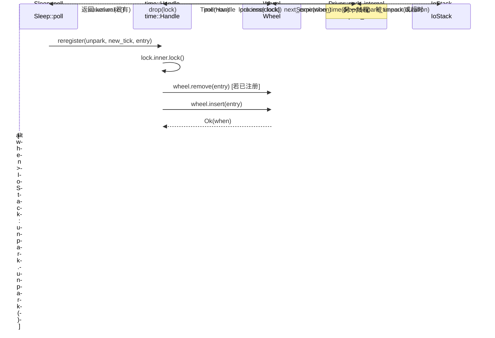

# Capítulo 6: Acionamento por tempo: como a roda do tempo, Sleep e timeout são despertados

No capítulo anterior, rastreamos a cadeia completa de TcpStream::read e vimos como o ScheduledIo traduz eventos de prontidão de fd do epoll em despertar do Waker. Mas o runtime assíncrono ainda precisa lidar com outro tipo de "prontidão": um Future de sleep(100ms) deve ser despertado após 100ms. Esse tipo de evento não vem de um fd do kernel, mas do "tempo em si". A escolha de design do Tokio é tratar o tempo também como um evento de I/O: a struct Driver tem apenas um campo park: IoStack, que reutiliza o mecanismo park/unpark do driver de I/O. Quando a roda do tempo calcula o "próximo instante de expiração", o driver chama park_timeout para fazer a thread dormir até esse instante; após ser despertada, retira os itens expirados da roda do tempo e dispara seus Wakers. Assim, o scheduler precisa apenas de uma entrada unificada de park para aguardar simultaneamente os dois tipos de eventos: "fd pronto" e "temporizador expirado". Este capítulo responde a três perguntas: como os temporizadores são inseridos na roda do tempo? Como a roda do tempo é hierarquizada por tempo de expiração? Como o driver calcula o timeout do próximo park e dispara as tarefas expiradas?

# I. Roda do tempo: estrutura hierárquica de hash com seis níveis de 64 slots

## Modelo intuitivo

Imagine um relógio mecânico: o ponteiro dos segundos dá uma volta e move o ponteiro dos minutos, que dá uma volta e move o ponteiro das horas. Se houvesse apenas um ponteiro de segundos, para representar "12 dias depois" seria preciso contar 1 milhão de marcações; com hierarquia, o ponteiro dos segundos cuida da precisão dentro de 64 segundos, o dos minutos dentro de 64 minutos, o das horas dentro de 64 horas — cada nível precisa apenas de 64 slots para cobrir até 2 anos no futuro.

Sem hierarquia, inserir um temporizador distante exigiria percorrer O(N) ou usar um array gigantesco. A roda do tempo usa "hierarquização por tempo de expiração" para reduzir inserção e disparo a aproximadamente O(1).

## Layout de memória e campos

`Wheel`Os campos principais de são apenas três[FACT:tokio/src/runtime/time/wheel/mod.rs:22-40]：

```rust
pub(crate) struct Wheel {
    elapsed: u64,                          // 自 wheel 创建以来经过的毫秒数
    levels: Box,      // 6 层，每层 64 槽
    pending: LinkedList,      // 已到期、待触发的条目
}
```

`NUM_LEVELS = 6`，`BITS_PER_LEVEL = 6`(ou seja, 64 slots por nível)[FACT:tokio/src/runtime/time/wheel/mod.rs:45-47]。`MAX_DURATION = 1 << (6 * 6) = 1 << 36`milissegundos, cerca de 2 anos[FACT:tokio/src/runtime/time/wheel/mod.rs:50]。

A granularidade dos seis níveis, conforme comentário da documentação, é[FACT:tokio/src/runtime/time/wheel/mod.rs:22-40]：

| Nível | Granularidade do slot | Cobertura |
| --- | --- | --- |
| 0 | 1 ms | 64 ms |
| 1 | 64 ms | ~4 s |
| 2 | ~4 s | ~4 min |
| 3 | ~4 min | ~4 hr |
| 4 | ~4 hr | ~12 day |
| 5 | ~12 day | ~2 yr |

`pending`é uma lista encadeada intrusiva (`LinkedList<TimerShared>`), que armazena itens já retirados da roda e aguardando disparo do Waker. Note que é`LinkedList`em vez de`Vec`: o item em si está embutido em`TimerShared`, e inserção/remoção não requerem alocação.

## Orientado a cenário: inserir um sleep de 100ms

Quando`sleep(100ms)`é pollado pela primeira vez,`Sleep::poll_elapsed`constrói`Timer::new`e chama`init` [FACT:tokio/src/time/sleep.rs:436-440]。`init`que finalmente chama`Handle::reregister`, e então chama`Wheel::insert`。

`insert`O primeiro passo é verificar se já expirou[FACT:tokio/src/runtime/time/wheel/mod.rs:90-98]：

```rust
let when = unsafe { item.sync_when() };
if when  usize {
    const SLOT_MASK: u64 = (1 = MAX_DURATION {
        return NUM_LEVELS - 1;
    }
    masked.ilog2() as usize / BITS_PER_LEVEL
}
```

Aqui usa-se`elapsed ^ when`em vez de`when - elapsed`, uma técnica engenhosa: o bit mais significativo do XOR reflete "a partir de qual bit dois timestamps começam a diferir", ou seja, "qual granularidade é necessária para distingui-los".`| SLOT_MASK`força os 6 bits inferiores para 1, evitando que`ilog2`calcule um nível pequeno demais quando cai no mesmo slot.`ilog2() / 6`mapeia a largura de bits para o número do nível. Se o resultado do XOR exceder`MAX_DURATION`(ou seja, mais de 2 anos), é forçado para o nível mais alto — isso é o "fudge the timer into the top level".

Para um sleep de 100ms, supondo que`elapsed`esteja próximo de 0,`when ≈ 100`，`elapsed ^ when ≈ 100`，`ilog2(100) = 6`，`6 / 6 = 1`, portanto cai na camada 1 (granularidade de 64ms). Isso significa que ele esperará em algum slot da camada 1 até que o tempo avance até a borda desse slot para então ser rebaixado para a camada 0.

## Rebaixamento em cascata: process_expiration

Quando`poll(now)`avança o tempo,`Wheel::poll`chama em loop`next_expiration`e`process_expiration` [FACT:tokio/src/runtime/time/wheel/mod.rs:142-166]：

```rust
pub(crate) fn poll(&mut self, now: u64) -> Option {
    loop {
        if let Some(handle) = self.pending.pop_back() {
            return Some(handle);
        }
        match self.next_expiration() {
            Some(ref expiration) if expiration.deadline  {
                self.process_expiration(expiration);
                self.set_elapsed(expiration.deadline);
            }
            _ => {
                self.set_elapsed(now);
                break;
            }
        }
    }
    self.pending.pop_back()
}
```

`process_expiration`é responsável por "rebaixar" as entradas expiradas de uma camada para a próxima, ou (na camada 0) marcá-las como pending[FACT:tokio/src/runtime/time/wheel/mod.rs:218-251]：

```rust
let mut entries = self.take_entries(expiration);
while let Some(item) = entries.pop_back() {
    match unsafe { item.mark_pending(expiration.deadline) } {
        Ok(()) => {
            self.pending.push_front(item);   // 真正到期
        }
        Err(expiration_tick) => {
            let level = level_for(expiration.deadline, expiration_tick);
            unsafe { self.levels[level].add_entry(item); }  // 下沉到更低层
        }
    }
}
```

`mark_pending`é crucial: ela verifica se o deadline real da entrada já foi atingido. Se atingido, retorna`Ok(())`, a entrada entra na`pending`lista encadeada; se ainda não chegou (apenas a borda do slot foi atingida), retorna`Err(expiration_tick)`, a entrada é reinserida em uma camada mais fina.

Note um ponto enfatizado nos comentários[FACT:tokio/src/runtime/time/wheel/mod.rs:219-228]: é necessário primeiro retirar todas as entradas do slot inteiro antes de processá-las, porque algumas entradas podem ser reinseridas no mesmo slot (isso acontece quando o tempo de inserção excede`MAX_DURATION`, causando wraparound). Se inserir enquanto retira, pode entrar em loop infinito.

## Cálculo do próximo instante de expiração

`next_expiration`Varre da camada inferior para a superior, retornando o primeiro ponto de expiração não vazio[FACT:tokio/src/runtime/time/wheel/mod.rs:169-191]：

```rust
fn next_expiration(&self) -> Option {
    if !self.pending.is_empty() {
        return Some(Expiration { level: 0, slot: 0, deadline: self.elapsed });
    }
    for (level_num, level) in self.levels.iter().enumerate() {
        if let Some(expiration) = level.next_expiration(self.elapsed) {
            debug_assert!(self.no_expirations_before(level_num + 1, expiration.deadline));
            return Some(expiration);
        }
    }
    None
}
```

Se`pending`não estiver vazio, significa que há entradas expiradas aguardando disparo, retorna imediatamente o`elapsed`atual como deadline (assim o driver fará park com timeout 0 e voltará imediatamente para processar). Caso contrário, varre camada por camada, retornando o deadline do primeiro slot com conteúdo.`debug_assert`Valida um invariante: camadas superiores não podem ter pontos de expiração mais cedo que a camada atual.

```mermaid
flowchart TD
    start["Wheel::poll(now)"] --> check_pending{"pending 非空?"}
    check_pending -->|是| pop["pop_back 返回 TimerHandle"]
    check_pending -->|否| next_exp{"next_expiration() 有到期点?"}
    next_exp -->|无| set_elapsed["set_elapsed(now) 后 break"]
    next_exp -->|有| cmp{"expiration.deadline |否| set_elapsed
    cmp -->|是| proc["process_expiration(expiration)"]
    proc --> take["take_entries 取出整槽"]
    take --> mark{"item.mark_pending()"}
    mark -->|Ok 已到期| push_pending["pending.push_front(item)"]
    mark -->|Err 未到期| reinsert["level_for 后 add_entry 下沉"]
    push_pending --> set_elapsed2["set_elapsed(expiration.deadline)"]
    reinsert --> set_elapsed2
    set_elapsed2 --> check_pending
    set_elapsed --> pop2["pending.pop_back() 返回"]
```

---

# II. O loop de park do Driver: conectando o timing wheel à pilha de I/O

## Modelo intuitivo

O timing wheel em si não "anda sozinho". Ele precisa de um loop externo que pergunte repetidamente: "Quando é a próxima expiração?" e então durma até esse momento, acordando depois para avançar o tempo. Esse loop é o`Driver::park_internal`. Ele traduz "a próxima expiração do timing wheel" em uma duração de`park_timeout`, entregando à pilha de I/O subjacente para dormir.

Sem esse loop, os timers nunca seriam disparados — o timing wheel é apenas uma estrutura de dados estática, precisa de alguém para "girá-lo".

## Estrutura de dados: Driver e InnerState

`Driver`tem apenas um campo`park: IoStack` [FACT:tokio/src/runtime/time/mod.rs:90-93]. O estado real está em`Handle`, distinguindo a implementação tradicional da experimental através do enum`Inner`. O[FACT:tokio/src/runtime/time/mod.rs:95-127]da implementação tradicional contém dois campos`InnerState`Cópia[FACT:tokio/src/runtime/time/mod.rs:130-136]：

```rust
struct InnerState {
    next_wake: Option,   // 承诺的最早唤醒时刻
    wheel: wheel::Wheel,
}
```

`next_wake`em vez de`NonZeroU64`aninhamento de`Option<u64>`, para aproveitar a otimização de niche —`Option<NonZeroU64>`e`u64`têm o mesmo tamanho. Ele registra "até qual tick o driver promete acordar", usado para`reregister`ao determinar se precisa`unpark`。

`is_shutdown`é um`AtomicBool`independente, os comentários explicam por que separá-lo do Mutex[FACT:tokio/src/runtime/time/mod.rs:90-93]：`Handle`precisa verificar`is_shutdown`sem travar o mutex. Esta é uma otimização típica de "muitas leituras, poucas escritas" — shutdown acontece apenas uma vez, mas a verificação pode ser frequente.

## Orientado a cenários: o fluxo completo de um park

`park_internal`é o núcleo[FACT:tokio/src/runtime/time/mod.rs:213-256]：

```rust
fn park_internal(&mut self, rt_handle: &driver::Handle, limit: Option) {
    let handle = rt_handle.time();
    let mut lock = handle.inner.lock();
    assert!(!handle.is_shutdown());

    let next_wake = lock.wheel.next_expiration_time();
    lock.next_wake = next_wake.map(|t| NonZeroU64::new(t).unwrap_or_else(|| NonZeroU64::new(1).unwrap()));
    drop(lock);

    match next_wake {
        Some(when) => {
            let now = handle.time_source.now(rt_handle.clock());
            let mut duration = handle.time_source.tick_to_duration(when.saturating_sub(now));
            if duration > Duration::from_millis(0) {
                if let Some(limit) = limit {
                    duration = std::cmp::min(limit, duration);
                }
                self.park_thread_timeout(rt_handle, duration);
            } else {
                self.park.park_timeout(rt_handle, Duration::from_secs(0));
            }
        }
        None => {
            if let Some(duration) = limit {
                self.park_thread_timeout(rt_handle, duration);
            } else {
                self.park.park(rt_handle);
            }
        }
    }

    handle.process(rt_handle.clock());
}
```

Análise passo a passo:

1. **Adquirir lock, ler próxima expiração**：`lock.wheel.next_expiration_time()`retorna`Option<u64>`, ou seja, o próximo tick de expiração. Ao mesmo tempo, escreve em`lock.next_wake`, para`reregister`determinar se precisa de unpark.

2. **Liberar lock**：`drop(lock)`deve ocorrer antes do park, caso contrário outras threads não poderão inserir timers durante o park.

3. **Calcular duração do park**：`when.saturating_sub(now)`obtém o número de ticks restantes,`tick_to_duration`converte para`Duration`. Os comentários indicam que na prática arredonda para cima até 1ms[FACT:tokio/src/runtime/time/mod.rs:228-230], evitando que sleeps em microssegundos sejam tratados pelo SO como duração zero.

4. **Tratar limit**: se o chamador passou`limit`(como`park_timeout`timeout explícito), pega`min(limit, duration)`, garantindo que não durma demais.

5. **Caso especial**: se`duration == 0`(já expirado), usa`park_timeout(0)`para retornar imediatamente, sem realmente dormir.

6. **Sem timers**: se`next_wake`for`None`, com`limit`faz`park_thread_timeout(limit)`, caso contrário`park`。

7. **infinito**：`handle.process(clock)`Processar após acordar

## avança o timing wheel e dispara entradas expiradas.

`process`process_at_time: disparar entradas expiradas`process_at_time` [FACT:tokio/src/runtime/time/mod.rs:296-337]：

```rust
pub(self) fn process_at_time(&self, mut now: u64) {
    let mut waker_list = WakeList::new();
    let mut lock = self.inner.lock();

    if now ) {
    let waker = unsafe {
        let mut lock = self.inner.lock();
        if unsafe { entry.as_ref().might_be_registered() } {
            lock.wheel.remove(entry);
        }
        let entry = entry.as_ref().handle();
        if self.is_shutdown() {
            unsafe { entry.fire(Err(crate::time::error::Error::shutdown())) }
        } else {
            entry.set_expiration(new_tick);
            match unsafe { lock.wheel.insert(entry) } {
                Ok(when) => {
                    if lock.next_wake.is_none_or(|next_wake| when  unsafe {
                    entry.fire(Ok(()))
                },
            }
        }
    };
    if let Some(waker) = waker {
        waker.wake();
    }
}
```

Cópia`next_wake`Lógica-chave: após inserção bem-sucedida, se o novo instante de expiração for mais cedo que`unpark.unpark()`, chama

para acordar o driver. Isso porque o driver pode estar dormindo até um momento mais tardio, precisando ser acordado antecipadamente para recalcular a duração do park.`unpark`Note que**é chamado**segurando o lock`waker.wake()`, enquanto**é chamado**após liberar o lock[FACT:tokio/src/runtime/time/mod.rs:441]. Os comentários explicam`unpark`: é necessário liberar o lock antes de chamar o Waker para evitar deadlock. Mas



---

# Cópia

## III. Sleep e Timeout: a camada de API visível ao usuário

`Sleep`Modelo intuitivo`.await`é o Future que o usuário`Timeout`É um adaptador que envolve outro Future. Eles próprios não gerenciam a roda temporal, apenas traduzem o "deadline" em tick, delegando para`Timer`e`Handle`。

## Layout de memória do Sleep

`Sleep`Usa`pin_project!`macro para definir[FACT:tokio/src/time/sleep.rs:221-227]：

```rust
pub struct Sleep {
    deadline: Instant,
    driver: scheduler::Handle,
    inner: Inner,
    #[pin]
    timer: Option,
}
```

`timer`É`Option<Timer>`e com`#[pin]`: antes do primeiro poll é`None`, o`Timer`só é criado e registrado no primeiro poll. Essa "inicialização preguiçosa" evita acessar o runtime no momento da`sleep()`chamada——`sleep()`pode ser chamado fora do runtime, desde que o registro real ocorra apenas no`.await`.

`PinnedDrop`A implementação garante que o timer seja cancelado no drop[FACT:tokio/src/time/sleep.rs:230-235]：

```rust
impl PinnedDrop for Sleep {
    fn drop(this: Pin) {
        let this = this.project();
        if let Some(timer) = this.timer.as_pin_mut() {
            timer.cancel(this.driver);
        }
    }
}
```

## Fluxo completo do poll_elapsed

`poll_elapsed`É`Sleep`o núcleo do[FACT:tokio/src/time/sleep.rs:396-454]：

```rust
fn poll_elapsed(self: Pin, cx: &mut task::Context) -> Poll> {
    ready!(crate::trace::trace_leaf());
    let mut this = self.project();

    // coop 预算
    let coop = ready!(crate::task::coop::poll_proceed(cx));

    let handle = this.driver;
    let timer = match this.timer.as_mut().as_pin_mut() {
        Some(timer) => timer,
        None => {
            let time_source = handle.driver().time().time_source();
            let deadline = time_source.deadline_to_tick(*this.deadline);
            let timer = Timer::new(handle, deadline);
            this.timer.set(Some(timer));
            let mut timer = this.timer.as_pin_mut().unwrap();
            timer.as_mut().init(handle, deadline);
            timer
        }
    };

    let result = timer.poll_elapsed(cx, handle).map(move |r| {
        coop.made_progress();
        r
    });
    result
}
```

Passo a passo:

1. **Verificação do orçamento de coop**：`poll_proceed(cx)`Consome um orçamento de cooperação. Se o orçamento se esgotar, retorna`Pending`e cede o controle de execução. Este é o mecanismo do Tokio para evitar que uma única tarefa inane as outras.

2. **Criação preguiçosa do Timer**: se`timer`é`None`, converte`deadline`em tick, cria`Timer`e chama`init`para registrar na roda temporal.

3. **Delega para Timer::poll_elapsed**: a verificação real de expiração é feita por`Timer`.

4. **Marca progresso após sucesso**：`coop.made_progress()`indica que este poll teve progresso real.

## Poll do Timeout: primeiro poll do valor, depois poll do delay

`Timeout`A ordem de poll do[FACT:tokio/src/time/timeout.rs:210-224]：

```rust
fn poll(self: Pin, cx: &mut task::Context) -> Poll {
    let me = self.project();
    let had_budget_before = coop::has_budget_remaining();

    // 先 poll 被包裹的 future
    if let Poll::Ready(v) = me.value.poll(cx) {
        return Poll::Ready(Ok(v));
    }

    match me.delay.as_pin_mut() {
        Some(delay) => poll_delay(had_budget_before, delay, cx).map(Err),
        None => Poll::Pending,
    }
}
```

Copiar[FACT:tokio/src/time/timeout.rs:24-26]O comentário afirma explicitamente`Ok`: o future é pollado primeiro, e só depois a expiração é verificada. Portanto, se o future completar sem yield, ele pode retornar

`poll_delay`mesmo após exceder o timeout. Esta é uma escolha de design, não um bug.[FACT:tokio/src/time/timeout.rs:229-251]：

```rust
fn poll_delay(had_budget_before: bool, delay: Pin, cx: &mut task::Context) -> Poll {
    let delay_poll = || match delay.poll(cx) {
        Poll::Ready(()) => Poll::Ready(Elapsed::new()),
        Poll::Pending => Poll::Pending,
    };

    let has_budget_now = coop::has_budget_remaining();

    if let (true, false) = (had_budget_before, has_budget_now) {
        // 如果预算是被底层 future 耗尽的，用无约束预算 poll delay
        coop::with_unconstrained(delay_poll)
    } else {
        delay_poll()
    }
}
```

Copiar`poll`Lógica: se ao entrar em`Pending`ainda houver orçamento, mas após o poll do value o orçamento se esgotar, significa que o value consumiu o orçamento. Nesse caso, se pollar o delay com orçamento restrito, o delay pode retornar`with_unconstrained`imediatamente, impossibilitando determinar se o timeout foi atingido. Por isso usa-se[FACT:tokio/src/time/timeout.rs:243-246]。

## para suspender temporariamente a restrição de orçamento. O comentário chama isso de "pathological cases"

`timeout`Tratamento de overflow do deadline do timeout`checked_add`A função usa[FACT:tokio/src/time/timeout.rs:86-99]：

```rust
Timeout {
    value: future.into_future(),
    delay: match Instant::now().checked_add(duration) {
        Some(deadline) => Some(Sleep::new_timeout(deadline, trace::caller_location())),
        None => None,
    },
}
```

Copiar`Instant::now() + duration`Se`delay`overflow (duration extremamente grande),`None`torna-se`Poll::Pending` [FACT:tokio/src/time/timeout.rs:222], e o poll retorna

---

# diretamente. Isso equivale a "nunca expirar", um comportamento de degradação razoável.

**Reflexões de design e armadilhas em produção** `elapsed ^ when`Por que usar XOR em vez de subtração para calcular o nível?`when - elapsed`O bit mais significativo de`elapsed`reflete diretamente "a partir de qual bit os dois timestamps diferem", que é exatamente a medida de "quão grossa a granularidade precisa ser". A subtração`when`quando`ilog2`está próximo de

**tem todos os bits altos em 0,** [FACT:tokio/src/runtime/time/mod.rs:301-309]calcularia um nível muito pequeno. O XOR lida naturalmente com cenários de wraparound.`Instant`Necessidade da proteção contra retrocesso temporal`Instant`: Rust garante que`now = lock.wheel.elapsed()`é monotônico, mas o SO subjacente pode não garantir. Em uma VM Linux hospedada no Windows, a std confia no relógio de hardware, causando retrocesso de`set_elapsed`. Tokio usa

**para clampear, evitando falha de assert em** [FACT:tokio/src/runtime/time/mod.rs:319]Despertar em lote e deadlock`Sleep::reset`: chamar Waker enquanto se mantém o lock da roda temporal é perigoso——o Waker pode disparar o re-poll da tarefa, que por sua vez chama`WakeList`, tentando adquirir novamente o lock da roda temporal, causando deadlock.

**`next_wake`O mecanismo de lote de** [FACT:tokio/src/runtime/time/mod.rs:130-136]：`Option<NonZeroU64>`libera temporariamente o lock quando cheio, sendo o padrão "callback fora do lock".`u64`Otimização de niche do`None`tem o mesmo tamanho que`NonZeroU64::new(t).unwrap_or_else(|| NonZeroU64::new(1).unwrap())`, pois 0 é usado como niche de[FACT:tokio/src/runtime/time/mod.rs:221]. Mas tick 0 é um valor válido, então o código usa

**`process_expiration`para mapear 0 para 1** [FACT:tokio/src/runtime/time/wheel/mod.rs:219-228]. Este é um tratamento de borda sutil: tick 0 é tratado como tick 1, causando no máximo 1ms de despertar extra.`MAX_DURATION`O "pegar antes de processar" do

**`Timeout`: é necessário retirar todas as entradas do slot antes de processá-las, pois entradas que excedem** [FACT:tokio/src/time/timeout.rs:24-26]fazem wraparound e são reinseridas no mesmo slot. Se inserir enquanto retira, haveria loop infinito.`Ok`Armadilha da ordem de poll do`timeout`: o future é pollado primeiro, a expiração é verificada depois. Se o future for CPU-intensivo e não fizer yield, ele pode retornar

---

# mesmo após exceder o timeout. Em produção, não dependa de

para forçar a interrupção de futures não cooperativos.

1. **Resumo do capítulo**（`Wheel`Este capítulo desmontou a estrutura de três camadas do driver de tempo do Tokio:`elapsed ^ when`Roda temporal`pending`): estrutura hierárquica de hash com seis níveis de 64 slots, usando a largura de bits de`process_expiration`para determinar o nível da entrada, com inserção e disparo aproximadamente O(1).

2. **Driver**（`Driver::park_internal`A lista encadeada armazena entradas expiradas,`next_expiration_time`é responsável pelo afundamento nível a nível.`park_timeout`): traduz o`process_at_time`da roda temporal em duração

3. **, reutilizando o park/unpark da pilha de I/O.**（`Sleep` / `Timeout`）：`Sleep`Avança a roda temporal após o despertar, dispara Wakers em lote, e trata retrocesso temporal e proteção contra deadlock.`Timer`API do usuário`Timeout`Cria`with_unconstrained`preguiçosamente e registra,

polla o value primeiro e depois o delay, usando`next_wake`para tratar cenários de esgotamento de orçamento.`reregister`O design central é "tempo também é um evento de I/O": o driver tem apenas um ponto de entrada park, aguardando simultaneamente fd pronto e timer expirado.`unpark`registra o instante de despertar prometido,

ao inserir um timer mais cedo,`Mutex`、`Semaphore`desperta o driver para recalcular.

# No próximo capítulo entraremos nas primitivas de sincronização:

como`Wheel::insert`e canais implementam espera assíncrona. Você verá como eles reutilizam o mecanismo Waker deste capítulo, e como "contagem de permissões" e "fila de espera" cooperam.`if when <= self.elapsed`Reflexões e autoavaliação deste capítulo`if when < self.elapsed`（remover o sinal de igual），em quais cenários isso faria com que o timer nunca fosse disparado?

**Análise de referência**：`when == self.elapsed`indica que o instante de expiração do timer é exatamente igual ao tempo atual já avançado. O código original usa`<=`para classificá-lo como`Elapsed`, e o chamador dispara imediatamente[FACT:tokio/src/runtime/time/wheel/mod.rs:96-98]. Se for alterado para`<`, este item será inserido na camada calculada por`level_for(elapsed, when)`. Como`elapsed ^ when == 0`，`masked = 0 | SLOT_MASK = 63`，`ilog2(63) = 5`，`5 / 6 = 0`, ele cai na camada 0. Mas o`next_expiration`da camada 0 retornará um slot`deadline >= elapsed`, e a condição de`Wheel::poll`é`expiration.deadline <= now`. Se`now == elapsed`, a condição é satisfeita,`process_expiration`retirará esse item,`mark_pending(elapsed)`verificará se o deadline real foi atingido — neste momento`when == elapsed`，`mark_pending`retorna`Ok`, e o item entra em pending. Portanto, na prática ainda será disparado, mas com uma volta extra. O risco real está em: se`elapsed`já avançou para depois de`when`(`when < elapsed`), o código original retorna`Elapsed`e dispara imediatamente; após a alteração, ele é inserido em um slot que já passou,`next_expiration`pode retornar`deadline < elapsed`，`set_elapsed`, e o assert`elapsed <= when`falhará com panic[FACT:tokio/src/runtime/time/wheel/mod.rs:253-264]. Portanto, esse sinal de igual é a fronteira crítica que evita a falha do assert.

Q2: `process_at_time`Em`WakeList`, depois que`drop(lock)`fica cheio, por que`wake_all()`novamente`lock`e então refazer o

**? Se esse drop for removido, em quais cenários de concorrência ocorreria deadlock?**：`WakeList`Análise de referência[FACT:tokio/src/runtime/time/mod.rs:318-325]coleta Wakers; quando fica cheio, é necessário acordar um lote para liberar espaço`self.inner.lock()`. Se`waker.wake()`for chamado enquanto`Sleep::reset`está sendo mantido, a tarefa acordada pode rodar imediatamente em outra thread (ou no scheduler da mesma thread), chamar`Sleep::poll_elapsed`ou`Handle::reregister`, e então chamar`reregister`, e a primeira coisa que`self.inner.lock()` [FACT:tokio/src/runtime/time/mod.rs:405]faz é`std::sync::Mutex`. Como`process_at_time`não é reentrante, a mesma thread sofrerá deadlock; mesmo em threads diferentes, haverá bloqueio até que`process_at_time`libere o lock, enquanto`wake_all`está esperando[FACT:tokio/src/runtime/time/mod.rs:319]retornar, formando espera circular. O comentário diz explicitamente "To avoid deadlock, we must do this with the lock temporarily dropped"`while let Some(entry) = lock.wheel.poll(now)`. Ao refazer o lock após o drop, o estado da timing wheel pode ter sido modificado por outra thread (por exemplo, um novo timer inserido), então

Q3: `Timeout::poll`continuará retirando itens do novo estado, o que é seguro.`had_budget_before`Em`has_budget_now`, por que a combinação de`(true, false)`e`with_unconstrained`só é usada quando "há orçamento na entrada e não há orçamento após o poll do value"`(false, true)`? Se fosse o contrário

**, o que aconteceria?**：`had_budget_before`Análise de referência[FACT:tokio/src/time/timeout.rs:208-208]，`has_budget_now`registra[FACT:tokio/src/time/timeout.rs:239]。`(true, false)`antes do poll do value; registra`poll_proceed`depois do poll do value.`Pending`significa que o orçamento foi esgotado durante o poll do value, indicando que o value é um "consumidor de orçamento". Nesse caso, se o delay fosse pollado com orçamento restrito,`with_unconstrained`retornaria imediatamente[FACT:tokio/src/time/timeout.rs:247]。`(false, true)`, o delay nunca seria realmente verificado e a detecção de timeout falharia. Portanto, usa-se`with_unconstrained`para remover temporariamente a restrição.`(false, false)`não pode acontecer — o orçamento só pode ser consumido, não restaurado (a menos que haja`Pending`explícito, mas não há aqui).`poll_proceed`significa que não havia orçamento na entrada; nesse caso, o poll do value pode já ter retornado`(true, true)`(porque

falhou), e o delay também é pollado com orçamento restrito; ambos ficam pending, como esperado.
